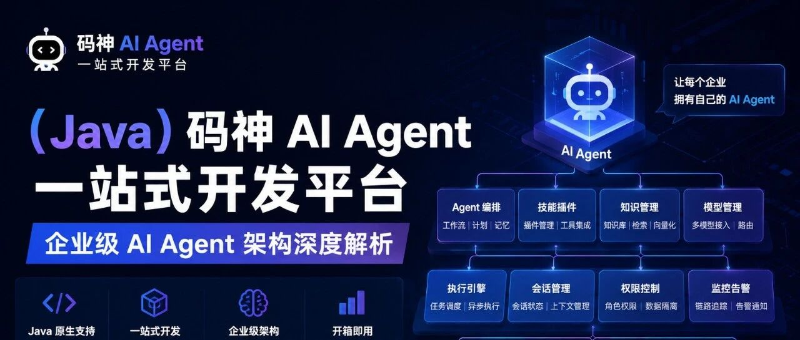

> “
>
> 本文深入拆解码神AI Agent一站式开发平台（Faber）的完整技术架构，从微服务拆分、核心引擎设计到多协议生态，带你理解一个企业级AI Agent平台是如何构建的。
>
> ”

---



## 一、平台定位：不只是Chatbot，而是AI Agent操作系统

在AI大模型爆发后，很多企业都在问：**如何让大模型真正落地到业务场景？**

码神AI Agent一站式开发平台的答案是：**给大模型装上"手脚"和"大脑"，让它从"聊天机器人"进化为"能思考、能行动、能协作"的AI Agent。**

这个平台的核心定位是**AI Agent的操作系统**——它不仅提供对话能力，更提供了一整套Agent生命周期管理的基础设施：从知识库构建、工具编排、工作流设计，到Agent市场、多Agent协作，SKILL支持，覆盖了企业级AI应用的全链路需求。

---

## 二、整体架构：13个模块的微服务矩阵

Faber采用**Spring Cloud Alibaba微服务架构**，整个平台拆分为13个Maven模块，形成清晰的层次结构：

```
mszlu-ai-spring-cloud/
├── faber-gateway/                    # API网关（Spring Cloud Gateway）
├── faber-common/
│   ├── faber-common-core/            # 通用基础（异常、结果封装、工具类）
│   ├── faber-common-security/        # 安全模块（JWT、用户上下文、Feign拦截）
│   └── faber-common-spring-ai/       # AI通用组件（工具注册、MCP客户端、技能框架）
└── faber-service/
    ├── faber-auth-service/           # 认证服务（注册、登录、JWT签发）
    ├── faber-agent-service/          # Agent核心服务（对话、DeepAgent、面试引擎）
    ├── faber-llm-service/            # LLM大模型服务（Provider配置、自定义模型管理）
    ├── faber-tool-service/           # 工具管理服务（内置工具、MCP工具配置、工具测试）
    ├── faber-mcp-service/            # MCP协议服务器
    ├── faber-knowledge-service/      # 知识库服务（RAG）
    ├── faber-a2a-service/            # A2A协议服务（Agent市场）
    ├── faber-skill-service/          # 技能管理服务
    └── faber-workflow-service/       # 工作流编排服务
```

### 技术底座

| 组件 | 版本 | 用途 |
| --- | --- | --- |
| Java | 21 | 虚拟线程支持，高并发处理 |
| Spring Boot | 3.5.13 | 微服务基础框架 |
| Spring Cloud | 2025.0.0 | 服务治理 |
| Spring Cloud Alibaba | 2025.0.0.0 | Nacos服务发现与配置 |
| Spring AI | 1.1.2 | AI抽象层 |
| Spring AI Alibaba | 1.1.2.2 | Agent Framework、Graph引擎 |
| PostgreSQL | 42.7.4 | 业务数据持久化 |
| Milvus | - | 向量数据库（RAG检索） |
| Flyway | 11.3.0 | 数据库版本迁移 |
| MyBatis-Plus | 3.5.15 | ORM框架 |

---

## 三、网关层：统一入口的安全与路由

`faber-gateway`是整个平台的唯一流量入口，基于**Spring Cloud Gateway-WebFlux响应式**实现，承担三个核心职责：

### 1. 动态路由

所有业务服务通过Nacos注册，网关自动发现并实现负载均衡：

```yaml
spring:
  cloud:
    gateway:
      routes:
        - id: agent-service
          uri: lb://faber-agent-service
          predicates:
            - Path=/api/v1/agents/**
          filters:
            - name: AuthFilter   # JWT鉴权
```

### 2. JWT统一鉴权

网关层集成自定义`AuthFilter`，对所有请求进行JWT校验：

- 白名单路径（登录、注册）直接放行
- 其他请求校验JWT Token的合法性与有效期
- 将解析后的用户ID通过Header透传给下游服务

### 3. WebFlux响应式网关

网关基于Spring WebFlux响应式编程模型（`web-application-type: reactive`），所有IO操作非阻塞，天然支持高并发场景。

---

## 四、Agent核心引擎：三种模式的智能分级

`faber-agent-service`是平台的心脏，它的核心创新在于**Agent模式的智能分级**——不是所有任务都需要同样的"智商成本"。

### 模式路由设计

`UnifiedAgentChatService`作为统一入口，根据Agent的`agentMode`字段智能路由：

```java
return switch (mode) {
    case "deep"       -> handleDeepMode(agent, request);       // 深度编排
    case "supervisor" -> handleSupervisorMode(agent, request); // 监督者模式
    default           -> handleGeneralMode(agent, request);    // 通用对话
};
```

### 1. General模式：ReAct对话Agent

适用于日常对话场景，基于Spring AI Alibaba的`ReactAgent`实现ReAct（Reasoning + Acting）模式。Agent在对话过程中可以自主决定何时调用工具、如何组合多步推理，最终给出答案。

### 2. Deep模式：企业级深度编排（核心亮点）

这是Faber最具技术深度的部分。DeepAgent基于**Spring AI Alibaba Agent Framework**的`ReactAgent`，集成了**10+拦截器和钩子**，实现真正的"会思考的Agent"。

#### 拦截器链（Interceptors）——Agent的"神经系统"

| 拦截器 | 作用 | 技术亮点 |
| --- | --- | --- |
| **TodoListInterceptor** | 任务规划与跟踪 | 自动将复杂任务拆解为可执行的子任务清单 |
| **FilesystemInterceptor** | 文件系统访问 | Agent可读写本地文件，实现代码生成、报告输出 |
| **LargeResultEvictionInterceptor** | 大结果驱逐 | 当工具返回结果超过5000token时自动截断，防止上下文溢出 |
| **PatchToolCallsInterceptor** | 工具调用修复 | 自动修复LLM生成的错误工具调用格式 |
| **ToolRetryInterceptor** | 工具重试 | 工具调用失败时自动重试（maxRetries=1） |
| **SubAgentInterceptor** | 子Agent委派 | 将任务动态分配给子Agent执行 |

#### 钩子链（Hooks）——Agent的"认知增强"

| 钩子 | 作用 | 技术亮点 |
| --- | --- | --- |
| **SummarizationHook** | 自动摘要 | 当上下文超过12万token时自动摘要，保留最近6条消息 |
| **HumanInTheLoopHook** | 人工审批 | 对敏感工具调用（如执行命令）要求人工确认 |
| **ToolCallLimitHook** | 调用限制 | 限制单次对话最多25次工具调用，防止无限循环 |
| **ShellToolAgentHook** | Shell安全 | Shell命令执行的安全沙箱 |
| **SkillsAgentHook** | 技能增强 | 动态加载Skills提升Agent专业能力 |

#### 子Agent动态加载

DeepAgent支持从数据库动态加载子Agent配置，实现**多Agent协作**：

```java
// 从deep_config.subAgentIds读取子Agent列表
for (UUID subAgentId : deepConfig.getSubAgentIds()) {
    Agent subAgent = commonService.getAgent(creatorId, subAgentId);
    SubAgentSpec spec = SubAgentSpec.builder()
        .name(subAgent.getName())
        .systemPrompt(subSystemPrompt)
        .model(subChatModel)
        .tools(subTools)
        .build();
    subAgentSpecs.add(spec);
}
```

每个子Agent拥有独立的模型、提示词和工具集，父Agent通过`SubAgentInterceptor`将任务委派给最合适的子Agent。

#### 流式事件处理

DeepAgent支持完整的流式输出，将内部事件转换为前端可展示的多种消息类型：

- **思考消息（Reasoning）**：展示Agent的思维过程（如R1模型的深度思考）
- **文本消息（Content）**：正常的对话回复
- **工具调用消息（ToolCall）**：展示调用的工具名称和参数
- **工具响应消息（ToolResponse）**：展示工具执行结果

#### DeepAgent默认配置

| 配置项 | 默认值 | 说明 |
| --- | --- | --- |
| maxIterations | 10 | 最大迭代轮次 |
| enableTodos | true | 启用任务清单 |
| toolCallLimit | 25 | 工具调用次数上限 |
| enableLargeResultEviction | true | 大结果自动截断 |
| toolTokenLimitBeforeEvict | 5000 | 截断阈值（token） |
| enableSummarization | true | 长对话自动摘要 |
| maxTokensBeforeSummary | 120000 | 触发摘要的token数 |
| messagesToKeep | 6 | 摘要后保留的消息数 |
| enableHumanInTheLoop | false | 人工审批（默认关闭） |

### 3. AI面试官：特殊场景引擎

平台内置了一套完整的**AI面试系统**（`InterviewEngine`），这是一个独立的特殊Agent模式：

- **简历解析**：自动识别简历内容，提取技能、工作经历等关键信息
- **多阶段面试**：支持简历评估 → 技术面试 → 综合评价的完整流程
- **智能评分**：基于LLM对候选人回答进行结构化评分
- **Fallback机制**：LLM不可用时，降级为关键词匹配模式

---

## 五、知识库服务：企业RAG的完整实现

`faber-knowledge-service`实现了生产级的RAG（检索增强生成）系统，核心流程可概括为**ETL + 父子分段 + 向量检索**。

### 文档处理ETL流水线

```
上传文档 → 异步处理 → Extract提取 → Transform分块 → Load向量化
```

#### 1. Extract：多格式文档提取

支持PDF、Word、Markdown、HTML、纯文本等多种格式，使用Spring AI的DocumentReader自动识别文件类型并提取内容。

#### 2. Transform：智能分块策略（策略模式）

Faber的分块不是简单的固定长度切割，而是根据文件类型选择最优策略：

| 策略 | 适用格式 | 分块逻辑 |
| --- | --- | --- |
| **MarkdownHeadingChunkingStrategy** | .md | 按标题层级分块，保持文档结构 |
| **HtmlDocumentChunkingStrategy** | .html | 按DOM结构分块 |
| **PdfPageChunkingStrategy** | .pdf | 按页分块 |
| **WordDocumentChunkingStrategy** | .docx | 按段落分块 |
| **GeneralTextChunkingStrategy** | .txt等 | 通用文本分块 |

*注：父子分段中，父块最小长度512字符，子块更细粒度用于向量检索。*

#### 3. 父子分段：检索精度与上下文完整性的平衡

这是Faber RAG的核心创新之一：

- **子块（Child Chunk）**：细粒度分块，用于向量检索，提高命中精度
- **父块（Parent Chunk）**：粗粒度分块，存储完整上下文，用于最终返回给LLM
- **检索逻辑**：用子块做相似度搜索，命中后返回对应的父块内容

```java
// 命中子块时，查找对应父块返回
if ("child".equals(chunkLevel)) {
    String parentId = metadata.get("parent_id");
    DocumentChunk parentChunk = findParentChunkById(parentId);
    // 返回父块内容 + 前后相邻块（上下文扩展）
}
```

#### 4. Load：Milvus向量存储

- 动态创建Collection，按知识库维度配置
- 支持多Embedding模型（OpenAI、通义千问等）
- 向量检索Top 10 + 相似度阈值过滤

---

## 六、工具管理服务：Agent能力的注册中心

`faber-tool-service` 是平台的**工具注册与管理中心**。如果说 MCP 协议是工具生态的"USB接口标准"，那么 tool-service 就是 Agent 的"工具箱管理员"——它统一管理 Agent 可调用的所有工具，包括平台**内置工具**和**外部 MCP 工具**。

### 与 MCP 服务的本质区别

需要澄清一个容易混淆的概念：

| 维度 | faber-tool-service（工具管理） | faber-mcp-service（MCP协议服务） |
| --- | --- | --- |
| **定位** | 工具注册中心 + 配置管理中心 | MCP 协议实现层 |
| **职责** | 管理工具元数据、配置、测试、发现 | 对外暴露标准 MCP 接口 |
| **工具来源** | 内置工具（@Tool扫描）+ MCP服务器配置 | 本地声明的 @Tool 方法 |
| **对外服务** | REST API 供前端/Agent服务调用 | MCP Streamable HTTP/SSE 协议 |
| **典型场景** | 用户在平台配置一个外部 MCP 服务器地址或者内置工具 | 其他 AI 应用通过 MCP 协议调用本平台工具 |

简单说：**tool-service 是"管理工具的"，mcp-service 是"被管理的工具之一（通过协议暴露）"**。

### 双模工具体系

tool-service 支持两类工具，统一存储在 `tools` 表中：

#### 1. 内置工具（Internal）

通过 `ToolRegistry` 自动扫描 Spring 上下文中所有标注 `@Tool` 注解的方法：

```java
@EventListener(ContextRefreshedEvent.class)
public void onContextRefreshed(ContextRefreshedEvent event) {
    scanAndRegister(context); // 扫描并注册所有 @Tool 方法
}
```

内置工具的优势是**零配置**——开发者在任何 Spring Bean 中声明 `@Tool` 方法，平台自动识别其名称、描述、参数 Schema，无需手动录入。

#### 2. MCP 工具（MCP）

通过配置外部 MCP 服务器信息来接入第三方工具生态：

```java
public class Tool {
    private String name;
    private String toolType;        // "internal" 或 "mcp"
    private String mcpConfig;       // JSONB：{type, url, endpoint, authenticationRequired...}
    private String parametersSchema; // JSONB：参数结构定义
    private Boolean isEnable;
}
```

当用户将一个 MCP 服务器配置为 Tool 后，平台通过 `McpClientService` 动态连接该服务器，拉取可用工具列表并展示给 Agent 使用。

### 核心能力

#### 工具生命周期管理

提供完整的 REST API 对工具进行 CRUD：

| 接口 | 功能 |
| --- | --- |
| `POST /api/v1/tools` | 创建工具（内置或 MCP） |
| `PUT /api/v1/tools/{id}` | 更新工具信息 |
| `DELETE /api/v1/tools/{id}` | 删除工具 |
| `GET /api/v1/tools` | 分页查询（支持按名称、类型过滤） |

#### 工具在线测试

```java
@PostMapping("/{id}/test")
public Result<ToolTestResponse> testTool(
        @PathVariable UUID id,
        @RequestBody ToolTestRequest request)
```

支持直接传入参数，平台通过 Java 反射调用真实的 `@Tool` 方法，即时返回执行结果。

#### 动态 MCP 工具发现

```java
public List<ToolResponse> getMcpTools(UUID mcpId) {
    // 1. 读取 tool 表中存储的 MCP 服务器配置
    // 2. 通过 McpClientService 连接外部 MCP 服务器
    // 3. 拉取工具列表并转换为平台统一的 ToolResponse 格式
}
```

这意味着：**平台可以不写一行代码，仅通过配置 MCP 服务器地址，就能将外部工具生态接入到 Agent 中。**

### 数据模型设计

`tools` 表采用 JSONB 字段存储动态结构，兼顾两种工具类型：

| 字段 | 类型 | 说明 |
| --- | --- | --- |
| `name` | VARCHAR | 工具唯一标识 |
| `tool_type` | VARCHAR | `internal` / `mcp` |
| `parameters_schema` | JSONB | 参数结构（自动从内省或 MCP 服务器获取） |
| `mcp_config` | JSONB | MCP 连接配置（仅 mcp 类型有值） |
| `is_enable` | BOOLEAN | 启用状态 |

---

## 七、A2A协议：Agent间的"普通话"

`faber-a2a-service`实现了Google提出的**A2A（Agent-to-Agent）协议**，让不同Agent能够互相发现和通信。

### Agent市场

- 每个Agent可以发布自己的`AgentCard`（能力名片）
- 其他Agent可以通过A2A协议发现并调用
- 支持Agent的添加、删除、查询管理

### 远程Agent即工具

在`faber-agent-service`中，市场Agent通过`A2aRemoteToolCallback`被封装为本地工具：

```java
// A2A远程Agent作为工具被调用
A2aRemoteToolCallback remoteTool = new A2aRemoteToolCallback(agentCard);
toolCallbacks.add(remoteTool);
```

这意味着：**一个Agent可以无缝调用另一个Agent的能力，就像调用本地函数一样。**

---

## 八、MCP协议：工具生态的标准接口

`faber-mcp-service`实现了**MCP（Model Context Protocol）协议**，这是AI工具领域的"USB接口"标准。

### 设计特点

- **Streamable HTTP传输**：支持无状态/有状态两种模式
- **声明式工具注册**：通过`@Tool`注解自动暴露方法为MCP工具
- **动态扩展**：新增工具只需创建Service类 + 配置注册

### 内置工具示例

| 工具 | 功能 |
| --- | --- |
| `getCurrentTime` | 获取服务器时间 |
| `add/subtract/multiply/divide` | 四则运算 |
| `getWeather` | 天气查询 |

MCP服务独立部署后，任何支持MCP协议的AI应用都可以直接调用这些工具。

---

## 九、工作流引擎：可视化编排的StateGraph

`faber-workflow-service`基于**Spring AI Alibaba Graph框架**实现了可视化工作流引擎，核心设计思想来自LangGraph。

### 核心概念

- **StateGraph**：有向图，节点代表处理步骤，边代表数据流向
- **OverAllState**：共享状态对象，所有节点读写同一状态
- **KeyStrategy**：状态更新策略（Replace覆盖 / Append追加）
- **sourceHandle → targetHandle**：节点间的字段映射

### 工作流执行流程

```
前端图数据(nodes + edges)
    ↓
解析为WorkflowGraph（开始节点、业务节点、结束节点、边关系）
    ↓
构建StateGraph（每个节点创建AsyncNodeAction）
    ↓
编译并执行（compiledGraph.invoke()）
    ↓
提取最终结果
```

### 节点类型

| 节点 | 功能 |
| --- | --- |
| **START/END** | 工作流起点和终点 |
| **TextDisplayNode** | 文本展示 |
| **HTMLDisplayNode** | HTML渲染 |
| **TextCombineNode** | 文本合并（支持多种模板引擎） |
| **QwenVLNode** | 通义千问视觉模型调用 |
| **CrawlerNode** | 网页爬虫/数据采集 |
| **OllamaNode** | 本地Ollama模型调用 |
| **AudioNode** | 音频处理 |
| **VideoNode** | 视频处理 |
| **FileNode** | 文件读写 |
| **DatabaseNode** | 数据库操作 |
| **StorageNode** | 对象存储操作 |
| **WorkflowNode** | 嵌套子工作流 |

### 模板引擎支持

TextCombineNode支持5种模板引擎：

- **FreeMarker**：企业级模板引擎
- **Mustache**：逻辑-less模板
- **Go Template**：类Go语法
- **FString**：Python风格f-string
- **SimplePlaceholder**：简单`${变量}`替换

---

## 十、技能系统：Anthropic Agent Skills 生态

平台的技能系统基于 **Anthropic（Claude 母公司）开源的 Agent Skills 标准**实现，这是当前 Agent 领域最热门的技术方向之一，已被 Spring AI Alibaba、LangGraph 等主流框架原生支持。

### 什么是 Agent Skills？

Agent Skills 是 Anthropic 提出的一种**可复用 Agent 能力包**规范。每个 Skill 是一个自包含的文件夹，核心是一个 `SKILL.md` 文件：

```yaml
---
name: my-skill-name
description: 清晰描述该技能的用途和使用时机
---

# 技能名称

[Claude/Agent 在激活该技能时会遵循的指令]

## Examples
- 示例用法 1
- 示例用法 2

## Guidelines
- 指导原则 1
- 指导原则 2
```

SKILL.md 采用 **YAML frontmatter + Markdown instructions** 的标准格式，包含：

- **name**：技能唯一标识
- **description**：技能功能描述（Agent 决定是否调用该技能的依据）
- **instructions**：具体的执行指令、示例和指导原则

### 技能目录结构

一个完整的 Skill 目录可以包含可选的 bundled resources：

```
skill-name/
├── SKILL.md              # 必需，技能定义文件
├── scripts/              # 可选，可执行脚本（确定性/重复性任务）
├── references/           # 可选，参考文档（按需加载到上下文）
└── assets/               # 可选，输出模板、图标、字体等
```

### 技能来源

`faber-skill-service` 支持两种技能获取方式：

1. **本地技能**：从 `public_skills` 公共目录读取，使用 Spring AI Alibaba 的 `SkillScanner` 解析 SKILL.md 元数据
2. **GitHub 远程安装**：通过 JGit 克隆仓库，自动解析 SKILL.md 并复制到用户私有目录

### 技能生命周期

```
创建/安装 → SkillScanner解析SKILL.md → 复制到用户目录 → 绑定到Agent → SkillsAgentHook运行时加载 → 注入System Prompt
```

### 运行时加载机制

当 Agent 对话启动时，`SkillsAgentHook` 会：

1. 从 `FileSystemSkillRegistry` 读取用户目录下的所有 Skill
2. 通过 `FilteringSkillRegistry` 过滤出当前 Agent 绑定的 Skill
3. 将 SKILL.md 中的 instructions 动态注入到 System Prompt 中
4. Agent 根据对话内容自主决定是否调用某个 Skill 的能力

这意味着：**Agent 不是预加载固定工具，而是根据场景动态加载专业技能包**，让同一个 Agent 在不同对话中可以展现完全不同的专业能力。

---

## 十一、安全与基础设施

### 统一认证体系

- **JWT Token**：Access Token（1天有效期）+ Refresh Token（7天有效期）
- **UserContext**：基于ThreadLocal的用户上下文，自动透传到Feign调用
- **网关鉴权**：统一在Gateway层拦截，下游服务信任透传的用户ID

### 数据库设计

- **PostgreSQL**：所有业务数据持久化
- **Flyway迁移**：版本化数据库脚本，支持团队协作
- **JSONB字段**：灵活存储Agent配置、DeepConfig等动态结构

### 公共模块复用

| 模块 | 职责 |
| --- | --- |
| **faber-common-core** | 统一异常体系、结果封装（Result）、工具类 |
| **faber-common-security** | JWT工具、UserContext、Feign安全拦截器 |
| **faber-common-spring-ai** | MCP客户端管理、工具注册中心、文件/Git工具 |

---

## 十二、K8s 云原生部署与 AI 运维

Faber 不仅是架构上支持云原生，更在**部署实践**和**运维智能化**两个维度深度融合 Kubernetes。

### K8s 云原生部署架构

平台提供完整的生产级 K8s 部署方案，所有微服务以容器化方式运行在 Kubernetes 集群中：

#### 基础设施层

| 组件 | K8s 资源类型 | 说明 |
| --- | --- | --- |
| PostgreSQL | StatefulSet + PVC | 业务数据持久化 |
| Redis | Deployment + PVC | 缓存与会话存储 |
| Milvus | Deployment + PVC | 向量数据库 |
| Etcd | Deployment | 配置/协调服务 |
| MinIO | Deployment + PVC | 对象存储 |
| NFS Provisioner | Helm Chart | 动态存储供给 |

#### 微服务层

所有业务服务统一以 **Deployment** 形式部署，每个服务包含：

- **资源限制**：requests/limits 精确配置（如 512Mi ~ 1Gi 内存，250m ~ 500m CPU）
- **健康探针**：Liveness、Readiness、Startup 三级探针保障服务可用性
- **配置外置**：通过 ConfigMap 管理 `application.yml`，实现配置与镜像解耦
- **服务发现**：K8s Service 替代 Eureka，配合 Spring Cloud Kubernetes 实现服务注册发现

```yaml
# 典型微服务 Deployment 配置
spec:
  replicas: 2
  template:
    spec:
      containers:
      - name: agent-service
        image: harbor/mszlu-ai/faber-agent-service:v1.0.0
        resources:
          requests: { memory: "512Mi", cpu: "250m" }
          limits: { memory: "1Gi", cpu: "500m" }
        livenessProbe:
          httpGet: { path: /actuator/health/liveness, port: 8081 }
        readinessProbe:
          httpGet: { path: /actuator/health/readiness, port: 8081 }
```

#### 弹性伸缩：HPA

核心服务配置 **HorizontalPodAutoscaler**，基于 CPU 利用率自动扩缩容：

| 服务 | 最小副本 | 最大副本 | CPU 阈值 |
| --- | --- | --- | --- |
| Gateway | 2 | 5 | 70% |
| Agent Service | 2 | 10 | 70% |
| LLM Service | 2 | 10 | 70% |

#### 入口流量：Ingress-Nginx

网关通过 Ingress 暴露到集群外，统一管理域名、SSL 终止和路由规则：

```yaml
spec:
  rules:
  - host: api.faber.ai
    http:
      paths:
      - path: /
        backend:
          service:
            name: faber-gateway-service
            port: { number: 8888 }
```

#### GitOps 交付

采用 **Kustomize + ArgoCD** 的 GitOps 模式：

- 应用仓库（Java 源码）与 GitOps 仓库（K8s YAML）分离
- CI 构建镜像后自动更新 GitOps 仓库的镜像标签
- ArgoCD 自动同步到集群，支持一键回滚到任意历史版本

### 内置 K8s AI 运维工具

Faber 最具特色的能力之一：**Agent 本身就是一位 K8s 运维专家**。平台内置了 `K8sOpsTools`，通过 `K8sClientConfig` 与集群建立连接，让 Agent 可以直接对话式地操作 Kubernetes。

#### 双模式客户端配置

```java
@Bean
public KubernetesClient kubernetesClient() {
    if (isInCluster()) {
        // 集群内模式：通过 ServiceAccount 自动认证
        config = new ConfigBuilder().withTrustCerts(true).build();
    } else {
        // 集群外模式：回退到 kubeconfig 文件
        config = Config.fromKubeconfig(kubeconfigPath);
    }
    return new KubernetesClientBuilder().withConfig(config).build();
}
```

Agent 既可以在 K8s 集群内以 Pod 形式运行（自动使用 ServiceAccount），也可以在本地开发环境通过 kubeconfig 连接远程集群。

#### 四大运维工具集

| 工具 | 功能 | 典型使用场景 |
| --- | --- | --- |
| **`k8s_resource_query`** | 查询 Pod、Deployment、Service、Node、ConfigMap、Secret | "查看 default 命名空间下所有 Pod 的状态" |
| **`k8s_logs_query`** | 查看容器日志，支持 tail 行数、时间范围、崩溃容器 | "查看 agent-service 最近 100 行日志" |
| **`k8s_resource_action`** | 重启 Deployment、扩缩容、删除 Pod | "将 agent-service 扩容到 5 个副本" |
| **`k8s_health_check`** | 集群健康检查：节点状态、Pod 状态、异常事件 | "检查集群是否有异常 Pod 或 Warning 事件" |

这意味着：**运维人员可以用自然语言与 Agent 交互，Agent 自动翻译为 K8s API 调用并返回结果**。例如：

> "
>
> "帮我检查生产环境有没有异常的 Pod，如果有的话把它们的日志拉出来看看"
>
> "

Agent 会：

1. 调用 `k8s_health_check` 扫描所有命名空间的 Pod 状态
2. 发现 Failed 状态的 Pod
3. 自动调用 `k8s_logs_query` 拉取这些 Pod 的日志
4. 汇总分析后给出诊断结论

这种**"对话式运维"**模式大幅降低了 K8s 的操作门槛，让不熟悉 kubectl 的开发者也能高效管理集群。

---

## 十三、架构演进路线

Faber的架构设计体现了清晰的演进思路：

### 第一阶段：单Agent对话（General模式）

基础ReactAgent封装，支持系统提示词、工具调用、知识库检索。

### 第二阶段：深度编排（Deep模式）

引入Spring AI Alibaba Agent Framework，构建拦截器链 + 钩子链，实现任务规划、自动摘要、子Agent委派。

### 第三阶段：多Agent协作（A2A + SubAgent）

通过A2A协议实现Agent市场，通过SubAgentInterceptor实现父子Agent协作。

### 第四阶段：可视化工作流（Workflow）

基于StateGraph的可视化编排，支持复杂业务流程的图形化设计。

### 第五阶段：技能生态（Skills）

标准化技能包管理，支持社区共享与远程安装。

---

## 十四、总结：为什么这个架构值得学习

码神AI Agent一站式开发平台的架构设计有以下几个值得借鉴的核心思想：

### 1. 分层抽象，逐层增强

从General到Deep到Supervisor，不是替换而是叠加。简单场景用轻量模式，复杂场景启用深度编排，**让架构复杂度与业务复杂度匹配**。

### 2. 协议驱动，生态开放

同时支持A2A（Agent间通信）和MCP（工具标准）两大开放协议，**不与任何厂商绑定**，构建开放的Agent生态。

### 3. 微服务边界清晰

每个服务只负责一个核心领域：Agent管编排、Knowledge管RAG、Workflow管流程、Skill管能力包。**服务间通过Feign + Nacos协作，避免单点膨胀**。

### 4. 云原生与 AI 运维深度融合

不仅支持完整的 K8s 云原生部署（HPA、Ingress、GitOps），更将 K8s 运维能力内置为 Agent 工具，实现**"AI 平台运行在云上，AI itself 管理云"**的闭环。

### 5. 生产级细节考量

- 父子分段检索平衡精度与上下文
- 异步线程池处理文档ETL
- 大结果驱逐防止上下文溢出
- 自动摘要解决长对话问题
- Flyway管理数据库版本

---

> “
>
> **Faber的架构告诉我们：构建企业级AI Agent平台，不是简单地调用OpenAI API，而是需要一套完整的基础设施——从对话引擎到知识库，从工具生态到工作流编排，从单Agent到多Agent协作，再到云原生部署与智能运维。这才是AI Agent从Demo走向生产的必经之路。**
>
> ”
