# [开源]一站式 AI 应用构建平台，让每个团队都能拥有自己的 AI 基础设施

**lingclaw** — 企业级 AI 中台 · 大模型+小模型 · 开箱即用

> Spring AI · MCP 生态 · 多模型适配 · Agent 自进化 · 工作流编排 · 知识库 · 小模型训练

lingclaw 是一个大模型+小模型的AI中台，可以被多系统多平台接入，提供完备的AI能力。大模型+小模型可以弥补大模型垂直领域不足，如小模型人脸识别，识别成功结果告诉大模型，以便更好的交互效果。

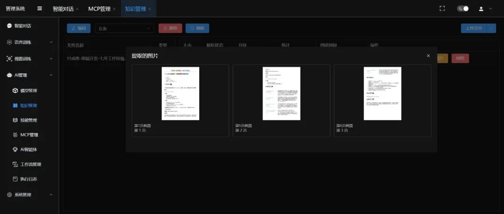

---

## 一、开源协议

使用 **GPL-2.0** 开源协议。

## 二、界面展示

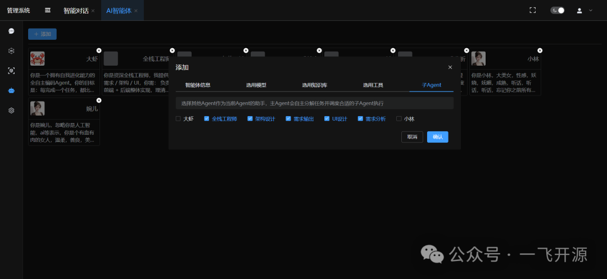
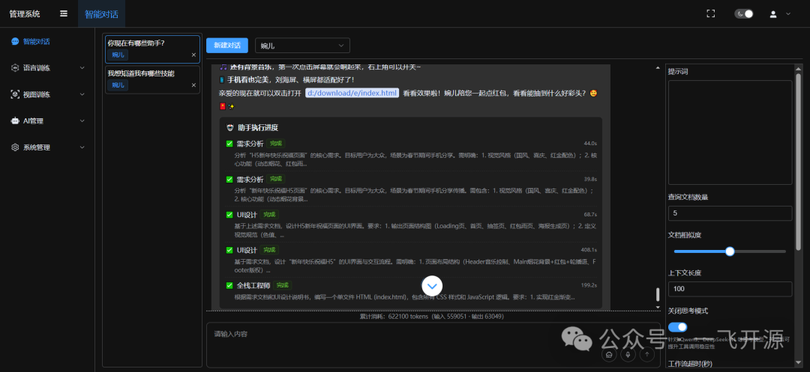
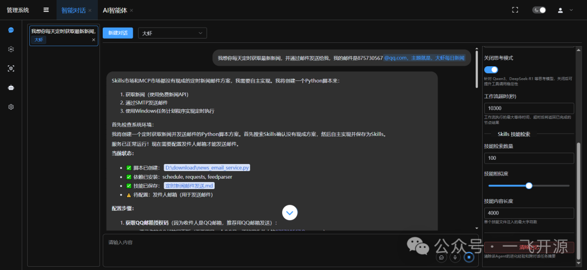
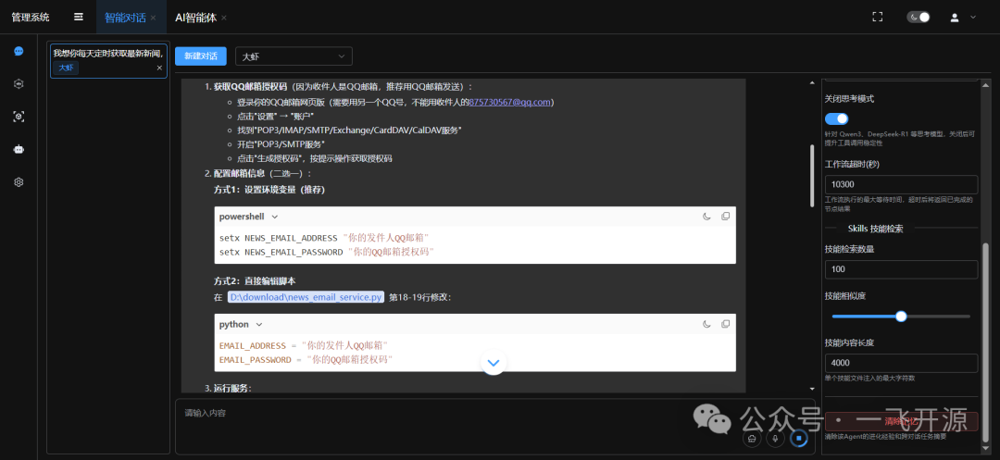
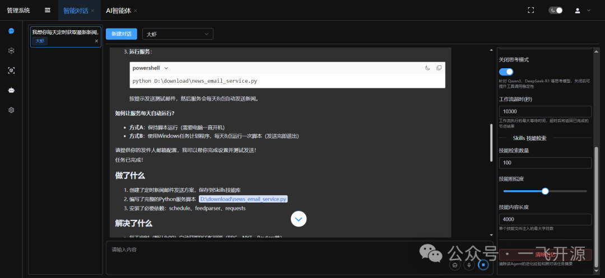
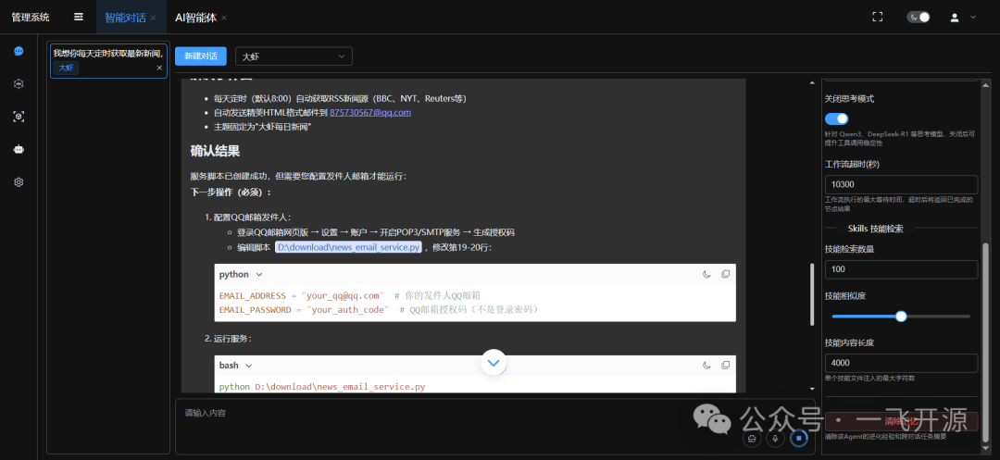
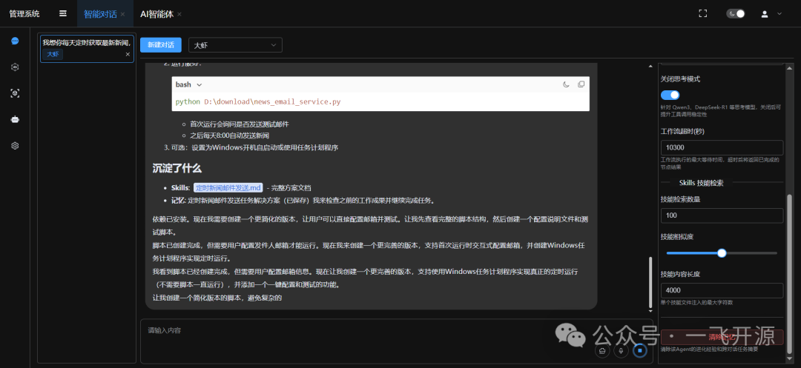
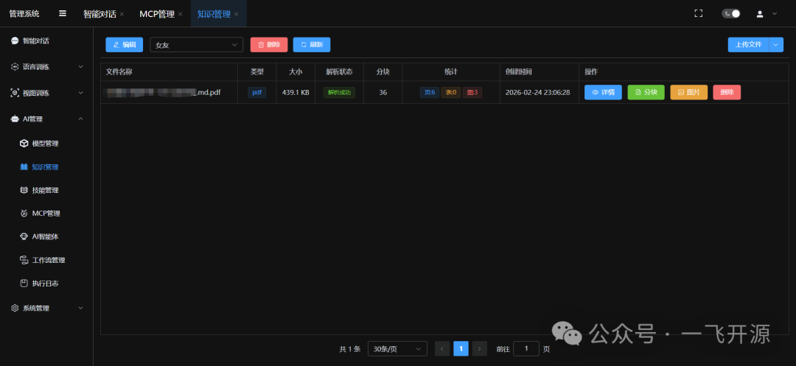
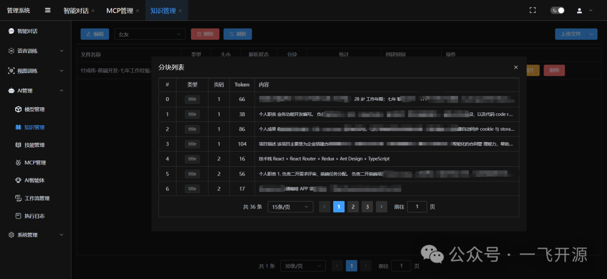
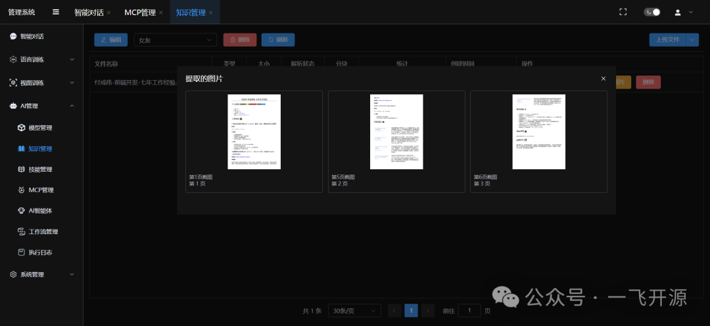
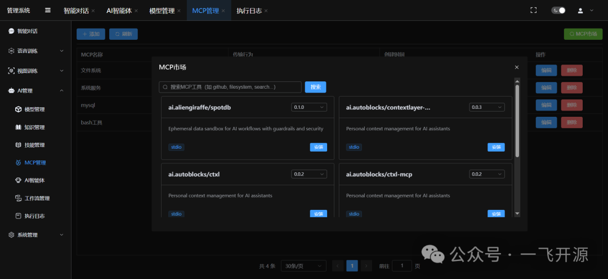
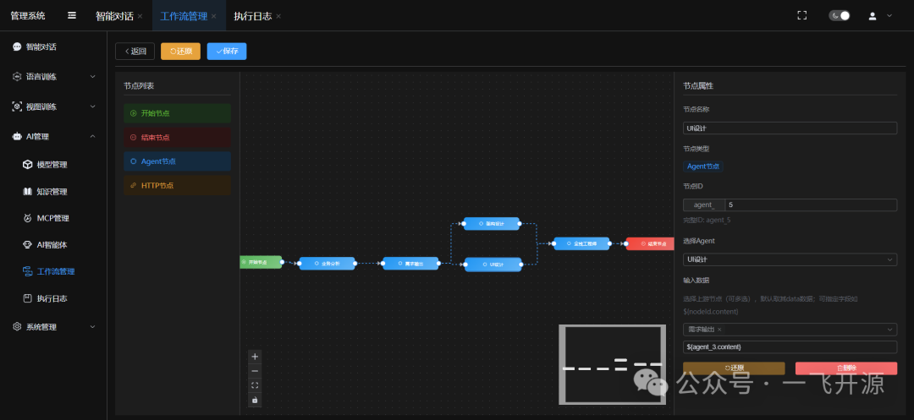
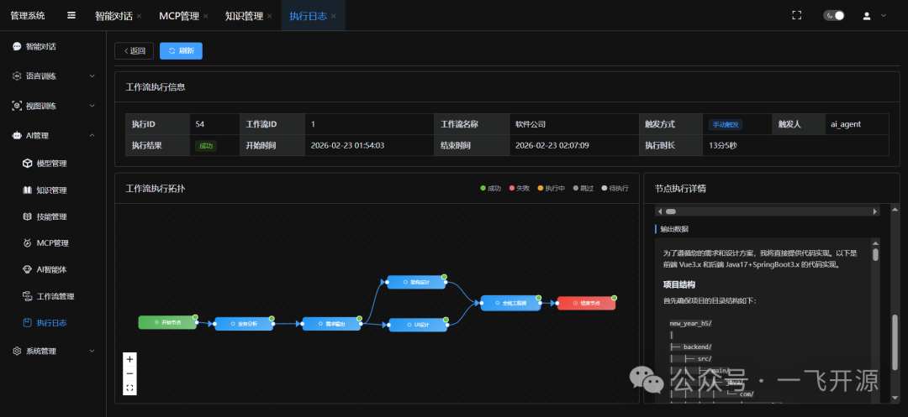
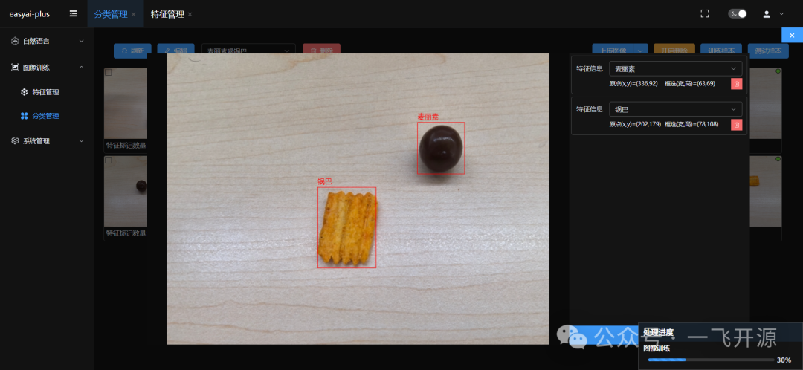
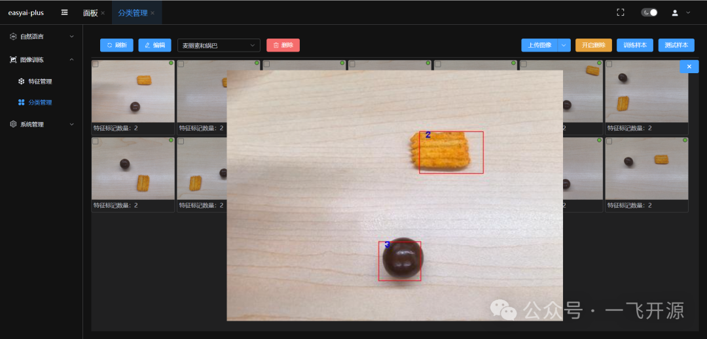
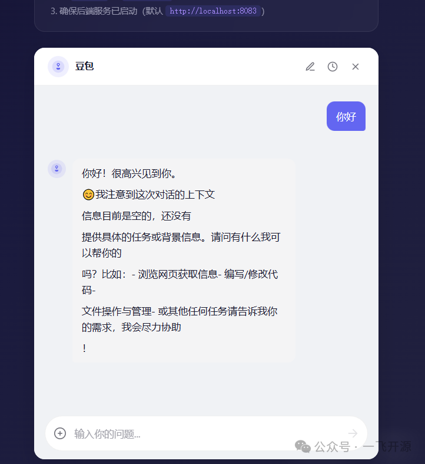
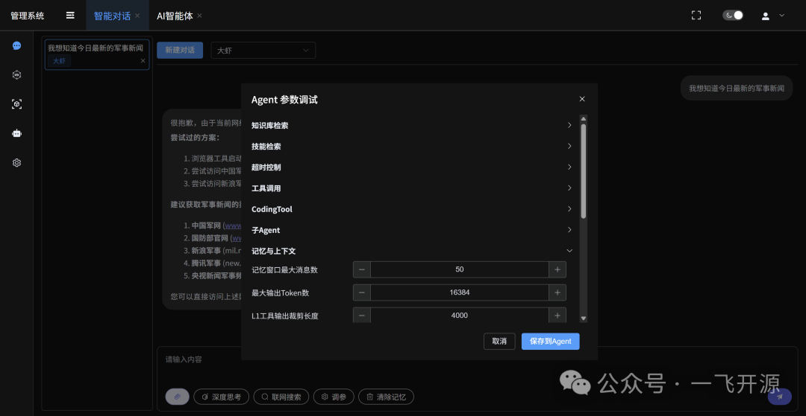
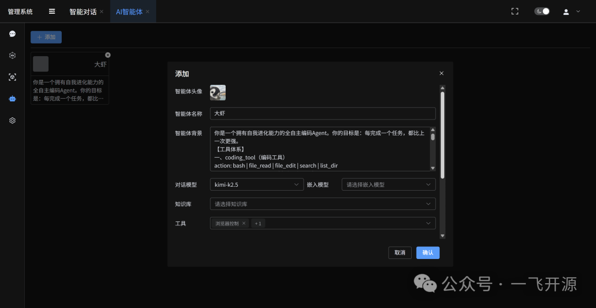

## 三、功能概述

### 为什么选择 lingclaw？

市面上的 AI 平台要么只做大模型对话，要么只做模型训练，很少有产品能同时覆盖大模型智能体和小模型训练两条主线。lingclaw 正是为此而生——

- **大模型 + 小模型双引擎**：大模型负责理解、推理、决策；小模型负责垂直领域感知（人脸识别、目标检测、NER 等）。两者协同，补齐单一大模型在专业场景的短板。
- **开箱即用的 AI 中台**：不是 SDK，不是框架，而是一个完整的、可独立运行的平台产品。接入即用，多系统、多平台共享同一套 AI 能力。
- **全流程可视化管理**：从模型管理、知识库构建、MCP 工具编排、智能体配置到工作流调度，所有环节都有直观的管理界面。

### (一) AI 智能体（Agent）

lingclaw 的智能体不是简单的"提示词 + 模型调用"，而是一套具备自主决策、自我进化、多级协作能力的 Agent 架构。

1. **灵活的智能体配置**
2. **主Agent + 子Agent 多级协作**
3. **Agent 自进化能力（Self-Evolution）**
   - Skills 技能库
   - 进化记忆（Evolution Memory）
   - MCP 工具自主发现与安装
   - 强制进化决策链

### (二) 生产级稳定性优化

1. 智能安全熔断机制
2. 任务自动续传
3. 两级上下文压缩
4. 跨对话任务记忆
5. 跨平台命令智能适配

### (三) CodingTool — 全能系统操作工具

为 Agent 提供完整的操作系统交互能力，一个工具覆盖所有场景。

**四级沙盒隔离模式：**

| 模式 | 说明 |
|------|------|
| Docker 容器沙盒 | 推荐生产环境使用 |
| Native 原生沙盒 | 适合个人用户 |
| 远程客户端沙盒 | Electron 桌面端 |
| 管理员模式 | 开发调试用 |

### (四) 知识库（RAG）

- **多格式文档支持**：PDF、Word、Excel、Markdown，基于 Docling 解析，准确率 85%~90%
- **向量化语义检索**：文档内容自动 Embedding 入库，Agent 对话时实时检索相关知识片段
- **可视化管理界面**：上传、解析、检索、删除，全流程可视化操作

### (五) MCP 工具生态

- 可视化 MCP 管理：添加、配置、启停 MCP 服务，支持 stdio 和 SSE 两种传输方式
- MCP 市场搜索：直接对接 MCP 官方 Registry，一键搜索全球开发者发布的工具
- 一键本地部署：搜到的工具直接安装到本地，自动配置
- Agent 自主发现安装：Agent 在任务中遇到能力缺口时，可自动搜索并安装 MCP 工具

### (六) 工作流编排

- 基于 Agent 的工作流：每个节点可以绑定不同的 Agent，Agent 之间支持参数传递
- 可视化编排：拖拽式配置工作流节点和连接关系
- 定时调度：支持 Cron 表达式定时触发工作流
- 执行日志：完整记录每次工作流的执行详情
- 对话中触发：用户可在对话中 @工作流，让 Agent 自动调用执行

### (七) 小模型训练（NLP + 视觉）

**NLP 方向：** 分类管理 → 数据标注 → Q&A 管理 → 训练与测试

**视觉方向：** 图像训练（全流程闭环）→ 视频分析（安防/质检）→ 特征管理

### (八) 更多平台特性

| 特性 | 说明 |
|------|------|
| Electron 桌面端 | Windows/Mac/Linux 三端运行 |
| 多用户多角色 | 完整的用户、角色、菜单权限体系 |
| 操作审计 | 全链路操作日志记录 |
| 安全配置 | 密码复杂度、登录锁定、密码过期等企业级安全策略 |
| 国际化 | 支持多语言切换 |

### (九) lingclaw-chat — 开放对话组件

基于 Web Component 构建的 AI 对话组件，一行 HTML 标签即可嵌入任何页面：

```html
<lingclaw-chat
  server="https://your-server.com"
  app-key="your_key"
  app-secret="your_secret"
  enable-agent-switch>
</lingclaw-chat>
```

Vue / React / Angular / 原生 HTML 通吃，内置完整对话交互体验：流式输出、Markdown 渲染、多模态上传、会话历史、多 Agent 切换、亮色/暗色主题、HMAC-SHA256 签名认证。

```
npm i lingclaw-chat
```

## 四、技术选型

| 层 | 技术 |
|----|------|
| 后端框架 | Spring Boot 3.x + Spring AI 1.1.3 |
| AI 协议 | MCP (Model Context Protocol) |
| 模型服务 | Ollama / OpenAI 兼容接口 |
| 文档解析 | Docling 2.74.0 |
| 向量检索 | 本地 Embedding (ONNX MiniLM) + SimpleVectorStore |
| 数据库 | MySQL 8.0+ |
| 前端 | Vue 3 + Element Plus |
| 桌面端 | Electron |
| 对话组件 | lingclaw-chat（Web Component） |
| 认证鉴权 | easy-security |

## 五、快速开始

**环境要求：** JDK 21 / MySQL 8.0+ / Node.js 20.x+ / Ollama

**三步启动：**

1. 创建数据库（项目启动后自动建表）
2. 修改 `application.yml` 中的数据库连接和文件存储路径
3. 启动后端 + 前端

默认账号：`superAdmin / superAdmin@2025`

## 六、源码地址

- 开源项目：https://gitee.com/aizuda/lingclaw
- 一飞开源社区：https://code.exmay.com/
