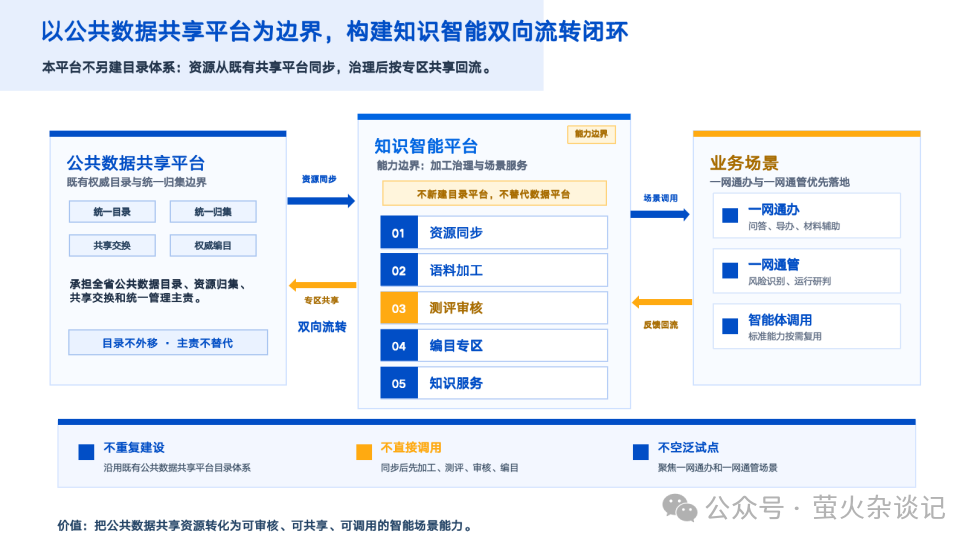
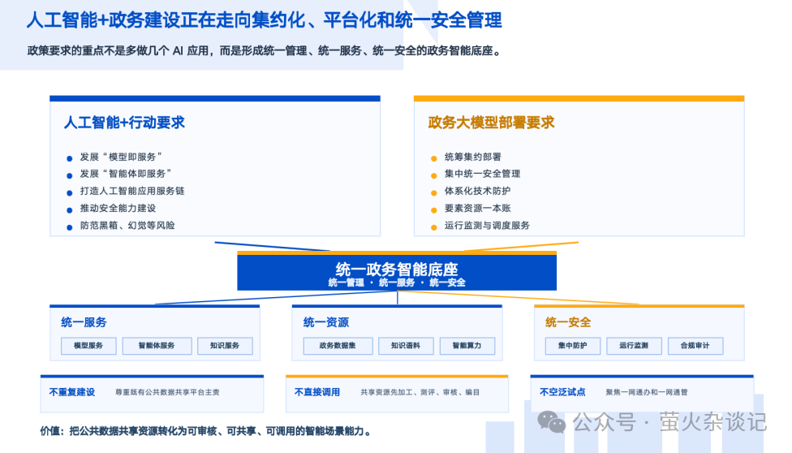
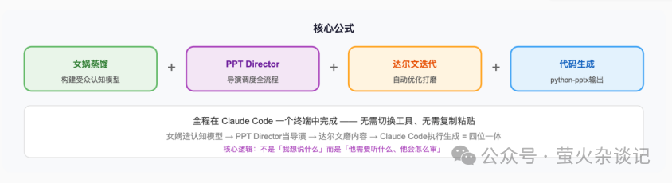
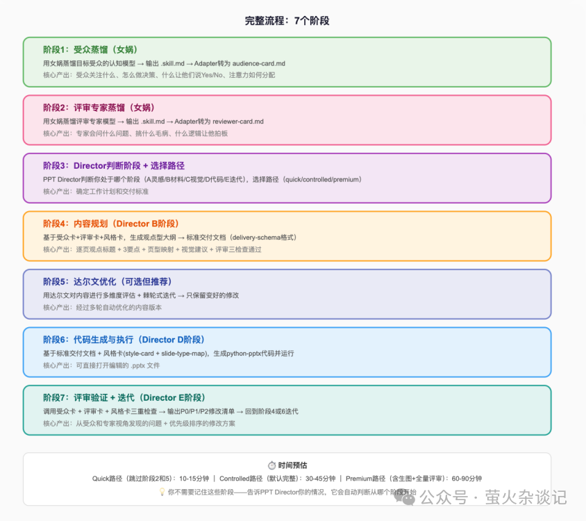
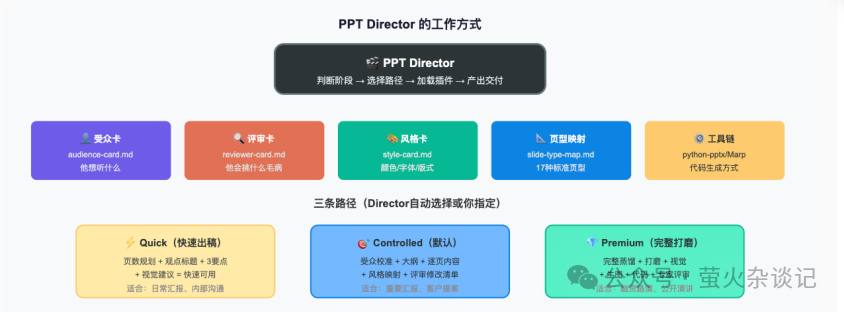
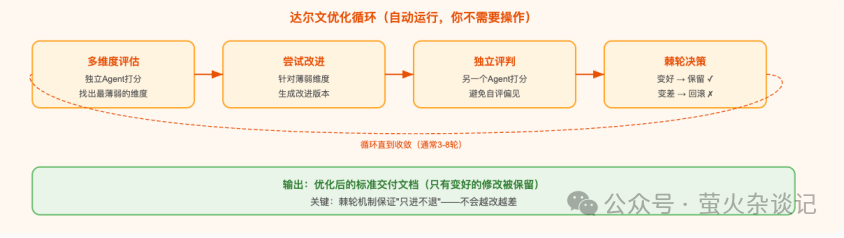

# 我把花叔的女娲 Skill 装进了我的 PPT 工作流

> **用 AI 做 PPT — 先蒸馏受众，再生成表达。**

很多 AI 生成 PPT 的工具要么像故事绘本，要么像展示海报，要么很炫但完全不适合业务汇报。这套方案能按受众思维规划内容，按评审标准反向挑刺，最后生成一份可编辑、能修改、真的能拿去汇报的 PPT。

## 效果展示

## 核心理念

用AI做PPT，不是简单地让AI帮你写PPT内容，而是通过**认知蒸馏技术**，先构建「受众思维模型」和「评审专家模型」，再由PPT Director基于这些结构化模型，像导演一样调度全流程。

## 环境搭建（一次性配置）

| 工具 | 用途 | 安装方式 |
| --- | --- | --- |
| Claude Code | 统一工作台 | 官方安装 |
| Python 3.8+ | 运行PPT生成脚本 | 系统自带或官网下载 |
| python-pptx | PPT文件生成库 | `pip install python-pptx` |
| 女娲.skill | 认知蒸馏引擎 | `npx skills add alchaincyf/nuwa-skill` |
| PPT Director.skill | PPT全流程导演 | `npx skills add hermess/ppt-director` |
| 达尔文.skill（可选） | 自动迭代优化 | `npx skills add alchaincyf/darwin-skill` |

## 完整流程总览

## 阶段1：受众蒸馏

### 为什么要先蒸馏受众？

PPT 不是写给自己看的。你需要先搞清楚「看PPT的那个人脑子怎么转的」，然后才能决定每一页放什么。

**传统做法**：凭感觉猜受众想看什么 → 写完发现不对 → 反复修改。

**认知蒸馏优势**：先用AI系统性地分析受众的决策模式 → 基于模型精确生产 → 一次到位。

### 确定蒸馏目标

| 场景 | 蒸馏目标 | 价值 |
| --- | --- | --- |
| 政府汇报 | 具体领导（如分管副省长） | 决策框架、关注维度、否决触发器 |
| 融资路演 | 具体投资人/VC角色 | 投资决策漏斗、否决原因、关注指标 |
| 向上汇报 | 具体上级/高管角色 | 关注维度、汇报偏好、决策风格 |
| 销售提案 | 行业客户角色 | 采购决策流程、核心痛点 |
| 技术分享 | 开发者群体 | 技术审美、知识假设 |
| 公开演讲 | 大会观众画像 | 注意力曲线、知识水平 |

### 执行蒸馏

在 Claude Code 中输入：

- **知道具体是谁**：`用女娲蒸馏一个"袁家军"`
- **只知道角色类型**：`用女娲蒸馏一个"省级分管数字化的副省长"`
- **有具体场景约束**：`用女娲蒸馏：角色：某省分管数字化改革的副省长；场景：他在听一个区县的数字化改革成果汇报`

### 女娲的工作过程（自动完成）

女娲自动调度 6 个 Agent 并行工作：

1. **著作Agent** — 调研该角色的著作、文章、公开讲话
2. **对话Agent** — 分析其对话风格、提问方式、思维习惯
3. **表达Agent** — 提炼其常用表达、比喻、价值判断方式
4. **批评Agent** — 找出其常见的否定模式、反感的事物
5. **决策Agent** — 梳理其决策框架、权重分配
6. **时间线Agent** — 追踪其认知演变和立场变化

完成后进行交叉验证，输出一份结构化的 `.skill.md` 文件。

### 转换为 PPT Director 可用格式

将女娲输出的 `.skill.md` 转换为 PPT Director 的 `audience-card.md` 格式。可以直接告诉 Claude Code：「用女娲蒸馏受众后，转成PPT Director的audience-card」，它会一步完成。

### 快速开始（使用默认配置）

PPT Director 有默认配置：默认受众=政府领导，默认评审=袁家军式，默认风格=蓝色汇报风。如果你恰好是给政府汇报数字化项目，可以直接跳过蒸馏。

## 阶段2：评审专家蒸馏

好的PPT不是你自己觉得好，而是过得了专家的审。PPT Director 内置了「评审关卡」——模拟一个严格的专家来挑毛病。

### 受众卡 vs 评审卡

| 维度 | audience-card（受众卡） | reviewer-card（评审卡） |
| --- | --- | --- |
| 回答的问题 | 他想听什么？ | 他会挑什么毛病？ |
| 视角 | 接收者视角 | 审查者视角 |
| 用途 | 决定内容选什么 | 决定逻辑够不够硬 |

### 推荐的评审专家

| PPT类型 | 推荐蒸馏的评审专家 |
| --- | --- |
| 政府汇报 | 袁家军 / 省级领导 |
| 融资BP | 沈南鹏 / 具体投资人 |
| 技术方案 | 行业CTO |
| 产品提案 | 俞军 / 产品大师 |
| 演讲设计 | Nancy Duarte |

> 同一个人可以同时作为受众和评审——一个人的心智模型可以从两个角度使用。

## 阶段3：PPT Director 调度

### PPT Director 是什么？

PPT Director 就是你的「PPT导演」——它不是一个简单的模板，而是一套完整的调度系统。

### 5个工作阶段

| 阶段 | 触发条件 | Director 会做什么 |
| --- | --- | --- |
| A 灵感激发 | 只有一个主题/想法 | 发散思路、确认受众、规划方向 |
| B 内容打磨 | 有思路或原始材料 | 生成观点型大纲、标准交付文档 |
| C 视觉定义 | 已有标准交付文档 | 做页型分配、风格映射 |
| D 代码生成 | 视觉定义已完成 | 生成 python-pptx 代码，输出 .pptx |
| E 迭代优化 | 已有PPT初稿 | 三重评审挑毛病，输出修改清单 |

### 启动 Director

- **只有一个想法**：「我要做一个PPT，主题是'XX区数字化改革成效汇报'，受众是省级领导，用PPT Director来规划」
- **有材料了**：「我有以下材料，需要做成PPT，用PPT Director帮我从B阶段开始」
- **已经有大纲了**：「用PPT Director帮我做视觉定义和代码生成」

## 阶段4：内容规划

内容规划是整个流程最关键的转化——从「你有什么素材」变成「每页该放什么」。

### 内容规划规则

- **观点型标题**：不是"项目背景"，而是观点（如"三年改革让办事时间缩短87%"）
- **每页3个要点**：最多承载3个核心要点
- **前3页必须抓住注意力**：基于 audience-card 的注意力分配模型
- **证据链完整**：每个观点都有数据/案例支撑
- **页型映射**：每页分配标准页型

### 17种标准页型

PPT Director 内置 17 种标准页型：封面页、目录页、章节过渡页、纯文字观点页、数据图表页、对比页、流程图页、架构图页、案例展示页、数字突出页、图片+文字页、引言页、矩阵页、列表页、地图页、时间轴页、总结页。

### 风格卡：蓝色汇报（默认）

- 主色：深蓝 `#003366`
- 辅色：科技蓝 `#0066CC`
- 强调色：活力橙 `#FF6600`
- 背景色：浅灰 `#F5F7FA`
- 标题：微软雅黑 Bold 28-32pt
- 正文：微软雅黑 Regular 14-16pt
- 禁忌：无圆角过大装饰、无卡通风格图标、英文不为主、每页≤50字

## 阶段5：达尔文优化（可选但推荐）

### 什么时候需要？

| 场景 | 是否建议用达尔文 |
| --- | --- |
| 日常周报 | ❌ 不需要 |
| 重要领导汇报 | ✅ 推荐 |
| 融资路演BP | ✅ 强烈推荐 |
| 公开大会演讲 | ✅ 强烈推荐 |

### 达尔文的工作机制

达尔文自动执行：**提出方案 → 评价方案 → 变异方案 → 选择最优 → 下一轮** 的进化循环。

## 阶段6：代码生成与执行

一步生成PPT，Director 会：
1. 读取风格卡 → 确定颜色、字体、间距
2. 读取页型映射 → 每种页型对应固定的布局模板
3. 逐页生成 → 按标准交付文档逐页填充
4. 执行代码 → 直接运行 python-pptx 脚本
5. 输出文件 → 生成可直接打开的 .pptx 文件

### 常见视觉风格快捷指令

| 风格 | 一句话指令 |
| --- | --- |
| 蓝色汇报（默认） | 使用默认风格卡 |
| 苹果风 | 极简、大留白、深色渐变背景、一页一句话 |
| 麦肯锡风 | 框架图、蓝灰色系、信息密度高、结论先行 |
| TED风 | 大图全屏、最少文字、故事驱动、黑底白字 |
| 数据驱动 | 图表为主、数字突出、灰白底色、注释清晰 |

## 阶段7：评审验证 + 迭代

### 评审三检查

用蒸馏出的受众模型和评审模型来验证产出。PPT Director 内置「评审三检查」协议：

1. **受众检查（Audience Check）** — 前3页是否抓住注意力？信息密度是否匹配？
2. **评审检查（Reviewer Check）** — 逻辑有抓手吗？风险闭环了吗？表达不空泛？
3. **风格检查（Style Check）** — 颜色规范？字数控制？页型合理？

### 修改清单示例（按优先级）

- **P0（必须修改）**：第4页缺少数据来源标注、第8页只谈成绩不谈困难
- **P1（建议修改）**：数据并列改为逻辑递进、文字过多需压缩
- **P2（可优化）**：增加对比动画、补充时间表

## 4种常见场景的精简操作

### 场景A：政府汇报（15-25分钟）
使用默认配置，跳过蒸馏，直接启动 → 确认大纲 → 生成 → 评审 → 修改。

### 场景B：给特定领导汇报（35-50分钟）
蒸馏受众 → 启动 Director（controlled路径）→ 达尔文优化 → 生成 → 评审迭代。

### 场景C：融资BP（60-90分钟）
蒸馏投资人 + BP评审专家 → Director（premium路径）→ 达尔文 → 生成 → 评审 → 受众模拟。

### 场景D：技术分享（40-60分钟）
蒸馏受众 → 启动 Director（故事驱动风格）→ 达尔文 → 生成 → 评审 → 图片需求清单。

## 进阶技巧

1. **复用Skill库**：蒸馏一次，反复使用。建立 audiences/、reviewers/、styles/ 个人Skill库
2. **一个人同时做受众和评审**：输出两个视角，分别生成 audience-card 和 reviewer-card
3. **自定义风格包**：创建自己的 style-card.md
4. **演讲稿与PPT同步生成**：PPT + 讲稿 + Q&A预案 三件套
5. **红蓝对抗**：用 audience-card 和 reviewer-card 同时审查，双视角打分

---

**一句话总结：**

> 蒸馏受众认知 → 蒸馏评审专家 → Director规划内容 → 达尔文打磨 → 代码生成PPT → 三重评审验证 → 迭代直到过关

核心逻辑：先搞清楚他的脑子怎么转，再决定PPT每页放什么。
