> 一飞开源，介绍创意、新奇、有趣、实用的开源/AI应用、系统、软件、硬件及技术，一个探索、发现、分享、使用与互动交流的开源/AI技术社区平台。致力于打造活力开源/AI社区，共建开源新生态！

## 一、开源项目简介

### Apboa

**企业级智能体平台 · Agent 原生架构**

基于 AgentScope 构建的可视化智能体平台

> 敏感词 · 多模型接入 · 多模态 · Tool · Skill · MCP · RAG · Human-in-the-Loop · Agent-as-Tool · AGUI
> 多节点部署 · 智能体缓存 · API Key 管理

Apboa 一个基于 AgentScope 构建的可视化智能体平台，支持敏感词 · 多模型接入 · 定时任务 · 多模态 · Hook（硬编码 + 在线） · Tool（硬编码 + 在线） · Skill · MCP · RAG · Human-in-the-Loop · 多智能体 · AGUI 。

## 二、开源协议

使用 MIT 开源协议。

## 三、界面展示

核心页面预览：

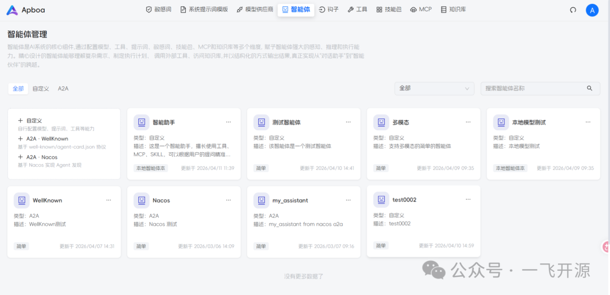

## 四、功能概述

### 为什么选择 Apboa？

在大模型应用进入工程化阶段之后，仅仅调用 API 已经远远不够。你需要的是：

| 需求 | Apboa 的回答 |
| --- | --- |
| 可管理的智能体 | 可视化创建、配置、监控全生命周期 |
| 可扩展的能力模块 | Tool / Skill / MCP / RAG 即插即用 |
| 可控的运行与审核机制 | Human-in-the-Loop + Hook 灵活控制 |
| 可落地的企业级架构 | 多节点部署、智能体缓存、API Key 管理 |

Apboa 正是为此而生。基于 AgentScope 构建，提供一套完整的 Agent 工程化解决方案，让你快速搭建企业级智能体系统，而不是拼凑工具链。

### 核心能力

#### Agent 原生架构

- 可视化创建与配置智能体
- 模块化能力组合（提示词 / 工具 / MCP / 知识库 / 审核策略等核心能力）
- 支持 Agent 作为 Tool 被其他 Agent 调用
- 支持复杂协作与任务分解

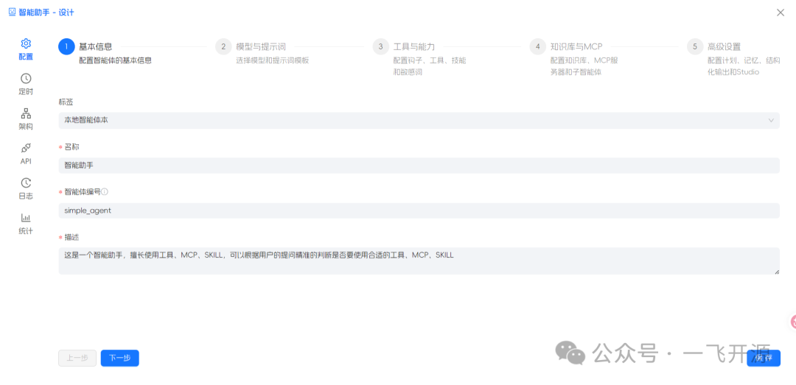

#### 多模型统一接入

- 支持 OpenAI / DashScope / Anthropic / Ollama 等主流模型
- 统一抽象接口，模型自由切换
- API Key 轮询与容错机制
- 易于扩展新的模型供应商

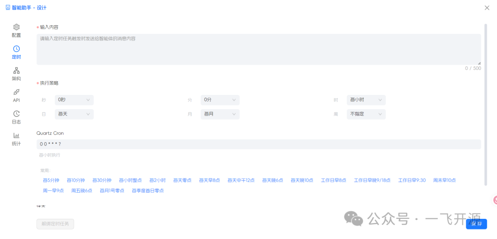

#### API Key 管理

- 支持为模型配置多个 API Key，自动轮询调度
- 内置容错与失败重试机制，单 Key 异常自动切换
- API Key 用量统计与状态监控
- 支持按模型维度独立管理密钥，灵活配置

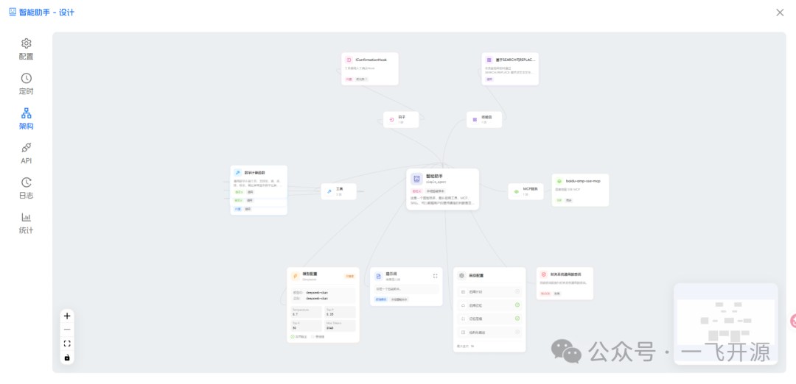

#### 智能体缓存

- 内置 Agent 运行时缓存机制，提升重复调用响应速度
- 支持缓存策略配置（过期时间、淘汰策略等）
- 有效降低模型调用成本，减少不必要的重复推理

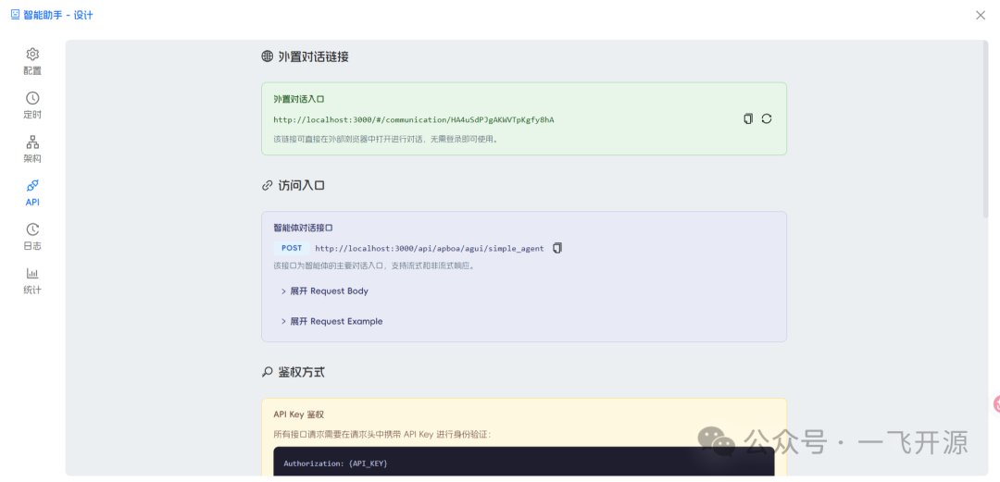

#### 多节点部署

- 支持水平扩展，多实例集群部署
- 基于 Redis 实现节点间状态同步与协调
- 会话与任务自动路由，无状态服务设计
- 支持负载均衡，提升系统整体吞吐量与高可用性

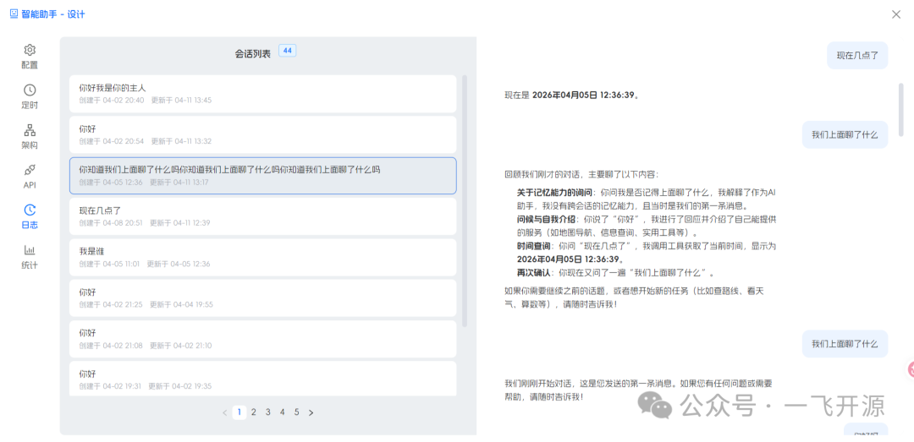

#### 多模态支持

- 支持 3 种存储方案（S3 | FTP | 本地存储）
- 支持 3 种文件类型（图片 | 音频 | 视频）

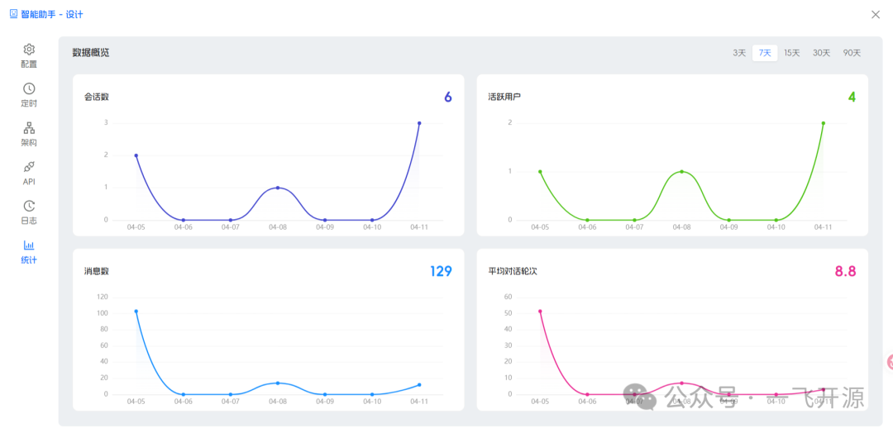

#### 定时任务

- 支持为智能体配置定时任务，自动化周期性执行

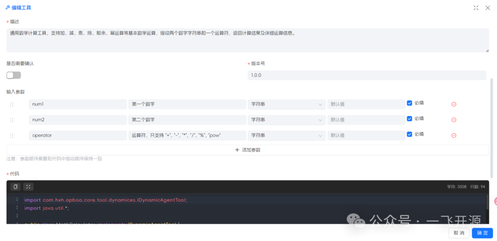

#### Hook 定义

- 支持硬编码 Hook，在代码中预定义生命周期钩子
- 支持在线编写 Hook，通过平台界面动态配置与热更新
- 灵活扩展 Agent 运行流程与行为控制

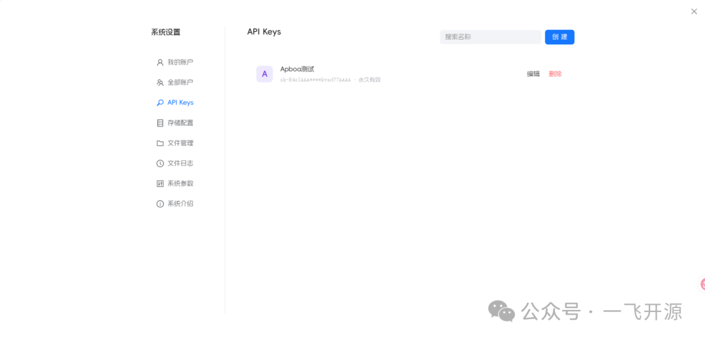

#### 技能包

- 支持手动创建
- 支持装载本地技能包
- 支持导入技能压缩包
- 支持下载 Git 技能包

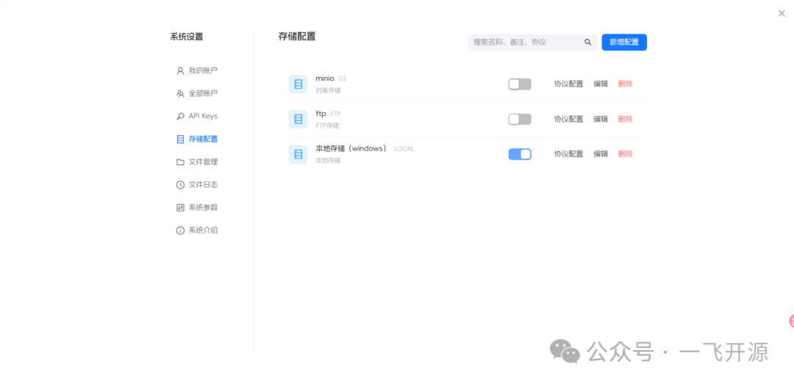

#### Tool 定义

- 支持硬编码 Tool，在代码中预定义工具能力
- 支持在线编写 Tool，通过平台界面动态创建与编排
- 工具可被 Agent 灵活调用，支持复杂业务逻辑

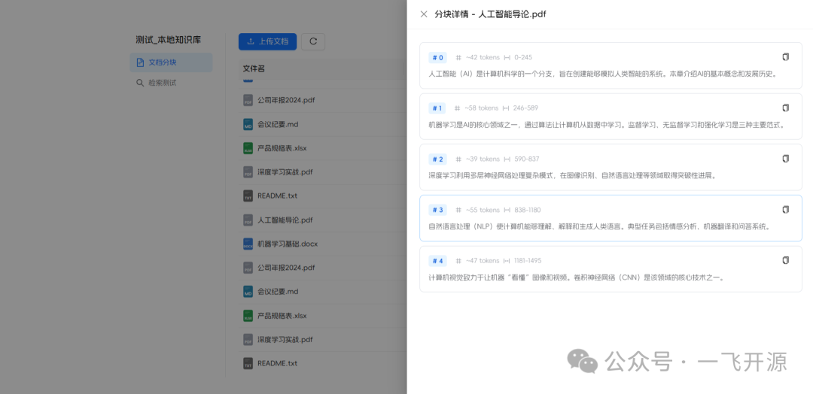

#### MCP 接入

- 支持 MCP（Model Context Protocol）协议接入
- 支持 HTTP、SSE、STDIO 多种传输方式
- 与 MCP 生态工具无缝集成，扩展智能体能力边界

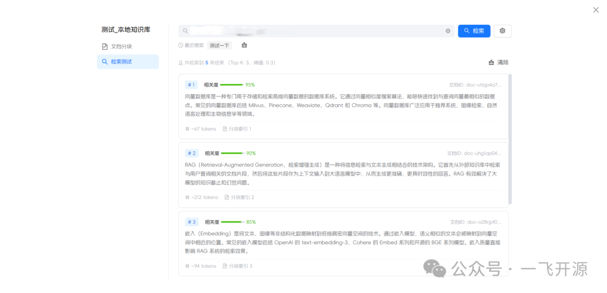

#### 原生 RAG 能力

- 内置知识增强生成流程
- 支持本地知识库
- 支持百炼 / Dify / RagFlow 等知识源
- 向量语义检索提升回答准确率
- 可插拔式知识库结构

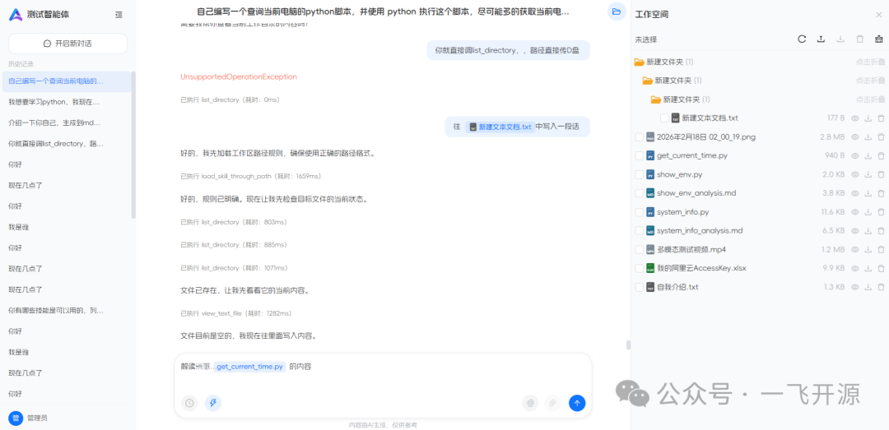

#### 工作空间

- 当智能体配置了代码执行环境时，对话界面右上角会出现 **工作空间** 按钮
- 一个 session 一个工作空间
- 用户/智能体可在工作空间中对文件进行上传、下载、预览、删除操作
- 支持多文件下载，支持多文件上传，支持 Zip 自动解压

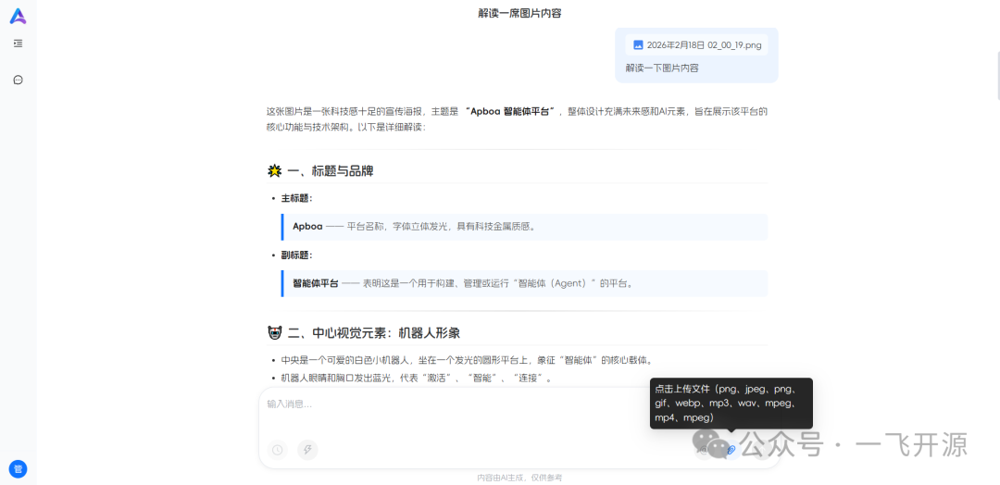

#### 企业级运行控制

- Human-in-the-Loop 审核机制
- WebSocket 实时通信
- 流式对话与工具调用

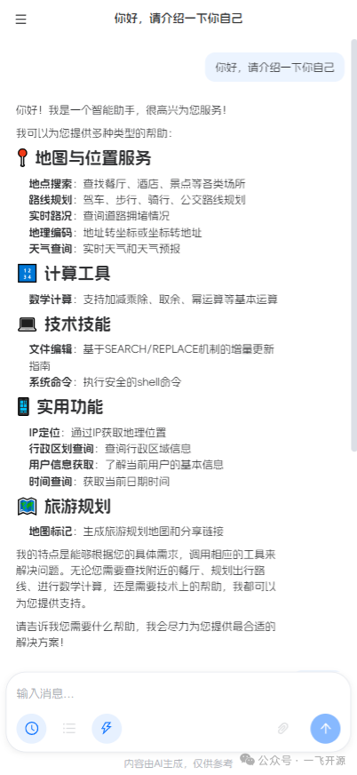

### 适用场景

- 企业智能客服
- 内部知识问答系统
- AI 工作流自动化
- 多 Agent 协作系统
- AI 工具平台

## 五、技术选型

### 技术栈

| 层级 | 技术 |
| --- | --- |
| 语言 | Java 21 |
| 框架 | Spring Boot 3.4.9 |
| AI 框架 | AgentScope 1.0.8 |
| ORM | MyBatis-Plus |
| 数据库 | MySQL |
| 缓存/集群 | Redis |
| 前端框架 | Vue 3.5 + TypeScript |
| UI 组件 | Ant Design Vue |
| 构建工具 | Vite |
| 状态管理 | Pinia |

### 项目结构

```
apboa
├── common/              # 通用基础层：实体、DTO、VO、枚举、工具类、异常、常量等
├── cluster/             # 集群通信：基于 Redis 发布订阅实现多节点状态同步
├── websocket/           # WebSocket 实时通信模块
├── core/                # 核心整合层：串联 Agent 全生命周期（模型/提示词/工具/MCP/知识库/Hook/技能等）
├── job/                 # 定时任务：基于 Quartz 的智能体周期调度
├── console/             # 应用入口：会话配置、启动引导
├── biz/                 # 业务功能层
│   ├── model/           # 模型管理
│   ├── prompt/          # 提示词管理
│   ├── tool/            # 工具管理（硬编码 + 在线编写）
│   ├── mcp/             # MCP 协议接入（HTTP / SSE / STDIO）
│   ├── skill/           # 技能包管理与脚本执行
│   ├── knowledge/       # 知识库与 RAG 管理
│   ├── hook/            # 生命周期钩子
│   ├── sensitive/       # 敏感词过滤
│   ├── agent/           # 智能体核心（整合上述所有 biz 子模块）
│   ├── account/         # 账户与权限管理
│   ├── resource/        # 资源与文件存储（S3 / FTP / 本地）
│   ├── params/          # 系统参数配置
│   ├── a2a/             # Agent-to-Agent 通信
│   ├── studio/          # Studio 集成
│   └── sk/              # 技能框架初始化
├── ui/                  # 前端：Vue 3.5 + TypeScript + Ant Design Vue
└── docs/                # 数据库脚本（schema + 增量 SQL）
```

### 模块依赖关系

```
console -> core -> agent -> [model, prompt, tool, mcp, skill, knowledge, hook, sensitive, params, a2a ...]
```

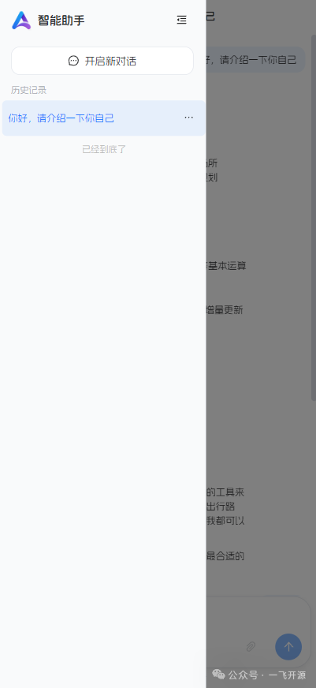

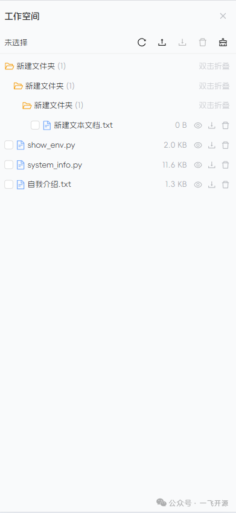

## 六、源码地址

开源项目地址：https://gitee.com/studioustiger/apboa

访问一飞开源：https://code.exmay.com/
