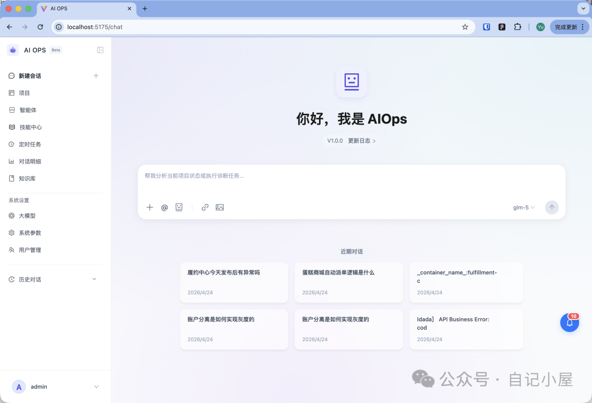
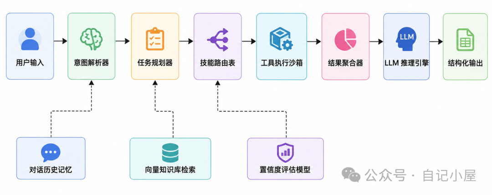
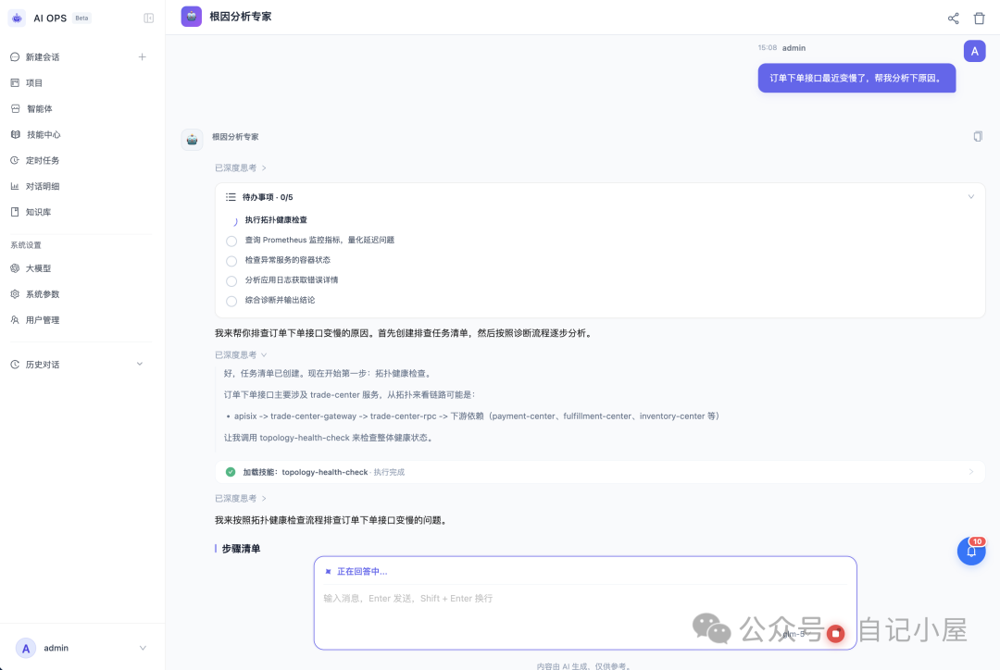
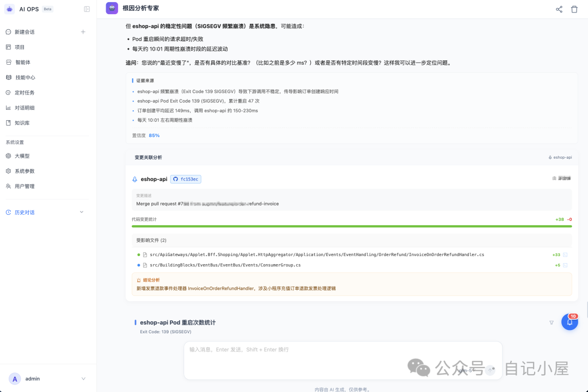
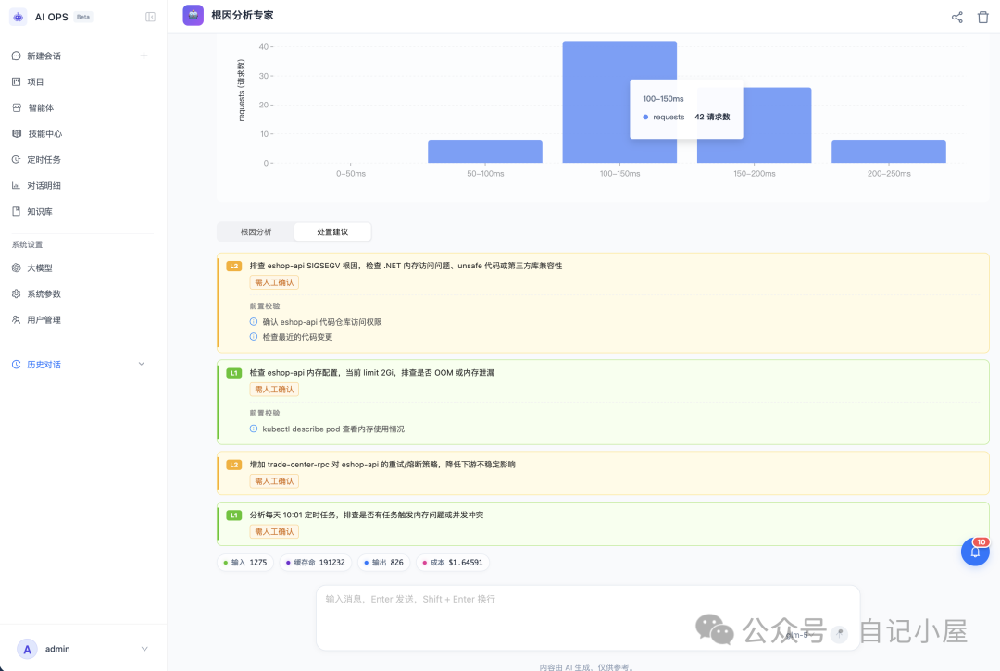
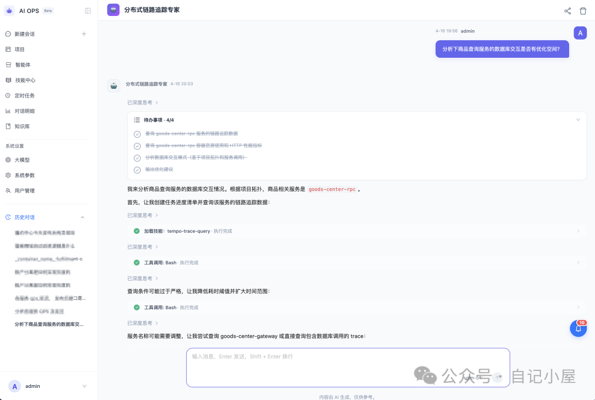
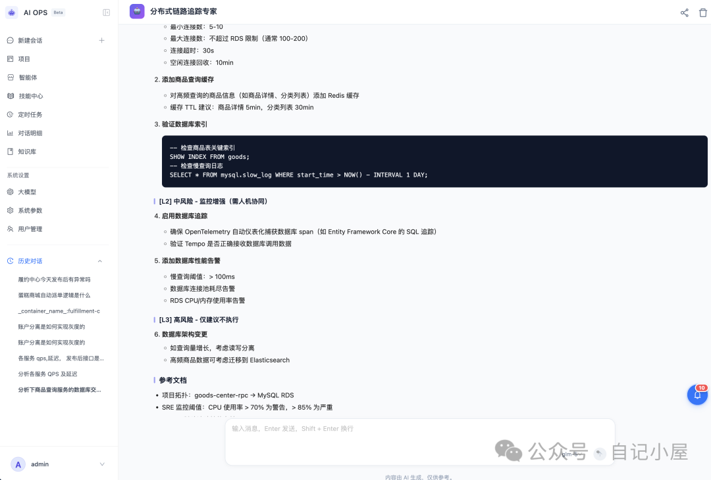
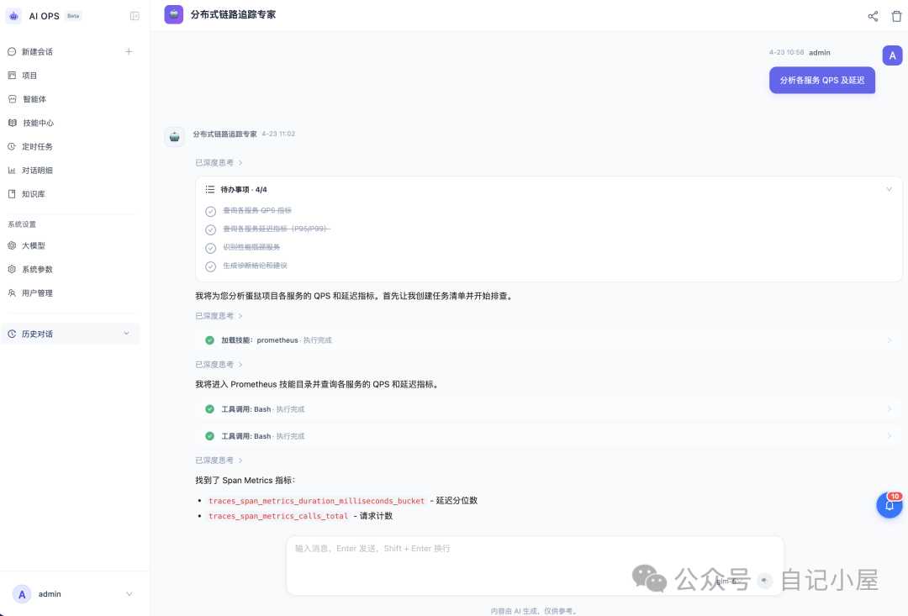
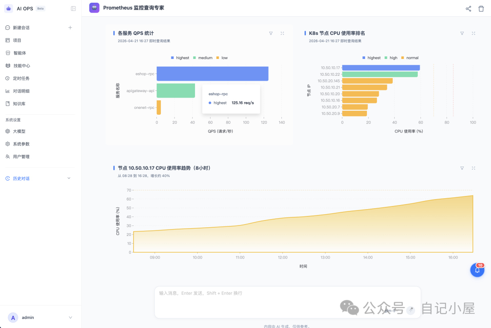
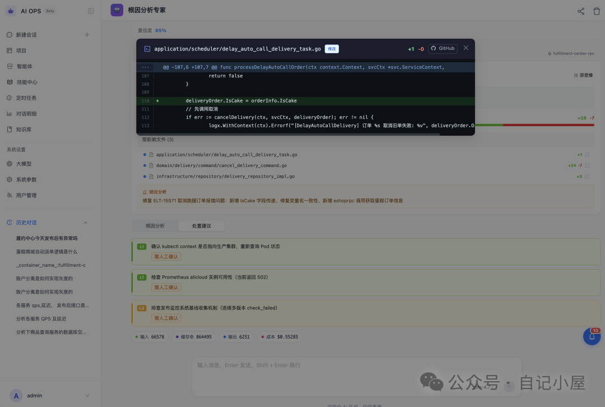

半夜两点，钉钉告警狂震。你披衣起床，打开电脑，在阿里云控制台、K8s Dashboard、Grafana、SLS、Prometheus、Jenkins 之间来回切换十几个标签页……手动拼 SQL、点瀑布图、对 TraceId、找根因，一杯美式喝完，头发又少了一撮。

这不是你的错。微服务、云原生、多租户架构的复杂度，已经远超人脑与脚本的承载极限。传统工具链是"断点的"，而人脑擅长"关联"。当两者无法对齐，运维就注定是一场"人肉对账"的苦役。

今天，我们彻底告别"语法堡垒"与"控制台迷航"，带你沉浸式拆解**如何从0到1搭建一套企业级AIOps智能体平台**。它不是简单的"LLM+聊天框"，而是通过**意图解析-工具路由-数据聚合-推理归因**的闭环，让 AI 真正成为你的 7×24 虚拟 SRE 团队。

## 一、为什么是"智能体平台"？从工具链到认知协同

过去十年，我们买了最好的监控、最全的日志、最强的链路追踪，但排查效率依然卡在瓶颈。为什么？

**🔹 数据孤岛，上下文断裂**：一个接口报错，日志在 SLS，指标在 Prometheus，发布在 ArgoCD，数据库慢查询在 PDM。切系统、记参数、对时间戳，大脑在多个上下文间反复横跳，关键线索极易遗漏。

**🔹 脚本 brittle，维护成本极高**：Shell 拼凑、Python 脚本、自定义 SQL 模板……环境一变、字段一改，全量报错。新人入职三个月还在对着 `level:ERROR | select ... bin(__time__,1m)` 猜谜。

**🔹 大模型幻觉，缺乏执行闭环**：纯对话式 LLM 能"写诗"，但面对生产环境时容易"一本正经胡说八道"。它需要"手"去调用工具，需要"记忆"去参考历史，需要"逻辑"去交叉验证。

**智能体平台（Agent Platform）正是为了解决这三大断层而生。** 它的核心哲学是：**解耦意图、执行与推理**。不追求"一语道破天机"，而是追求"可追溯、可验证、可迭代"的工程化闭环。平台内置意图解析器、工具调用框架、RAG 知识检索、置信度评估模型，让 AI 从"聊天机器人"进化为"可编排的虚拟专家"。

## 二、核心架构：Agent、Skills、Knowledge 如何精密咬合？

一套企业级运维 Agent 平台，不是简单套壳开源项目，而是围绕**数据流、控制流、记忆流**三层架构深度定制。

### 1. Agent 中枢：ReAct 框架 + 多智能体编排

Agent 不是单点模型，而是**规划器（Planner）+ 执行器（Executor）+ 反思器（Reflector）**的组合。

- **意图解析**：用户输入自然语言后，系统先提取实体（服务名、时间窗口、环境）、动作（查日志、看链路、比指标）与约束（P99、ERROR、近30分钟）。
- **任务拆解**：复杂问题自动拆分为子任务。例如"分析订单接口变慢"会被拆为：拉取 Prometheus 延迟曲线 → 批量获取 Trace → 交叉比对发布时间 → 关联 Redis 告警。
- **状态管理**：支持多轮对话上下文继承、临时变量缓存、失败重试与降级策略（如 Trace 拉取超时，自动 fallback 到日志聚合分析）。

### 2. Skills 技能层：Schema 映射 + 工具调用引擎

技能是 Agent 的"双手"。平台采用标准化 Tool Schema 定义，支持动态注册与权限隔离：

| 技能 | 底层对接 | 核心能力 | 防错机制 |
| --- | --- | --- | --- |
| SLS 查询 | 阿里云 SLS | 自然语言转 SQL、动态聚合、噪声过滤 | 字段白名单、超时熔断、结果集上限 |
| Trace 分析 | Tempo/Jaeger | 瀑布图解析、Span 耗时排序、错误传播追踪 | 拓扑缓存、依赖图剪枝、置信度过滤 |
| K8s 巡检 | K8s API Server | Pod 状态、容器日志、Events 聚合、资源诊断 | RBAC 隔离、API QPS 限流、字段脱敏 |
| Prometheus | Prometheus/Thanos | 趋势预测、同比环比、基线偏离度计算 | 查询复杂度限制、缓存命中优先、结果校验 |

每个 Skill 内置**参数校验器**与**结果格式化器**，确保 LLM 输出的非结构化描述，能精准映射为可执行的结构化请求。执行结果经标准化清洗后，再回传 LLM 进行自然语言总结，形成完整闭环。

### 3. Knowledge 知识库：RAG 管道 + 领域适配

通用大模型懂技术，但不一定懂你的业务。Knowledge 模块通过 **RAG（检索增强生成）** 架构，让 Agent "读透"企业资产：

- **切片与向量化**：Wiki、SOP、故障复盘报告按语义边界切片，通过 Embedding 模型转为向量，存入 Milvus/pgvector。
- **元数据过滤**：按环境、服务、版本、责任人打标签，检索时自动附加过滤条件，避免"跨环境乱指"。
- **重排序与摘要**：召回 Top-K 文档后，通过 Cross-Encoder 重排序，提取关键段落，动态注入 System Prompt，大幅降低幻觉率。

知识库支持版本管理与热更新。架构调整或新故障发生后，运维负责人一键上传复盘文档，Agent 的"脑回路"实时同步。

### 4. 数据流全景图

每一步均可观测、可干预。执行日志全量落盘，支持人工复核、Bad Case 回流、Prompt 迭代。

---

## 三、实战场景：AI 如何接管 6 大高频运维任务？

理论再丰满，不如一次真实的排障体验。以下是平台在生产环境中的高频场景深度拆解：

### 场景 1：接口 P99 抖动？AI 自动锁定瓶颈（Trace + Metrics 交叉）

👤 用户："订单下单接口最近变慢了，帮我分析下原因。"

🤖 AI 动作：调用 Prometheus 确认延迟趋势与峰值 → 调用 Trace 技能批量拉取 P99 超标链路 → 智能交叉分析耗时分布。

💬 AI 回复："分析发现订单接口平均耗时 1.5s，其中 `inventory-service` 的 `check-stock` 操作单点耗时 1.2s，占比超 80%。初步判断为该服务 Redis 连接池抖动导致重试激增。建议检查库存服务 Redis 监控及连接池配置。"（附置信度 89% 与证据链截图）

💡 *专家提示：AI 会自动过滤"成功但耗时较长"的干扰 Span，直击错误分支，并关联近期 Redis 慢查询与告警记录。*

AI 会自动给出问题根因、处置建议。

### 场景 2：分布式链路报错？追踪 Error 传播路径

👤 用户："用户反馈登录一直报 500 错误，帮我查查。"（或直接粘贴 traceId）

🤖 AI 动作：调用 Trace 技能，过滤 `error=true` 的链路，逆向追踪第一个抛出 `Exception` 的节点。

💬 AI 回复："为您定位到错误源头。网关虽返回 500，但根因是底层的 `auth-db` 报错 `Deadlock found when trying to get lock`。错误传播路径为：`user-service` → `auth-service` → `db`。建议在 auth-service 增加重试退避策略，并给核心表加索引缓解死锁。"

💡 *专家提示：支持直接粘贴 traceId 或 request_id，AI 会秒级重建调用拓扑，并高亮异常分支。*

### 场景 3：告别晦涩 SQL，自然语言查日志

👤 用户："帮我查下 `cake-shop` 应用最近半小时内级别为 ERROR 的日志，按错误内容分组统计下数量。"

🤖 AI 动作：自动翻译为 SLS SQL 并执行，聚合统计高频异常。

💬 AI 回复："最近半小时共发现 3 类高频报错：① `NullReferenceException` (15次)；② `TimeoutException` (5次)；③ `InvalidOperationException` (2次)。建议优先排查 `cake-shop` 依赖的第三方接口超时配置。"

💡 *专家提示：支持追加"按时间窗口分布"或"提取堆栈前3行"等指令，AI 会动态调整查询策略。*

### 场景 4：数据库压力大？识别 N+1 与慢 SQL

👤 用户："分析下商品查询服务的数据库交互是否有优化空间？"

🤖 AI 动作：扫描该服务近 1 小时的 Trace 聚合数据库调用模式，识别循环查询特征。

💬 AI 回复："通过分析 Trace 发现，商品列表接口单次请求触发了 50 次 `SELECT * FROM categories WHERE id = ?`。这是典型的 N+1 查询问题。建议将循环查询改为 `IN` 子句批量拉取，预计可降低数据库 IO 达 70%。"

💡 *专家提示：AI 还能自动对比优化前后的预期 QPS 提升与 CPU 水位变化，并给出代码片段级修改建议。*

### 场景 5：HTTP 服务错误率查询？秒级定位灰度影响面

👤 用户："`payment-service` 最近 10 分钟 5xx 飙升到 5%，是发布导致的吗？"

🤖 AI 动作：联动 Prometheus 与 CI/CD 平台，对比错误率曲线与发布时间点，拉取对应版本的变更日志。

💬 AI 回复："5xx 激增始于 14:02，与 `payment-v2.3.1` 灰度发布节点重合。错误堆栈指向 `TimeoutException`，主要影响华东 region 的特定节点。建议回滚该批次或调整超时阈值。"

💡 *专家提示：支持多服务横向对比，AI 会自动标记"健康基线偏离度"，并给出灰度放量/全量推广的决策建议。*

### 场景 6：异常与发布关联性推导——从"凭感觉"到"凭证据"

**痛点**：微服务架构下，一次发布牵动几十个服务。传统排查需手动对比 Jenkins/ArgoCD 记录、Git Diff 与监控抖动，易误判。

**置信度模型**：AI 综合以下维度量化评分：

- ⏱️ 时间窗口匹配度（故障发生前 30 分钟内发布）
- 📦 代码路径覆盖率（是否变更核心路由/DB表/配置中心）
- 🔍 堆栈相似性（错误堆栈与 Code Diff 文件匹配度）
- 📈 指标偏离度（QPS/错误率/CPU 抖动幅度）
- 🔗 依赖波及面（上游调用方是否同步异常）

💬 AI 回复："本次故障最可能由 `user-service v1.8.4` 引起（置信度 92%）。该版本修改了 `AuthFilter` 核心路径，且堆栈匹配度达 85%。相邻版本 `order-service` 虽同步发布，但影响面仅 5%。建议优先回滚 user-service，观察 10 分钟。"

💡 *专家提示：决策从"凭感觉"升级为"凭证据"，甚至支持一键生成 Backport 补丁建议，避免盲目回滚引发连锁雪崩。*

---

## 四、平台落地指南：技术选型、Prompt 工程与企业级治理

打造企业级 Agent 平台，技术选型只是起点，工程化治理才是护城河。

### 技术栈参考

| 模块 | 推荐方案 | 说明 |
| --- | --- | --- |
| LLM 底座 | Qwen/GLM-4/Claude | 国内延迟低、中文理解强、支持函数调用 |
| 工具框架 | LangChain/LlamaIndex/自研 Router | 支持异步并发、重试、超时降级 |
| 向量存储 | Milvus/pgvector | 支持元数据过滤、混合检索、近似召回 |
| 权限控制 | OIDC + RBAC + ABAC | 按环境/服务/部门隔离数据与工具 |
| AI 可观测 | OpenTelemetry + LangSmith | 追踪 Token 消耗、延迟、Bad Case |

### Prompt 工程：让 AI 输出更稳定

- **结构化模板**：固定 System Prompt 包含角色定义、可用工具清单、输出格式约束、边界条件。
- **Few-Shot 示例**：在 Prompt 中注入 2~3 个高质量 QA 对，让 LLM 对齐内部数据口径。
- **动态上下文**：根据用户问题自动截取最近 5 轮对话+相关文档段落，控制 Context Window 在合理范围。
- **公式化提问**：推荐 `主体 + 现象 + 时间 + 附加参数` 格式。例："`order-service` 在 prod 环境近 30 分钟 P99 延迟从 200ms 升至 1.2s，请结合 Trace 和 Prometheus 指标分析原因。"

### 企业级治理

- **数据脱敏**：手机号、身份证、Token 等敏感字段在入库前哈希化，检索结果动态掩码。
- **执行沙箱**：关键操作（如重启 Pod、回滚发布）默认 `dry-run`，用户二次确认后生效。
- **成本管控**：按团队/项目设置 Token 配额，低频任务优先走缓存与轻量模型，高频复杂任务走强模型。
- **持续迭代**：内置反馈闭环（点赞/点踩/纠错），Bad Case 自动入库，定期微调 Embedding 或更新 RAG 索引。

---

## 结语：运维的下半场，拼的是"让机器读懂系统"

AI 不会取代运维工程师，但会用 AI 的 SRE，将取代不用 AI 的人。

它把重复的"搬砖"交给 Agent，把宝贵的"大脑"留给架构优化、容量规划与业务赋能。当"对话即运维"成为日常，你会发现：原来排查一个线上故障，真的可以不用掉头发；原来一次发布验证，真的可以不用对账三小时。

💡 有搭建经验或 Prompt 技巧？留言区见，你的下一个"偷懒"姿势，我们一起设计。
