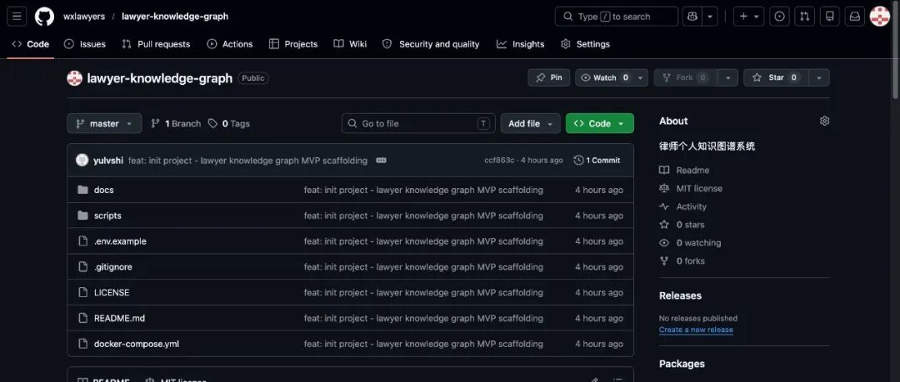

# 我开源了一个面向律师的 AI 知识管理系统：Lawyer Knowledge Graph

> 用代码重塑法律工作流的律师  
> 十五年民商事诉讼律师 | 开源项目作者



---

## 一个痛点

做了十五年民商事诉讼律师，手上有几百个办过的案子。

几年前遇到一个买卖合同纠纷，案情和五年前办过的另一个案子几乎一模一样——同样的争议焦点，同样的法律适用问题。但翻遍了文件夹，也没找到那个案子的详细记录。只记得"好像办过类似的"，却想不起当时的代理思路、法院的裁判规则、以及自己总结的办案经验。最后只好从头研究，多花了至少三天时间。

**律师的办案经验，正在被浪费。**

每办一个案子积累的理解——争议焦点怎么抓、证据链怎么组织、法院对同类问题持什么态度——要么散落在不同文件夹的 Word 文档里，要么沉睡在记忆中越来越模糊。

这就是 **Lawyer Knowledge Graph（律师知识图谱）** 这个开源项目的起点。

---

## 它是什么

Lawyer Knowledge Graph 是一套面向诉讼律师的 **AI 个人知识管理系统**。不是 SaaS 平台，不依赖任何第三方服务——部署在自己的服务器上，数据完全私有。

**核心逻辑：**
> 输入案件材料 → AI 自动提取知识卡片 → 存入向量数据库 → 新案发生时一键检索相似案例和相关法条

**技术栈：** Docker Compose 一键启动 · Python 3.11 + FastAPI · PostgreSQL 16 + pgvector · text2vec-large-chinese 向量模型 · Streamlit 前端 · LLM 支持 DeepSeek V3 / Qwen2.5

---

## 三大核心功能

### 一、案件知识自动沉淀

传统做法：办完一个案子，写一篇办案总结，存到文件夹里，然后再也没有打开过。

这个系统做的是：**粘贴裁判文书或案卷摘要，AI 自动提取结构化知识卡片。**

| 卡片类型 | 说明 | 示例 |
|---------|------|------|
| 争议焦点 | 本案的核心争议问题 | "违约金过高是否应调减" |
| 裁判规则 | 法院对此类问题的裁判标准 | "违约金调减以实际损失的30%为参考上限" |
| 法条适用 | 精确到具体法条编号和要点 | "民法典第585条：违约金调整规则" |
| 办案经验 | 律师视角的实务技巧 | "此类案件应重点收集实际损失证明、行业利润率数据" |

操作流程：打开前端页面 → 粘贴判决书原文 → 点击"提取" → 30秒后获得3-5张知识卡片 → 确认/修改 → 自动存入知识库

### 二、类案智能检索

输入案件描述，系统基于**语义相似度**（非关键词匹配）检索所有相关历史知识卡片。

```
输入："买卖合同中卖方交付的货物质量不符合约定，买方拒付货款并要求赔偿损失"

输出：
- 相似度 0.89 → （2025）苏02民初456号 · 买卖合同纠纷
- 相似度 0.82 → （2024）苏02民初789号 · 承揽合同纠纷
- 相似度 0.76 → 民法典第615条 · 标的物质量不符合要求的处理
- 相似度 0.71 → 民法典第582条 · 违约责任承担方式
```

使用 **text2vec-large-chinese** 中文向量模型，可配置相似度阈值控制精度。

### 三、法规动态追踪

设置关注领域（如"合同纠纷""劳动争议""知识产权"），自动检索新增的司法解释和指导性案例，生成更新摘要推送。

支持对接：**北大法宝（PKULAW）** + **华宇元典（YUANDIAN）**，配置 API Key 即可启用。

---

## 技术架构

| 组件 | 技术选型 | 说明 |
|------|---------|------|
| 后端框架 | FastAPI | 异步高性能，自动生成 API 文档 |
| 数据库 | PostgreSQL 16 + pgvector | 结构化数据 + 向量检索 |
| 向量模型 | text2vec-large-chinese | 中文语义向量化，768/1024 维 |
| 大语言模型 | DeepSeek V3 / Qwen2.5 | 知识卡片提取、摘要生成 |
| 前端 MVP | Streamlit | 快速构建交互界面 |
| 部署方式 | Docker Compose | 一键启动所有服务 |

### 快速开始

```bash
git clone https://github.com/wxlawyers/lawyer-knowledge-graph.git
cd lawyer-knowledge-graph
cp .env.example .env
# 编辑 .env，填入你的 LLM API Key
docker-compose up -d
# 前端：http://localhost:8501
# API 文档：http://localhost:8000/docs
```

### 最低硬件要求

- CPU：4 核及以上
- 内存：8 GB（推荐 16 GB）
- 硬盘：20 GB 可用空间
- Docker Engine 24+ & Compose v2
- 需访问 LLM API（DeepSeek/Qwen）

---

## 当前状态与路线图

**已完成的 MVP：**
- 项目骨架搭建 ✅
- 数据模型设计 ✅
- 知识卡片提取脚本（独立可运行） ✅
- 向量检索脚本（独立可运行） ✅
- API 接口设计 ✅
- Docker Compose 配置 ✅

**正在开发：**
- FastAPI + SQLAlchemy 后端初始化
- 案件录入 API + LLM 知识提取
- Streamlit 前端界面
- 法规追踪模块

---

## 适用场景

| 场景 | 效果 |
|------|------|
| 新案接手 | 输入案情描述，5 秒内找到历史相似案件的裁判规则和办案经验 |
| 办案小结 | 结案后粘贴判决书，AI 自动生成知识卡片 |
| 法规追踪 | 设置关注的执业领域，自动推送新司法解释和指导性案例 |
| 团队协作 | （规划中）多位律师共享知识库，形成团队级知识积累 |

---

## 项目地址

**开源协议：** Apache 2.0

- **GitHub：** <https://github.com/wxlawyers/lawyer-knowledge-graph>
- **Gitee（国内镜像）：** <https://gitee.com/wxlawyers/lawyer-knowledge-graph>

> 律师的核心竞争力不是"记得多少法条"，而是"办过多少案子、沉淀了多少经验"。  
> 这套系统不会替代律师的判断力，但能帮你更快地找到方向、更准地锁定规则、更系统地管理知识。
