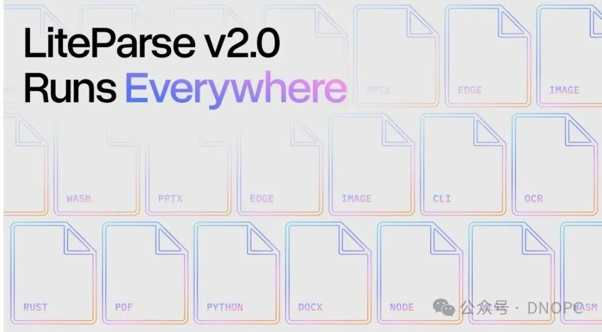
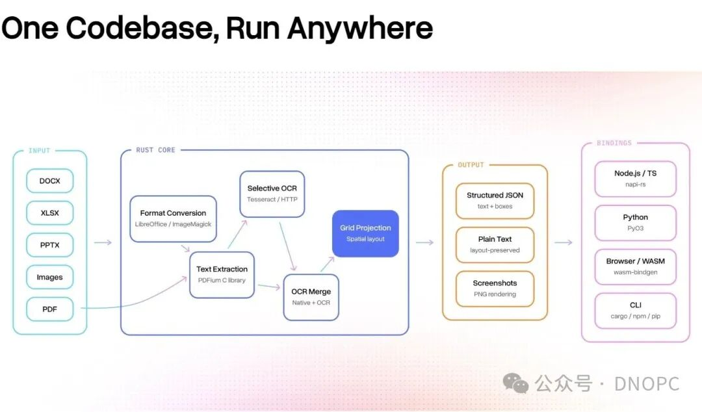
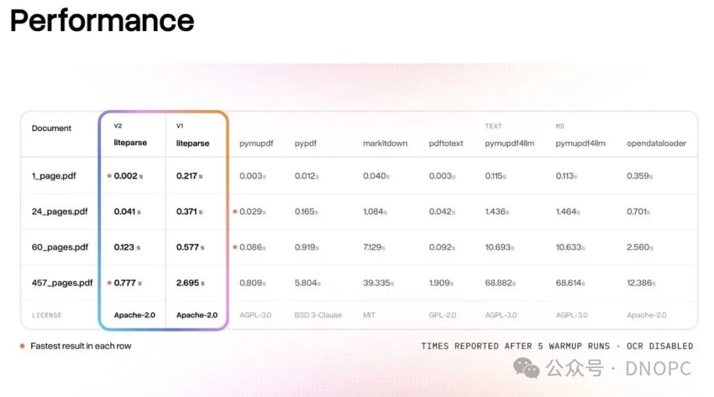

# LiteParse v2.0：用Rust重写，0.777秒解析457页PDF，你的RAG小火箭

0.777 秒。

457 页，100MB 的 PDF，解析完成。

这个成绩，来自 LiteParse v2.0。

今年它干了一件大事：用 Rust 重写了整个项目。611 次提交，90 个分支，50 个版本发布。结果是同一套代码，四个平台同时跑：Rust、Python、Node.js、浏览器。



---

## 文档解析的痛点，从来不只是"能不能解析"

玩了 RAG 应用的人都知道，PDF 解析是个坑。

文字藏在表格里，跨页段落被切成两半，扫描件全是图片，OCR 精度参差不齐。这些问题折腾了开发者多少年。

LlamaParse 是 LlamaIndex 给出的云端答案。130 多种格式，agentic OCR，适合复杂文档和企业级场景。贵是贵，但效果稳。

到了 2026 年，LlamaIndex 在文档解析这条线上长出了两把刀，各自切不同的场景。

**LlamaParse** 是企业级云解析平台。130 多种格式，agentic OCR，让 AI 代理判断每个页面应该用什么策略解析。2025 年底 v2 发布，准确率大幅提升，成本降了三到四成。配套 LlamaExtract（结构化提取）和 Split（大文档拆分）。适合复杂文档：密集表格、多栏布局、扫描件、手写笔记。

**LiteParse v2.0** 是今年的重头戏。它跟 LlamaParse 完全是两条技术路线，定位差异远不止"一个在云端一个在本地"这么简单。

一句话说清楚：LiteParse 是一个纯本地运行的文档解析工具，零云依赖，MIT 协议免费。

今年 v2.0 用 Rust 重写了整个项目。611 次提交，90 个分支，50 个版本发布。结果是一套代码，四个平台同时跑：

```
# Rust / CLI
cargo install liteparse

# Python
pip install liteparse

# Node.js
npm i @llamaindex/liteparse

# 浏览器 / Edge（完全本地运行！）
npm i @llamaindex/liteparse-wasm
```

同一套 `lit` 命令，在任何地方行为一致。

性能数字很暴力：小文档比 Node.js 版快 5 到 100 倍，大文档平均快 3 倍。457 页 100MB 的 PDF，0.777 秒跑完。竞品根本追不上这个速度。

它是怎么做到的？自定义 PDFium 分支加上 `tesseract-rs`，所有东西都是编译时静态链接。不用装任何运行时依赖，Tesseract OCR 开箱即用。需要更高精度的话，接 EasyOCR 或 PaddleOCR 也是一句话的事。

支持格式：PDF、DOCX、XLSX、PPTX、图片。输出三种格式：带坐标的 JSON、保持排版的纯文本、高质量页面截图。

WASM 版本可以直接在浏览器里运行。LlamaIndex 官方做了个在线 Demo，打开网页就能试，所有解析跑在本地，连网络都不用。

LiteParse 还支持作为 Agent Skill 接入主流编码 Agent。Claude Code、Codex、OpenCode、Pi Coding Agent，一条命令装进去：

```
npx skills add run-llama/llamaparse-agent-skills --skill liteparse
```

LlamaParse 和 LiteParse 的分工很清晰：

|  | LiteParse | LlamaParse |
| --- | --- | --- |
| 运行位置 | 本地 / 浏览器 | 云端 |
| 许可证 | MIT（免费） | 付费 SaaS |
| 核心原理 | PDFium + Tesseract | Agentic LLM OCR |
| 适合场景 | 简单文档、实时处理、本地优先 | 复杂文档、企业级提取 |

LiteParse 走的是另一条路。

一句话：纯本地运行，零云依赖，Apache 2.0 协议免费。

不用注册账号，不用充钱，不用担心数据外传。适合简单文档、实时处理、隐私敏感的场景。



---

## Rust 重写：性能从哪来

v2.0 之前，LiteParse 是个 Node.js 包。跑得起来，但小文档要起一个 Node 进程，延迟高，内存占用也不小。

Rust 重写之后，性能数字直接拉满：

| 文档类型 | 速度提升 |
| --- | --- |
| 小文档（几页） | 快了 5 到 100 倍 |
| 大文档（百页以上） | 平均快 3 倍 |
| 极限测试：457 页 100MB PDF | 0.777 秒跑完 |

怎么做到的？两件事。

第一，定制 PDFium 分支。PDF 渲染引擎是核心，LiteParse 维护了一套自己的分支，专门为解析优化。

第二，tesseract-rs 编译时静态链接。OCR 能力打包进二进制，不依赖任何外部运行时。Tesseract 开箱即用，如果需要更高精度，一句话切 EasyOCR 或 PaddleOCR。

所有东西编译成原生代码，没有中间层，没有虚拟机，没有 Node 进程。速度就这么挤出来了。



---

## 四套安装方式，行为完全一致

同一个 `lit` 命令，在哪都一样：

```
# Rust / CLI
cargo install liteparse

# Python
pip install liteparse

# Node.js
npm i @llamaindex/liteparse

# 浏览器 / Edge（完全本地运行！）
npm i @llamaindex/liteparse-wasm
```

底层是同一套 Rust 核心，四个语言绑定各走各的封装：Node.js 用 napi-rs，Python 用 PyO3，浏览器用 wasm-bindgen。

CLI 功能也一样完整：

```
# 基础解析
lit parse document.pdf

# 指定输出格式
lit parse document.pdf --format json -o output.json

# 只解析特定页面
lit parse document.pdf --target-pages "1-5,10,15-20"

# 截图生成
lit screenshot document.pdf -o ./screenshots

# 批量处理
lit batch-parse ./input ./output
```

WASM 版本最有意思。打开 LiteParse 官方 Demo，网页上直接跑解析，所有计算在浏览器本地完成，网络都不用连。

---

## 支持的格式和输出

输入端支持 PDF、DOCX、XLSX、PPTX、图片。Office 文档走 LibreOffice 转 PDF，图片走 ImageMagick 转 PDF，全自动。

输出三种格式：

- **带坐标的 JSON**：每个文字块的位置精确记录，方便后续处理
- **保持排版的纯文本**：段落结构、换行、缩进都在
- **高质量页面截图**：PNG 输出，给 LLM 看图用

OCR 语言默认英语，支持多语言切换：`--ocr-language fra` 就是法语，`--ocr-language chi_sim` 就是简体中文。

离线环境也没问题。设置 `TESSDATA_PREFIX` 指向本地训练数据目录，摆脱网络依赖。

---

## 集成到 Agent：一条命令装进去

LiteParse 还支持作为 Agent Skill 接入主流编码 Agent：

```
npx skills add run-llama/llamaparse-agent-skills --skill liteparse
```

Claude Code、Codex、OpenCode、Pi Coding Agent，一条命令装进去。装完之后，Agent 可以直接调用 `lit` 解析上传的文档，处理速度比云端方案快几个量级。

---

## 总结一个

LiteParse v2.0 的 Rust 重写带来了性能飞跃，一套代码四平台让它真正成了通用工具。0.777 秒解析 457 页 PDF 这个数字，拿去跟任何竞品比都不虚。

下一步怎么走？LlamaIndex 官方在博客里提到，WASM 版本是重点方向。浏览器和 Edge runtime 的支持意味着，未来文档解析可以直接嵌入任何网页应用，本地运行，无需服务器。

隐私敏感场景的文档处理，这个需求只会越来越大。

---

**相关链接：**

- LiteParse GitHub：https://github.com/run-llama/liteparse
- LiteParse 官方文档：https://developers.llamaindex.ai/liteparse/
- LiteParse 在线 Demo：https://run-llama.github.io/liteparse/
- LlamaParse 云端解析：https://cloud.llamaindex.ai/
