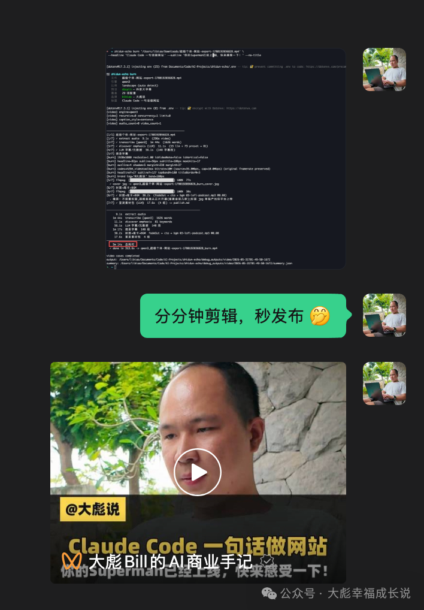
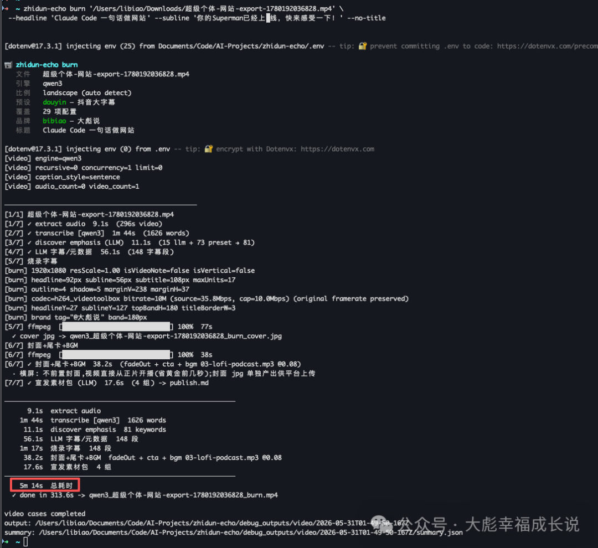

**我把自己天天在用的视频工具，开源了。**

做内容的人都懂一件事：**录制只占 20% 的时间，剩下 80% 全耗在「后面那一堆」**——转写、对字幕、切口水、配封面、起标题、改成竖屏、再给每个平台单独排版……

我自己被这套流程折磨够了，于是干脆写了个工具，把这 80% 压缩成**一条命令**。

它叫 **echocut**。今天，我把它开源了（Apache-2.0，免费，可商用）。

👉 [github.com/BillLucky/echocut](https://github.com/BillLucky/echocut)

#### 先看看效果





#### 它能干嘛？一条命令的事

把视频丢给它：

```bash
echocut burn 你的视频.mp4 --cut-fillers
```

它会自动跑完这 7 步，全程在你**自己的电脑**上：

1. **抽音轨** —— 自动降噪、响度归一，提升识别率
2. **转写** —— 词级字幕，长视频自动分块、断点续跑
3. **切口水 / 静默** —— 把「嗯…啊…」和长停顿剪掉，音画字幕完全同步
4. **找爆点词** —— 本地大模型挑出该高亮的关键词
5. **生成标题/副标题** —— 也可以自己指定
6. **烧字幕** —— 大字号、强描边，叠上你的品牌胶囊
7. **封面 + 片尾 + 背景音乐** —— 顺手把宣发包（各平台标题、话题标签）也出了

跑完你拿到的不是半成品，而是：**成片 mp4 + 封面图 + 字幕文件 + 一份各平台文案**。

#### 最关键的一点：全程本地，不上云

你的素材**永远不离开你的机器**。不上传、不过别人的服务器、不用打开任何剪辑软件、不用拉时间线。

底层就三样开源能力：**FFmpeg + Whisper（语音转写）+ Ollama（本地大模型）**。Mac（Apple Silicon）上能跑最快的 MLX 引擎；其他机器用 WhisperX，CPU 或英伟达显卡都行。

#### 竖屏、横屏、录屏，它都懂

不同形状的视频，叠加的方式不一样：

- **竖屏 9:16**：标题在上、大字幕在下，口播类默认
- **横屏 16:9**：全屏录屏/教程**保持横屏**（套进竖屏会把画面压成中间一条），封面单独出图
- **OBS「上脸下屏」**：顶部压成窄条，人脸不被遮，小标题贴在品牌胶囊右边

而且**品牌胶囊（@你的昵称）会画在每一帧**——谁截图转发，都能顺着它找回到你。这是我特别在意的「品牌资产」设计。

#### 一个品牌 = 一份 JSON

想做成自己的风格？复制一份模板，改改名字、颜色、@昵称、CTA 就行：

```bash
cp configs/brands/_template.json configs/brands/mybrand.json
echocut burn 视频.mp4 --brand mybrand
```

多账号、多人设，各管各的，互不污染。

#### 它其实是一整套工具箱

`burn` 只是入口，还有一堆：

- **长视频切精华**：`highlights` 自动切 N 段，或先 `hls` 分析候选段再挑着出
- **多平台分发**：`distribute` 一次出 6 个平台各自的标题/描述/话题
- **开场钩子**：`hook-gen` 一次给 5 个不同风格的前 3 秒钩子
- **单出封面**：`cover`（视频用别的工具剪，封面用统一规格）
- **文章/翻译/跨语言**：`article` / `translate` / `cross-lang`（中→英/日/西）

完整命令手册在仓库的 `docs/CLI.md` 里，**写得足够细，连 AI 编程助手（Claude Code / Cursor）都能照着直接调用**。

#### 怎么开始？

```bash
git clone https://github.com/BillLucky/echocut.git && cd echocut
npm install
python3 -m venv .venv && .venv/bin/pip install -r requirements.txt
npm run fetch-fonts      # 下载默认中文字体（Noto Sans SC，开源）
npm link
echocut doctor           # 环境自检，告诉你缺啥
```

需要：Node.js 18+、Python、FFmpeg，以及本地的 Ollama（跑标题/字幕校正）。`echocut doctor` 会帮你检查环境。

#### 为什么要开源？

说实话，这工具我自己已经用得很顺手了。开源出来，一是想看看能不能帮到同样被剪辑流程拖累的人，二是好东西一起打磨会更快。

仓库里中英文文档、命令手册、给 AI 工具用的项目说明都备齐了，clone 下来就能跑、能改。

**有想法、发现 bug、想加功能，欢迎来提 issue / PR。来玩 🙌**

⭐ [github.com/BillLucky/echocut](https://github.com/BillLucky/echocut)
