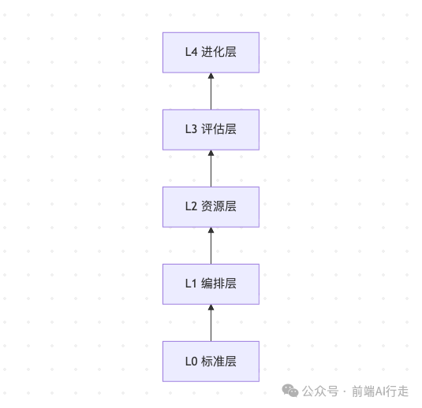
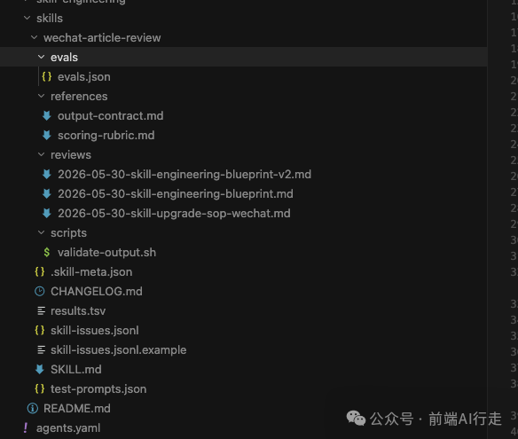
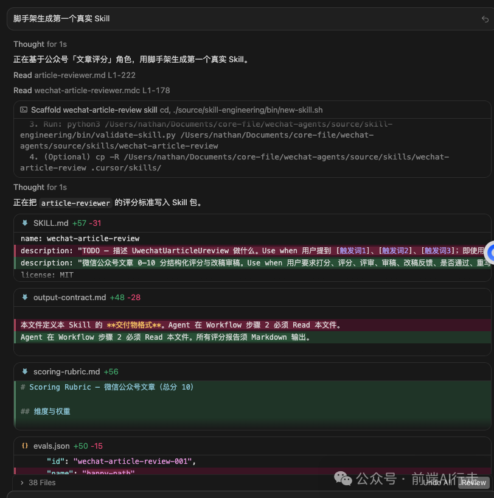
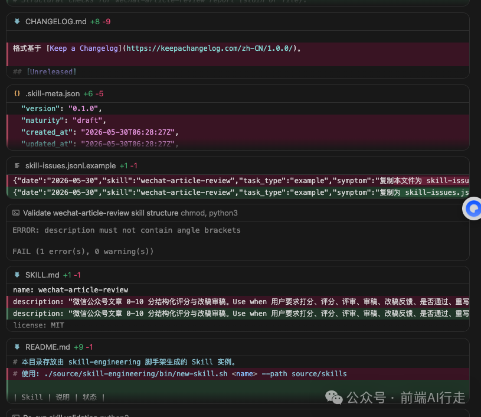
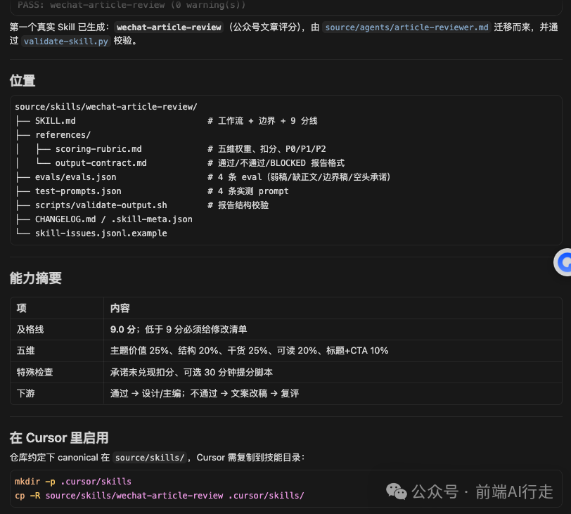
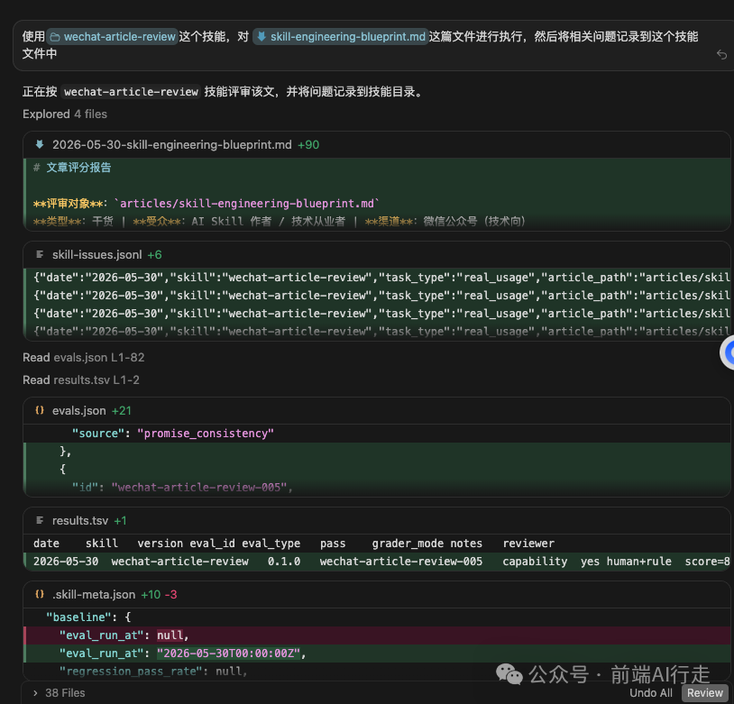
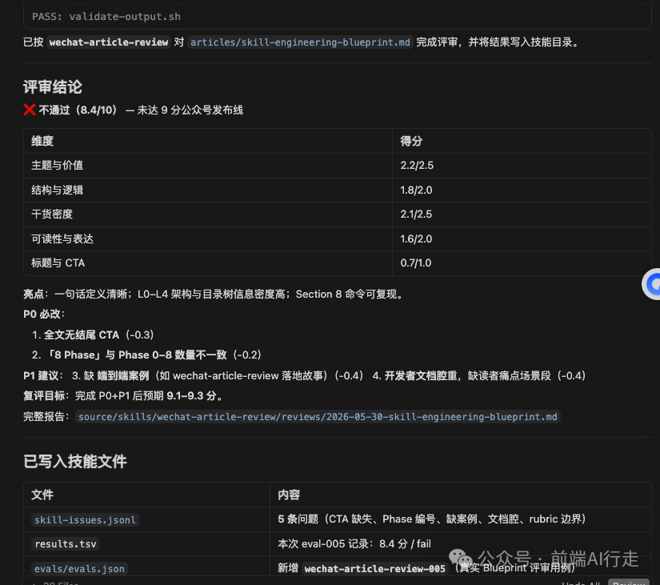
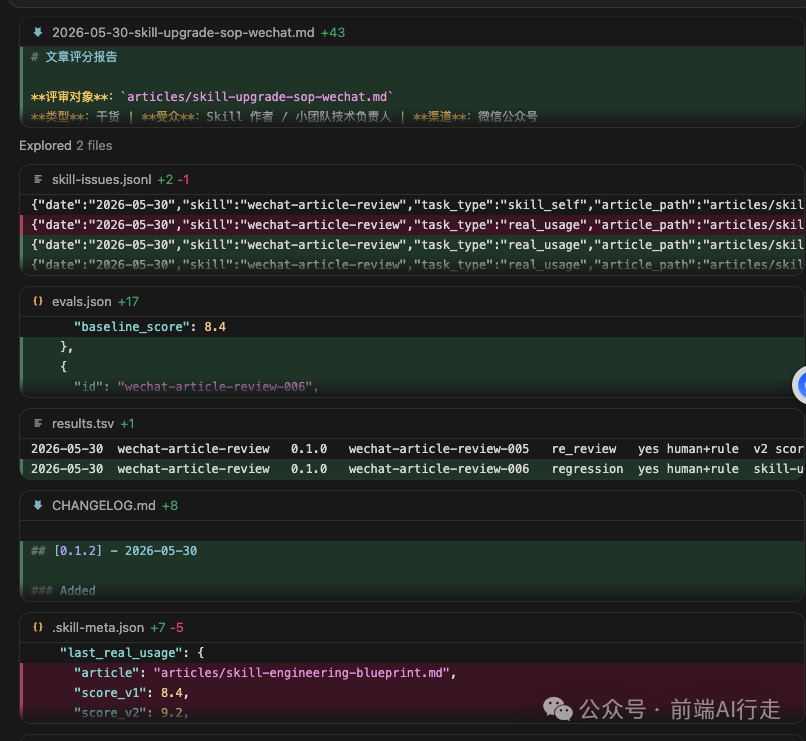
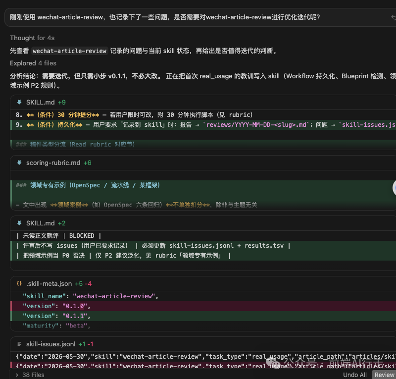

# AI Agent Skill 工程化 01：写 Skill 不是写 Prompt，构建可迭代的工程体系

> 配套脚手架：
>
> https://github.com/yangmeishux/frontend-team-marketplace/tree/main/plugins/frontend-team-toolkit/skill-engineering

---

## 一句话定义

**工业级 Skill = 符合开放标准的 Skill 包 + Eval 测试集 + 版本/基线记录 + 可执行的升级迭代方法论。**

不是「写一段更好的提示词」，而是把团队经验做成 **可版本化、可验证、可回归、可进化** 的工程资产。

---

## 你可能正在经历的 3 个信号

**信号 1**：Skill 越写越长，改一句怕整段失效，只能靠「感觉更好」验收。
**信号 2**：同事换了电脑或换了 Agent，同一 Skill 触发时灵时不灵，没人敢动 `description`。
**信号 3**：线上任务翻车了，复盘只留在聊天记录里，下次还会踩同一个坑。

**信号 4**：技能都是让AI自己写的，我也不知道里面是啥？

**信号 5：在使用技能的时候，其实我也不确定，结论是否是这个技能的产物。**

...等等其他情况。

如果你中了两条以上，问题通常不是 prompt 不够长，而是 **缺 eval、缺 baseline、缺问题池**——Skill 还没进入工程化阶段。

下面这份蓝图指南 + 仓库脚手架，就是要把「个人技巧」变成「团队资产」。

---

## 1. 设计目标

| 目标 | 含义 | 你怎么验收 |
| --- | --- | --- |
| 专业化 | 职责单一、边界清晰 | 有 `output-contract.md`，输出格式固定 |
| 标准化 | 遵循 agentskills.io | 跑通 `validate-skill.py` |
| 可迭代 | 改动有假设、有对比 | CHANGELOG + baseline 分数 |
| 可升级 | 翻车能沉淀为 eval | `skill-issues.jsonl` → 新 test case |
| 可组合 | 大 Skill 调小 Skill | read/write 库分层（进阶） |

---

## 2. 架构分层



**图示说明**：自下而上阅读——下层是上层的基础；

**L0–L3** 由本仓库脚手架提供目录与校验，

**L4** 需另行安装 meta-skill（如 darwin-skill）做自动「改→测→保留/回滚」。

| 层级 | 做什么 | 本仓库有什么 | 典型文件/工具 |
| --- | --- | --- | --- |
| L0 标准 | 格式与命名 | ✅ 脚手架 + validate | agentskills.io、`validate-skill.py` |
| L1 编排 | 触发、步骤、边界 | ✅ 模板 | `SKILL.md` |
| L2 资源 | 细则、脚本、模板 | ✅ 模板 | `references/`、`scripts/`、`assets/` |
| L3 评估 | 测试、基线、问题池 | ✅ 模板 | `evals.json`、`results.tsv`、`skill-issues.jsonl` |
| L4 进化 | 自动/半自动优化 Skill | ❌ 需对接 | darwin-skill、skill-creator benchmark |

**L4 是什么意思？** 不是新文件类型，而是 **「让 Skill 持续变好」的工具层**

脚手架帮你 **建和测（L0–L3）**；

L4 帮你 **自动迭代**，两者配合、不是一回事。

**L4** 就是自动、持续改 Skill、只保留变好的版本，本质上就是让 Skill「自己迭代优化」（半自动/自动）。

比如 Karpathy 的 autoresearch，darwin-skill，用 Anthropic 的 `skill-creator` 跑 benchmark，用 ECC 的 `continuous-learning-v2` 从会话里长出新 Skill等对接外部 meta-skill，不是脚手架里再嵌一层。

**L4** （后续进阶）：Skill 稳定后，可接入上述等工具，自动「改→测→保留/回滚」等等一系列的操作。

---

## 3. 标准目录结构

每个 Skill 是一个目录，最小工业栈：

```
<skill-name>/
├── SKILL.md              # 工作流 + 边界
├── CHANGELOG.md          # 版本动机
├── .skill-meta.json      # baseline 分数
├── evals/evals.json      # 测试 + 断言
├── test-prompts.json     # 实测 prompt
├── results.tsv           # eval 历史
├── skill-issues.jsonl    # 生产问题池
├── references/           # 长文档、输出契约
└── scripts/              # 确定性校验
```

`SKILL.md` 必备：**When to Activate / When NOT / Workflow / Checkpoints / Anti-patterns**。
Frontmatter 遵循 agentskills.io：`name` + `description`（含 **Use when** 触发词）。

---

## 4. 生命周期（9 Phase，含 Phase 0 创建）

与 `skill-upgrade-sop.md` 对齐：

```
Phase 0  脚手架创建     →  new-skill.sh
Phase 1  意图与边界     →  output-contract
Phase 2  先写 Eval      →  evals.json（≥3 case）
Phase 3  跑 Baseline    →  results.tsv
Phase 4  单假设小步改    →  一次只改一维
Phase 5  分层验证       →  Spot → Regression
Phase 6  棘轮决策       →  keep / revert
Phase 7  发布           →  CHANGELOG + 版本
Phase 8  生产监控       →  issues → eval
```

**两类 Eval**：Capability（能不能做 hard thing）vs Regression（旧能力有没有退步）。
**Grader 优先级**：rule → structure → trajectory → model → human。

---

## 5. 工具链怎么拼

| 你要做的事 | 本模版仓库 | 外部 |
| --- | --- | --- |
| 建目录 | `new-skill.sh` | Cursor `/create-skill` |
| 校验格式 | `validate-skill.py` | agentskills.io |
| 跑 benchmark | 模板 `evals.json` | Anthropic skill-creator |
| 自动优化 | — | darwin-skill |

**MVP 一条链**：

```
new-skill.sh → 填内容 → validate-skill.py → 跑 eval → issues 反哺 → 再迭代
```

---

## 6. 在本仓库里放哪

| 放哪 | 干什么 |
| --- | --- |
| `frontend-team-toolkit/skill-engineering/` | 脚手架模板（勿当 Skill 直接用） |
| `source/skills/<name>/` | 团队 Skill 草稿（可版本管理） |
| `.cursor/skills/<name>/` | 复制后给 Cursor Agent 加载 |

三份文档分工：**SOP** = 怎么迭代 · **Blueprint** = 标准结构 · **脚手架** = 一键生成。

---

## 7. 落地路径

**第 1 周（MVP）**：`new-skill.sh` → 3 个 eval → validate → dry run 记 `results.tsv`。
**第 2–4 周**：skill-creator benchmark；issues 转 eval；试 darwin 棘轮。
**第 2 月+**：CI 跑 validate + regression；季度 skill-stocktake。

---

## 7.1 案例：首个 Skill `wechat-article-review` 怎么落地的

这是本仓库 **第一次** 把脚手架跑通的真实路径，供你对照。

**案例截图如下：**

技能目录：



技能生成中：




技能创建完成：



技能使用测试：




技能使用问题记录：



技能迭代优化：



**大致的具体流程如下：**

**Day 1 — 创建**
运行 `new-skill.sh wechat-article-review`，从一套工作流中的文件，比如 `article-reviewer.md` 迁移五维评分规则，补 `evals.json` 4 条 synthetic case。`validate-skill.py` 首次因 description 含 `<` 符号失败——改措辞后 PASS。

**Day 1 — 首次真任务**
用该 Skill 评审 `articles目录下的/skill-engineering-blueprint.md`（就是本文 v0版本）。结论 **8.4 分不通过**：缺 CTA、Phase 标题不一致、无端到端案例。问题写入 `skill-issues.jsonl`，并 **反哺 eval-005**。

**Day 2 — 改稿（就是你现在看的 v2）**
按 P0/P1/P2 清单：补读者场景段、修正 9 Phase 标题、加本案例、文末 CTA。复评 **9.2 分通过**。

**你可以抄走的 3 点**

1. 真任务失败 → 必须进 `skill-issues.jsonl`，不要只骂一句 prompt

2. 值得改 Skill 的问题 → 先变 eval case，再改 SKILL.md

3. 脚手架只解决「目录齐」，**9 分线**仍要靠 wechat-article-review 这类把关 Skill

---

## 8. 快速开始（复制即用）

参考仓库地址：

https://github.com/yangmeishux/frontend-team-marketplace/tree/main/plugins/frontend-team-toolkit/skill-engineering

```
# 1. 创建
/skill-engineering/bin/new-skill.sh my-skill --path /skills

# 2. 编辑 SKILL.md + evals/evals.json

# 3. 校验
python3 skill-engineering/bin/validate-skill.py skills/my-skill

# 4. 复制到 Cursor（可选）
cp -R skills/my-skill .cursor/skills/
```

详细说明见(https://github.com/yangmeishux/frontend-team-marketplace/blob/main/plugins/frontend-team-toolkit/skill-engineering/README.md)。里面也附赠模板的。

你可以根据你的现状功能描述，再使用这 skill-engineering 脚手架，就可以搭建你自己的专属AI Agent Skill 技能，并可以进行专业化的维护与开发。

---

## 9. 参考链接

• Agent Skills 开放标准：https://agentskills.io/specification

• Anthropic skill-creator：https://github.com/anthropics/skills/tree/main/skills/skill-creator

• Darwin Skill：https://github.com/alchaincyf/darwin-skill

• Anthropic — Demystifying Evals for AI Agents：

https://www.anthropic.com/engineering/demystifying-evals-for-ai-agents

---
