# 侠客汇 AI-Native 之路：如何打造「可自进化」的端到端 AI 工作流

2026 年 2 月，侠客汇一个会员改版需求，**整整做了 3 个月**才上线，业务一堆项目卡在后面干等。

1 个月后的今天，同样规模的需求，我们 **3 周就能交付**。而且变化远不止「快」这一点：

| 维度 | 改造前 | 改造后 |
| --- | --- | --- |
| **协作角色** | 6 种（运营/产品/UI/前端/后端/测试） | 3 种（运营 / 产品设计 / 技术） |
| **文档产出** | 纯人工撰写 | AI 出初稿、人审（纪要/PRD/技术文档/用例） |
| **信息衰减** | 跨 6 角色层层衰减、反复对齐 | 产品-技术两端直连，纪要即「需求契约」 |
| **典型需求周期** | 会员改版 3 个月 | 同类需求 3 周交付 |
| **研发效率** | — | 整体提升 50% |
| **经验复用** | 靠人记、人传，人走即清零 | 沉淀进知识库，越用越聪明、抗人员流动 |

但最核心的改变不在这张表里——是我们打造出了一条「可自进化」的端到端 AI 工作流：**从需求沟通到上线交付全程由 AI Agent 驱动，而它每跑一个需求，就把新经验沉淀进「组织记忆」、自动变得更懂业务**。正因如此，效率提升不再是一次性的，而是可累积、可复利：需求做得越多，工作流越聪明，下一个需求就越快。

我们只做了两件事：

- **让 AI Agent 驱动每个环节，人只做决策和审核**
- **把团队每一次的经验沉淀成那份会自进化的「组织记忆」**

下面，就从那个「耗时 3 个月」的需求讲起，说说这一切是怎么发生的。

---

## 一次「3 个月才上线」的改版

先把这 3 个月，慢在哪拆开看。

一个会员改版需求，要走完这样一条链路：运营提需求、产品调研现有系统能力并梳理改动点、反复开会确认决策点；产品手写 PRD、画原型、改方案；再拉上前端、后端、测试、UI，开需求评审会、技术评审会、测试用例评审会……6 种角色、15 个节点、5 场评审会，需求在一个个角色之间层层传递。

问题就出在「传递」上。每经过一个角色，信息都在衰减：运营的真实意图，产品转述时会走样；技术理解需求时又有 gap；UI 拿到再问一轮……于是反复沟通、反复返工。更棘手的是，会员系统历经 2 年、多次小改版，没人能完整复述线上逻辑，光是翻历史代码、捋清现状就耗掉大量时间。

而最深的一道坑是：**这条链路上的经验，没有沉淀下来。**上次改版踩过的坑、定过的规则，都散在个别人的脑子里、某次会议的纪要里。下一个需求来了，一切又从零开始。

所以我们想做的，不只是「把这次改版做快」，而是让整个组织**既快、又会越来越快**——这就引出了贯穿全文的两条线：产品线与技术线。

---

## 一、慢的真相：拆开旧流程

那 3 个月，不是哪个人不努力，而是**整条流水线的结构**就注定了慢。把旧流程摊开，慢有三个根源：

| 慢的根源 | 具体表现 |
| --- | --- |
| **重复劳动多** | 需求现状调研、写 PRD、画原型、画 UI、写用例——大量人工撰写，纯耗时 |
| **信息层层衰减** | 需求跨 6 个角色传递，每过一道手就走样一次，理解偏差只能靠反复开会对齐 |
| **经验不沉淀** | 踩过的坑、定过的规则只在个人脑子里，下个需求从零开始，同样的弯路再走一遍 |

解法的方向因此也很清楚：**用 AI 替代重复劳动、精简角色与环节、消除信息衰减、把经验沉淀下来让组织复用。**

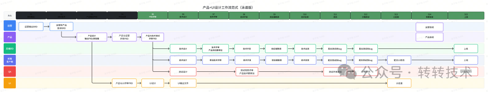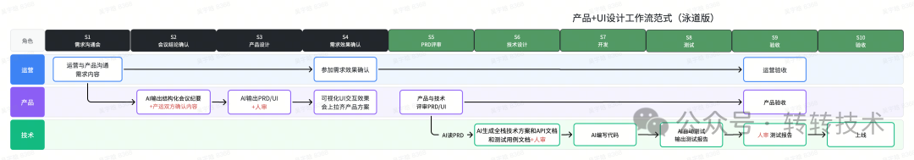

---

## 二、我们的两条信念

**信念一：每一个环节，都由 AI Agent 来操作和驱动，人只做决策和审核。**

AI Agent 是流水线的**操作者**——它读需求、查代码、写文档、自检、评审、归档，一整套连贯地跑下来。人退到该在的位置：在关键岔路口做判断、为模糊处拍板、对最终结果负责。重复劳动交给 Agent，高价值的决策留给人。

**信念二，也是本质：我们要的不是一个工具，而是一份「可自进化的组织记忆」。**

经验不再靠人「抽空整理」，而是在 Agent 执行任务的过程中被自然沉淀，再供给下一次的 Agent 或下一个人。**需求做得越多，这份记忆越丰富、越准确、越成熟。**它如同一位永不离职、且持续精进的资深同事。

下面分产品、技术两条线看它们怎么落地——你会发现，它们其实是同一个故事的两种讲法。

---

## 三、产品线：找关键提效点，约定输入输出标准

**这一段在解决什么：**产品设计链路上「找真需求、写 BRD、写 PRD、画原型图、画 UI」的耗时与信息衰减。

**怎么解：**先想清楚 AI 该先打哪、产品和技术怎么分工，再用 AI 替代重复撰写，把 6 种角色协作在生产端收敛成「产品设计、技术开发」两端的「1+1」极简协作——运营提出的需求，将产品设计、UI 设计都归到「产品」这一端。

### 3.1 启动之前：先想清楚 AI 解决什么问题

很多事情都可以通过 AI 赋能，但需要想清楚我们先解决什么问题，于是我们把需求分了类：

| 需求分类 | 特点 | 怎么对待 |
| --- | --- | --- |
| **现有系统日常迭代** | 占整体 **90% 以上**，依托业务系统、直面终端用户，业务逻辑复杂、中台逻辑耦合深 | 痛点是上线流程繁琐、排期周期长、机会成本极高——**本次优先攻坚** |
| **纯增量创新需求** | 创新型项目需求，多为内部运营配套系统，不直接面向终端用户。目前该类需求落地较少，ROI 偏低、业务优先级靠后，但实际也存在明确优化痛点。 | AI Agent 可全流程闭环，留作后续创新空间 |

综合业务痛点优先级、落地难度及价值回报，本次产品的 AI 原生工作流建设，优先聚焦**现有系统日常需求迭代的效率痛点**，开展优化落地。

我们参考了一下目前互联网企业 AI 工作流落地模式，不同公司不同部门工作范式差异巨大，没有统一标准，也无法直接照搬，要根据实际业务的情况和组织现状，去思考合适的范式。

最终我们借鉴阿里「1+1 协作」范式并进行本地化适配——舍弃产品闭环前端开发那一环，把范式定为产品-技术的「1+1」分工——**【产品端：运营需求 + 完整方案 + 高保真 UI】+【技术端：全流程生产交付】**。

### 3.2 痛点：每个角色到底卡在哪

前面「慢的真相」看的是全链路的三个结构性根源；现在把镜头推近，只看产品设计这一段，每个角色具体卡在哪：

| 角色 | 工作环节 | 核心痛点 |
| --- | --- | --- |
| **运营** | 需求采集、优先级判定 | 如何找到**真需求**，并准确总结，定义优先级 |
| | 需求整理、BRD 输出 | 纯人工撰写，**耗时耗力**，效率偏低，描述准确性低 |
| **产品** | PRD 设计、原型输出 | 人工调研**周期长**，**跨角色传递**信息衰减、理解偏差，反复沟通，修改成本高。 |
| **UI** | UI 方案设计 | 人工设计耗时久；跨角色理解偏差，需频繁与产品对齐，**沟通成本高** |

目标因此明确：**用 AI 替代各环节重复性工作，精简协作角色与流转环节，从根上解决跨角色的信息衰减与理解偏差**，把链路收敛成产品设计-技术两端的「1+1」协作。

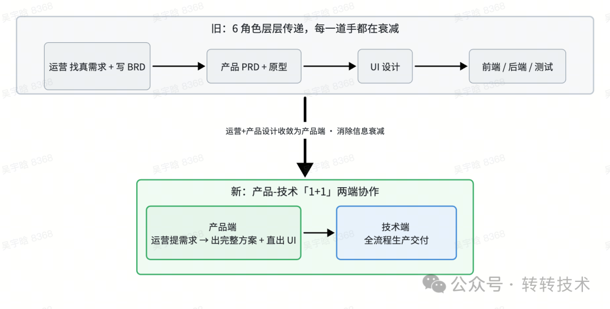

具体怎么落？我们从需求输入、PRD 设计、UI 设计三个环节分步解决。

### 3.3 第一步：把「写 BRD」换成「开一场好会」

第一个关键判断是：**不要拿 BRD 喂 AI**。因为 BRD 有 AI 克服不了的天然缺陷——我们实测过不同投喂物料的效果：

| 投喂物料 | 效果 |
| --- | --- |
| **BRD** | **噪音多**（背景与目标混杂、方案脑补、逻辑跳跃）、**方案越界**（写「我要这个功能」，而非「要解决什么问题」）、**共识模糊**（运营单向输出、未经产品校验）——AI 会把错误假设当事实，生成看着完整、实则全是坑的 PRD |
| **会议纪要** | **信息纯净**（只记双向确认后的结论）、**需求聚焦**（会上已把「解法」拉回「需求」）、**共识强绑定**（相当于双方签字的「需求契约」）——是当前条件下的**最优解** |

于是探索出一条高效的「产运工作流」：

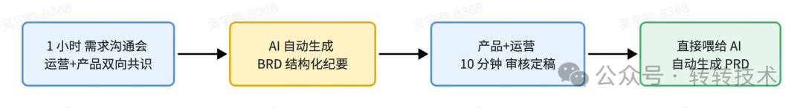

这条工作流背后是一个固化的 AI 技能：上传会议逐字稿、一句固定指令「按 BRD 结构输出文档」，自动产出覆盖核心痛点、数据支撑、P0/P1/P2 分级功能、业务流程、规则、风险、待办的标准化纪要，并且会自动创建飞书文档连接。它对业务**无感、无负担**——运营不必再提前花大量时间写 BRD，仅一场标准需求沟通会就完成共识；我们还可以**统一需求会议标准**，反向推动业务一起从源头提升需求沟通质量。

### 3.4 第二步：PRD 从「人工撰写」到「AI 分步生成 + 人工逐段确认」

对标传统 PRD 全流程，我们搭了一条**分步人机校验**的自动化工作流——不追求「一键生成完整 PRD」（那只会批量出错），而是 AI 分步起草、人工逐段把关：

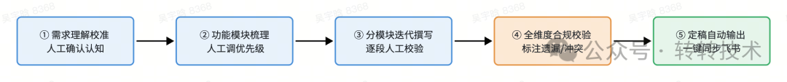

这条流水线不是一蹴而就的，它**踩着坑迭代了六个阶段**才成型——这段历程，恰好就是「知识沉淀」这件事的最初摸索：

| 阶段 | 做了什么 | 踩到什么坑 / 得到什么认知 |
| --- | --- | --- |
| **尝鲜期** | 直接用 AI 一键生成完整 PRD | 幻觉严重、编造业务逻辑——大模型只是概率预测工具，不是万能魔法 |
| **规范期** | 固定团队 PRD 模板投喂 | 格式规范了，内容仍不达标——**格式规范 ≠ 内容可用** |
| **拆解期** | 拆成多模块分步生成、逐模块人工核对 | 出错率大降——最优模式是「AI 快速起草 + 人把控方向与逻辑」 |
| **寻源期** | 接入历史 PRD 与真实代码校准 | 全量投喂导致上下文溢出——**堆数据 ≠ 有效输入**，必须精炼 |
| **降噪期** | 只投喂精炼核心：《产品逻辑时间轴》+《底层代码索引》 | 输出质量**质的跃迁**，贴合真实业务、不再编造 |
| **进化期** | 搭「错题本」+ 动态纠错 | 人工纠错自动沉淀为规则门禁，工作流**自我纠错、持续进化** |

走到「进化期」你会发现：**产品线踩出来的这套「精炼知识 + 自动纠错」，恰恰就是技术线那座「项目知识库」的雏形。**两条线在这里第一次握手。

### 3.5 第三步：UI 从「反复对齐」到「AI 直出可交付物料」

摒弃原有「产品手绘原型 + 提 UI 需求 + 反复沟通对齐」的低效模式：产品依托 AI 工具 Claude Code 直接生成标准化 UI 交付文件（Figma），**全程无需与 UI 设计师反复对齐**，产出物可直接交付技术开发。这一步依托 UI 与前端的**组件标准化基建**。

### 3.6 怎么把它稳稳铺开：先内部打磨，再业务无感渗透

好工具还得能落地。我们没有一上来就全员铺开，而是走「先内部打磨、再对业务无感渗透」的两段节奏：

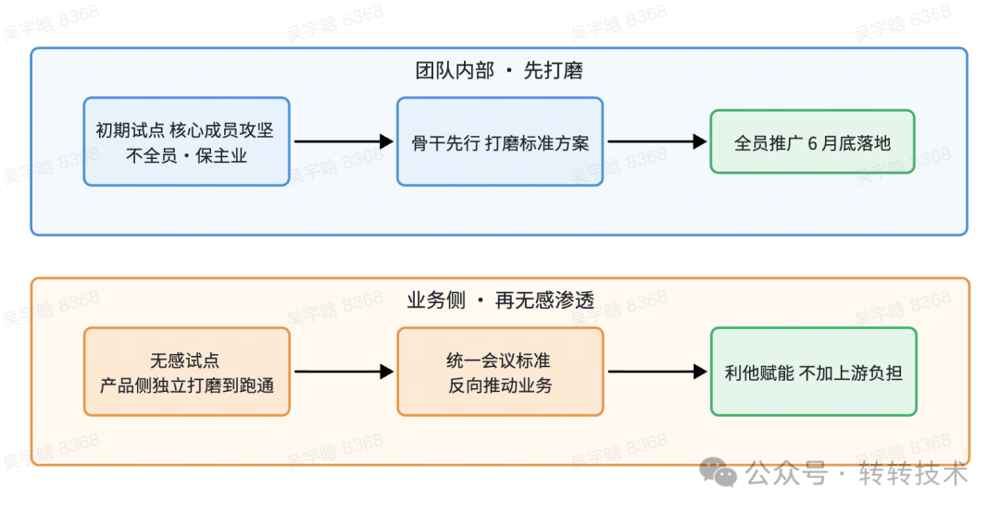

- **团队内部：**初期不追求全员铺开，聚焦小范围核心力量攻坚，在不影响正常业务迭代的前提下，快速跑通、打磨 AI 工作流。产品负责人亲自跟进所有 AI 产出结果，针对输出质量给出精准反馈，真实摸清当前 AI 能力的边界、优势与短板，明确后续技能优化、流程迭代的方向。接下来将已验证可行的 AI 工具、自定义 Skill，优先培训给团队业务骨干，由骨干率先落地使用，持续收集一线使用问题，迭代优化工具与流程，打磨出稳定可用的标准化方案，再推广给全员。
- **业务侧：**不打乱业务原有节奏——先保留运营宣讲 BRD 的习惯，由产品侧独立把「会议转 BRD」跑通；再用统一的会议标准反向推动业务提升需求会议质量。核心原则是**利他赋能、绝不把成本转嫁上游**，靠真实的效率提升赢得业务配合。

> 产品线这三步，节省的都是「重复撰写」和「跨角色对齐」——而 PRD 流水线里那个「错题本」，正是「可自进化的组织记忆」在产品线上的雏形：**每一次人工纠错，都自动沉淀成规则门禁，下次主动规避。**下一步，产品工作还会从「承接需求提效」往前延伸到「主动挖掘真实需求」，把闭环补全。

---

## 四、技术线：从「老项目考古」到「会自进化的知识库」

产品借助 AI 实现了效率的质变，那么研发侧该如何用 AI 提效？最直接的答案是 AI Coding，而过去普遍的做法是 Vibe Coding——凭感觉让 AI 直接写。

但这条路有一个致命缺陷：AI 只能看到代码「是什么样」，看不到代码「为什么是这样」。而在一个老项目里，最要命的恰恰就是那些「为什么」：这条链路当年为什么不敢加缓存、这个字段为什么删不得、那段绕远的逻辑当初到底是为了填哪个坑——这些约束全都不写在代码里，只装在老员工的脑子里。人一走，就成了没人能解的谜。所以问题的本质，是要把藏在人脑里的隐性约束，显式地搬进 AI 的上下文，让它在和资深工程师同等的信息条件下工作。

想清楚这一点，结论就很自然了：AI 缺的从来不是能力，而是「这个项目的上下文」。与其每个需求都临时喂一遍背景，不如一次性把整个项目的知识沉淀下来，建成一座 AI 随时能查、而且越用越厚的「项目知识库」——这才是靠知识沉淀提效，而不是靠 Vibe Coding 碰运气。

这座知识库的形成分两段——**先一次性「打好地基」，再让它在每个需求里自我进化**。下面这张图，先把整个闭环看一遍：

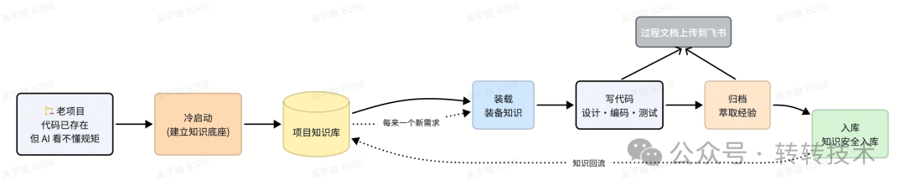

**关键点：知识库如何设计**

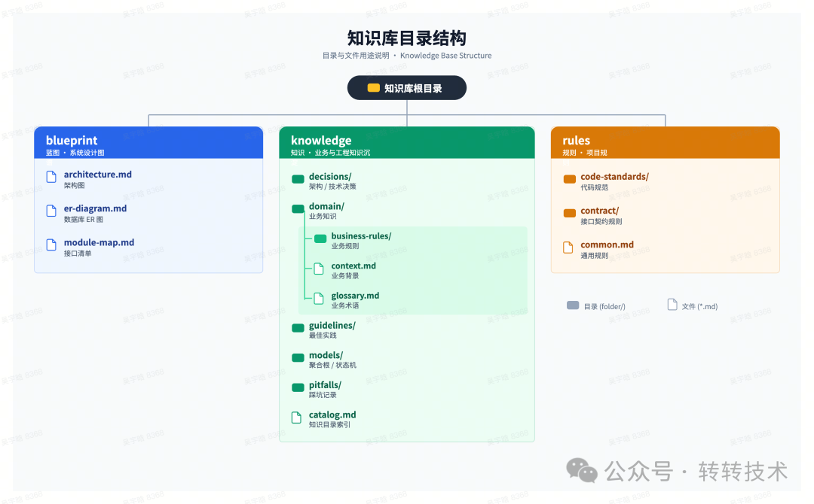

### 4.1 冷启动：给老项目「打一次地基」

在进行老项目考古的时候，一个难点是你需要让 AI 知道什么东西，AI 才能很好的理解这个项目，并在一定的规范的前提下，去进行需求的开发，这里面我们把 AI 想象成一个新人，当团队来新人之后，我们是怎么去培养新人的，让新人去理解整个项目。

#### 第一步 · 先带它了解项目全貌

1. 告诉新人整个转转的技术体系，项目的代码结构，各模块之间的依赖关系，项目中用了什么外部能力
2. 告诉新人项目对外提供了什么能力，这些能力在项目中是怎么分类的
3. 告诉新人数据库在哪里，都有什么表，表结构怎么样，表之间的关联关系

通过以上的三步，新人大体就能了解整个项目是如何运转的，以及接到需求之后，该如何下手，所以我们也将这些信息告诉 AI，就有了以下三张蓝图：

| 蓝图文件 | 记录什么 | 让 AI 能做什么 |
| --- | --- | --- |
| **① 架构总览** | 系统分层 + 全景图 + 下游依赖清单 | 接到需求就判断「改动会影响哪几层、会调到哪些下游服务」 |
| **② 接口清单**（含全量入口速查表 + 循环依赖检测） | 每个对外接口的落点、参数、归属模块 | 关键词一搜就命中「这个需求动哪些表、改哪个 Facade、会牵动谁」 |
| **③ 数据库 ER 图**（含真实索引明细） | 全表清单 + 字段 + 线上真实索引 | 写 SQL 知道走哪个索引、改字段前知道会影响哪些表 |

过程中需注意的点：

- **接口注释与实现脱节：**人改代码常不维护注释（比如：名叫「查询」的方法实际还改状态），照搬就会得到错误的接口说明。机制是让 AI **逐行比对实现与注释**，不一致就让人确认，**绝不轻信接口注释**。
- **索引必须拿真实 DB 结果：**线上索引几乎一定和代码里的不一致（手工加过、DBA 调过）——**强制阻塞，等人回贴真实的 SHOW INDEX**，不许从代码反推。
- **AI 会漏扫：**强制它自检——拿接口清单里的实体去和数据库实体**逐一比对**，降低漏扫的发生。

#### 第二步 · 把「隐性知识」问出来

认全项目后，AI 知道了「代码该怎么写」。但真到写需求时，还有大量**隐性知识**它不知道：历史上为什么这么设计、有哪些坑、哪些地方碰不得。这些代码里根本没有，新人也只能去问老员工——那怎么让 AI 也知道？我们的做法是「**人设计问题、AI 扫代码、人来解答**」：

- 先按当前业务的特点，**自己列出核心要关注的问题**（长事务、锁设计、Facade 设计理念、联表查询等），让 AI 去扫代码、由人给解答；
- 让 AI 扫描核心接口，我们设计好问题，由**人补充业务逻辑和隐藏的坑**——因为这些业务规则，AI 根本不可能从代码里推测出来。

最终我们把这个过程中我们的回答，全部沉淀到知识库，这样 AI 在下次进行需求开发的时候，就有知识可以参考：

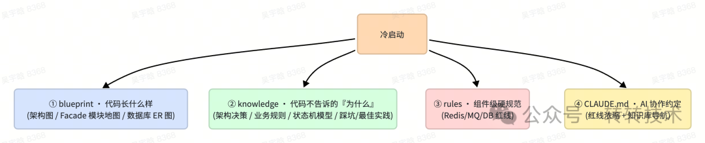

这一步同样有两个关键要点：

- **别直接问「有什么坑」：**而是通过 AI 扫出的规则 + 代码证据去**唤起老员工的记忆**——「原来这块当年踩过坑」，顺手就补出了代码里扫不到的隐性坑（线上事故、上下游兼容历史），比干问准得多。
- **核心接口不是扫得越全越好：**扫太多会让 AI 上下文爆炸。我们做两个取舍——近三个月没有流量调用的接口不扫；再根据上下文容量，判断到底扫多少个接口合适。

### 4.2 日常飞轮：每个需求都让知识库更聪明

老项目进行了一次性的知识沉淀，是给了 AI 在做需求过程中一个参考，但知识会升级会新增也会过期，如何在日常需求承接过程中，让知识库可以自进化。

从产品侧每来一个飞书格式的新需求，Agent 都会跑一遍 **装载 → 归档 → 入库**，外加一道贯穿其中的**淘汰**。我们先用一张表看清四个动作的边界：

| 动作 | 通俗定位 | 能不能改知识库 | 这一步的重点 |
| --- | --- | --- | --- |
| **装载** | 开工前一次装 + 开工中按阶段动态投喂 | ❌ 只读 | 用「三级漏斗 + 反向检索」精准取出该用的几条，全程留痕 |
| **归档** | 收工后理经验 | ❌ 只产建议 | 既登记「旧知识又被用了一次」，又萃取「本次新增的经验」 |
| **入库** | 把建议安全写回 | ✅ 唯一可改 | 并发检测 + 自动恢复；升级成熟度、淘汰过时知识 |
| **淘汰** | 让错的旧知识退场 | 定期触发 | 每三个月清理一次，把零引用的知识移出活跃库 |

#### ① 装载——知识的「抽取」与「使用」

装载要回答两个问题：一个项目沉淀了几百条知识，**该抽哪几条喂给 AI**？喂进去之后，**怎么保证 AI 真的用了、用对了**？

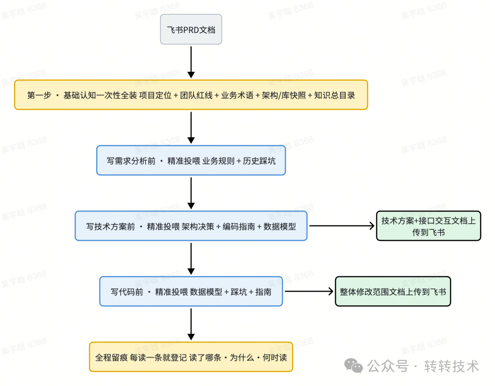

**先说「抽取」。**知识装载分两种节奏——基础认知一次性全装，专业知识按阶段精准投喂：

| 装载节奏 | 装什么 | 为什么这样做 |
| --- | --- | --- |
| **基础认知**（一次性全装） | 项目定位 + 团队红线 + 业务术语 + 架构/数据库快照 + 知识总目录 | 无论做什么需求都得懂的「常识」，开工时一次读完 |
| **专业知识 · 写需求分析前** | 业务规则 + 历史踩坑速查表 | 最怕漏掉业务规矩、最该参考前人的坑 |
| **专业知识 · 写技术方案前** | 架构决策 + 编码指南 + 数据模型速查表 | 必须对齐已有架构选型 |
| **专业知识 · 写代码前** | 数据模型 + 踩坑 + 指南速查表 | 聚焦表结构、避坑、代码规范 |

成百上千条知识不可能全塞给 AI（会超出上下文上限），所以靠一套**「三级知识漏斗」**层层收敛——用一页目录 + 几行卡片，就锁定真正该读的三五条：

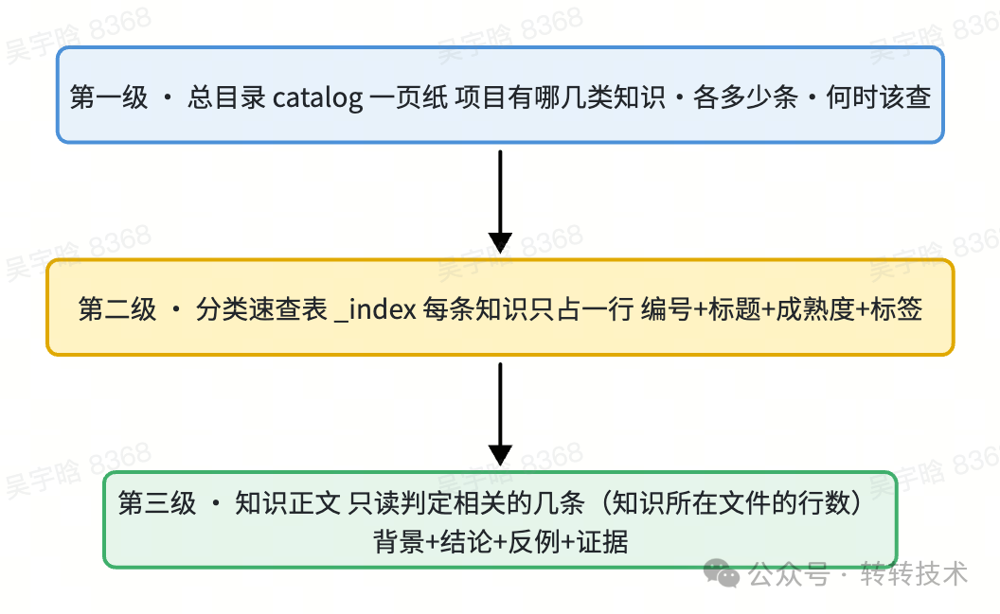

而到底抽哪几条，**不是预设的，是被对话驱动的**。用户每回答一个关键问题，Agent 就自动跑一遍「反向检索」四步闭环：

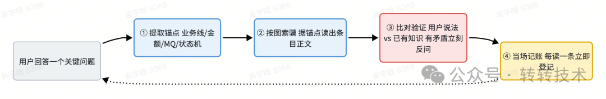

背后是一张「锚点 → 取知识」的映射，让自然语言里的线索精准命中知识：

| 用户在对话里提到 | AI 自动触发读取 |
| --- | --- |
| 涉及某条业务线 | 业务线隔离规范 / 术语表对应段落 |
| 金额相关字段 | 金额处理规范（如必须用 BigDecimal） |
| 用到消息队列 / RPC | 对应的集成架构决策（ADR） |
| 改了表结构 / 增减接口 | 数据库 ER 图、模块地图，核对影响面 |
| 提到某个历史遗留逻辑 | 当年那条决策记录 + 相关踩坑 |

**再说「使用」。**抽出来还不够，得保证它真被用上——这里有两道硬约束：

- **高风险强制必读：**一旦用户的回答改变了**影响范围**、改变了**数据流向**、或触碰了**红线**（业务线隔离 / 金额 / 状态机），AI 不读对应知识就不许往下走；若项目里压根没有这条知识，它会反过来提醒「这里以后要补一条」。
- **全程留痕账本：**每读一条都登记「读了哪条 / 为什么读 / 谁触发 / 哪个环节」。这本账有两个硬价值——它是**当下的质量闸门**（账本为空 = AI 没参考任何经验，直接拦下），又是**下一步升级知识的唯一证据**。

中间过程产物，如设计方案文档、与前端（APP 端、h5）的交互文档、修改范围文档等会同步上传到飞书，沉淀成一份结构化的在线文档——人不必额外整理。

#### ② 归档——历史知识的「复用登记」与新增知识的「萃取」

一个需求做完，**归档要同时处理两类知识**：这次**复用过的历史知识**，和这次**新产生的经验**。它们走两条完全不同的路径，但都只产「建议」、绝不直接碰正式库。

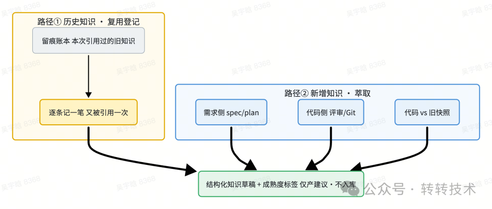

**第一条路径 · 历史知识的「复用登记」。**本次需求在「装载」阶段引用过哪些已有知识，会从那本**留痕账本**里被逐条提取出来。它们**不新建条目**，而是给对应的旧知识各记一笔「又被引用了一次」。这一步回答的是——「哪些旧经验，这次又被验证了一遍」。它正是后面成熟度升级的**唯一证据来源**：一条知识被多少个不同需求真实用过，全靠这里一笔笔攒出来。

**第二条路径 · 新增知识的「萃取」。**本次需求新产生的经验，由多个 AI 分身**并行**从需求侧和代码侧开采：

| 来源 | 从这里萃取 | 得到什么知识 |
| --- | --- | --- |
| **需求侧** | 设计方案 spec、技术方案 plan | 业务规则、架构决策 |
| **代码侧** | 代码评审记录、Git 提交历史 | 踩坑、编码约定、数据模型 |
| **代码侧 · 对比** | 实际代码 vs 旧快照 | 架构图 / 模块地图 / ER 图的「蓝图变更」 |

两条路径汇到一起，产出一份**结构化知识草稿**（决策 / 规则 / 踩坑 / 指南 / 模型 + 蓝图变更），每条新知识都带一个**成熟度**标签。而升级靠的不是「我觉得有用」，是第一条路径攒下的**真实引用次数**：

| 成熟度 | 含义 | 升级门槛（量化） |
| --- | --- | --- |
| **draft（初稿）** | 第一次沉淀，还没被验证 | — |
| **verified（已验证）** | 在多个需求里被反复用到 | 被 ≥3 个不同需求真实引用 |
| **proven（已夯实）** | 足够可靠，可对外输出 | 被 ≥5 个不同需求真实引用 |

归档**故意只产「建议」、不直接入库**，原因有三：① **安全**——萃取可能出错，先让人审；② **可反悔**——建议是结构化文件，可改可重跑，正式库始终干净；③ **冲突要人拍板**——当新代码证明旧决策错了，必须人在环。最终产出两份**知识合并建议**（业务知识 + 蓝图）。

#### ③ 入库——知识的「更新」与「升级」

到这里，才真正动手改写「项目知识库」。**整个体系里，只有「入库」这一道门能写正式库**——为什么单拎出来？因为「写入正式库」是高风险操作：多人协作时，可能你在整理的同时，同事已往同一份文件写了别的内容。

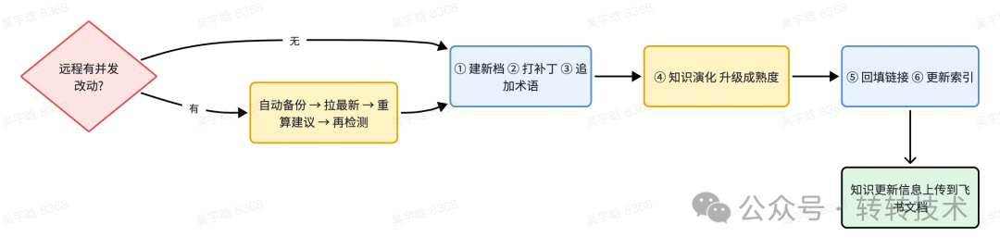

> **入库前的安全闸门：**先检查远程是否有人并发改了同一份知识（同分支被同事推过？目标分支有别的需求刚归档？）。一旦发现重合，AI 会**自动备份 → 拉取最新 → 基于最新状态重算建议 → 再检测一次**，才敢落盘——彻底杜绝「一保存把同事的改动覆盖掉」。

**更新按固定六步执行**（先建档、再更新、最后维护索引，因为索引依赖前面的内容先就位）：

| 步骤 | 做什么 |
| --- | --- |
| ① 建新知识档案 | 全新知识正式建档 |
| ② 给旧知识打补丁 | 已有条目增量增强 |
| ③ 追加术语 / 背景 | 补全业务认知层 |
| **④ 知识演化（升级关键）** | **把归档登记的「又被引用一次」落账 + 据此自动升级成熟度** |
| ⑤ 回填交叉链接 | 知识之间建立关联 |
| ⑥ 更新导航速查表 + 总目录 | 刷新分类索引 / 总目录 |

**「升级」就发生在第四步。**它把「归档」阶段第一条路径登记的引用记录正式落账，并据此把成熟度进行升级：**draft → verified → proven**。这正是前面那本「留痕账本」的价值兑现处——账本里「真被用过」的记录，是唯一被认可的升级证据，整个飞轮就此闭合。每一步都记进**入库台账**，带来两个核心价值：**可续跑**（中途失败修复后重跑，自动跳过已成功的）和**可追溯**（随时能回答「这条知识是哪次需求、哪次入库建立的」）。

和装载阶段一致，知识的更新和升级信息同步上传一份到飞书文档。

#### ④ 淘汰——让错的、过时的旧知识「退场」

一个只增不减的知识库，迟早会变臃肿——三个月前的最佳实践可能已经过时，当年沉淀的某些知识可能再没人用过。**知识不仅要能进，还要能退。**

**每三个月定期清理一次，把这段时间里一次都没被用到的知识清出去。**

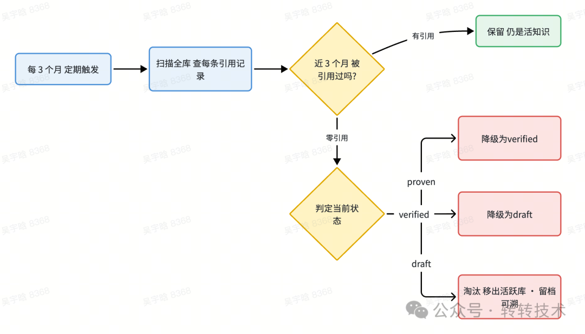

判断依据，正是前面那本**留痕账本**——每条知识被哪些需求引用过，都有记录。定期清理时扫一遍全库：**一条知识若连续三个月零引用，就说明它要么过时、要么本就没价值，移出活跃知识库**（淘汰记录留档可溯，不是物理抹掉）。这样库里留下的，永远是真正在被用的「活知识」。

一句话：**新知识靠「被用过 N 次」升级，旧知识靠「长期没人用」退场。**有进有出，知识库才不会越来越臃肿。

> 于是闭环成立了：**需求做得越多 → 知识库积累的经验越多、越成熟、越干净 → AI 设计方案越快、越少踩坑、越符合团队规矩。**这正是那句「用得越多，效果越好；效果越好，用得越多」的复利效应。

---

## 五、其实，从头到尾都是同一个故事

把两条线并排放在一起，你会看到它们高度同构：

| | 产品线 | 技术线 |
| --- | --- | --- |
| **谁在驱动** | AI Agent 全程操作 | AI Agent 全程操作 |
| **砍掉什么** | 人工撰写 + 跨角色对齐 | 重复考古 + 反复踩同一个坑 |
| **经验装在哪** | 会议纪要标准 + PRD 错题本 | 项目知识库 |
| **怎么沉淀** | 纠错自动进规则门禁 | 经验按引用次数升级、按零引用淘汰 |
| **共同内核** | **AI 驱动、人决策、经验自进化** |

两条线，同一个内核。所以我们想说的从来不是「AI 替代人」，而是——**AI 接管重复劳动，人去做需要判断力的决策；团队的经验第一次从「个人的脑子」搬进「系统的记忆」，并且会持续自我进化。**

---

## 六、回到开头那个会员改版

文章开头那个做了 3 个月的会员改版，如果放到今天的工作流里会是什么样？

运营几场需求沟通会即出结构化纪要，产品 AI 分步生成 PRD、直出 UI，技术带着知识库快速落地——**不再是 3 个月，而是 3 周。**

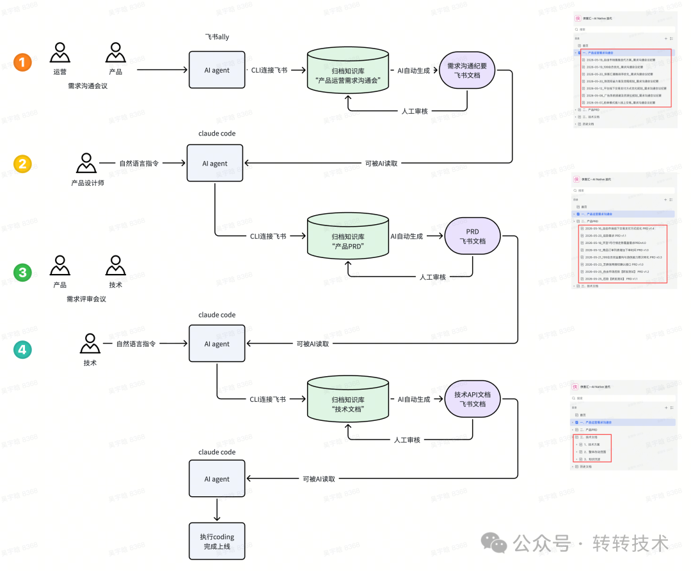

开篇那张对比表里的每一个数字，背后都是前面五节讲的这套机制在支撑：6 个角色收敛成 3 个、纯人工撰写变成 AI 出初稿、跨角色衰减变成两端直连、3 个月减少到 3 周、整体效率目标提升 50%。

而比数字更重要的，是这条端到端 AI 工作流本身是**「可自进化」**的——每跑完一个需求，它就把新经验沉淀进组织记忆，下一次就更快、更少踩坑。所以这次提速不是终点，而是起点：效率提升不再是一次性的，而是**可累积、可复利**的——需求做得越多，工作流越聪明，下一个需求就越快。**这，才是我们想打造一条「可自进化」工作流的真正意义，也是「既快、又会越来越快」的来处。**

---

## 七、写在最后

想在自己的团队跑通这件事，我们沉淀出三条经验：

1. **立「事实来源」**让 AI 不臆造（产品靠会议纪要、技术靠真实代码）
2. **设「质量闸门」**让 AI 不敷衍（PRD 检查清单、知识库只读隔离）
3. **建「沉淀飞轮」**让经验自己生长、也自己除旧

技术会迭代，模型会更新，但**沉淀下来的领域知识，是更长久的竞争力**。当所有工作流都由 AI Agent 驱动起来之后，团队真正拥有的，是一份持续在线、不随人员流动而流失、且每天都比昨天更懂业务的「组织记忆」。

从「一个需求迭代 3 个月」到「会自进化的组织」，我们要打造的从来不是一个工具，而是一条**可自进化的端到端 AI 工作流**——它由 AI Agent 全程驱动，把经验沉淀成组织记忆，并且每跑一个需求就更懂业务一分。这条路我们会持续走下去，如果你也着迷于「如何打造可自进化的 AI 工作流」这件事，欢迎与我们深入交流。

> **关于作者**
>
> 杨乐，侠客汇业务线技术负责人。主导侠客汇技术架构建设与技术先进性演进，负责 AI-Native 研发工作流在业务线的落地。
>
> 金丽华，采货侠产品负责人。主导采货侠 App、侠客汇 App 的产品架构建设。负责 AI-Native 产品设计工作流体系的搭建和落地。
