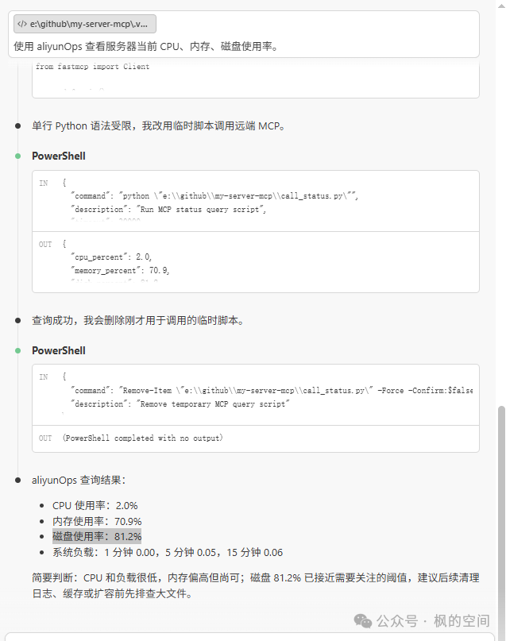
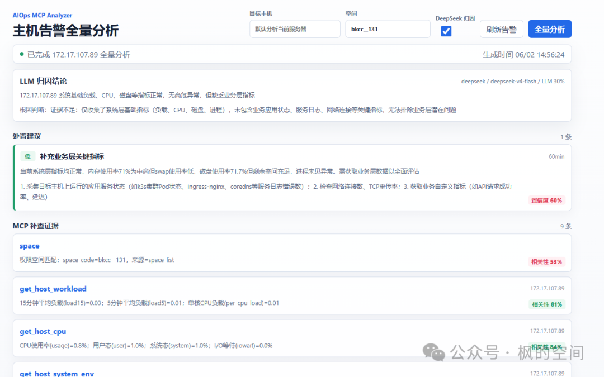

# 用 Python + MCP 搭一个 AIOps 运维助手：从 Linux 巡检到 AI 归因

通过这篇文章，您可以了解到：

> 1. 如何在 Linux 服务器上准备 Python 和 MCP 运行环境
> 2. 如何用 FastMCP 写一个最小可用的运维 MCP 服务
> 3. 如何在 VS Code 中通过 SSE 接入自己的 MCP 服务
> 4. `my-server-mcp` 项目的核心结构和使用方法
> 5. 如何把服务器指标采集、相关性、置信度、规则分析和 DeepSeek 归因串起来
> 6. 运维类 MCP 项目需要注意哪些安全边界

项目地址：https://github.com/zentrix566/my-server-mcp

# 先从最小 MCP 服务开始

首先在服务器上运行 MCP 服务端，需要 Python 环境。我之前安装过 Python，但是不确定具体版本，可以通过以下命令找出：

```
[root@my-mcp]# ls -l /usr/local/bin/python3*
-rwxr-xr-x 1 root root 22685152 May 21 11:14 /usr/local/bin/python3.10
-rwxr-xr-x 1 root root     3090 May 21 11:15 /usr/local/bin/python3.10-config
```

截至 2026 年 6 月 2 日，Python 官网下载页已经到 3.14.5，不过这次只是先跑一个 MCP 运维 demo，服务器上已有的 Python 3.10 已经够用，所以这里继续使用 Python 3.10。完整项目里如果按 README 部署，建议优先使用 Python 3.11+。

创建并激活虚拟环境：

```
python3.10 -m venv mcp-env  # 创建虚拟环境，-m 后的 venv 是固定的，mcp-env 是虚拟环境目录，可以自己定义
source mcp-env/bin/activate # 激活虚拟环境
(mcp-env) [root@my-mcp]  # 前面带上目录名称表示虚拟环境已经被激活了
deactivate  # 退出虚拟环境
```

安装虚拟环境的意义就是有一个完全干净的环境，可以自定义依赖包的版本，避免不同项目相同软件包版本号冲突。

安装 MCP 依赖：

```
pip install fastmcp psutil
```

创建 ops\_mcp.py：

```
from fastmcp import FastMCP
import psutil
import subprocess

mcp = FastMCP("aliyun-ops")

@mcp.tool()
def get_system_status():
    """获取服务器 CPU、内存、磁盘和负载信息"""
    return {
        "cpu_percent": psutil.cpu_percent(interval=1),
        "memory_percent": psutil.virtual_memory().percent,
        "disk_percent": psutil.disk_usage("/").percent,
        "loadavg": psutil.getloadavg()
    }

@mcp.tool()
def check_service_status(service_name: str):
    """查看 systemd 服务状态，例如 nginx、docker、mysql"""
    result = subprocess.run(
        ["systemctl", "is-active", service_name],
        capture_output=True,
        text=True,
        timeout=5
    )
    return {
        "service": service_name,
        "status": result.stdout.strip(),
        "error": result.stderr.strip()
    }

@mcp.tool()
def tail_log(file_path: str, lines: int = 50):
    """查看指定日志文件最后若干行"""
    if not file_path.startswith("/var/log/"):
        return {"error": "只允许查看 /var/log/ 下的日志文件"}

    result = subprocess.run(
        ["tail", "-n", str(lines), file_path],
        capture_output=True,
        text=True,
        timeout=5
    )
    return {
        "file": file_path,
        "content": result.stdout,
        "error": result.stderr
    }

if __name__ == "__main__":
    mcp.run(transport="sse", host="0.0.0.0", port=8000)
```

在服务器上运行脚本后，就可以在 VS Code 中调用这个 MCP 服务端。先创建 `.vscode` 目录，再在目录下创建 `mcp.json` 文件，内容是：

```
{
  "servers": {
    "aliyunOps": {
      "type": "sse",
      "url": "http://服务器IP:8000/sse"
    }
  }
}
```

使用方法，在 VS Code Agent 中可以问：使用 aliyunOps 查看服务器当前 CPU、内存、磁盘使用率。



在项目中提供了一个更完整的 aliyun\_ops\_mcp.py 脚本，使用方法是把整个项目上传到 Linux 服务器上，然后分别启动 API 服务和 MCP 服务。

这次项目和前面那个 `ops_mcp.py` 的区别是，前面只是一个最小可用 demo，只能看 CPU、内存、磁盘、服务状态和日志。这个项目则更接近一个轻量级 AIOps 工具，它不只是“查一下指标”，而是把指标采集、规则判断、LLM 归因和 Web 页面展示串到了一起。

整体流程大概是这样：


# 完整项目结构

项目目录大概如下：

```
my-server-mcp/
├── aliyun_ops_mcp.py      # FastMCP SSE 服务入口，暴露 MCP 工具
├── llm_analyzer.py        # DeepSeek 归因分析模块
├── ops_core.py            # 指标采集、规则分析、完整分析核心逻辑
├── ops_mcp.py             # MCP 兼容入口
├── server.py              # FastAPI 后端，提供 API 和静态页面
├── requirements.txt       # Python 依赖
├── start_api.sh           # Linux/macOS API 启动脚本
├── start_mcp.sh           # Linux/macOS MCP 启动脚本
├── .env.example           # DeepSeek 环境变量示例
└── web/
    ├── index.html
    ├── styles.css
    └── app.js
```

这里面最核心的是三个文件：

| 文件 | 作用 |
| --- | --- |
| `ops_core.py` | 真正采集服务器指标，并根据规则生成处置建议 |
| `aliyun_ops_mcp.py` | 把 `ops_core.py` 里的能力包装成 MCP 工具 |
| `server.py` | 提供 Web/API 页面，方便不用 MCP 客户端时也能直接调用 |

也就是说，MCP 只是入口之一。即使不用 VS Code Agent，也可以通过 Web 页面或者 HTTP API 调用这套分析能力。

# 安装完整项目依赖

先把项目上传到服务器，比如放到：

```
/opt/aiops-mcp-analyzer
```

进入目录后创建虚拟环境：

```
cd /opt/aiops-mcp-analyzer

python3.11 -m venv venv
source venv/bin/activate

pip install --upgrade pip
pip install -r requirements.txt
```

`requirements.txt` 里主要包含这些依赖：

```
fastapi
uvicorn
fastmcp
psutil
python-dotenv
httpx
```

其中 `fastmcp` 负责 MCP 服务，`psutil` 负责采集服务器指标，`fastapi` 和 `uvicorn` 负责 Web/API 服务，`httpx` 用来请求 DeepSeek。

# 配置 DeepSeek

如果只想使用规则分析，可以先不配置 DeepSeek。
如果想让大模型根据 MCP 采集到的证据再做一次归因，就需要配置 `.env`。

复制模板：

```
cp .env.example .env
vim .env
```

内容类似：

```
DEEPSEEK_API_KEY=你的DeepSeekAPIKey
DEEPSEEK_BASE_URL=https://api.deepseek.com
DEEPSEEK_MODEL=deepseek-v4-flash
```

这里注意两点：

1. `.env` 不要提交到仓库；
2. 修改 `.env` 后需要重启 API 服务。

这也是我现在写这类项目时比较倾向的做法：密钥放在后端环境变量里，不再像之前 demo 那样把 key 注入到前端页面。前端页面里的内容用户可以直接看到，放 key 一定不安全。

# 启动 MCP 服务

MCP 服务使用 `aliyun_ops_mcp.py` 启动：

```
cd /opt/aiops-mcp-analyzer
source venv/bin/activate
python aliyun_ops_mcp.py
```

也可以直接用脚本：

```
./start_mcp.sh
```

默认监听地址是：

```
http://0.0.0.0:8000/sse
```

然后在 VS Code 的 `.vscode/mcp.json` 里配置：

```
{
  "servers": {
    "aliyunOps": {
      "type": "sse",
      "url": "http://服务器IP:8000/sse"
    }
  }
}
```

配置完成后，在 VS Code 命令面板里执行：

```
MCP: List Servers
```

选择 `aliyunOps`，然后启动或者重启服务。

在 Agent 里可以这样问：

```
使用 aliyunOps 分析当前服务器状态，给出 CPU、内存、磁盘、进程和日志方面的处置建议。
```

也可以更明确一点：

```
调用 aliyunOps 的 analyze_host 工具，target 留空，space_code 使用 bkcc__131，use_llm=false。
```

如果已经配置了 DeepSeek，也可以启用 LLM 归因：

```
调用 aliyunOps 的 analyze_host 工具，use_llm=true，分析当前服务器是否存在高危异常，并说明证据来源。
```

# MCP 暴露了哪些工具

完整项目里暴露的 MCP 工具比前面的 demo 多一些，主要有这些：

| 工具名 | 作用 |
| --- | --- |
| `space` | 查询当前空间/权限上下文 |
| `get_host_workload` | 查询 load1、load5、load15 和单核负载 |
| `get_host_cpu` | 查询 CPU 使用率、user、system、iowait、idle |
| `get_host_system_env` | 查询运行进程、I/O 等待进程、内存和 swap |
| `get_host_disk` | 查询磁盘挂载点容量和使用率 |
| `get_host_inode` | 查询 inode 使用情况 |
| `get_disk_io` | 查询磁盘 I/O 累计读写计数器 |
| `get_top_processes` | 查询 CPU/内存占用最高的进程 |
| `find_large_log_files` | 查询 `/var/log` 下最大的日志文件 |
| `analyze_host` | 执行一次完整补查并生成处置建议 |

这里最有价值的是 `analyze_host`。
因为单独查 CPU、磁盘、进程，其实还是“点状信息”。`analyze_host` 会把这些工具串起来，先形成一组证据，再通过规则分析给出动作建议。

例如 `ops_core.py` 里会采集这些证据：

```
def collect_evidence(target: str, space_code: str, source: str):
    return [
        get_space(space_code=space_code, source=source),
        get_host_workload(target),
        get_host_cpu(target),
        get_host_system_env(target),
        get_host_disk(target),
        get_host_inode(target),
        get_disk_io(target),
        get_top_processes(target, limit=8),
        find_large_log_files(target, limit=8),
    ]
```

然后再根据证据做判断。比如磁盘超过 90%，就生成“立即清理磁盘空间”的建议；iowait 偏高，就提示补充磁盘 I/O 监控；负载高但是 CPU 不高，就提示可能要区分 I/O 等待、锁等待或者进程堆积。

这一步就比“AI 帮我看看服务器怎么样”更可靠一些。因为它不是让 AI 直接猜，而是先把证据采出来，再让规则和模型基于证据工作。

# 启动 Web/API 服务

除了 MCP 服务，项目还提供了一个 Web 页面。启动方式是：

```
cd /opt/aiops-mcp-analyzer
source venv/bin/activate
python -m uvicorn server:app --host 0.0.0.0 --port 8080
```

或者：

```
./start_api.sh
```

浏览器访问：

```
http://服务器IP:8080
```

显示内容：



页面里可以输入目标主机、空间编码，并选择是否启用 DeepSeek 归因。点击“全量分析”后，会展示三部分内容：

1. 处置建议；
2. LLM 归因结论；
3. MCP 补查证据。

这个页面的意义是：即使当前 AI 客户端没有接 MCP，也可以先通过普通 Web 页面把这套工具跑起来。
对于排查来说，先有一个可视化入口会更直观，也方便演示。

API 也可以直接调用：

```
curl -X POST http://127.0.0.1:8080/api/analyze/full \
  -H "Content-Type: application/json" \
  -d '{"target":"172.17.107.89","space_code":"bkcc__131","source":"space_list"}'
```

启用 DeepSeek：

```
curl -X POST http://127.0.0.1:8080/api/analyze/full \
  -H "Content-Type: application/json" \
  -d '{"target":"172.17.107.89","space_code":"bkcc__131","source":"space_list","use_llm":true}'
```

返回结构大概是这样：

```
{
  "target": "172.17.107.89",
  "generated_at": 1780361911,
  "actions": [],
  "rule_actions": [],
  "llm": {
    "enabled": true,
    "success": true,
    "provider": "deepseek",
    "model": "deepseek-v4-flash",
    "summary": "",
    "root_cause": "",
    "confidence": 0.95
  },
  "confidence": {
    "score": 86.4,
    "label": "high",
    "source": "llm+evidence"
  },
  "evidence": [
    {
      "tool": "get_host_cpu",
      "success": true,
      "relevance": {
        "score": 82.5,
        "label": "high"
      }
    }
  ]
}
```

其中 `actions` 是最终展示给用户的处置建议，`rule_actions` 是规则分析结果，`evidence` 是 MCP 补查证据，`confidence` 是整次分析的置信度。
如果 LLM 调用失败，项目会自动回退到规则分析，这样至少不会因为模型接口异常导致整个分析不可用。

# 相关性和置信度是什么

后面我又给项目加了两个字段：相关性和置信度。

这两个词看起来有点像，其实表达的是两件事。

**相关性**是针对单条证据说的。
比如 MCP 调用了 `get_host_cpu`、`get_host_disk`、`get_top_processes` 这些工具，每个工具都会返回一条 evidence。相关性就是回答一个问题：这条 evidence 对本次告警分析有多重要？

举个例子，如果现在问题是磁盘空间接近 90%，那 `get_host_disk` 的相关性就应该很高。
如果只是查了一下空间编码 `space`，它有用，但更多是上下文信息，相关性就不应该比 CPU、磁盘、负载这类核心指标更高。

**置信度**是针对整次分析结果说的。
它回答的是另一个问题：这次分析结果整体有多可信？

比如关键 MCP 工具都调用成功了，CPU、负载、磁盘、进程这些证据也比较完整，规则命中明确，DeepSeek 也基于证据给出了比较一致的归因，那么整次分析的置信度就可以高一些。
反过来，如果很多工具调用失败，或者只有零散证据，那即使 AI 给了一个看起来很完整的结论，置信度也不应该太高。

我理解相关性和置信度的关系大概是这样：

```
相关性：单条证据和当前问题有多相关
置信度：整次分析结论有多可信
```

所以在页面上，项目会把相关性放在 MCP 补查证据卡片上，把置信度放在处置建议卡片上。

# 相关性是怎么算的

项目里每条 MCP 补查证据都会增加一个 `relevance` 字段：

```
{
  "relevance": {
    "score": 82.5,
    "label": "high"
  }
}
```

`score` 是 0 到 100 的百分制分数，`label` 按分数分成三档：

```
high:   score >= 80
medium: score >= 60 且 < 80
low:    score < 60
```

它的核心公式是：

```
相关性 = 工具基础权重 * 0.62 + 指标信号强度 * 100 * 0.38 + 场景加权
```

这里可以拆成三部分看。

第一部分是工具基础权重。
不同 MCP 工具在运维分析里的天然重要性不一样，所以先给每个工具一个基础分：

| 工具 | 基础权重 |
| --- | --- |
| `get_host_cpu` | 95 |
| `get_host_system_env` | 95 |
| `get_host_workload` | 92 |
| `get_host_disk` | 92 |
| `get_disk_io` | 82 |
| `get_top_processes` | 82 |
| `get_host_inode` | 78 |
| `find_large_log_files` | 68 |
| `space` | 55 |

这里可以看到，CPU、系统环境、负载、磁盘的权重最高，因为它们是判断服务器异常最常用的证据。
`space` 权重最低，不是因为它没用，而是因为它更像权限和上下文信息，本身不直接代表服务器是否异常。

第二部分是指标信号强度。
同一个工具，在不同数据下相关性也不一样。

比如 `get_host_cpu`：

- CPU 使用率超过 80%，或者 iowait 超过 10%，信号强度就是 1.0；
- CPU 使用率超过 60%，或者 iowait 超过 3%，信号强度是 0.82；
- 如果指标比较平稳，信号强度是 0.65。

`get_host_disk` 也是类似：

- 磁盘使用率超过 90%，信号强度是 1.0；
- 超过 80%，信号强度是 0.88；
- 超过 70%，信号强度是 0.74；
- 否则是 0.62。

也就是说，工具基础权重表示“这个工具本来重不重要”，指标信号强度表示“这次采到的数据有没有异常信号”。

第三部分是场景加权。
如果规则分析已经命中了 critical，并且当前工具属于负载、CPU、系统环境、磁盘这类核心工具，就额外加 8 分。
如果命中了 warning，并且工具属于负载、CPU、磁盘，就额外加 5 分。

这样做的原因是：当系统已经判断出高危或中等风险时，核心指标证据应该更突出，方便人快速看出哪些证据最关键。

还有一个限制：如果工具调用失败，相关性最高只能到 45%。
这个很重要，因为失败的工具调用不能被当成强证据。它最多说明“这里缺证据”，而不能说明“这里一定有问题”。

# 置信度是怎么算的

完整分析结果里会增加一个顶层 `confidence` 字段：

```
{
  "confidence": {
    "score": 86.4,
    "label": "high",
    "source": "llm+evidence",
    "components": {
      "evidence_coverage": 100.0,
      "avg_relevance": 74.2,
      "rule_confidence": 72.0,
      "llm_confidence": 95.0
    }
  }
}
```

这里的 `score` 也是 0 到 100，`label` 仍然分成 high、medium、low 三档。

置信度主要由几部分组成：

| 组成 | 含义 |
| --- | --- |
| `evidence_coverage` | 关键 MCP 工具成功数量 / 关键 MCP 工具总数 |
| `avg_relevance` | 所有 evidence 的相关性平均值 |
| `rule_confidence` | 规则分析自身的可信程度 |
| `llm_confidence` | DeepSeek 返回 JSON 里的置信度 |

如果 DeepSeek LLM 归因成功，最终置信度计算公式是：

```
最终置信度 = LLM 置信度 * 0.50 + 证据覆盖率 * 0.30 + 平均相关性 * 0.20
```

如果 DeepSeek 调用失败，回退到规则分析，公式就变成：

```
最终置信度 = 规则置信度 * 0.45 + 证据覆盖率 * 0.35 + 平均相关性 * 0.20
```

规则置信度的取值也比较直接：

```
critical: 86%
warning:  78%
normal:   72%
```

这里的设计思路是：
如果 LLM 成功，就让 LLM 置信度占更高权重，但仍然保留证据覆盖率和平均相关性的约束。
如果 LLM 失败，就不要让整次分析失效，而是用规则置信度、证据覆盖率和平均相关性继续给出一个保守的可信度。

这也符合前面说的思路：AI 可以参与判断，但不能脱离证据。
置信度不是让 AI 自己拍脑袋说“我很确定”，而是把 LLM 判断、MCP 证据完整性、证据相关性一起算进去。

# 为什么要同时保留规则分析和 LLM 归因

我觉得这里是运维场景里很关键的一点。
AI 可以辅助归因，但不能把所有判断都丢给 AI。

比如磁盘使用率超过 90%，这个不需要大模型发挥，规则就能判断。
iowait 超过 10%，也可以先用规则标成高风险。
负载高但 CPU 不高，可能是 I/O 等待、锁等待、进程堆积，这类判断也可以先由规则给出方向。

LLM 更适合做的是：

- 把多条证据串起来；
- 用更自然的语言解释原因；
- 给出下一步补查建议；
- 在证据不足时明确说证据不足；
- 把处理动作整理成更适合人看的文字。

所以这个项目里的流程是：

```
先用 MCP 采集证据
再用规则给出基础判断
最后可选地让 DeepSeek 做归因总结
```

这比直接让大模型自由发挥要稳一些。
尤其是在运维场景里，最怕的不是 AI 不会说，而是它说得很像真的，但证据链对不上。

# systemd 托管

如果只是测试，命令行启动就可以。
如果准备长期放在服务器上，建议用 systemd 托管。

API 服务：

```
[Unit]
Description=AIOps Analyzer API
After=network.target

[Service]
WorkingDirectory=/opt/aiops-mcp-analyzer
ExecStart=/opt/aiops-mcp-analyzer/venv/bin/python -m uvicorn server:app --host 0.0.0.0 --port 8080
Restart=always
RestartSec=3

[Install]
WantedBy=multi-user.target
```

MCP 服务：

```
[Unit]
Description=AIOps MCP SSE Server
After=network.target

[Service]
WorkingDirectory=/opt/aiops-mcp-analyzer
ExecStart=/opt/aiops-mcp-analyzer/venv/bin/python aliyun_ops_mcp.py
Restart=always
RestartSec=3

[Install]
WantedBy=multi-user.target
```

启用服务：

```
sudo systemctl daemon-reload
sudo systemctl enable --now aiops-api aiops-mcp
```

查看状态：

```
sudo systemctl status aiops-api
sudo systemctl status aiops-mcp
```

重启：

```
sudo systemctl restart aiops-api
sudo systemctl restart aiops-mcp
```

# 安全注意事项

这个项目是运维诊断工具，会读取服务器状态，所以端口开放要谨慎。

我的建议是：

1. `8080` Web/API 端口按需开放，最好放在内网；
2. `8000` MCP SSE 端口不要直接暴露到公网；
3. `.env`、API Key、Token 不要提交到仓库；
4. 生产环境建议在 Nginx 前面加鉴权；
5. 如果要公网访问，至少限制来源 IP。

另外，像 `tail_log` 这种读取日志的能力，一定要限制路径。前面最小 demo 里我只允许读取 `/var/log/` 下的日志，就是为了避免 Agent 被提示词诱导后读取不该读取的文件。

MCP 让 AI 有了“手”，但手能伸到哪里，必须提前限制好。

# 这次实践的理解

这次从最小 `ops_mcp.py` 到完整 `my-server-mcp` 项目，我对 MCP 的理解更清楚了一点。

最小 demo 的意义是证明：

```
AI 可以通过 MCP 调用服务器工具
```

完整项目的意义是进一步证明：

```
AI 不只是调用一个工具，还可以参与一条完整的运维诊断链路
```

在这个链路里，MCP 负责把服务器真实状态暴露出来，规则负责做稳定判断，LLM 负责归因总结和语言组织，Web/API 负责让能力可以被普通页面和脚本复用。

这也比较符合我现在对 AIOps 的理解：
不要一上来就追求“AI 自动修复一切”，那样风险太大。更现实的第一步是让 AI 帮我们完成巡检、补查、证据整理和处置建议生成。

如果后续要继续扩展，这个项目还可以接：

- SSH 远程采集；
- Prometheus 指标；
- 云监控 API；
- 告警平台；
- 工单系统；
- 日志检索系统；
- 自动生成巡检日报。

这样 MCP 就不只是一个演示工具，而是可以慢慢变成一套“AI 运维助手”的入口。

# 小结

本文先从一个最简单的 MCP 脚本开始，用 `fastmcp` 和 `psutil` 实现了服务器 CPU、内存、磁盘、服务状态和日志查询。
然后在 VS Code 中通过 `.vscode/mcp.json` 接入这个 SSE 服务，让 Agent 可以直接调用服务器上的运维工具。

在此基础上，完整项目 `my-server-mcp` 又进一步加入了：

- 多项主机指标采集；
- MCP 工具化封装；
- MCP 证据相关性计算；
- 完整分析置信度计算；
- 规则分析；
- DeepSeek LLM 归因；
- Web 页面展示；
- HTTP API 调用；
- systemd 部署方式。

整体看下来，MCP 最有价值的地方不是“让 AI 回答更多问题”，而是让 AI 能够在授权范围内调用真实工具、读取真实数据、整理真实证据。
对于运维来说，这个方向很值得继续做下去，因为很多日常排查本质上就是：收集证据、判断风险、给出处置建议。MCP 正好可以把这几步和 AI 串起来。
