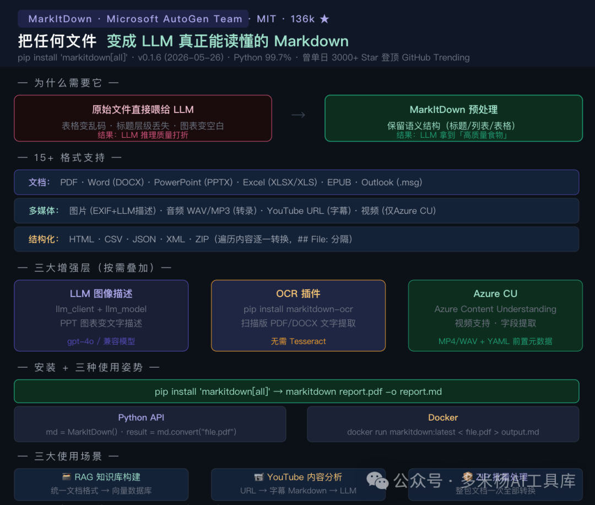

# 136k Star！微软开源了一个「AI 喂食工具」——PDF、Word、PPT、Excel、视频、音频一行命令全变 Markdown，LLM 真正读懂你的文档

## 🔥 从一个让 AI 吃坏肚子的问题说起

你有一份 50 页的 PDF 报告，想让 Claude 帮你分析。

你可以把 PDF 直接丢给它——但效果通常不理想：表格变成乱码，多级标题丢了层级，图表变成空白，脚注混进了正文。

或者你可以用 PyPDF2 提取文本——但你得到的是原始字符串，所有的标题、列表、表格结构全没了，就是一大段堆在一起的文字。

**这是 LLM 应用开发者一定会遇到的一个坑：不是 AI 不够聪明，是你给它吃的「食物」质量太差了。**

LLM 训练时见过的大量文本是 Markdown 格式的——标题用 `##`，列表用 `-`，表格用 `|` 分隔。它对 Markdown 的理解比对 PDF 原生格式好得多。

所以，在把文档给 LLM 之前，先把它变成 Markdown——这是一个简单但效果显著的改进。

这个想法微软 AutoGen 团队实现了，代码放到 GitHub 上，一天涨了 3000 个 Star，最终涨到了 **136,000+**。

这个工具叫 **MarkItDown**。

---

## 📦 这个项目是什么

**一句话定位：** 微软出品的轻量级 Python 工具——把 PDF、Word、PowerPoint、Excel、图片、音频、YouTube 视频等 15+ 种文件格式统一转换为结构化 Markdown，专为 LLM 和文本分析管道设计，保留文档的语义结构（标题层级、列表、表格、链接），而不是保留视觉排版。

- • **GitHub：** github.com/microsoft/markitdown
- • **⭐ Star：** 136,000+（曾单日 3000+ 登顶 GitHub Trending）
- • **🍴 Fork：** 9,300+
- • **版本：** v0.1.6（2026年5月26日）
- • **协议：** MIT
- • **维护方：** Microsoft AutoGen 团队
- • **PyPI：**`pip install 'markitdown[all]'`



**和同类工具的本质区别：**

Pandoc、LibreOffice 等工具的目标是「视觉保真」——转出来要接近原始文件的排版，给人看的。MarkItDown 的目标是「语义保真」——去除格式噪声，保留文档结构，给 LLM 吃的。两条不同的路，不是竞争对手。

---

### 支持的 15+ 格式

| 格式类型 | 具体格式 |
| --- | --- |
| 办公文档 | PDF · Word (DOCX) · PowerPoint (PPTX) · Excel (XLSX/XLS) |
| 图片 | JPEG/PNG/GIF/WEBP（EXIF 元数据 + LLM 图像描述） |
| 音频 | WAV/MP3（EXIF 元数据 + 语音转录） |
| 网络内容 | HTML · YouTube URL（自动获取字幕/转录） |
| 结构化数据 | CSV · JSON · XML |
| 其他 | ZIP（遍历内容逐一转换）· EPUB · Outlook 邮件 (.msg) |

---

## ⚙️ 核心功能，一个个说清楚

### 1. 📄 文档结构保留：最核心的价值

MarkItDown 不是简单提取文本，而是把文档的**语义结构**映射成 Markdown：

- • Word 的多级标题 → `# ## ###` 分级标题
- • 表格 → Markdown 标准表格（`| 列 | 列 |`）
- • 有序/无序列表 → `1.` 和 `-` 列表
- • 链接 → `[文字](url)` 超链接
- • Excel 的工作表 → 以表格名为标题的独立区块

这意味着 LLM 在拿到这份 Markdown 时，知道哪些是一级标题、哪些是二级标题、数据是表格还是列表——推理质量远高于一团没有结构的文字。

---

### 2. 🖼️ LLM 增强：图像内容不再是盲区

对于含图片的 PPT 或 PDF，可以接入 LLM 来描述图像内容：

```
from markitdown import MarkItDown
from openai import OpenAI

client = OpenAI()
md = MarkItDown(
    llm_client=client,
    llm_model="gpt-4o",
    llm_prompt="请用中文描述这张图片的主要内容"  # 可选自定义 prompt
)
result = md.convert("quarterly-report.pptx")
print(result.text_content)
# 每张幻灯片图片都会有对应的文字描述
```

没有 LLM 的情况下，图片会输出 EXIF 元数据（如果有）；接入 LLM 后，图片变成一段描述性文字，让 AI 真正「看见」图表内容。

---

### 3. 🔌 插件系统：扩展更多格式

**markitdown-ocr 插件（官方）：**

为扫描版 PDF、DOCX、PPTX、XLSX 添加图像 OCR 能力，使用 LLM Vision 提取嵌入图像中的文字——不需要安装 Tesseract 或 EasyOCR 这类重量级依赖，只需要一个 LLM API Key。

```
pip install markitdown-ocr
pip install openai
```

```
from markitdown import MarkItDown
from openai import OpenAI

md = MarkItDown(
    enable_plugins=True,
    llm_client=OpenAI(),
    llm_model="gpt-4o",
)
result = md.convert("scanned-document.pdf")  # 扫描版 PDF 也能提取文字了
```

社区插件可在 GitHub 搜索标签 `#markitdown-plugin` 找到。

---

### 4. ☁️ Azure 集成：更高质量的企业级转换

两种 Azure 集成按需选用：

**Azure Document Intelligence（文档智能）**
适合：高质量扫描 PDF、复杂表格、多页文档的 OCR

```
markitdown path-to-file.pdf -o document.md -d -e "<document_intelligence_endpoint>"
```

**Azure Content Understanding（内容理解）**
适合：音视频文件、结构化字段提取（发票金额、合同条款）、自定义分析器

```
from markitdown import MarkItDown

# 零配置——按文件类型自动选择分析器
md = MarkItDown(cu_endpoint="<content_understanding_endpoint>")
result = md.convert("report.pdf")     # 文档 → 文档分析器
result = md.convert("meeting.mp4")    # 视频 → 视频分析器（内置无视频支持）
result = md.convert("call.wav")       # 音频 → 音频分析器
```

**Azure Content Understanding 是目前 MarkItDown 唯一支持视频格式的路径**——本地转换器不支持视频，只有接入 Azure CU 才能处理 MP4 等视频文件。

---

## 🚀 怎么装、怎么用

### 安装

```
# 安装所有格式支持（最省心）
pip install 'markitdown[all]'

# 按需安装（控制依赖大小）
pip install 'markitdown[pdf,docx,pptx,xlsx]'

# 常用可选依赖说明
# [pdf]        PDF 文件支持
# [docx]       Word 文件支持
# [pptx]       PowerPoint 支持
# [xlsx]       Excel 文件支持
# [outlook]    Outlook 邮件支持
# [audio-transcription]    WAV/MP3 语音转录
# [youtube-transcription]  YouTube 字幕获取
# [az-doc-intel]           Azure 文档智能
# [az-content-understanding] Azure 内容理解
```

---

### 命令行（最简单）

```
# 转换单个文件，输出到屏幕
markitdown quarterly-report.pdf

# 保存到文件
markitdown quarterly-report.pdf -o quarterly-report.md

# 管道输入
cat document.pdf | markitdown

# 转换 YouTube 视频（自动获取字幕）
markitdown "https://www.youtube.com/watch?v=xxxxx" > transcript.md

# 转换整个 ZIP 包（批量处理）
markitdown documents-bundle.zip > all-docs.md
```

---

### Python API（嵌入工作流）

```
from markitdown import MarkItDown

# 基础用法
md = MarkItDown()
result = md.convert("report.pdf")
print(result.text_content)    # 获取转换后的 Markdown 文本

# 转换本地文件（比 convert() 更安全，不允许远程 URL）
result = md.convert_local("sensitive-doc.pdf")

# 从流转换（最大控制权，适合信任边界模糊的环境）
with open("doc.pdf", "rb") as f:
    result = md.convert_stream(f, file_extension=".pdf")

# 批量处理 ZIP 包里的所有文件
result = md.convert("documents-bundle.zip")
# result.text_content 包含所有文件的 Markdown，以 ## File: 分隔
```

---

### 实战：嵌入 RAG 知识库构建流程

这是 MarkItDown 最典型的使用场景之一：

```
from markitdown import MarkItDown
from openai import OpenAI
import os

client = OpenAI()
md = MarkItDown(
    llm_client=client,    # 为图片内容生成描述
    llm_model="gpt-4o",
)

def build_knowledge_base(folder_path: str) -> list[dict]:
    """把文件夹里所有文档转换为 Markdown，准备进向量数据库"""
    documents = []
    for filename in os.listdir(folder_path):
        filepath = os.path.join(folder_path, filename)
        try:
            result = md.convert(filepath)
            documents.append({
                "filename": filename,
                "content": result.text_content,
            })
            print(f"✓ {filename} 转换完成（{len(result.text_content)} 字符）")
        except Exception as e:
            print(f"✗ {filename} 跳过：{e}")
    return documents

# 所有文档准备好后，送入向量数据库建立索引
docs = build_knowledge_base("./company-docs")
```

---

## 💡 三个真实场景，看它怎么用

### 场景一：企业知识库 RAG——让 AI 真正读懂公司文档

**背景：** 你在用 Claude 或 GPT-4 搭建公司内部知识库 QA 系统。文档来源复杂：有 PDF 版的产品手册、Excel 版的价格表、PPT 版的培训材料。

**传统方案的问题：** 各种格式用不同的解析库，输出的文本结构不一，向量数据库里存的是低质量的纯文本，检索结果经常语义错乱。

**用 MarkItDown 之后：** 所有格式统一经过 MarkItDown 输出标准 Markdown，保留标题层级和表格结构，向量数据库索引质量明显提升。RAG 的检索准确率和 LLM 的回答质量都有明显改善。

一行代码替换你的文档解析层：

```
result = md.convert(file_path)  # PDF/DOCX/XLSX/PPTX 统一入口
chunks = split_markdown_by_headers(result.text_content)  # 按标题切分
```

---

### 场景二：YouTube 视频内容分析

**背景：** 你要分析一批竞品的产品发布视频、学术讲座录像，让 AI 提炼核心观点，生成结构化摘要。

**用 MarkItDown 之后：**

```
md = MarkItDown()

# 直接传入 YouTube URL，自动获取字幕/自动生成字幕
result = md.convert("https://www.youtube.com/watch?v=xxxxx")

# 输出包含完整字幕文本的 Markdown
# 然后给 Claude 分析：
analysis = claude.analyze(result.text_content, "提炼这个视频的核心产品亮点")
```

MarkItDown 自动处理字幕获取，你不需要写 YouTube API 调用代码，也不需要自己做音频转录。

---

### 场景三：会议文档批量处理

**背景：** 你的团队每周有大量会议纪要（Word 格式）和数据报告（Excel 格式），需要定期汇总喂给 Claude 做分析，提炼关键决策和数据趋势。

**用 MarkItDown 之后：**

把这周的所有文件打包成 ZIP：

```
result = md.convert("weekly-docs.zip")

# 输出类似：
# Content from the zip file `weekly-docs.zip`:
# ## File: product-review-0601.docx
# # 产品评审会议纪要
# ## 决策事项
# ...
# ## File: sales-data-0601.xlsx
# ## 销售数据
# | 产品 | 本周销量 | 环比变化 |
# ...
```

一次转换，整周文档全部变成结构化 Markdown，直接喂给 Claude：「请基于以上会议纪要和数据，总结本周最重要的三个决策和一个值得关注的趋势。」

---

## 🐦 X 上的人怎么说

MarkItDown 在开发者社区引发了大量讨论，从 CSDN、知乎到繁体中文技术博客，评测和应用案例铺天盖地。整理了几条最有代表性的判断：

---

**AtomGit 社区深度分析（2026年4月）：**

「MarkItDown 的核心差异化特性在于：输出格式天然对 LLM 友好，以及 LLM 增强，以及 MCP 集成。它并不是要去替代 Pandoc 这样的通用格式转换工具，而是在文档到 Markdown 再到 LLM 这条链路当中做到了极致。MarkItDown 的出现，本质上解决的是 AI 时代的'数据入口'问题。LLM 再强大，如果输入的是一团没有结构的文本，它的推理能力也会在极大程度上打折扣。」

**博主点评：** 「AI 时代的数据入口」——这个定位说出了 MarkItDown 在整个 AI 技术栈里的位置。它不是终点，而是起点：在你把文档放进 Claude/GPT-4/RAG 之前，MarkItDown 是那个做预处理的基础设施。

---

**itnotetk.com 技术博客（2026年4月）：**

「MarkItDown 的设计原则是：去除格式雜訊，保留語義內容；結構化輸出，用 Markdown 的標題/列表/表格來保留文件結構；跨格式一致性，不管輸入是 PDF 還是 Excel，輸出格式都是相同的 Markdown 規範。」

「和 PyMuPDF4LLM 或 IBM Docling 比，MarkItDown 的優勢在於格式覆蓋廣、社區規模大、設計克制——它做的事情和它說要做的完全一樣，不多也不少。」

**博主点评：** 「做的事情和它说要做的完全一样，不多也不少」——这句评价是对一个工具最高的赞美。136k Star 的基础之一就是这种可预期性：你知道输入什么，你知道会得到什么。

---

**AI Builder Club 评测（2026年6月，最新）：**

「MarkItDown 让这条管线（文档→Markdown→LLM）从某些人的专业技能变成了一行代码。这就是为什么它单日涨了 3000+ Star 并登顶 Trending——不是因为工具有多聪明，而是因为它移除了一个每个 LLM 构建者最终都会遇到的瓶颈。」

**博主点评：** 「把专业技能变成一行代码」——这是优秀开发工具的本质。MarkItDown 之前，文档预处理需要了解各种解析库、写胶水代码、处理各种奇怪的边缘情况。之后：一行 `pip install` + 一行 `md.convert()`，搞定。

---

**CSDN 国内用户改进方案分享（2026年3月）：**

一位开发者在 CSDN 分享了他针对国内环境的改进：图片和 PDF 接入本地 RapidOCR 模块（离线），音视频使用 Whisper 离线转文字。这解决了 MarkItDown 默认方案依赖云端 LLM API 的问题——在不能调用 OpenAI 的内网环境里，这套组合可以实现完全离线的文档转换。

**博主点评：** 这个改进很有实用价值。MarkItDown 的核心文档转换功能是完全离线的，只有图像描述和音频转录需要调用 LLM API。如果需要完全离线的方案，RapidOCR + Whisper 的组合是国内开发者认可的替代路径。

---

## 🎯 值不值得用？我的判断

**适合哪类人：**

- • 🤖 **RAG 知识库开发者**：MarkItDown 是目前格式覆盖最广、使用最简单的文档预处理库，是 RAG 管线里替换解析层的首选
- • 📊 **需要让 AI 分析文档的开发者**：把任何格式的报告、数据、文档变成 LLM 可以读懂的 Markdown，一行代码
- • 🎬 **需要处理 YouTube / 音视频内容的研究者**：转录 + 分析的完整链路只需要几行代码
- • 🏢 **企业文档管道搭建者**：统一的格式入口 + 可选的 Azure 云端增强，适合企业级文档处理需求

**局限性（必须客观说）：**

1. **图像内容需要 LLM API 支持**：如果 PPT 里的关键信息都在图表里，不接入 LLM（或离线 OCR 插件），这部分内容无法提取
2. **扫描版 PDF 的基础转换效果有限**：文字型 PDF 效果很好，扫描版 PDF 需要 markitdown-ocr 插件或 Azure Document Intelligence 才能有好的效果
3. **视频格式仅支持通过 Azure CU**：本地方案不支持 MP4/MOV 等视频文件，需要 Azure Content Understanding（计费服务）
4. **复杂排版文档的「高保真」不是设计目标**：如果你需要精确复现文档的视觉排版（分栏、精确字体、页面布局），这不是 MarkItDown 的设计方向，应该用 Pandoc 或 LibreOffice
5. **安全注意事项**：在处理不可信来源的文件时（用户上传的 PDF 等），应使用 `convert_local()` 或 `convert_stream()` 而非 `convert()`，防止潜在的路径遍历和 SSRF 风险

**一句话总结：**

> 文档不是 LLM 的天然食物，Markdown 才是——MarkItDown 是那个把菜做熟、端上桌、让 LLM 真正能吃进去的工具。136k Star 证明的不是这个工具多聪明，而是它解决的问题多刚需。
