# AI研发自动化：Wiki知识库+技能包

## 1. 定位
- LLM-WIKI 知识库：持续生长型，for
研发提效/自动化
- 领域专家SKILL包：写技术方案 | 开发代码 | 技术评审 | 自动化测试 | 专业答疑 | 问题排查
- 团队视角：成员共享，多agent平台可用
- 最终目标：
全自动研发流程
，即用户提供prd，剩下工作都交给它
## 2. 背景介绍
### 2.1 LLM-Wiki知识库
#### 2.1.1 主题思想
- LLM-Wiki 是由
Andrej Karpathy
于26年4月提出的“新知识库模式”
- 本质就是一个SKILL / md文件。
- 核心思想：
把 LLM 从"每次查询时重新检索的 RAG 引擎"变成"持续维护个人 Wiki 的全职编辑"
- 知识不再每次重新发现，而是被一次次摄入、合并、交叉引用，沉淀为一份“
不断变厚的、活的、可演化
”的知识库。
- 为什么这个模式能
work
？
- 维护知识库的累活不是"读"和"想"，而是
迭代 wiki
的过程：更新交叉引用、改综述、标矛盾、保一致性。
- 人类放弃 wiki 是因为维护成本随规模超线性增长；但LLM 不会累、不会忘、一次能改多个文件，维护成本被压到接近零，wiki 才能长期活着。
#### 2.1.2 KB架构
**架构**
**内容**
L1: Sources（原始源）
文档 / 图片 / 代码。LLM 只读不写，是真相之源。
L2: Wiki（知识层）
LLM 全权拥有的 markdown 文件集合，含实体页、概念页、综述、对比页。人只读不写。
L3: Schema（灵魂层）
写给 LLM 的"工作规范"——目录约定、摄入流程、查询/巡检流程。这是把 LLM 从"通用 chatbot"变成"有纪律的 wiki 维护者"的关键。
#### 2.1.3 核心操作
**操作**
**解释**
Ingest（摄入）
丢一份新数据源 → LLM 读 → 与你讨论要点 → 写摘要页 → 逐一更新被影响的实体页/概念页 → 更新 index → 追加 log。
一次摄入触达多个页面。
Query（查询）
基于 wiki 答题，好答案要写回 wiki —— 让你的探索也变成沉淀，不消失在聊天历史里。
Lint（巡检）
定期让 LLM 自检 —— 找矛盾、找过时、找孤页、找该独立成页但还没有的概念、补交叉引用、提建议性的下一步研究方向。
#### 2.1.4 LLM-Wiki vs RAG
维度  / 知识库
传统 RAG
LLM-Wiki
知识形态
原始文档片段（chunks）+ 向量索引
结构化、互链的人类可读 markdown 页面
核心动作
Retrieve（检索）→ Generate（生成）
Ingest（摄入并融合）→ Read（直接读结论）
知识载体
向量数据库（不可读、不可改）
Git 仓库 + Obsidian（可读、可改、可版本）
合成时机
查询时（query-time）
摄入时（write-time）
知识增长
线性（多一份源 = 多一些 chunk）
复利式
（多一份源 = 整张网被重写一次）
答案质量随用增长
不变（每次都重新拼）
持续变好
（每次问答都能沉淀回 wiki）
典型代表
NotebookLM, ChatGPT file upload, LangChain RAG
Obsidian + Claude/Codex + 一份 schema
关键洞察
：Wiki 是一个
持续编译、持续保鲜
的产物（compounding artifact），不是查询时才生成的临时答案。
#### 2.1.5 LLM-Wiki优缺点
### 2.2 Obsidian平台
#### 2.2.1 Obsidian是什么
Obsidian 是一款以 Markdown 笔记为基础的
知识管理工具
，常被用于个人知识库、读书笔记、学习记录、项目管理、写作和“第二大脑”系统搭建。 简单来说，它是一个可以把笔记
互相连接
起来的
本地知识库
。
#### 2.2.2 核心思想
一句话：“用普通的 Markdown 文件记录内容，并通过
双向链接、标签、图谱
等方式，把知识连接起来”
#### 2.2.3 功能&特点
- 
双向链接
：
非常适合做知识网络，A-B双向链接，通过A笔记找到B，通过B笔记也会找到A
md格式通用
轻量跨平台兼容性好，不依赖特定软件，适合长期保存适合写作、技术文档和知识整理
图谱视图
把笔记显示成一个网络图，每个点代表一篇笔记，每条线代表笔记之间的链接；可以从图谱中看到：哪些笔记是知识中心，哪些主题联系紧密，哪些笔记比较孤立，某个领域的知识结构
### 2.3 为什么需要知识库+技能包？
#### 2.3.1 LLM上下文缺乏业务领域知识
故需要一个“
团队共享知识库
”，来打通每个需求开发的知识壁垒
#### 2.3.2 单纯读代码仓不够
故这些“技术+业务知识”需要“
预编译
”，存储到我们的“团队共享知识库”
#### 2.3.3 研发流程自动化
传统的研发流程停留在“
人工 step by step
”的模式，技术方案 -> 技术评审 -> coding -> test & fix -> 提测。但如果我们把“
工具&知识层
”进行整合：团队知识库、代码仓库、aone平台cli、自动化测试工具、日志mcp服务等。
会发觉已经具备了
AI Native
的所有原始材料，现在只差一套
通用法则
来跑通整个研发流程，这即催生出“
专家技能包
”。理想状态下，用户拿着自己的需求，可以在任何agent平台，丝滑跑完研发全流程～
## 3. 使用指南
### 3.1 首次使用
#### 3.1.1 下载知识库
下载“mkt-link-kb知识库”压缩包，解压后放到本地工作目录
#### 3.1.2 下载技能包
技能包也是个文件夹（其中技能kb-just-ask：所有技能的总管家，直接提问，可协助路由到其他skill）
#### 3.1.3 下载obsidian
Obsidian：可视化知识管理平台[1]
#### 3.1.4 兼容多平台
Claude Code | OpenClaw | Aone-Copilot 均可使用
### 3.2 更新知识库KB
#### 3.2.1 kb开发方
上传新材料，并更新远程git库仓：使用技能 kb-sync + 文档/文件夹路径
#### 3.2.2 kb使用方
拉取远程git仓库，并同步到本地：kb-sync -pull
### 3.3 使用示范
#### 3.3.1 直接问全能管家
推荐使用
kb-just-ask
：全能管家，可协助路由到任何技能模块，并解答用户疑问（设计细节见 5.6）
case1：
case2：
#### 3.3.2 直接调技能
当然直接调用目标技能也OK
## 4. 开发过程
### 4.1 知识库开发
#### 4.1.1 最初建设
初版提示词
学习一下这俩个技能：obsidian-cli 和 llm-wiki
/superpowers-brainstorming
我现在拥有这俩个技能 obsidian-cli 和 llm-wiki，目标是构建一套 mkt-
link
应用专属知识库。
原始材料分
2
种：一种是文档类，有各种技术方案、产品文档、测试文档、架构方案，另一种是 mkt-
的代码仓库的所有代码。
希望构建出的知识库，可以持续迭代生长，支持后续不断供给材料，并且在查找相关的知识时可以快速检索定位到相关的全面上下文知识。
初版设计方案
# mkt-link 知识库设计文档
## 项目概述
为 mkt-link 应用构建专属知识库，支持个人学习、团队协作和日常开发三种场景。
## 原材料
| 类型 | 来源 | 规模 |
|------|------|------|
| 文档 | ~/kb-source/ | ~100+ 文档（技术方案、提测文档、接口文档、故障复盘、代码规范、交接文档等） |
| 代码 | ~/IdeaProjects/mkt-link/ | 3038 Java 文件，DDD 架构 |
## 技术选型
| 组件 | 选择 | 说明 |
| 知识库管理 | Obsidian | 可视化界面、图谱视图、双向链接 |
| 搜索引擎 | qmd | BM25 + 向量检索 + LLM 重排序 |
| 知识化方式 | 静态分析 + LLM 摘要 | 代码结构用静态分析提取，语义描述用 LLM 生成 |
| 更新策略 | 混合方式 | 代码定期更新，文档按需/实时更新 |
## 架构设计
### 三层架构
1. **Raw sources** — kb-source + mkt-link（只读，不可修改）
2. **Wiki** — mkt-link-kb（LLM 生成和维护）
3. **Schema** — CLAUDE.md（指导 LLM 工作流程）
### 目录结构
```
kb-source/
# 原始文档（不可修改）
├── *.md
# 技术方案、提测文档、接口文档等
├── *.jpg
# 架构图等图片
mkt-link/
# 原始代码仓库（不可修改）
├── link-client/
├── link-controller/
├── link-domain/
├── link-infrastructure/
├── link-service/
├── ...
mkt-link-kb/
# 知识库 vault（LLM 生成和维护）
├── index.md
# 内容目录
├── log.md
# 操作日志
├── entities/
# 实体页面（模块、核心类、接口）
├── concepts/
# 概念页面（同款引擎、簇变更、价格链路等）
├── sources/
# 文档摘要（技术方案、提测文档摘要）
├── code/
# 代码知识化
│   ├── modules/
# 模块概述
│   ├── classes/
# 核心类详情
│   └── diagrams/
# 代码结构图（类关系、调用链）
├── queries/
# 查询结果存档（有价值的问答）
├── assets/
# 图片等资源
└── CLAUDE.md
# Schema 文件
## 核心工作流
### 1. 文档摄入流程
用户添加新文档 → LLM读取文档 → 与用户讨论关键点 → 生成摘要页 → 更新相关实体/概念页 → 更新 index.md → 记录 log.md
### 2. 代码知识化流程
静态分析提取结构 → 确定核心模块/类 → LLM 生成概述 → 建立关联链接 → 更新 index.md
**粒度策略：**
- link-service, link-domain → 详细（类级）
- link-client, link-controller → 中等（模块级 + 关键类）
- link-infrastructure, link-dump → 简略（模块级）
### 3. 查询流程
用户提问 → qmd 搜索相关页面 → LLM 综合回答 → （如有价值）存档到 queries/
### 4. 知识库维护
定期执行 lint 检查：
- 矛盾检测：不同页面间是否存在冲突描述
- 孤页检测：没有 inbound 链接的页面
- 缺失检测：被提及但无独立页面的概念/实体
- 过时检测：代码已变更但描述未更新
## 页面格式规范
### Frontmatter 格式
```yaml
---
type: entity | concept | source | module | class | query
created: 2026-04-24
updated: 2026-04-24
tags: [标签列表]
related: [[相关页面]]
source_file: /path/to/original
### 概念页面模板
```markdown
type: concept
created: YYYY-MM-DD
updated: YYYY-MM-DD
tags: [相关标签]
# 概念名称
## 概述
概念的核心描述。
## 核心功能
- [[子概念1]]：描述
- [[子概念2]]：描述
## 相关模块
- [[模块名]] — 说明
## 关键类
- [[类名]] — 说明
## 相关文档
- [[文档摘要名]]
## 注意事项
- 关键注意点
### 模块页面模板
type: module
module: 模块名
# 模块名 模块
## 职责
模块职责描述。
## 核心类
| 类名 | 职责 | 关键方法 |
## 依赖关系
- 依赖 → [[依赖模块]]
- 被 → [[调用模块]] 调用
## 关键文件
- 关键文件列表
### 类页面模板
type: class
module: 所属模块
package: 包路径
# 类名 类
## 所在位置
`路径/Class.java`
## 设计意图
设计意图描述。
## 关键方法
| 方法 | 参数 | 返回值 | 说明 |
## 使用场景
- 场景描述
## 工具配置
### Obsidian 配置
- Vault 位置：`/Users/caozuhua/mkt-link-kb`
- 推荐插件：Dataview、Graph View、Backlinks、Web Clipper
### qmd 搜索引擎
```bash
# 安装
git clone https://github.com/tobi/qmd.git
cd qmd && cargo install --path .
# 初始化索引
qmd init /Users/caozuhua/mkt-link-kb
# 搜索
qmd search
"关键词"
qmd search --semantic
"语义查询"
qmd search --rerank
"LLM重排序查询"
## 实施阶段
| 阶段 | 内容 |
|------|------|
| Phase 1 | 基础设施搭建（目录、qmd、CLAUDE.md、Obsidian插件） |
| Phase 2 | 文档知识化（首批 ~100 文档） |
| Phase 3 | 代码知识化（静态分析 + LLM摘要） |
| Phase 4 | 集成验证（搜索、图谱、导航、lint） |
| Phase 5 | 持续运营（摄入流程、更新机制） |
## 关键指标
| 指标 | 目标 |
| 概念页面 | 20+ 个核心概念 |
| 实体页面 | 10+ 个核心类 |
| 模块页面 | 6 个模块概述 |
| 文档摘要 | 100+ 个 |
| 关联链接 | 平均每页 5+ outbound |
| 搜索响应 | qmd 搜索 < 1s |
## 决策记录
| 决策项 | 选择 | 原因 |
| 知识库管理工具 | Obsidian + qmd | 检索能力强，符合 LLM Wiki 架构 |
| 代码知识化粒度 | 智能混合 | 核心详细、辅助简略，避免过度投入 |
| 检索方式 | 关键词 + 语义 + 关联导航 | 覆盖不同查询场景 |
| 更新策略 | 混合方式 | 代码定期、文档按需，平衡效率与实时性 |
初版实施步骤
#### 4.1.2 逐步成长
#### 4.1.3 问题&优化
问题
描述
解决方案
业务线视角缺失
初始 `concepts/` 只按功能分（13 个同款 + 4 个比价），但星级引擎、AI 比价、涨价监控各 0 页，新人无从找入口
- 概念页加 `business-line` 标签（同款引擎 / 星级引擎 / AI 比价 / 基础能力 / 比价场景 / 涨价监控 / 型号词）
- 新建 3 个业务线总览概念页（星级引擎 / AI 比价 / 涨价监控）
- `index.md` 顶部加"按业务线分类"视图
java类页太浅，不能指导决策
仅"概述级"类页，无法回答"这个方法在什么场景调用 / 边界条件是什么 / 异常如何处理"
- 设计 7 段深度模板（方法详情 / 调用链路 / 设计意图与演进 / 边界条件 / 测试覆盖 / 代码示例）
- 批量化执行（11 批 link-service + 单批 client / controller / dump）
- LLM 审查门：结构 / 准确性 / 关联三维度
实体层空白
`entities/` 长期为空，"产品文档 → 技术方案"场景缺数据结构信息（字段表 / 状态流转 / 关系）
- 引入混合识别策略：命名 + 包路径 + 注解
- 三步迭代：5 核心实体 → 16 个 → 108 个 link-domain 全量
- 实体模板含：字段表 / 状态流转 / 实体关系 / 数据存储（主表 + 索引）
路径硬编码
早期 `CLAUDE.md` 用 `/Users/caozuhua/...` 绝对路径，团队成员 clone 下来不可用
全量改相对路径（`kb-source/`、`../IdeaProjects/mkt-link/`），并把路径声明集中到 `KB-META.md`
kb质量不可量化
v1 阶段累积 600+ 页 / 1000+ 内链，开发者觉得"还行但不够好"，但无从下手优化
落地 evaluation-driven 四层闭环：
1.
结构层：lint + schema_gate 必须 PASSED，PR 阻塞门
2.
实用层：15 task gold 集，每次 KB 变更跑 r-N evaluation
3.
信号层：任务提分需过 3σ₀ 才算"真改进"
4.
治理层：≥10 页变更必更 `log.md` + PR 写动机
### 4.2 skill开发
注：这里主要描述SKILL开发及迭代流程，功能细节见第5节
#### 4.2.1 初版SKILL生产
【以“写技术方案”
kb-tech-solution
为例】
第一阶段，使用superpowers的头脑风暴技能，让LLM帮我设计一个demo：
/superpowers-brainstorming 现在我如果有一份产品文档，如何合理利用 mkt-link-kb 加代码仓库，设计出一份逻辑严密的技术方案，请帮我设计下
进行初次优化：
/superpowers-brainstorming 查看 kb-tech-solution 技能，然后确认几个问题：
这个技能是否只能作用于 mkt-link-kb 知识库
这个技能能否跨多个知识库进行技术方案设计
这个技能还有哪些可以优化的地方
#### 4.2.2 SKILL问题优化
这里就是一次次的
实战经验
，拿着真实的prd使用“kb-tech-solution”写技术方案，总结遇到的问题和体验不好的地方，一遍遍地迭代优化：
优化
找不到默认代码仓或知识库要向用户询问
新增 "框架代码原则" 章节
会把大量详细代码写在技术方案里
新增 "Interaction Simplification Principle" 表
与用户交互可以简化，非必要询问可跳过
加入"非必要询问跳过"判定矩阵
借鉴优秀的技术方案设计步骤
把外部设计的"现有系统调研/技术调研/性能调研"等并入
走"先压测再修文档"的 TDD 流程，发现 skill 在压力场景下不严谨
连续 5 次 Edit修补 Guard Rails / 检测信号表
提示的代码仓存在硬编码路径问题
将代码仓路径改成相对路径，并放到知识库中
#### 4.2.3 大道至简
让我们拉远视角，会发现每次优化迭代像是在
堆砌砖块/打补丁
，把我们的SKILL从“
漏雨的土楼
”修缮成“
密不透风的城堡
”。
但
好SKILL
真的是靠大量“补丁和情况枚举”来实现嘛？最重要的是给房子一个“
经久耐用、万变不离其宗
”的“
钢筋结构
- 还是以“写技术方案”为例子，之前的SKILL.md长这样：
name: kb-tech-solution
description: Use when generating a technical solution from a product document for any knowledge base project with KB-META.md structure - auto-discovers KB, supports multi-KB search, outputs merged design document.
# kb-tech-solution 技术方案生成
## Overview
**角色定义：**
你是一名高级技术架构师，擅长将产品需求转化为可落地的技术方案。你需要结合知识库已有设计、代码仓库现有能力，输出结构化、可评审、可执行的技术设计文档。
**输出语言：**
中文为主，代码和专有名词保持英文。
**核心流程：**
三要素识别 → 需求理解 → 调研分析 → 复杂度判断 → 设计生成 → 摘要确认 → 输出文档
**配套文档：**
-
`kb-meta-spec.md`
— KB-META.md 格式规范、字段说明、templatePath/relatedKBs 使用规则
`safety-rules.md`
— 安全关键词触发规则、语义区分、检测流程
`exception-and-revision.md`
— 异常处理策略、上下文恢复、修订机制
`examples.md`
— L1/L2/L3 三级完整示例
<
HARD-GATE
>
Do NOT output the complete solution immediately. Follow the layered dialogue process below. Skipping rounds violates this skill.
</
## When to Use
有产品文档需要转化为技术方案
工作目录在知识库结构下（含 KB-META.md 或 CLAUDE.md）
需要生成可评审、可执行的技术设计
**Do NOT use for:**
纯代码修改（无设计变更）
配置调整、参数变更
- 非 KB-META.md 结构的项目
## Interaction Simplification Principle
**核心原则：减少非必要交互，只在关键决策点确认。**
| 交互类型 | 是否必要 | 处理方式 |
|----------|----------|----------|
|
**三要素缺失**
| ✅ 必要 | 询问用户补充 |
**复杂度层级判断**
| ❌ 非必要 | 自动判断，仅异常时询问 |
**知识库匹配结果**
| ❌ 非必要 | 自动展示匹配结果，用户无异议则继续 |
**变更清单确认**
| ✅ 必要（L2/L3） | 涉及实施范围，必须确认 |
**设计方案分段确认**
| ❌ 非必要 | L1/L2 直接输出，仅 L3 分段确认 |
**方案摘要预览**
| ✅ 必要 | 输出前必须展示摘要确认 |
## Phase 0: Three-Element Input
### Element Discovery with Fallback
| Element | Discovery Method | Fallback Action | 可否缺失继续 |
|---------|------------------|-----------------|--------------|
**Knowledge Base**
| 使用
`search_file`
工具全局搜索
`KB-META.md`
，若有多个结果则询问用户选择 | ❌
**必须询问用户**
| 不可 |
**Code Repository**
| 读取 KB-META.md 的 codeRepoLocalPath | ⚠️ 询问用户，或标注"[无代码仓库，仅设计方案]" | 可（纯设计类需求） |
**Product Document**
| 无默认 | ❌
**必须用户提供**
> KB-META.md 格式规范详见 `kb-meta-spec.md`
**缺失询问示例：**
【三要素识别】
❌ 知识库：当前目录未找到 KB-META.md 或 CLAUDE.md
请指定知识库路径或名称（如 "mkt-link-kb"）
❌ 代码仓库：KB-META.md 未配置 codeRepoLocalPath
请指定代码仓库本地路径（如 "../IdeaProjects/mkt-link/"）
✅ 产品文档：已识别为用户描述
**完整识别输出（无缺失时静默继续）：**
三要素识别完成：
- 知识库：mkt-link-kb
- 代码仓库：../IdeaProjects/mkt-link/ (解析为绝对路径)
- 产品文档：用户描述（新增SKU查询接口）
继续执行需求分析...
## Directory Management
| Phase | 工作目录 | 操作内容 |
|-------|----------|----------|
| KB匹配 | KB root | 搜索 concepts/、sources/、code/classes/ |
| 代码分析 | Code repo | 分析项目结构、模块、技术栈 |
| 输出文档 | KB root | 写入 {outputPath}/ |
**切换方式：**
推荐使用绝对路径读取文件（无需 cd）。
## Multi-KB Search Strategy
**触发条件：**
KB-META.md 配置了
`relatedKBs`
、用户指定跨 KB 参考、或当前 KB 搜索结果不完整。
> relatedKBs 路径发现规则详见 `kb-meta-spec.md`
使用
`task`
工具在单次调用中并发搜索多个 KB：
task([
{ description: "搜索当前KB", prompt: "【只读调研任务】搜索 {当前KB} concepts/ 和 code/classes/ 匹配相关内容。禁止修改任何文件。" },
{ description: "搜索关联KB", prompt: "【只读调研任务】搜索 {关联KB} concepts/ 匹配相关内容。禁止修改任何文件。" }
])
## Phase 1: Requirement Analysis
### 需求理解（完整四维度）
| Dimension | Content | Source |
|-----------|---------|--------|
**业务目标**
| 需求背景、业务价值 | 产品文档/用户描述 |
**功能需求**
| 具体功能点、接口定义 | 产品文档 |
**非功能需求**
| 性能、可用性、可扩展性 |
**主动询问**
（产品文档未明确时） |
**约束条件**
| 时间节点、资源限制、技术约束 |
**非功能需求询问模板：**
需求理解中，请补充以下信息：
1. 性能要求：QPS/RT预期？（如：QPS 1000，RT < 50ms）
2. 可用性要求：是否需要灰度/降级？
3. 时间约束：预期上线时间？
（可回复"无特殊要求"跳过）
## Phase 2: Research & Analysis
### 并行执行策略
| Task | Dependencies | Group |
|------|--------------|-------|
| 2a 现有系统调研（KB匹配） | KB路径 | A（可并行） |
| 2b 代码库分析 | 代码仓库路径 | A（可并行） |
| 2c 安全调研 | 需求文档 | A（可并行） |
| 2d 技术调研 | KB匹配结果 | B（依赖 Group A） |
| 2e 性能调研 | 代码分析结果 | B（依赖 Group A） |
**执行指令：**
在单次
工具调用中同时发起 Group A 的 3 个子任务，等待完成后再发起 Group B。
{
description: "KB匹配",
prompt: "【只读调研任务】搜索 {kbPath} 的 concepts/、sources/、code/classes/、code/modules/ 目录，匹配与 '{需求关键词}' 相关的内容。返回：匹配文件路径、关键摘要、可复用的类/接口列表。禁止修改任何文件。"
},
description: "代码库分析",
prompt: "【只读调研任务】分析代码仓库 {codeRepoLocalPath} 的项目结构、模块划分、技术栈。识别与 '{需求关键词}' 相关的现有 Service/Repository/DTO 类。返回：项目结构概览、可复用类列表、技术栈信息。禁止修改任何文件。"
description: "安全调研",
prompt: "【只读调研任务】扫描需求文档内容，按 safety-rules.md 的关键词触发规则检测资损/数据/接口安全风险。返回：命中的关键词、风险等级、应对方案建议。禁止修改任何文件。"
}
### 2a 现有系统调研（知识库匹配）
搜索范围：
`concepts/`
（业务/技术概念）、
`sources/`
（文档摘要）、
`code/classes/`
（核心类）、
`code/modules/`
（模块概述）
### 2b 代码库分析
分析内容：项目结构、技术栈、核心模块、现有架构模式、可复用类/方法
### 2c 安全与合规调研
> 关键词触发规则、语义区分逻辑、检测流程详见 `safety-rules.md`
基于 Phase 1 的需求理解结果，自动扫描产品文档关键词，按读写操作区分风险等级。
### 2d 技术调研
| Research Area | Method | Output |
|---------------|--------|--------|
**最佳实践**
| 搜索知识库/行业文档 | 设计模式建议 |
**技术选型对比**
| 分析相似场景实现 | 选型推荐 |
**行业方案**
| 知识库匹配 | 架构参考 |
### 2e 性能与规模基准
收集现有系统性能数据（现有接口QPS、数据库容量、缓存容量）。用户可回复"暂无数据"跳过，方案中将标注 `[待补充]`。
## Phase 3: Complexity Judgment
### 量化评估（基于 Phase 2 调研结果预估，自动执行，无需确认）
| Metric | Calculation | 说明 |
|--------|-------------|------|
| 新增文件数 | min(预估文件数 × 10, 30) | 上限 30 分 |
| 新增接口数 | min(预估接口数 × 8, 25) | 上限 25 分 |
| 跨模块数 | min(模块数 × 10, 20) | 上限 20 分 |
| DB变更 | min(表数 × 15, 15) | 上限 15 分 |
| 外部依赖 | min(新依赖 × 10, 10) | 上限 10 分 |
**计算公式：**
`总分 = Σ min(数量 × 系数, 上限)`
，满分 100 分。
**Level thresholds:**
| Level | Score | Process | 预期场景 |
|-------|-------|---------|---------|
**L1 快速**
| 0-25 | 自动执行，无交互 | 单接口新增、简单 CRUD |
**L2 标准**
| 26-55 | 仅变更清单确认 | 跨模块功能、涉及 DB 变更 |
**L3 完整**
| 56+ | 分段设计+摘要确认 | 系统级改造、多外部依赖 |
### Level → 文档章节映射
| 章节 | L1 快速 | L2 标准 | L3 完整 |
|------|---------|---------|---------|
| ChangeLog | ✅ | ✅ | ✅ |
| 1. 业务背景和目标 | ✅（简写） | ✅ | ✅ |
| 2. 需求分析 | ❌ 省略 | ✅ | ✅ |
| 3. 整体技术方案 | ✅（简写） | ✅ | ✅ |
| 4. 详细设计 | ✅（仅接口定义） | ✅ | ✅（含架构图描述） |
| 4.x 实施步骤拆解 | ✅ | ✅ | ✅ |
| 5. 技术风险分析 | ❌ 省略（无特殊风险时） | ✅ | ✅（含稳定性/资损分析） |
| 6. 测试范围分析 | ❌ 省略 | ✅（简写） | ✅ |
| 7. 发布计划 | ✅（简写） | ✅ | ✅（含灰度方案） |
> 各 Level 完整文档示例详见 `examples.md`
## Phase 4: Design Generation
### 框架代码原则
**技术方案中的代码应为框架代码，而非详细实现代码。**
| Code Type | Should Include | Should NOT Include |
|-----------|----------------|-------------------|
**接口定义**
| 方法签名、参数类型、返回类型 | 方法内部实现逻辑 |
**类结构**
| 类名、关键字段、核心方法列表 | 方法体、私有方法 |
**流程代码**
| 主要步骤框架、关键节点 | 详细条件判断、循环细节 |
**配置代码**
| 配置项名称、类型 | 具体配置值 |
**框架代码自检规则：**
✅ 方法体内不超过 1 行伪代码注释
✅ 无 if/for/while/try-catch 等控制流语句
✅ 无具体的异常处理逻辑
❌ 出现
`new`
、
`throw`
`.get()`
`.set()`
等实现细节 → 需删除
**正确的框架代码示例：**
```java
// ✅ 正确：接口定义 + 核心方法签名
public interface SkuQueryService {
/** 查询SKU信息 */
SkuInfoDTO querySku(SkuQueryRequest request);
/** 批量查询SKU */
List<SkuInfoDTO> batchQuerySku(SkuBatchQueryRequest request);
// ✅ 正确：类结构框架（仅展示字段和方法签名）
public class SkuQueryServiceImpl implements SkuQueryService {
private SkuInfoDomainService skuInfoDomainService;
private ClusterEngineRepository clusterEngineRepository;
// 查询SKU信息：参数校验 → 查询簇数据 → 组装返回
**错误的框架代码（禁止出现）：**
❌ 禁止包含方法体实现（if/throw/new/具体调用链等）
❌ 禁止包含私有方法定义
❌ 禁止出现超过 10 行的代码块
**详细设计章节规范：**
**表格 + 设计要点**
代替大段代码：
## 4. 详细设计
### 4.1 SkuQueryService
**类定义：**
- 所在模块：link-service
- 职责：SKU信息查询入口
**接口方法：**
|------|------|--------|------|
| querySku | SkuQueryRequest | SkuInfoDTO | 主查询接口 |
**依赖：**
- SkuInfoDomainService：信息组装
- ClusterEngineRepository：簇数据查询
**设计要点：**
- 使用责任链模式处理多数据源组装
- 缓存策略：热点SKU缓存10分钟
## Phase 5: Summary Preview
**输出前必须展示方案摘要，用户确认后再生成完整文档。**
**摘要模板：**
【方案摘要】
## 核心设计
- （3-5 条核心设计决策）
## 变更范围
| 层级 | 新增文件 | 修改文件 |
|------|----------|----------|
| ... | ... | ... |
## 关键风险
- （风险点 + 应对措施）
## 实施步骤（共N步）
1. ...
确认此方案？确认后将生成完整文档。
> 用户拒绝摘要时的修订流程详见 `exception-and-revision.md`
## Phase 6: Output
### 输出位置
`{KB root}/{outputPath}/YYYY-MM-DD-{需求关键词}-design.md`
**outputPath 取值优先级：**
KB-META.md 中的
`outputPath`
字段
若未配置，默认
`docs/plans/`
> templatePath 使用规则详见 `kb-meta-spec.md`
> 默认模板文件：`技术方案模版.md`（位于 skill 同目录下）
### 文档结构（完整版）
# {需求标题} 技术方案
## ChangeLog
| 版本 | 日期 | 变更人 | 备注 |
| v1.0 | YYYY-MM-DD | {author} | 初始版本 |
## 1. 业务背景和目标
## 2. 需求分析
## 3. 整体技术方案
## 4. 详细设计（框架代码）
## 4.x 实施步骤拆解
## 5. 技术风险分析
## 6. 测试范围分析
## 7. 发布计划
**{author} 取值：**
优先从环境变量 user
_info.name 获取，否则标注 `[请填写]`。
**不同 Level 的章节取舍参见 Phase 3 的 "Level → 文档章节映射" 表。**
### Output Quality Checklist
**输出前必须自查，不满足任一项则补充后再输出：**
| # | Requirement | 验证方法 |
|---|-------------|----------|
| 1 | ChangeLog 有版本记录 | 检查版本号、日期、变更人、备注四列齐全 |
| 2 | 三要素来源已标注 | 检查 KB 名称、代码仓库路径、产品文档来源 |
| 3 | 变更文件路径完整 | 每个文件有 `模块/文件名.java` 格式的完整路径 |
| 4 | 风险应对措施具体 | 风险描述有具体方案（如"价格校验开关"），而非空泛的"加强校验" |
| 5 | 框架代码无实现细节 | 代码块中无方法体、无 if/for/while、无 throw |
| 6 | 实施步骤编号连续 | 步骤从 1 开始连续编号，无跳跃 |
| 7 | 文档章节与 Level 匹配 | L1 可省略的章节已省略，L3 必填的章节均存在 |
| 8 | 无悬空标记 | 文档中无 `TODO`，缺失数据统一用 `[待补充]` 标注 |
### 文档命名规范
**格式：**
`YYYY-MM-DD-{需求关键词}-design.md`
**禁止：**
`design.md`（无日期）、`v1-design.md`（版本号在 ChangeLog 管理）
## Quick Reference
| Phase | Action | Auto? | Parallel? | User Input |
|-------|--------|-------|-----------|------------|
| 0 | 三要素识别 | ✅ | — |
**仅缺失时询问**
| 1 | 需求理解 | ✅ | — | 补充非功能/约束（可选） |
| 2a | KB匹配 | ✅ | ✅ Group A | 无 |
| 2b | 代码分析 | ✅ | ✅ Group A | 无 |
| 2c | 安全调研 | ✅ | ✅ Group A | 无 |
| 2d | 技术调研 | ✅ | ❌ Group B | 无 |
| 2e | 性能调研 | ✅ | ❌ Group B | 补充数据（可选） |
| 3 | 复杂度判断 | ✅ | — | 无 |
| 4 | 设计生成 | ✅ | — | 无 |
| 5 |
**摘要预览**
| ✅ | — |
**必须确认**
| 6 | 输出文档 | ✅ | — | 无 |
**交互点：1-3次（仅关键决策点）**
**并行执行：Phase 2 Group A 任务通过单次 task 工具调用同时启动**
## Guard Rails
### 实时检测规则（生成过程中持续检查）
| # | 检测信号 | 正确行为 | 错误行为 |
|---|---------|---------|---------|
| 1 | 用户说"直接给完整方案" | 展示摘要价值，询问 A/B 选择 | 跳过摘要直接输出 |
| 2 | 代码块中出现 if/for/while | 删除实现细节，改为设计要点描述 | 保留详细实现代码 |
| 3 | 三要素有缺失 | 询问用户补充 | 静默跳过或报错停止 |
| 4 | Phase 2 有多个无依赖任务 | 单次 task 工具调用并行执行 | 分多次串行执行 |
| 5 | 用户拒绝摘要 | 进入修订流程，询问原因 | 报错或无法处理 |
| 6 | 数据缺失（QPS/RT等） | 标注 `[待补充]` 继续执行 | 阻塞流程等待用户 |
| 7 | KB/代码仓库找不到 | 询问用户补充路径 | 报错停止 |
| 8 | 文档章节编号不连续 | 按 Level→章节映射表补齐或省略 | 随意跳过编号 |
| 9 | 输出前未自查 | 执行 Output Quality Checklist | 直接输出 |
| 10 | 修订无 diff 展示 | 展示变更点和未变更点摘要 | 重新输出整篇文档无标注 |
### 用户强制跳过流程时的处理
**用户说："直接给我完整方案"/"别浪费时间"时：**
技术方案生成流程要求先确认设计方向，这能：
1. 确保方案与需求匹配（避免返工）
2. 快速发现设计偏差（减少评审时间）
3. 摘要确认只需30秒
您可以选择：
A. 确认摘要后输出完整文档（推荐）
B. 明确告知风险后直接输出（需您确认跳过流程）
请选择 A 或 B。
**用户选择 B 时的处理：**
- 记录用户确认跳过流程
- 输出文档时在 ChangeLog 标注"用户确认跳过摘要确认流程"
**仍需展示最简摘要（核心设计点 3 条）**
，只是不再等待确认
> 异常处理策略、上下文恢复、修订机制详见 `exception-and-revision.md`
## Downstream Handoff
### 技术方案 → 技术评审衔接
| 衔接方式 | 说明 |
|---------|------|
**评审独立性**
| 技术评审需在新对话中进行，避免确认偏误 |
**方案文档路径**
| 输出文档路径可直接传递给 kb-tech-review |
**评审触发提示**
| 方案生成后提示用户在新对话中评审 |
**推荐评审流程：**
技术方案生成完成 → 提示用户：
"技术方案已生成：{方案文档路径}
建议在新对话中进行技术评审（避免确认偏误）。
在新对话中输入：/kb-tech-review {方案文档路径}"
**禁止行为：**
- ❌
**不要**
在当前对话中立即执行 kb-tech-review
在方案生成后问"是否现在评审"
- ✅
**必须**
提示用户在新对话中进行评审
### 技术方案 → 代码实现衔接
用户可跳过技术评审，直接从技术方案进入代码实现阶段。
**触发技能**
| kb-just-coding |
**必要输入**
| 需求文档/PRD + 技术方案文档路径 |
**实施步骤清单**
| 方案中的 "4.x 实施步骤拆解" 可直接作为开发任务拆分 |
**框架代码引导**
| 方案中的接口定义和类结构可直接复制到代码仓库 |
**变更文件清单**
| 方案中的变更范围表格可作为 CR 的 checklist |
**推荐提示语：**
"如需直接进入代码实现，可在新对话中输入：
使用 kb-just-coding 技能，PRD：{PRD文档路径}，技术方案：{方案文档路径}"
**推荐完整流程：**
技术方案确认 → 新对话中技术评审 → 评审通过后按实施步骤开发 → 每步完成后对照方案自查 → 提交 CR
**快速流程（跳过评审）：**
技术方案确认 → 新对话中直接使用 kb-just-coding 实现代码 → 自测 → 提交 CR
文件500多行，另外配套 5个“补充说明”文档
- 现在开始优化，
抽取灵魂
：反复阅读老的技能文档，把核心思想用
精准语言提炼
出来
目的：
帮助用户写出最专业、资深的技术方案文档
三要素识别：
prd/产品文档（用户提供），知识库（全局搜KB-META.md可得），代码仓库（知识库中关联）
hard gate：
- 三要素不齐全时，提示用户提供
- 三要素齐全时，才继续后续步骤
- 方案中整体方案，应包含清晰的整体架构图
- 方案中仅输出框架代码，不输出详细实现代码
- 完整文档输出前，必须先展示方案摘要并获得用户确认
- 如果用户拒绝方案摘要，Skill 会进入修订流程
- 用户接受方案后，将完整技术方案落成md文件，输出路径：{KB root}/
{outputPath}
/YYYY-MM-DD-{需求关键词}-design.md
思路：
- 理解需求
- 业务目标：背景、价值、目标
- 功能需求：功能点、接口、流程
- 非功能需求：QPS、RT、可用性、灰度、降级
- 约束条件：上线时间、资源限制、技术约束
- 开多个
sub
agent
，并发执行 知识库匹配、代码仓分析 、安全调查
- 知识匹配：从知识库中匹配需求相关的信息
- 理解代码沉淀：分析代码仓库结构、模块划分、技术栈、可复用类和接口
- 安全调查：包括安全调查、数据安全、接口安全
- 关键步骤是头脑风暴+技术调研
- 考虑
prd
实现完整性、技术风险、安全合规
- 结合已有方案或行业实践进行技术调研
- 灵活地使用并借鉴已有的技术架构及代码实现
- 收集
QPS
RT
、容量、缓存等性能基准
- ... 探索
- 二次反查，补缺实现方案需要的知识+现有代码架构
- 询问用户技术方案的交互方式，直接提供最佳解法
or
提供2-3种方案供用户选择
- 技术方案文档结构如下，不同复杂度需求可适当裁剪章节
- {需求标题} 技术方案
## ChangeLog ## 1. 业务背景和目标 ## 2. 需求分析 ## 3. 整体技术方案 ## 4. 详细设计（框架代码） ## 4.x 实施步骤拆解 ## 5. 技术风险分析 ## 6. 测试范围分析 ## 7. 发布计划
- 详细设计应优先使用：表格、类职责说明、依赖关系、设计要点、实施步骤
- Skill 的交互原则：减少不必要沟通，只在关键决策点确认
方案模版：
- 提供模版路径
下游衔接：
- 提示用户开新对话，进行代码评审kb-tech-review，或直接进入编写代码kb-just-coding
现在的SKILL.md长这样：
description: Use when generating a senior-grade technical design document from a PRD in a KB-META.md-structured knowledge base.
你是一名Java资深技术架构师，擅长将产品需求转化为可落地、可评审、可执行的技术方案文档。
**核心原则：**
三要素齐全才能继续，缺一不可
整体方案必须包含清晰的整体架构图
详细设计只输出
**框架代码**
（接口、类结构、依赖、设计要点），不写实现细节
完整文档输出前必须先展示方案摘要并获得用户确认
用户拒绝摘要 → 进入修订流程
减少非必要沟通，只在关键决策点确认
- `技术方案模版.md` — 方案文档模板（指向 KB 内 kb-source/技术方案模版.md）
## Hard Gates（禁止跳过）
| # | 检查项 | 不通过时的行为 |
|---|--------|---------------|
| 1 | 三要素齐全（PRD / KB / 代码仓库） | 缺什么问什么，直到补齐 |
| 2 | 整体方案含架构图（mermaid / PlantUML / ASCII 任一） | 强制生成架构图后再继续 |
| 3 | 详细设计为框架代码（无 if/for/throw/方法体） | 删除实现细节，改为表格 + 设计要点 |
| 4 | 输出前先展示方案摘要并获得用户确认 | 不允许直接输出完整文档 |
| 5 | 输出路径为 `{KB root}/{outputPath}/YYYY-MM-DD-{需求关键词}-design.md` | 不允许用其他路径或文件名 |
用户给出产品文档/PRD，需要生成技术方案
工作目录或上下文可定位到 KB-META.md
需要可评审、可执行、专业级别的技术设计文档
## Phase 0: 三要素识别
| Element | 发现方式 | 缺失行为 |
|---------|----------|---------|
**产品文档 / PRD**
| 用户提供（粘贴 / 路径 / 链接） | ❌ 必须用户补充 |
**知识库**
| 全局搜索
，多个则询问选择 | ❌ 必须用户补充 |
**代码仓库**
| 读取 KB-META.md 的
`codeRepoLocalPath`
| ❌ 必须用户补充 |
**三要素齐全前不进入 Phase 1。**
缺什么直接问什么：
✅ 产品文档：用户描述（新增 SKU 批量查询接口）
❌ 知识库：当前目录未找到 KB-META.md，请提供 KB 路径或名称
❌ 代码仓库：KB-META.md 未配置 codeRepoLocalPath，请提供代码仓库本地路径
**完整识别后静默继续：**
三要素识别完成，继续执行需求分析...
## Phase 1: 需求理解（四维度）
| 维度 | 内容 | 来源 |
| 背景、价值、目标 | PRD |
| 功能点、接口、流程 | PRD |
| QPS、RT、可用性、灰度、降级 | PRD，缺失则询问用户 |
| 上线时间、资源限制、技术约束 | PRD，缺失则询问用户 |
非功能 / 约束（一次问完，可跳过）
## Phase 2: 并行调研（sub-agents）
**单次 `Agent` 工具调用中并发发起 3 个子任务，禁止串行执行。**
Agent([
subagent_type: "Explore",
prompt: "【只读调研任务】搜索知识库 {kbPath} 的 concepts/、sources/、code/classes/、code/modules/，匹配与 '{需求关键词}' 相关的内容。返回：匹配文件路径、关键摘要、可复用的类/接口/已有方案。禁止修改任何文件。"
description: "代码仓分析",
prompt: "【只读调研任务】分析代码仓库 {codeRepoLocalPath} 的项目结构、模块划分、技术栈。识别与 '{需求关键词}' 相关的现有 Service / Repository / DTO / Manager 等可复用类与接口。返回：项目结构概览、可复用类列表、技术栈、设计模式。禁止修改任何文件。"
description: "安全调查",
prompt: "【只读调研任务】基于 PRD 评估安全风险，覆盖：业务安全（资损、权限、风控）、数据安全（敏感字段、加密、合规）、接口安全（鉴权、限流、防刷）。返回：风险等级、命中点、应对建议。禁止修改任何文件。"
**输出整合：**
三个子任务返回后，将关键发现汇总进 Phase 3。
## Phase 3: 头脑风暴 + 技术调研
基于 Phase 2 结果系统思考。以下维度为
**起点而非边界**
——除这些维度外，你应主动识别本次需求特有的其他关键问题（如领域特性、数据一致性模型、容灾粒度、灰度策略等），自行扩展。
**起步维度（必查）：**
| 维度 | 思考点 |
|------|--------|
**PRD 完整性**
| 需求是否有遗漏？边界条件、异常分支是否覆盖？ |
**技术风险**
| 性能瓶颈、单点故障、数据一致性、向前兼容 |
**安全合规**
| Phase 2 安全调查命中点对应措施 |
**行业实践**
| 同类场景的成熟方案、知识库历史设计 |
**架构复用**
| 已有架构能否扩展？避免重复造轮子 |
**性能基准**
| 当前接口 QPS / RT、数据库容量、缓存策略 |
**+ 自行扩展**
| 任何 Phase 2 信息不足以支撑决策的关键问题 |
### 信息冲突
当kb中返回信息与代码仓库返回信息冲突/不一致时，优先采纳代码仓库信息
### 二次取证（按需回查 KB / 代码仓）
Phase 2 的并发调研是一次性宽搜，本阶段思考时
**必然会发现信息不足**
——例如某个类的具体方法、某个表的 schema、某个历史方案的细节。
**此时应再次调用工具回查**
，禁止凭印象推断。
**回查触发信号（出现即必须取证）：**
想引用某个类/方法/接口签名，但 Phase 2 摘要里没有完整签名
评估方案 A vs B，但缺少现有实现的关键细节（如锁粒度、事务边界、缓存 key 设计）
风险评估涉及某个上下游模块，但不清楚其调用方/被调用方
性能基准需要具体数据（QPS、表行数、缓存命中率），但 Phase 2 未覆盖
**取证方式（按需选择）：**
| 场景 | 工具 | 用法 |
| 小范围确认（1-2 个文件/类） |
`Read`
/
`Grep`
| 直接读取或精确搜索 |
| 中等范围探索（多文件、关联调用） |
`Agent(subagent_type: "Explore")`
| 单个补充调研子任务 |
| 多个独立追问（≥2 项） |
`Agent([...])`
并发 | 一次发起多个补充子任务 |
**取证后必须回到 Phase 3 思考闭环：**
取证 → 更新判断 → 继续下一个维度，直至所有关键决策点都有依据支撑，再进入 Phase 4。
## Phase 4: 摘要预览（必须确认）
**完整文档前必须先展示摘要，等待用户确认。**
**用户拒绝时进入修订流程，询问用户建议并修订**
修订后
**重新展示摘要**
，循环直至确认。
## Phase 5: 输出完整文档
### 输出路径
：从 KB-META.md 读取；未配置则默认
日期：当前日期（YYYY-MM-DD）
需求关键词：从 PRD 标题或核心动作提取，短小、用连字符（如
`sku-batch-query`
）
### 文档结构
按
`技术方案模版.md`
填充，固定章节：
## 3. 整体技术方案     ← 必含架构图
**裁剪规则：**
复杂度低时可省略章节，但 §1 / §3 / §4 / §4.x 不可省。
### 详细设计章节规范
**优先使用以下表达方式，避免大段代码：**
| 表达方式 | 适用场景 |
|---------|---------|
**表格**
| 接口列表、字段定义、配置项、状态机 |
**类职责说明**
| 类的定位、核心方法签名 |
**依赖关系**
| 上下游模块依赖、调用链（推荐 mermaid 时序图 / 组件图） |
**设计要点**
| 关键算法思路、缓存策略、并发控制、降级方案 |
**实施步骤**
| 编号、依赖、产出物、验收标准 |
✅ 方法体最多 1 行伪代码注释
✅ 无 if / for / while / try-catch 等控制流
等实现细节 → 删除
### 整体架构图要求
`§3 整体技术方案`
必须含至少一种架构图：
| 图类型 | 适用场景 |
|--------|---------|
**组件图**
（mermaid graph） | 模块/服务划分、依赖关系 |
**时序图**
（mermaid sequenceDiagram） | 跨模块调用链、异步流程 |
**数据流图**
| 数据流转、ETL、消息流 |
**部署图**
| 多机房、多集群、网络拓扑 |
**ASCII 图**
| 简单结构、纯文本场景兜底 |
### 输出前自查清单
| # | 检查项 |
|---|--------|
| 1 | ChangeLog 含版本 / 日期 / 变更人 / 备注四列 |
| 2 | 三要素来源已标注（KB / 代码仓 / PRD） |
| 3 | §3 含整体架构图 |
| 4 | §4 无实现细节（无 if / for / throw / 方法体） |
| 5 | 变更文件路径完整（
`模块/文件名.java`
） |
| 6 | 实施步骤连续编号、有验收标准 |
| 7 | 无
`TODO`
，缺失数据统一用
`[待补充]`
| 8 | 文件名为 `YYYY-MM-DD-{关键词}-design.md` |
| Phase | 动作 | 自动 | 需用户输入 |
|-------|------|------|-----------|
| 0 | 三要素识别 | ✅ | 仅缺失时询问 |
| 1 | 需求理解 | ✅ | 非功能 / 约束（一次问完，可跳过） |
| 2 | 并行调研（3 个 sub-agent） | ✅ | 无 |
| 3 | 头脑风暴 + 技术调研 | ✅ | 无 |
| 4 | 摘要预览 | ✅ |
| 5 | 输出完整文档 | ✅ | 无 |
**交互点：1-2 次**
（三要素补全 + 摘要确认）
**并行执行：Phase 2 在单次 Agent 调用中同时启动 3 个子任务**
技术方案生成完成后，
**提示用户在新对话中**
继续，不在当前对话执行下游 skill：
✅ 技术方案已生成：{方案文档路径}
下一步可在新对话中选择：
- 评审方案：/kb-tech-review {方案文档路径}（推荐，避免确认偏误）
- 直接编码：使用 kb-just-coding，PRD：{PRD 路径}，技术方案：{方案文档路径}
在当前对话中立即执行 kb-tech-review 或 kb-just-coding（评审独立性要求）。
仅一个270行的SKILL文档 + 技术方案模版文档
## 5. AI 研发自动化技能
研发技能包
整体架构
### 5.1 写技术方案
#### 5.1.1 要素&边界
三要素
- prd/产品文档（用户提供）
- 知识库（全局搜KB-META.md可得）
- 代码仓库（知识库关联）
边界
#### 5.1.2 思路
步骤
1、理解需求
从prd中分析：业务目标、功能需求、非功能需求、约束条件
2、信息匹配
开多个sub-agent：并发执行 知识库匹配、代码仓分析 、安全调查
3、头脑风暴+技术调研
●借鉴已有技术实践
●考虑prd实现完整性、技术风险、安全合规
●二次反查，补缺实现方案需信息
4、方案结构
参考技术方案模版.md
5、下游衔接
提示用户开新对话
●进行代码评审kb-tech-review
●或直接进入编写代码kb-just-coding
### 5.2 技术评审
#### 5.2.1 要素&边界
四要素：
- 技术方案（用户提供）
- 代码仓库（知识库中关联）
#### 5.2.2 思路
1、详读技术方案+prd
明确要评审的技术细节+需求背景
●开多个sub-agent：并发执行 知识库匹配、代码仓分析
●依照技术方案，收集所有相关证据
3、多维度评审
●多维度信息详见 xxx.md
●不同复杂度需求可适当裁剪，
高权重维度不可缺失
●适当二次反查kb+代码仓库，补缺评审时需要的证据
4、总结问题
●结果分类：通过 / 有条件通过 / 不通过
●每个问题打上优先级：P0/ P1/ P2
●附上证据完整路径
提示用户开新对话，可进入编写代码 kb-just-coding
### 5.3 coding专家
#### 5.3.1 要素&边界
五要素
- 技术方案（必须提供）
- PRD/产品文档（可选）
- 知识库 KB（自动搜索 KB-META.md ）
- 代码仓库（（知识库中关联）
- 当前分支（从方案提取）
- 五要素不齐全时，提示用户提供
- 五要素齐全时，才继续后续步骤
- 禁止跳过调研直接写代码
- 禁止忽略自检和规约
#### 5.3.2 思路
1、方案解析
解析业务目标、实现步骤、变更范围、依赖、数据库变更、PRD 映射
2、调研分析
●识别已有设计、可复用类、模块结构、代码风格、团队规约
3、复杂度评估
●按新增文件、修改文件、接口、跨模块、外部依赖、DB 变更打分
●判断 L1/L2/L3
4、编码实现
●按确认粒度一次性或分步实现
●优先复用现有代码
●补齐日志
●遵守规约
5、自检与测试
●执行多项自检
●检查规约、日志、语法、安全
●按用户选择执行测试
6、下游衔接
提示用户开新对话，可进入测试准备 kb-test-pre
### 5.4 测试方案&数据准备
#### 5.4.1 要素&边界
- 知识库 KB（全局搜KB-META.md可得）
- 要素识别完，必须连接“自动化测试mcp服务”，并测试连通性
- 不可编造测试数据，必须从真实数据库查询
#### 5.4.2 思路
1、连接mcp服务
连接“自动化测试mcp服务”，并测试连通性
2、需求解析
从技术方案和 PRD 中提取功能点、接口、业务规则、异常处理、风险点
4、方案生成
根据复杂度设计测试范围、场景、用例、测试数据、执行步骤、验收标准
5、捞取测试数据
根据测试方案中的每个场景：
●调用自动化测试工具，查询odps/holo/oceanbase/mySql/igraph
●根据场景逻辑，写对应的sql，拿到需要的测试数据
6、摘要确认
输出方案摘要，让用户确认测试范围、用例数量、数据准备和验收标准
7、下游衔接
提示用户开新对话，可进入测试准备 kb-test-fix
### 5.5 自动化测试修复
#### 5.5.1 要素&边界
六要素
- 测试方案（用户提供）
- 技术方案（从测试方案中获取）
- PRD/产品文档（从测试方案中获取）
- 当前分支（从测试方案提取）
- 六要素不齐全时，提示用户提供
- 六要素齐全时，才继续后续步骤
- mcp服务连接后，需安装a1-CLI和阿里云sdk（查日志使用）
#### 5.5.2 思路
1、前置操作
●连接“自动化测试mcp服务”，并测试连通性
●安装a1-CLI
●安装阿里云sdk（查日志使用）
2、测试方案解析
●详读测试方案，了解测试场景
●以技术方案和 PRD 作为佐证，提取功能点、接口、业务规则、异常处理、风险点
3、日志埋点
●在当前分支打下测试日志，确保走到了预期链路
●用a1-CLI命令，重新部署当前分支
4、场景测试&验证
●依照测试方案的场景，调用mcp工具进行测试
●验证返回参数是否符合预期，捞取日志验证
5、问题修复
对于不符合预期的场景，进行代码修复，结果放进测试报告
6、重复测试&验证
重复4、5，直到符合预期
7、产出自测报告
将每轮测试的结果写入md文档，落入本地
### 5.6 全能管家
架构图
如下：
### 5.7 专业答疑
### 5.8 问题排查
## 6. 系统评测
前言：
系统评测
是研发自动化系统维持“
健康运行、持续迭代
”的重要手段
### 6.1 知识库性能评测：kb的健康体检
为了让知识库可持续性生长，持续供给高质量信息到研发流程，设计了一套“
量化、科学、可持续
”的评测方案
#### 6.1.1 评测设计
评分标准
维度
权重
评分方
评分依据
Task 可用性
50%
LLM Judge
每个 0~5 分，依据 task gold 的 rubric
Source→Wiki 编译质量
30%
source coverage / 实体抽取 / 概念抽取
Wiki 结构健康
20%
规则扫描
死链 / 孤岛 / 重复 / 短页
Schema 合规
gate
规则
不过直接红灯，不进入评分
评测集
任务类型
数量
对应SKILL
专业答疑
5
kb-problem-solve
编写技术方案
3
技术评审
kb-tech-review
coding
kb-just-coding
测试方案&数据准备
kb-test-pre
#### 6.1.2 评测流程
- 评测准备
：15条“
预先标注
好评分标准”的黄金评测集
- 执行
：用 claude -p 子进程模式并行跑这15个task，每 task 独立 sandbox
- 防止写文件污染 KB，输出落在 eval/runs中，就是这条任务"答案文本"
- LLM Judge：
双 seed 打分
- 任务跑出来的 .md 答案，不靠人工逐条评，是靠另一个 LLM按 rubric 打 0~5 分
- 为什么"双 seed"？同一个 Judge prompt + 同一份答案跑 2 遍，这样能监控 Judge 自己稳不稳
- 两次差 ≥ 1 分 → 这条进人工复核队列（Judge 在这条上拿不准）
- 两次差 < 1分 → 取均值
- 对比判定回归
：计算σ₀
噪声基线
-> KB优化导致 task分数变化，是真有改进还是噪音
- σ₀怎么获得？随机5条任务在KB不变下跑3轮，Judge 分的标准差 σ 再取中位数（σ₀ 在 v1 实测 0.236）
- 单task分差 = |Δ| ≥ 3σ₀ = 0.71，则这条任务真有变化 （99.7% 置信）
- 单task分差 = |Δ| < 0.71，则视为噪声, "未变化"
#### 6.1.3 KB体检结果
- r1：第一轮跑分
- r2：评测系统自动局部修复KB，第二轮跑分
- r3：根据r2的体检表现，全方面修复和优化KB，第三轮跑分
注
：这里可观察到优化KB后的 round2 总分不如 round1，这里用σ₀判断为噪音，具体原因：
- task_005 +1.5 → 真信号（ KB 改对了)
- task_008 +1.0 → 真信号
- task_015 +1.0 → 真信号
- task_003 +1.0 → 真信号
- 其余 10 条任务 |Δ |≤ 0.71 (3σ₀) → 噪声
虽总分降低，但其实有5条任务是真因为KB而改进了，其他10条任务无明显变化，故判断为噪音
#### 6.1.4 KB优化再体检
根据 r2，发现的
KB问题
问题类别
KB 问题
类页未建齐（死链）
concept 引用 [ImplClass]，但 code/classes/ 无对应页（AI比价/同款引擎/价格力/型号词/实时提报/AIGS 等6项业务）
实体字段缺失
PriceGroup.liveVersion、PriceInfoDTO.anchorId、ClusterEngineOnlineGrpSnapshotDO.spuId、ClusterSku
风险/边界缺失
SQL limit 10000 截断、多 SKU 取错 grpId、blackFields 5 类边界、限流降级评估、HSF timeout/retry 冲突
source 摄入残缺
ads_mkt_item_combined_price_info_aggr 字段、AIGS app+bizScene 必传、Diamond priceSource=grpPairListLowest
概念页缺失
秒杀巡检、算星处理器链、簇快照等
链接缺失
queryClusterEngineSku 接入位置、UseNationalSubsidyPriceLabelFacade 没挂链
wiki 摘要错 / 信息过期 / 编造
摘要不符代码、KB 落后实现、KB 缺信息触发派生 fabrication
r2 → r3，做了哪些
优化和修复
修复动作
量级
解决问题
收益
补建 ImplClass 页(6 业务线反向补全)
KB pages：337 → 689
类页未建齐
lint 问题全清
Structural：0→20
补建45 entity + 23 concept
68 页
missing_risk_or_boundary：16→13
实体字段补齐
10 页
字段缺失/过期/摘要错
entity_missing：3→0
wiki_wrong/outdated：各→0
新建 query/concept
5 页
概念/source缺失
concept_missing：6→3，Compile： +1.1
kb-sync skill 升级
1个skill
source 摄入质量
防短摘要入库
### 6.2 横向对比评测：证明kb+skills好用
#### 6.2.1 评测设计
分组评测
评测维度
A组（KB+Skills强化组）
B组（Baseline基线组）
输入资源
mkt-link
代码仓
mkt-link-kb
知识库
相关skills
Baseline Prompt（无 KB）
评测目的
验证 KB+Skills 流程化能力对研发产物质量的提升效果
作为普通大模型研发辅助的对比基线
执行环境
均在 隔离工作区 中执行，避免真实代码仓被污染
评审机制
产物统一落盘后进行 脱敏盲评，降低评审阶段的作弊风险
评测任务
难度等级
评测阶段/涉及环节
主流程任务
3 条
L1、L2、L3（递增）
技术方案、技术评审、编码实现、测试准备
问题排查任务
L3
SLS 查询、证据链定位、根因分析、修复建议
6.2.2 评测流程
6.2.3 评分标准
主流程
评分评分标准
评测阶段
主要考察点
技术方案
业务覆盖度、设计合理性、详细设计粒度、风险与回滚等
问题识别、编造检测、建议可操作性、评审独立性等
编码实现
修改位置、业务逻辑、项目风格、编译检查等
测试准备
场景覆盖、用例可执行性、数据需求清晰度、异常边界等
问题排查
任务评分标准
●SLS 查询有效性（25）：日志检索能力与查询结果有效性
●代码定位与证据链完整性（25）：问题定位准确性与证据链完整程度
●根因可信度（25）：根因分析的证据充分性与可信程度
●修复建议合理性（15）：修复方案的可行性与影响评估
●复现/验证步骤（10）：问题复现与修复验证的可执行性
具体评分指标：
# 维度评分（对称的加分 vs 扣分）
按 stage 选对应维度。每个维度都同时有加分项和扣分项：
## tech
_solution (满分 100)
**业务覆盖度 25**
- +1~+3/条 可核实的 PRD 字段/错误码字面对齐（如「错误码 `TAG_LIMIT
_EXCEEDED` 与 PRD §5 一致」）
- +1~+2 对业务场景的深入分析（数据规模、调用量、性能约束等量化描述）
- +1~+2 核心实体/服务/接口的识别完整（不遗漏 PRD 中的关键模块）
- -2~-5/条 用「应该 / 建议 / 完善」描述但无落点
- -3 PRD 中的核心功能点未覆盖
**设计合理性 25**
- +2~+4 架构分层清晰，模块职责边界明确（如 controller→service→domain→infrastructure 各层职责不交叉）
- +2~+3 调用链路图/架构图表达清晰，上下游关系一目了然
- +1~+2 调用 mkt-link 真实存在的 utility / convention（如 `BaseClusterEngineService.executeWithRateLimitAndTrack`）
- -3~-5 架构分层混乱，职责不清
- -3~-8 重复造轮子（项目已有同等设施但候选另起一套）
**详细设计粒度 20**
- +1~+2/条 真实文件:行号、方法签名、配置数值、SQL DDL
- +2~+3 接口签名完整（入参、出参、异常码均有定义）
- +1~+2 数据库表设计合理（字段类型、索引策略、分区方案）
- +1~+2 关键逻辑有伪代码或核心代码片段，可直接指导实现
- -3 整段抽象描述无具体落点
- -3~-5 方案存在明显技术不可行点（如违反框架约束、性能不达标无对策）
**风险与回滚 15**
- +2~+3 风险项识别全面（性能风险、兼容性风险、数据一致性风险、并发风险等）
- +2~+3 每个风险有对应缓解措施，措施具体可操作
- +1~+2 灰度策略清晰（灰度维度、扩量节奏、观察指标）
- +1~+2 回退方案明确（触发条件、回退步骤、回退验证）
- +1~+2 上线步骤有序（依赖顺序、配置先行、流量切换）
- -3~-5 仅列风险不给缓解措施
- -3~-5 无灰度/回退计划或计划过于粗略
**反编造与待确认处理 15**
：按上述编造分级；待确认处理见反作弊规则
#5
- +2~+3 对 PRD 中「待确认」事项有合理追问或假设说明
- +1~+2 不确定内容明确标注为待确认，未编造成事实
- -5~-10 编造不存在的类/接口/字段/表（按 L1~L3 分级扣分）
## tech_review (满分 100)
**维度全面性 25**
：+ 覆盖多维度 / - 仅停留在单一维度
**高优问题识别 25**
- +3~+5/条 给出具体行号证据 + 可操作订正方案
- -3/条 高优问题仅描述而无定位证据
**编造检测 20**
：候选识别编造的能力（按上述分级评判候选的判定是否准确）
**修订建议可操作性 15**
：+ 具体到文件/方法 / - 仅指方向
**立场独立性 15**
：+ 独立反查并指出原方案问题 / - 仅默认接受原方案声明
## coding (满分 100)
**修改位置正确性 20**
：可核实的真实文件路径 + 行号
**业务逻辑正确性 27**
：与 PRD §业务规则对齐；与代码实际 utility 一致
**项目风格一致性 13**
：+ 沿用 mkt-link 现有命名 / 包结构 / - 引入仓内零先例的模式
**编译/静态检查 17**
（含降级）：javac 单文件通过 2 + LLM 静态检查通过 3 = 5；其余 12 给业务编译合理性
**兼容回归风险 13**
：+ 明确说明改动影响范围与需回归的旧链路 / - 未识别对原有功能的潜在影响。
**变更说明清晰度 10**
：commit message / changelist 完整度
## pre
_test (满分 100)
**场景覆盖 30**
：覆盖 PRD 验收 + 评审订正点
**用例可执行性 25**
：+ 前置/步骤/期望/验证点齐 / - 缺执行细节
**数据需求清晰度 20**
：+ 给出 SQL / mock / 接口入参示例 / - 仅文字描述
**异常与边界 15**
：+ 覆盖参数异常、下游失败、超时、空数据、并发等边界场景 / - 只覆盖正常流程
**回归点识别 10**
：+ 明确列出受影响的旧功能、旧接口、旧链路 / - 只测新功能，遗漏原有功能影响
## problem_solve (满分 100)
**SLS 查询有效性 25**
：+ 具体可执行 query语句 + 命中样本量 / - 仅描述查询方向
**代码定位与证据链完整性 25**
：+ 代码定位准确 + 调用链清晰 + 证据闭环完整 / - 仅文字推断
**根因可信度 25**
：+ 多条独立证据收敛 / - 单点猜测
**修复建议合理性 15**
：+ 短中长期分层 + 副作用标注 / - 仅一句建议
**复现/验证步骤 10**
：+ 命令级可复现 / - 仅描述思路
6.2.4 评测结果
●主流程任务：A 组平均分显著领跑，高出 B 组 12 分，且在 L1~L3 难度梯度上均实现全面超越。
●问题排查任务：A 组持续保持优势，平均分领先 B 组 4.3 分，展现出更强的故障定位与分析能力。
任务
阶段
A组均分
B组均分
A-B
83.7
68.0
+15.7
76.0
+7.7
80.3
69.3
+11.0
83.0
70.7
+12.3
最终加权得分
82.5
70.5
+12.0
81.0
76.7
+4.3
6.2.5 评测方案优化
遇到的问题：
缺少盲评机制，A/B 身份有暴露风险。
如果产物中保留 KB 引用、Skill 阶段标识等，Judge 可能识别出 A 组来源，并天然认为“优化组”质量更高，从而影响评分客观性。
生成与评分未隔离，容易偏向自身答案。
初版方案中，生成和评估均使用同一模型（claude opus 4.7）。而 B 组由模型基于 prompt 自由发挥，表达结构更接近模型自身偏好，Judge 可能更容易认可这类“自洽答案”。
评测再优化：
针对上述问题，最终采用“隔离式评测系统”，从执行层和评分层分别控制偏差。
- 加入防作弊与盲评机制
- A/B 产物在评分前统一脱敏，删除 KB 引用、Skill 阶段标识等；
- 使用随机 Submission ID 替代组别信息，Judge 只基于匿名产物打分，降低识别 A/B 身份的风险。
- 隔离生成与 Judge 过程
- 模型分离：用 Opus 4.6 生成，用 Opus 4.7 评分
●A/B 两组产物统一由 Claude Opus 4.6 生成，Judge 则使用能力更强的 Claude Opus 4.7 进行评分。
●可以避免“同一模型生成、同一模型评估”带来的自我偏好。
●使用更强模型作为 Judge，有利于提升评分时的问题识别能力、代码一致性判断能力和复杂工程逻辑评估能力。
- 平台分离：生成平台与评分平台分开
●产物生成在 Claude Code 中完成，评分在 Aone-Copilot 中完成。
●前后使用不同平台，可以进一步降低模型上下文、历史记忆或运行环境带来的潜在影响，减少 Judge 对生成过程的隐性偏见。
6.2.6 结论
本轮评测中，A 组在主流程各阶段均优于 B 组，说明 KB+Skills 能
有效提升
研发产物质量。
### 6.3 迭代评测：证明skill在正向优化
#### 6.3.1 评测设计
A组（Skills优化组）
B组（Skills基础组）
相关skills:
kb-tech-solution-v1,
kb-tech-review-v1
kb-tech-solution-v2
,
kb-tech-review-v2
验证优化后 Skills 是否能在研发任务中产出更高质量结果
作为优化前 Skills 的对照基线
L1、L2、L3
技术方案、技术评审
6.3.2 评分标准
同 6.2.3 主流程
6.3.3 评测结果
●技术方案任务：A组方案架构分层规范、风险预案有量化阈值，评审善于引用 KB 原文作为依据。
●问题排查任务：A组评审对 KB 中有据的引用存在过度指控。
优化后的 skill 鼓励反复取证，所以模型只要找不到充足的证据就倾向于报问题。
（Skills 优化组）
（Skills 基础组）
Skill升级对比
81.3
72.7
+8.7
82.0
82.7
-0.7
综合平均得分
81.7
77.7
+4.0
6.3.4 结论
- 前置说明
本轮受时间限制，仅覆盖 3 个 PRD 任务，结果更适合作为阶段性参考。后续需要补充更多任务类型和复杂度场景，进一步验证稳定性。
- 结果总结
- A 组在技术方案阶段表现更优
，新版 Skill 的
轻量化设计
能够给模型更多发挥空间，在架构设计、风险预案和实施拆解上更有优势。
- B 组在技术评审阶段略优
，说明旧版 Skill 的模板化约束检查方式（12 维度 × 逐条 checklist），在覆盖面和稳定性上仍有优势——不依赖模型临场判断，漏检误检风险更低。
- 评审表现分析
- 旧 Skill（流程驱动）：
12 维度 × 100+ 检查项逐条扫描，模型按 checklist "打勾"，
严格按高/中/低权重顺序逐条扫描
。优点：覆盖稳定、产出结构化；缺点：深度有限、模板化。
- 新 Skill（证据驱动）：
只给
它只给每个维度一段"目标+看什么"的
方向性指引，不穷尽 checklist，鼓励模型自主取证和判断。优点：发现力强、深度好；缺点：覆盖不稳定，判断边界依赖当轮推理质量。
- 评审优化方向
- 后续可在技术评审 Skill 中适当补充检查清单和反编造规则，减少漏判或过度指控。
- 使用更强的模型提升 模型当轮推理质量，提升模型的判断水平。
## 7. 问题&优化
### 7.1 知识库更新管理机制：git管理团队知识库
如何高效管理
团队KB更新
/版本控制？
解法
- crontab 本地定时任务
●更新代码内容，每周做一次远程代码仓库diff，把新增代码都更新到知识库（本地+远程都更新）
- 技能
kb-sync
●kb开发方：人工更新代码/文档，更新知识库，并push推送到git仓库；后续push到远程仓库，需要增加CR
●kb使用方：pull命令，自动拉取远程代码仓，更新本地知识库
### 7.2 SKILL用户体验优化
问题1
单skill连接好几个mcp服务，要折腾20分钟才连上，用户精力早已耗尽？
- 所以MCP工具收拢至“自动化测试mcp服务” — 所有工具都在这，
只连一个MCP
- sls日志通过安装阿里云sdk➕运行python脚本➕提前配置ak/sk，可跳过鉴权和连接mcp服务的繁琐过程
- aone发布/部署工具，通过安装a1 cli，可实现与mcp服务一致的功能
问题2
用户有自己的使用习惯，这个skill只能在claude code上用嘛？
- 技能包
多平台兼容
：Claude-code, Aone-Copilot, OpenClaw
### 7.3 测试准备 & 自动化测试skill优化
:
怎么捞测试数据？
- 自动化测试MCP服务，新增查询存储 odps、holo、igraph、oceanBase、mySql 的工具
- 抓取存储表知识放到知识库：在线表通过llm自动识别代码仓库学习，odps表人工维护导入
- 根据测试方案的每个场景逻辑，LLM自己写sql，自己去找对应的表，查询需要的入参
自动化测试怎么验证数据准确性？怎么验证功能正确？怎么修复？
- 使用查询 odps、holo、igraph、oceanBase、mySql的工具，结合测试场景验证数据最终一致性
- 按测试方案的预期验证，结合埋点日志和最终输出，对比验证功能
- 开子agent分析不符预期原因，按照SOP执行代码修复
### 7.4 问题排查skill优化
报错可能是发布导致的？
- 首先拿到报错信息
- 用a1-CLI拿到
最近一周发布
的具体内容，结合报错判断是否由发布导致
- 若非发布导致，再结合KB和代码仓库分析原因
## 8. 未来规划
### 8.1 知识库的维护&质量监管
- 新文档进入&知识库内容更新，需要
严格把关
- 知识库结构健康 - 关注
lint健康分
- 过期/错误知识
的及时清理
### 8.2 SKILL的自动优化
基于“评测系统打分”与“用户使用反馈”，LLM定期给出每个技能的优化建议，并通过“6.3评测系统”验证是否为
正向优化
### 8.3 跨多知识库发展
很多时候开发需要跨多应用，故KB发展也应该要覆盖到所有业务范围：
- mkt-link-kb
- tmc-datacube-kb
- mkt-gemini-kb
- mkt-zelda-kb
### 8.4 全自动化的发展
当前已具备“自动化研发”每步骤的原子能力，如果再在上层加一个“
harness规则体系
”，可实现由LLM全托管式研发，即全自动化研发系统：
核心思想：LLM 是执行者，Harness 是导演 —— 不替 LLM 思考，但负责编排、门禁、护栏、回滚。
## 9. 鸣谢
在此特别感谢：
青扉
作为实习同学，参与了本文6.2和6.3部分的核心建设
三半、辰涛、萱霏、瑜尘
给予的诸多支持与建议
参考链接：
[1]
https://obsidian.md/download

---
## 文章配图


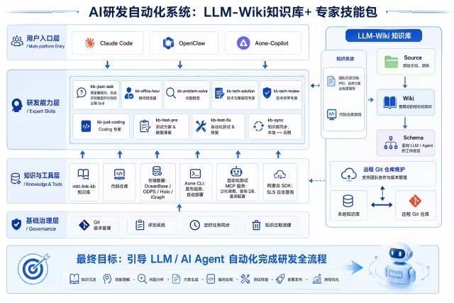

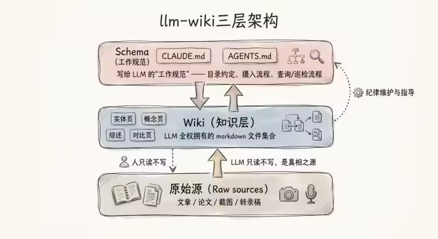

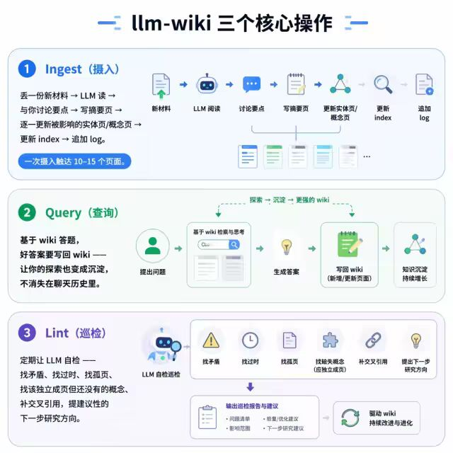

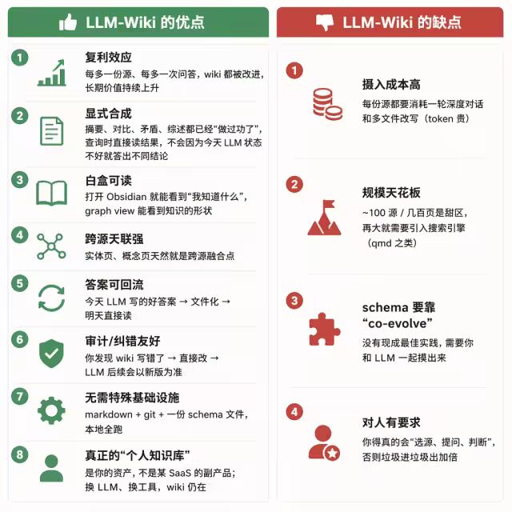

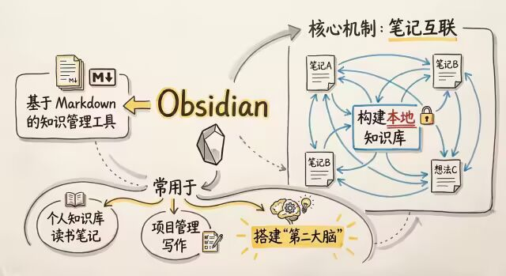

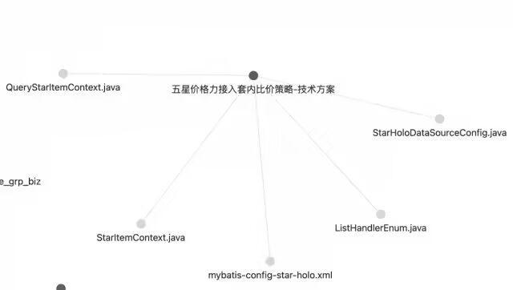

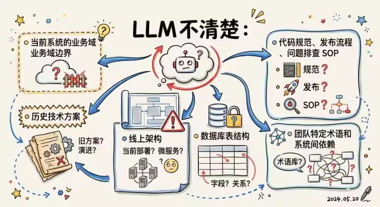

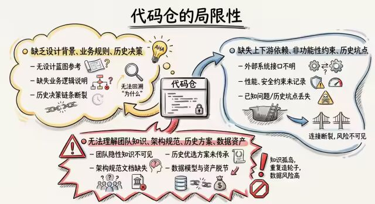

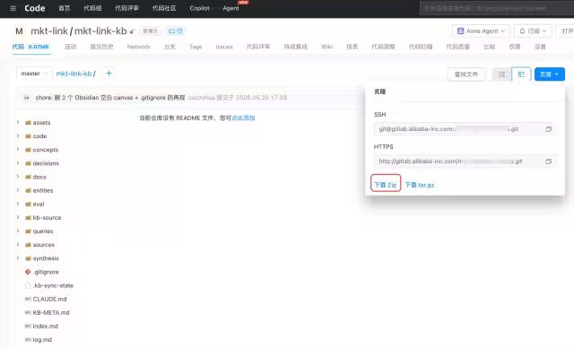

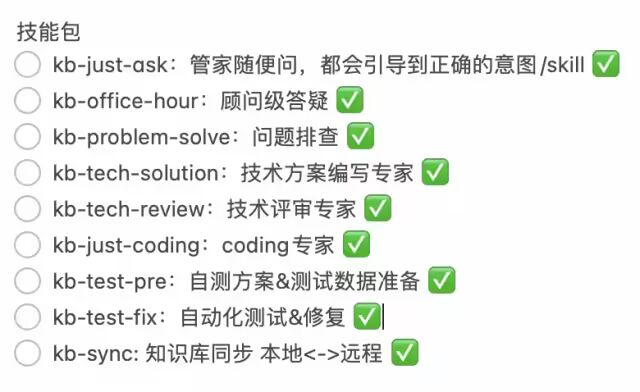

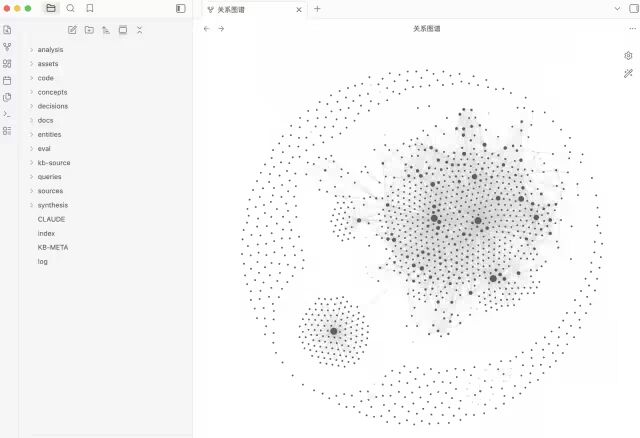

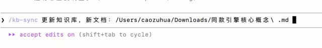

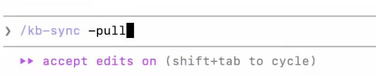

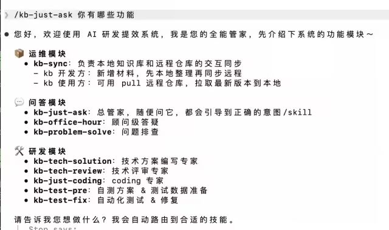

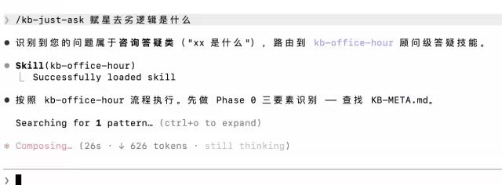

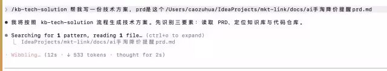

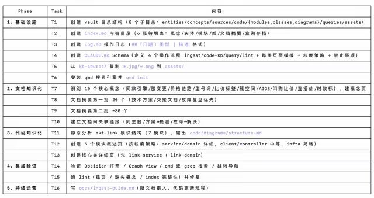

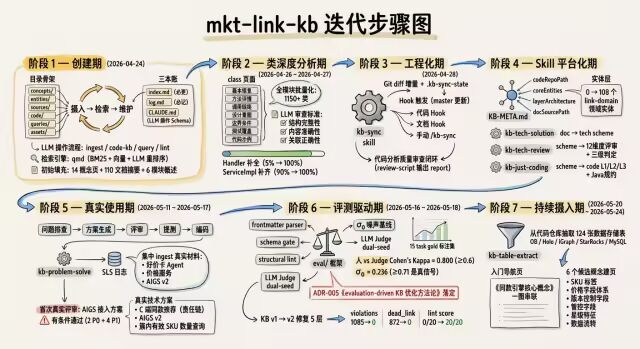

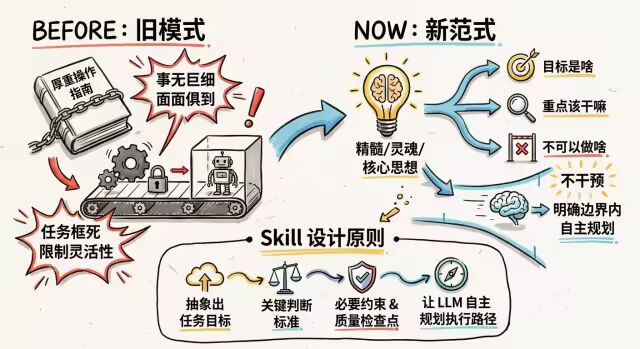

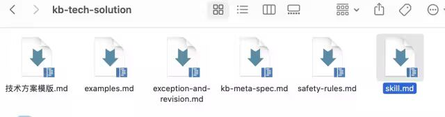

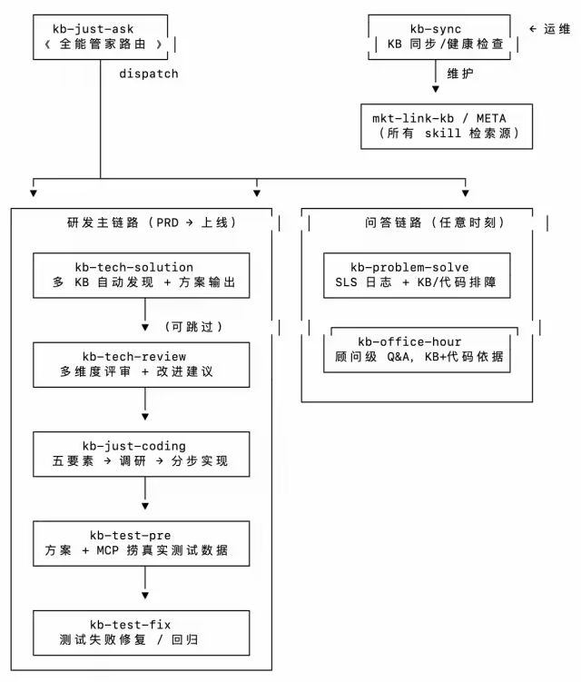

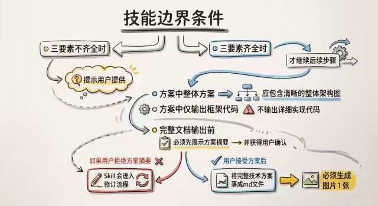

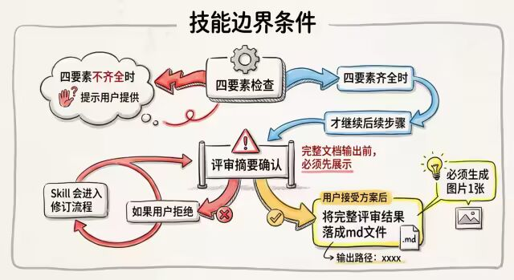

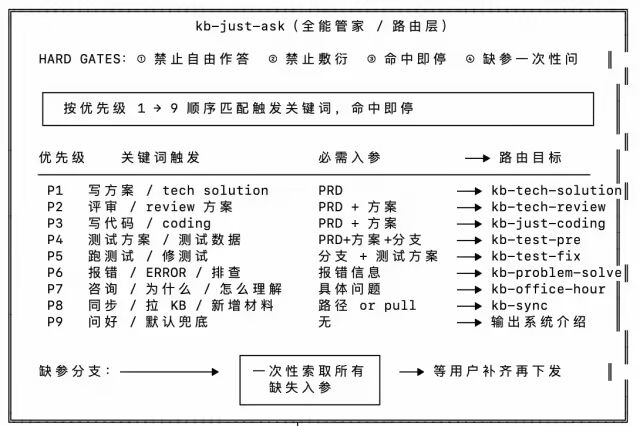

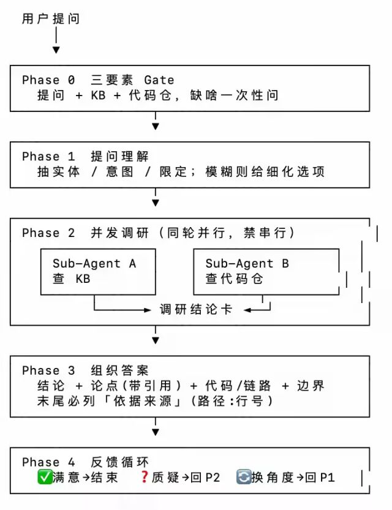

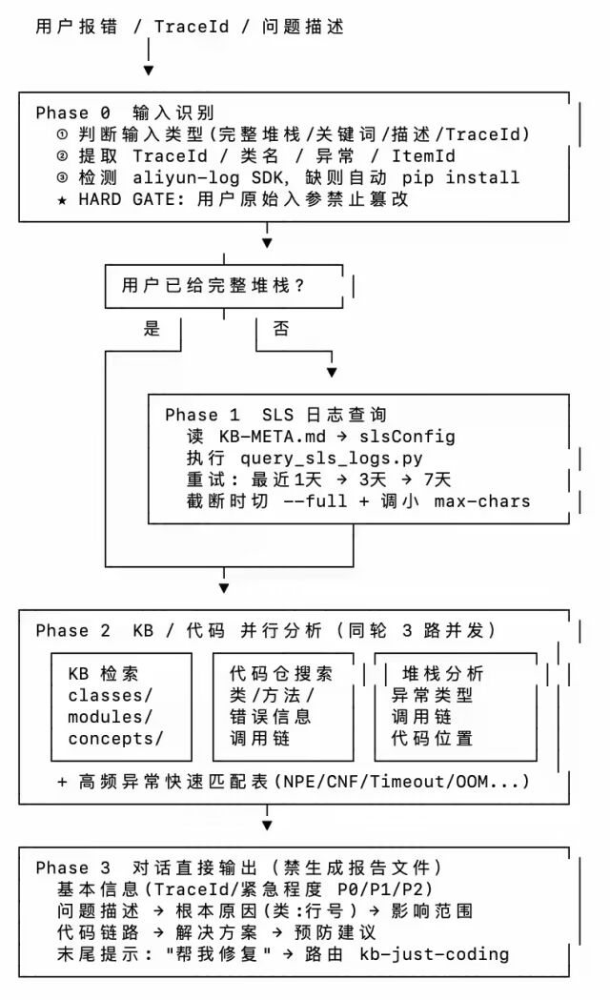

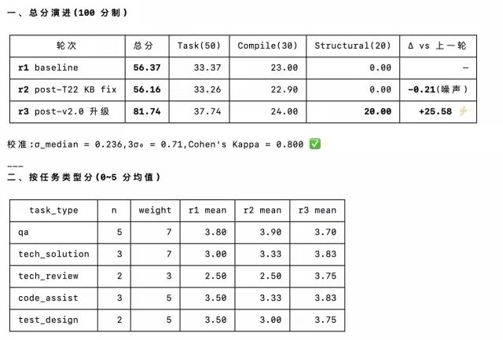

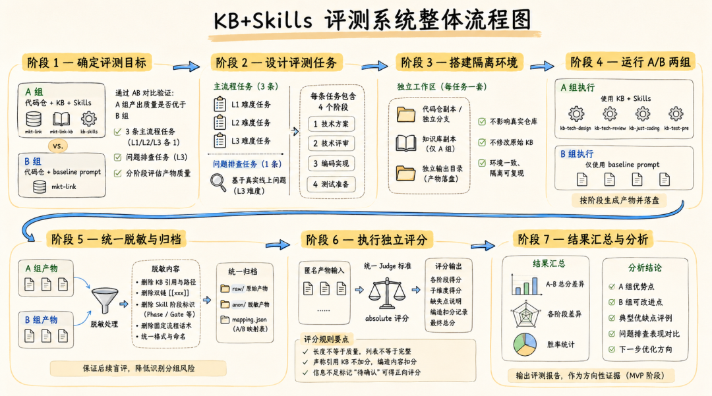

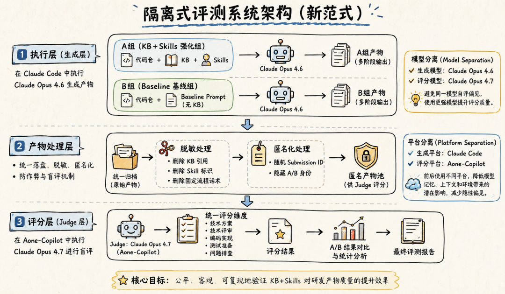

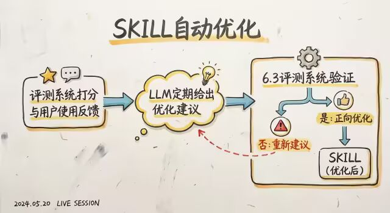

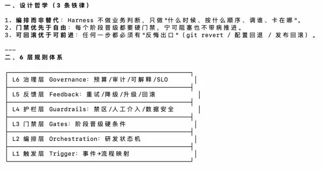
