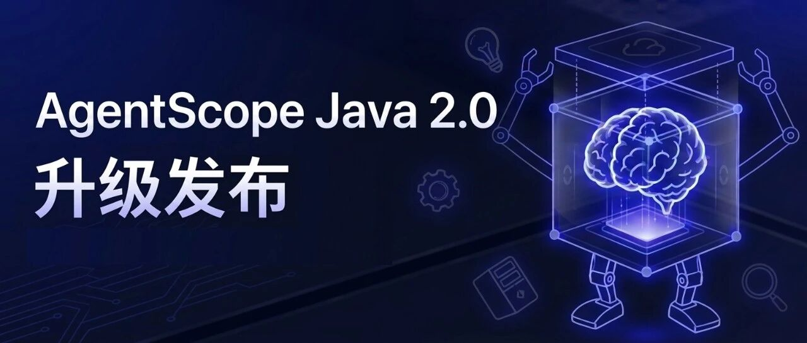
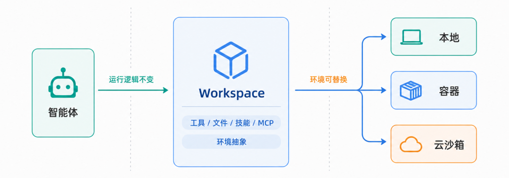
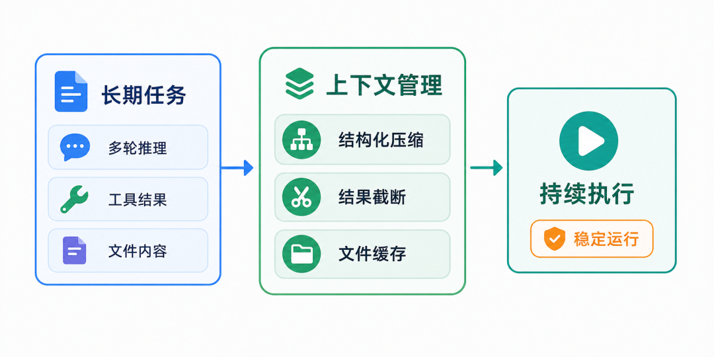
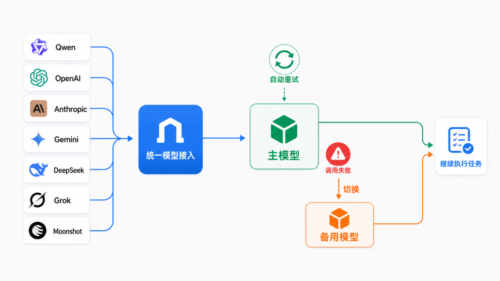
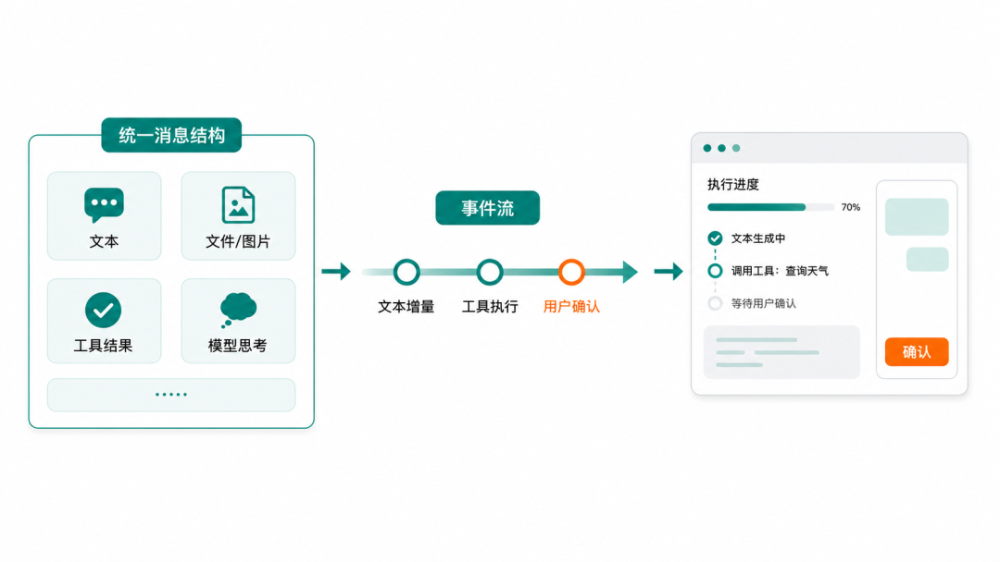
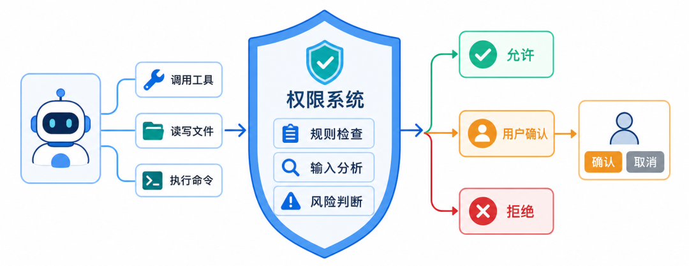
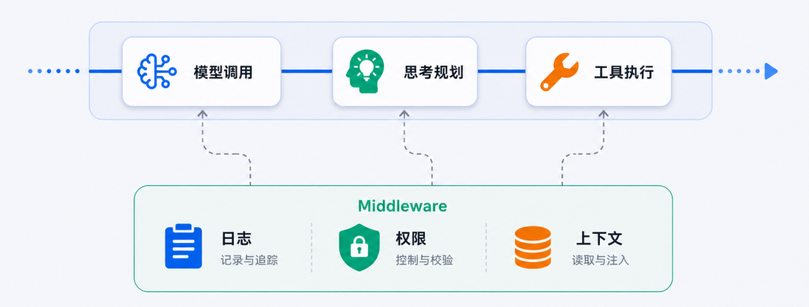

AgentScope 是一款开源的智能体应用开发框架，帮助开发者完成从大模型到智能体的构建与部署。继 Python、TypeScript 版本相继升级到 2.0 之后，**AgentScope Java 2.0 正式发布**——这是 AgentScope 多语言体系迈向 JVM 生态与企业级生产场景的重要一步。

对企业用户而言，让一个智能体跑通一次通常不是问题，难的是让它**长期稳定地运行、支持分布式部署与多租户隔离**。

在生产环境里，智能体往往要嵌入已有的 Spring Boot 微服务体系，要在 Kubernetes 上做无状态水平扩展，要满足多租户隔离、滚动发布、安全审计等一系列看不见但缺一不可的工程要求。

AgentScope Java 2.0 正是**面向这些企业级需求展开的一次系统性升级**——延续 1.0 的"透明开发"理念，把"让智能体在企业环境中可靠运行"做成框架内生能力，进一步聚焦真实场景下的稳定运行、安全控制、分布式部署与接入需求。



## 01 企业级分布式部署：无状态水平扩展、零停机发布、多租户隔离

企业用户对智能体框架的真正考验不在跑通一次 Agent 调用，而在 Agent 如何部署上线、以及部署之后能否稳定运行。AgentScope Java 2.0 把分布式部署做成了一等公民——同一份业务代码，按需切换到分布式形态，任意副本都能恢复任意用户的完整上下文。

**1. 分布式的会话与沙箱管理。** 在单机开发阶段，会话状态默认落到 workspace 工作区目录，零配置开箱即用；进入生产部署后，只需把状态后端替换为分布式存储——对话历史、上下文摘要、计划进度、待办列表、权限规则等运行时状态便被统一外置出去，任意一个副本都能拉到完整快照接续工作。沙箱模式下还要再多走一步：智能体在容器内积累的可执行环境（已克隆的代码仓库、装好的依赖、临时文件）会在每次调用结束时打包成快照，落到对象存储或 Redis；当容器漂到其他节点时，下一次调用可以从快照中重建出完全相同的工作区，用户感知不到节点切换。框架在装配阶段会校验这套配置的一致性——一旦使用了沙箱或远端存储却忘了把会话状态也换成分布式后端，启动时就会直接报错，避免上线后才发现状态丢失。

**2. 多租户隔离贯穿整个执行链路。** RuntimeContext 的 userId 和 sessionId 不只是日志字段，它们直接贯穿工作区路径、KV 命名空间、沙箱环境。它们会被框架沿着工作区路径、存储命名空间和沙箱状态槽一路传下去，参与每一次资源寻址。开发者只需要按业务语义挑一档隔离粒度——每段对话各跑各的、同一用户的多次会话共享工作区、公共工具型智能体全员共享，乃至全局共享——框架就把"谁能看到谁的数据"这件事推给系统强制约束，而不是依赖业务代码自觉。

**3. 统一抽象的文件系统层。** 智能体所有的文件操作——读写、检索、上传下载——在框架内被收敛到一层统一的 AbstractFilesystem 文件系统抽象之后，每次调用都自动带上当前会话与用户的身份信息，框架据此把读写动作隔离到对应租户的命名空间。本地磁盘、容器沙箱、远端存储三类后端共用同一套上层语义，这意味着开发 → 测试 → 生产的三段部署路径不需要改代码，业务代码、工具集与智能体逻辑保持不动，只需要在部署时切换底层的存储后端。


## 02 Harness：把"长期稳定运行"沉淀为框架内核实现

Java 版 AgentScope 2.0 引入了一个核心抽象：**HarnessAgent**。它是 ReActAgent 之上的工程化封装——核心 ReAct 推理循环原样保留，但围绕长期稳定运行所需的工作区、长期记忆、上下文压缩、子智能体编排、沙箱隔离、计划模式等工程能力，全部打包进单一 builder。开发者从 ReActAgent 起步，需要长期稳定运行时无缝迁移到 HarnessAgent，业务代码无须改动。

```java
HarnessAgent agent = HarnessAgent.builder()
    .name("demo-agent")
    .model("dashscope:qwen-max")
    // ModelRegistry 解析，自动读取 DASHSCOPE_API_KEY
    .workspace(Paths.get(".agentscope/workspace"))
    // AGENTS.md / MEMORY.md / skills / subagents
    .filesystem(new DockerFilesystemSpec()
        // 沙箱执行：本地 / Docker / 远端 KV 一行切换
        .isolationScope(IsolationScope.USER))
    // 同一用户跨会话共享
    .build();

agent.call(msg, RuntimeContext.builder()
    .sessionId("demo").userId("alice").build()).block();
```

AgentScope Java 2.0 的设计目标很直接：ReActAgent 提供 Agent loop 抽象与所有底层原子能力，Harness 提供保障效果、稳定、分布式部署、长期运行的一站式解决方案。

它对应的不是某项新模型能力，而是真实生产场景里那些"上线前看不到、上线后绕不开"的工程问题——身份持续注入、上下文规模可控、状态可恢复、能力可沉淀。这些问题在原型阶段几乎不存在，但在企业部署里几乎是全部。Harness 在不改写推理循环的前提下，把这些问题各自的解法以 middleware 与 toolkit 的形式叠加到关键时机上，只叠加，不替换。



## 03 Workspace：让执行环境与 Agent 逻辑解耦

智能体在长期运行中需要持续读写文件、加载技能、连接 MCP 服务、保存对话状态。如果"智能体要做什么"和"它在哪里读写"绑死在一起，那么从本地切到容器、再切到云端，就要逐处适配。

AgentScope Java 2.0 把这件事拆成两层正交的抽象——**工作区是逻辑视图，抽象文件系统是物理载体**。前者定义"智能体的资源长什么样"，后者定义"这些资源真正落在哪里"，两者通过一套统一的目录布局解耦。

**工作区：智能体执行环境的逻辑视图。** 工作区把智能体长期运行所需要的全部资源——人格设定、长期记忆、领域知识、可复用技能、子智能体声明、工具与 MCP 白名单，以及运行时产出的会话快照与对话日志——统一组织成磁盘上的一套标准化目录结构。每轮推理时，框架会按需把这些资源拼进 system prompt：开发者只要把工作区版本化进 Git，智能体的"配置"就有了 PR、CR 和版本号，改文件即升级智能体，不需要重启服务、更不需要改一行业务代码。

**抽象文件系统：工作区的物理存储载体。** 同一份工作区的目录布局，背后可以挂在三类不同的存储后端之上：

- **本地文件系统**——直接读写宿主磁盘，零配置开箱即用，适合开发与单机部署。
- **沙箱文件系统**——把工作区放进一个隔离的容器，所有文件读写和命令执行都自动路由进容器内部，宿主完全不参与执行。容器状态可以按会话或用户的粒度持久化到对象存储或 Redis；即使节点切换、容器漂移，下一次调用也能从快照中重建出完全相同的工作区。这是面向不可信输入与企业多租户的默认推荐形态。
- **远端文件系统**——把工作区直接落到远端的键值或对象存储后端，多副本之间共享同一份逻辑工作区。适合纯 Web 服务形态、不需要本地 shell 的场景。

三种模式之上是同一套统一的文件系统语义；每一次读写都会带上当前会话与用户的身份信息，由框架自动把数据隔离到对应租户的命名空间——多租户隔离这件事被推到底层强制约束，业务侧不需要再自己写一遍。如果业务上需要把"只读的团队知识库"叠加在"可写的会话工作区"之上，框架也支持这种分层组合。



## 04 Context：支撑长期任务的上下文管理机制

处理长期任务是智能体应用走向真实场景时的重要部分。一个长期任务可能包含多轮模型调用、多个工具结果、大量文件内容和用户反馈。

AgentScope 1.0 已经提供了上下文管理能力；到了 2.0，这部分能力进一步走向系统化。AgentScope 2.0 会结合任务状态、工具结果和文件读写过程管理上下文：

- 压缩结果不只是简单摘要，而是结构化保留任务目标、当前状态、关键发现、下一步计划和需要长期保留的信息；
- 超大工具结果（动辄几十K字符的 git diff、mvn test 输出、搜索结果）会被自动卸载到工作区，上下文里只保留首尾摘要 + 一个 read_file 路径占位符；
- 内置文件读写工具也加入文件缓存机制，减少重复 IO；
- 当真的撞到模型 context_length_exceeded 时，框架还会自动触发兜底压缩重试，避免任务直接断在边界处。

因此，上下文管理在 AgentScope 2.0 中不只是"压缩历史"，而是升级为支撑长期任务执行的系统策略。



## 05 模型接入：开放生态之上，加入容错能力

AgentScope 2.0 继续保持开放的模型接入能力，支持 Qwen、Anthropic、DeepSeek、Gemini、OpenAI 等主流模型，并进一步扩展 Grok、Moonshot、Ollama 等模型的支持。但 2.0 的重点不只是"接入更多模型"，而是让模型调用在复杂任务中更加稳定可靠。

在真实任务中，Agent 往往需要多轮推理和多次工具调用；任何一次模型接口失败、超时或不可用，都可能影响后续执行。为此，AgentScope Java 2.0 在模型层引入统一的 Credential + ChatModel 抽象，每个厂商都是同一套 builder 后面的一份独立实现；并在此之上提供统一的重试与备用模型机制——通过 FallbackModel 包裹主模型，开发者可以配置最大重试次数和备用模型链，主模型不可用、限流或过载时框架自动透明切换。



## 06 消息与事件：从聊天消息升级为可交互执行流

智能体应用的复杂度，也体现在消息上。普通聊天应用里，消息可以只是字符串；但在智能体执行过程中，一条消息里可能同时包含文本、图片、文件、工具调用、工具结果、模型思考、用户确认状态、外部执行结果等。

AgentScope 2.0 对消息模块进行了重构，通过统一的 ContentBlock 承载以上的不同消息类型，并在 Java 侧借助 sealed class 与 record 把每一种 block 表达成强类型——非法的 role × content 组合在构造期就被拦下，而不是跑起来才报错。

在此基础上，AgentScope 2.0 引入事件系统。一次 call() 不再只是返回最终文本，而是可以通过 streamEvents() 流式产生模型调用开始、文本增量、工具调用、工具结果、用户确认、外部执行等类型化事件——基于 Project Reactor 的 Flux 输出，前端 UI 直接订阅就能实时跟随。这让人工确认、人工介入和外部工具执行成为框架内生能力。



## 07 权限系统：让自主执行更有边界

为了更好地发挥大模型的能力，智能体需要拥有更强的自主性。但智能体越能自主行动，就越需要明确权限的边界——尤其是在企业环境里，触发智能体的可能是任意一位员工或外部用户，宿主系统必须假设输入不可信。

AgentScope 2.0 引入了更加系统化的权限系统，用来控制智能体在调用工具、读写文件、执行命令时的行为边界。工具调用不再是简单的允许或禁止，而是基于静态规则、工具类型和输入内容综合判断："允许 / 用户审批 / 拒绝"三态决策。例如，文件读写工具会检查是否涉及危险目录和敏感文件；命令执行工具会分析高风险命令、动态 shell 结构和危险删除操作；对于未知或高风险行为，框架会自动进入用户审批流程（HITL），把决策权交回给人。

## 08 Middleware：让框架扩展更灵活

真实场景中的智能体往往需要接入不同的日志记录、权限策略、业务上下文和模型调用策略。如果这些能力都必须通过修改框架内部实现来完成，扩展成本会很高。

AgentScope Java 2.0 引入 middleware 机制，把原本松散的 Hook 列表收敛成五个清晰阶段——`onAgent` / `onReasoning` / `onActing` / `onModelCall` / `onSystemPrompt`。开发者可以在 Agent 的关键执行环节插入自定义逻辑：模型调用前后的日志追踪与限流，工具执行前的安全检查，reasoning 与 acting 流程中的业务策略，以及 system prompt 构造阶段的动态上下文注入。通过 middleware，AgentScope 2.0 可以在保持核心框架稳定的同时，为不同应用场景留下足够灵活的扩展空间。



## 09 总结：AgentScope 2.0 打造企业级生产底座

AgentScope Java 2.0 进一步围绕让智能体在企业环境中可靠运行这一目标全面升级：从模型层的容错切换，到执行环境的抽象解耦；从细粒度的权限边界，到分布式 Session 与沙箱快照；从结构化的事件流式输出，到多租户隔离与可观测体系。这些升级旨在系统性地回应真实场景中智能体长期运行、安全调用工具、持续推进任务、跨副本恢复和接入外部应用的共同需求。

**相关链接：**

- AgentScope Java：https://java.agentscope.io
- AgentScope Python：https://docs.agentscope.io
- AgentScope TypeScript：https://agentscope.io
