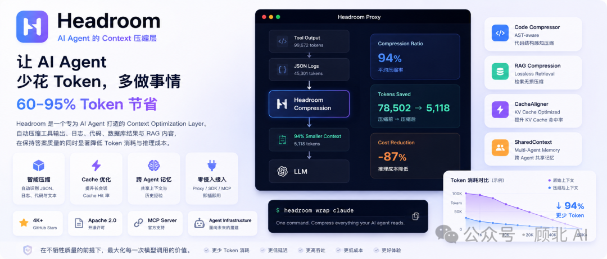
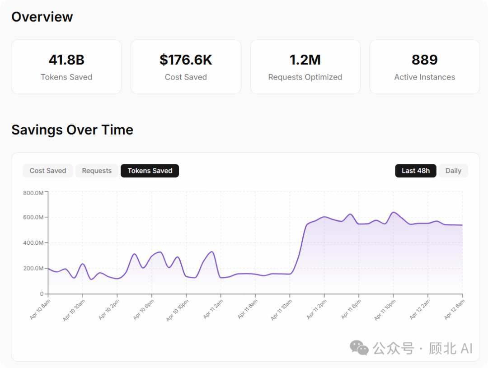
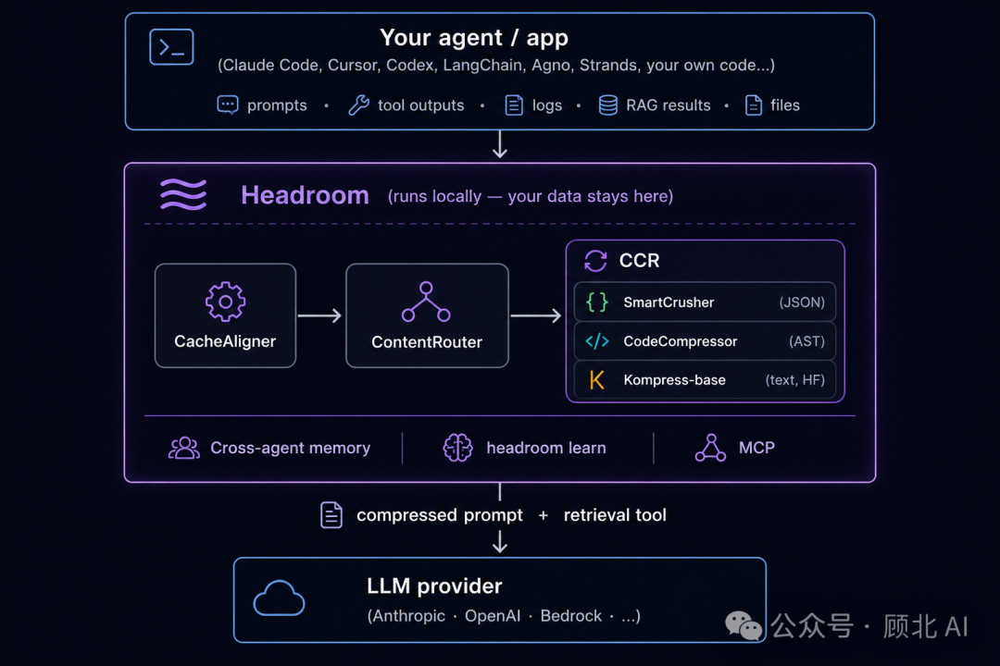
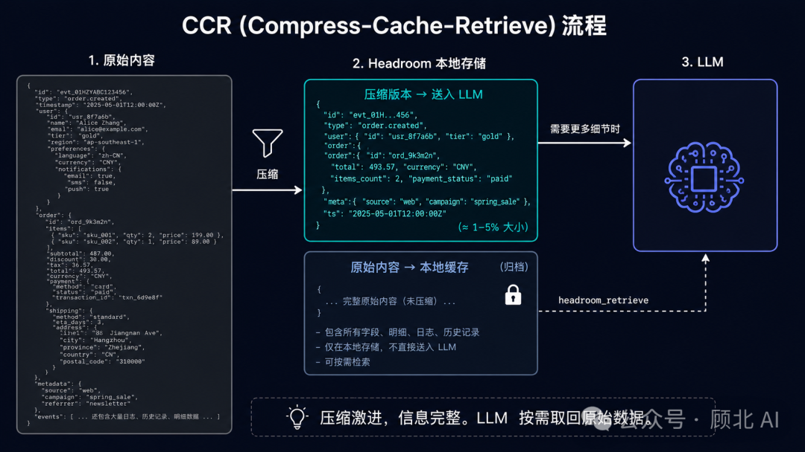
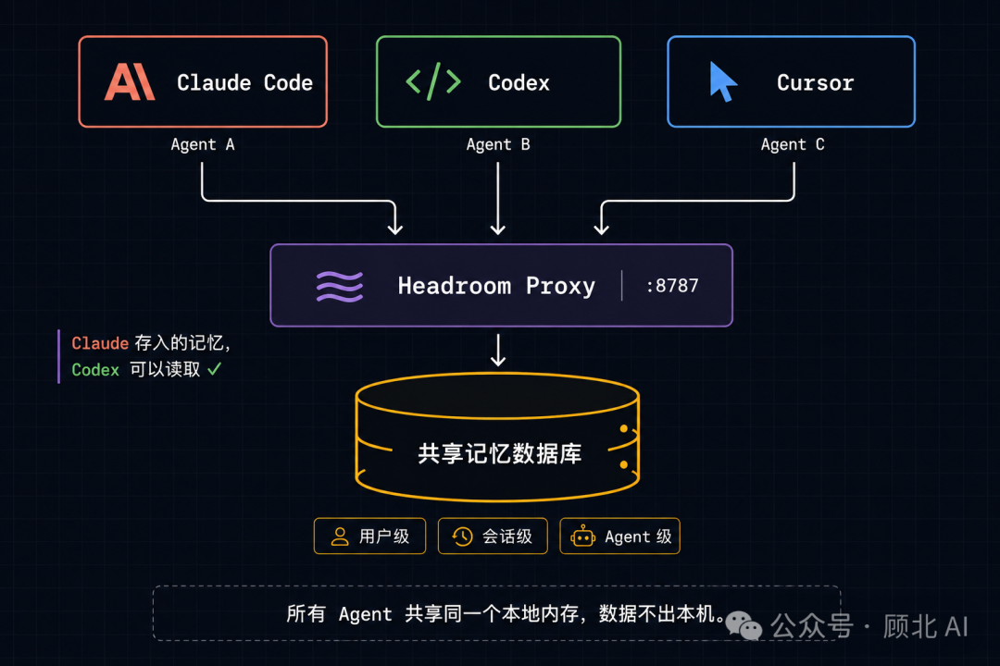
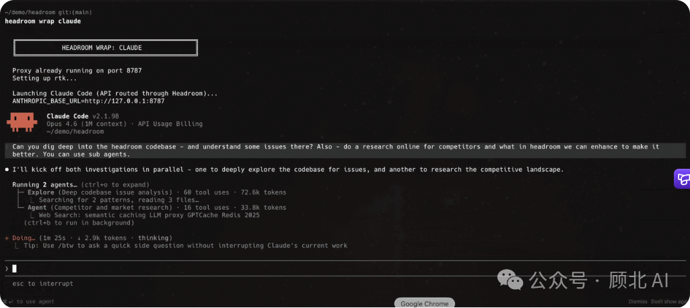
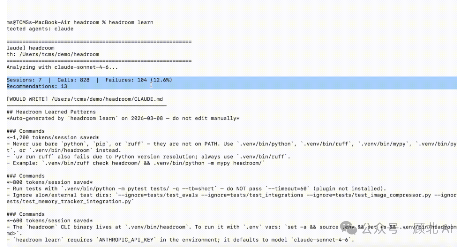

# Headroom — 开源上下文压缩工具，帮你省掉 92% 的 token

> 在工具输出、日志、RAG 结果、文件等内容进入 LLM 之前，先压缩一遍。不改 Agent 逻辑，不换模型，就在中间插一层。

上个月跑代码审查 Agent，单次任务 65,000 个 token，就为了找一个 Bug。工具输出 100 条结果 97 条没用，日志塞满 passing 的测试，真正报错的淹没其中。

Headroom（GitHub: chopratejas/headroom，11.3k stars，Apache 2.0）解决的正是这个问题。



## 实测数据

| 场景 | 压缩前 | 压缩后 | 节省 |
| --- | --- | --- | --- |
| 代码搜索（100 个结果） | 17,765 | 1,408 | **92%** |
| SRE 事故调试 | 65,694 | 5,118 | **92%** |
| GitHub Issue 处理 | 54,174 | 14,761 | **73%** |
| 代码库探索 | 78,502 | 41,254 | **47%** |

在 GSM8K 上跑 benchmark，压缩前后准确率 **±0**。TruthfulQA 压缩后反而涨了 3%——噪声少了模型更容易找到关键信息。



## 怎么压缩的

不是简单截断，也不是让 LLM 总结。Headroom 有一套专门的压缩流水线。

### ContentRouter：先识别内容类型
判断是 JSON 工具输出、源代码、日志、纯文本还是 Git diff，然后路由到对应压缩器。

### SmartCrusher：处理 JSON 工具输出
用统计分析扫描 JSON 数组，自动保留：异常记录、包含 error/fatal/failed 的条目、边界值（最大/最小/首/尾）。噪声直接丢掉。

那个"100 条日志找一个 FATAL"的例子，从 10,144 token 压到 1,260 token，同样找到了那条错误。

### CodeCompressor：AST 感知的代码压缩
不是字符串截断，而是解析代码的 AST，然后：
- 保留所有函数/类的**签名**
- 折叠函数体（用占位符替代）

Agent 能看到完整的代码结构，不用读每一行实现细节。支持 Python、JS、Go、Rust、Java、C++。

### Kompress-base：文本内容压缩
基于 ModernBERT 做 token 分类，判断哪些句子冗余可删。

### CacheAligner：让 KV 缓存真正生效
把 system prompt 中的动态内容（时间戳、UUID、session token）提取到 prompt 末尾，稳定前缀，让 prompt 缓存真正命中。



## CCR：可逆压缩

最有趣的设计：**Compress-Cache-Retrieve（CCR）**。

压缩时把原始内容存到本地，给 LLM 一个 `headroom_retrieve` 工具。模型在推理中如果发现"需要更多细节"，可以主动调用这个工具拿回原始内容。

压缩是激进的，但信息是完整的。LLM 只在真正需要的时候翻原始数据。



## 跨 Agent 共享记忆

Claude Code、Codex、Cursor 的记忆完全隔离——Claude 里解决了一个坑，换 Codex 得重新交代。

Headroom 通过代理模式让所有 Agent 共享同一个本地内存数据库：自动去重，按 user → session → agent → turn 四级隔离，不会互相污染。

```
headroom proxy --port 8787 --memory
```



## 四种接入方式

### 方式一：一行代码（Python/TypeScript）

```python
from headroom import compress

result = compress(messages, model="claude-opus-4-5")
response = client.messages.create(
    model="claude-opus-4-5",
    messages=result.messages,   # 压缩后的
)
print(f"节省了 {result.tokens_saved} tokens（{result.compression_ratio:.0%}）")
```

### 方式二：透明代理（零代码改动）

```bash
headroom proxy --port 8787
export ANTHROPIC_BASE_URL=http://localhost:8787
# 代码不用动
```

### 方式三：一条命令包裹 Agent

```bash
headroom wrap claude        # Claude Code
headroom wrap claude --memory  # 带记忆
headroom wrap cursor        # Cursor
headroom wrap codex         # Codex
```

### 方式四：MCP Server

```bash
headroom mcp install
```

安装后 MCP 客户端会多出 `headroom_compress`、`headroom_retrieve`、`headroom_stats` 三个工具。



## headroom learn：从失败中学习

分析历史失败 session，自动提取反复出现的错误模式，把修正建议写进 `CLAUDE.md` / `AGENTS.md`。Agent 踩过的坑，下次启动时就带着修正上场了。



## 快速试试

```bash
pip install "headroom-ai[all]"
headroom perf  # 先跑性能测评，看你的场景能省多少
```

- GitHub：https://github.com/chopratejas/headroom
- 文档：https://headroom-docs.vercel.app/docs
