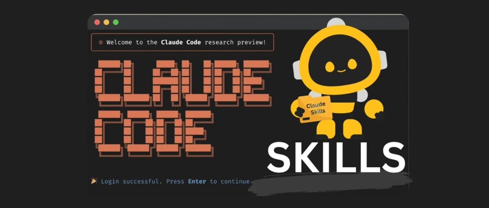

# 一个开源的 Skill 阅读神器



> 把任意书籍或文件夹里的文档资料，打包成 Claude Code 的技能文件，随时查看。

## 痛点

年初的时候买了一本书籍，读完之后便放在书架上吃灰。这几天，突然想翻找一下里面所讲的知识点，却找了半天都找不着。

转头想问 AI，结果发现它会瞎编内容，然后想到自己做笔记，但又不知道存放在哪个文件夹了。

更无奈的是，若把一本四百页的 PDF 书籍直接丢进 AI 对话框，还没开口提问，上文直接就撑爆。

于是找到了 **book-to-skill** 这个工具来解决这个问题。

## 工作原理

把 PDF、EPUB，甚至 DOCX、Markdown 等格式的文件发送给它时，会先问一句：是技术还是叙事类书籍？

- **技术书籍** → 走 Docling 线，把表格和代码块原样抽出来
- **叙事书籍** → 只将纯文本提取

接着，它会对整本书进行一次深度分析，并且拆开重新组织，生成一个装着核心框架和章节索引的 **SKILL.md**。

然后，再将每个章节分别切成单独一个文件存储，另外还会配有术语表、模式表和速查表。

这些拆分的章节文件不会一下子塞进对话的上下文，只有问到哪一章才读哪一章。

在 Claude Code 上用的时候，只需在终端敲 `/技能名 关键词`，它就定位到对应章节，照着原文回答。

## 与传统方式的对比

| 方式 | 做法 | 问题 |
| --- | --- | --- |
| 直接上传 PDF | 把整本书塞进上下文 | 每次对话都重新烧 Token，幻觉极高 |
| RAG(检索增强生成) | 提问时去书里捞几段相近原文 | 拼不拼得出答案看运气 |
| **book-to-skill** | 先深度分析，把框架/反模式抽出命名 | AI 调用已消化好的框架，准确率更高 |

## 安装与使用

**安装：** 在 Claude Code 中发送：

```
请读取下面链接文件内容，并安装好这个 Skill：
https://raw.githubusercontent.com/virgiliojr94/book-to-skill/master/SKILL.md
```

**使用：** 在对话中指定书籍：

```
/book-to-skill ~/path/to/your-book.pdf
```

## 注意事项

- 技术书采用 Docling 更高精度，代价是比较慢：103 页约跑 164 秒，纯文本提取只要 0.1 秒
- 冷门书生成完最好自己再过一遍，合成质量比抽取更重要
- 在几十本书间检索不如 NotebookLM 好用
- **它真正擅长的是：把一本书或一组资料吃透，融入到工作流里方便随时查看**

## 写在最后

过去想让 AI 读懂一本书，第一反应是把整本 PDF 文件上传上去。

如今有了更聪明的做法：先把书读懂、拆解、结构化，再让 AI 按需取用。

**book-to-skill 做的，就是把书架上落灰的知识，变成随手能调用的能力。**

## 相关链接

- GitHub：https://github.com/virgiliojr94/book-to-skill
