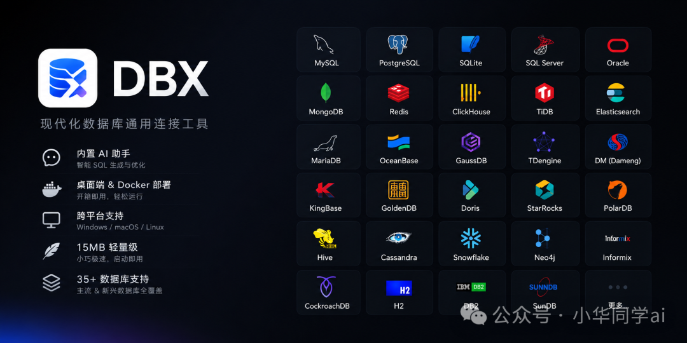
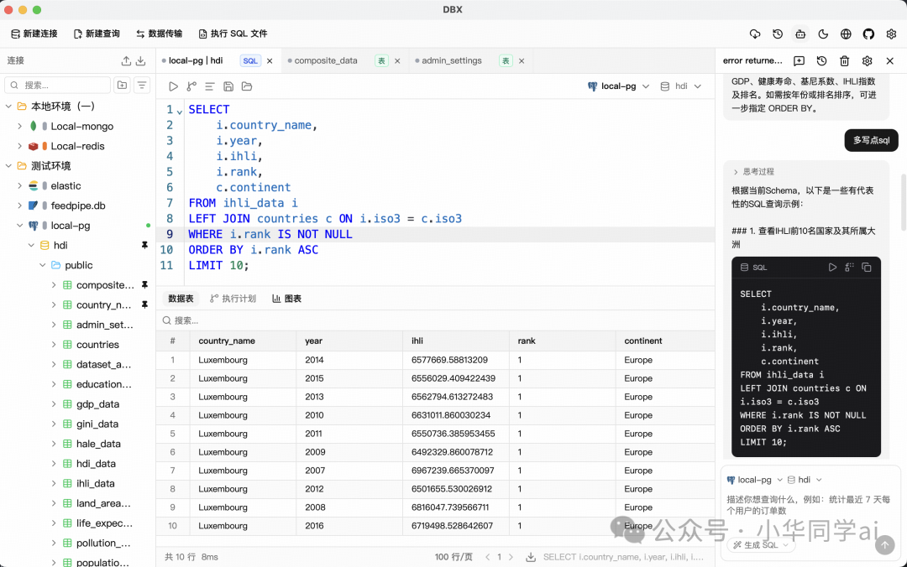
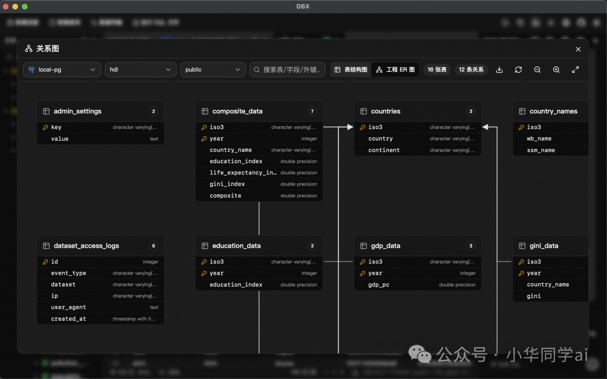
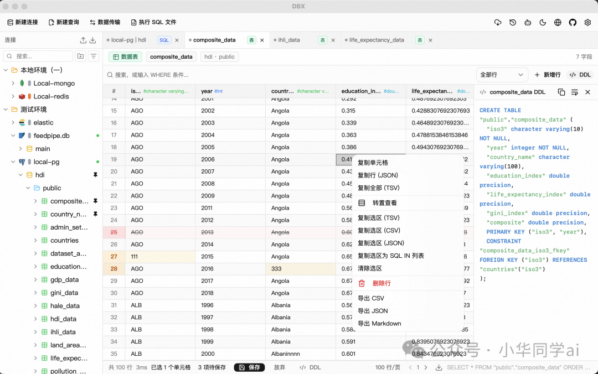

如果你是一个开发者，大概率经历过这样的场景：打开数据库管理工具，等它加载完 Java 运行时环境，再等它连上数据库，几分钟过去了，你还没开始写一行 SQL。更别说某些工具动不动几百 MB 的安装包，硬盘空间捉急的时候，删和不删都让人纠结。而 DBX 的做法相当于把一座写字楼的功能塞进一个便利店（15MB），还在里面开了个 AI 窗口。

最近在 GitHub 上看到一个项目，上线一个多月就拿到了 3600 多颗 Star，名字叫 DBX。它用 15 MB 的体积，打包了一个能连接 MySQL、PostgreSQL、SQLite 等数十种主流和国产数据库的管理客户端，还内置了 AI 助手和 MCP 协议支持。我用了几天，觉得值得写一写。



## 15MB 的技术密码

DBX 能做到 15 MB，核心原因是它的技术选型和主流数据库客户端完全不同。

市面上的数据库管理工具，DBeaver 基于 Eclipse 平台，需要 Java 运行时，安装包通常在 300MB 以上；Navicat 功能强大但也是动辄上百 MB 的体积；TablePlus 虽然轻量，却只支持 macOS。DBX 选择了一条不同的路：用 Rust 写后端逻辑，用 Tauri 2 做桌面框架，前端用 Vue 3 + TypeScript。

Tauri 2 这套框架本身就是一个「反 Electron」的存在——它**不内嵌 Chromium 浏览器**，而是直接调用操作系统的 WebView。这意味着你不需要为每个应用下载一个完整的浏览器内核。Rust 编译出来的二进制文件体积小、性能高，而且不需要任何运行时环境——不用装 Java，不用配 Python 虚拟环境，下载下来直接就能跑。

我在 macOS 上用 Homebrew 安装，从敲命令到打开界面，**前后不到 30 秒**。这种「拿起来就用」的体验，在数据库工具里确实少见。



## AI 原生 SQL 编辑器

AI 能力是 DBX 区别于传统数据库工具最明显的特征。它不是在菜单里藏一个「AI 功能」按钮，而是直接把自然语言查询做进了 SQL 编辑器里。

你选中一张表，用自然语言描述你想查什么——比如「帮我查最近一周注册的用户里，充值金额最高的前 20 个人和他们的订单数」——DBX 会自动生成对应的 SQL，语法高亮展示在编辑器里，你可以直接执行，也可以先检查再跑。

这个流程解决了一个实际痛点：以前我们写复杂 SQL 要在工具和 AI 对话框之间来回切，复制粘贴、格式错乱、上下文丢失都很常见。现在整个过程在一个窗口内完成，效率提升是实打实的。

更让我觉得加分的是它的 AI 安全检查机制。AI 生成的 SQL 在执行前会经过一轮自动审查，对有风险的 DROP、DELETE 等操作会给出提示。这点对于团队使用特别重要——毕竟不是每个人都想仔细审每一行 AI 写的 SQL。

DBX 支持 Claude、OpenAI 的 API，也支持通过 Ollama 接入本地模型。如果你对数据隐私有要求，可以用本地模型做 SQL 生成，**数据完全不出本机**。

## AI 编程助手直连

除了内置 AI，DBX 还支持一种让外部 AI 工具访问数据库的协议——MCP（模型上下文协议）。如果你平时用 Claude Code、Cursor 或 Windsurf 这类 AI 编程工具写代码，可以通过 DBX 让这些工具直接连上你的数据库。

配置很简单，在 MCP 配置里加几行 JSON：

```json
{
  "mcpServers": {
    "dbx": { "command": "npx", "args": ["-y", "@dbx-app/mcp-server"] }
  }
}
```

配置完之后，你在 Claude Code 里问「帮我查一下 users 表里最近注册的 100 个用户」，它就能直接执行查询、返回结果。不用在 DBX 里查完再复制给 AI，也不用教 AI 怎么连数据库——**一次配置就搞定**了。

对于喜欢折腾工作流的开发者来说，这个能力想象空间很大。你的 AI 编程助手有了数据库的「眼睛」，能做的不只是写代码，还能直接看数据、验证结果。

## 数据表格与搜索



数据库管理工具的核心体验，最终还是要回到查数据、看结构这两件事上。DBX 在这两块做得不错。

**数据表格**用的是虚拟滚动技术，即使返回几十万行数据也不会卡。支持行内编辑，改完数据后可以预览生成的 SQL 再确认保存，这个细节对生产环境操作很有用。过滤器系统做得比较灵活，右键直接按 LIKE / NOT LIKE 过滤，比大多数工具方便。导出格式覆盖了 CSV、JSON、Markdown、XLSX 甚至 INSERT 语句——如果你要迁移数据，省了一步格式转换。

**结构浏览**方面，数据库、Schema、表、字段、索引、外键、触发器都在侧边栏里按层级展示。最实用的功能是数据库搜索——当你的数据库有上百张表时，直接搜名字比一层层点开快太多。



## ER 图与结构对比

DBX 还有一个 **ER 关系图**功能，能把选定表之间的外键关联可视化出来。对于接手老项目、需要快速理解表结构的场景，这个功能是救命的。它不需要像其他工具那样额外装插件或者导出到第三方工具，点一下就能看。

另外值得提的是**结构对比**功能：你可以选两个不同的数据库连接，对比同一张表的字段差异。在做环境迁移或者多环境部署时，这个功能能帮你避免「开发环境和生产环境表结构不一致」的经典翻车。

## 三端统一部署

DBX 的安装覆盖了三个方向：桌面应用、Docker 自托管和 Web 版本。

桌面端是主力形态，macOS 用户一条 Homebrew 命令搞定，Windows 用户用 Scoop 安装也很简单，Linux 用户可以直接下载 AppImage 或 deb 包。Docker 版本适合团队场景，跑一个容器就能多人共用一套配置：

```bash
docker run -d --name dbx -p 4224:4224 -v dbx-data:/app/data t8y2/dbx
```

访问 `http://localhost:4224` 就能用，支持 x86 和 ARM 架构。Web 版本则是纯浏览器环境，不需要安装任何东西。

三个版本功能一致，连接配置可以导出导入。换电脑或者在不同环境之间切换时，**不用重配一遍数据库连接**——导出一个加密文件，另一边导入就行了。

## DBX 的适用边界

用了几天下来，我对 DBX 的判断是：它是一个定位清晰、执行力强的项目，但也有它的边界。

**适合的场景**：日常开发查询、快速浏览数据、需要偶尔写复杂 SQL 又不想记语法的开发者、用 AI 编程工具想直连数据库的场景。尤其适合「我就想装个轻量工具随时查数据」的需求。

**不适合的场景**：如果需要像 Navicat 那样强大的数据建模功能，或者需要做复杂的数据库运维管理（备份恢复、用户权限管理等），DBX 目前还覆盖不到。它的协议是 AGPL-3.0，如果你要做商业二次开发，需要留意合规问题。

另外，DBX 支持 MySQL、PostgreSQL、SQLite 等数十种数据库是一大优势，但不同数据库的支持深度不同。MySQL、PostgreSQL、SQLite 等主流数据库的功能覆盖最全，一些国产数据库如达梦、人大金仓等虽然能连，但部分高级功能可能还在完善中。这也正常——毕竟项目才上线一个多月。

总的来说，DBX 用 15 MB 的体积做到了很多几百 MB 工具才有的核心能力，而且在 AI 集成和 MCP 协议支持上走在了前面。它不是要替代所有数据库工具，而是在「轻量、AI 原生、多端统一」这条细分赛道上，提供了一个很有竞争力的选择。

## 项目地址

https://github.com/t8y2/dbx
