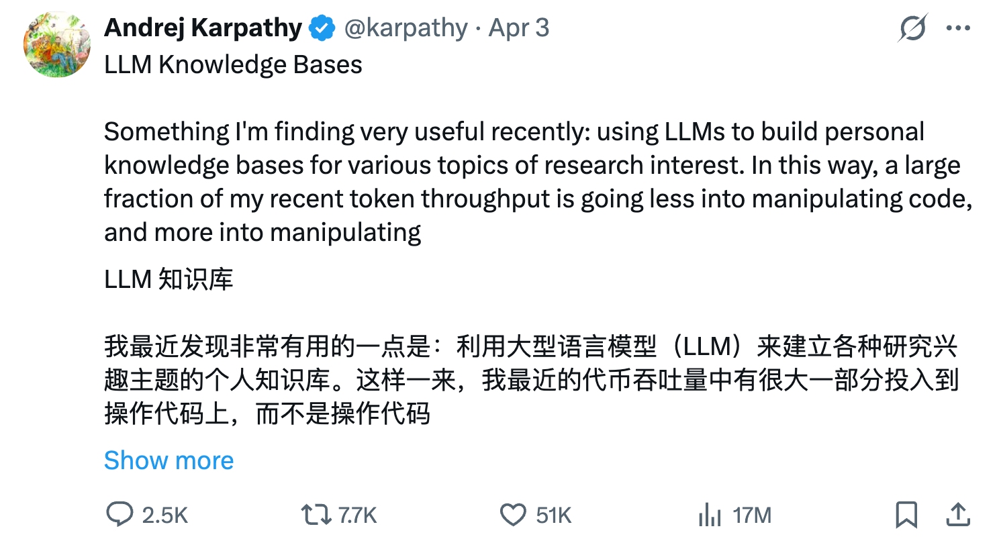
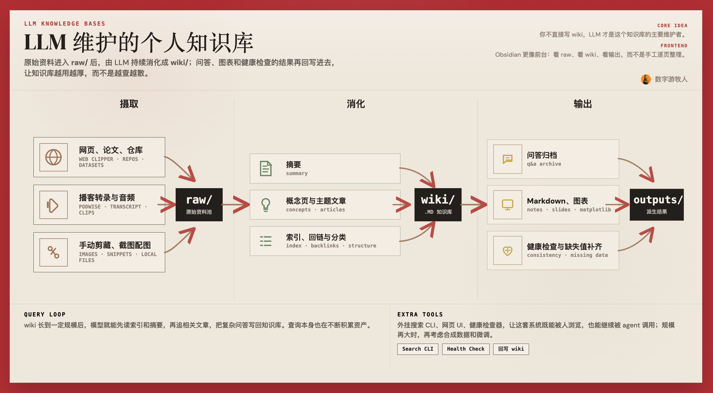
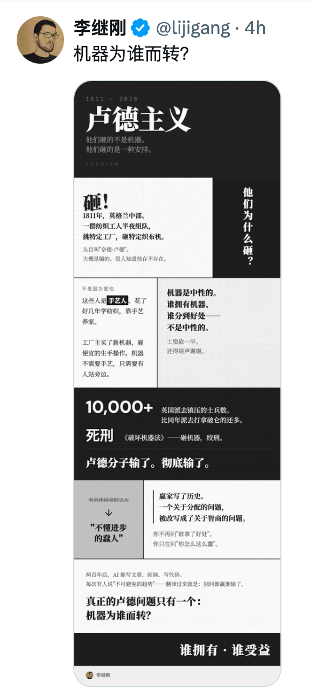
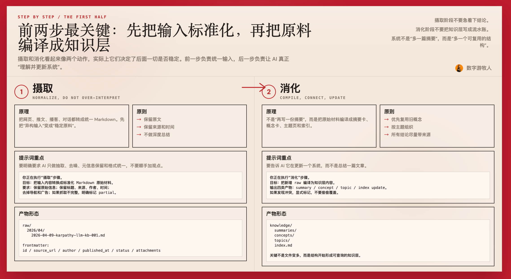
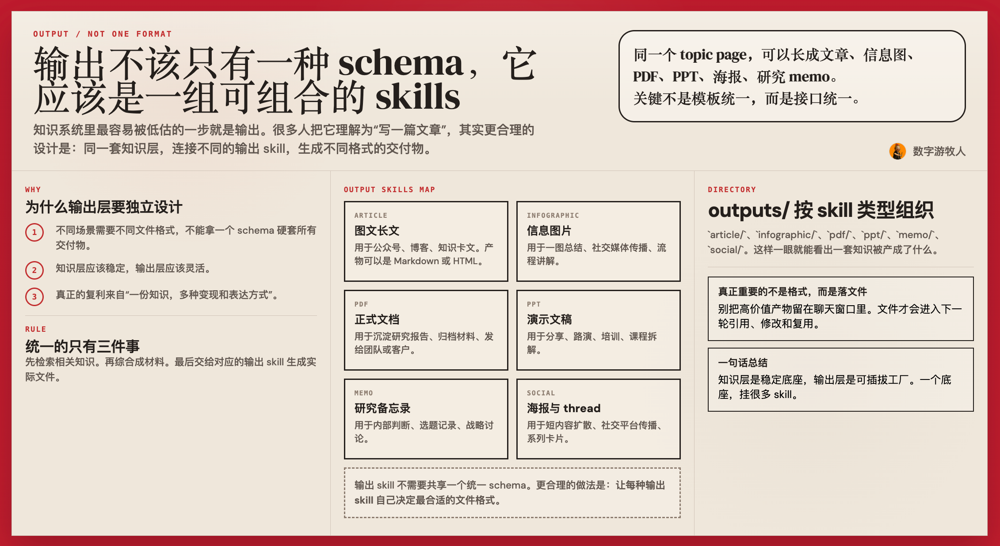
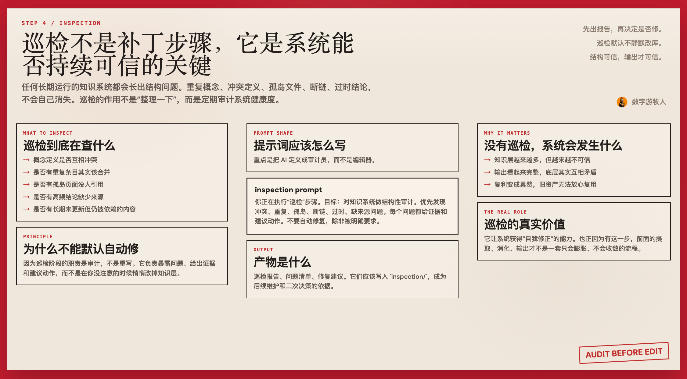
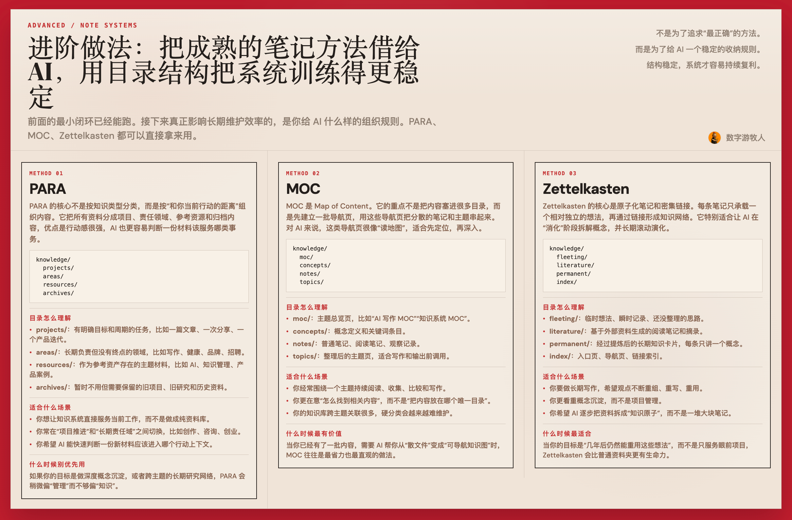
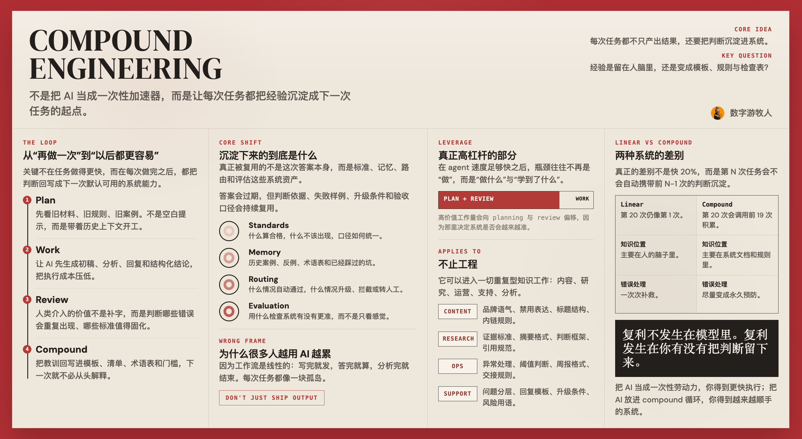

# 用 AI 搭一套会复利的知识系统【数字游牧人懒人包】

> 来源：数字游牧人 (2026-06-04)
> 原文：[飞书文档](https://lcnaoyjp4e3z.feishu.cn/docx/LpbXdRfevoE2c0xfoLWcEY2an7b)

文档使用方法：这篇文档大部分内容，是 AI 帮我写的。你不需要每个字去阅读，只要了解制作流程和思想，然后发给 AI，让 AI 开发每个技能。或者不用技能，只让 AI 写好提示词。然后测试，根据不满意的地方，让 AI 调整提示词即可。
**当然你实在很懒也可以复制文档里的提示词。但每个人使用场景不同，不存在适用于所有人的提示词。比如你想摄取小红书文章，另一个人摄取公众号。都会遇到不同的问题。但都可以让AI自己研究一个方案，成功后，让 AI 更新到提示词里。随着使用，提示词越来越强大，成为你个人的资产。**

其他有意思的数字游牧人游牧人懒人包：
- [Claude Code 电子书 & AI 全自动开发系统实战【数字游牧人懒人包】](https://lcnaoyjp4e3z.feishu.cn/wiki/IPG9wN5uXinY0fk8iQvc3T17nec)
- [AI + PPT 制作技巧指南【数字游牧人懒人包】](https://lcnaoyjp4e3z.feishu.cn/wiki/Qqo0wGwB4iexdDkWbE3cG3tWnuf)
- [Anthropic长程应用开发中的驾驭框架设计【数字游牧人懒人包】](https://lcnaoyjp4e3z.feishu.cn/docx/JUT8d3Zfuoul4DxoGM6csrhCnwg?from=from_copylink)

# Skills 资源合集

  摄取+消化用的 skill：
  画线框图用的 skill：
  [李继刚老师](https%3A%2F%2Fgithub.com%2Flijigang%2Fljg-skills)的长图 skill：
AI 大神 Andrej Karpathy 最近发布了一篇关于用 AI 做知识管理、做个人 wiki 的文章，阅读量到了 1800 万。



这篇文档会教你如何自己搭建这套流程。`摄取 -> 消化 -> 输出 -> 巡检`。



其实这个方法不只适用于知识库。它同样适用于内容生产、研究、产品分析、销售、招聘，甚至个人生活管理。
核心原则只有一句话：
**不要只让 AI 生成一次性的结果。要让 AI 帮你生成一套能持续使用的系统。**
这就是 compound engineering。


  备注：本篇内容的中，类似上面这种配图，也是用文档中提到的方法论制作。生成这种配图，可以使用[李继刚老师的skills](https%3A%2F%2Fgithub.com%2Flijigang%2Fljg-skills%2Ftree%2Fmaster%2Fskills%2Fljg-card)：
  原始效果见右图。我的是魔改过的版本。



## 🎯 系统目标

这套系统要解决的是：
1. 让 AI 不要每次都从零开始。
1. 让你的知识资产以文件形式持续积累。
1. 让每一次处理、问答、产出，反过来增强系统本身。
1. 让系统能定期发现问题，而不是越用越乱。
建议最小目录结构如下：
```
workspace/
  raw/                  # 摄取后的原始材料
  knowledge/            # 消化后的知识层
  outputs/              # 输出层
  AGENTS.md             # 系统规则

```
系统设计用到三个基本原则：
1. 文件优先。所有东西尽量落成普通文件，避免锁在单一应用里。
1. 增量更新。只处理新增内容，不要每次重建全库。
1. 可追溯。任何结论都能追溯到原始来源。

---

## 📥 第一步：摄取


### 2.1 原理

摄取的目标不是理解内容，而是把外部输入统一转换成一个稳定、干净、可处理的原始层。
这一步本质上是在做标准化。你先把网页、推文、笔记、播客、对话，全部变成统一格式的 Markdown 文件。后面的消化、输出、巡检，才有共同输入。

### 2.2 原则

1. 保留原文，不要过早压缩信息。
1. 保留来源、时间、作者、链接这些元信息。
1. 尽量统一成一种文件格式。
1. 不在这一步做复杂判断，不做深度总结。

### 2.3 这一阶段 AI 应该做什么

AI 在摄取阶段只做四件事：
1. 抽取正文。
1. 清理噪音。
1. 保留元数据。
1. 输出标准化文件。
不要让 AI 在这一步“顺手”写观点、写结论、做概念抽取。那是下一步的事。

### 2.4 提示词写法

提示词重点是约束 AI：**只做标准化，不做知识加工。**
可直接使用下面这版：
```
你正在执行“摄取”步骤。

目标：
把输入内容转换成一份标准化的 Markdown 原始材料，供后续“消化”步骤使用。

要求：
1. 保留原始信息，不要做深度总结，不要添加你的观点。
2. 尽量完整提取正文，去掉导航、广告、登录提示、重复片段。
3. 提取并保留元信息：标题、来源链接、作者、发布时间、抓取时间、内容类型。
4. 如果原文中有图片、视频、附件，保留其链接或说明。
5. 输出必须符合给定 schema。
6. 不要改写事实，不要补充外部知识。
7. 获取到内容后，除了专有名词（比如 Context Engineering，Vibe Coding，Harness Engineering），始终用中文输出。非中文要翻译成中文！

不同格式的内容，你需要不同处理。
网站：需要先获取网站内容，然后判断是视频、文章、还是播客，再做具体处理。
视频：竭尽所能能到完整的 tanscript，不需要时间戳。YouTube 视频可以使用 youtube-transcript skills。
播客：竭尽所能拿到完整 transcript，通过搜索、写脚本、寻找视频版本等不同方式。
如果是 twitter，请你用这个方法摄取：1. 先用 r.jina.ai 抓 X 页面文本。  2. 如果只拿到登录壳页，就用 cdn.syndication.twimg.com/tweet-result 拿 JSON。

如果内容抓取不完整：
1. 明确标记缺失部分。
2. 说明你拿到的是正文、摘要、镜像页还是壳页。
3. 仍然按 schema 输出。

```
里面提到的 youtube skills，在这可以下载：https://github.com/badlogic/pi-skills。
用类似的方式，每当你遇到摄取不了的文件，就让 AI 研究如何成功获取。成功后，重新把经验写回 skills。

### 2.5 摄取文件 schema

```
---
id: 2026-04-09-karpathy-llm-kb-001
title: 用 LLM 构建个人知识库
source_type: x | article | gist | podcast | note | conversation
source_url: https://example.com
author: Andrej Karpathy
published_at: 2026-04-02
captured_at: 2026-04-09
content_type: post | thread | article | transcript | note
status: complete | partial | shell_only
tags:
  - llm
  - knowledge-base
attachments:
  - https://example.com/image.png
---

## Raw Content

这里放清洗后的正文。

## Capture Notes

- 是否完整
- 是否来自镜像页
- 是否有缺失段落

```

### 2.6 文件命名建议

```
raw/2026/04/2026-04-09-karpathy-llm-kb-001.md

```
命名规则：
1. 日期放前面，方便排序。
1. 后面跟稳定 slug。
1. 不要依赖平台内部随机标题。

---

## 🔄 第二步：消化



### 3.1 原理

消化是这套系统的核心。
它做的不是“再写一遍摘要”，而是把原始材料编译成可以复用的知识结构。原始材料是输入，摘要、概念、主题页、索引是编译产物。
如果说摄取是在建原料仓，消化就是在建知识层。

### 3.2 原则

1. 以增量方式处理新增内容。
1. 每条结论尽量带来源。
1. 先抽象出概念，再组织主题。
1. 人负责判断，AI 负责整理和联结。
1. 不追求一次性完美分类，持续迭代就够。

### 3.3 这一阶段 AI 应该做什么

AI 在消化阶段做四件事：
1. 为每份 raw 生成结构化摘要。
1. 抽取概念，并映射到已有概念库。
1. 更新主题页或创建新主题页。
1. 更新总索引。

### 3.4 提示词写法

重点是告诉 AI：**不是总结一篇文章，而是更新一个系统。**
完整提示词如下：
```
你正在执行“消化”步骤。

目标：
把新增的 raw 原始材料编译为知识层内容，包括摘要、概念条目、主题页和索引更新。

工作要求：
1. 只处理新增或指定的 raw 文件。
2. 先阅读原始材料，再判断它应该更新哪些知识文件。
3. 先复用已有概念和主题页，必要时再新建。
4. 所有结论都尽量保留来源引用。
5. 不要把知识层写成流水账。
6. 不要只按时间组织内容，优先按主题、观点、关系组织。
7. 如果发现内容与现有知识冲突，标记冲突，不要偷偷覆盖。
8. 处理原则遵循 Atomic Notes：每条笔记只表达一个明确主题或一个独立知识单元，不要把多个概念、多个论点、多个案例混写在同一条笔记里。每条笔记必须能够脱离原始上下文单独理解，标题应当清晰、具体、可检索，最好本身就是一句完整判断或一个明确名词短语。

你的任务顺序：
1. 阅读 raw 文件。
2. 输出结构化摘要。
3. 抽取关键概念。
4. 判断应更新的主题页。
5. 给出索引更新建议。
6. 严格按照 schema 输出。

```

### 3.5 摘要 schema

```
---
id: summary-2026-04-09-karpathy-llm-kb-001
source_id: 2026-04-09-karpathy-llm-kb-001
title: LLM 知识库工作流摘要
created_at: 2026-04-09
type: summary
topics:
  - knowledge-system
  - llm-workflow
concepts:
  - incremental-processing
  - file-over-app
---

## Core Idea

一句话概括这份材料最重要的观点。

## Key Points

1. ...
2. ...
3. ...

## Evidence

- 事实或原文依据

## Open Questions

- 还没解决的问题

## 相关条目
  - [[相关条目 1]]
  - [[相关条目 2]]

## Source

- [[2026-04-09-karpathy-llm-kb-001]]

```

### 3.6 概念卡 schema

```
---
id: concept-incremental-processing
title: 增量处理
type: concept
created_at: 2026-04-09
updated_at: 2026-04-09
aliases:
  - incremental compilation
related:
  - file-over-app
  - traceability
sources:
  - 2026-04-09-karpathy-llm-kb-001
---

## Definition

这个概念在当前系统里的定义。

## Why It Matters

它为什么重要。

## Where It Appears

它在哪些材料里反复出现。

## Notes

相关补充。

```

### 3.7 主题页 schema

```
---
id: topic-llm-knowledge-system
title: LLM 知识系统
type: topic
updated_at: 2026-04-09
related:
  - concept-incremental-processing
  - concept-file-over-app
sources:
  - 2026-04-09-karpathy-llm-kb-001
  - 2026-04-09-fankaishuoai-001
---

## Thesis

这个主题页要表达的核心判断。

## Main Structure

### 1. 系统目标

...

### 2. 核心机制

...

### 3. 典型流程

...

## Tensions

- 这里记录冲突、差异和未决问题。

```

### 3.8 索引文件建议

`knowledge/index.md`
```
# Knowledge Index

## Topics

- [[LLM 知识系统]]
- [[个人知识库工作流]]

## Concepts

- [[增量处理]]
- [[文件优先]]
- [[可追溯性]]

```

---

## 📤 第三步：输出



### 4.1 原理

输出不是系统的终点，而是系统继续变强的一部分。
你不是拿知识库去“查一下”，然后什么都不留下。你应该让每一次高质量问答、每一次内容生成、每一个研究结论、每一份交付物都落成文件，重新变成系统资产。
也就是说，输出既是消费，也是再生产。

### 4.2 原则

1. 先检索，再综合，再生成。
1. 输出结果尽量引用来源。
1. 高价值输出必须落文件。
1. 输出格式应该服务于场景，而不是被固定模板限制。
1. 不把聊天记录当资产，文件才是资产。

### 4.3 这一阶段 AI 应该做什么

1. 先读索引定位相关内容。
1. 再读相关 summary、concept、topic。
1. 根据任务目标选择输出形式。
1. 生成最终文件。
1. 如果发现系统缺口，顺手提出补充建议。

### 4.4 提示词写法

可以参考开源的 skills，比如这个生成知识图的 skill：https://github.com/lijigang/ljg-skills/tree/master/skills/ljg-card
输出阶段最重要的一点是：**不要把“输出”理解成一种固定格式。**
你完全可以围绕不同场景，定义不同类型的输出 skills。
例如：
1. 文章输出 skill：生成图文并茂的长文。
1. 信息图输出 skill：生成信息图片或视觉卡片。
1. PDF 输出 skill：生成适合归档或分享的 PDF 文档。
1. PPT 输出 skill：生成演示文稿结构和页面内容。
1. 研究备忘录输出 skill：生成内部 memo。
1. 社交媒体输出 skill：生成 thread、短帖、海报文案。
这一步的重点不是固定 schema，而是：
1. 先从知识系统中取材。
1. 再交给匹配场景的输出 skill。
1. 生成对应格式的文件。
所以输出层可以天然做成“多 skills”结构。
完整提示词如下：
```
你正在执行“输出”步骤。

目标：
基于现有知识系统回答问题或生成内容，并根据任务目标输出为合适的文件格式。

要求：
1. 先读取 index，再定位相关主题、概念、摘要。
2. 不要直接凭印象作答。
3. 输出中明确区分：
   - 已知结论
   - 推断
   - 待确认问题
4. 尽量引用具体来源文件。
5. 根据任务目标选择最合适的输出形式，例如 Markdown、图片脚本、PDF、PPT、长文、海报文案等。
6. 如果输出过程中发现知识库缺少关键概念或链接，单独列出。
7. 最终要产出实际文件，而不是只给一段聊天回复。

任务流程：
1. 检索相关内容。
2. 阅读必要文件。
3. 判断最合适的输出 skill 或输出格式。
4. 形成内容。
5. 写入对应文件。
5. 列出系统改进建议。

```

### 4.5 输出层的组织方式

可以按“技能类型”来组织输出目录：
```
outputs/
  article/
  infographic/
  pdf/
  ppt/
  memo/
  social/

```
每一类输出 skill 都可以有自己的产物格式。
例如：
1. `article/` 里放 Markdown 长文。
1. `infographic/` 里放图片说明稿、设计文案、生成脚本或最终 PNG。
1. `pdf/` 里放导出的正式文档。
1. `ppt/` 里放演讲提纲、逐页内容、最终演示文件。
这里不建议强行规定一个统一 schema。输出天然是场景化的，最合理的做法是为不同输出类型创造不同 skill，让 skill 自己决定最合适的文件格式。

---

## 🔍 第四步：巡检



### 5.1 原理

任何系统只要持续运行，就一定会积累结构问题。
知识系统也一样。会出现重复概念、冲突定义、断链、孤岛页面、过时结论、空文件、命名混乱。
巡检的作用就是定期审计，而不是等系统烂掉之后重建。

### 5.2 原则

1. 巡检先出报告，不要默认自动改。
1. 巡检最好按目录或主题分批进行。
1. 巡检关注结构问题，不只看内容对不对。
1. 巡检结果也要落文件。

### 5.3 巡检应检查什么

1. 是否存在定义冲突。
1. 是否存在重复概念。
1. 是否存在没有被引用的孤岛文件。
1. 是否存在缺少来源支持的结论。
1. 是否存在长期未更新但仍被高频引用的内容。

### 5.4 提示词写法

完整提示词如下：
```
你正在执行“巡检”步骤。

目标：
对现有知识系统进行结构性审计，找出问题并生成修复建议报告。

要求：
1. 你现在的职责是审计，不是直接重写整个知识库。
2. 优先发现结构问题：冲突、重复、孤岛、断链、过时、缺来源。
3. 每个问题都要给出证据。
4. 每个问题都要给出建议动作。
5. 不要自动修复，除非被明确要求。
6. 输出必须符合巡检报告 schema。

巡检顺序：
1. 读取 index。
2. 扫描指定目录。
3. 找出问题。
4. 给出优先级。
5. 输出报告。

```

### 5.5 巡检报告 schema

```
---
id: inspection-2026-04-09-weekly
title: 知识系统巡检报告
type: inspection
created_at: 2026-04-09
scope:
  - knowledge/concepts
  - knowledge/topics
---

## Findings

### High Priority

1. ...

### Medium Priority

1. ...

### Low Priority

1. ...

## Evidence

- 文件 A 与文件 B 在定义上冲突

## Suggested Fixes

1. 合并两个概念条目
2. 为主题页补来源
3. 给孤岛文件补链接

```

---

## 🤖 AGENTS.md 应该写什么

你最好给系统准备一个规则文件，告诉 AI 这套系统怎么运作。
最小版可以包含下面几类规则：

### 6.1 身份定义

```
你不是一次性内容生成器。
你是这个知识系统的维护者。
你的工作是帮助这个系统持续摄取、消化、输出和巡检。

```

### 6.2 通用规则

```
1. 优先读现有文件，不要凭空生成。
2. 所有重要产物必须落为 Markdown 文件。
3. 所有结论尽量引用来源。
4. 不要静默覆盖旧结论；发现冲突时显式标记。
5. 优先增量更新，不要全量重建。
6. 文件命名、字段格式、目录结构保持一致。

```

### 6.3 写作规则

```
1. 用简单、平实、可扫描的语言。
2. 先写结论，再写依据。
3. 概念条目要稳定，不要随意改名。
4. 主题页按主题组织，不按时间流水账组织。

```

### 6.4 修改规则

```
1. 修改知识文件前先阅读原文件。
2. 没有必要时不要新建重复条目。
3. 巡检默认只出报告，不自动修复。
4. 高价值输出要写入 outputs/。

```

---

## ✨ 最小闭环示例

如果你想尽快跑通，不要一开始就搞大而全。
最小闭环就做下面这件事：
1. 摄取一篇文章和一条推文，存到 `raw/`。
1. 让 AI 对这两个 raw 文件执行一次消化。
1. 让 AI 回答一个具体问题，并把回答存到 `outputs/qa/`。
1. 让 AI 对 `knowledge/` 做一次巡检，生成报告。
你只要跑通这一轮，就已经有系统雏形了。
不要一开始就上 RAG，不要一开始就做十层目录，不要一开始就追求完美自动化。
先跑通最小闭环，再慢慢增强。

---

## ⚠️ 常见误区

### 误区 1：一上来就让 AI 直接写最终内容

这会让你得到一篇稿子，但得不到系统。

### 误区 2：把聊天记录当知识资产

聊天记录只是过程，文件才是资产。

### 误区 3：分类过细、链接过多

结构复杂不等于结构有效。维护成本会迅速上升。

### 误区 4：过早上 RAG

在规模不大时，良好的目录、索引和文件结构通常已经够用。

### 误区 5：让 AI 静默修改知识库

没有审计和可追溯性，系统会越来越不可信。

---

## 🚀 进阶：结合成熟的笔记方法设计目录



前面的结构已经够你跑通最小系统了。如果你希望知识层更稳定、更适合长期维护，可以直接借用成熟的笔记方法，把目录结构设计得更明确。
重点不是“选一个最正确的方法”，而是给 AI 一个稳定的组织规则。只要目录结构稳定，AI 就更容易持续摄取、消化、输出和巡检。

### 9.1 PARA

PARA 来自 Tiago Forte，核心思路是按“可执行性”组织信息：
1. Projects：有明确目标和截止时间的事项
1. Areas：长期持续负责的领域
1. Resources：参考资料和主题知识
1. Archives：暂时不用但需要保留的内容
适合场景：
1. 个人知识管理
1. 内容创作
1. 工作流管理
目录示例：
```
workspace/
  raw/
  knowledge/
    projects/
    areas/
    resources/
    archives/
  outputs/
  inspection/

```
如果你平时就习惯按“事情”和“责任”来组织内容，PARA 很顺手。

### 9.2 MOC

MOC 是 Map of Content。核心思路不是细分类，而是用一批“导航页”组织知识。
你可以理解成：不是先建一大堆目录，而是先建几个主题总览页，让 AI 把相关文件串起来。
适合场景：
1. 主题研究
1. 阅读积累
1. 概念密集型知识库
目录示例：
```
workspace/
  raw/
  knowledge/
    moc/
    concepts/
    notes/
    topics/
  outputs/
  inspection/

```
其中 `moc/` 目录里放主题导航页，比如：
1. `AI 写作 MOC`
1. `知识系统 MOC`
1. `产品研究 MOC`
如果你的内容跨主题关联很多，MOC 往往比硬分类更有效。

### 9.3 Zettelkasten

Zettelkasten 的核心思路是“原子化笔记 + 链接关系”。每条笔记只承载一个想法，通过链接形成知识网络。
它适合把“消化”步骤做得更细。AI 不只是更新主题页，而是把材料拆成更小的知识单元，再逐步连成网。
适合场景：
1. 深度研究
1. 写作型知识库
1. 长期概念积累
目录示例：
```
workspace/
  raw/
  knowledge/
    fleeting/
    literature/
    permanent/
    index/
  outputs/
  inspection/

```
简单理解：
1. `fleeting/` 放临时想法
1. `literature/` 放基于资料的阅读笔记
1. `permanent/` 放经过整理后的长期知识卡片
1. `index/` 放索引和导航页
如果你希望 AI 帮你持续沉淀“概念卡片”，Zettelkasten 很适合。

### 9.4 方法对比表格

| 方法名称 | 核心思路 | 适合场景 | 目录示例 |
|---|---|---|---|
| **PARA** | 按“可执行性”组织信息：Projects（项目）、Areas（领域）、Resources（资源）、Archives（归档） | 个人知识管理、内容创作、工作流管理 | `projects/` `areas/` `resources/` `archives/` |
| **MOC** | 用“内容地图”导航页组织知识，而非硬分类 | 主题研究、阅读积累、概念密集型知识库 | `moc/` `concepts/` `notes/` `topics/` |
| **Zettelkasten** | 原子化笔记 + 链接关系，形成知识网络 | 深度研究、写作型知识库、长期概念积累 | `fleeting/` `literature/` `permanent/` `index/` |
    方法名称
    核心思路
    适合场景
    目录示例
    **PARA**
    按“可执行性”组织信息：Projects（项目）、Areas（领域）、Resources（资源）、Archives（归档）
    个人知识管理、内容创作、工作流管理
    `projects/` `areas/` `resources/` `archives/`
    **MOC**
    用“内容地图”导航页组织知识，而非硬分类
    主题研究、阅读积累、概念密集型知识库
    `moc/` `concepts/` `notes/` `topics/`
    **Zettelkasten**
    原子化笔记 + 链接关系，形成知识网络
    深度研究、写作型知识库、长期概念积累
    `fleeting/` `literature/` `permanent/` `index/`

### 9.5 怎么选

可以用一个很简单的判断：
1. 如果你更关心项目推进和个人管理，用 PARA。
1. 如果你更关心主题导航和知识浏览，用 MOC。
1. 如果你更关心概念沉淀和长期写作，用 Zettelkasten。
也可以混用。
比如：
1. 顶层用 PARA 管理大类。
1. 中间层用 MOC 做导航。
1. 底层用 Zettelkasten 存概念卡片。
这也是比较适合 AI 的方式，因为它同时兼顾了结构、导航和原子化沉淀。

---

## 🎬 结尾：这不只是知识库，这是 compound engineering



这篇文档讲的是知识系统，但重点其实不在知识库。
重点在于一种更通用的方法：
1. 不要只让 AI 生成一个结果。
1. 要让 AI 帮你搭一个能持续生成结果的系统。
1. 这个系统要能积累、能修正、能输出、能自检。
知识库只是一个例子。
你可以把同样的方法用在：
1. 内容生产系统
1. 行业研究系统
1. 产品分析系统
1. 销售跟进系统
1. 招聘评估系统
1. 个人生活管理系统
compound engineering 的关键，不是让 AI 替你多做几次事。
而是让 AI 帮你搭出一个会复利的工作系统。今天做过的事，会变成明天的基础。每一次处理，都不是结束，而是下一次处理的输入。
这才是 AI 真正值得投入的地方。