# 用扣子搭建 Agent 团队【数字游牧人懒人包】

> 来源：数字游牧人 (2026-06-04)
> 原文：[飞书文档](https://lcnaoyjp4e3z.feishu.cn/docx/C1j4dDtmhoTerLxepnVcUFf2n9d)

其他有意思的数字游牧人游牧人懒人包：
- [用 AI 搭一套会复利的知识系统【数字游牧人懒人包】](https://lcnaoyjp4e3z.feishu.cn/docx/LpbXdRfevoE2c0xfoLWcEY2an7b)
- [Anthropic长程应用开发中的驾驭框架设计【数字游牧人懒人包】](https://lcnaoyjp4e3z.feishu.cn/docx/JUT8d3Zfuoul4DxoGM6csrhCnwg?from=from_copylink)
  更多懒人包，以后我尽量通过公众号关键字自动回复来发送。避免在抖音、b站等平台发链接、批量私信等危险操作。可以关注下公众号。

这次演示的核心是：**把不同能力的 Agent 放进同一个项目里，让它们像项目组一样协作完成任务。**
我在一个项目中加入了产品、设计、视频、开发等 Agent，让它们围绕同一个需求依次产出需求文档、产品说明图、宣传视频、网站页面和内容素材。

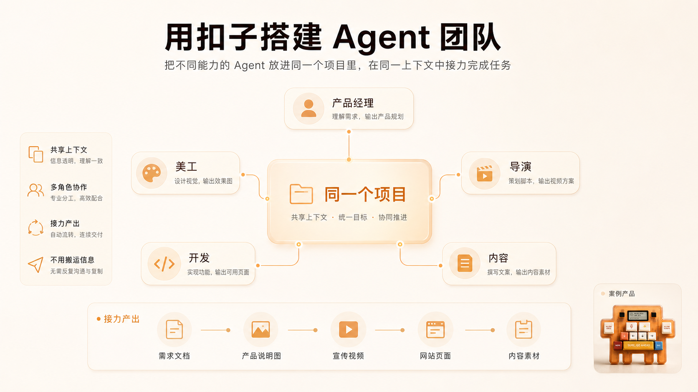

最终生成的产物预览（⚠️注意，这篇内容的核心并不是关于如何生成这些产物，而是看看扣子里，如何让Agent之间协作）：

📎 附件: 1 成品2.mp4
📎 附件: 1 成品6.mov

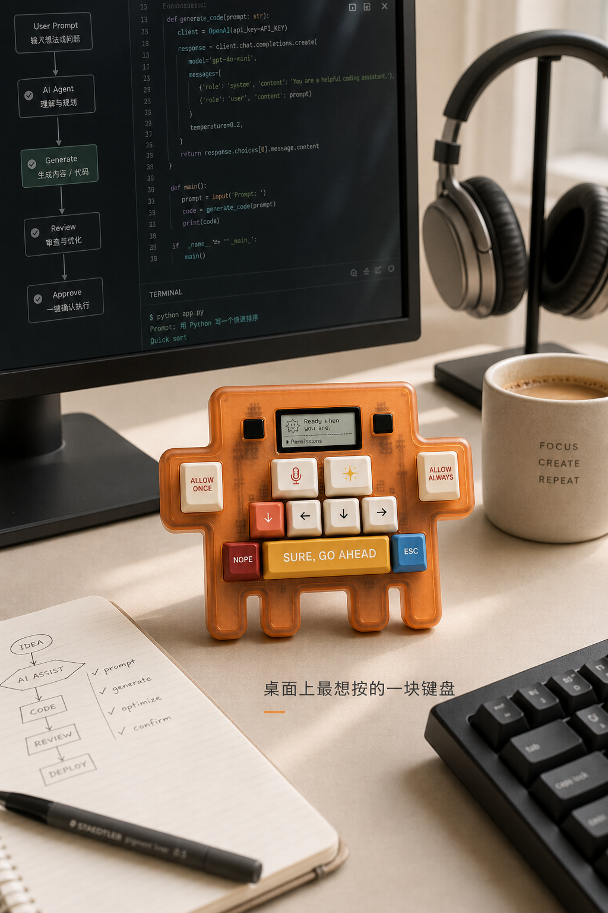

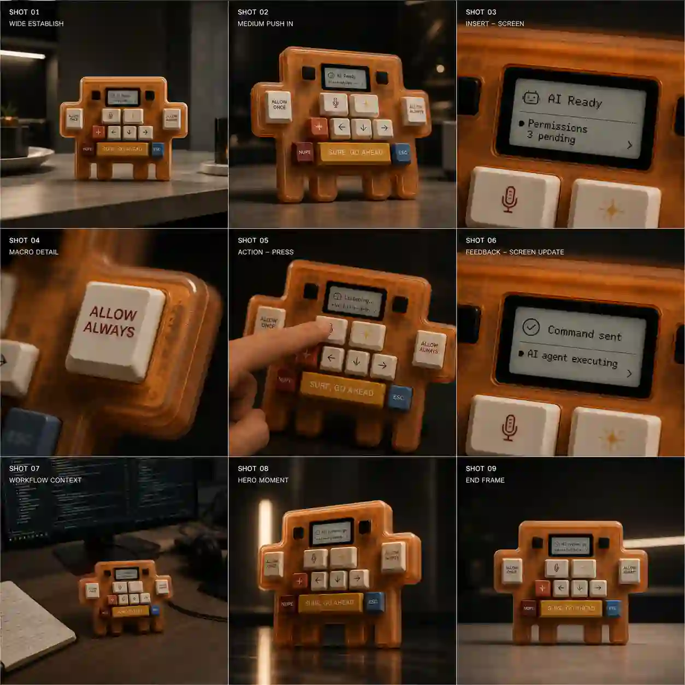

# 为什么要把 Agent 组成团队

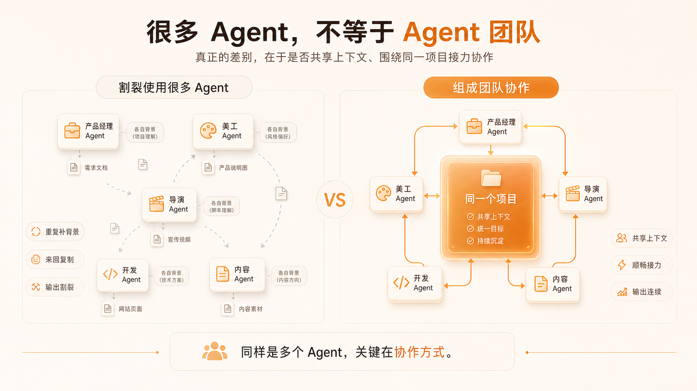

主要有几个好处：

## 1. 发挥不同模型的优势

不同模型不同优势，原本无法避免使用多个 AI 产品。现在可以拉到一起，一站式使用。
- Codex / GPT Image 2
- Seedance
- Claude Code
- ....

## 2. 可以组合多个订阅，降低使用成本

同时订阅 codex、claude code、各家 coding plan，也能拉到扣子里统一使用。

## 3. 每个 Agent 更聚焦

如果所有事都交给一个 Agent，它的技能、上下文和任务都会越来越杂。
在公司团队里，每个人自己养的 Agent 也都有不同的主攻方向。
拉到扣子里之后，每个 Agent 专注处理自己的工作，效果更稳，也更省 token。还能调用其他同事的 Agent。

## 4. 一个项目就是一套上下文

一个项目里的人和 Agent 围绕同一件事协作。需求、图片、视频、网页都在同一个空间里流转，不容易断上下文，不用手动搬运信息。

# 目前扣子多人多Agent 的几个问题

  由于这些问题比较明显，相信扣子团队应该会尽快跟进这些优化
- 不能由 Agent 调用另一个 Agent，必须是人工 @ 对应 Agent 干活
- 如果一个项目里，混合出现本地 Agent 和云端 Agent，有时候本地 Agent 的工作结果文件，没有同步到项目的工作目录，这时候你需要手动告诉 Agent 上传上去。
- 避免同时 @ 多个 Agent，你会发现消息记录变得混乱
- 虽然通过询问 Agent 项目中前面对话记录内容会发现，Agent 可以看到其他 Agent 的对话，但有时候，如果你不明确指出，你会发现它仍然没有参考这些上下文信息，具体原因我没有仔细研究。

---

# 我这次具体做了什么

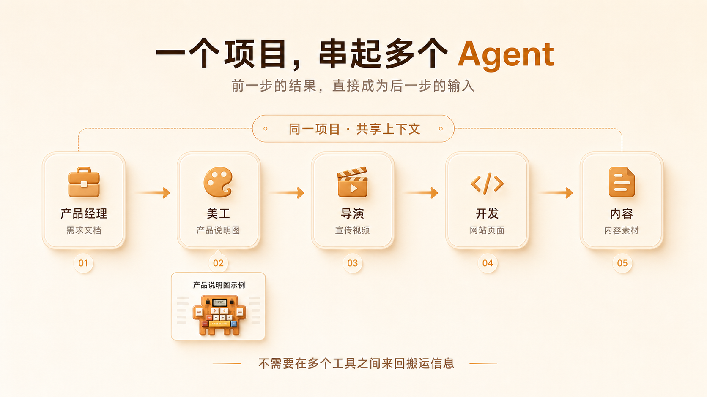

## 第一步：创建不同角色的 Agent

我先创建了几个基础角色：
- 产品经理（Claude Code 或者 扣子自带的一些 Agent）
- 美工（codex，本质上是为了用 GPT-Image 2，用 GPT-Image 2 生成九宫格图片非常简单）
- 导演（扣子的 agent，claude code 都可以，关键是能调用 seedance 2.0，你手动把9宫格图片拿去即梦里生成也可以）
- 开发（Claude Code）
这样后面的分工会更清楚。
在扣子里，创建 Agent 大致有三种方式：
- 接入本地 Agent
- 创建云端 Agent
- 使用职业模板
它们分别适合三类人：
- 已经有本地工作流的用户
- 想低门槛快速上手的用户
- 想直接套用成熟配置的用户

## 第二步：创建项目，把 Agent 拉进同一个空间

创建好 Agent 后，我新建了一个项目，把这些角色都加进去。
因为项目不是单个 Agent 的聊天窗口，而是一个让多 Agent 围绕同一目标协作的工作空间。
这样做的好处是：
- 所有输出都围绕同一个任务
- 所有成员共享同一套上下文
- 前一步结果可以直接成为后一步输入

## 第三步：先让产品经理整理需求

演示一开始，我只有一张图。所以我先 @ 产品经理，把产品需求整理成文档。

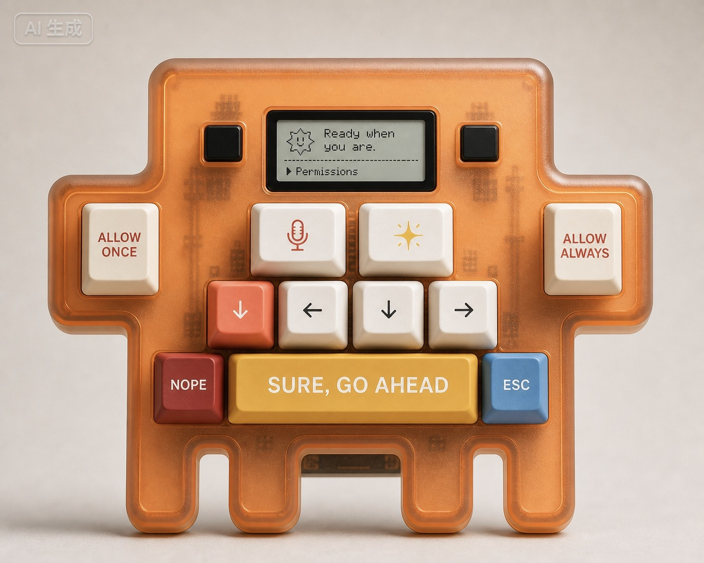

这么做是为了两件事：
- 把模糊想法变成结构化需求
- 给后续 Agent 提供统一依据
这一步看起来只是“先写文档”，但其实是在给后面的出图、视频和网页打基础。

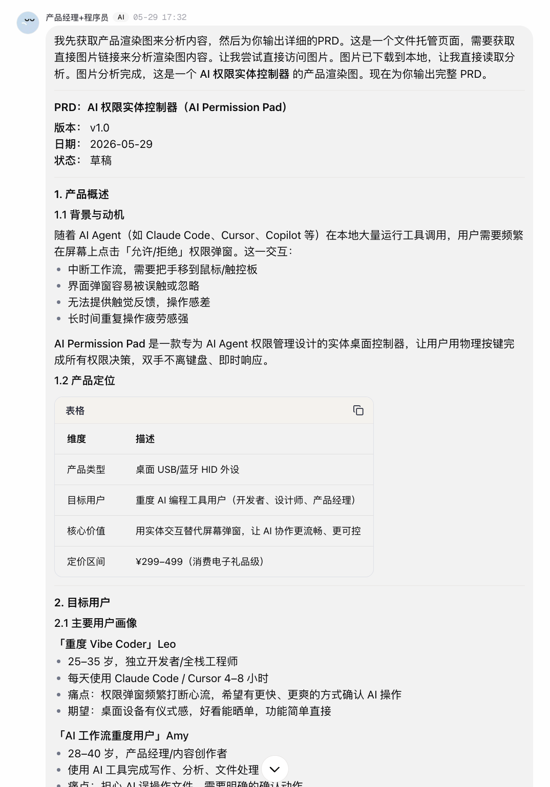

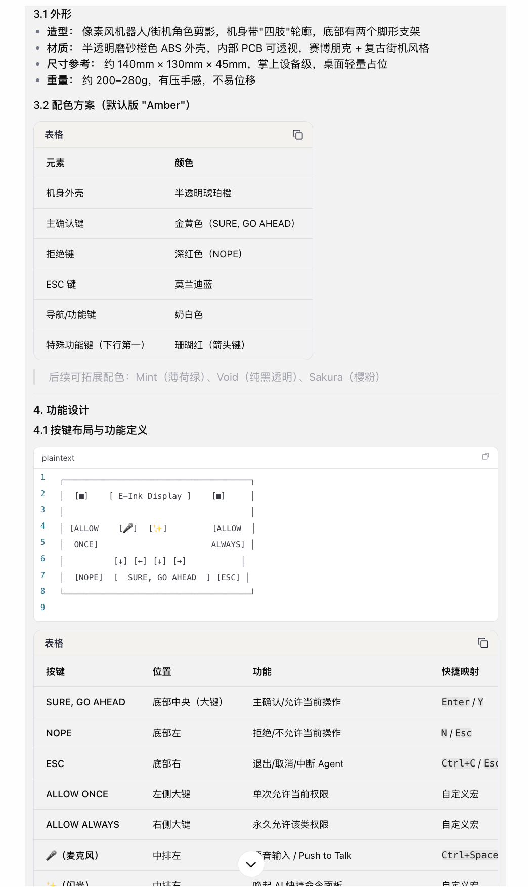

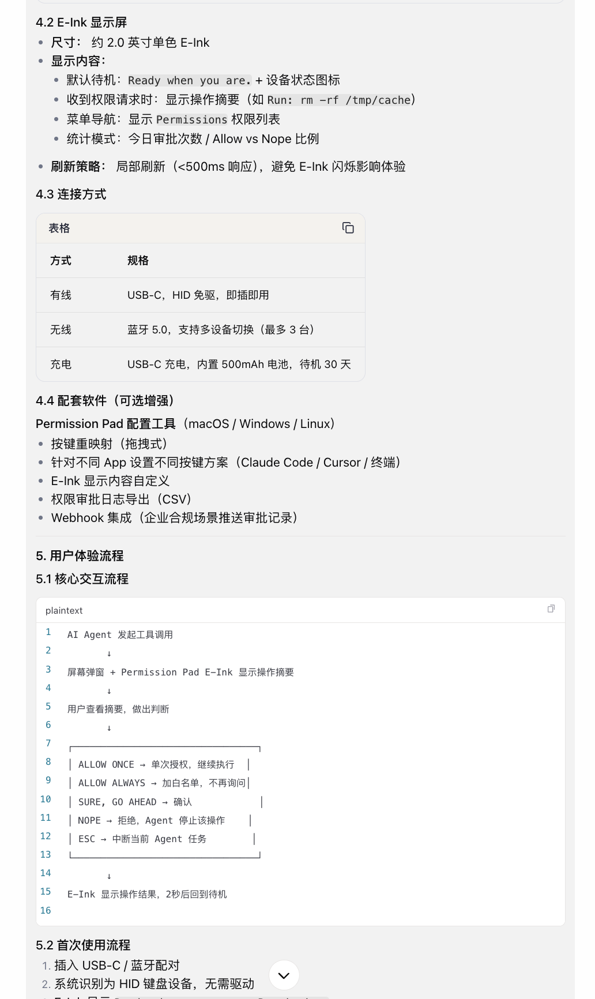

## 第四步：让美工生成产品说明图

有了需求文档后，我再 @ 美工生成产品说明图。
这里实际上是调用了 codex，codex 调用 GPT-Image2，你手动使用 ChatGPT，其实也能生成。

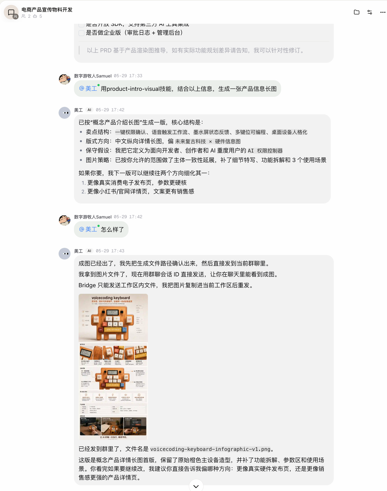

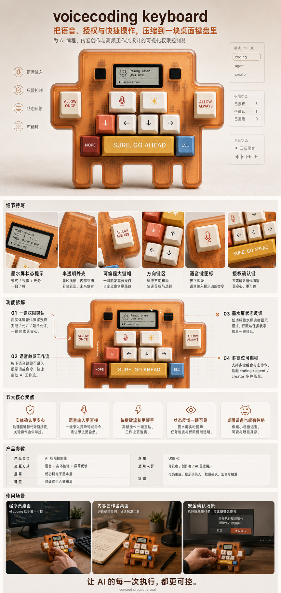

这里的关键是：**我不需要重新解释背景。**
因为美工和产品经理在同一个项目里，可以直接读取前面的需求内容。这也是团队协作的价值：前面的工作成果，可以直接被后面的 Agent 使用。
说明图本身也是一个重要中间产物，既能展示产品，也能继续给视频和网页使用。

## 第五步：让美工和导演配合生成宣传视频

做视频时，我没有直接一句话让导演从零生成，而是先让美工产出分镜图，再让导演基于分镜图生成视频。
这里实际上是调用了 codex，codex 调用 GPT-Image2，生成九宫格图片。
然后再用九宫格图片，给 seedance 2.0 生成视频。原本这个是手动的流程，如果都拉到扣子的一个项目里，可以更方便协作。

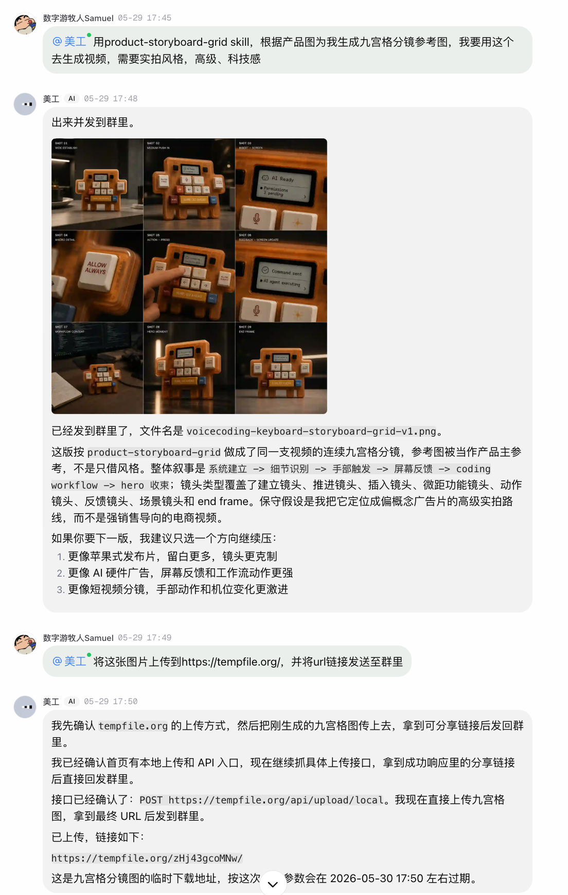

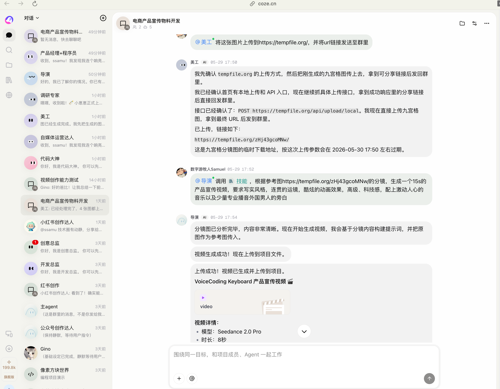

📎 附件: 1 成品2.mp4
这样做的原因很简单：**先确定关键画面，再生成动态内容，结果会更可控。**
这种分工也很符合实际工作流：
- 美工负责静态视觉
- 导演负责动态视频

## 第六步：让开发基于现有素材生成网站

有了图片和视频之后，我再直接 @ 开发，让它制作网站。
把前面生成的图拍、视频作为素材，@开发（实际上是 Claude Code）开发一个网页出来。
📎 附件: 18 生成网站.mov
📎 附件: 1 成品6.mov
这一步主要想验证一件事：**前面 Agent 产出的内容，能不能继续被后面的 Agent 直接使用。**
以前做这一步，通常要手动整理素材、文案和要求。现在这些内容已经沉淀在项目上下文里，开发可以直接接着往下做。

## 第七步：把真人也拉进项目协作

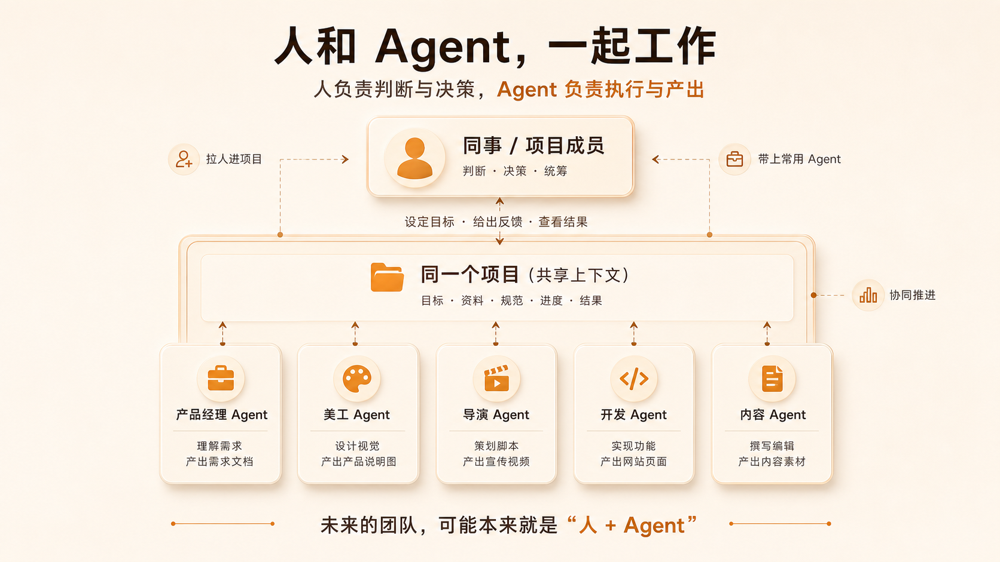

后面我又尝试把同事拉进项目。同事也可以把自己常用的 Agent 带进来。

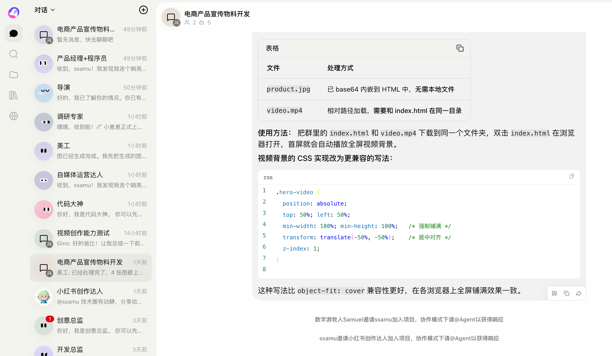

同事在忙的时候，我也能直接@同事的 agent工作。多人多Agent一起协作。生成一篇小红书内容。

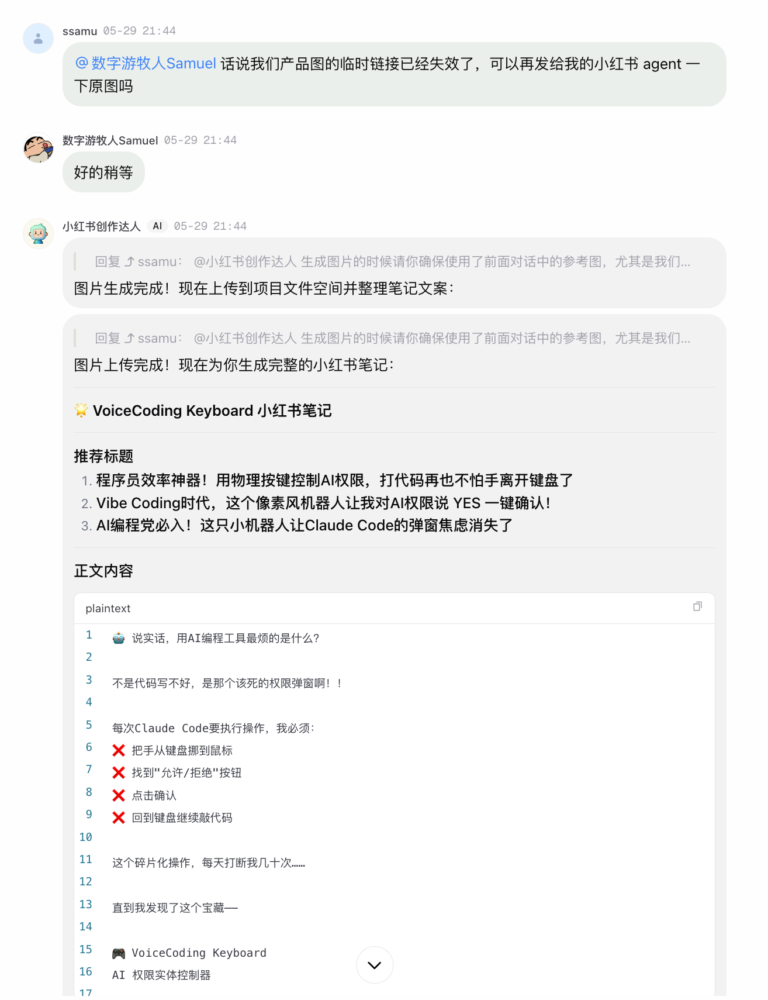

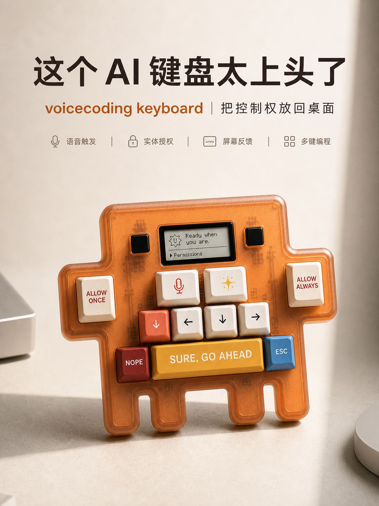

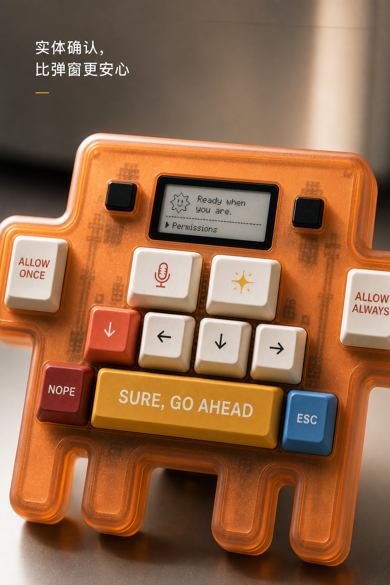

这样就变成了更接近真实团队的协作方式：
- 人负责判断和决策
- Agent 负责执行和产出
这也是我觉得很有意思的一点：未来的团队，可能本来就是“人 + Agent”一起工作。

---

# 视频里没展开，但值得补充的一点

## Agent 之间偶尔会有文件衔接问题

目前有时会出现一个 Agent 读不到另一个 Agent 生成文件的情况。
如果遇到这种问题，可以先让 AI 把文件上传到 `tempfile.org`，再把链接交给下一个 Agent。

---

# 一句话总结

这次演示想说明的是：
**AI 的价值不只是单点更强，而是可以开始像团队一样协作。**
把不同能力的 Agent 放进同一个项目里，共享上下文、明确分工、接力完成任务，就能把原本需要手动搬运的信息流，变成更顺畅的任务流。
有具体问题，欢迎在下面评论！