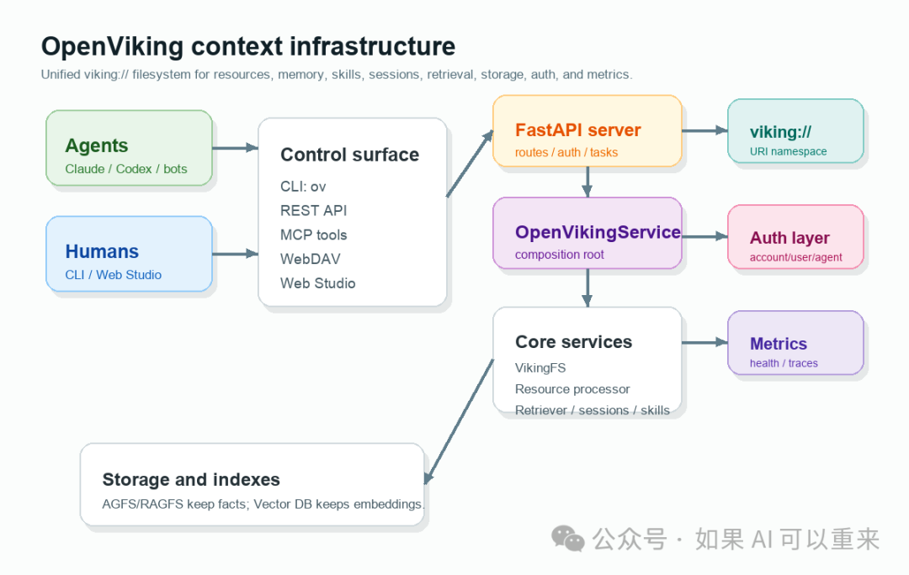
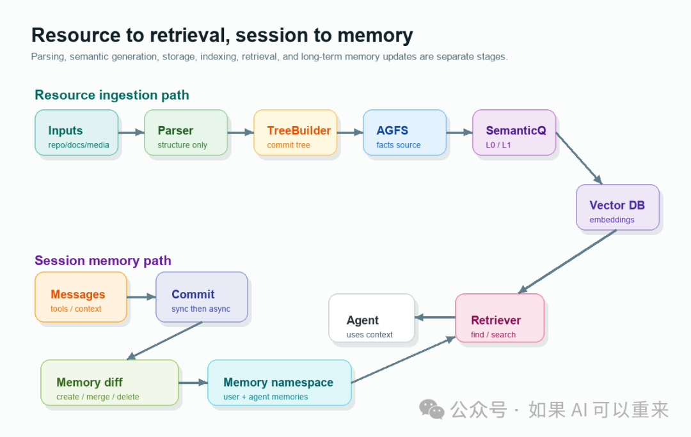

# OpenViking：给 Agent 建一座可检索、可审计、会生长的上下文数据库

一句话读懂

OpenViking 的核心不是“多接一个向量库”，而是把 Resource、Memory、Skill 和 Session 统一成 `viking://` 文件系统，让 Agent 能像操作工程目录一样浏览、检索、写入、归档、复盘和持续更新上下文。

Agent 的瓶颈正在从“模型是否足够聪明”转向“上下文是否足够可靠”。代码库、产品文档、历史会话、用户偏好、工具调用结果、任务经验、技能说明，这些东西都会影响下一步决策。但如果它们分散在向量库、日志、提示词模板、插件目录和临时缓存里，模型每次工作都要重新拼一张上下文地图。

OpenViking 给出的答案，是把这些上下文对象重新组织成可管理的基础设施：有统一 URI，有目录层级，有摘要和概览，有原文，有语义索引，有关键词检索，有会话归档，有多租户身份，也有面向 Agent 的 MCP 工具面。

图 1：根据 OpenViking 源码与文档重构的整体架构图。它的重点不是单个向量库，而是把 Agent、人、CLI、REST、MCP、WebDAV、Web Studio 这些入口统一收敛到 `viking://` 上下文文件系统。

## 1. 先抓住它的三个核心抽象

OpenViking 文档把上下文分成三类：Resource、Memory、Skill。它们不是三个孤立功能，而是同一套文件系统、语义层级和检索能力下的不同命名空间。

| 上下文类型 | 放什么 | 为什么重要 |
| --- | --- | --- |
| Resource | 项目文档、代码仓库、网页、PDF、Office 文件、多媒体资源。 | 让 Agent 能查到外部知识和项目事实，而不是只依赖提示词窗口。 |
| Memory | 用户画像、偏好、实体、事件、Agent 案例、流程模式、工具经验、技能经验。 | 让系统跨会话积累长期记忆，避免每轮任务都从零开始。 |
| Skill | `SKILL.md`、技能描述、允许工具、辅助文件，也可从 MCP Tool 格式转换。 | 让 Agent 不只记事实，还能召回可执行的工作流和操作方法。 |

# viking:// 目录模型

viking://

├── resources/ 项目资料、代码库、网页、文档

├── user/<user\_id>/memories/ 用户长期记忆

├── agent/<agent\_id>/skills/ Agent 可调用技能

├── agent/<agent\_id>/memories/ Agent 经验记忆

└── session/<user\_id>/... 会话消息、工具记录、归档历史

另一个关键抽象是 L0/L1/L2 三层信息：目录下会生成 `.abstract.md` 作为 L0 摘要，`.overview.md` 作为 L1 概览，普通内容文件作为 L2 原文。Agent 可以先读摘要判断相关性，再读概览理解结构，最后只在必要时打开完整内容。

| 层级 | 文件/内容 | 典型用途 |
| --- | --- | --- |
| L0 | `.abstract.md` | 快速判断这个目录或文件是否相关。 |
| L1 | `.overview.md` | 理解结构、关键点、关系和使用场景。 |
| L2 | 原始内容文件 | 需要精确事实、代码细节或完整上下文时读取。 |

## 2. 写入链路：解析和语义生成是分离的

OpenViking 的资源导入不是“收到文件后直接让 LLM 总结”。文档里的上下文提取链路明确分成 Parser、TreeBuilder、SemanticQueue、向量库四段：Parser 做格式转换和结构化，不调用 LLM；TreeBuilder 把临时目录移动到 AGFS；SemanticQueue 再异步自底向上生成 L0/L1；最后进入向量索引。

添加资源的数据流

1. 输入可以是 URL、GitHub 仓库、本地文件、目录、文档或多媒体。

2. Parser 在临时目录里产出结构化文件树，代码仓库解析会遵循 `.gitignore` 并忽略常见非代码目录。

3. TreeBuilder 根据 scope 决定目标根目录，例如 `resources` 映射到 `viking://resources`。

4. SemanticQueue 按叶子目录到父目录的顺序生成 `.overview.md` 和 `.abstract.md`。

5. EmbeddingQueue 将目录、文件、记忆或技能上下文写入向量库，供后续检索。

图 2：根据 `resource\_processor`、`VikingFS`、检索文档和 session 文档重构的生命周期图。上半部分解释资源如何从输入进入 AGFS 和向量索引；下半部分解释会话如何提交、生成 memory diff，并沉淀为后续可检索的长期记忆。

支持格式也比较广：Markdown、文本、PDF、HTML、代码仓库、图片、视频和音频都在提取文档中出现。对代码文件，项目还提供 tree-sitter AST 骨架提取：Python、JavaScript/TypeScript、Rust、Go、Java、C/C++ 有专属 extractor；默认 `ast` 模式下，100 行以上代码会优先抽结构骨架，减少不必要的 LLM 摘要调用。

# 资源导入示例

ov add-resource https://github.com/volcengine/OpenViking --wait

ov add-resource ./docs --parent viking://resources/project-docs --wait

ov add-resource https://example.com/guide.md --to viking://resources/guide.md

## 3. 检索链路：find 低延迟，search 更会规划

OpenViking 的检索不是单次 top-k 向量搜索。文档把它拆成两类入口：`find()` 适合简单查询，不需要会话上下文，也不做意图分析；`search()` 面向复杂任务，会结合会话压缩摘要和最近消息，用 IntentAnalyzer 生成 0 到 5 个 TypedQuery。

| 入口 | 特点 | 适合场景 |
| --- | --- | --- |
| `find()` | 单一查询、低延迟、不使用 LLM 意图分析。 | 找文档、找代码、快速问答。 |
| `search()` | 结合会话上下文，生成 typed queries，可同时查 resource、memory、skill。 | 复杂任务规划、需要同时召回资料和经验的场景。 |

HierarchicalRetriever 的核心步骤

1. 根据 context\_type 选择根目录：Memory 查 `user/agent memories`，Resource 查 `resources`，Skill 查 `agent skills`。

2. 先做全局向量搜索，定位可能相关的起始目录。

3. 合并起始点，并用 rerank 或向量分数评估候选。

4. 使用优先队列做目录递归搜索，目录节点继续展开，L2 文件作为终点。

5. 输出 MatchedContext：URI、类型、是否叶子节点、L0 摘要、分数和关联上下文。

这个设计的关键，是把“路径结构”纳入检索。普通向量搜索只知道片段相似，目录递归检索则能先锁定高分目录，再在目录内部细查子节点。对于代码库、文档树和长期记忆树，这种层级结构往往比扁平切片更接近人类实际查资料的方式。

# 检索示例

ov find "OAuth 配置" --uri viking://resources/

ov search "帮我设计 MCP OAuth 接入方案" -L 1,2

ov grep "openviking" --uri viking://resources/volcengine/OpenViking/docs/zh

ov glob "\*\*/\*.md" --uri viking://resources

## 4. 存储层：内容和索引分开

OpenViking 采用双层存储：AGFS/RAGFS 保存真实内容，向量库只保存 URI、向量、摘要和元数据。VikingFS 位于两者之上，负责把 `viking://` URI 映射到底层路径，并维护 L0/L1 读取、关系、语义搜索和向量同步。

| 层 | 职责 | 可见能力 |
| --- | --- | --- |
| VikingFS | 统一 URI 抽象层。 | `read/write/mkdir/rm/mv/abstract/overview/find/relations`。 |
| AGFS/RAGFS | 内容存储。 | L0/L1/L2 文件、多媒体、关系文件、会话归档。 |
| VectorDB | 语义索引。 | 密集向量、稀疏向量、URI、父目录、context\_type、active\_count。 |
| QueueFS | 异步任务队列。 | 语义生成、embedding、任务恢复、状态追踪。 |

源码中的向量后端工厂包含 `local`、`http`、`opengauss`、`qdrant`、`volcengine`、`vikingdb` 等 adapter；AGFS 文档描述了本地文件系统、S3 兼容存储和内存存储。删除或移动目录时，VikingFS 会同步删除或更新向量库中的 URI，减少“内容还在、索引过期”或“索引还在、内容已删”的错位。

这个设计的实际含义

向量库不是事实源，只是检索索引；事实源在 AGFS/RAGFS。对生产系统来说，这会让备份、迁移、权限、加密和一致性更容易讲清楚，也降低向量库供应商切换时的锁定风险。

## 5. 会话记忆：不是简单保存聊天记录

Session 是 OpenViking 里最能体现“上下文会生长”的部分。一次会话不只是 messages.jsonl；它还包含工具执行记录、上下文使用记录、归档历史、摘要、记忆变更 diff，以及后续可检索的长期记忆。

session.commit() 的两阶段流程

**Phase 1 同步：**递增 compression\_index，写入归档 messages.jsonl，清空当前消息，快速返回 task\_id。

**Phase 2 异步：**生成 `.abstract.md` 和 `.overview.md`，提取长期记忆，写入 `memory\_diff.json`，更新 active\_count，并用 `.done` 或 `.failed.json` 标记结果。

| 记忆分类 | 归属 | 说明 |
| --- | --- | --- |
| profile / preferences / entities / events | user | 用户身份、偏好、重要实体和事件决策。 |
| cases / patterns / tools / skills | agent | 问题解决案例、复用流程、工具经验和技能执行策略。 |

记忆提取不是“全文总结后覆盖旧文件”。文档里的流程是：LLM 从消息中提取候选记忆，再做向量预过滤找到相似记忆，随后由 LLM 判断 skip、create、merge、delete，最后写入 AGFS 并向量化。每次提交生成的 `memory\_diff.json` 记录 adds、updates、deletes，便于审计和回溯。

## 6. 工程结构：仓库里各部分分别承担什么

从仓库结构看，OpenViking 已经不是一个单纯 Python SDK，而是 Python 服务端、Rust CLI/文件系统、C++ 检索引擎、Web 前端、Agent 插件和评测脚本的组合工程。

| 目录/组件 | 主要作用 |
| --- | --- |
| `openviking/` | Python 核心：服务编排、VikingFS、资源处理、检索、会话、模型、隐私、加密、可观测性。 |
| `openviking/server/` | FastAPI 服务端，包含 resources、filesystem、sessions、search、tasks、admin、metrics、WebDAV、MCP、OAuth 等路由。 |
| `crates/` | Rust workspace：`ov\_cli`、`ragfs`、`ragfs-python`。CLI 和文件系统底座都在这里。 |
| `src/` | C++ 存储和索引实现，包括向量召回、稀疏检索、标量过滤、bitmap、持久化/易失存储。 |
| `openviking\_cli/` | Python 侧配置、HTTP client、server bootstrap、doctor、setup wizard 等命令辅助层。 |
| `web-studio/` | React/Vite Web Studio，用于连接管理、资源浏览、Playground、Terminal、Agent 面板等体验。 |
| `examples/`、`bot/`、`benchmark/` | Claude Code、Codex、OpenCode、OpenClaw 等集成示例，VikingBot，以及 LOCOMO、Tau-2、RAG 等评测相关脚本。 |

`pyproject.toml` 暴露了四个主要命令：`ov` 和 `openviking` 指向 Rust CLI 包装入口，`openviking-server` 启动 HTTP 服务，`vikingbot` 启动 Bot CLI。服务端入口会读取 `ov.conf`，做 Ollama 预检查，支持 `--host`、`--port`、`--workers`、`--config`、`--with-bot` 等参数，然后用 Uvicorn 运行 FastAPI app。

## 7. 控制面：CLI、REST、MCP、WebDAV、Studio 都有

OpenViking 很重视“让人和 Agent 都能操作上下文”。同一套能力通过不同入口暴露：开发者可以用 Python SDK 或 CLI，后端可以用 REST，Agent 可以走 MCP，文件类工具可以走 WebDAV，人工调试可以进 Web Studio。

| 入口 | 覆盖能力 |
| --- | --- |
| CLI `ov` | 资源导入、`ls/tree/read/abstract/overview/write/find/search/grep/glob`、session、privacy、relations、pack、admin、system、watch。 |
| REST API | `/api/v1/resources`、`/api/v1/fs/\*`、`/api/v1/sessions/\*`、`/api/v1/search/\*`、`/api/v1/admin/\*`、`/api/v1/tasks`。 |
| MCP `/mcp` | 源码端点日志显示 13 个工具：find、search、read、list、remember、add\_resource、grep、glob、code\_outline、code\_search、code\_expand、forget、health。 |
| WebDAV | `/webdav/resources` 支持 OPTIONS、PROPFIND、GET/HEAD、PUT、DELETE、MKCOL、MOVE；Phase 1 只暴露资源文件，派生语义文件保持内部可见。 |
| Web Studio | 连接配置、API Key、资源浏览、调试面板、Playground、OAuth 设置等人机界面。 |

# 首次运行主线

pip install openviking --upgrade --force-reinstall

npm i -g @openviking/cli

openviking-server init

openviking-server doctor

openviking-server

ov status

## 8. 生产边界：认证、加密、监控和部署不能忽略

OpenViking 的 README 给了很快的上手路径，但生产使用时，真正要看的其实是配置、认证、OAuth、加密、指标和部署文档。

| 能力 | 仓库中的实现/文档信号 |
| --- | --- |
| 认证 | 支持 `api\_key`、`trusted`、`dev` 三种模式；Root Key 全局管理，User Key 按 account 访问；`dev` 仅允许 localhost。 |
| 多租户 | 请求上下文包含 account、user、agent，URI 会展开到租户隔离路径；Admin API 管 account/user/role/key。 |
| OAuth | 服务端原生 OAuth 2.1，面向只接受 OAuth 的 MCP 客户端；非 localhost issuer 要求 HTTPS。 |
| 加密 | 配置里有 envelope encryption、AES-256-GCM、local、vault、volcengine\_kms provider，以及 API Key hashing 选项。 |
| 可观测性 | `/metrics` 导出 Prometheus 文本；`/api/v1/observer/\*` 和 `/api/v1/stats/\*` 面向人工状态和业务统计。 |
| 一致性 | 事务锁、redo recovery、派生语义文件 coalesce、向量 URI 同步、reindex 和 consistency 检查共同维护状态。 |

安全注意点

文档明确提示：默认 host 是 `127.0.0.1`；如果要暴露到网络，必须配置 `root\_api\_key`。OAuth 2.1 和 MCP SDK 对非 localhost 的 issuer 强制要求 HTTPS。`trusted` 模式只适合放在受信网关或内网边界之后。

## 9. README 中的评测数字怎么读

README\_CN 给了三类评测：User Memory、Agent Memory、Knowledge Base QA。下面的数字来自项目 README，本地未复现实验，因此更适合作为项目方价值主张和方向信号，而不是独立基准结论。

| 场景 | README 结果 | 它想证明什么 |
| --- | --- | --- |
| LOCOMO 用户记忆 | OpenClaw + OpenViking 82.08%；Hermes + OpenViking 82.86%；Claude Code + OpenViking 80.32%。 | 长期对话记忆问答中，外接记忆系统能提升准确率并控制 token。 |
| Agent 经验记忆 | Tau-2 retail 从 70.94% 到 77.81%；airline 从 54.38% 到 66.25%。 | trajectory 和 experience 记忆能帮助 Agent 复用过去的任务经验。 |
| HotpotQA 多跳 QA | OpenViking top20：91.00% Accuracy，每 QA 12,533 tokens，0.23s。 | 项目方强调准确率、延迟和 token 成本之间的平衡。 |

对选型来说，更重要的是按自己的业务复现：记忆系统是否有效，取决于会话形态、记忆 schema、embedding 模型、rerank 配置、数据质量、权限边界和任务分布。

## 10. v0.3.23 透露的项目方向

GitHub Releases 当前显示 Latest 为 v0.3.23，发布日期是 2026-06-03；本次源码状态为 main 分支 commit `f627a09662cee5a5494eea99853b355c09b659c4`，提交时间是 2026-06-04T21:36:52+08:00。从 README、文档和源码目录看，近期方向集中在五件事上：

**第一，降低 Agent 接入成本。**CLI、MCP、WebDAV、Web Studio 和插件示例同时推进。

**第二，强化会话和经验记忆。**Session commit、memory\_diff、agent experience、tool/skill memory 都在变成核心路径。

**第三，补生产化边界。**认证、多租户、OAuth、加密、metrics、public access 和 deployment 文档都很密。

**第四，优化代码库导入成本。**tree-sitter AST 骨架、语义队列、异步 L0/L1、向量同步都在服务大规模上下文。

**第五，扩展生态集成。**示例目录覆盖 Claude Code、Codex、OpenCode、OpenClaw、LangChain/LangGraph、K8s Helm、Grafana 等路径。

## 11. 适合谁，不适合谁

| 适合 | 不太适合 |
| --- | --- |
| 长期运行的 coding agent、研究 agent、企业知识库 agent。 | 只需要单轮问答或一次性 RAG demo 的项目。 |
| 需要让 Agent 自己浏览、检索、写入和复盘上下文的系统。 | 完全由后端固定拼 prompt，不希望模型接触工具面的系统。 |
| 能接受服务端、模型、存储、权限、监控一起治理的团队。 | 希望零配置、零运维、纯前端接入的轻量场景。 |

## 12. 主要限制和选型风险

**项目仍处早期。**`pyproject.toml` 标注 Development Status 为 Alpha，接口、配置和插件语义可能继续快速变化。

**部署复杂度高于普通 RAG。**需要考虑 Python、Rust/C++ 构建、模型服务、向量后端、AGFS 后端、任务队列、进程锁和 reindex。

**模型成本是核心变量。**Embedding、VLM、rerank、query planner 的 provider、维度、并发、限流和费用都会影响最终体验。

**许可证要仔细评估。**主项目是 AGPLv3，`crates/ov\_cli` 和 `examples` 为 Apache 2.0，商业集成前需要确认合规边界。

**评测需要业务内复现。**README 数字提供方向，但不能替代真实数据、真实任务和真实成本约束下的验证。

## 最后：它真正有价值的地方

OpenViking 值得关注，不是因为它发明了“记忆”这个词，而是因为它把 Agent 上下文管理拆成了一套完整工程：命名空间、文件系统、三层信息、语义队列、层级检索、会话归档、记忆 diff、权限、OAuth、监控、CLI 和 MCP 工具面。

这条路比普通 RAG 更重，但也更接近长期 Agent 的真实需求。长期 Agent 不只要“回答得像”，还要知道自己读过什么、用过什么、记住了什么、哪些经验可复用、哪些上下文该浅读，哪些必须深读。

一句话收束

OpenViking 的价值，是把 Agent 的上下文从“提示词窗口里的临时材料”，升级成“可被读写、检索、观察、授权、归档和持续演化的系统资产”。

## 资料来源

GitHub 仓库：https://github.com/volcengine/OpenViking

README\_CN：https://github.com/volcengine/OpenViking/blob/main/README\_CN.md

架构概述：https://github.com/volcengine/OpenViking/blob/main/docs/zh/concepts/01-architecture.md
