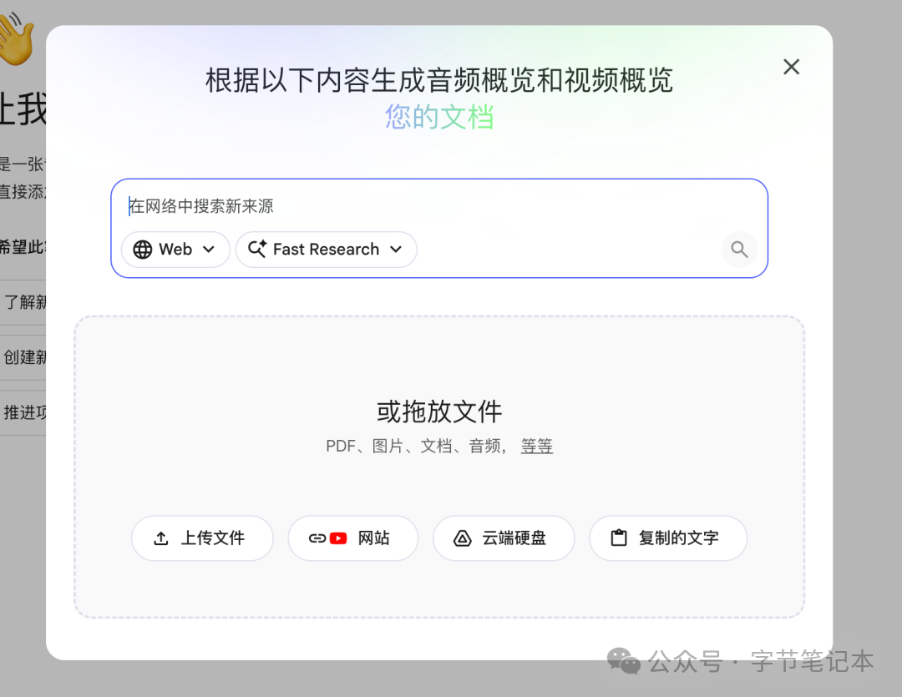
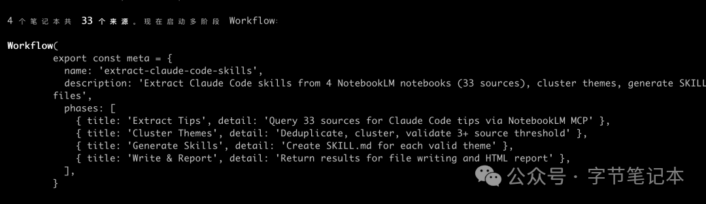
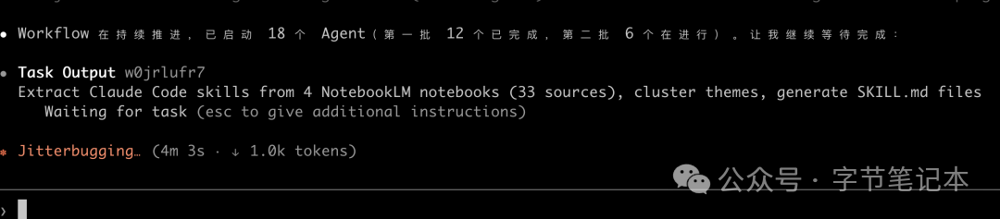
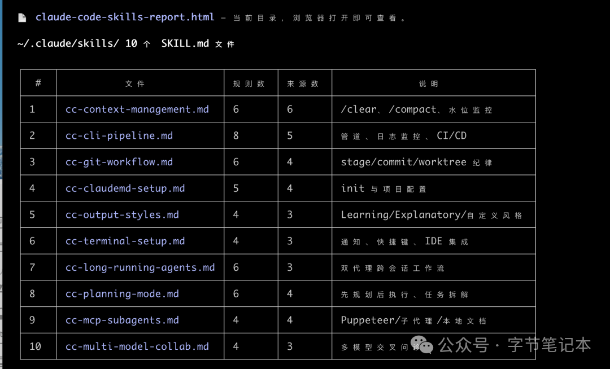
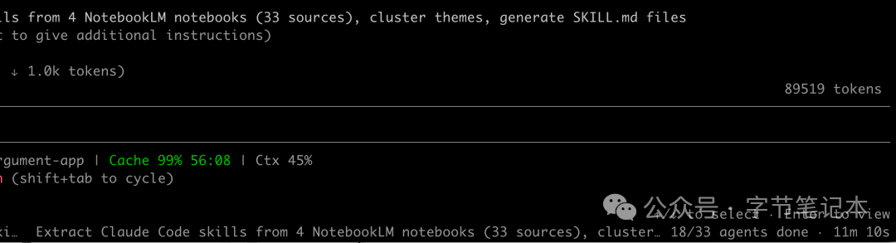
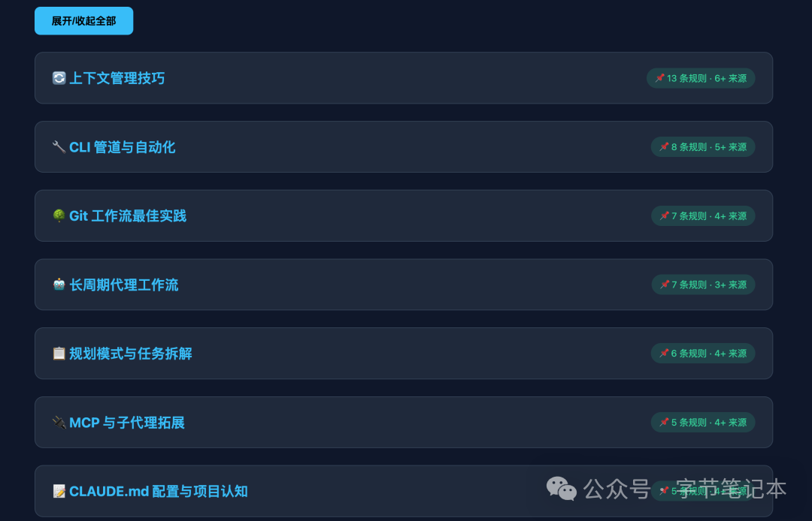

之前发布过「[比Skills更高维度！Dynamic Workflows 的高级应用场景案例]」观点非常的简单：Dynamic Workflows 是更高维度的 Skills，不要把它仅仅只是用于编程，其实所有的工作流都可以用它来重写一遍。

比如最近我的一个需求就是想把订阅了十几个 AI 工程实践的 YouTube 频道，三个月下来看了几十个小时的视频压缩成可被调用的知识库。

这里面有非常多的关于 Claude Code 配置的、关于 Agent 架构的相关内容，看的时候觉得有收获，看完后什么都没留下，没有变成任何可以复用的东西。

昨天借助 Workflows 把这些视频里提到的具体技巧，整理成 Claude Code 的 Skill，在提取和压缩之后，还可以拿来即用，这样下次遇到相关任务，直接触发。

如果换成是手动整理，这三十来个视频，每看一遍，还要记笔记、提炼规则、写 Skills 格式，估计也得两周了。

而用 Dynamic Workflows 把这件事自动做完了，整个过程只需要输入一条 prompt。

---

## 1. 为什么不直接把文字稿塞给 Claude

一集大约 30 分钟的技术视频，文字稿大约 15,000 token。30 集就是 450,000 token，直接超出单次上下文限制。

退一步，就算分批处理，Claude 在面对大量原始文字稿时，总会在综合阶段补一些视频里其实没说过的东西，你没法判断哪条规则是真实提炼出来的，哪条是模型自己发挥的。

这部分用 **NotebookLM** 能解决。

NotebookLM 从你上传的内容里找答案，不会凭空生成，每条输出都附有来源引用。

更重要的是，它是直接接入到谷歌的生态当中，YouTube 视频 URL 作为 source 可以自动提取字幕，不需要手动下载文字稿。

**只需要一句话的提示词，NotebookLM 负责有据可查的提取，Claude Code Workflow 负责大规模并行执行。**

---

## 2. 三步跑起来

**第一步，建 NotebookLM 视频库**



打开 NotebookLM，新建一个笔记本，把想处理的视频 URL 逐条粘进去。建议控制在 30 个以内，超过这个数量综合质量会下降。等 NotebookLM 处理完毕，每个视频大约需要 1 到 2 分钟。

**第二步：连接 MCP**

```bash
# 安装
uv tool install notebooklm-mcp-cli

# 登录 Google（需完全关闭 Chrome）
nlm login

# 注册到 Claude Code
claude mcp add notebooklm -- notebooklm-mcp
```

在 Claude Code 里验证：`list my notebooklm notebooks`，看到笔记本名称出现即可。

**第三步，输入 prompt，跑 Workflow**

```
使用 workflow 处理我的 NotebookLM 笔记本"AI 工程实践视频库"。

阶段一：
对每个 source 起一个子 Agent，向 NotebookLM 提问：
"这个视频里提到了哪些具体的 Claude Code 技巧、配置方法
或可复用的工作流程？列出每一条，附原话引用。"
输出 JSON：{ source_title, tips[], quotes[] }

阶段二：
汇总所有 JSON，去重聚类，找出可归纳为独立 skill 的主题，
至少 3 个视频提及才算有效。

阶段三：
对每个有效主题起子 Agent，深度提取细节，
生成完整 SKILL.md 文件，每条规则必须包含可执行示例。

阶段四：
将所有 skill 文件写入 ~/.claude/skills/，
生成 HTML 报告，每个 skill 附来源视频数量和规则摘要。
```

---

## 3. Workflow 在跑什么

这条 prompt 会触发 Dynamic Workflows，Claude 自动生成一段 JavaScript 程序来调度子 Agent。

**实时进度：**



```
  阶段一  [并行运行中]
  ├─ Claude Code hooks 详解 ............. 完成
  ├─ Anthropic 官方 skills 教程 ......... 完成
  ├─ MCP 实战案例 ....................... 运行中
  └─ ... (共 28 个)

阶段二  [等待阶段一完成]
阶段三  [等待阶段二完成]
阶段四  [等待阶段三完成]
```



每个阶段一的子 Agent 持有独立上下文，只处理一个视频，不会互相污染。

---

## 4. 跑完之后

`~/.claude/skills/` 目录下会新增类似这些文件：



```
claude-md-configuration.md    # 来自 7 个视频
hooks-workflow.md              # 来自 5 个视频
token-optimization.md          # 来自 9 个视频
subagent-patterns.md           # 来自 6 个视频
mcp-integration.md             # 来自 4 个视频
```

每个 skill 文件里，都是从视频原话里提炼出来的，引用可以追溯到具体的 source，这一点是直接用 Claude 处理文字稿做不到的。



HTML 报告里，每个 skill 卡片点开能看到它从哪几个视频里来，说的是什么原话。



这份报告本身就可以留存作为 skill 库的文档。

---

## 5. 知识库的绝配

整个过程跑下来，你会发现它就是现在目前知识库最好的搭配。

子 Agent 发给 NotebookLM 的是精准问题，NotebookLM 只返回相关段落，而不是把 28 个视频的完整文字稿都推进 Claude 的上下文。精准提问换来的是两到三个段落的回答，而不是 15,000 token 的原始文字稿。

NotebookLM 作为不需要搭建的 RAG 后端，提供了强大的检索和压缩能力。

三个月的视频，变成了五个可以立刻用起来的 skill 文件，Claude Code 或者是 Codex 通过 Skills 获得了最新、最精准的上下文指导。

下次再遇到类似 MCP 配置问题，`mcp-integration` 这个 skill 会自动触发，带着从视频里提炼出来的具体步骤。

不需要回忆，不需要重新翻视频，知识从看过变成了用得上，而这中间步骤，现在让 workflows 一句话来完成。
