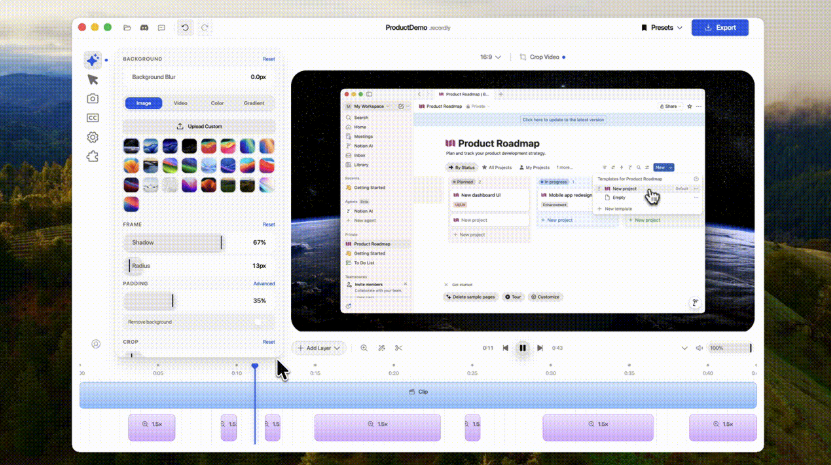
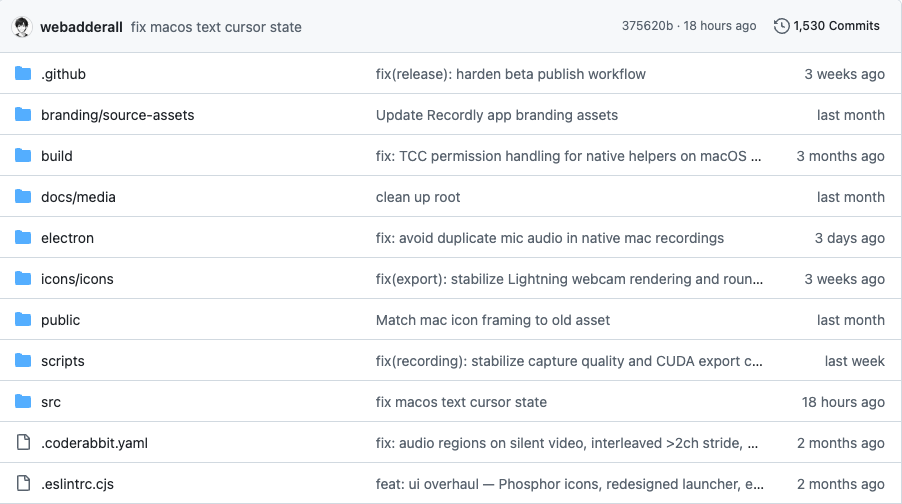

# Recordly：这个开源录屏工具，有点像 ScreenStudio 的平替路子

录屏工具嘛，十个有九个都说自己能录、能剪、能导出。真正麻烦的地方从来不是"录下来"，而是录完之后那一堆破事：鼠标太飘、画面太素、缩放要一帧帧补，最后还得丢进另一个剪辑软件里收尾。

Recordly 抓的就是这个缝。

它不是单纯做一个屏幕录像机，而是录完直接进编辑器，把产品演示视频最常见的几个脏活塞到一条链路里：自动缩放建议、光标优化、背景样式、圆角、阴影、渐变这些东西都在里面。README 里也写得很直白，它面向 walkthrough、demo、product video 这类场景，不是让你剪大片。

这就很现实。

老鬼以前做 Demo 最烦的就是这个：录屏五分钟，后期半小时。你要给按钮点一下加个聚焦，要让页面别像裸奔截图，还要兼顾导出尺寸。Recordly 的自动缩放建议是根据光标活动来的，不是玄学 AI 生成大片，反而更对味——产品演示里，用户视线本来就跟着鼠标走。

还有摄像头悬浮气泡。这个别小看。

很多教程视频不是非得露脸，但讲解类内容有个小头像浮在角落，确实更像"人在带你走"。Recordly 支持把摄像头画面做成 bubble，位置、圆角、阴影都能调，还能跟随缩放自动调整大小。这个细节如果自己在剪辑软件里做，不难，但烦。烦就够了。

不过先别急着吹。

开源录屏工具最大的问题，一般不在功能截图，而在稳定性。macOS、Windows、Linux 三个平台都支持听起来很香，但不同系统的录屏后端、系统音频、权限弹窗、光标隐藏，坑都不一样。Recordly 的 README 里也提到，Linux 目前不支持隐藏光标；macOS 和 Windows 用的是各自的原生捕获能力。

这块真要自己试。

时间轴这边，它支持拖拽裁剪、变速区域、标注、额外音轨，还能保存成 `.recordly` 工程文件以后继续改。对经常录产品更新、插件教程、SaaS walkthrough 的人来说，这比"只能导出一个视频文件"顺手多了。

导出 MP4 和 GIF，也够用。

老鬼觉得 Recordly 最适合的不是专业剪辑师，而是开发者、产品经理、独立开发者、做工具号的人。你不想每次为了一个 40 秒功能演示打开一套剪辑工程，也不想花钱上 ScreenStudio，那这个可以先收藏。

GitHub地址：webadderallorg/Recordly
