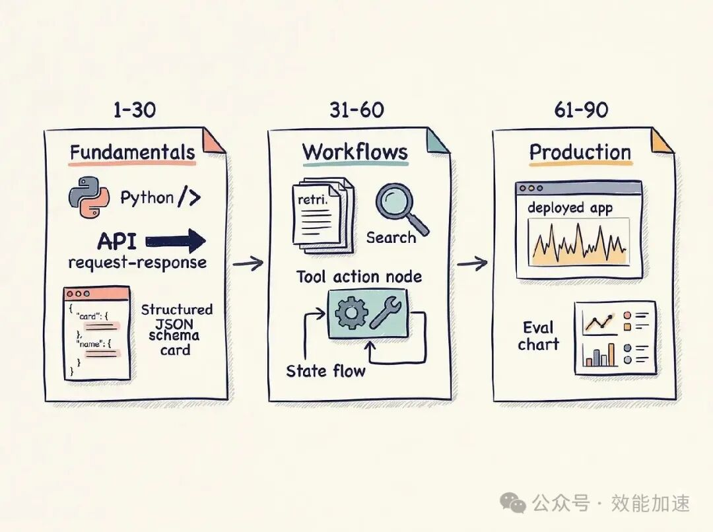

# AI 工程师进阶指南：4个阶段+5个项目+90天路线图

核心摘要

• AI 工程师不是从训练大模型模型开始，而是从构建可靠 LLM 系统开始。

• 路线分四层：软件工程基础、LLM 应用基本功、系统层、生产化。

• 进步标准不是学了多少课，而是能否交付、评估、部署并解释系统如何失败。

如果你想在 2026 年成为 AI 工程师，我建议先放下三个执念：

从零训练一个模型。

把所有向量数据库都比一遍。

一上来就学复杂 Agent 框架。

这些东西不是没价值，但不是最好的起点。

AI 工程师的核心工作，已经不是“研究模型本身”，而是把大模型接进真实软件系统里，让它稳定、可控、可评估地解决问题。

我会把这条路拆成一句话：

> 先会做可靠软件，再学会把 LLM 放进软件，最后学会评估、部署和运营它。

## 先理解岗位：AI 工程师是 LLM 系统构建者

2026 年的 AI 工程师，更多时候不是训练 Transformer 的研究员。

更常见的工作是：

- 调用模型 API；
- 让模型输出稳定 JSON；
- 把模型接到数据库、搜索、工具和业务系统；
- 构建 RAG、工具调用和工作流；
- 处理超时、重试、限流、成本和延迟；
- 评估输出质量；
- 调试生产事故。

这更像后端工程、产品工程和 LLM 应用工程的结合。

所以学习路径不能只围绕“模型原理”设计。模型原理要懂，但第一年更重要的是工程交付。

## 第一阶段：先把普通软件做顺

我会先练 Python、HTTP、JSON、API、异步调用、日志、错误处理和环境变量管理。

这一步很基础，但很多人跳过了。

结果就是：模型还没开始生成 token，系统已经卡在超时、CORS、API key 泄露、请求阻塞、日志缺失上。

第一阶段的目标不是写复杂 AI 应用，而是做到：

- 能写一个 FastAPI 服务；
- 能安全读取环境变量；
- 能调用外部 API；
- 能处理 timeout、rate limit 和异常；
- 能把响应解析成结构化数据；
- 能部署一个小功能而不是只在 Notebook 里跑。

完成标准很简单：你能在几个小时内做出一个小型 Web API，而不是在环境配置上卡两天。

## 第二阶段：掌握 LLM 应用基本功

LLM 应用的基本功，不是写花哨 prompt。

我会先学四件事：

- system message 和 user message 的边界；
- 结构化输出；
- tool calling；
- context window 和 token 成本。

其中最重要的是结构化输出。

在真实业务里，模型输出一段漂亮文字通常不够。系统更需要的是：

- 工单分类；
- 发票字段；
- 合同条款；
- 客户意图；
- 风险标签；
- 可写入数据库的 JSON。

如果模型偶尔把整数输出成“100 美元”，或者少返回一个字段，后面的系统就会出错。

所以你要学会定义 schema、验证结果、失败重试、记录错误。

这一阶段完成的标准是：让模型稳定输出一个合法 JSON，对你来说不再像变魔术。

## 第三阶段：进入系统层

会调用模型之后，下一步是做系统。

我会重点学：

- RAG；
- chunking；
- embedding 和向量检索；
- 工作流；
- 状态机；
- guardrails；
- observability；
- eval harness。

这里最容易踩的坑是：以为 RAG 就是“切块 + 向量库 + 调模型”。

真正难的是检索质量。

如果检索阶段拿到的是垃圾上下文，模型会把垃圾总结得很漂亮。你要能回答这些问题：

- 为什么没检索到正确段落？
- chunk 是否破坏了语义？
- 召回结果是否需要重排？
- 答案是否引用了来源？
- 如何衡量 RAG 质量变好了？

Agent 也是同理。

一个能循环调用工具的程序，不一定是可靠 Agent。你需要明确状态、停止条件、工具失败后的处理方式，以及什么时候必须让人审批。

这一阶段完成的标准是：你不仅能做出系统，还能解释它会怎么失败，以及用什么指标衡量失败。

## 第四阶段：学会生产化

生产化会把很多 demo 打回原形。

你需要学：

- 部署；
- 队列和后台任务；
- API trace；
- 成本监控；
- 延迟优化；
- 重试和幂等；
- fallback；
- 用户体验；
- 事故排查。

一个 AI 功能如果要连续调用四次模型，耗时 15 秒，用户可能已经关掉页面。

一个 Agent 如果没有最大循环次数，可能会烧掉一堆 API 额度。

一个总结工具如果没有 trace，你根本不知道是哪一步 prompt 变差了。

生产化的目标不是“能跑”，而是别人可以稳定使用。

完成标准是：你能部署一个真实项目，能监控它，能解释它的质量、延迟、成本和故障模式。

## 做五个项目

不要做二十个聊天机器人。

做五个能逼你学到关键能力的项目。

第一个：结构化输出提取器。

用来处理发票、工单、合同、简历都可以。重点是 schema、校验、重试和错误处理。

第二个：RAG 助手。

用公司文档、个人笔记或产品手册做数据集。重点是 chunking、召回、引用来源和答案评估。

第三个：工具调用工作流。

让模型能查数据库、更新工单、调用 API 或搜索网页。重点是工具边界、状态转移和失败处理。

第四个：带评估的有状态 Agent。

用 LangGraph 或类似方式做显式状态机。重点是停止条件、人工审批、历史案例测试和无限循环防护。

第五个：一个已部署的小产品。

可以是内部知识助手、客服分流工具、文档摘要工具或 AI 功能型 Web App。重点是部署、监控、成本、延迟和用户体验。

这五个项目做完，比刷十门课更有说服力。

## 90 天路线

前 30 天：打基础。

目标是 Python、API、结构化输出。做一个提取工具，一个 schema 校验应用，一个干净的 GitHub 仓库。

第 31 到 60 天：做 LLM 系统。

目标是一个 RAG 项目，一个 tool calling 工作流。每个项目都写清楚遇到的失败和权衡。

第 61 到 90 天：生产化。

目标是部署一个项目，接入基础监控，加入评估循环，写一份能让别人看懂的 README 或技术博客。

这 90 天的目的不是学完所有东西。

目的是避免一直看教程，逼自己交付。

## 你的作品集应该展示什么

证书不是核心。

真正有用的是一个干净的项目仓库。

README 里要写清楚：

- 解决什么问题；
- 用了哪些模型，为什么；
- 架构怎么设计；
- 延迟是多少；
- 每次运行成本是多少；
- 如何评估质量；
- 系统失败过什么；
- 你如何修复。

如果你能展示一张图：通过 prompt、检索或评估改进，把通过率从 60% 提到 90%，这比“我学完某课程”更有说服力。

AI 工程师的简历，不只是项目截图。

是你对系统行为的解释能力。

## 最容易踩的坑

第一，永远上课，不交付。

看别人写代码会让你以为自己学会了。真正的学习从你打开编辑器、代码报错开始。

第二，先学框架，不学底层。

在会调用 API、处理 JSON、写日志、做重试之前，不要急着学一堆 Agent 框架。

第三，只做聊天机器人。

聊天机器人最容易做，也最难评估。多做提取、分类、后台任务、数据管道和工作流。

第四，不做评估。

如果只是看一眼输出说“感觉还行”，那不是工程。你需要测试集、指标和失败样本。

第五，沉迷模型排名。

多数业务应用不需要你每天追榜。选一个足够好的模型，把系统做出来、测出来、部署出去。

## 总结

2026 年成为 AI 工程师，不是从背完所有深度学习理论开始。

更实际的路线是：

先成为可靠的软件工程师；

再掌握 LLM 应用基本功；

然后学会构建 RAG、工具调用和有状态工作流；

最后把系统部署、评估、监控起来。

我建议你用一句话检验自己有没有进步：

> 你能不能构建一个可用系统，测量它的质量、延迟和成本，并解释它在什么情况下会失败？

能做到这件事，你就已经比大多数只会谈模型的人更接近真正的 AI 工程师。
