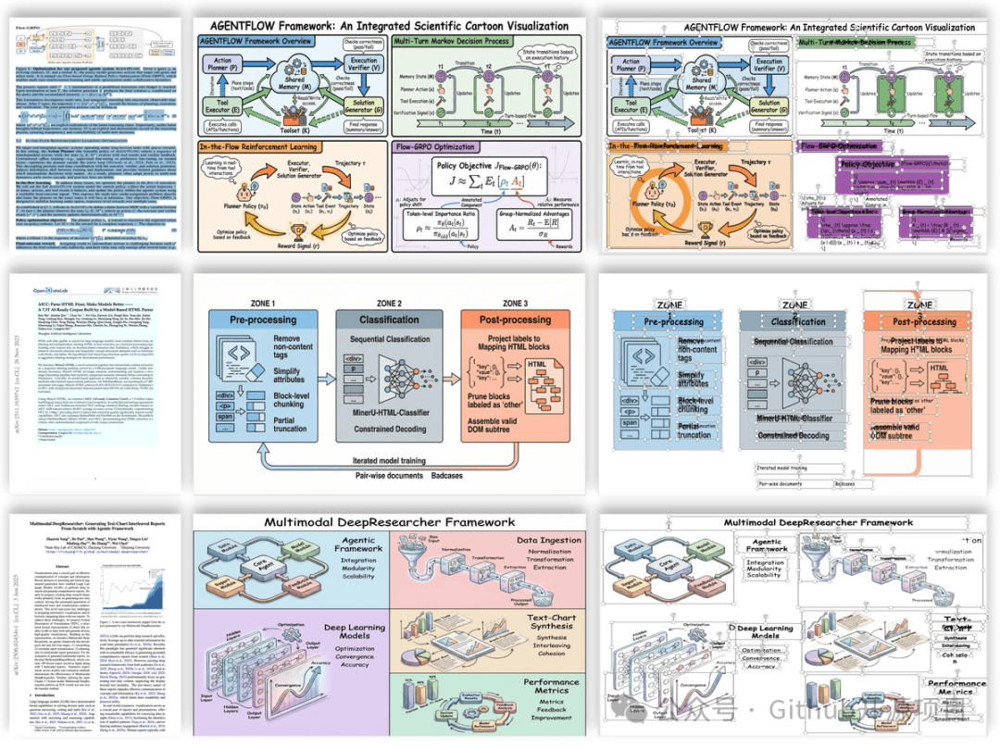
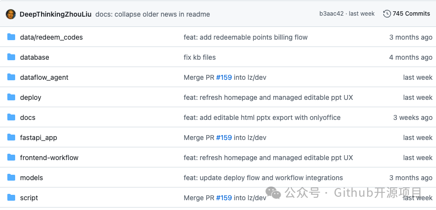
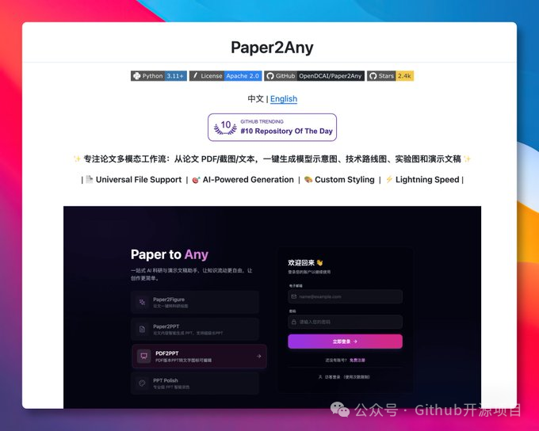

# Paper2Any：论文 PDF 丢进去，PPT、架构图、海报都给你拆成可编辑的

我一开始没太当回事。

这种"论文一键生成 PPT"的东西，老鬼见过不少，十个里面八个最后都是：封面挺好看，正文像摘要搬运，图还是死图。结果 Paper2Any 最抓我的，反而不是"生成"，是它一直在强调**可编辑**。

论文 PDF、截图、文字丢进去，它不是只吐一张漂亮预览图，而是往模型架构图、技术路线图、实验图、PPT、海报、视频脚本这些学术素材上走，而且 README 里明确写了 PPTX、SVG、draw.io 这类可继续改的出口。啧，这点很现实。

做汇报最烦的不是 AI 生成得不够炫，是导师一句"这个箭头换个方向、模块名改一下"，你发现自己只能重画。

Paper2Any 现在已经把 Paper2Figure、Paper2Diagram / Image2Drawio、Paper2PPT、Paper2Poster、Paper2Citation、Paper2Rebuttal 这些能力塞进去了。老鬼比较偏心 Paper2Diagram 这一块：图片能转成可编辑 DrawIO，再用对话继续改结构。

以前赶 Demo 或汇报，最耗时间的就是这类脏活，流程图、技术路线图、PPT 之间来回搬，格式一乱，半天没了。

当然，先别急着吹。

这种工具真正跑起来，卡点多半不在按钮，而在部署和依赖。README 里 Docker 路线看着清楚：复制 env、配 API key、跑 `bash deploy/docker-up.sh`，前端默认 3000，后端 8000。

但 PDF2PPT、Image2PPT、Image2Drawio 这类流程还会碰到 SAM3 分割服务；本地装的话还绕不开 ffmpeg、LibreOffice、Inkscape、poppler-utils 这些系统依赖。坑一般就在这里。

所以我会把它看成一个"论文汇报素材工作台"，不是神仙代写器。赶组会、准备答辩、做论文精读分享，先用它把初稿和图形骨架打出来，再人工改逻辑，这个场景挺香。

项目目前在 GitHub 上已经有 2.5k star，想折腾的同学可以扫一眼：OpenDCAI / Paper2Any。

GitHub 地址：OpenDCAI/Paper2Any
