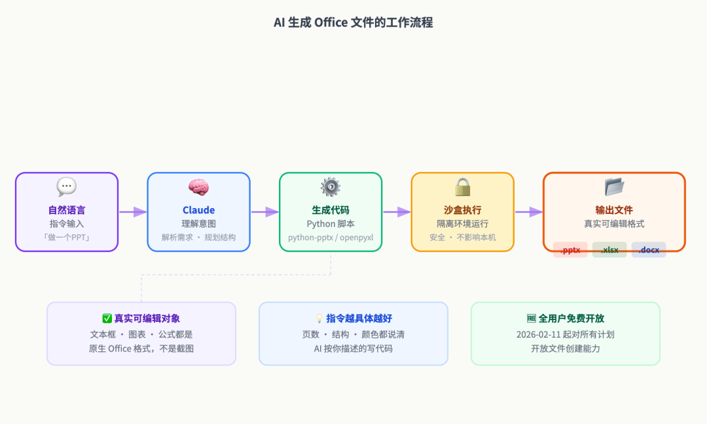
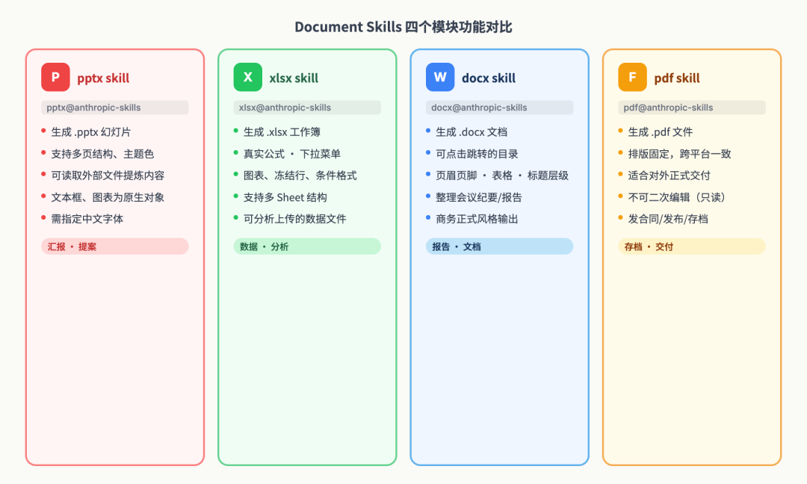
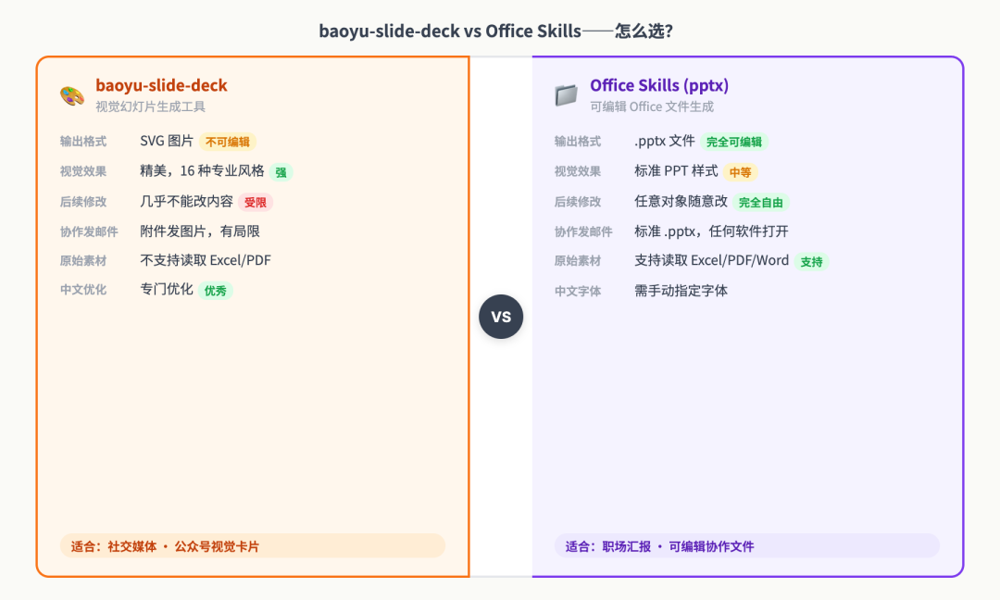

# Claude Code 必备 skill，10 分钟做出专业 PPT、Excel 分析和 Word 报告

> **你将学到**
>
> - 知道 AI 如何直接生成可编辑的 .pptx、.xlsx、.docx 文件（不是截图，是真文件）
> - 学会用 Anthropic 官方 document skills 生成职场所需的 PPT、Excel 和 Word
> - 理解 Office Skills 和上一讲 baoyu-slide-deck 的本质区别，知道什么时候该用哪个
> - 掌握「一句话指令」让 AI 交出可直接发邮件的文件的技巧
>
> **每天要做 PPT 汇报、整理 Excel 数据、写 Word 报告的职场人。不管你是产品经理、运营、销售还是学生，这一讲直接解决「文件要交但没时间做」的问题。**

## 一、这不是「AI 帮你写文字」，是 AI 直接交给你文件

先说清楚一件事，因为很多人搞混了。

你之前用 AI 做 PPT 的方式可能是这样的：让 ChatGPT 或 Claude 帮你生成文案，然后你复制进 PowerPoint，再自己排版。这也是 AI 辅助，但它只帮了你内容那一步，排版还是你来。

**这一讲说的完全不同。**

2026 年 2 月，Anthropic 把 Claude 的文件生成能力开放给了所有用户——包括免费用户。你现在可以对 Claude 说「帮我做一个季度总结 PPT，8 张幻灯片，包含销售趋势图」，Claude 直接给你下载一个 `.pptx` 文件，用 PowerPoint、WPS 或 Google Slides 打开，所有文本、图表都是真实可编辑的对象，不是截图。

这是什么感觉？

同样，你说「帮我做一个月度费用跟踪表，带分类汇总和条形图」，Claude 给你一个 `.xlsx`，打开就是有公式有格式的 Excel 表，你可以直接填数据进去。

Word 报告也一样——你说「帮我写一份竞品分析报告，Word 格式，带目录」，你拿到的就是一个结构完整、目录可以跳转的 `.docx`。

这不是科幻。这是 2026 年 6 月你今天就能用的功能。

问题是：很多人装了 Claude Code 之后，根本没有发现它能做这件事。今天这一讲，就是把这扇门指给你看。

这个痛点的根源是什么？我们得从 AI 怎么生成这些文件说起。

## 二、AI 生成 Office 文件的原理（不懂也能用，但懂了用得更准）

你可能会想：Claude 是一个语言模型，它怎么能生成 Excel 文件？

这里有一个关键机制——**代码执行沙盒**。

Claude 不是「直接画出来」一个 Excel 表，而是在后台运行 Python 代码，用 `openpyxl` 这个库构建 Excel 文件，把所有公式、格式、图表写进去，最后把文件打包给你。PowerPoint 同理，用 `python-pptx` 库；Word 文档用 `python-docx`。



AI 生成 Office 文件的流程：你的自然语言指令 → Claude 理解意图 → 生成 Python 代码 → 沙盒执行 → 输出文件 → 你下载。

这个原理解释了两件很重要的事：

**第一，为什么文件是真正可编辑的。** 因为用 python-pptx 生成的 PPT，每个文本框、每个图表都是真实的 PowerPoint 对象。不是截图，不是嵌入图片，是原生格式。你拿到之后完全可以在里面改字、换颜色、重新排版。

**第二，为什么指令越具体越好。** 你告诉 Claude「帮我做 PPT」和「帮我做一个 8 页的季度销售汇报，第 3 页放柱状图展示按月销售额，颜色用品牌蓝 #2563EB」，生成的结果天差地别。代码是按你说的写的，你说得越清楚，它写得越准确。

原理讲完了，怎么真正用起来？我们来跑一遍。

## 三、上手（从零开始，5 分钟内做出你的第一个文件）

### 3.1 检查是否已经开启

Claude Code 里的文件生成能力依赖一个叫 **Code execution**（代码执行）的功能。这个功能默认是开着的，但万一你之前关了，先检查一下：

打开 Claude Code，在设置里找到 **Capabilities（能力）**，确认 **Code execution and file creation** 是打开状态。

这个功能对所有计划都免费开放，不需要额外付费。

### 3.2 你的第一个 PPT（用自然语言直接描述）

打开 Claude Code，直接用中文说：

```
帮我做一个 PPT，主题是「下半年部门工作规划」，6 张幻灯片，内容包括：
1. 封面页（部门名称、汇报人、日期）
2. 上半年回顾（3 个要点）
3. 下半年目标（3 个方向）
4. 重点项目（用表格列 3 个项目、负责人、截止日期）
5. 资源需求
6. 结尾感谢页

风格简洁商务，配色用蓝白灰。输出 .pptx 文件。
```

Claude 会在后台跑代码，几分钟内给你一个下载链接。生成的文件打开就是带格式的 PPT，占位文字已经填好，你只需要把具体数据替换进去。

**几个让 PPT 更好用的技巧：**

- **附上模板**：如果你公司有 PPT 模板，把模板文件上传给 Claude，告诉它「按这个模板风格做」，它会保留配色和 logo 位置。
- **附上数据**：如果要展示数据，把 Excel 文件一起上传，告诉它「第 3 页的图表数据来自这个文件的 Sheet1」。
- **指定字体**：如果你需要中文字体，明确告诉它，比如「用思源黑体」，否则默认英文字体在中文下可能显示异常。

### 3.3 你的第一个 Excel 分析表

同样的方式，换成 Excel 场景：

```
帮我做一个月度费用记录表，.xlsx 格式，要求：
- A 列：日期
- B 列：费用类别（下拉菜单，选项：餐饮、交通、住宿、采购、其他）
- C 列：金额
- D 列：备注
- 第二个 Sheet 做汇总：按费用类别求和，带一个饼图
- 整体风格干净，有冻结首行
```

Claude 生成的 Excel 文件里，下拉菜单是真实的数据验证，饼图是真实的 Excel 图表对象，冻结首行也已经设置好了。你打开就能直接填数据。

```
帮我分析这份销售数据（上传 sales.xlsx），找出：
1. 销售额最高的 5 个产品
2. 各月份销售趋势，画折线图
3. 退货率超过 5% 的产品，用红色标注
输出一个新的 .xlsx，包含原始数据和分析结果两个 Sheet。
```

### 3.4 你的第一个 Word 报告

Word 的场景最直接——你有材料，让 AI 整理成规范文档：

```
帮我写一份竞品分析报告，.docx 格式，分析对象是 [你的竞品名称]。
文档结构：
1. 摘要（200 字）
2. 竞品产品概述
3. 功能对比（用表格，我们的产品 vs 竞品）
4. 用户评价分析（正面 / 负面各 3 条）
5. 结论与建议

语言正式，带目录，目录可以点击跳转。
```

或者你已经有内容，让 AI 帮你整理格式：

```
把这段会议纪要（粘贴内容）整理成 Word 文档，要求：
- 添加标准页眉（公司名、文档日期）
- 重要决议用加粗标出
- 行动项用表格列出（负责人、截止日期、状态）
- 输出 .docx，风格用商务正式
```

原理讲完了，跑通了，但是如果直接这么用，产出的内容其实是达不到你想要的效果的。

生产环境完全是另一回事。我们来看看怎么真正把这些用在日常工作里，以及怎么用 Skill 做得更稳、更快。

## 四、安装 Document Skills，让生成更稳定

前面说的用自然语言直接驱动文件生成，大多数简单场景就够用了。但如果你经常需要生成文件，或者有特定的格式要求，装上 Anthropic 官方的 **Document Skills** 会让整个过程更可控。

### 4.1 什么是 Document Skills

Document Skills 是 Anthropic 官方 skills 仓库（`anthropics/skills`）里专门负责文件生成的一套工作流，包含 pptx、xlsx、docx、pdf 四个模块。它们是 Claude.ai 文件创建功能的底层实现——Claude.ai 点一下按钮就能生成文件，靠的就是这套 Skill。

在 Claude Code 里装上之后，生成的文件质量更稳定，特别是在处理复杂格式、模板还原这类场景时，比纯靠自然语言描述要可靠很多。

### 4.2 安装方式

两步搞定：

**第一步：注册官方 Skill 市场**

```
/plugin marketplace add anthropics/skills
```

**第二步：安装 Document Skills 包**

```
/plugin install document-skills@anthropic-agent-skills
```

安装完成后，document-skills 里的 pptx、xlsx、docx、pdf 四个 Skill 就都可以用了。

如果你只需要其中一个，比如只装 PPT 生成：

```
/plugin install pptx@anthropic-skills
```

### 4.3 安装后怎么用

装好之后，使用方式和没装时差不多——自然语言描述需求就行。只不过现在 Claude 有了明确的工作流可以遵循，生成的结果更规范。

你也可以在指令里明确引用 Skill：

```
用 pptx skill 帮我做一个项目启动汇报，8 页，包含项目背景、目标、
时间线（甘特图风格）、团队配置、风险点。附上 project-brief.pdf。
```

这样 Claude 知道走 pptx skill 的工作流，而不是自己凭感觉生成。



document-skills 四个模块功能对比

## 五、进阶场景：把这几个 Skill 用出真实价值

### 5.1 「把资料喂给 AI，让它自己提炼」

职场里最常见的情况：老板明天要汇报，你手上有一堆东西——上周的周报 Word 文件、本月的销售数据 Excel、客户反馈的 PDF，但没时间整理成 PPT。

以前你要自己看完所有资料，提炼要点，再做 PPT，最快也要 2-3 小时。现在：

```
我附上三份文件：上周的周报（weekly-report.docx）、本月销售数据（sales-oct.xlsx）、
客户反馈总结（feedback.pdf）。

帮我做一个 10 分钟汇报 PPT，6 张幻灯片：
1. 本周亮点（从周报提取 3 个）
2. 销售进度（从 Excel 提取数字，画进度对比图）
3. 客户满意度（从 PDF 提取评分和关键反馈）
4. 下周计划
5. 需要决策的事项
6. 结尾

输出 .pptx，可直接在会议室用。
```

Claude 会读取三份文件，自己提炼，生成 PPT。整个过程 5-10 分钟，你只需要最后检查一遍数字是否准确。

**这是和 baoyu-slide-deck 最核心的区别之一：baoyu 适合「我知道内容，要你排版」的场景；Office Skills 适合「我有一堆原始材料，要你整合」的场景。**

### 5.2 「Excel 分析 + 自动汇报」串联

这是一个我在实际工作里觉得最省时的用法。

场景：每月末要出一份月度经营分析，数据在 Excel，结论要写在 Word 报告里，最后还要做成 PPT 给管理层看。以前这三步是独立的，要做三遍。

现在可以这么串：

**第一步**，上传 Excel 数据，让 AI 先做分析：

```
分析这份 10 月份经营数据（sales-oct.xlsx），找出：
- 哪个产品线增长最快（环比、同比各是多少）
- 哪个区域异常（偏差超过 20% 的）
- 整体完成率（目标 vs 实际）
先给我文字分析结论，不要生成文件。
```

**第二步**，用分析结论直接生成报告和 PPT：

```
基于刚才的分析结论，帮我：
1. 生成一份月度经营分析 Word 报告（5 页，含数据表格）
2. 生成一份管理层汇报 PPT（6 页，数字突出，配图简洁）
两份文件分别输出。
```

三步并成两步，用同一份分析生成两个输出，一致性有保证，时间节省超过一半。

### 5.3 「真实踩坑：AI 生成的文件，哪些地方要人工把关」

用了这些 Skill 几个月，我总结出几个必须人工确认的地方：

**数字要核对。** AI 在提取 Excel 数据时，偶尔会汇总错——特别是当数据表格有合并单元格或特殊格式时。生成完，先把关键数字拿原始文件对一遍。

**中文字体要确认。** 生成的 PPT 或 Word，在不同环境下打开可能有字体缺失的问题。如果要正式发出，检查一下是否有字体替换警告，必要时嵌入字体。

**图表类型不要完全交给 AI 决定。** AI 经常选折线图，但你的数据可能更适合柱状图。生成后检查图表类型是否传递了你想要的信息。

**正式汇报前必须走一遍「读者视角」检查。** AI 生成的文案有时候漂亮但空洞。检查每个 PPT 页面：这一页的观点是什么？数据是否支撑这个观点？如果你说不清楚，就是 AI 写的问题。

故事讲完了，今天到底学到了什么？

## 六、Office Skills vs baoyu-slide-deck：两张表看清楚

在讲今天的总结之前，有一个问题你肯定在心里问了：**上一讲的 baoyu-slide-deck 也能做 PPT，这一讲又来一套，我到底用哪个？**

这是一个好问题，因为搞清楚这件事，比知道怎么用两个工具都重要。



一张表说清楚：

| 维度 | baoyu-slide-deck | Office Skills (pptx) |
| --- | --- | --- |
| **输出格式** | SVG 图片（不可编辑） | .pptx 文件（完全可编辑） |
| **视觉效果** | 精美，16 种专业风格 | 标准 PPT 样式 |
| **后续编辑** | 几乎不能改 | 完全可以改，任意对象 |
| **发邮件 / 协作** | 附件发图片 | 标准 .pptx，任何软件打开 |
| **原始素材整合** | 不支持 | 支持（可读取 Excel/PDF/Word） |
| **中文场景** | 专门优化 | 需手动指定字体 |
| **最适合的场景** | 朋友圈/公众号分享的视觉卡片 | 公司内部汇报、需要后续修改的文件 |

**一句话选择逻辑：要好看拿去社交媒体发 → baoyu；要能改能发邮件能协同 → Office Skills。**

两个工具的目标根本不同。baoyu 做的是「视觉内容」，Office Skills 做的是「可编辑工作文件」。职场里两者都用得上，知道情况选对就好。

## 七、小结

今天这一讲我们做了一件事：**打开了 AI 直接生成 Office 文件这扇门，并且把它用到职场三大场景里——PPT 汇报、Excel 分析、Word 报告。**

如果你只能记住三件事，记住这三件：

1. **AI 生成的是真实可编辑的 Office 文件，不是截图**——用 python-pptx/openpyxl 在沙盒里跑代码生成的，拿到就能改。
2. **指令越具体，文件越可用**——把页数、章节结构、数据来源、格式要求都写进去，AI 能一步交出接近可用的文件。
3. **Office Skills 和 baoyu 不是同一类工具**——一个做可编辑工作文件，一个做视觉分享卡片，选择看场景不看哪个更强。

这一讲的内容会在第 20 讲「内容创作全流程串联」里再次用到——到时候你会看到把 doc-coauthoring（研究写稿）+ Office Skills（生成文件）+ baoyu（配图发布）串成一条完整流水线是什么感觉。

马上可以做的一件事：打开 Claude Code，把你下周要做的一个汇报主题告诉它，让它帮你生成一个 PPT 初稿。不用完美，先跑通一遍，感受一下从零到文件是多快的事。

下一讲预告：第 20 讲我们会把这个专栏模块四（创意与内容创作）所有学过的 Skill 串成一条完整的流水线，从选题到最终发布，一气呵成——看看真正的 AI 工作流是什么样的。
