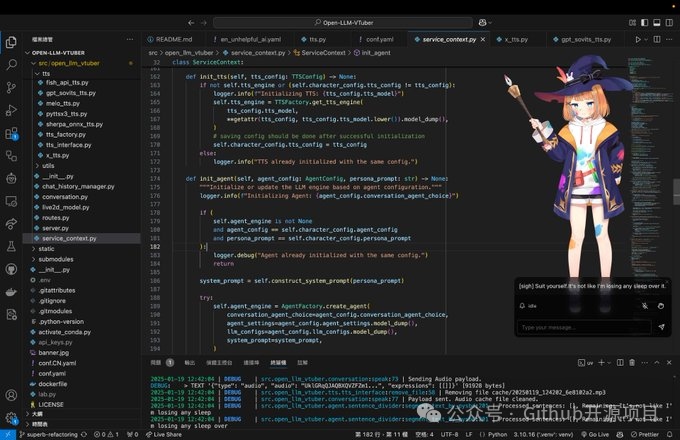
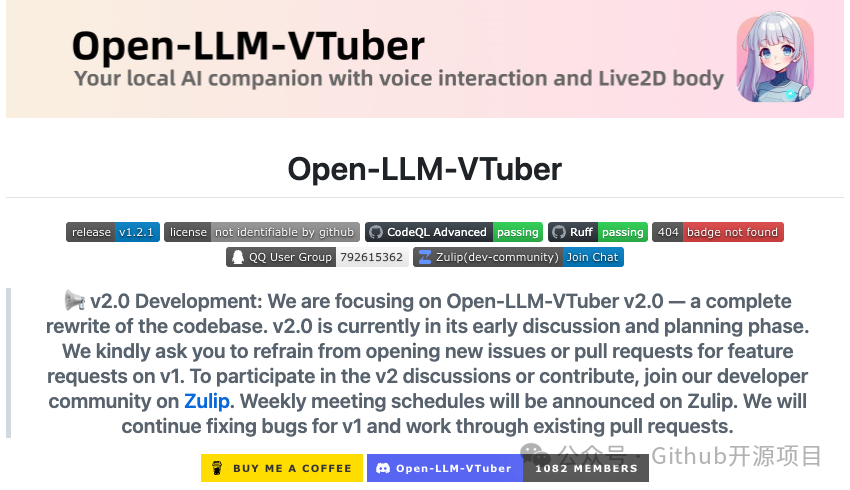

# Open-LLM-VTuber：本地离线跑一个会说话的 Live2D AI 伴侣

好家伙，AI 伴侣这类东西，东哥以前第一反应不是"可不可爱"，而是：语音、摄像头、聊天记录，全丢云上我真不太放心。

最近刷到 **Open-LLM-VTuber**，这个方向就有点对胃口了。它不是单纯套个聊天框，而是在本地电脑上跑一个带 **Live2D 形象**的语音 AI 伴侣，项目页也明确写了：支持实时语音、视觉感知，功能可以完全离线运行在自己的机器上。

它有几个点挺戳人。

一个是交互不是"你说一句它回一句"那么干。它可以用摄像头、截图、屏幕录制去看你和屏幕内容；支持语音打断，不用等 AI 把一大段废话念完；还能点按、拖拽触发 Live2D 反馈，甚至显示 AI 没说出口的"内心想法"。这个味儿就很 VTuber 了。

另一个是桌面宠物模式。透明背景、置顶、鼠标穿透，能挂在屏幕角落，不挡你写代码、看文档。东哥看到这种功能会多看一眼：不是炫技，是它真的适合长时间开着。

模型后端也没锁死，Ollama、OpenAI 兼容接口、Gemini、Claude、DeepSeek、LM Studio、vLLM 这些都能接；ASR 和 TTS 也给了 sherpa-onnx、Whisper、FunASR、MeloTTS、GPTSoVITS、CosyVoice 等一堆方案。还能中文聊天，让它用日语声音说出来，这个挺二次元，也挺实用。

但别急着以为一键无脑。东哥这种老开发毛病又犯了：本地离线意味着你要关心显卡、模型缓存、麦克风权限、TTS 依赖。项目页还提醒，远程访问时麦克风需要 https 或 localhost，不然浏览器可能直接不给用。

总之，这项目适合愿意折腾本地 AI 的人。想要一个能陪聊、能看屏幕、能挂桌面、还能自己换皮肤换声音的 AI 小伙伴，Open-LLM-VTuber 可以收进仓库慢慢玩。当前 GitHub 上已经有约 9.6k stars，热度不低。

GitHub 地址：Open-LLM-VTuber/Open-LLM-VTuber。
