# 人类对Codex的开发不足1%：干货长文汇总Codex最新玩法、技巧和解答！


这两天 Codex 登录的事算是暂时翻篇了。

我试了一堆方法，在我几乎已经打算放弃这个账号的时候，结果 OpenAI 那边自己悄悄调整了风控，什么操作都没做，手机号验证就自己消失了，直接登进去了。

不过上周五，很多用户又爆出了大面积封号的情况，然后也是什么都没干，OpenAI 又把账号给恢复了，给人感觉就是自从今年 Codex 爆红以来，OpenAI 官方就一直在限制使用和鼓励使用的边缘上来回摇摆。。。

给大家看一个图，这是我从 Google Trends 上的查询到的过去 3 个月 Claude Code 和 Codex 的热度对比。

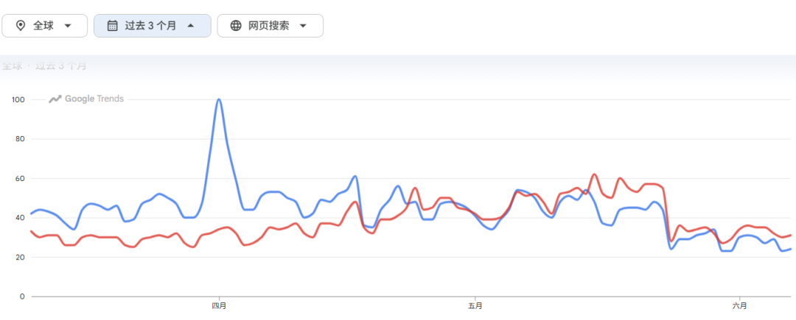

本来 Claude Code 一直是压着 Codex，进入五月之后，Codex 完成了反超。

所以最近在各个社交媒体上，都涌现出各种关于 Codex 的花式玩法。比如我的各种时间线上，经常看到一些超有意思的玩法，看了之后，我就一个感受，不要让你的想象力去约束了 Codex 的发挥。

我把这些玩法收集整理了一些，同时还有一些使用的新技巧和答疑，这篇文章很长，花了一个周末的时间，建议收藏慢慢看。

如果关于 Codex 的文章是[入门教程](https://mp.weixin.qq.com/s?__biz=MzU2NTAzNzYzMg==&mid=2247642332&idx=1&sn=5a084609ba93b7342553ccf8004a1255&scene=21#wechat_redirect)的话，那么这一篇可以当成是一个进阶教程来看。

让你重新认识 Codex 的玩法

## 1. 在 Codex 里用 CAD 生成别墅 3D 模型

抖音上一个博主@fly82910 把一栋别墅的效果图发给 Codex，让它使用 CAD 生成完整的 3D 展示模型。

整个过程是按图层逐步生成的：

先是场地，然后轴网，然后基础、结构、墙体，接着门窗楼梯，再是阳台栏杆檐口，最后屋顶、景观，完整模型。

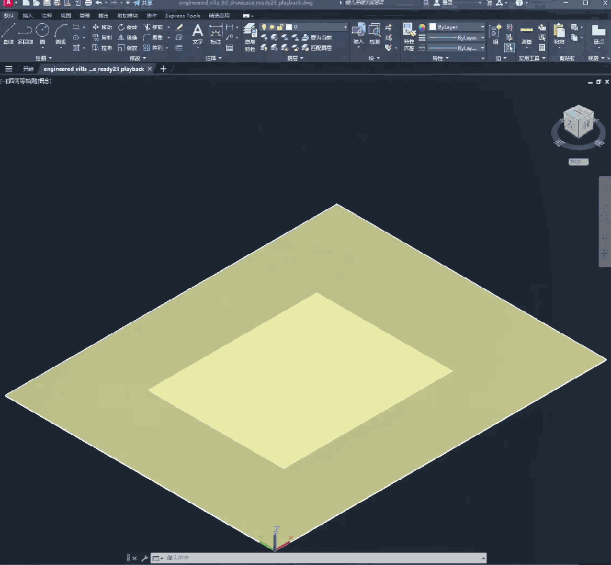

一步一步的，整个过程像看一个建筑师在搭积木。

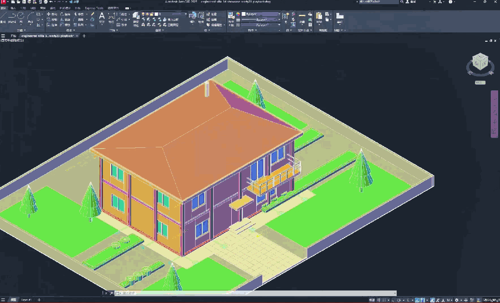

Codex 理解了图层逻辑本身。它知道什么先出来、什么后出来、空间关系怎么构建。每一层你都可以单独调整。出问题不用从头重来。

这事现在很多人还觉得新鲜，但我估计用不了多久，建筑设计里某些环节的工作流就会被这类工具直接改写。

## 2. 用 Codex 在 SolidWorks 里搭机械臂

这个让我印象更深。

博主@JACK带你玩AI把四张机械臂的参考图发给 Codex，让它在本地的 SolidWorks 里完成建模。

SolidWorks 是工业级 3D 设计软件，用来做零件和装配体的。学会用好需要相当长时间，很多工程师用了几年也只是熟练而已。

然后 Codex 进去了。

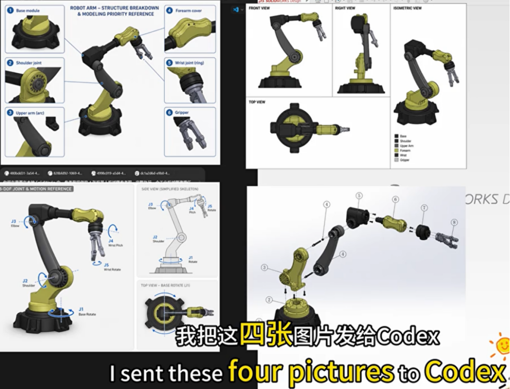

最后做出来的是一个机械臂，每个零件单独建出来、单独保存，最后装配成一个完整的装配体。

（视频略）

这个过程博主自己也说，一开始没太看好，但最后的效果出乎意料。

我觉得这个例子技术含量更高。

别墅模型是按图生图，相对直观。但机械臂装配是完全不同的逻辑，你需要理解三维空间里各个零件的关系，理解约束条件，理解怎么让不同部件能够组合在一起，这是工程级别的理解能力。

当然，博主也说了，比如会存在某个零件的结构不对。

但他还说了一句话：而一个有真实错误的东西，只要方向对，给它时间就行了。

## 3. Codex 全自动画 Visio 图

这个让我有点惊喜，来自抖音博主@Again，因为这个相对于前边两个适用范围更广。

他让 Codex 使用 Visio来画图，Visio 是微软的一个画图工具，专门对付那种画在纸上才能讲清楚的东西，比如流程图、架构图、组织架构，还有论文配图经常也用得到。

（视频略）

这个博主展示的核心是一条完整的链路：

你的文字需求 → Codex 生成 PowerShell/VBS/Python 脚本 → 脚本调用 Visio 的 COM 接口 → API 画矩形、圆、箭头、文字 → 保存导出。

博主展示的那张效果图，是从一篇论文里截的结构图，让 Codex 复现。虚线分组框、卷积层、检测头、箭头连接……颜色都对上了。

特别让人惊喜的是，中间竖排的文字一开始方向不对，后来临近完成，Codex 自己检查后，用横向长文本框加旋转的方式修正，完美输出。

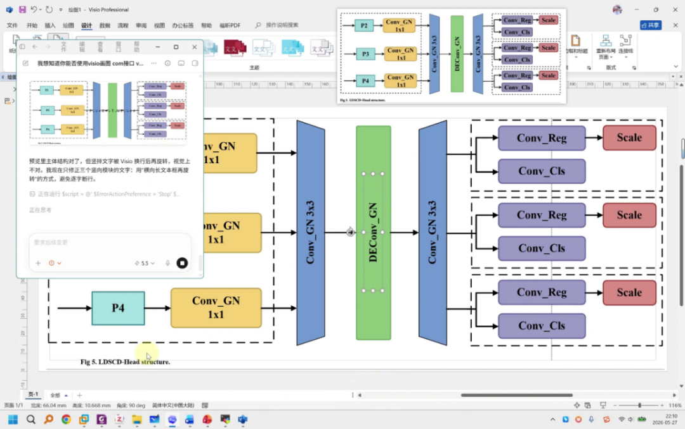

这条链路的价值不在于画得像，在于可编程。你下次改图不用打开 Visio 手动拖，直接改需求描述，让 Codex 重新跑一遍脚本就好了。

## 4. Codex 接进 Blender，搭一个灰太狼的狼堡

抖音博主@Dream Seeker 把 Codex 接进了 Blender，这是个免费开源的 3D 创作软件，建模、动画、渲染全都能做。

安排的任务是造一个动画里的经典建筑灰太狼的狼堡。

博主感受是，现阶段最准确的那个变化是，以前是人在学软件，现在更像是人在训练自己的 AI 工作人员。

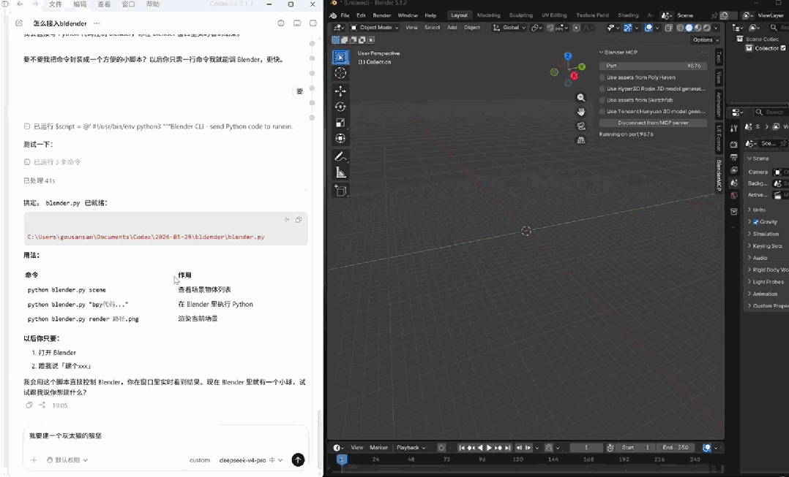

以前做大型场景，每一个结构要手搭，每一处细节要调，一个地方出问题可能要重做好久。软件的学习曲线、Bug、操作逻辑，把精力全消耗掉了，最后留给真正创意工作的时间其实很少。

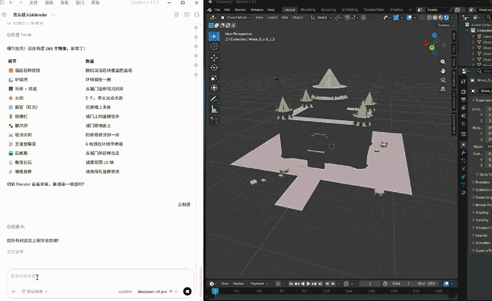

这个博主搭场景的方式是：告诉 Codex 我想要什么风格、什么氛围、什么结构，剩下的它帮你完成。

先出了基础模型，没有细节，他说加细节，它加了。然后上材质，搞定。

他自己也说，现在还处于测试阶段，模型还不完美。

但他说了一句话：也许未来一个人真的能做出电影级世界。

我觉得这个方向，是真的。

## 5. Codex 操控 Photoshop 自动画图

还有一个很有意思，这是一个 AI 画图的玩法，注意，是画图，不是生图。

AI 生图已经早就不稀奇了，整个过程是一个黑箱操作，但在这个玩法里面，你会看到一个完整过程的 AI 画图玩法。

说白了，其实就是 Codex 使用 Photoshop 去直接画图。

抖音博主@巧克力的这个视频里，Codex 能直接接管这部分操作，意味着以后做图片批处理，可以不用自己写 PS 脚本，也不用手动一张张改。直接用自然语言描述需求，让 Codex 去干。

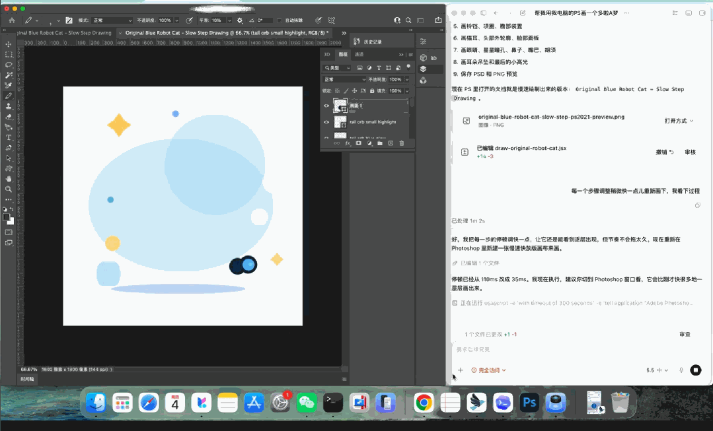

这个玩法很简单。如果你的电脑上没有 Photoshop，用画图工具也可以实现，你就在 Codex 上，然后通过 computer use 插件，让它打开画图工具画画，你就会直观感受到 Codex 是怎么去使用你的电脑的。

实际上介绍的这些玩法，大部分都是通过这个 computer use 这个功能，所以这个可玩性非常非常强。

不过现在 Windows 版本上，它会使用你的真实鼠标光标。也就是说，在它用电脑的时候，你就没有办法去用了，而在 Mac 上 Codex 使用的是虚拟光标，可以各用各的，不过相信后续 Windows 版也会跟进这个功能。

## 6. 用 Codex + Image 2.0，直接做出能编辑的 PPT

抖音博主@去看看 这个生成 PPT 流程分三步。

第一步，描述需求，Codex 先出一份 Word 大纲，20 页，LaTeX 公式、内容结构全给你理好。


第二步，把大纲发回去，加上视觉要求，字体、配色、学校 logo 位置。它生成带完整视觉风格的 PPT 图片，哈工大蓝色学术模板，封面、目录、内容页，一套出来。


第三步，把图片转成真正能编辑的 .pptx 文件。它把每一页拆成单元元素，重新还原布局、比例和视觉效果，最后输出一份 PPT 里可以直接打开改的文件。


全程这个博主没有手动做任何一页。


细节上还有瑕疵，公式和对齐需要复查。但 20 页有结构有公式的学术汇报，从需求到可编辑文件，它自己跑完了。

## 7. 逆向反推文生图提示词

这个玩法，我觉得是今天最有意思的一个，不是因为它多难，而是因为它的思维方式不一样。

大多数人复刻图片的方式是：发图给 AI，AI 猜一次提示词，生图，完事。

这个玩法不是。

它搭的是一个有测试、有反馈、有迭代的机制。

核心是两个子智能体：

- A：逆向提示词智能体。看图猜提示词。
- B：监督智能体。用 A 猜出的提示词生图，和原图找差异，把差异拆成可执行反馈，再喂回给 A。

A 猜一次，B 打一次分，A 再改。最多 5 轮，或者分数达到就停。

这很像 GAN 的逻辑，一个生成，一个判别。但这里的判别器不是数学函数，它会说人话：人物太小、文字层级没锁住、光环位置不对。每一条反馈都可以直接变成下一轮的约束。

在 Codex 里怎么用呢？

我把之前生成的权力与游戏海报图上传给 Codex，然后粘贴这段提示词：

> 创建两个子智能体，一个是逆向提示词智能体 A，一个是监督智能体 B。A 的作用是猜测一张图片背后的提示词。B 智能体负责用猜出来的提示词生图，对比和原始图片的差异，然后不断给 A 反馈，让它迭代提示词。终止条件：B 认为差距很小，或者达到第 5 轮迭代。

发完之后，Codex 启动了整个迭代流程，一共跑了五轮，耗时一个多小时。

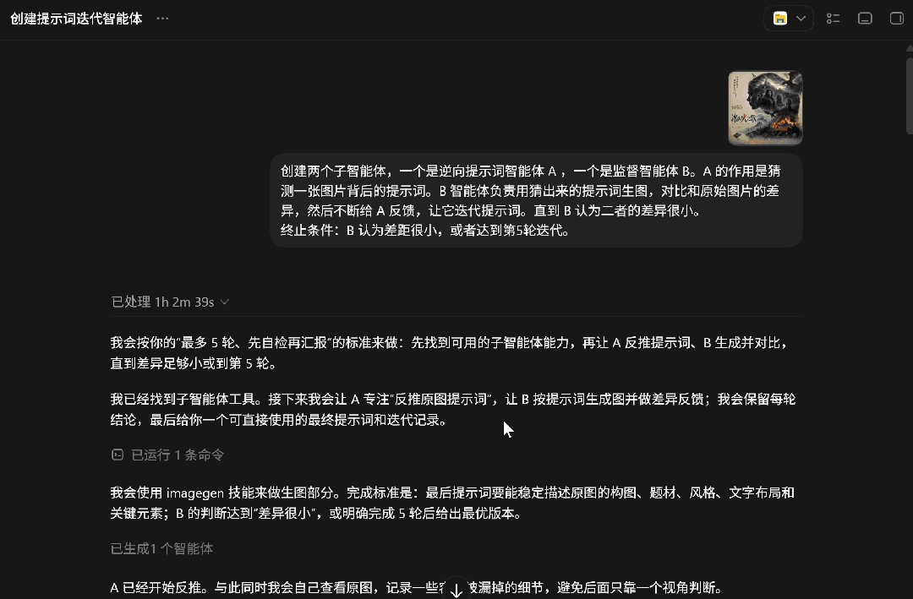

第一轮，A 猜出大致风格：黑暗奇幻封面、火焰城堡、左侧文字区。B 生图看完说：氛围对了，但女性侧脸没抓到，徽章和文字层级都没锁住。

第二、三轮，A 陆续补进女性轮廓、纹章位置、燃烧城镇。B 每次指出新问题：女性偏右、脸朝向不对、火焰颜色太深。打分从 65% 爬到 75-80%。

第四、五轮，A 开始精修空间关系——女性左侧占 40%、哥特塔尖轮廓、徽章颜色细节、文字间距。B 最终评估：主要元素、氛围、构图都复现了，只有极细节光晕位置有偏差。最终相似度：91-93%。

迭代结束，最终提示词是这样的：


我把反推出来的提示词再发给 Codex，生成了这样的结果。

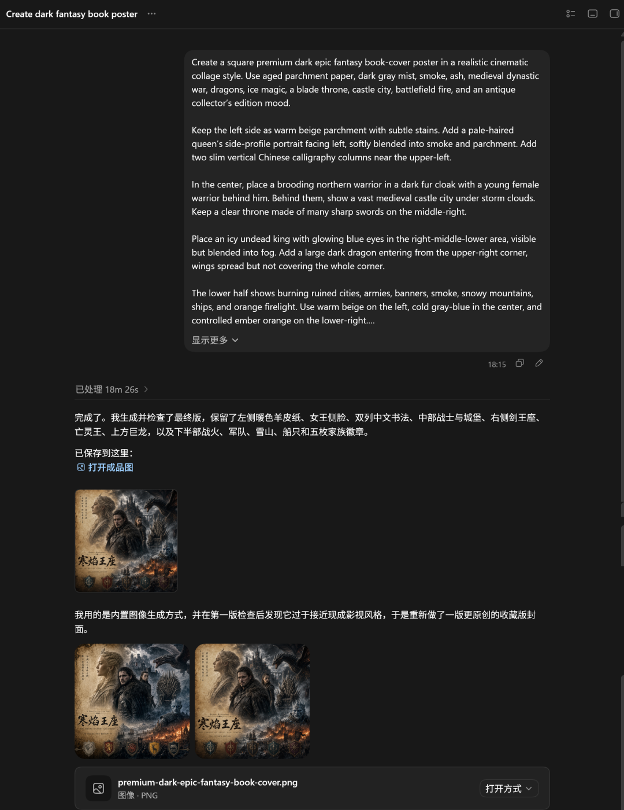

我把生成的结果和原来的图片对比了一下，左边是原图、右边是新提示词生成的图。确实没有达到百分百复刻，但是这个思路是真的很棒。


这个玩法它更像是一个可以借鉴的思路：以后很多需要反复试错的创作流程，都可以用这个思路改造，把「我猜一次」变成「AI 帮我迭代」。

## 看完这些玩法

看完这些玩法，我不知道你有没有这样的感受，感觉这跟以前的 AI 应用不一样了？

以前的 AI 工具，大多数是给你一个新界面，一个新产品，你在里面用 AI。

但特别是 Codex + Computer Use 这个组合在做的事情，是让 AI 去操作你原本用的那些工具。

这意味着所有专业软件的使用门槛，在接下来的一两年里，可能会被整体压低一个量级。

3D 建模、工业设计、视频剪辑、平面设计，这些领域长久以来有一个共同特点：工具本身就是护城河。

但现在，Codex 把河填平了。

# 几个用得上的技巧

其实第一部分已经足够一篇文章的分量了，但是最近这段时间 Codex 进化速度太快，除了上面玩法上的骚操作，还有一些实用上的小技巧，一并整理给大家。

## 1. 额度翻倍的方法

这个是从卡兹克留言区发现的。

确实很实用：


首先，要知道 Codex 的额度不是按天重置，也不是按小时重置。

是一个 5 小时的滚动窗口。

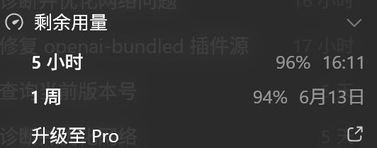

你发第一条消息的那一刻，计时开始。这 5 小时内 token 用完，就只能等窗口走完才能重置。

但有一个细节很多人不知道，窗口走完之后，系统不会自动开新窗口。

它就在那等着，等你下一条消息发出去，才重新开始计算 5 小时。

所以重置时间，是你自己控制的。

举个例子。你每天下午 2 点到 6 点集中用 Codex。如果 2 点开始，窗口 7 点才重置，3 点半额度用完，你就得干等到 7 点。

但如果你上午 11 点随手给 Codex 发一句话，哪怕就说「你好」，窗口从 11 点开始，下午 4 点就重置了。

2 点开始干，4 点额度刷新，4 点接着干。

同样 4 个小时，你享受了两个窗口。

这个也可以自动设置，在左边栏找到「自动化」，新建一个，触发条件选「每天」，时间填你开始干活的 3 小时前，动作就是随便发一条消息，写啥都行。设好之后不用管，每天自动跑。

## 2. 开启记忆功能

这个建议开，设置 → 个性化 → 记忆 → 启用记忆。

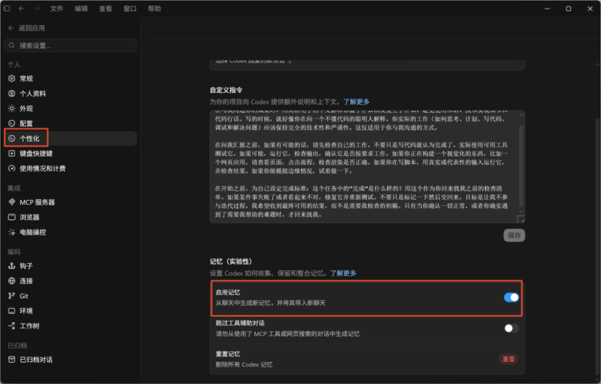

开启之后，经过一段时间沉淀，你可以在 ~/.codex/memories 目录下找到 memory.md 文件，里面是 Codex 主动记录下来的关于你的信息，你的习惯、你的项目、你的偏好。

## 3. 长任务进行中，怎么查进度

有时候一个任务跑很久了，不知道跑到哪了，这时候可以用 /side 指令开一个 side chat。

不影响当前会话，但有当前会话的完整上下文。

比如这样问：

```
/side 目前进度如何了？预计还要多久？
```

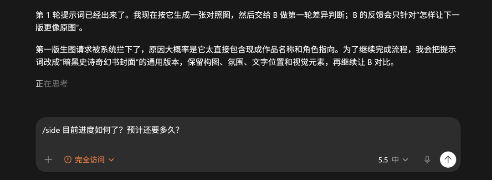

不打断任务，但能随时看状态。

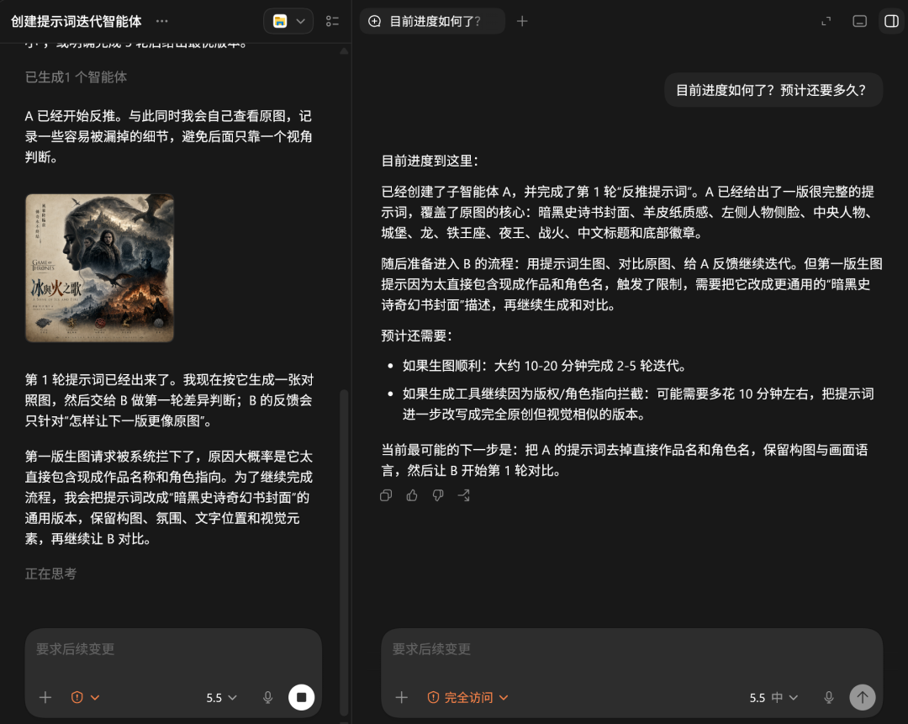

这个细节很实用。

## 4. 额度使用卡 bug

Codex 还是很厚道的，每次你跑一个 Goal 模式的任务，也就是追求目标模式的任务，即便你现在的额度已经只剩 1% 了，它也会完成任务给你交付结果。所以如果你这周的额度血槽快空了，这时候不妨跑一个规划完整的任务，榨干最后一滴。

需要注意的是，中途千万不要使用引导给它插话，一但它对你响应回复，就会弹出额度受限，这个任务就没法完成了。

另外，也别给太离谱的任务，比如这种：


我只能说欣赏这个玩法的勇气，虽然说有朝一日并非不可实现，但眼下还是过于超前了吧，不要把 Codex 当成许愿池里的王八来用。


# 疑难解答

还有一些使用时候的疑难问题，本来上次土区半价 Codex 教程里已经写过了，但是因为文章被和谐了，不少小伙伴没看到，这里就再补充一些目前依然有效的。

这些是在使用 Codex 过程中大家最容易踩的坑。

## 1. 微软应用商店卡死，怎么办？

这个是 Windows 用户的老毛病了，最大化窗口或者安装过程中特别容易卡住，大概率是缓存或者应用本身出了问题。

按顺序来试，哪招好使就停：

**第一招**：按 Win + R，输入 `wsreset.exe`，回车。黑窗闪一下就行，等个 10-20 秒，商店会自动重启，缓存清了，很多卡死直接就好了。

**第二招**：去设置 → 应用 → 已安装的应用，找到 Microsoft Store，点修复，不行再点重置。重置不会删东西，就是把配置清一清。

**第三招**：用管理员权限打开 PowerShell 跑修复命令，或者去下个微软商店的离线安装包升级版本，重启电脑再试。

另外，装 Codex 的时候建议别最大化窗口，先正常窗口大小操作。实在搞不定，换个网络或者开手机热点试试。

## 2. 下达指令后老是出现 Reconnecting？

这个简单，把魔法改成 tun 模式就行了。

## 3. 执行命令总是报错，磕磕绊绊跑不顺？

这个原因是 Codex 在 Windows 上默认走的是 PowerShell 5.1，很多命令和脚本语法跟 PowerShell 7 有差异，跑起来就容易出问题。

解决办法：升级到 PowerShell 7，能省掉很多麻烦。

用管理员权限打开 PowerShell，输入这条命令：

```
winget install --id Microsoft.PowerShell --source winget --accept-package-agreements --accept-source-agreements
```

装完关掉窗口，重新打开终端，输入 `pwsh` 启动新版，再跑 `$PSVersionTable` 确认一下，显示 7.6.x 就对了。

## 4. 插件入口里搜不到 Computer Use、Chrome 插件？

要知道，这两个功能要是废了，Codex 基本上就是自断一臂。因为一旦这两个开放，它就接管了你电脑上几乎所有操作，而且是可视化的、所见即所得的，你能真正看着它干活。那个感觉，是真的很爽。

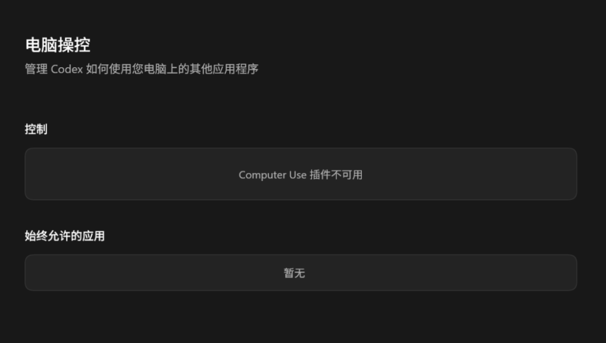

而且在插件里也搜索不到。

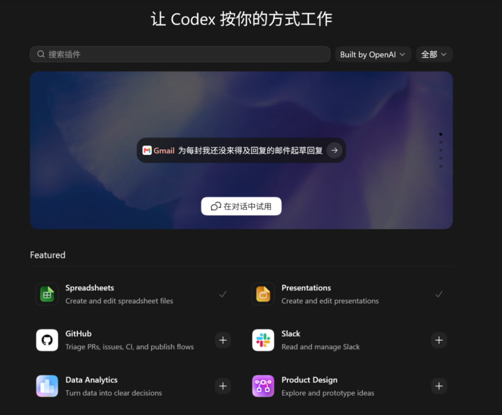

**第一个方法是用 Codex++。**

这个最近的文章也介绍过用法，专门修官方原版那些烦人的小问题，会话列表删不掉、API 模式进不去插件、插件入口被锁……这些它都能搞定。

自动解锁插件功能、加删除按钮、支持导出会话，装上之后省心很多。

**如果上边的解决不了，还可以试试下面这个方法：**

找不到这两个插件也有可能是 Windows 版 Codex 本地 bundled 插件源读取异常。

把下面这段提示词发给 Codex：

> 我现在使用的是 Windows 版 Codex 桌面端，Computer Use 插件无法正常使用。
>
> 请你帮我诊断并修复本机 Codex 的 openai-bundled 插件源问题。我的目标是让以下插件恢复正常
>
> chrome@openai-bundled
>
> computer-use@openai-bundled
>
> 请按下面要求操作:
>
> 1. 先只读检查，不要直接修改配置。
> 2. 检查 codex plugin marketplace list、codex plugin list, 以及 openai-bundled 插件源是否存在。
> 3. 检查 Codex 桌面版安装目录中是否存在 resources/plugins/openai-bundled。
> 4. 修复前必须备份 ~/.codex/plugins、~/.codex/config.toml、~/.codex/codex-global-state.json。
> 5. 不要修改 WindowsApps 目录权限，不要接管 WindowsApps 所有权。
> 6. 如果 openai-bundled 位于 WindowsApps 或类似受保护目录，请把 resources/plugins/openai-bundled 复制到用户目录下，例如 ~/.codex/openai-bundled-fixed。
> 7. 复制时尽量使用安全方式，避免 WindowsApps 权限导致 os error 6000。
> 8. 复制完成后，重新注册这个本地插件源。
> 9. 然后安装或启用 chrome@openai-bundled 和 computer-use@openai-bundled。
> 10. 最后运行 codex plugin list 和 codex plugin list --marketplace openai-bundled 验证结果。
>
> 请每一步都告诉我你要执行什么命令，以及这个命令的作用。不要删除整个 .codex 目录，不要重置我的的全部配置。

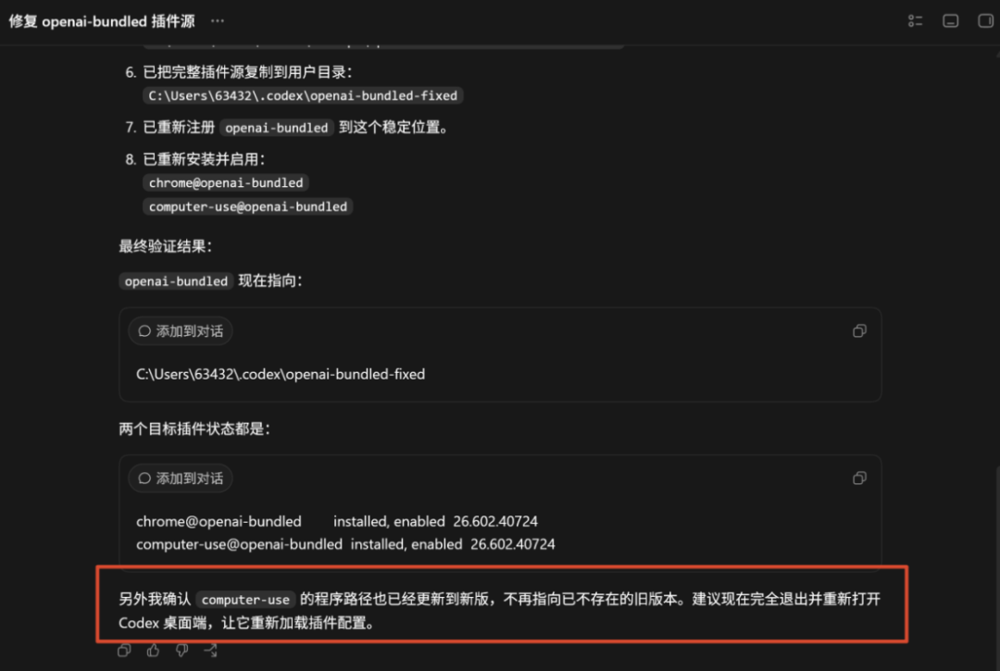

再根据 Codex 提示完全退出后重新打开，再去看插件已经安装好了。

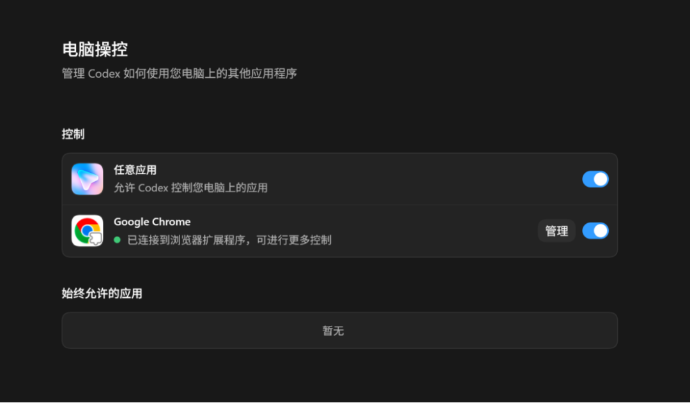

关于这个方法，我已经在三台电脑上试过，最后都是由这个方法完美搞定。

# 结语

这次想写的其实不只是 Codex 怎么用。

而是我自己在这一两周里，积累到的一些关于 Codex 越来越好用的素材。

最后就不上价值了，文章已经严重超长。本来只是想分享一些玩法，然后又想再分享一些技巧吧，最后又扯到了一些可能遇到的问题。

没有别的，只是尽可能想多分享一些，想让还没用上 Codex 的一定要了解它现在有多牛逼，已经用上它的，学会如何把它用的更好。

好了，现在可以点赞转发分享一条龙了。


