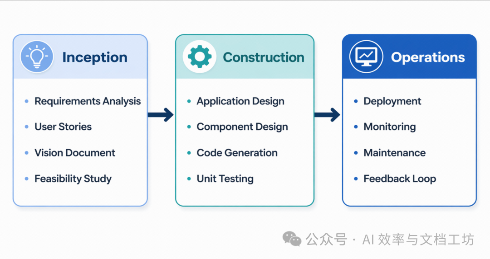

# 给 AI 编程时代的"靠谱乙方"：AWS 开源 AI-DLC，让 AI 编码不再像开盲盒

最近一年，我们手里的 AI 编程工具肉眼可见地多起来：Cursor、Claude Code、Amazon Q Developer、Kiro、GitHub Copilot、Cline……一句"帮我做个登录功能"，AI 真的可以噼里啪啦给你写出来一坨能跑的代码。

但凡稍微做过点中等规模项目的同学应该都有过类似的崩溃瞬间：

- 同一个需求，跟 AI 反复讲三遍，每次给的方案都不太一样；
- 一开始没说清楚这是个简单脚本还是要上线的服务，AI 直接给你上微服务 + Kubernetes；
- 要么写一堆没必要的脚手架，要么关键的安全、测试、非功能需求全靠你自己补；
- 项目稍微复杂点，AI 写到一半忘了前面的设计，开始自由发挥。

简单说：**AI 写代码很快，但缺一种"工程意识"和"流程纪律"。**

最近 AWS 在 GitHub 上开源了一个有意思的项目 —— `aidlc-workflows`[1]，主打的就是给各种 AI 编码助手套上一层 AI 驱动的开发生命周期（AI-DLC, AI-Driven Development Life Cycle）方法论，把 AI + 程序员协作的过程，从开盲盒变成有章法的三阶段流水线。

这篇文章，就来带大家完整看一下：这个仓库到底是什么、解决了什么问题，以及如果你已经在用 Cursor / Claude Code / Q Developer，怎么把它接进自己的项目。

---

## 一句话项目速览

- **项目名称**：AI-DLC（`awslabs/aidlc-workflows`）
- **一句话亮点**：用一套可移植的规则文件（rules / steering files / AGENTS.md），让你的 AI 编码助手**按照标准化的三阶段工作流**完成需求分析、设计、编码与运维准备。
- **背靠**：AWS Labs 官方开源，配套有 AWS DevOps 博客[2]和 Method Definition Paper[3]。
- **License**：MIT-0（基本等价于"随便用"）。
- **主要语言**：Markdown 规则 + Python 工具链（Evaluator / Design Reviewer）。

**关键标签：** `#AI编程` `#AI Agent` `#方法论` `#开发流程` `#Claude Code` `#开源工具`

> Important
>
> 这个项目本身**不是一个新的 AI 模型，也不是一个 IDE 插件**，而是一套喂给 AI 的工作守则。它通过各家 AI 编码工具原生支持的项目规则 / steering / instructions / AGENTS.md 机制工作，所以理论上几乎适配市面所有主流 Agent 类编码工具。

---

## 它到底解决了什么问题？

如果把现在的 AI 编码体验抽象一下，问题大概有三层：

**1）每次都得自己当产品经理 + 架构师，反复回喂上下文。**
你得先告诉 AI "这是新项目还是老项目"、"这是个原型还是要上生产"、"用户是谁"、"非功能性需求有哪些"。任何一个角度漏了，输出就跑偏。

**2）AI 在不同复杂度的需求上"用力过猛或者过轻"。**
小改一个字段，它要给你重写一个模块；要做个真正的服务，它又懒得讨论安全、性能、可观测性。

**3）多人 / 多 Agent 协作时，没有共同语言。**
今天你用 Cursor，明天同事用 Claude Code，再过几个月公司又换 Kiro，AI 输出的风格和产物组织方式完全不一样，根本谈不上工程一致性。

AI-DLC 给出的解法很朴素：**把软件工程方法论显式写出来，让 AI 严格按章办事，并把关键决策点交回给人类拍板。**

它的几个核心理念在仓库 README 里写得很直白（这里我做了一点中文意译）：

- **方法论先行（Methodology first）**：AI-DLC 本质是方法论，不是工具。所以你不需要装任何东西，只要把规则文件放对位置就行。
- **可复现（Reproducible）**：规则要写得足够清晰，不同模型（GPT、Claude、Q、Bedrock 等）读完应该产出相似结果。
- **工具无关（Agnostic）**：不绑定某个 IDE / 模型 / 厂商，谁支持项目级规则就可以用。
- **人在回路（Human in the loop）**：关键决策必须人来确认，AI 提议、人类审批。

读到这里你可能会问：那它具体是怎么落地的？答案就是它的核心——**三阶段自适应工作流**。

---

## 三阶段自适应工作流：把 AI 写代码拆成 INCEPTION → CONSTRUCTION → OPERATIONS



AI-DLC 的灵魂是这条主线：

### 🔵 INCEPTION（构想阶段）— 决定做什么和为什么做

这一阶段，AI 会带你完成：

- 需求分析与校验（避免一开始就跑偏）；
- 必要时生成用户故事（User Stories）；
- 应用层设计，并把工作拆成可以**并行开发的工作单元（Units of Work）**；
- 风险评估与复杂度评估，决定后续要不要"全套上"。

这里有个细节我蛮喜欢：它把问题显式化为**结构化的多选题**，写在文件里，而不是一股脑塞进聊天框。你只要打勾选答案，AI 就会基于这些回答驱动下一步。这套机制的具体规则就放在仓库的 `inception/` 下，文件包括：

- `requirements-analysis.md`
- `user-stories.md`
- `application-design.md`
- `units-generation.md`
- `workflow-planning.md`
- `workspace-detection.md`
- `reverse-engineering.md`（针对老项目反推现状的玩法）

### 🟢 CONSTRUCTION（构建阶段）— 决定怎么做

进入这一阶段时，AI 会接手具体落地：

- 详细的组件级设计；
- 代码生成与实现；
- 构建配置、测试策略；
- 质量保障与验证。

对应的规则文件在 `aws-aidlc-rule-details/construction/` 下，分得很细：

- `functional-design.md` — 功能性设计
- `nfr-requirements.md` / `nfr-design.md` — 非功能需求（性能、安全、可观测等）
- `infrastructure-design.md` — 基础设施层设计
- `code-generation.md` — 代码生成约束
- `build-and-test.md` — 构建与测试

### 🟡 OPERATIONS（运维阶段）— 上线、监控、稳定运行

目前还在快速演进中，文件 `operations.md`，覆盖：

- 部署自动化与基础设施；
- 监控与可观测性；
- 生产就绪检查。

整个工作流最妙的地方在于**自适应（Adaptive）**四个字——**不是每个阶段都跑全套**。AI 会根据需求复杂度，决定哪些子步骤值得做，哪些可以跳过。简单的小改动就走轻量路径，重大变更才会触发完整流程。

> 你可以理解成：以前是 AI 一把梭，现在是"AI 按 SOP 上岗"。

---

## 核心特性 & 亮点：6 个让我觉得"挺有意思"的地方

整理了一下 README、`core-workflow.md` 以及规则细节后，我个人觉得这几点最值得拎出来讲：

**1. 自适应执行（Adaptive Intelligence）**
不是机械地跑完所有阶段，而是只执行对当前请求有价值的步骤。简单需求快速走完，复杂需求自动展开。

**2. 上下文感知（Context-Aware）**
进入项目时，会先做 workspace 检测、识别已有代码结构，然后再决定怎么继续——老项目走反向工程 + 增量路线，新项目走从 0 到 1 路线。

**3. 风险驱动（Risk-Based）**
复杂或高风险变更会被放大处理（更多设计文档、更多验证），低风险任务保持轻量，避免无谓的过度工程。

**4. 问答驱动 + 人在回路**
关键节点不是直接动手，而是把多选题输出成文件，让你勾选确认；只有你 approve 了某个阶段，工作流才会进入下一阶段。这其实极大降低了 AI 自由发挥翻车的概率。

**5. 可扩展的规则体系（Extensions）**
`extensions/` 下默认提供两类样板扩展：

- `security/baseline/`：安全基线规则（仓库特别强调，这是方向性参考，落地前请按自家组织安全要求重写过）；
- `testing/property-based/`：基于属性的测试（property-based testing）。

每个扩展由一对文件组成：规则文件 + `*.opt-in.md`（也就是问用户要不要启用的那道题）。所以你可以叠加自家的合规、性能、隐私规则，不会污染核心工作流。

**6. 不挑工具：一份规则，多端通吃**
仓库针对下面这些工具都给出了**完整的目录结构和命令**，从 macOS、Linux 到 Windows PowerShell / CMD 一应俱全：

- **Kiro / Kiro CLI**：放到 `.kiro/steering/`
- **Amazon Q Developer**：放到 `.amazonq/rules/`
- **Cursor IDE**：通过 `.cursor/rules/ai-dlc-workflow.mdc`
- **Cline**：放到 `.clinerules/`
- **Claude Code**：用 `CLAUDE.md`
- **GitHub Copilot**：用 `.github/copilot-instructions.md`
- **OpenAI Codex / 其他 AGENTS.md 兼容工具**：放一个 `AGENTS.md` 在项目根目录

可以说，**只要你的 AI 编码助手支持"项目级规则"，AI-DLC 都能塞进去。**

---

## 快速上手：5 分钟把 AI-DLC 接到你的项目里

下面以 **Cursor** 和 **Claude Code** 为例（其他工具方法类似，只是放置目录不同）。

### 0. 环境准备

只需要一个能解压 zip 的工具，加一台装好 AI 编码工具的电脑。**不需要装任何 SDK / npm / pip 包**。

### 1. 下载规则包

到仓库 Releases 页面[4]下载最新的 `ai-dlc-rules-v<version>.zip`，解压到本地（比如 `~/Downloads/aidlc-rules/`）。

解压后你会看到两个目录：

```
aidlc-rules/
├── aws-aidlc-rules/          # 核心工作流规则（主入口）
└── aws-aidlc-rule-details/   # 各阶段细节规则（被主入口按需引用）
```

### 2-A. 接入 Cursor（推荐 Project Rules 方式）

```
mkdir -p .cursor/rules

cat > .cursor/rules/ai-dlc-workflow.mdc << 'EOF'
---
description: "AI-DLC (AI-Driven Development Life Cycle) adaptive workflow for software development"
alwaysApply: true
---

EOF
cat ~/Downloads/aidlc-rules/aws-aidlc-rules/core-workflow.md >> .cursor/rules/ai-dlc-workflow.mdc

mkdir -p .aidlc-rule-details
cp -R ~/Downloads/aidlc-rules/aws-aidlc-rule-details/* .aidlc-rule-details/
```

最终目录结构：

```
<my-project>/
├── .cursor/
│   └── rules/
│       └── ai-dlc-workflow.mdc
└── .aidlc-rule-details/
    ├── common/
    ├── inception/
    ├── construction/
    ├── extensions/
    └── operations/
```

打开 **Cursor Settings → Rules, Commands**，能看到 `ai-dlc-workflow` 就说明加载成功。

### 2-B. 接入 Claude Code（最简版）

```
cp ~/Downloads/aidlc-rules/aws-aidlc-rules/core-workflow.md ./CLAUDE.md
mkdir -p .aidlc-rule-details
cp -R ~/Downloads/aidlc-rules/aws-aidlc-rule-details/* .aidlc-rule-details/
```

启动 Claude Code 后，问一句：

> What instructions are currently active in this project?

如果它能讲清楚 AI-DLC 的三阶段工作流，就说明已经生效。

### 3. 实际用起来

在 AI 助手里发起任何一个开发任务时，**用约定的开场白**：

> **Using AI-DLC, 帮我实现 ……**

之后 AI 就会主动：

1. 进入 INCEPTION 阶段，向你确认需求；
2. 在 `aidlc-docs/` 目录里生成结构化的设计与计划文件；
3. 让你**确认每一阶段的产物**，再进入下一阶段；
4. 最终落地代码与配置。

---

## 典型使用场景：什么样的团队会从 AI-DLC 受益？

我自己脑子里想到几个典型场景，给大家做个参考：

**场景 1：从 0 到 1 的内部小工具 / 服务**
你只有一句模糊的需求：帮老板搞个能批量给 Excel 打标的内部工具。AI-DLC 会先逼你回答几个问题：是 CLI 还是 Web？谁会用？数据量级？是否上生产？非功能需求是什么？然后基于答案去设计架构、选技术栈、生成代码。

输入 → 输出对比：

- **传统玩法**：直接帮我写个工具，AI 给你 200 行代码 + 一堆莫名其妙的依赖。
- **AI-DLC 玩法**：先生成一份结构化需求文档与设计文档，再让你勾选是否需要安全基线 / 是否需要测试基线，最后才进入代码生成。

**场景 2：在已有代码库上做增量需求**
对老项目而言，最可怕的是 AI 不看上下文就乱改。AI-DLC 内置了 `reverse-engineering.md` 和 `workspace-detection.md`，会先分析当前代码，再决定怎么改。

**场景 3：团队级 AI 编程规范统一**
公司里有人用 Cursor，有人用 Claude Code，还有人偷偷在用 Q Developer。**把 AI-DLC 规则一次性提交进仓库**，所有人在所有 IDE 看到的 AI 行为方式就一致了——这相当于给团队的 AI 协作建立了共同的"行话"。

**场景 4：合规 / 安全敏感项目**
开启 `security/baseline` 扩展（或基于它定制自家的合规扩展），可以让 AI 在每个阶段都被安全规则挡一道，不通过就不让进入下一步。对金融、医疗、SaaS 类项目尤其友好。

---

## 项目生态 & 周边工具

除了规则文件本身，仓库里还有两个值得一看的辅助工具：

**1. AIDLC Evaluator —— `scripts/aidlc-evaluator/`**
一个自动化测试 & 报告框架，专门用来验证 AI-DLC 的规则更新会不会让输出质量退化。包含：

- 黄金测试用例（Golden Test Cases）
- 执行框架与流水线
- 基于 LLM 的语义评估
- 静态代码分析 / 安全扫描 / 重复代码检测
- NFR 评估（token 用量、执行时长、跨模型一致性）
- CI/CD 集成

启动也很简单：

```
cd scripts/aidlc-evaluator
uv sync
uv run python run.py test
```

适合那些自己 fork 一份去做私有方法论的团队。

**2. AIDLC Design Reviewer（Experimental）—— `scripts/aidlc-designreview/`**
基于 AWS Bedrock 上的 Claude 模型，对 AI-DLC 生成的设计文档做多 Agent 评审：

- **Critique Agent**：找问题；
- **Alternatives Agent**：给出替代方案；
- **Gap Analysis Agent**：找缺失。

最后输出加权严重度的质量评分和可执行建议。两种部署形态：CLI 工具（适合 CI/CD）和 Claude Code Hook（开发实时评审，目前实验性）。

```
cd scripts/aidlc-designreview
uv sync --extra test
source .venv/bin/activate
design-reviewer --aidlc-docs /path/to/aidlc-docs
```

---

## 一些值得注意的小细节（避免踩坑）

如果你打算把 AI-DLC 用起来，下面这几点最好提前知道：

- **AI-DLC 不会替你全自动开发**。它是一套显式的"流程 + 多选题"机制，关键节点要你审。如果你只想一句话 vibe coding，它反而会让你觉得啰嗦。
- **安全基线扩展只是参考方向**。仓库 README 里特别写了一句：每个组织都应基于自家安全要求，**重写并测试**这套规则后再上生产，**不要把它当成开箱即用的合规方案**。
- **rules 文件较大时要小心 IDE 限制**。比如 Cursor 上规则文件超过 500 行可能要拆分；Codex 默认有 `project_doc_max_bytes` 上限，超了要在 `config.toml` 里调高。
- **Windows 下路径要用正斜杠**。这个仓库的 README 里专门提了。
- **生成式 AI 仍可能出错**。仓库开头的 IMPORTANT 提示也是这个意思——任何输出都建议你过一遍，特别是涉及成本和上线的部分。

---

## 结语：把 AI 写代码升级成 AI 按工程方法写代码

回到一开始的那句吐槽：**AI 写代码很快，但缺一种工程意识和流程纪律**。

AI-DLC 给我的感觉，就是 AWS Labs 拿出来的一份"工程纪律外挂"：

- 它不是又一个 IDE 插件，而是一套**直接喂给 Agent 的方法论**；
- 它把需求 → 设计 → 编码 → 运维的关键节点显式化、结构化；
- 它让 Cursor / Claude Code / Q Developer / Kiro / Cline / Copilot 在你的项目里**遵循同一套规则**；
- 它让人审 AI 变成默认值，而不是事后救火。

如果你正好属于以下任一类人：

- 想让自己每天用的 AI 编码工具靠谱一点；
- 团队要统一 AI 编程协作流程；
- 对 AI 驱动的开发方法论本身感兴趣；
- 想做企业级 AI 编程规范、合规、安全规则；

那这个仓库非常值得你花半小时看一遍 README，再花十分钟接到自己的项目里跑一遍。

最后，别忘了：

- ⭐ 顺手给项目点个 Star：github.com/awslabs/aidlc-workflows[1]
- 📖 配套阅读 AI-DLC 方法论 Paper[3] 和 AWS DevOps Blog[2]
- 🛠 在自己项目里 fork 一份规则，叠加自家"安全 / 合规 / 性能"扩展
- 💬 有想法直接去仓库提 Issue / PR，目前项目还在快速演进，是上车的好时候

> 在 AI 编码工具越来越强的 2025 年，谁掌握了"如何指挥 AI"的方法论，谁就掌握了下一个十年的工程效率。

——希望这篇文章对你有帮助。如果觉得不错，欢迎转发给身边在被 AI 编码"惊吓"或者"惊喜"的朋友。

#### 引用链接

`[1]` awslabs/aidlc-workflows: *https://github.com/awslabs/aidlc-workflows*
`[2]` AWS DevOps 博客: *https://aws.amazon.com/blogs/devops/ai-driven-development-life-cycle/*
`[3]` Method Definition Paper: *https://prod.d13rzhkk8cj2z0.amplifyapp.com/*
`[4]` Releases 页面: *https://github.com/awslabs/aidlc-workflows/releases/latest*
