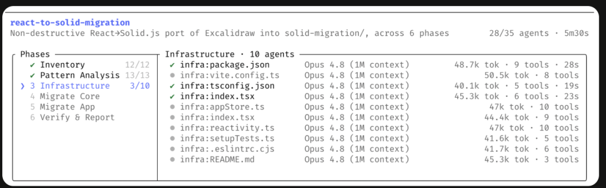

# 你还在一句句指挥 AI，Anthropic 已经让它自己派一群分身去干活了

事情是这样的。

最近这段时间我天天用 Claude Code 干活，已经习惯了那种节奏，我说一句，它做一步，我看一眼，再说下一句。就像旁边坐了个实习生，活是它干，但手得我一直扶着。它要去改个文件，先问我行不行；它要跑个命令，再问我一次。我盯着，它动，我们俩一来一回，慢慢往前挪。

这套节奏我用得挺顺，也没觉得有什么不对。

直到前几天 Anthropic 悄悄上了个东西，叫动态工作流，英文是 Dynamic Workflows，跟着 Opus 4.8 一起发的。我本来没太当回事，名字听着就很技术，很像那种发布会上一闪而过、跟我没关系的功能。



结果我试了两天，愣住了。

不是因为它多厉害，是因为我突然意识到，AI 干活的姿势，好像从根上变了一下。

我下面慢慢说，尽量讲人话。哪怕你不写代码，也建议看看，因为这事聊的根本不是代码，是以后人和 AI 到底怎么配合干活。

......

## 现在的用法：你是总指挥

先说说大部分人现在是怎么用 AI 的。

你打开一个对话框，敲一句话，它回你一段。不满意，你再补一句，它再改一版。你要它做一件复杂的事，你得自己在脑子里把这件事拆成十几步，然后一步一步喂给它，这一步做完了，你检查一下，再告诉它下一步该干嘛。

这个过程里，真正那个总指挥，是你。

计划在你脑子里，进度在你脑子里，这一步出来的结果要不要带到下一步，也是你拍板。AI 很聪明，但它干的是一段一段的执行，那根串起全局的线，攥在你手里。你一走神，或者中间忘了上一步说过啥，整件事就容易乱。

我特别理解这种用法，我自己也用了大半年。它的好处是你有掌控感，每一步你都看得见。但坏处也很明显，你被钉死在那把椅子上了。你不能走开，因为你一走开，那个总指挥的位置就空了。

动态工作流想换掉的，正是这件事。

## 动态工作流是什么

那它到底是个啥，我用一句大白话说。

**你给它描述一个目标，Claude 不再是一步步陪你做，而是先把整个干活的计划，写成一段代码，然后这段代码在后台自己跑，跑的时候会派出一大群分身同时干活，干完了，回来给你一份已经核对过的结果。**

你没看错，是先写成一段代码。

官方的说法是，一个动态工作流就是一段 Claude 自己写的 JavaScript 脚本，一个专门的运行环境在后台执行它，与此同时你的对话窗口照样能用，不卡着你。

我第一次看到这个设计的时候，反应是，啊，原来可以这样。

因为这等于把那根攥在你手里的总指挥的线，搬进了代码里。循环也好，分支也好，这一步的结果要不要传给下一步也好，全写在脚本里了。脚本自己管着这些事，AI 的脑子，也就是它那个有限的上下文窗口，就被腾出来了，只用来装最后那个答案。

这个区别听着有点绕，我换个说法。

## 对比：以前 vs 现在

前阵子我写过一篇，聊多 Agent 到底是不是伪概念，里面说了一个意思，AI 干得好不好，很大程度上看它脑子里这次装了啥，装得越杂越乱，它越蒙。

动态工作流这事，刚好能接着往下讲一层。

你平时用 Claude 派小弟干活，也就是大家说的子智能体，subagent，那个流程是这样的，Claude 一回合一回合地决定下一个派谁去、干啥，每个小弟干完的结果，都得回到 Claude 自己的脑子里，由它读一遍、消化掉，再决定下一步。活儿一多，它脑子就开始堆东西，堆满了就乱。

动态工作流换了个玩法，那张总进度表不在 Claude 脑子里了，在脚本里。下一步派谁、这步结果存哪、什么时候该收口，是脚本说了算。中间那些乱七八糟的过程数据，都待在脚本的变量里，不往 AI 脑子里塞。等全跑完，才把最后结论交给你。

| 对比维度 | 你平时指挥 AI | 动态工作流 |
| --- | --- | --- |
| 谁定下一步 | 你或 AI，一回合一回合来 | 脚本自己定 |
| 中间结果放哪 | 堆在 AI 的脑子里 | 存在脚本变量里 |
| 规模 | 一回合派几个 | 一次几十到几百个 |
| 能不能复用 | 下次重新指挥一遍 | 脚本存下来，下次直接跑 |

看这张表你大概能体会到，这不是把同一件事做快了一点，是换了一个组织方式。前者像你一个人带实习生，后者像你写了一份作业流程，然后甩给一支队伍去并行执行。

## 实际玩法：从简单到离谱

光说概念有点虚，我带你看看我实际是怎么玩的，从简单到离谱，一个一个来。

### 第一层：现成工作流

最省事的入口，是它自带了一个现成的工作流，叫 **/deep-research**，深度调研。我随手丢了个问题进去。

```
/deep-research Node.js 从 20 到 22，权限模型到底改了啥
```

敲下去之后，它没有像平时那样直接开始噼里啪啦给我答案，而是先弹出来问我一句，要不要允许这个工作流跑。我点了允许，然后它就钻到后台去了。

这时候神奇的事发生了，我的对话窗口居然还能用。它在后台从好几个角度撒出去搜，把搜到的资料互相交叉比对，哪条说法对不上、活不下来，就给筛掉，最后只给我一份带出处的报告。整个过程我没盯着，去干别的了。

想看它跑到哪了，敲一个 **/workflows** 就行，会列出来现在正在跑的和已经跑完的。点进去是个进度面板，每个阶段花了几个分身、烧了多少 token、跑了多久，写得清清楚楚，你还能钻进某个分身里看它具体在干啥、查到了啥。

### 第二层：自己写工作流

再往上一层，是让它给我自己的活儿写一个工作流。方法很笨，你在话里带一个关键词 **ultracode**，或者干脆直接说"帮我用 workflow 跑"，它就懂了。

```
ultracode，把 src/routes 下面每个接口都查一遍，看有没有漏掉鉴权的
```

这一句下去，它没有自己埋头一个文件一个文件地翻，而是先给我写了一段编排脚本，把这事拆成几个阶段，每个阶段派多少个分身去查哪几块，列得明明白白，然后问我，这个计划行不行，要不要看一眼原始脚本。我看了一眼，确认，它就放出去跑了。

说实话这一下我有点上头。因为我描述的是一个目标，它还给我的是一套可以读、可以改的执行方案。

还有更骚的。如果你嫌每次都打关键词麻烦，可以直接 **/effort ultracode**，把整个会话切到这个挡位，之后你提的每个像样的任务，它都会自己琢磨要不要起一个工作流，一句话能拆成好几个工作流接力，一个负责看懂代码，一个负责改，一个负责验。

### 第三层：沉淀为可复用的命令

最后这一层，是我觉得最戳我的。

某次跑出来一个结果我挺满意，进度面板里按一下 **s**，它就把这段脚本存成了我自己的一个命令，下次直接打 **/我的命令** 就能再跑同一套编排。你还能给它传参数，比如把要处理的一串问题、一堆路径丢进去，脚本自己接着用。

你品一下这个味道。第一次是你描述目标，AI 帮你把活的做法沉淀成了一段代码。从第二次开始，这段代码就成了你的资产，你不用再描述了，你只管按一下。

那个总指挥的位置，慢慢从你脑子里，挪到了代码里。

## 真正值钱的是结构，不是数量

聊到这我得拐回来说一句重点，不然你可能以为这玩意的卖点就是人多力量大，派的分身够多。

不是的。真正值钱的，不是数量，是结构。

把计划写进代码之后，你能干一件单次对话里很难干的事，**固定一套质量套路**。官方举的例子我觉得特别到位，你可以让几个互相独立的分身，对着同一份结论做对抗式审查，一个负责找证据支持，另一个专门负责挑刺、想办法推翻它，谁也别想糊弄过去。也可以让它从好几个角度各画一版方案，然后摆在一起互相掂量，挑出最靠谱的那个，再交给你。

这跟你在对话框里让它一遍过，是两种东西。一遍过靠的是它这一次的发挥，而这种是把审查、交叉验证、相互否定，做成了流程的一部分，每次跑都会执行。

Anthropic 自己说，他们拿它做整个代码库的安全审计、上百个文件的大迁移、清理没人用的死代码这种活。Klarna 的工程师也提到，在大型代码库里做发现和审查特别好用，尤其找死代码，效果很顶。

这些活有个共同点，单靠一个脑子顺着做，要么做不完，要么做着做着就漏了，因为它们需要的不是聪明，是把同一种检查，结结实实地、不偷懒地，铺到每一个角落。

## 实用提醒：坑和边界

夸了这么多，按惯例我得泼点冷水，真诚是唯一的捷径，有坑我直接告诉你。

1. **烧 token。** 一次派出去几十上百个分身，token 的消耗比你在对话里干同一件事高出一大截。别一上来就拿整个项目去跑，先切一小块试，看看花销和效果对不对得上。进度面板里能实时看每个分身烧了多少，随时能喊停。

2. **研究预览阶段。** Pro 要去设置里手动打开，企业版默认关的需要管理员开。对 Claude Code 版本有要求，太老的没有。

3. **中途插不了话。** 它认准了计划就往下跑，没法跑到一半改主意。想分阶段确认得自己把大事拆成几个小工作流，一段一段来。

4. **暂停续跑限同会话。** 关了 Claude Code 再开，跑着的工作流从头来，不接上次。

5. **上限保护：** 同时最多 16 个分身，单次最多 1000 个，省得脚本写飞了无限繁殖。

它绝不是什么都往里塞的银弹。日常一个小修小改，老老实实在对话框里说一句更快。它的主场是那种又大、又重复、又必须铺满每个角落的活。

## 不写代码的人也能看懂的变化

我知道说到这，可能有小伙伴已经在心里嘀咕了，阿丸你讲的全是写代码，我又不是程序员，这跟我有啥关系。

但你把"代码"这两个字先盖住，看剩下的骨架。它说的其实是，**一件又大又繁琐的活，你不再亲手一步步做，而是先把做法理清楚、定成一套流程，再让一群分身铺开去并行干，最后你只验收。**

这个骨架，跟代码一点关系都没有。你想想你手上那些活，把一百份简历按同一套标准筛一遍，把上百篇竞品文章扒下来交叉比对找规律，把一年的合同逐条查有没有漏掉的风险条款。这些事，今天你是不是也得自己一份一份、一篇一篇地啃？

开发者这边只是先吃到了这套吃法而已。工具会迭代，但这种从亲手做、变成定流程加验收的姿势，迟早会一点点漫到我们每个人的工位上。今天在程序员那儿叫动态工作流，过两年到你这，可能就是某个你天天打开的软件里，一个不起眼的按钮。

提前看懂这个姿势的人，到时候不会慌。

## 结尾：从操作员到架构师

写到这，我其实没那么关心代码本身了。我关心的是那个姿势的变化。

你想想看，从手抄书到活字印刷，变的不是字写得好不好看，是一个人不用再一笔一画地抄了，他可以去排版，去决定印什么。从手工作坊到流水线，变的也不是单件做得多精，是人从亲手做每一道工序，挪到了设计工序、盯着结果。

每一次这种变化，都有人慌，觉得自己那点手艺要没用了。但回头看，真正被淘汰的从来不是手艺人，是那些只肯守着旧姿势、不愿意挪位置的人。

动态工作流这事，我觉得就是 AI 干活里的一次挪位置。会用 AI 的人，正在从一个一直坐在椅子上、一句句喊口令的操作员，慢慢变成一个描述目标、设计流程、然后验收结果的人。前者拼的是你陪它陪得够不够久，后者拼的是你想得够不够清楚。

这两件事，难度根本不在一个量级，价值也不在一个量级。

AI 越来越能自己组织一支队伍干活了，那留给人的活，就越来越不是去做，而是去想清楚要做什么、怎么算做好了。

还记得开头那个画面吗，我盯着实习生，手一直扶着，不敢走开。

现在我可以走开了。但我得先想明白，到底要它去干什么。

**能不能放手，从来不取决于那个干活的，取决于发指令的那个人，心里有没有谱。**
