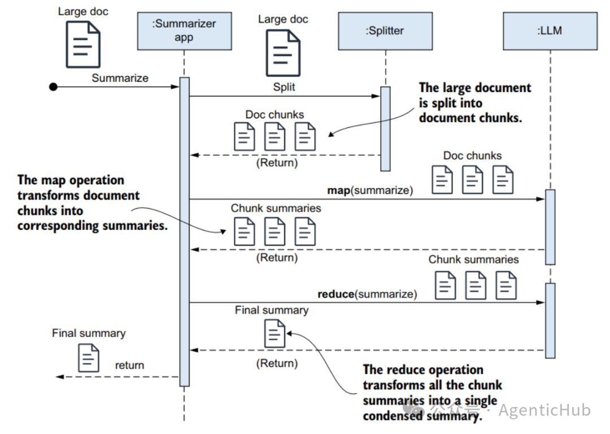
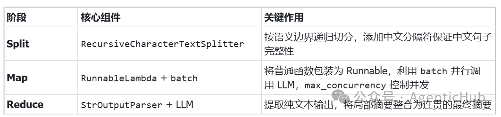

# 10分钟学会用LangChain+MapReduce实现单篇超长大文本总结

尽管当前 LLM（大模型）的上下文窗口已扩展至百万级 Token，但文本总结与摘要的必要性并未因此消减，反而因模型注意力机制的内在局限而愈发凸显。

- **一方面**，自注意力机制的计算复杂度随序列长度呈**平方级增长**，导致超长上下文面临**巨大的算力消耗与成本压力**；
- **另一方面**，模型在处理海量信息时存在"注意力衰减"与"信息过载"问题，往往表现出首因效应和近因效应，容易**遗漏埋藏在文本中部的关键细节或隐含前提**。

因此，通过摘要进行信息压缩与结构化提炼，不仅能有效过滤噪音、降低计算负担，还能引导模型将有限的注意力精准聚焦于核心逻辑与高价值信息，从而在长文本处理中保障输出的准确性与连贯性。

我们可以用 **MapReduce** 的方法总结超出 LLM 上下文窗口的单篇大文档。



MapReduce 方法解决超出 LLM 上下文窗口限制的技术思路，核心在于"分而治之"与"化整为零"，具体流程如下：

1. **Split（拆分阶段）**：由于原始文档的长度超过了 LLM 单次处理的最大 Token 限制（Context Window），系统需要先利用分割器将这篇巨大的文档切分成多个较小的、能够被 LLM 完整容纳的文本块。这一步是将不可处理的大任务转化为可处理的小单元的基础。

2. **Map（映射/局部总结阶段）**：系统将上一步生成的每一个文本块独立地发送给 LLM，要求模型对每个块分别进行摘要或总结。这一过程是并行的或逐个进行的，目的是提取出每个局部片段的核心信息，生成一系列对应的"块摘要"。此时，原本冗长的原文被压缩成了若干个精简的中间结果。

3. **Reduce（归约/全局汇总阶段）**：系统将 Map 阶段产生的所有"块摘要"收集起来，再次组合成一个新的、较短的文本序列。如果这些摘要的总长度依然在 LLM 的处理范围内，就直接让 LLM 对这组摘要进行最终的整合与提炼；如果依然过长，甚至可以递归地重复上述过程。最终，LLM 输出一个涵盖全文核心内容的单一最终摘要。

**总结来说**，这种方法通过物理上的切割规避了长度限制，通过逻辑上的"先局部概括、后全局整合"，既保证了长文档能被完整处理，又有效利用了 LLM 的归纳能力，解决了"大海捞针"时的注意力分散问题。

---

## 1. Split

我们可以按照文本字符长度进行拆分：

```python
text_splitter = RecursiveCharacterTextSplitter(
    chunk_size=3000,
    chunk_overlap=100,
    separators=[
        "\n\n", "\n", "。", "！", "？", "；", "，", " ", ""
    ],
)

text_chunks_chain = RunnableLambda(text_splitter.split_text)
```

- **chunk_size=3000**：每个文本块的目标大小（以字符数估算，中文约 1 字符 ≈ 1 token）。3000 token 对大多数 LLM 来说是一个安全的单次处理量。
- **chunk_overlap=100**：相邻 chunk 之间的重叠字符数。这个设计非常关键——它确保不会因为切割点恰好落在关键信息中间而导致信息丢失。相邻 chunk 共享 100 个字符的"缓冲带"。
- **separators**：文本分隔符。

### RecursiveCharacterTextSplitter 的文本分隔符

RecursiveCharacterTextSplitter 的默认分隔符列表为：`["\n\n", "\n", " ", ""]`

这是一个从粗到细的递归降级策略：**段落(\n\n) → 行(\n) → 单词( ) → 字符("")**

它的工作方式是：优先尝试用粗粒度的分隔符切分。如果切出来的某一块仍然超过 chunk_size，就降级到下一个更细粒度的分隔符继续切，直到每个块都满足大小限制。

默认分隔符是为英文设计的——英文用空格分词，用换行分段。但中文没有空格分词，句子之间靠标点符号分隔。

**如果不添加中文分隔符**，分割器在降级到 `" "`（空格）这一层时，对纯中文文本几乎无效（中文文本中很少有空格），最终只能退化到 `""`（逐字符切割），这会把一个完整的句子拦腰截断，严重破坏语义。

因此代码中添加了中文标点分隔符：
```
separators=["\n\n", "\n", "。", "！", "？", "；", "，", " ", ""]
```

这样递归降级的顺序变为：
**段落(\n\n) → 行(\n) → 句子(。！？) → 子句(；，) → 单词( ) → 字符("")**

每个 chunk 都能在中文句子边界处断开，保证了语义的完整性。

### RunnableLambda

RunnableLambda 是 LangChain 中一个非常重要的"胶水"组件。它的作用是：**将一个普通的 Python 函数包装成 LangChain Runnable 对象。**

一旦被包装，这个函数就自动获得了以下能力：

- `.invoke() / .ainvoke()`：同步/异步调用
- `.stream() / .astream()`：流式输出
- 原生 Tracing 支持：自动向 LangSmith 上报执行轨迹
- **可组合性**：通过 `|` 管道符与其他 Runnable 串联：上一个 Runnable 对象输出将作为下一个 Runnable 对象的输入。

我们的代码中将会多次用到 RunnableLambda。

---

## 2. Map

现在我们已经能够将一篇长文本切分成多个 chunk（子块），那么我们就可以对 chunk 进行总结：

```python
map_prompt = ChatPromptTemplate.from_messages([
    (
        "system",
        "你是一个专业的文本摘要助手。请用简洁精炼的语言对以下文本片段进行摘要..."
    ),
    (
        "human",
        "请对以下文本进行摘要：\n\n{text}"
    ),
])

llm = get_llm()
summarize_single_chain = map_prompt | llm | StrOutputParser()
```

因为每个 chunk 的总结 chain 是独立工作的，所以接下来我们将要**并行**对多个 chunk 进行总结：

```python
def parallel_summarize(chunks: List[str]) -> List[str]:
    """使用 batch() 并行对所有 chunk 进行摘要"""
    if not chunks:
        return []
    return summarize_single_chain.batch(
        [{"text": chunk} for chunk in chunks],
        config={"max_concurrency": 5},
    )

summarize_map_chain = RunnableLambda(parallel_summarize)
```

### StrOutputParser

StrOutputParser 是 LangChain 中最简单的输出解析器。它的作用是：
**从 ChatModel 返回的 AIMessage 对象中提取纯字符串内容。**

具体来说，当你调用 `llm.invoke(prompt)` 时，返回的是一个 AIMessage 对象，其中 `.content` 字段才是真正的文本。StrOutputParser 自动完成这个提取过程，让你拿到的直接就是字符串，无需手动 `.content`。

### batch()

- 接收一个输入列表 `[{"text": chunk1}, {"text": chunk2}, ...]`
- **并行**地对每个输入调用 `summarize_single_chain`
- 返回一个与输入顺序一致的结果列表

**max_concurrency=5 的作用：**
- 控制**最大并发数**为 5
- 如果文档被切成了 20 个 chunk，不会同时发起 20 个 LLM 请求
- 而是最多同时运行 5 个，完成一个再启动下一个

这样做的好处是：
- 避免触发 API 速率限制（Rate Limit）
- 控制本地资源消耗（内存、网络连接数）
- 在并发效率和稳定性之间取得平衡

> **注意**：`batch()` 的并行是**客户端侧**的并发，不同于 OpenAI/Anthropic 等服务商提供的 Batch API（后者是服务端异步批处理，通常有延迟但成本更低）。

---

## 3. Reduce

现在我们开始总结所有 chunk 的总结。`join_summaries` 将 Map 阶段产出的所有局部摘要拼接成一个带编号的大文本。`【第N部分摘要】` 标记帮助 LLM 理解每段摘要对应原文的哪个部分，从而更好地按原文逻辑顺序组织最终输出。

```python
def join_summaries(summaries: List[str]) -> dict:
    """将所有 chunk 摘要拼接为带标记的文本"""
    combined = "\n\n---\n\n".join(
        f"【第{i + 1}部分摘要】\n{s}"
        for i, s in enumerate(summaries)
    )
    return {"summaries": combined}

summarize_reduce_chain = RunnableLambda(join_summaries) | reduce_chain
```

Reduce Prompt 的设计非常关键：

- **保持逻辑连贯**：不能只是简单罗列，要形成流畅的叙事
- **去除重复信息**：不同 chunk 可能涉及相同内容，需要去重
- **按原文逻辑顺序组织**：尊重原文结构

```python
reduce_prompt = ChatPromptTemplate.from_messages([
    (
        "system",
        "你是一个专业的文本摘要助手。现在有一组分段摘要..."
        "请将这些分段摘要整合成一篇完整、连贯的总体摘要。"
    ),
    (
        "human",
        "以下是从原文各部分提取的分段摘要，请整合为一份完整的总体摘要：\n\n{summaries}"
    ),
])
```

---

## 4. 最终整合与测试

最后，我们使用《西游记》前 7 回进行测试：

```python
map_reduce_chain = text_chunks_chain | summarize_map_chain | summarize_reduce_chain

with open(test_file, "r", encoding="utf-8") as f:
    document = f.read()

final_summary = map_reduce_chain.invoke(document)
```

完整的一条链：

```
text_chunks_chain  →  summarize_map_chain  →  summarize_reduce_chain
     Split                  Map                    Reduce
```

---

## 回顾与总结

回顾整个实现，MapReduce 长文档摘要的精髓在于：

> 这种"先局部概括、后全局整合"的策略，既绕开了 LLM 的上下文窗口限制，又充分发挥了 LLM 的归纳总结能力，是处理长文档摘要任务的经典范式。

**源码地址：**
[https://github.com/realyinchen/AgentLab/blob/main/Summarization/01_single_large_docuement.py](https://github.com/realyinchen/AgentLab/blob/main/Summarization/01_single_large_docuement.py)


