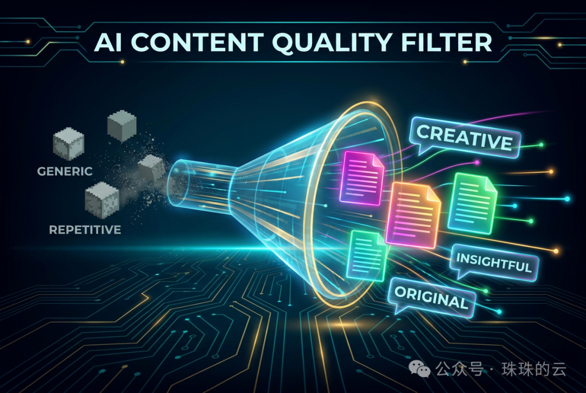

# 昨天GitHub被AI"屠榜"了，但这波风向变了

如果你昨天（6月9日）刷过 GitHub Trending，估计会被满屏的 AI 项目晃了眼。

没错，现在的榜单几乎被 AI Agent 生态承包了。但有意思的是，大家不再只盯着"谁家的模型又变强了"，而是开始疯狂搞"基建"和"外挂"。

挑了几个昨天涨星最猛、也最有意思的项目，不吹不黑，咱们聊聊这背后的门道。

---

## 1. 给 AI 装上"千里眼"：Agent-Reach

做 AI Agent 的朋友肯定有个痛点：想让 AI 帮你去 Twitter、Reddit 或者小红书抓点数据，要么得写爬虫，要么得掏昂贵的 API 费用。

昨天冲上热榜的 **Agent-Reach** 就是来砸场子的。它直接给 AI 装上了一双能看全网的眼睛，一套 CLI 命令行横扫各大社交平台，重点是：**零 API 费用**。对于想低成本跑通信息流闭环的开发者来说，这玩意儿简直是神器。

---

## 2. 向量搜索卷到"极致性能"：TurboVec

如果说上个月还在讨论大模型，这个月大家已经开始死磕底层检索了。**TurboVec** 一周涨了 1600+ Star，凭什么？

因为它把 Rust 的性能和 Python 的易用性缝合在了一起。专门针对量化交易和 RAG 系统，搜索速度比传统方案快了 10 到 100 倍。这说明啥？说明 AI 应用已经从"能不能用"进入了"拼响应速度"的阶段。毫秒级的延迟，才是真金白银。

---

## 3. 洗掉"AI味"的解药：Stop Slop / Taste-skill

现在用 AI 写东西太容易了，但也太容易被一眼看穿了。那种"值得注意的是"、"总而言之"的八股文，看着就让人头大。

最近社区里出了两个反套路项目。一个是 **Stop Slop**，像个拿着红笔的冷面编辑，直接把那些机械、套路的废话从稿子里请出去；另一个是 **Taste-skill**，教你怎么用 Prompt 让 AI 写出真正有"人味"的设计和内容。说白了，现在的读者不好糊弄了，光有干货不行，你还得说"人话"。

---

## 4. 你的私有全能工作台：Odysseus

云端 AI 好用，但隐私是个雷；本地开源工具安全，但功能太碎。瑞典顶流 YouTuber PewDiePie 牵头搞的 **Odysseus** 昨天狂揽星标，就是因为它把这两件事捏在了一起。

基于 Docker 一键部署在个人电脑或 NAS 上，数据全留本地。不仅能多模型对话，还能自己联网搜资料、管邮件、排日程。在这个数据主权越来越重要的节点，这种"自托管一体化"绝对是刚需。

---

## 写在最后

看懂了昨天的榜单，其实就看懂了现在的风向。

以前我们觉得代码是资产，现在发现，经验和技能（Skill）也是资产。当这些能力像 npm 包一样可以被安装、被调用时，AI 开发的门槛才算真正被踏破。
