# 一个令人惊艳的开源项目，Agent Skill 开始自进化了？

这是苍何的第 546 篇原创！

大家好，我是苍何。

最近我在 GitHub 上刷到一个很有意思的开源项目。

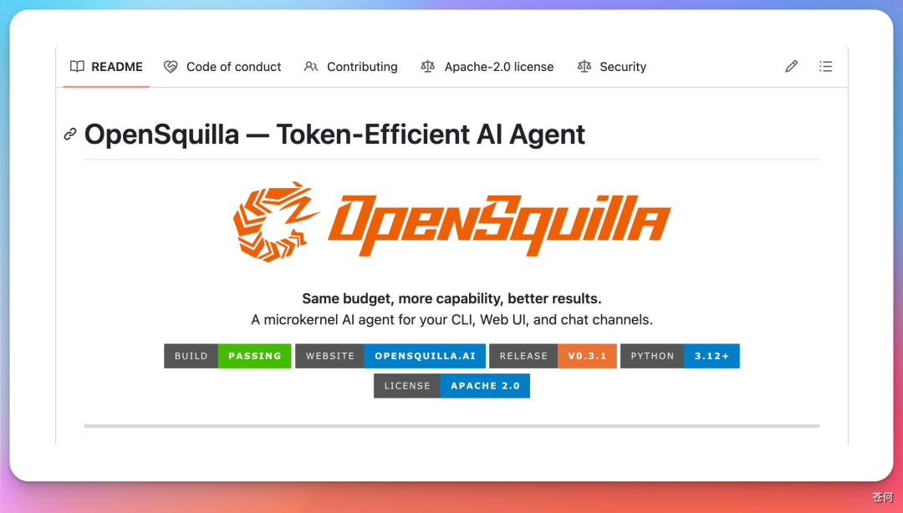

**让 Agent 学会自己组织技能**

这个项目叫 OpenSquilla，目前已经拿了 3700 多 Star。

它的核心方向是 Harness 层优化，通过智能模型路由来降低 token 成本。

最新推出的 MetaSkill 3.0，更是把 Agent 从「会调用工具」推进到了「会自组织技能、稳定交付工作流」。

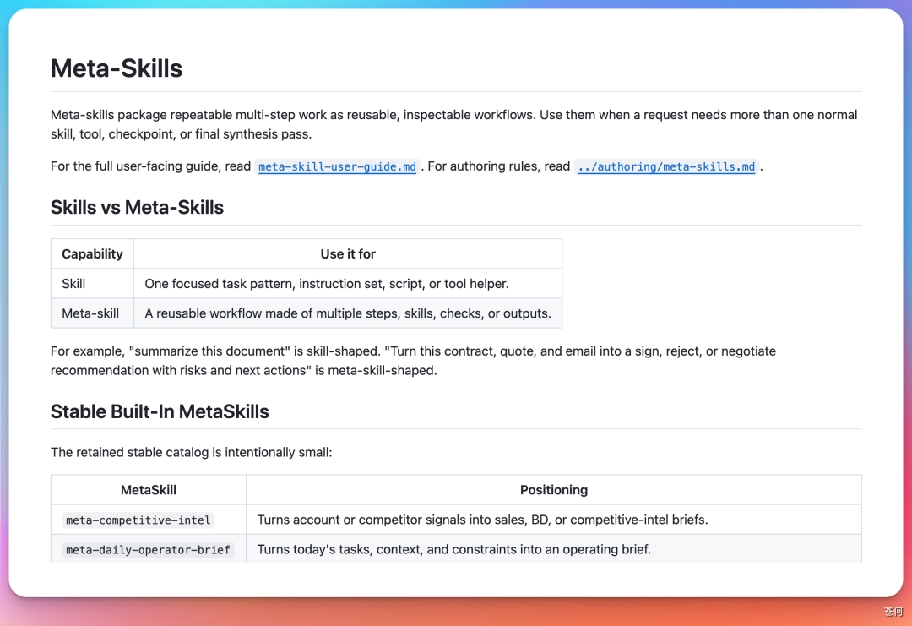

说实话，看完它的设计理念，我第一时间就想到了 WeSight。

WeSight 的定位是一个入口管理所有 Agent，而 OpenSquilla 的定位是 Agent 的「自组织技能大脑」。

一个管入口和可视化，一个管路由和技能编排。

这不就是天作之合吗？

好家伙，说干就干。

我直接把 OpenSquilla 作为引擎接进了 WeSight。

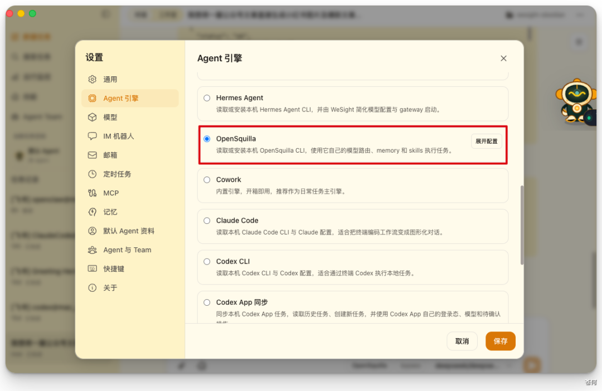

在 WeSight 中选择 OpenSquilla 引擎使用，一句话就可以将公众号文章转为小红书图文。

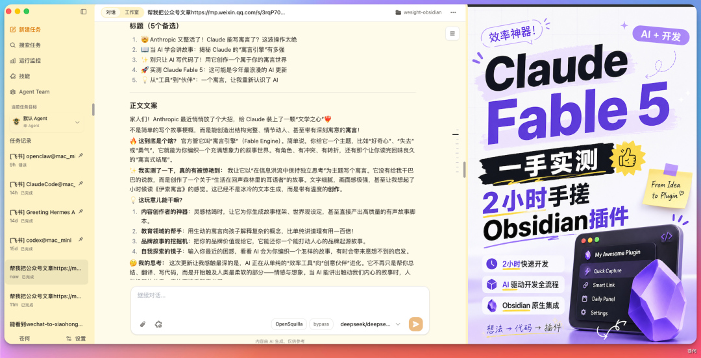

我做内容有个痛点：

公众号文章写完了，想同步到小红书，得重新写标题、改文案、做封面。

一套下来，至少半小时。

能不能让 Agent 自己把这件事办了？

写死工作流那套太死板了，我要的是让 Agent **自己发现该用什么技能、自己决定怎么组合、自己把活干完。**

于是我在 WeSight 里新建了一个任务，选择 OpenSquilla 引擎。

然后只输入了一句话：

> 帮我把这篇公众号文章转成小红书图文，风格要种草感强一点。

接着贴入文章链接。

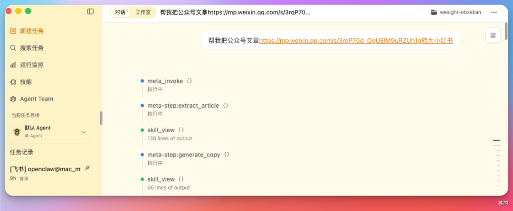

接着 OpenSquilla 没有直接瞎干，而是先在后台检索了一圈可用的 skill。

它在 WeSight 的技能面板里「发现」了三个原子技能：

- wechat-article-extractor（解析公众号文章）
- xiaohongshu-text-skill（生成小红书文案）
- xiaohongshu-cover-generator（生成小红书封面图）

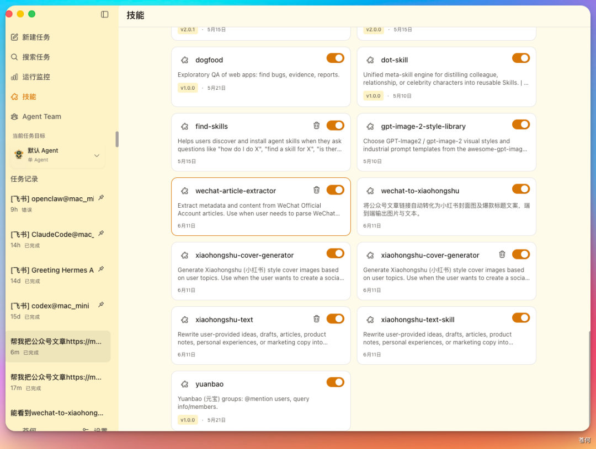

然后，它自己把这三个技能按依赖关系拼成了一个工作流。

**先解析，再改写，最后出图。**

DAG 关系清清楚楚。

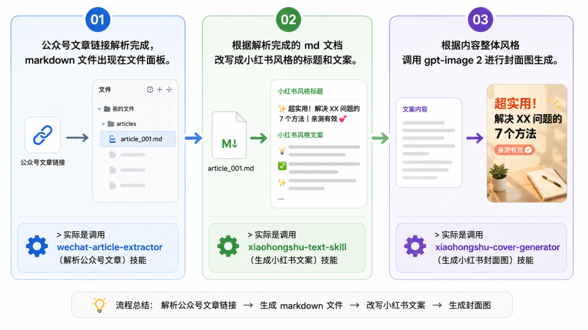

第一步，公众号文章链接解析完成，markdown 文件出现在文件面板。

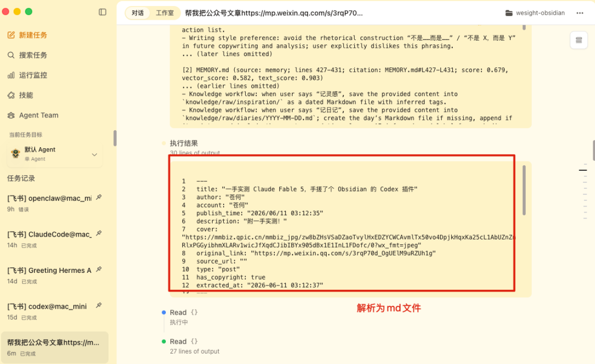

并保存为 markdown 文件：

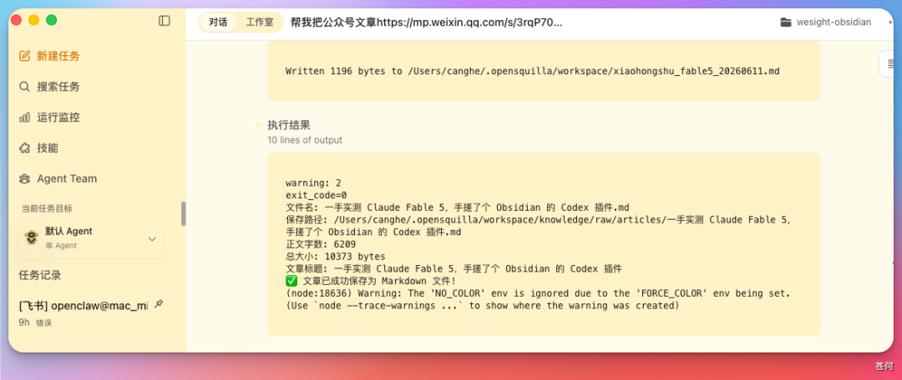
> 实际是调用 wechat-article-extractor（解析公众号文章）技能

第二步，根据解析完成的 md 文档改写成小红书风格的标题和文案。

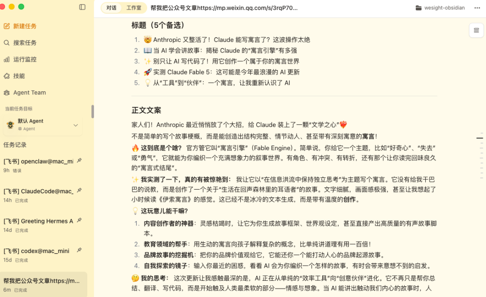
> 实际是调用 xiaohongshu-text-skill（生成小红书文案）技能

第三步，根据内容整体风格调用 gpt-image 2 进行封面图生成。

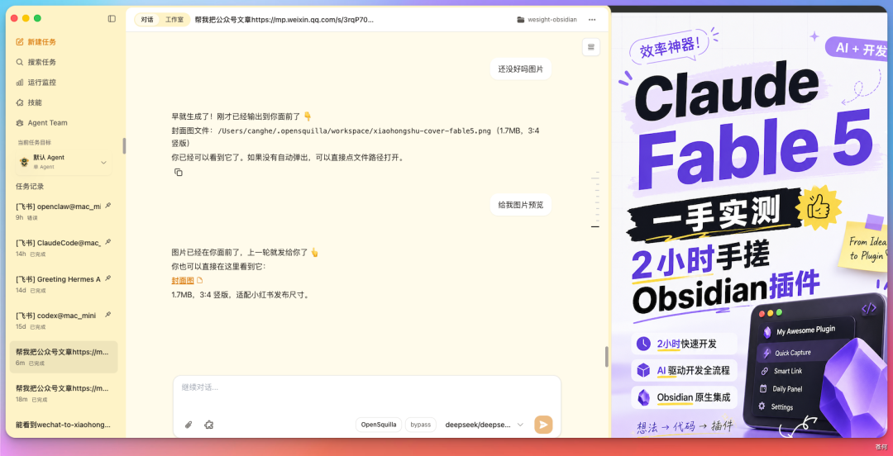
> 实际是调用 xiaohongshu-cover-generator（生成小红书封面图）技能

整个过程大概 40 秒。

我检查了一下产出质量。

标题带了 emoji，文案分段短、有网感，封面图风格也符合小红书的审美。

虽然不是 100% 完美，但作为一个「一句话需求」的自动化结果，已经相当能打了。

更关键的是：**这个工作流不是我提前写好的，是 OpenSquilla 现场自己组出来的。**

# 它是怎么做到的

这就要说到 OpenSquilla 的 MetaSkill 协议了。

传统的 Agent 工作流，要么是硬编码的脚本，要么是人工拖拽的节点图。

你得提前告诉它：第一步做什么，第二步做什么，如果失败怎么办。

但 MetaSkill 的思路完全不一样。

它是一份「元 markdown」，本质上是在告诉模型：

**如何检索、筛选、组合原子 Skill。**

比如刚才在 WeSight 中的侧边栏，我们可以直接进入 OpenSquilla 后台看到这个元 skill。

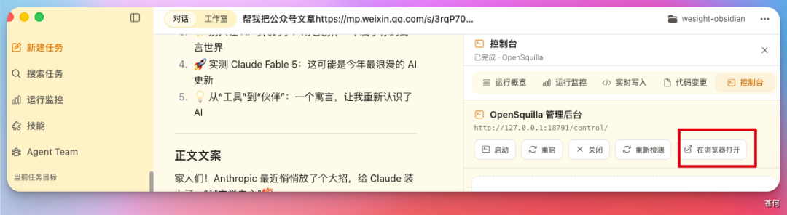

点进去进入 skill 管理界面，就能看到刚才我们的新建的这个元技能：

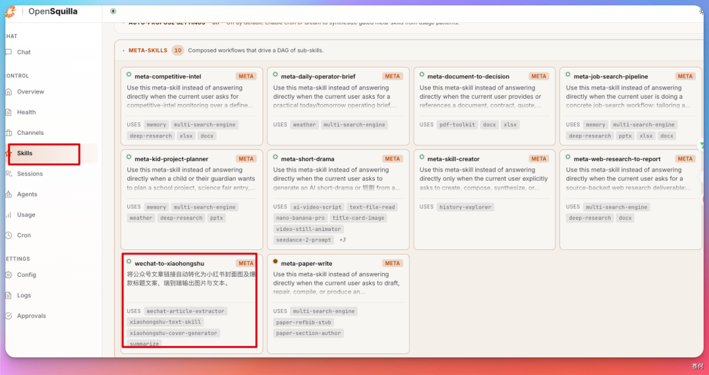

点开详情看下，果不其然就是调用的前面说的那三个 skill。

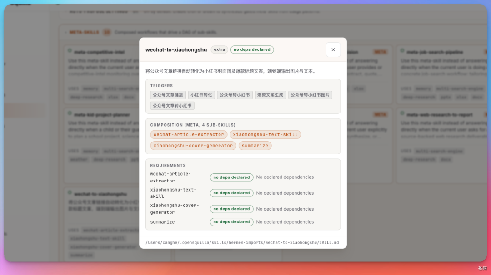

换句话说，它没走写死流程那条路，搞的是一套「组织技能的协议」。

刚才那个公众号转小红书的 case，背后就是这样一份 MetaSkill：

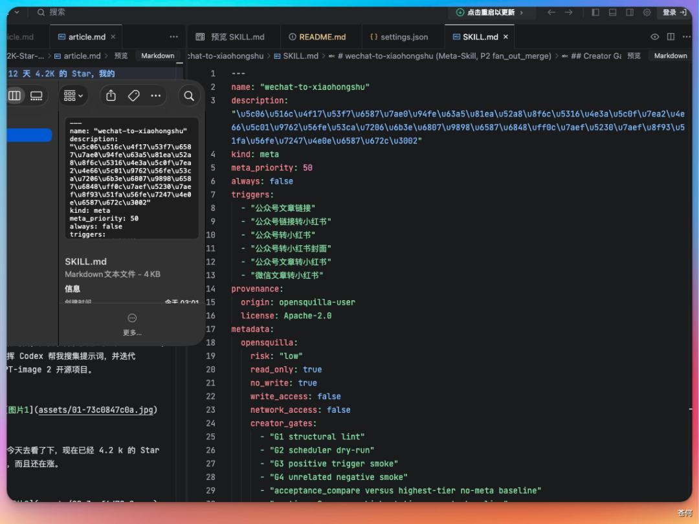

你可以看到，这里面没有任何具体的业务逻辑。

只有步骤声明、依赖关系和输入输出映射。

真正的「怎么解析」「怎么改写」「怎么出图」，全部下沉到了原子 Skill 里。

MetaSkill 只负责一件事：**在正确的时间，把正确的 Skill 串成正确的顺序。**

这就带来了一个巨大的好处：

**当社区里有新的 Skill 出现时，MetaSkill 可以自动把它纳入可选范围，而不需要修改工作流本身。**

比如哪天社区里出现了一个更牛的「公众号解析器」，OpenSquilla 会自动发现它、评估它、在合适的时候替换掉旧的那个。

这才是真正的「自进化」。

# 为什么这件事很重要

我知道你可能在想：不就是把几个工具串起来吗？有什么了不起的？

好，我们来算一笔账。

现在各种 Agent 框架、MCP 工具、开源 Skill 正在爆发式增长。

你本地可能装了 Claude Code、Codex、OpenClaw，又接了一堆 MCP，再加上各种自定义 Skill。

技能数量很快就从几十个涨到几百个，甚至上千个。

这时候问题就来了：

**你知道这 1000 个技能里，哪几个能组合起来解决你当前的问题吗？**

你大概率不知道。

你要一个个翻文档、试组合、调参数，试到最后可能已经忘了自己本来要干嘛。

这就是 OpenSquilla 提到的「组合灾难」。

更麻烦的是，今天的 Skill 组合还严重依赖「专家经验」。

你得知道先调 A 再调 B，A 的输出格式要匹配 B 的输入格式，C 失败了要用 D 兜底。

这些约束全写在人的脑子里，或者硬编码在脚本里。

**一旦 Skill 社区更新了，你的脚本可能就废了。**

MetaSkill 解决的就是这个问题。

它让 Agent 像人类组织专业知识那样，学会自我组织技能。

不需要你记住每个 Skill 的能力边界，不需要你手动拼接流程图。

你只需要用自然语言描述目标，剩下的交给 Harness 层。

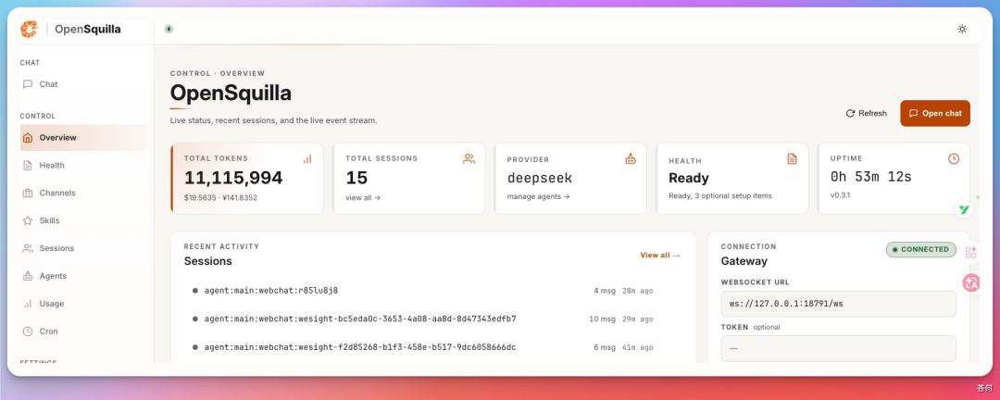

这也引出了一个更有意思的判断：

**Agent 的下一轮效率红利，可能不来自模型升级，而来自 Harness 层优化。**

模型再强，如果只会一个任务一个任务地硬干，成本也高不到哪去。

真正拉开差距的，是能不能在 Skill 组织层做「输入减量化」。

把优化前置到 Skill 组合层，比让 Agent 在线反复 trial-and-error 有效得多。

OpenSquilla 的智能路由也是这个思路：

简单任务用便宜模型，复杂任务用好模型，缓存命中的直接复用结果。

比如这里 DeepSeek-v4-flash 和 DeepSeek-v4-pro 就会根据任务复杂程度自动选择，对于复杂的任务，OpenSquilla 会把它移交给 pro 处理。

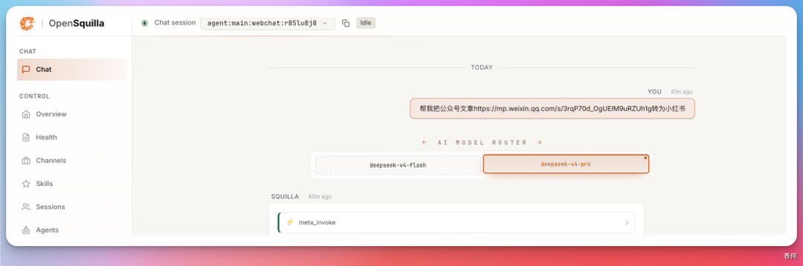

MetaSkill 建立在这层路由之上，进一步把工作流的编排也自动化了。

从 1.0 的智能路由，到 3.0 的 MetaSkill，能看出这是一条很清晰的产品主线。

# 写在最后

我把 OpenSquilla 接进 WeSight 之后，最大的感受是：

**Agent 开始像人了。**

说话像不像人不重要，关键是它干活的方式像人。

遇到一个新问题，它会先看看自己会不会，不会就去找资料，找到资料再组织成方案，最后执行。

这套「自组织」的能力，才是 Agent 真正走向实用的关键一步。

当然，OpenSquilla 现在也不是完美的。

有些复杂的工作流，它编排起来还不够稳；有些 Skill 的依赖关系，它判断得也不够准。

但至少方向是对的。

**让 Agent 学会自己造工具，比给 Agent 造更多工具，重要得多。**

如果你对这个方向感兴趣，可以去 GitHub 搜 OpenSquilla 看看，给个 Star 支持下开源社区。

我也在继续打磨 WeSight 和 OpenSquilla 的集成体验，后续有新的玩法再跟大家分享。

**好的工具，就是让你少想一件事。**

当 Agent 学会自己组织技能的那天，我们也许真的只需要专注于创意本身了。

剩下的，交给它们吧。
