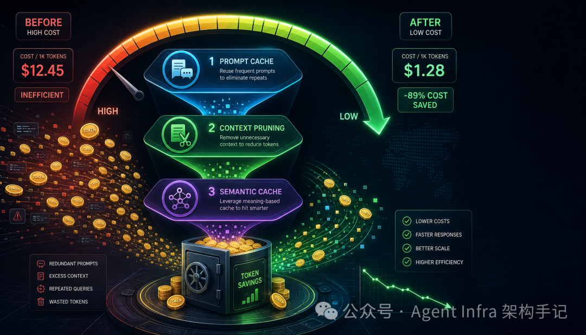
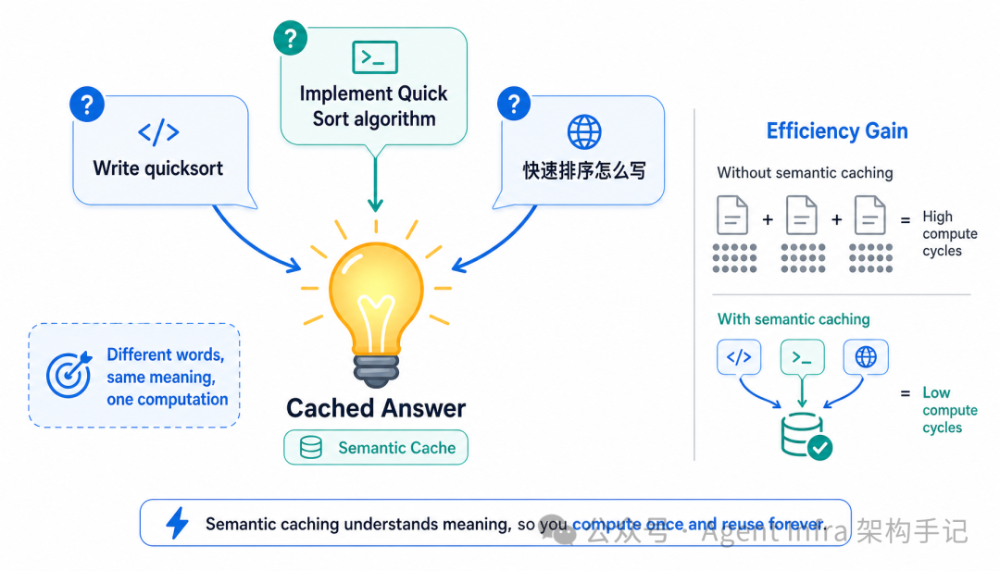
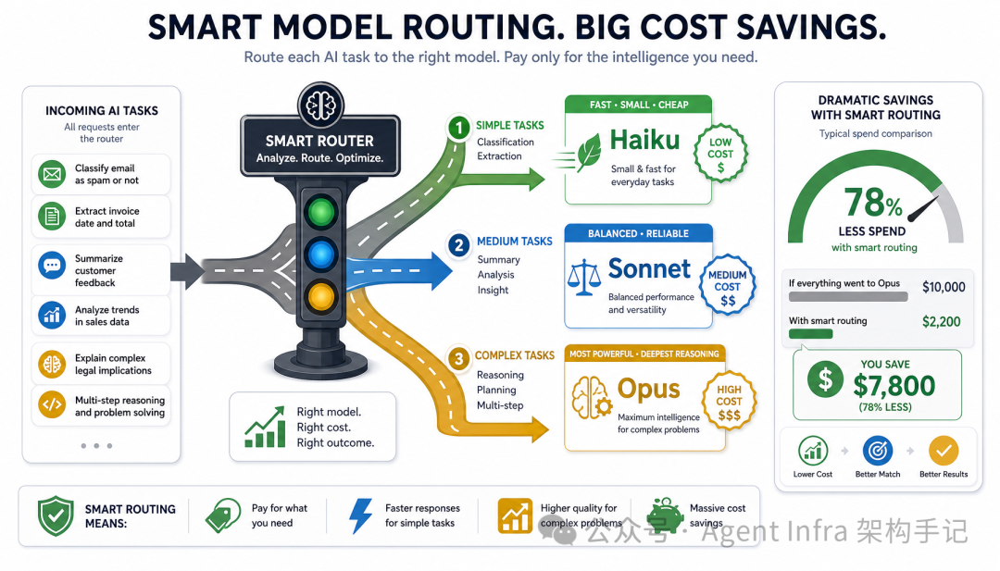
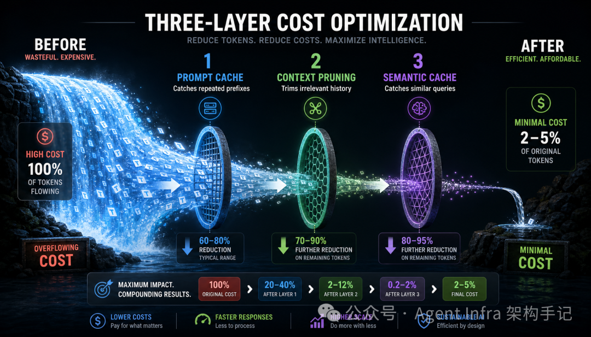

# Token 成本优化：从 Prompt Cache 到语义缓存

> Symbio 进化论 Vol.8 — Agent 系统上线一个月，Token 账单 $12,000，60% 花在重复事情上。五层优化框架从 Prompt Cache 到语义缓存，月成本从 $225 降到 $11（-95%）。

## 概述

Symbio 框架作者针对 Agent 系统的 Token 成本问题，提出**五层递进式优化架构**：Prompt Cache（相同前缀只算一次）→ 上下文剪枝（删除无关历史）→ 语义缓存（相似问题只答一次）→ 模型路由（用对的模型做对的事）→ 工具懒加载（只注入需要的工具描述）。每层各砍一刀，组合优化实现 **-95% Token 消耗、-84% 响应延迟**。

## 核心优化框架

### 第一层：Prompt Cache — 相同前缀只算一次

Anthropic/OpenAI 等模型支持 Promot Cache：多个请求前缀相同时缓存计算结果，后续只计算新增部分。

**关键：前缀必须完全一致。** 一个字的差异导致缓存失效。

Symbio 强制规范前缀顺序：系统提示词 → 全局记忆 → 工具定义 → DAG状态 → 对话历史 → 用户输入。将前缀构造写为确定性函数（`stable_prompt_prefix`），用 sha256 校验 cache_key 稳定性。

| 平台 | 工程语义 |
|------|----------|
| OpenAI | 长提示词自动缓存，账单见 cached tokens |
| Anthropic | 显式 `cache_control` 标记断点，默认短 TTL |
| 自建层 | 网关侧记录 prompt hash + 模型 + 命中率 |

**TTL 保活策略**：Anthropic 的 Cache 仅 5 分钟存活期。Symbio 每 4 分钟发极小 Ping（~10 tokens）维持热度，成本 $0.01/天。

### 第二层：上下文剪枝 — 不是所有历史都有用

20 轮对话后 Token 涨 8 倍（3.8K → 31.8K）。三种剪枝策略：

| 策略 | Token 节省 | 信息损失 |
|------|-----------|---------|
| 滑动窗口（10轮） | 60% | 高 |
| **语义相关度剪枝** | 50-70% | 低（推荐） |
| 重要性加权剪枝 | 40-60% | 极低 |

推荐语义相关度：计算每轮与当前问题的 embedding 相似度，仅保留相关度高的历史。

### 第三层：语义缓存 — 相似问题只答一次

不同表述的相同问题（"快速排序算法" / "实现快速排序" / "Quick Sort in Python"）只消耗一次 LLM 调用。

**三层判断**：余弦相似度 > 0.92 → 上下文版本匹配 → TTL 有效。

**Verified Cache**：缓存的不只是裸答案，而是一组可验证材料（evidence_ids + context_version + policy_version）。命中的前提是"差不多且仍然可验证"。

**失效策略**：时间过期（7天）→ 上下文变更 → 命中次数上限（1000次）。

**实际命中率 ≈ 34%** — 三分之一的请求零 Token 消耗。

### 第四层：模型路由 — 用对的模型做对的事

80% 简单任务（分类/提取）→ Haiku/8B 本地模型（$0.25/M）
15% 中等任务（代码生成）→ Claude Sonnet（$3/M）
5% 复杂任务（架构设计）→ Claude Opus（$15/M）

效果：成本 -79%，延迟 -44%，质量损失 < 2%。

### 第五层：工具懒加载 — 不要带着全套装备跑全场

全量工具描述 ~3,000 tokens/请求 → 注意力稀释（工具选择准确率 78%，幻觉率 12%）。

**两级懒加载**：
1. **项目级静态隔离** — 前端项目只挂 UI 工具，后端项目只挂 DB/API 工具
2. **DAG 节点级动态懒加载** — Orchestrator 为每个节点声明需要哪些工具，执行时只注入这几个工具 Schema，用完即卸载

效果：工具描述 Token -90%（3,000 → 300），工具选择准确率 +20%（78% → 94%），幻觉率 -58%（12% → 5%）。

## 五层协同效果

| 指标 | 无优化 | 五层优化 | 节省 |
|------|--------|----------|------|
| 日均 Token 消耗 | 2.5M | 120K | **-95%** |
| 月均成本 | $225 | $11 | **-95%** |
| 平均响应延迟 | 3.2s | 0.5s | -84% |

## 成本监控与预算管理

Symbio 内置监控仪表盘：总 Token 消耗、各 Agent 消耗、各任务类型消耗、缓存命中率、模型路由分布、工具懒加载率、异常消耗告警。

**预算熔断**：当消耗超 80% 时进入降级策略——缩短上下文、降低输出上限、切换模型，必要时将低优先级任务排队。

## 关键洞察

1. **Prompt Cache 的第一步不是写缓存代码，而是把上下文布局固定下来** —— 动态内容（时间戳、随机 ID、工具排序）破坏稳定前缀，使缓存无效
2. **语义缓存比 Prompt Cache 风险更高** —— 两个问题相似不意味着答案可复用（权限/版本/数据过期），需要 verified cache + 证据链
3. **工具懒加载不仅省钱，还让模型更聪明** —— 减少注意力稀释，工具选择准确率 +20%、幻觉率 -58%
4. **成本优化是生死攸关的问题，不是锦上添花** —— 用户增长 100 倍 → Token 成本增长 100 倍 → 利润被吞噬

## 与现有工具链的对照

| 维度 | Symbio 方案 | Hermes Agent（当前） |
|------|------------|-------------------|
| Prompt Cache | 确定性前缀排序 + 心跳保活 | 无原生支持（依赖 provider） |
| 上下文剪枝 | 语义相关度（embedding） | 无（全量历史保留） |
| 语义缓存 | Verified Cache + 证据链 | 无 |
| 模型路由 | 80/15/5 三级路由 | 无（单一模型贯穿） |
| 工具懒加载 | 项目级 + DAG 节点级 | 全量 skill 加载（已提优化方向） |

其中 **上下文剪枝** 和 **工具懒加载** 是当前 Hermes 最直接可借鉴的点——Hermes 的 summarization middleware 和 skill 渐进式加载已经在路线图上，这篇文章提供了具体的实现参考（语义相关度剪枝 + 两级懒加载）。

## 系列位置

| 卷号 | 主题 |
|------|------|
| Vol.1 | 过早完成 → 三层防御 |
| Vol.2 | 对话通信 → 零对话状态驱动 |
| Vol.3 | 任务编排 → 动态 DAG 拓扑中枢 |
| Vol.4 | 记忆系统 → 本体论驱动的认知图谱 |
| Vol.5 | 安全防护 → Prompt Injection 三层防火墙 |
| Vol.6 | 数据飞轮 → 越用越聪明的自进化闭环 |
| Vol.7 | HITL → 异步人类审批网关 |
| Vol.8（本篇） | **Token 优化 → 从 Prompt Cache 到语义缓存** |

## 归档日志

- 2026-07-19 归档
