> 拆解一个 AI 客服系统背后的产品架构、技术架构、工程细节和上线效果

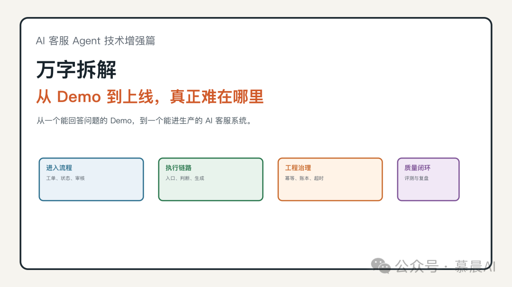

我一开始也以为，AI 客服最难的是让模型回答得像客服。

后来真把它放进客服流程里，发现不是。

模型能不能说出一段顺口的话，反而是最早解决的问题。

真正麻烦的是：

这张工单现在还能不能交给 AI？

人工客服是不是已经接手了？

客户最后一句"好的"到底是新问题，还是上一轮对话的补充？

模型查到的事实来自哪里？

生成出来的是草稿，还是已经能发给客户？

这一批任务失败了，能不能知道每张工单卡在哪一步？

改了一个场景，另一个场景有没有被误伤？

这些问题不解决，AI 客服就只能停在 Demo。

所以这篇我想把 AI 客服 Agent 拆成四层讲清楚：

产品上，它到底插在客服流程的哪一层。

技术上，它为什么不能只是一个模型接口。

落地时，哪些工程细节决定能不能上线。

上线后，应该看哪些效果指标，而不是只看"生成了多少回复"。

> AI 客服 Agent 不是"模型替客服说话"，而是让模型在真实客服流程里，受控地参与判断、生成、审核、写回和复盘。

## 01 先看产品：AI 客服到底插在业务流程的哪一层？

AI 客服 Demo 很容易做出效果。

拿一段客户问题。

拼一点知识库。

加几句客服话术要求。

模型通常能生成一段看起来不错的回复。

如果只看这个瞬间，很容易觉得 AI 客服已经能用了。

但真实客服系统不是一个聊天框。

客户的问题通常已经进入工单系统。

工单有状态，有渠道，有历史评论，有人工客服处理记录，也有内部协作痕迹。

一张工单可能刚创建，也可能已经被人工接走。

可能还在等客户补资料，也可能已经进入升级流程。

甚至本地系统里看起来还可以处理，远端工单系统里已经发生了变化。

所以从产品设计上看，AI Agent 不能站在客服系统外面，直接接管客户。

它更像插在工单流程里的一个受控处理节点。

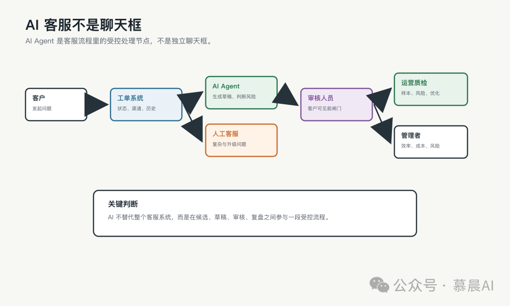

这个节点要先理解几件事。

第一，它不替代整个客服系统。

工单系统仍然是业务现场。

对话、状态、渠道、标签、分派、历史记录都在这里。

AI Agent 如果绕开工单系统，就等于绕开真实业务状态。

第二，它不直接替代人工客服。

人工客服处理的是复杂问题、敏感问题、升级问题，以及 AI 不应该继续处理的问题。

AI 的价值不是把所有问题都吞掉，而是把可控、标准、低风险的部分先处理起来。

第三，它输出的不是最终回复，而是可审核的草稿。

草稿意味着它是候选结果，不天然等于客户可见回复。

这件事很关键。

一旦把"生成草稿"和"发送给客户"混成一个动作，后面所有审核、评测、灰度、回滚都会变得很危险。

第四，它的闭环不是"答完"，而是"生成、审核、写回、复盘"。

AI 客服上线后，运营和质检要看通过率、拒绝原因、风险样本、覆盖范围。

管理者要看效率、成本、响应时间、满意度和风险。

研发要看失败原因、幂等状态、批次结果、接口超时和回归退化。

所以产品上的核心不是"让 AI 多答一点"。

而是让 AI 在正确的工单、正确的状态、正确的边界里参与处理。

一张工单交给 AI 前，至少要走过这样的链路：

候选 -> 判断 -> 生成 -> 审核 -> 写回 -> 复盘。

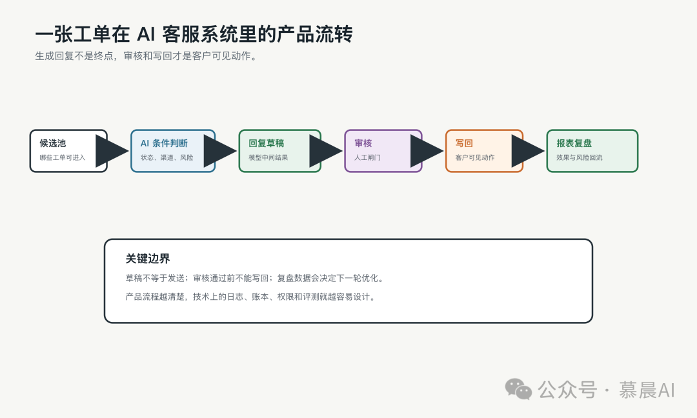

候选池解决的是：哪些工单可以被 AI 看见。

条件判断解决的是：这张工单此刻能不能由 AI 处理。

回复草稿解决的是：AI 可以给出什么候选答案。

审核解决的是：这条回复能不能进入客户可见链路。

写回解决的是：在最终发送前，工单状态是否仍然允许继续。

复盘解决的是：这次处理能不能被追踪、统计和改进。

到这里，产品架构其实已经决定了技术实现的大方向。

如果产品上需要审核，技术上就必须区分"草稿"和"发送"。

如果产品上需要复盘，技术上就必须保留日志、账本和状态。

如果产品上允许人工介入，技术上就必须在关键节点重新确认工单现场。

产品边界没想清楚，后面的代码一定会越写越乱。

## 02 再看技术：为什么它不能只是一个模型接口？

很多 AI 客服系统一开始都是一个模型调用。

输入一段上下文。

输出一段回复。

这个形态能跑 Demo，但撑不住真实流程。

因为真实系统里，入口会越来越多。

一开始可能只有批处理任务。

后来会加 MQ/消息队列里的实时触发。

再后来客服想手动点一下预览。

测试同学还希望用同一套逻辑跑回归评测。

如果这些入口各写一套逻辑，系统很快就会分裂。

批处理里会跳过的工单，实时消息里可能又被处理。

预览链路里看起来安全的回复，正式写回时却没有同样的状态检查。

评测链路里跑出来的结果，和生产链路真实结果对不上。

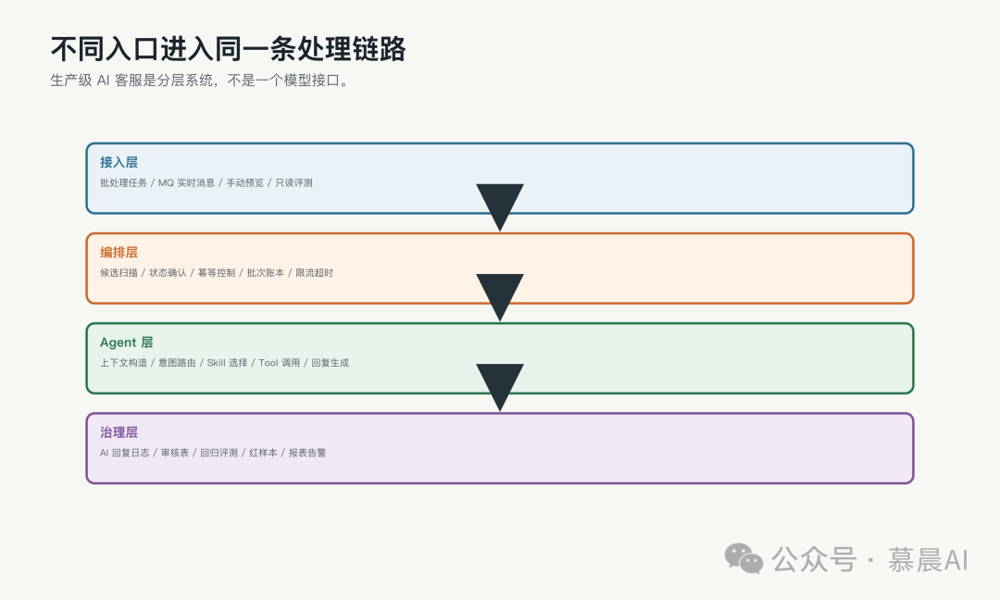

所以技术架构上，第一件事是把入口和处理语义分开。

入口只负责触发。

批处理、实时消息、人工预览、只读评测，都可以进来。

但进来以后，要经过同一套状态确认、幂等控制、限流退避、超时控制和权限判断。

这些控制不负责让模型说得更漂亮。

它们负责让模型在正确的时间、正确的状态、正确的边界内被调用。

第二件事，是把 Agent 内部拆开。

真正可生产的 Agent，不是一个超级 Prompt。

它更像一条受控执行链。

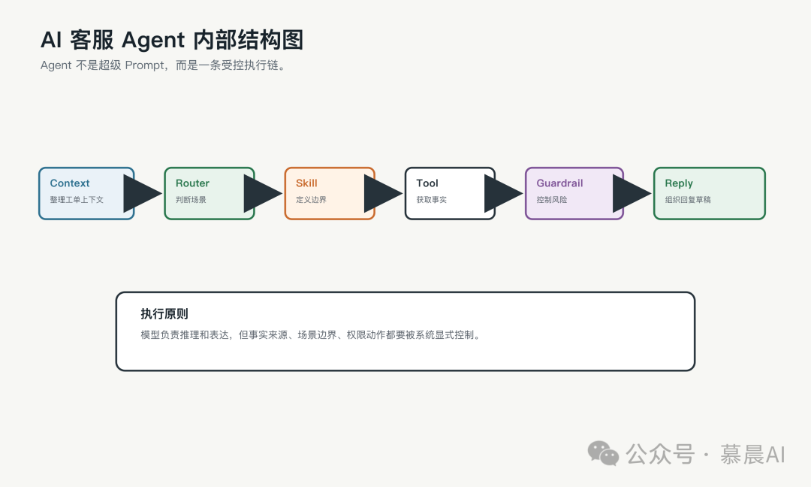

第一步是 Context Builder。

它负责把工单整理成模型能理解的上下文。

这里不能只拿客户最后一句话。

真实对话里，客户最后一句经常不是完整意图。

可能只是一个订单号。

可能只是"好的"。

可能只是补了邮箱、邮编、截图。

如果系统只看最后一句，就很容易把补充信息当成新问题。

所以它要看最近评论，按时间排序，区分客户、人工客服、历史 AI 回复和内部信息。

它要识别最新客户诉求，也要避免历史 AI 回复污染当前判断。

第二步是 Router。

Router 决定当前问题应该归哪个场景处理。

是订单状态。

是退款进度。

是售前商品咨询。

是退货资格。

还是应该进入其他兜底场景。

Router 不能只靠关键词。

客户提到"退款"，不代表一定能按公共退款政策回复。

如果他问的是自己的退款进度，就必须查动态事实。

第三步是 Skill。

Skill 不是一段提示词片段。

它定义这个场景能处理什么、不能处理什么、需要哪些事实、什么时候必须退出、输出应该遵守什么规则。

一个成熟 Skill 要有正向边界，也要有禁入边界。

比如出现商品名，不一定就是售前商品问题。

如果客户说的是已经收到后颜色不对，那更像售后问题。

第四步是 Tool。

Tool 决定事实从哪里来。

客户说"我已经退了货"，这只是线索。

订单状态、退款状态、商品库存、地址、邮箱、物流进度，应该来自工具或系统事实。

第五步是 Guardrail。

它负责约束高风险动作。

人工已经接手时要停。

客户要求人工时要停。

缺少事实支撑时不能编。

涉及写操作时要有更强确认。

第六步是 Reply Composer。

它把上下文、工具事实、Skill 规则组织成客户能读懂的回复草稿。

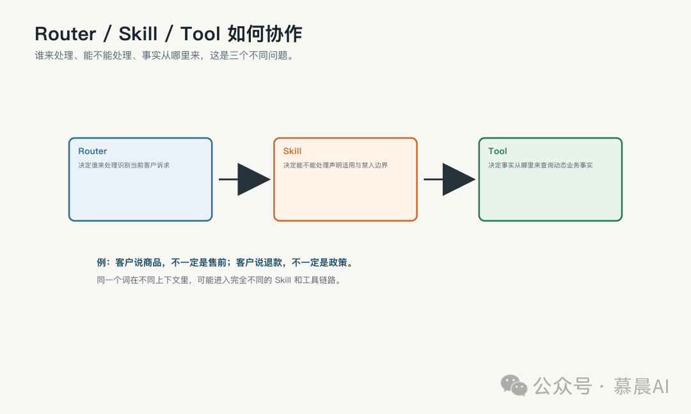

可以用一句话概括：

Router 决定谁来处理。

Skill 决定能不能处理。

Tool 决定事实从哪里来。

模型负责推理和表达，但不能替代这三件事。

第三件事，是把写回动作从 Agent 中剥离出来。

Agent 可以返回草稿、判断、工具轨迹、风险原因。

但"能不能发出去"，应该由外层流程决定。

因为生成回复和客户可见动作，不是同一个风险级别。

回复草稿是模型输出。

AI 回复日志是系统审计。

审核表是人工确认。

写回工单系统才是客户可见动作。

这四件事必须分开。

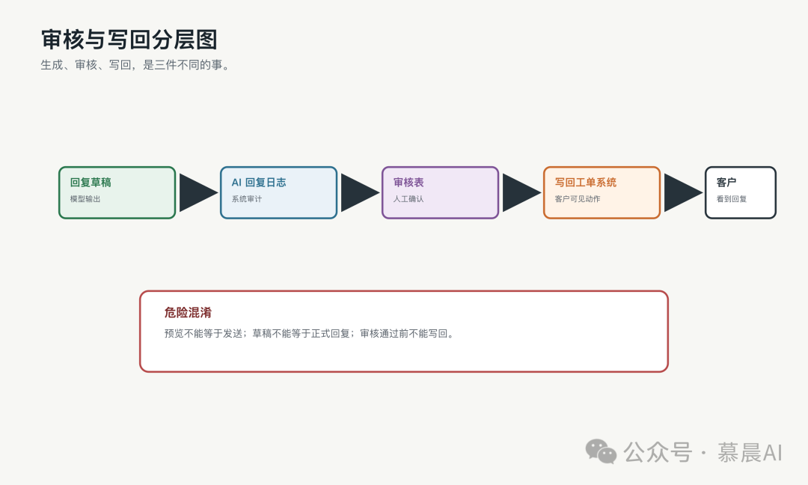

如果混在一起，就会出现很危险的情况：

预览变成发送。

草稿变成正式回复。

审核结果和模型结果混淆。

测试数据进入正式统计。

所以技术上要明确：

预览链路只读。

评测链路只读。

审核通过前不能写回。

写回前要再次确认工单状态。

客户可见动作要有最后一道闸门。

这套拆分看起来比一个模型接口复杂很多。

但它换来的是可控性。

后面要做审核、灰度、回归、报表、复盘时，才不会每一步都在补洞。

## 03 真到落地：决定能不能上线的不是 Prompt，而是工程细节

很多 AI 客服项目能跑 Demo，但卡在生产化。

原因不一定是模型完全不能用。

更多时候，是工程控制不够。

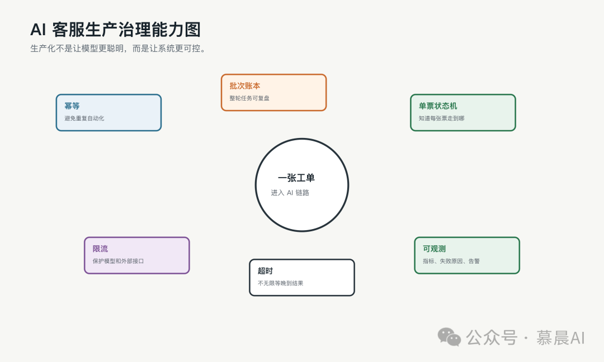

第一个细节是幂等。

生产里，同一张工单可能被多条链路碰到。

批处理扫到一次。

实时消息触发一次。

人工点预览一次。

任务失败后重跑一次。

下一轮定时任务又扫到一次。

如果没有幂等，同一张工单可能重复调 Agent、重复生成回复、重复写 AI 回复日志，甚至重复写回客户可见系统。

所以系统要设计处理钥匙。

这个钥匙可以包含批次、工单、处理类型、上下文快照。

同一个钥匙下，任务应该知道当前状态是 processing、done、failed，还是 skipped。

第二个细节是批次账本。

生产任务不能只靠日志。

日志适合记录某一刻发生了什么。

账本适合回答整轮任务跑成什么样。

一轮批处理应该知道：

什么时候开始。

由谁触发。

用了什么参数。

扫描多少。

成功多少。

跳过多少。

失败多少。

耗时主要在哪里。

失败原因是什么。

如果批次失败，也要落账。

否则失败批次就会变成"日志里的一段异常"，很难复盘。

第三个细节是单票状态。

如果只有批次账本，没有单票状态，任务仍然很难恢复。

因为你只知道这一轮失败了，却不知道每一张工单走到了哪一步。

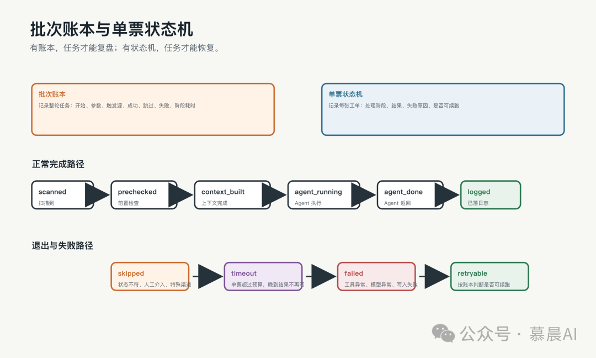

一张工单至少应该能表达这些阶段：

scanned，已经被扫描到。

prechecked，已经完成前置检查。

context_built，已经构造上下文。

agent_running，正在调用 Agent。

agent_done，Agent 已经返回。

logged，结果已经落日志。

skipped，被安全跳过。

failed，处理失败。

有了状态机，中断后才知道哪些可以续跑，哪些不能重复写。

第四个细节是限流。

AI 客服依赖很多外部系统。

工单系统接口可能限流。

模型服务可能限流。

订单、退款、商品信息等业务接口也可能限流。

并发不是越大越好。

没有限流意识，一味加线程，只会把外部依赖打爆。

限流要能识别。

重试要有退避。

失败要有分类。

统计里要能看出来。

第五个细节是超时。

单张工单不能无限等。

模型调用要有超时。

工具调用要有超时。

单票整体也要有总预算。

更关键的是晚到结果。

如果主任务已经判定这张工单超时，后台结果后来又拿到答案，不能继续写正式日志，更不能继续写回客户可见系统。

否则账本会被破坏，幂等语义也会被破坏。

所以超时不只是"报错"。

它是生产控制的一部分。

这里还有一个经常被误解的点：

并发不是性能优化的第一步。

很多人看到批处理慢，第一反应是把线程数加大。

但 AI 客服批处理不是普通后台任务。

它背后挂着模型服务、工单系统接口、订单接口、知识库检索、审核表写入。

如果没有幂等、账本、限流和超时，直接加并发只会把问题放大。

原来一张工单偶尔超时。

加并发后可能一批工单同时超时。

原来一个工具接口偶尔慢。

加并发后可能直接触发外部限流。

原来日志里还能看清一条失败链路。

加并发后如果没有批次指标，就只剩一堆混在一起的异常。

更合理的顺序是：

先确定哪些工单根本不该进 Agent。

再确定每张工单是否能幂等处理。

再确定每一轮任务是否能被账本记录。

再确定单票超时和晚到结果怎么收口。

最后才是有界并发。

第六个细节是评测。

AI 客服不是上线后就结束。

每一次改 Prompt、改 Skill、改知识库、换模型，都可能影响旧场景。

一个问题答得更好了，另一个问题可能误路由了。

一个政策解释更完整了，另一个特殊场景可能不该答却答了。

所以必须有质量闭环。

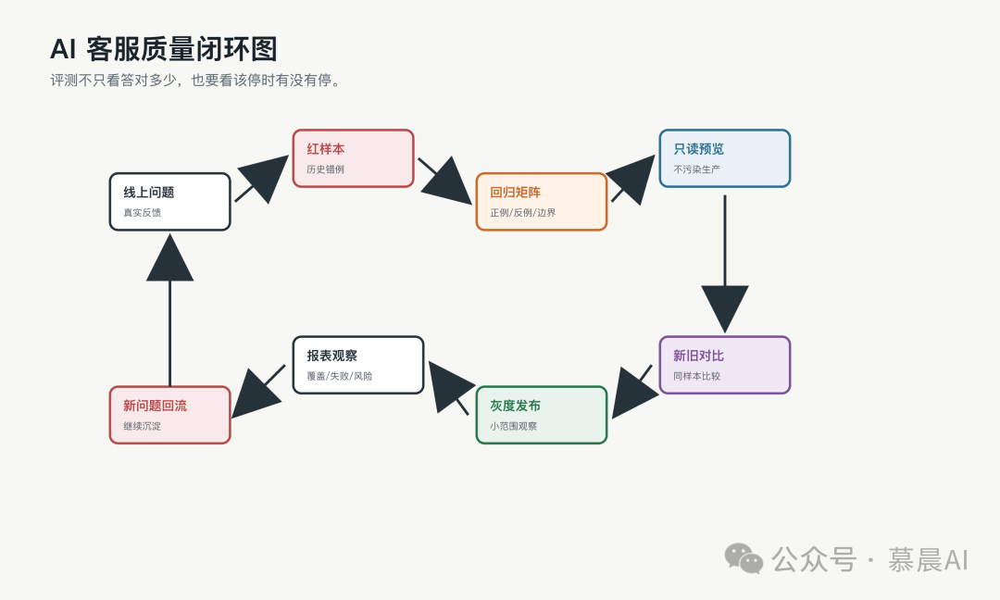

AI 客服评测不只看答对了多少。

还要看该停的时候有没有停。

该查工具的时候有没有查。

该走人工的时候有没有退出。

该拒绝写操作的时候有没有拒绝。

它评测的是一个受控执行系统，不只是一段自然语言。

所以样本不能只放成功案例。

还要放历史错例、边界问题、高风险问题、应该停止的问题、容易误路由的问题。

这类样本就是红样本。

红样本不是为了证明系统好。

它是为了持续提醒系统哪里容易坏。

真实落地时，问题通常不是某一个模块突然炸掉。

它更像一串小偏差叠在一起。

上下文取错一点。

路由偏一点。

工具事实少一点。

状态检查晚一点。

最后就会变成一条看起来"模型答错了"的事故。

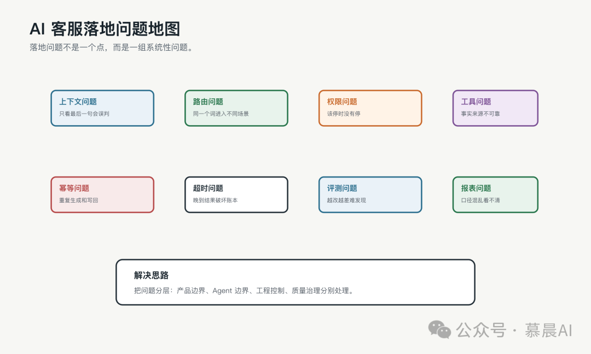

如果让我重新做一次，我会先盯这些地方：

事实来源必须分清。

客户最后一句不能直接当成完整意图。

历史 AI 回复不能污染当前判断。

人工客服已经接手时，AI 要停。

本地状态和工单系统实时状态不一致时，要信实时现场。

同一工单被多条链路碰到时，要靠幂等和状态锁收住。

模型超时后结果晚到，不能继续写正式结果。

审核通过和正式写回不能混在一起。

改一个 Skill，要看有没有误伤别的场景。

报表口径要分层。

这些都不是 Prompt 能单独解决的问题。

它们是一个 AI 客服 Agent 真正进生产前必须补齐的工程能力。

## 04 上线之后：我们到底看哪些效果指标？

AI 客服上线后，不能只看"生成了多少回复"。

生成数很容易好看。

但生成不代表可用。

可用也不代表安全。

安全也不代表真的提升了效率。

所以我更愿意把上线效果拆成四类看。

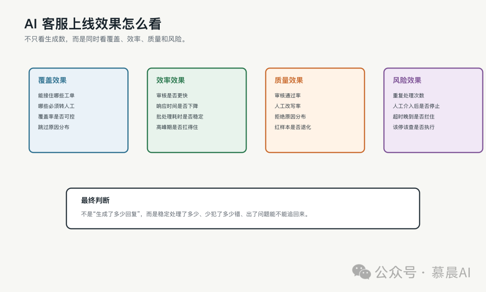

第一类是覆盖效果。

哪些类型的工单能被 AI 接住？

哪些类型仍然必须转人工？

AI 覆盖率有没有提升？

这个提升是不是建立在风险可控的基础上？

覆盖率不能单独看。

如果覆盖率上去了，但拒绝率、误处理、人工投诉也上去了，那不是效果变好，而是边界放松了。

第二类是效率效果。

AI 生成草稿后，人工审核是不是更快？

平均响应时间有没有下降？

批处理一轮任务的耗时是否稳定？

高峰期是否还能按预期处理？

这里要分清"生成快"和"流程快"。

模型生成很快，但如果审核信息不完整，人工还要回到工单里重新查上下文，整体效率未必提升。

第三类是质量效果。

审核通过率怎么样？

人工改写率怎么样？

拒绝原因集中在哪里？

哪些 Skill 最容易出错？

红样本回归有没有退化？

质量指标要能反过来指导优化。

如果只知道"通过率 70%"，但不知道 30% 为什么失败，就很难判断下一步该改 Prompt、改 Skill、补 Tool，还是直接收窄处理范围。

第四类是风险效果。

有没有重复处理？

有没有人工接手后 AI 继续回复？

有没有超时晚到结果写入？

有没有该停不停、该查不查、该转人工不转的问题？

有没有测试链路写进正式流程？

这些指标看起来不像业务成果，但它们决定系统能不能长期跑。

AI 客服一旦进入客户可见链路，风险指标就不是附属项，而是上线效果的一部分。

所以最后的报表不应该只有"节省多少人力"。

它至少应该包括：

覆盖率。

审核通过率。

平均响应时间。

人工改写率。

写回成功率。

失败原因分布。

跳过原因分布。

红样本通过率。

风险拦截次数。

重复处理次数。

超时和限流次数。

这些指标合在一起，才能回答一个更真实的问题：

这套 AI 客服 Agent 到底是在稳定地处理问题，还是只是在更快地产生回复？

最后收回来。

如果只有模型，它只是一个会说话的接口。

如果只有 Prompt，它只是一个包装过的问答系统。

如果只有知识库，它只是一个检索增强机器人。

真正能上线的 AI 客服 Agent，应该是一套受控执行系统。

它知道自己处理什么。

知道自己不能处理什么。

知道事实从哪里来。

知道结果写到哪里。

知道失败怎么记录。

知道改动后怎么验证。

也知道上线后应该被哪些指标持续观察。

最后用一句话收住：

> AI 客服 Agent 的生产化，不是把 Prompt 写长，而是把每一次回答都变成有来源、有边界、有记录、可恢复、可评测、可衡量的系统动作。
