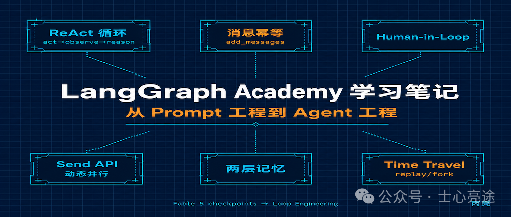
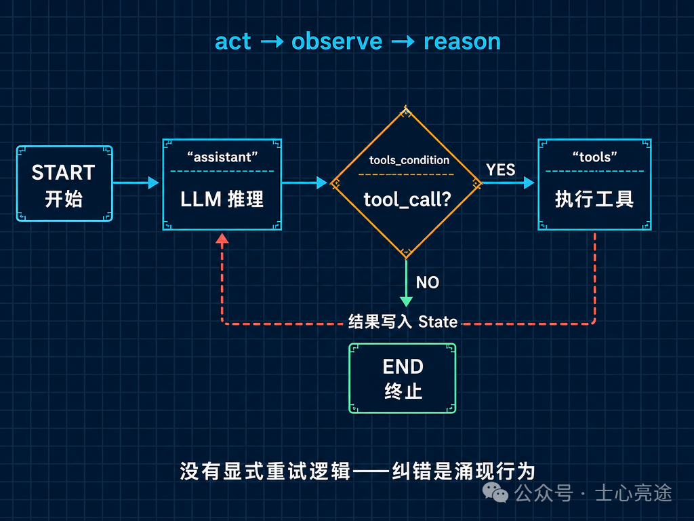
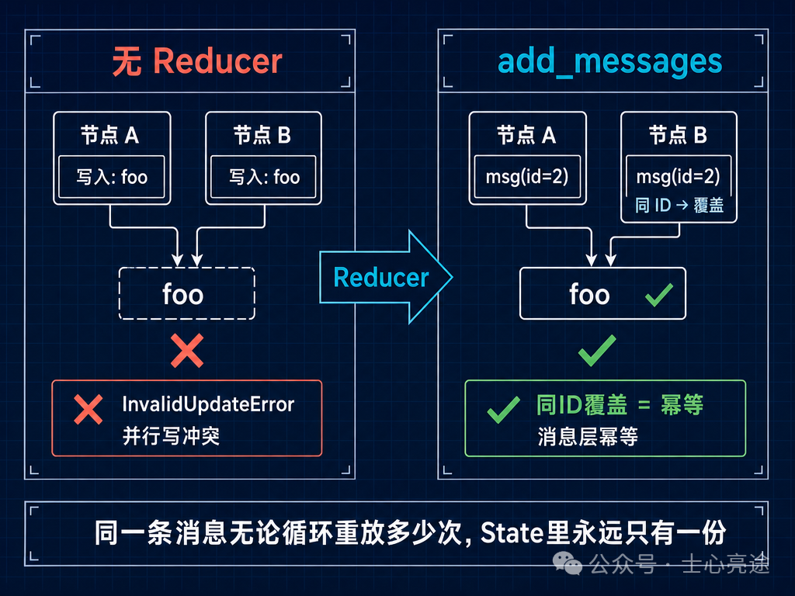
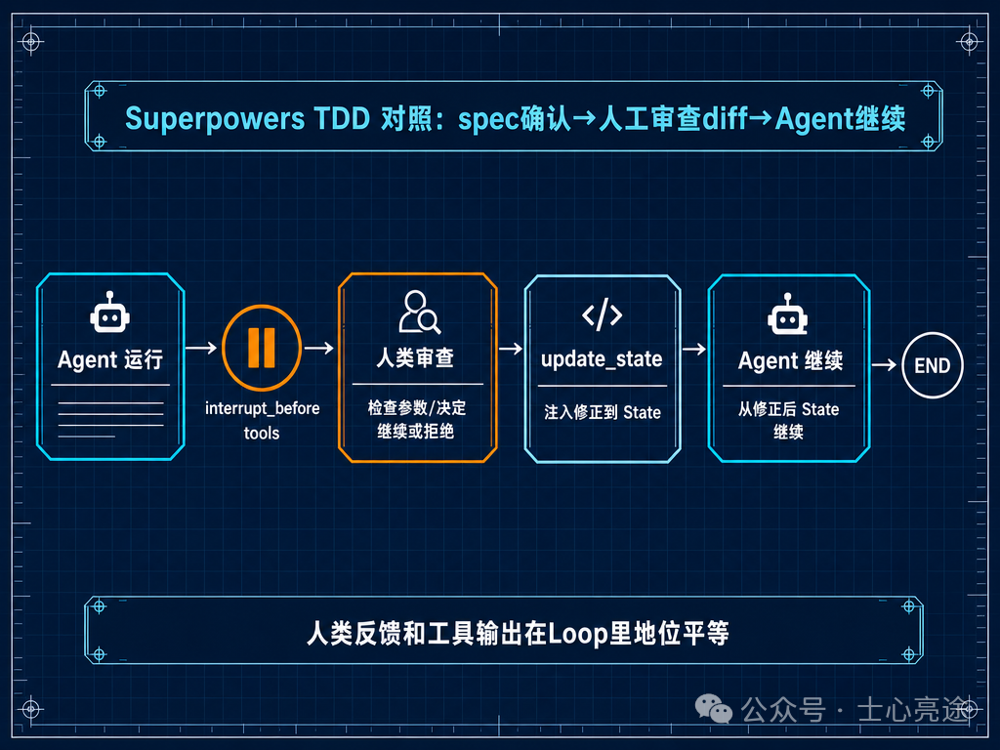
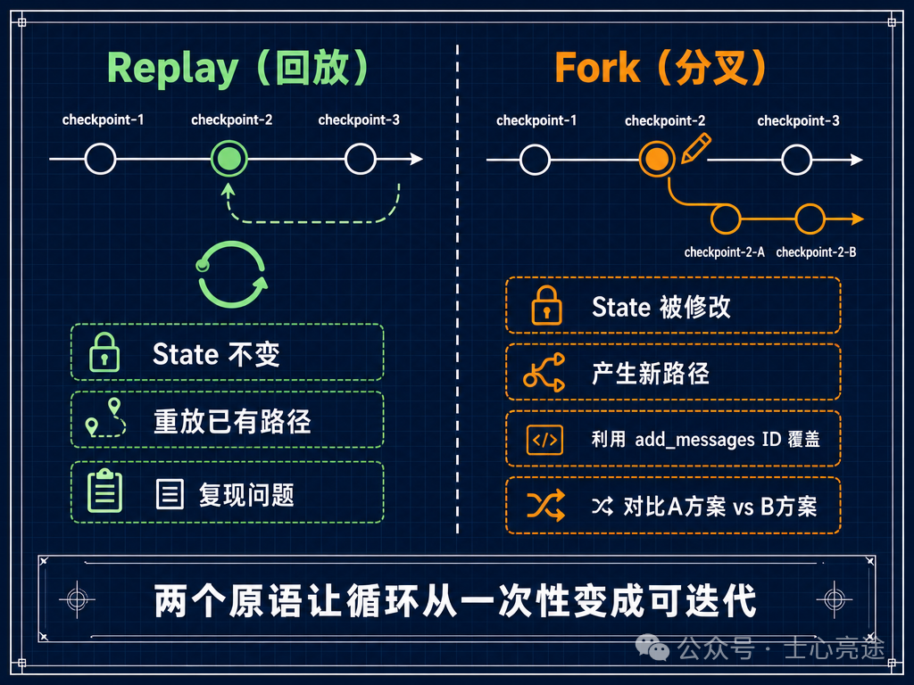

# LangGraph Academy学习笔记：从Prompt工程到Agent工程




> LangChain 官方课程。6 个模块、24 个 notebook
>
>     ——不是概念介绍，每个都是可运行的代码。
>
> 课程官网：academy.langchain.com/courses/intro-to-langgraph　·　
>
> 源码：github.com/langchain-ai/langchain-academy

2026 年 6 月 9 日，Anthropic 发布了 **Claude Fable 5**——首个公开可用的 Mythos 级模型。往前倒两个月，它的底层模型 Claude Mythos 在内部测试中展现了一个没人预料到的能力：**自主发现并利用主流操作系统和浏览器的零日漏洞**——包括一个潜伏了 27 年的 OpenBSD bug、一个 17 年的 FreeBSD RCE。这个能力不是安全专项训练的结果，是通用代码推理能力增强后的涌现行为。

Fable 5 的官方 prompt 指南里有两个词反复出现：**checkpoints（检查点）** 和 **memory system（记忆系统）**。指南明确说：Fable 5 是为数小时甚至数天的自主工作设计的——你不在的时候它自己跑。但正因为它能自己跑，你必须告诉它什么时候停、怎么记住上一轮学到了什么。

这两个概念不是 Anthropic 发明的。它们是 **Loop Engineering（循环工程）** 的核心——用一个流行但精准的说法来描述的话：整个行业正在从 Harness Engineering（怎么驾驭单次 LLM 调用）转向 Loop Engineering（怎么设计可收敛的多轮 Agent 循环）。LangGraph Academy 是目前把 Loop Engineering 讲得最系统的一门课。

这篇笔记会帮你把日常使用的直觉，变成可以系统设计的能力。

---

## 核心抽象：三个东西构成一切

LangGraph 只用三个概念描述任何 Agent：

1. **State**：图的共享内存。所有节点读写同一个 State
2. **Nodes**：Python 函数，接收 State，返回 State 更新
3. **Edges**：节点间的连线——普通边（总是 A→B）和条件边（根据 State 决定下一站）

一个 LangGraph 应用 = `StateGraph(State) + add_node + add_edge + compile()`。checkpointer 把每次 State 变更持久化。

## 一、Module 1：从最简单的图到 ReAct 循环

### Simple Graph：图的基本单元

课程从最小的可运行例子开始。State 是 TypedDict，Nodes 是 Python 函数，条件边是随机路由。这段略过初级语法，直接讲图：`StateGraph + add_node + add_edge + compile()`，`invoke` 同步运行，`stream` 返回中间状态。

```
class State(TypedDict):     graph_state: str  def node_1(state):     return {"graph_state": state['graph_state'] + " I am"}  builder = StateGraph(State) builder.add_node("node_1", node_1) builder.add_node("node_2", node_2) builder.add_node("node_3", node_3) builder.add_conditional_edges("node_1", decide_mood) graph = builder.compile()
```

### Agent + Memory：ReAct 循环

Router 调一次工具就结束了。但把工具输出**喂回给模型**呢？

> "But, what if we simply pass that ToolMessage back to the model? This is the intuition behind ReAct, a general agent architecture." — agent.ipynb

ReAct 三步：**act**（调工具）→ **observe**（传回结果）→ **reason**（推理下一步）。

```
builder = StateGraph(MessagesState) builder.add_node("assistant", assistant) builder.add_node("tools", ToolNode(tools)) builder.add_edge(START, "assistant") builder.add_conditional_edges("assistant", tools_condition) builder.add_edge("tools", "assistant")  # ← 循环在此 react_graph = builder.compile()
```

`tools` 连回 `assistant` 形成闭环。`tools_condition` 检查最后一条消息：如果是 tool\_call → 进 tools 节点；否则 → END。

**内容核心：没有显式的失败重试逻辑。** 错误信息被追加到 State，模型下一轮自然看到——纠错是涌现行为，不是硬编码。



ReAct 循环

Agent + Memory 只需 `compile` 时加 `checkpointer=MemorySaver()`。

### 把 ReAct 用到位

`tools_condition` 看起来只是一个 if/else，但它的质量直接影响整个循环的效率。好的 `tools_condition` 需要做三件事：

**1. 判断"该不该继续调工具"。** 默认的 `tools_condition` 只检查 assistant 最后一条消息是否包含 `tool_calls`。但在实践中，你还需要考虑：

- 如果 assistant 连续 3 轮都在调同一个工具、用相似的参数——它可能卡住了，该停下来让人类介入
- 如果本轮产生的 token 数（包括工具返回）已经超过预算——该压缩上下文或终止
- 如果 assistant 的输出包含"我不确定"、"我需要更多信息"但没有 tool\_call——可能是工具描述不够清晰，模型不知道该调哪个

**2. 工具描述决定循环效率。** 每多一个工具，每轮 context 就多一段 JSON Schema。工具越多 ≠ 能力越强，工具越多 = 每轮 token 消耗越大 + 模型选择工具越容易出错（Context Confusion）。一个实用原则：**工具数不超过 5-8 个，每个描述控制在 3-5 句**。超过这个数，先合并功能相近的工具。

**3. 工具返回值要"即拿即用"。** 模型在下轮看到工具返回后需要立刻推理下一步。如果工具返回的是 5000 字的原始日志，模型需要先自己"消化"再判断——这多消耗了一轮隐式推理的 token。好的工具返回值应该是**结构化的摘要**，让模型扫一眼就知道"发生了什么、成功还是失败、下一步建议是什么"。

**什么时候 ReAct 值得用？** 一个简化的判断标准：任务需要的独立决策步骤 ≥ 2 步 → 用 ReAct；否则单次调用就够了。让 ReAct 去做"查一下今天天气"是浪费——多轮 token 开销换不来更好的结果。

**Agent + Memory** 只需在 `compile` 时加 `checkpointer=MemorySaver()`，同一个 `thread_id` 下多次调用共享对话历史。

---

## 二、Module 2：State 设计 — 核心工程决策

### Schema 的三种写法

| 方式 | 定义 | 运行时校验 |
| --- | --- | --- |
| **TypedDict** | `class State(TypedDict): name: str; mood: Literal["happy","sad"]` | ❌ 仅类型提示 |
| **Dataclass** | `@dataclass class State: name: str; mood: str` | ❌ 仅类型提示 |
| **Pydantic** | `class State(BaseModel): name: str; mood: Literal["happy","sad"]` | ✅ 运行时校验 |

> "TypedDict and dataclasses provide type hints but they don't enforce types at runtime. This means you could potentially assign invalid values without raising an error!" — state-schema.ipynb

TypedDict 用 `state["name"]`，Dataclass 用 `state.name`——但两者在节点返回时都用字典。

### Reducer：并行冲突的解法

默认行为是覆盖——后来的值覆盖先前的。单个节点顺序执行时没问题。

但一旦出现并行分支，问题就来了。当 node*1 扇出到 node*2 和 node\_3，两个节点在**同一步**中并行运行，都尝试覆盖同一个 key：

> "Nodes 2 and 3 run in parallel, which means they run in the same step of the graph. They both attempt to overwrite the state within the same step. This is ambiguous for the graph! Which state should it keep?" — state-reducers.ipynb

LangGraph 直接抛 `InvalidUpdateError`。

**Reducer 就是用来解决这个问题的。** 它定义"当多个节点同时更新同一个 key 时，怎么合并"。

```
from operator import add from typing import Annotated  class State(TypedDict):     foo: Annotated[list[int], add]  # add = 列表拼接
```

> "Reducers give us a general way to address this problem. They specify how to perform updates." — state-reducers.ipynb

**`add_messages` 是消息专用的 reducer。** 它不只是追加——核心语义是 ID 去重：

> "If we pass a message with the same ID as an existing one in our messages list, it will get overwritten!" — state-reducers.ipynb

| 操作 | 行为 |
| --- | --- |
| 新消息（无 ID 或新 ID） | 追加到列表末尾 |
| 同 ID 消息 | **覆盖**旧消息，不追加 |
| `RemoveMessage(id=...)` | 删除指定 ID 的消息 |



Reducer 消息幂等

这个语义的本质是消息层的幂等——同一条消息无论被循环重放多少次，State 里永远只有一份。checkpointing、time-travel、state editing 全都建立在这个基础上。

### 多重 Schema：输入/输出分离

子图读完整内部 State，只暴露有限字段给外部。多 Agent 架构中，子 Agent 拿到干净输入，父 Agent 只看到输出，互不污染。

### 长对话管理

消息超阈值触发 summarization，替换为"摘要 + 最近 N 条"。`trim/filter messages` 精细控制 LLM 上下文。

---

## 三、Module 3：Human-in-the-Loop — 人类是 Loop 的一个步骤

> "Motivations for human-in-the-loop: (1) Approval — interrupt agent, surface state to user. (2) Debugging — rewind graph to reproduce or avoid issues. (3) Editing — modify the state." — breakpoints.ipynb

一个典型的 Human-in-the-Loop 实践是 **Superpowers TDD**——它在 Agent 编码流程中插入人工检查点：spec 拆解为测试用例后，人类确认覆盖是否完整；每个 TDD 循环（RED→GREEN→REFACTOR）结束，人类审查 diff。这不是 LangGraph 的 breakpoints，但设计理念完全相同——在 Agent 可能出错的节点暂停，人类判断后 Agent 从新 State 继续。Superpowers 用文件系统做"State"，LangGraph 用显式的 StateGraph。

### Breakpoints：在任意位置暂停

```
graph = builder.compile(     interrupt_before=["tools"],     checkpointer=memory )
```

执行到 tools 前暂停。从断点继续传 `None`：

```
for event in graph.stream(None, thread, stream_mode="values"):     ...
```

> "When we invoke the graph with None, it will just continue from the last state checkpoint!" — breakpoints.ipynb

### Human Feedback：直接修改 State

> "Breakpoints are also opportunities to modify the graph state." — edit-state-human-feedback.ipynb

```
graph.update_state(     config,     {"messages": [HumanMessage(content="修正：实际是 X，不是 Y")]} )
```

人类反馈作为 Loop 的一步追加到 State。Agent 继续执行时看到的修正和任何工具输出地位平等。



Human-in-the-Loop

### Time Travel：回放和分叉

> "LangGraph supports debugging by viewing, re-playing, and even forking from past states. We call this time travel." — time-travel.ipynb

**浏览历史**：`graph.get_state_history(thread)`。

**回放（Replay）**：从历史 checkpoint 重新执行，已执行过直接重放。

**分叉（Fork）**：修改历史 State 后重跑。利用 `add_messages` 的 ID 覆盖语义——提供消息 ID 即覆盖，否则追加。

> "Remember how our reducer on messages works: It will append, unless we supply a message ID." — time-travel.ipynb

|  | Replay | Fork |
| --- | --- | --- |
| State | 不变 | 被修改 |
| 行为 | 重放已有路径 | 产生新路径 |
| 用途 | 复现问题 | 对比方案 |



Time Travel

---

## 四、Module 4：高级模式 — 并行、子图、Map-Reduce

### Parallelization：扇出/扇入

```
builder.add_edge("a", "b")   # 扇出 builder.add_edge("a", "c")   # 扇出 builder.add_edge("b", "d")   # 扇入 builder.add_edge("c", "d")   # 扇入
```

并行节点写同一个 key 会抛 `InvalidUpdateError`，必须用 Reducer。

> "When using fan out, we need to be sure that we are using a reducer if steps are writing to the same channel / key." — parallelization.ipynb

图等所有分支到达汇合点再继续。但并行内部执行顺序不可控。

### Sub-graph：把图变成节点

> "Sub-graphs allow you to create and manage different states in different parts of your graph. This is particularly useful for multi-agent systems." — sub-graph.ipynb

通信靠重叠的 State Key。用 **Output Schema** 控制暴露——不设的话两个并行子图输出同一 key 会冲突。

### Map-Reduce：Send API

> "Map-reduce operations are essential for efficient task decomposition and parallel processing." — map-reduce.ipynb

```
from langgraph.types import Send  def continue_to_jokes(state: OverallState):     return [Send("generate_joke", {"subject": s}) for s in state["subjects"]]
```

运行时动态生成并行任务，不要求对齐 OverallState。

---

## 五、Module 5：长期记忆 — 两层架构

> "We'll build a chatbot that uses both short-term (within-thread) and long-term (across-thread) memory." — memory\_store.ipynb

| 层级 | 粒度 | 生命周期 | API |
| --- | --- | --- | --- |
| **Checkpoint** | thread\_id | 会话级 | MemorySaver/PostgreSQL |
| **Store** | user\_id | 永久 | InMemoryStore/PostgreSQL |

Store 的 put/get/search 操作通过 namespace 分层。Trustcall 用 JSON Patch 做增量更新，避免 LLM 重生成全量数据时丢失已有字段。Profile 适合用户画像，Collection 适合记忆列表。

---

## 六、Module 6：生产部署

生产环境用 PostgreSQL 替代 MemorySaver，Redis 做消息队列。

Assistants 实现一个图多种行为：

```
personal = await client.assistants.create("task_maistro",     config={"configurable": {"todo_category": "personal"}}) work = await client.assistants.create("task_maistro",     config={"configurable": {"todo_category": "work"}})
```

通过配置参数化 Agent 行为，支持版本控制、A/B 测试、回滚。Double Texting 提供 Reject/Interrupt/Enqueue/Rollback 四种并发策略。

---

## 课后随想

**ReAct 循环的价值不在"能调工具"，在"知道什么时候该停"。**`tools_condition` 的质量——是否检测卡住、是否控制 token 预算、工具返回值是否即拿即用——直接决定循环是高效还是浪费。复杂任务需要多步独立决策，简单任务单次调用就够了。一个判断标准比任何 prompt 技巧都管用。

**Reducer 的本质是消息层幂等。** 并行节点写同一个 key 会崩，Reducer 解决"怎么合并"。`add_messages` 更进一步——同 ID 覆盖、新 ID 追加、RemoveMessage 删除。同一条消息无论被循环重放多少次，State 里只有一份。checkpointing、time travel、state editing 全在这个基础上。

**Human-in-the-Loop 不是审批按钮，是 Loop 的组成部分。** Superpowers TDD 用文件系统做检查点，LangGraph 用 `interrupt_before` 和 `update_state`——设计理念一致：在 Agent 可能出错的节点暂停，人类判断后继续。

**Time Travel 改变了调试方式。** Agent 跑崩了不用从头来——回退到出问题的 checkpoint，看 State，改 State，重跑。Fork 利用 `add_messages` 的 ID 覆盖改输入，Replay 不改 State 直接重放。这两个原语让循环从"一次性"变成了"可迭代"。

回头看 Claude Code 和 Hermes——对话历史 = Checkpoint，/clear = 手动 State 重置。但没有显式 breakpoints、没有 time travel、没有跨会话 Store。这些不是缺点，它们定位是终端工具。要构建生产级 Agent 系统，LangGraph 就是那层可编程的基础设施。

Claude Fable 5 的 checkpoints 和 memory system，LangGraph 的 breakpoints 和 Store——一个内化到行为指南，一个做成 API。模型在变得更自主，框架在让自主变得可控。

无论是Harness Engineering，还是 Loop Engineering都不一见得是方法论的“终点”。

我们能做到的就是，在当下与时俱进，共勉。

---

## 七个核心维度总结

| 维度 | 关键 API / 概念 |
| --- | --- |
| **State 设计** | TypedDict→Pydantic→Reducer→输入输出 Schema 分离→Private State |
| **Loop 控制** | ReAct（assistant↔tools 反馈环）→条件边→tools\_condition 终止→Send API |
| **人机接口** | interrupt*before→NodeInterrupt→update*state(as\_node)→time-travel (fork/replay) |
| **持久化** | MemorySaver(dev)→PostgreSQL+Redis(prod)→thread*id→checkpoint*id |
| **长期记忆** | Store(put/get/search)→Trustcall(JSON Patch 增量)→Profile vs Collection |
| **多 Agent/并行** | 子图编译为节点→Fan-out/Fan-in→Map-Reduce(Send)→Output Schema 边界控制 |
| **部署** | LangGraph CLI→SDK(Runs/Threads/Store)→Assistants(版本化配置)→Double Texting |
