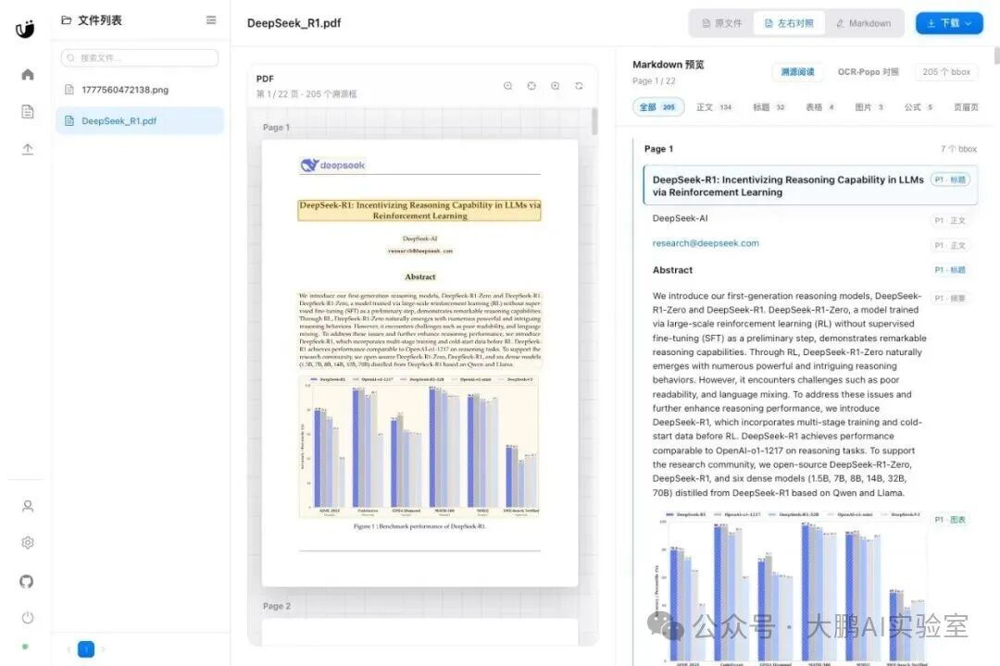
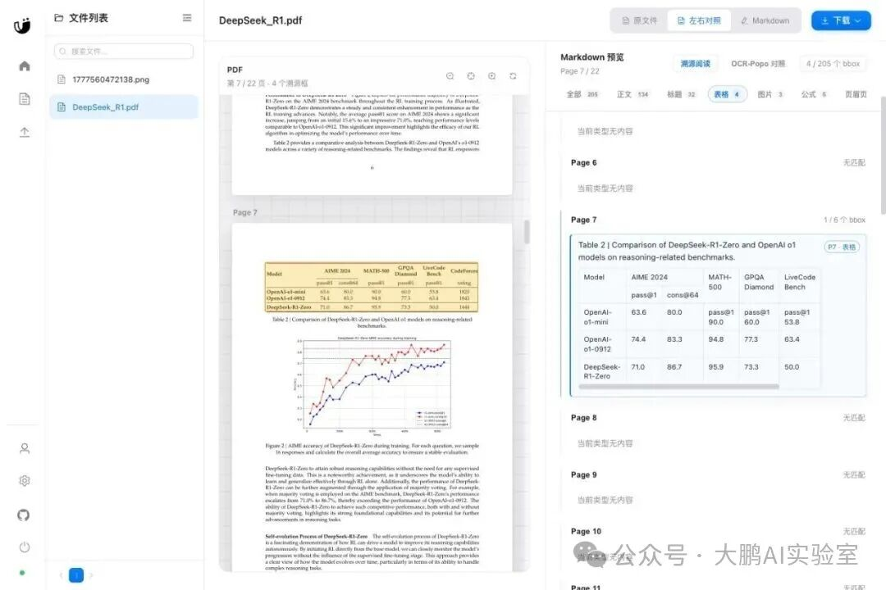
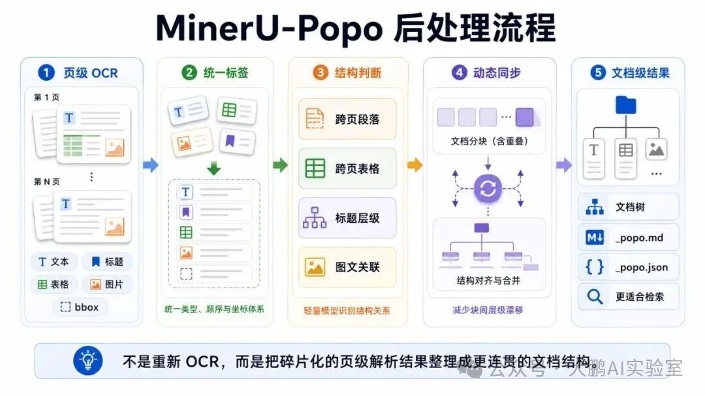
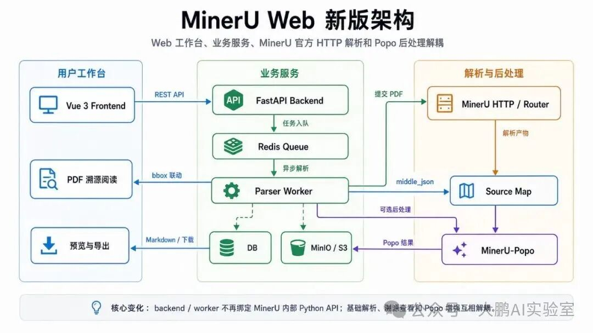
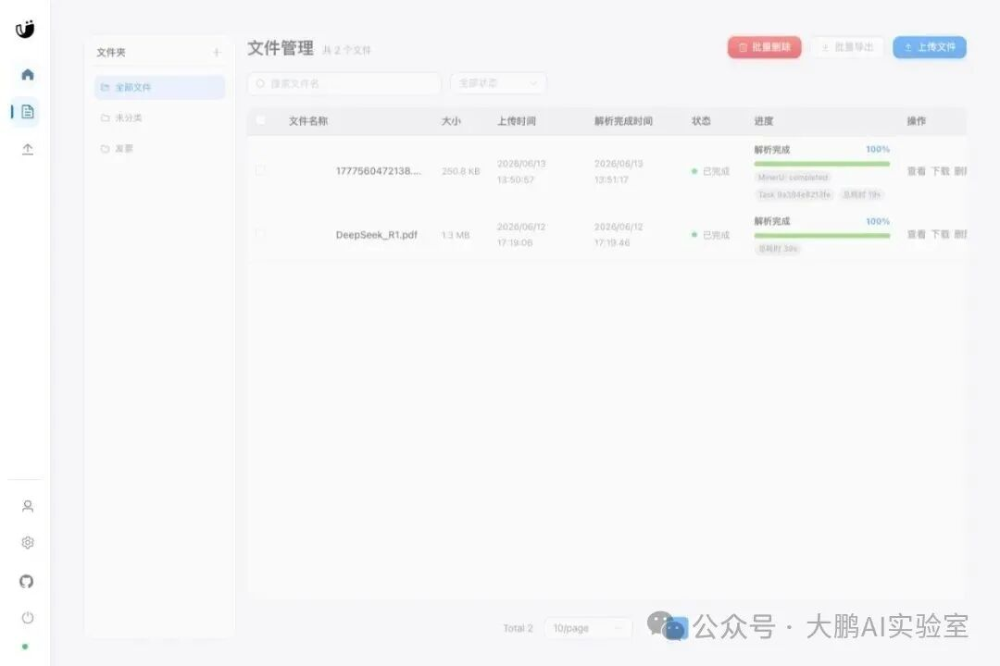
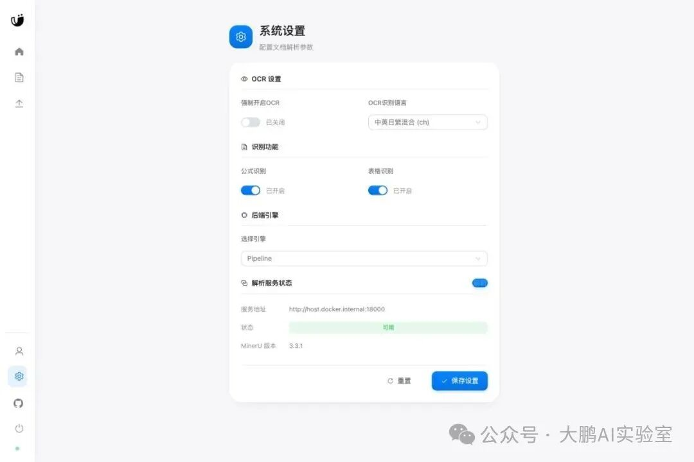

# PDF 转 Markdown 后怎么查错？我把 MinerU、OCR 后处理和原文溯源做成了开源 Web 工作台

PDF 转 Markdown，最危险的时刻，往往不是报错。

而是它看起来成功了。

标题在，段落在，表格也像表格。你把它导进资料库，接到 RAG，或者直接拿去写报告，一切都很顺。

直到某个数字错位、表格跨页断开、标题层级丢了，或者一段 Markdown 根本找不到对应的 PDF 原文位置。这个时候你才发现，文档解析真正费时间的地方，不是"转出来"，而是确认它有没有转错。

尤其是论文、财报、合同、教材这类材料，解析结果不能只靠肉眼扫一眼说"差不多"。后面要进知识库、做检索、做引用，任何一个小错都会被放大。

所以这次 MinerU Web 的更新，核心不是"又多了一个解析按钮"，而是围绕一个更实际的问题：

**PDF 转成 Markdown 之后，怎么快速知道哪里可信，哪里需要复核，哪里还能继续增强？**

MinerU Web 是我给 MinerU[1] 做的一层 Web 工作台：上传文档、异步解析、预览结果、导出 Markdown，把原来偏命令行/脚本化的流程，收进一个可以日常使用、可以复查的界面。

这一版主要补了几块能力：

- 解析结果能不能快速回到 PDF 原文核对？
- 表格、公式、图片这些高风险内容能不能单独检查？
- 后处理能力能不能接进来，但不影响主链路稳定性？
- 业务服务能不能不再绑死 MinerU 内部 Python API，部署更轻、更清楚？

项目地址：https://github.com/lpdswing/mineru-web

文档解析真正花时间的地方，往往不是等待转换，而是确认结果有没有错。

如果只能在 PDF 和 Markdown 之间来回搜索，复查成本会很高。

新版增加了 PDF 溯源查看：左侧是原 PDF，右侧是 Markdown。后端从 MinerU 的 `middle_json` 里读取页面、bbox、文本和块类型，归一化成 `source_map`；前端用 PDF.js 渲染原文，并把 bbox 覆盖到对应页面上。



现在可以按页、按块联动：点 Markdown 块，回到 PDF 对应区域；点 PDF 高亮框，也能定位右侧内容。

这对论文、财报、合同、教材这类材料尤其有用。它不假设解析永远正确，而是让人更快发现哪里需要复核。

## 表格要单独拎出来看

PDF 解析里最容易"看起来对，其实错"的内容是表格。

跨行、跨列、合并单元格、数字列、脚注，只要局部错位，Markdown 仍然可能长得很像一张正常表。

所以溯源查看里加了类型筛选。你可以只看表格块，对照 PDF 区域和转换后的 Markdown 表格内容。



这不是炫技功能，而是把复查粒度从"整篇扫一遍"降到"只看最容易错的块"。

## 后处理可以增强，但不能拖垮主流程

这次还集成了 MinerU-Popo[2]。

简单说，MinerU-Popo 不是再做一次 OCR，也不是单纯"润色 Markdown"。它解决的是另一个问题：很多 OCR / 文档解析模型擅长抽取单页里的文本、表格、图片和 bbox，但下游真正需要的通常是**跨页面、跨元素的文档级结构**。

比如：

- 一段话被分页切断，前后两页其实应该连起来
- 一个表格跨页，Markdown 里却变成两张表
- 标题层级丢了，后面检索时不知道内容属于哪一节
- 图片、表格和说明文字没有明确关联

MinerU-Popo 的后处理就集中在这些结构修复上：文本截断恢复、表格截断恢复、标题层级重建、图文关联。长文档还会做动态分块和 overlap 同步，最后组装成更连贯的文档树，再输出增强后的 Markdown / JSON。



这类增强对 RAG、资料库整理、长文档阅读都很有价值。因为下游要的不是一堆孤立页面，而是能按章节、段落、表格和图片关系组织起来的文档。

在 MinerU Web 里，我没有把 Popo 塞进业务后端，而是做成独立的 `popo-postprocessor` 服务：

1. MinerU 解析完成后，worker 把 Markdown、`middle_json`、`content_list_json`、`model_json` 等产物同步到 MinIO/S3。
2. 如果开启 `POPO_ENABLED=1`，worker 调用 `popo-postprocessor`。
3. Popo 服务按 MinerU-Popo 需要的目录结构组织输入，调用上游后处理逻辑。
4. 结果写回 MinIO/S3，生成 `_popo.md`、`_popo.json` 和 `_popo_status.json`。
5. 前端可以查看原始 OCR Markdown / Popo 增强 Markdown 对照，也可以导出 Popo Markdown。

这里最重要的设计是：**Popo 是增强层，不是主链路的生死开关。**

Popo 失败不会让基础解析失败。基础 Markdown 仍然能预览、导出；Popo 状态单独记录。对于依赖外部 OpenAI-compatible/vLLM endpoint 的后处理链路，这一点很重要。

## 解析服务独立出来，部署才稳

新版还有一个更底层的变化：backend / worker 不再直接依赖 MinerU 内部 Python API，而是调用官方 MinerU HTTP 服务。

拆开以后，系统边界更清楚：

- Vue 3 前端：上传、文件管理、预览、设置
- FastAPI backend：鉴权、文件元数据、导出、source map API
- Redis：异步解析队列
- worker：拉取源文件、提交 MinerU、同步产物、触发 Popo
- MinerU HTTP / router：真正执行解析，可放在 sidecar、宿主机或多 GPU 服务器
- MinIO/S3：保存原文件、Markdown、图片、JSON、Popo 结果
- Popo postprocessor：独立后处理服务，可开可关



这个拆分带来的价值很直接：业务镜像更轻，服务边界更稳定，部署形态也更灵活。

Linux 服务器可以用 `mineru-router --local-gpus auto` 做统一解析入口；macOS Apple Silicon 则可以把 MinerU API 跑在宿主机，Docker 只跑业务服务。

## 批量任务也更可观察

批量处理文档时，我最怕的是"任务到底还活着吗"。

新版文件列表会展示 MinerU task 状态、进度、task id 和耗时。解析完成、同步产物、失败定位，不需要只靠日志猜。



设置页里也能看到解析服务连接状态和 MinerU 版本。对部署类工具来说，"哪里没通"最好能直接看见。



## 当前适配 MinerU 3.3.1

当前版本适配 MinerU `3.3.1`，MinerU Web 版本也跟随到 `v3.3.1`。

官方 backend 选项同步到了 `vlm-engine` 和 `hybrid-engine`，同时保留旧的 `vlm-auto-engine`、`hybrid-auto-engine` 配置兼容。

快速启动：

```
  cp .env.example .env
docker compose --env-file .env -f docker-compose.yml up -d
```

macOS Apple Silicon 推荐让 MinerU API 跑在宿主机：

```
  PYTHONPATH="$PWD/backend/mineru_api_patch" MINERU_MODEL_SOURCE=modelscope \
  uv run --python 3.13 --with 'mineru[all]==3.3.1' \
  mineru-api --host 127.0.0.1 --port 18000 --allow-public-http-client
```

然后启动业务服务：

```
  docker compose --env-file .env -f docker-compose.mac.yml up -d --build
```

## 为什么要继续做 MinerU Web

我自己用 MinerU Web，不是跑一个 demo 截图就结束。

更常见的场景是：一批 PDF 要转 Markdown，转完要检查表格、图片、标题层级，有些结果还想再过一层后处理，最后把产物导出到资料库或后续流程。

所以这次更新的重点很明确：

- **溯源查看**：让解析结果可复查
- **表格筛选**：让高风险内容更容易核对
- **Popo 集成**：让增强处理可选接入
- **服务拆分**：让部署和维护更稳

如果你正在做 PDF 转 Markdown、文档解析工作台、内部资料整理，可以拿去跑一跑。

GitHub：https://github.com/lpdswing/mineru-web

欢迎提 Issue，也欢迎 PR。

#### 引用链接

`[1]` MinerU: *https://github.com/opendatalab/MinerU*
`[2]` MinerU-Popo: *https://github.com/opendatalab/MinerU-Popo*
