Hello 啊朋友们，我是 Simonlin。

有一次我问了我好几个朋友同一个问题："你每天在群里看到的那些干货，后来都去哪了？"

答案很统一：进收藏夹吃灰了。

说实话，我也一样。公众号里标了两百多篇星标，X上存了一堆书签，群聊里截了一屏幕的图，隔两天想找个东西，翻了十分钟，放弃。

直到我昨天装了一个东西——**Trove AI**。

不过，不是你随便搜到的那个版本。这篇文章要讲的，就是怎么用这个开源工具，加上 Obsidian，把你的本地 AI 知识库彻底补齐。

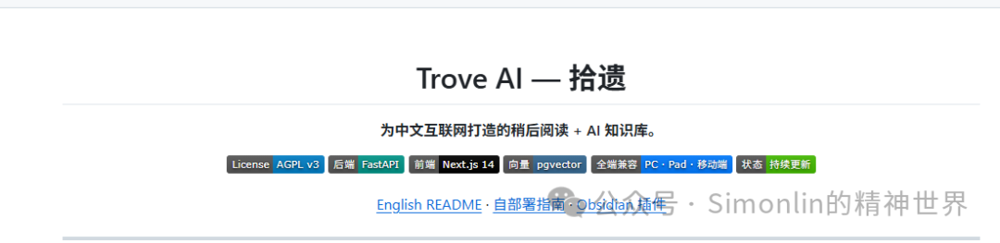

## 一、这个版本跟原版有什么区别

Trove AI 是一个开源项目，原版是 https://github.com/weaiw/trove-ai。一个"稍后阅读 + AI 知识库"的开源工具，跑在你自己电脑上。

但我装完之后发现，它有一个明显的问题：**B站视频内容抓不了**。

所以我花了一点点时间，给它加了四个关键能力：

1. **B站视频 ASR 语音转录** — 没字幕的视频，后台自动下载音频、Whisper 转录成文字
2. **YouTube 视频解析 + 转录** — 贴链接秒抓标题/字幕，没字幕一样走后台 ASR
3. **深度求索 DeepSeek v4-pro 驱动** — 摘要更准、标签更聪明
4. **UI 配置化** — 代理、ASR、YouTube 开关全在设置页直接改，不用改代码

我把这个版本叫 **Trove v1.1**，代码已推到 GitHub：https://github.com/simonlin000/trove-ai

## 二、三步走，本地部署

只要你电脑上有 Docker，三步搞定：

```bash
# 1. 克隆代码
git clone https://github.com/simonlin000/trove-ai.git
cd trove-ai

# 2. 配好环境变量
cp .env.example .env
# 编辑 .env，至少填上 DEEPSEEK_API_KEY 和 SECRET_KEY

# 3. 启动
docker compose up -d
```

等大概两分钟，浏览器打开 http://localhost:80，注册账号，登录。

然后去 **设置 → AI 对话模型**，把 DeepSeek 的 API Key 填进去，点测试连接，保存。

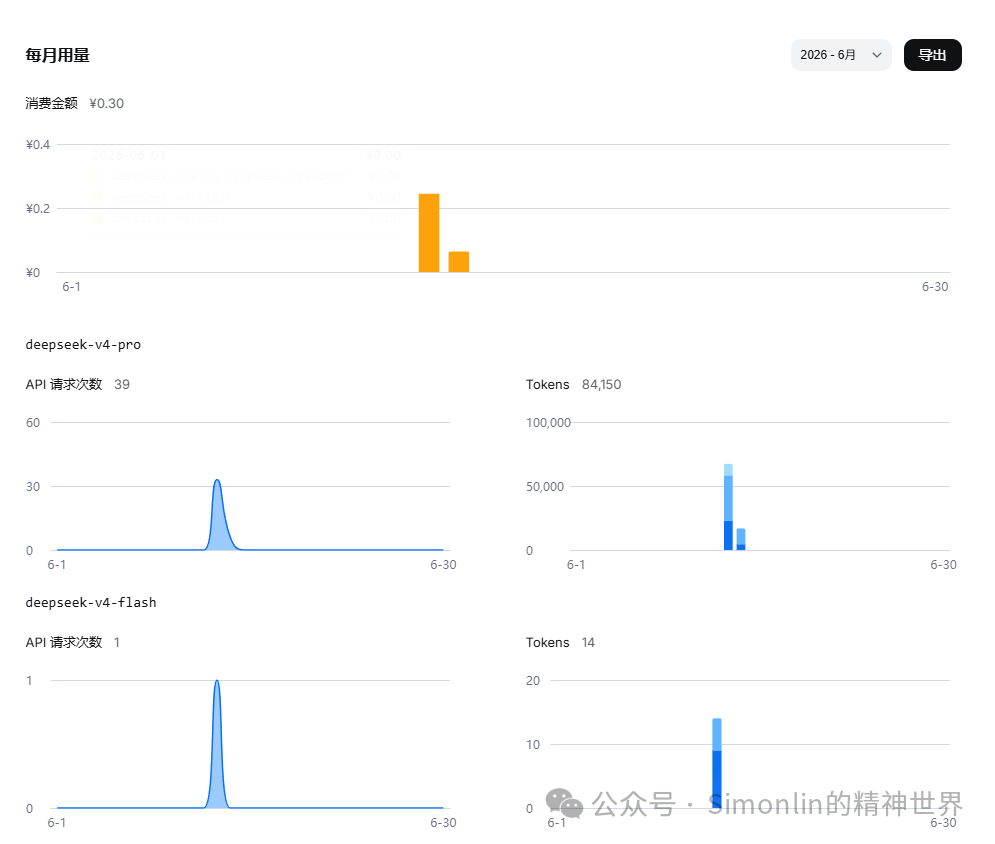

为啥用 DeepSeek？肯定是因为它好用+便宜啊！跑了好几个任务，居然才花了 3 毛钱。

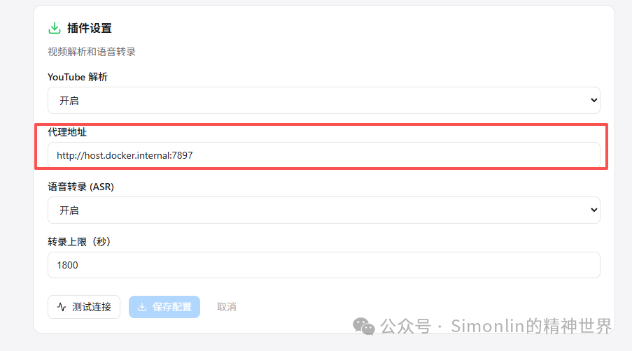

### 外网访问（cloudflared）

```bash
# macOS
brew install cloudflared

# Windows
winget install Cloudflare.cloudflared

# 启动临时隧道
cloudflared tunnel --url http://localhost:80
```

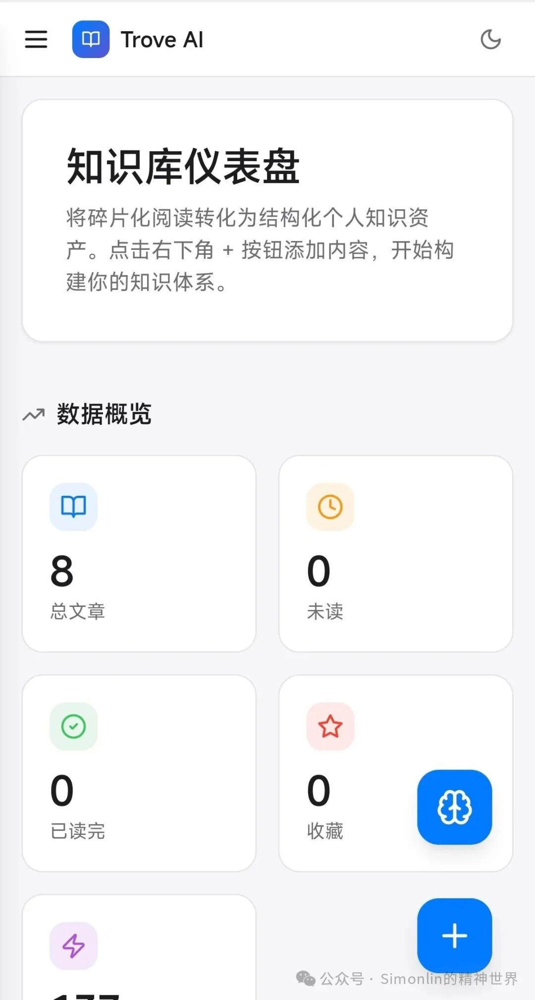

## 三、v1.1 到底多了什么

### 1. B站视频 → 文字

原版 Trove 贴一个 B站链接，只能抓到标题、UP主、简介。没了。

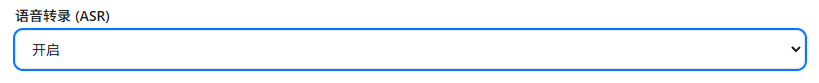

v1.1 做了三层处理：

- **第一层：抓字幕**。有外挂字幕直接扒下来。
- **第二层：ASR 语音转录**。没有字幕？后台自动下载音频，Whisper 转文字。贴完链接关掉页面就行，几分钟后刷新就有了。
- **第三层：限制保护**。超过 30 分钟的视频不会自动转录（防止内存爆掉），可在设置里调上限。


### 2. YouTube 视频 → 文章

原版 Trove 根本不知道怎么处理 YouTube 链接。

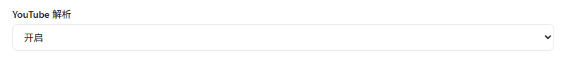

v1.1 接入了 yt-dlp：自动获取标题/频道/简介，优先抓中文字幕，没字幕走后台 ASR。唯一需要的是在设置里配好代理地址。

### 3. UI 配置化

原来改代理、开关 ASR、调转录上限，得修改代码重新 build 镜像。现在全部在设置页搞定：

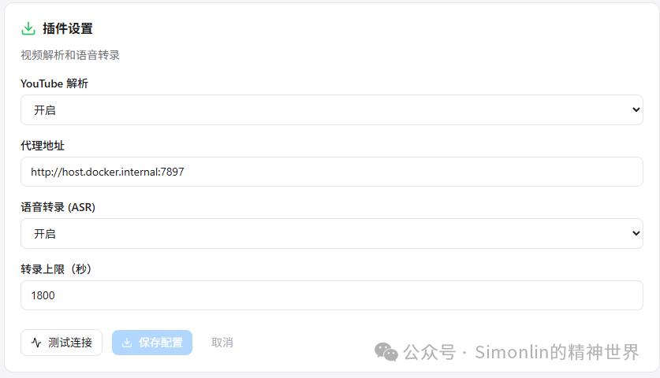

四个配置项：YouTube 解析开关、代理地址、ASR 开关、转录上限（默认 1800 秒）。改了立刻生效，不用重启。

### 4. DeepSeek v4-pro

原版默认用硅基流动的模型。换成了 DeepSeek V4-Pro，1.6 万亿参数。摘要不再是"本文介绍了XXX"那种废话，而是真正提取文章的核心命题。

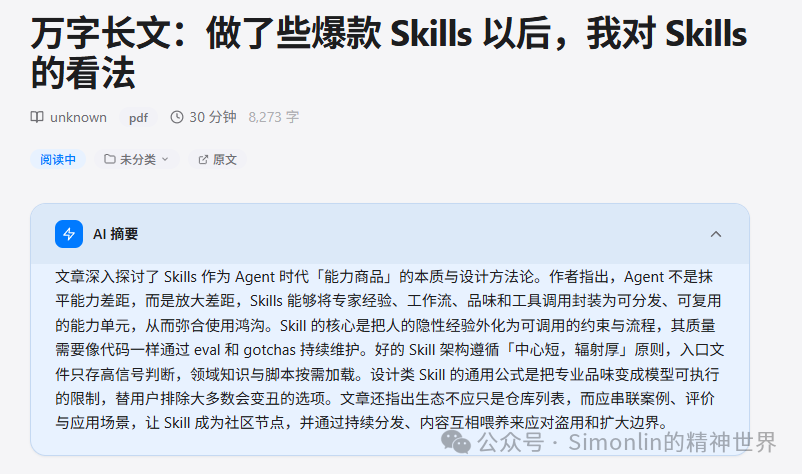

## 四、Trove 到底能干什么

你可以把它理解成你自己的 AI 图书馆。开源的，跑在你本地。

### 1. 贴链接自动抓取

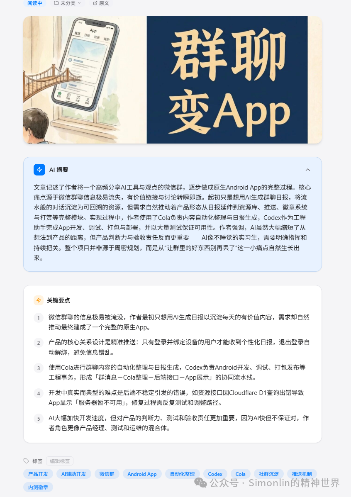

公众号、知乎、B站、YouTube、小红书、掘金、X上的推文，把链接贴进去就行。它用 Playwright 真正渲染页面，自动抠出正文，排版干净。

### 2. RAG 问答

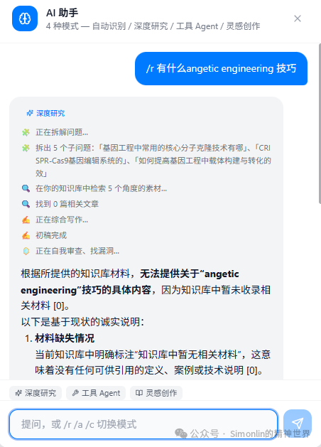

在 Trove 里直接问问题。点大脑图标唤起 AI 助手。

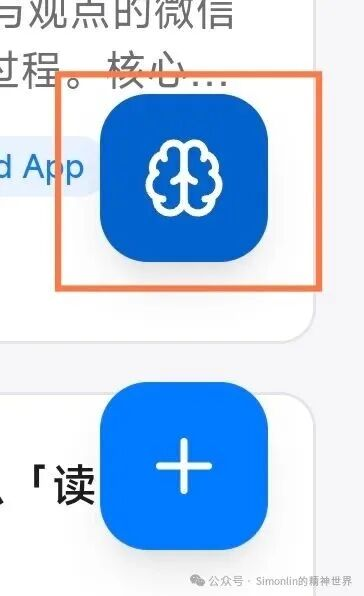

支持"本文"和"全库"两个搜索模式：

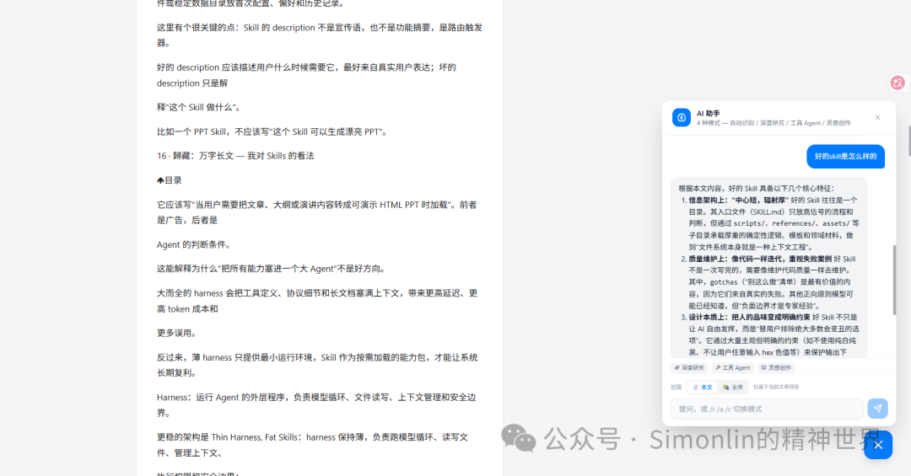

- **本文**：在文章范围内语义搜索
- **全库**：在整个知识库范围内搜索

AI 助手有四种模式：

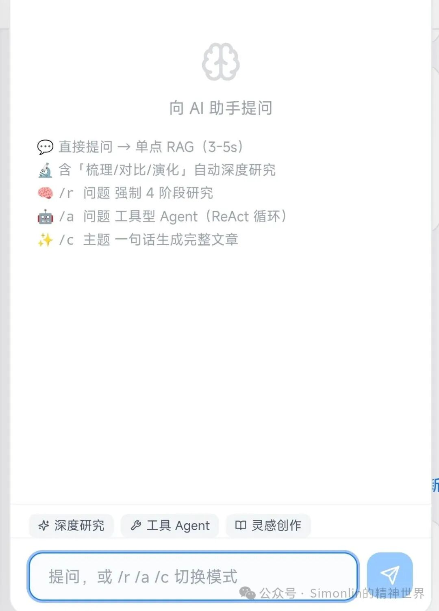

1. **自动识别**：根据问题决定处理模式
2. **深度研究**：`/r` 强制拆成 4 个阶段研究
3. **工具 Agent**：`/a` 自动调用工具完成任务
4. **灵感创作**：`/c` 根据主题写完整文章

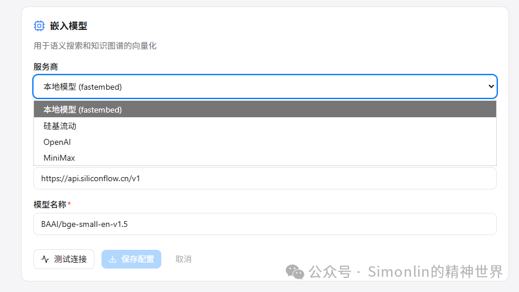

### 3. 知识图谱

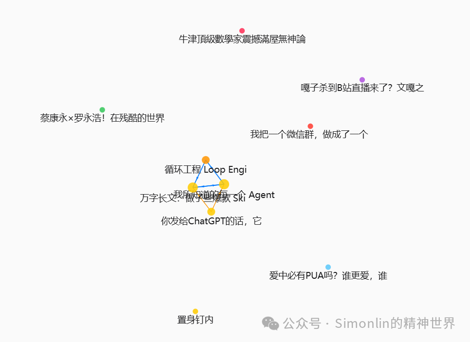

Trove 能自动把所有资料建立联系，形成知识图谱。每个材料都做好向量化、打好标签，方便检索。

### 4. 跨平台阅读

网页界面，电脑、iPad、手机都能访问。开个 cloudflared 隧道，出门也能用。

### 5. 连接微信

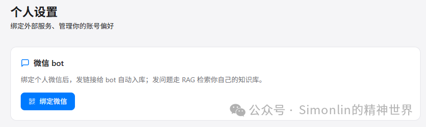

在个人设置里直接连接微信通道，让它变成你的私人知识库管家。看到好东西直接丢进微信聊天框，就能存到知识库里。

### 6. AI 学习路线生成

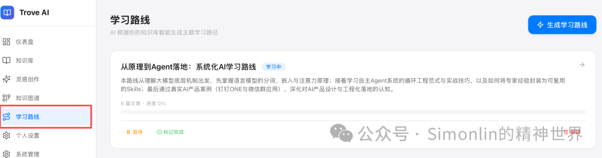

AI 根据你收藏的资料，系统性地整理成学习路线图，从基础出发逐步提高难度。

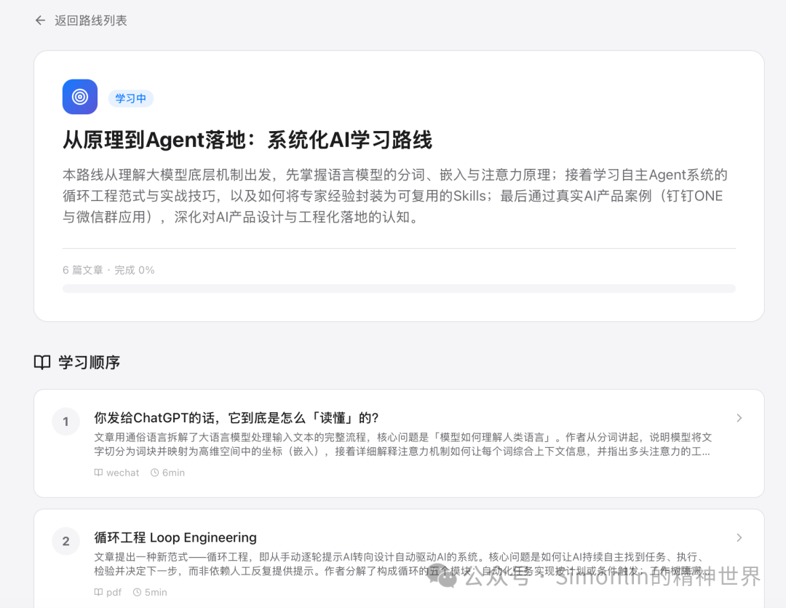

## 五、跟 Obsidian 打通

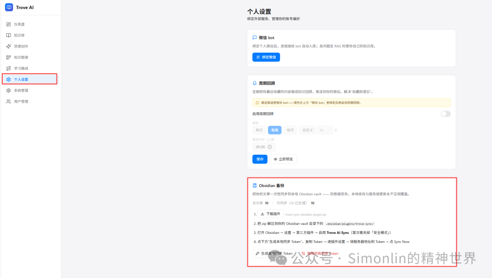

收藏不是目的，用起来才是。打通 Obsidian 三步：

1. Trove 设置里生成 Sync Token（有效期一年）
2. 给 Obsidian 装插件 — **Trove AI Sync**，去 GitHub 下载 release，丢进 `.obsidian/plugins/trove-sync`
3. 填服务器地址 + Token，在 Obsidian 点 Sync Now

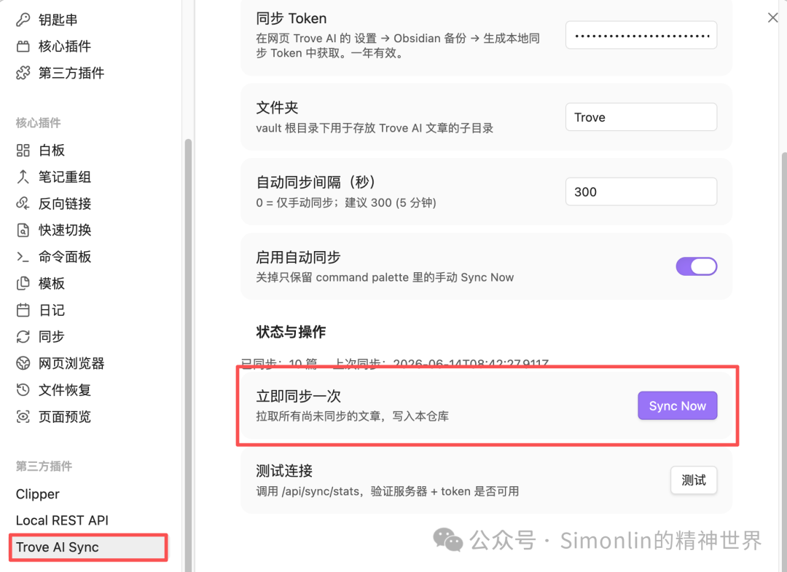

全部文章、AI 摘要、标签、知识图谱关系，一键同步到 Obsidian。Markdown 格式，知识图谱关联会变成 Obsidian 的双链 `[[wikilink]]`。同步是单向的，在 Obsidian 里修改不会被覆盖。

## 六、我的日常用法

一个完整的闭环：

1. **第一环**：刷信息流的时候，链接丢进 Trove。公众号、B站、X、群聊里的干货，一分钟能丢十几篇。
2. **第二环**：过段时间打开 Trove，扫一眼 AI 摘要。重点的点进去看原文。
3. **第三环**：点 Sync，所有内容出现在 Obsidian 里。
4. **第四环**：在 Obsidian 写文章时，直接搜素材。

从"看到了→存了→忘了→想写文章时一片空白"，变成了"看到了→存了→AI 处理了→想写文章时素材已经等在那里了"。

## 结语

Trove AI 不是来替代 Obsidian 的。

- **Obsidian** 是你的写作台，你在上面思考、写作、建立自己的想法。
- **Trove** 是你的 AI 图书馆，它负责把散落在各处的信息收进来、整理好、建关联。

Obsidian + Trove + DeepSeek，这三样东西凑在一起，才是本地知识库的完整体。


**GitHub：** https://github.com/simonlin000/trove-ai
