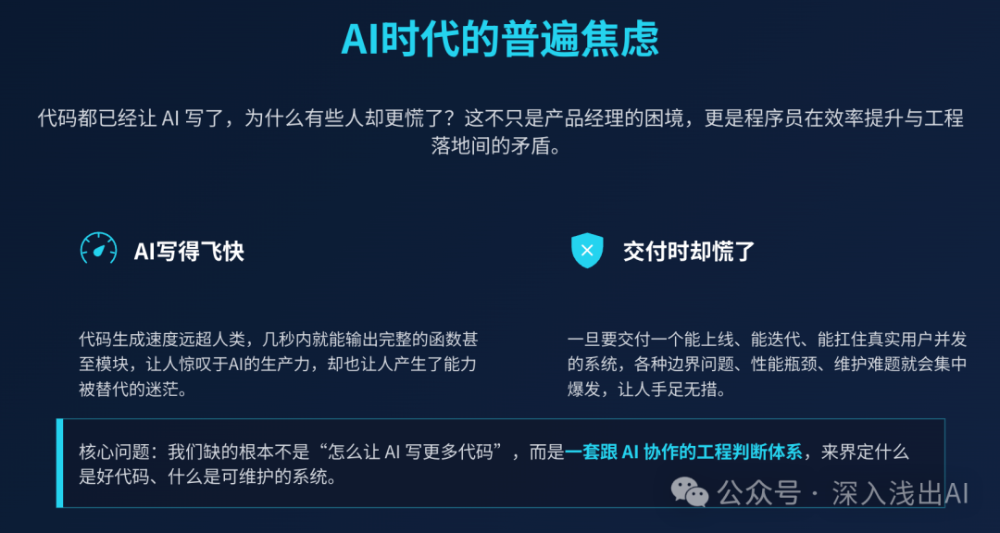
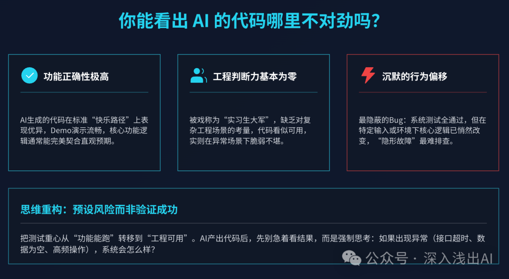
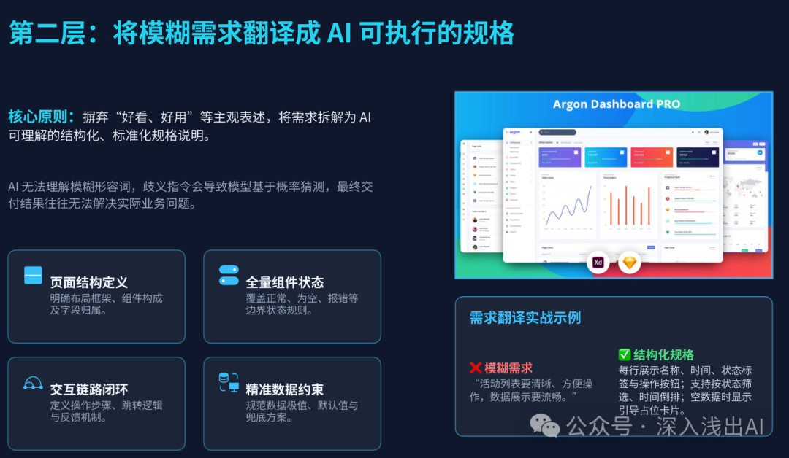
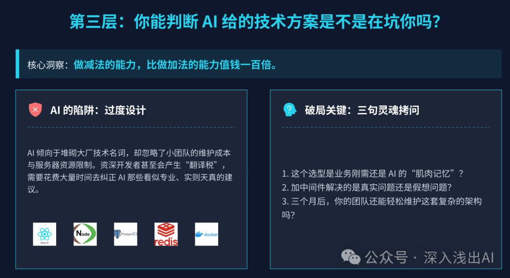
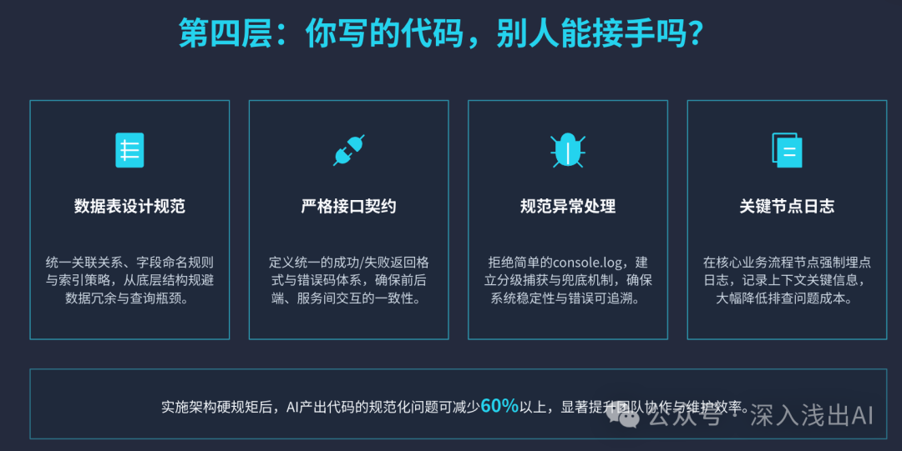
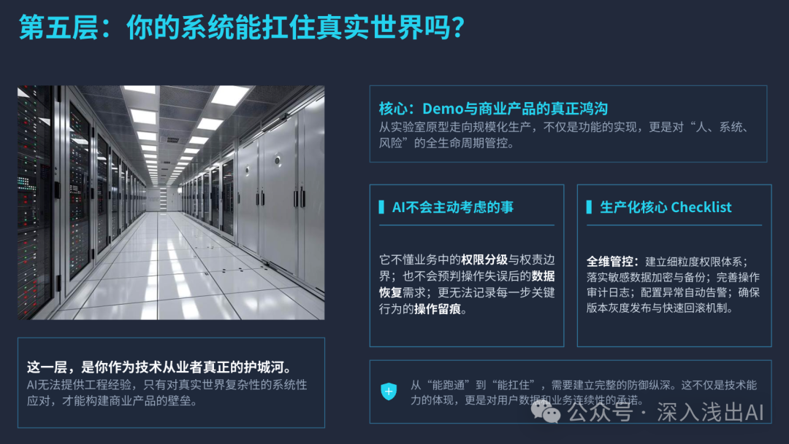
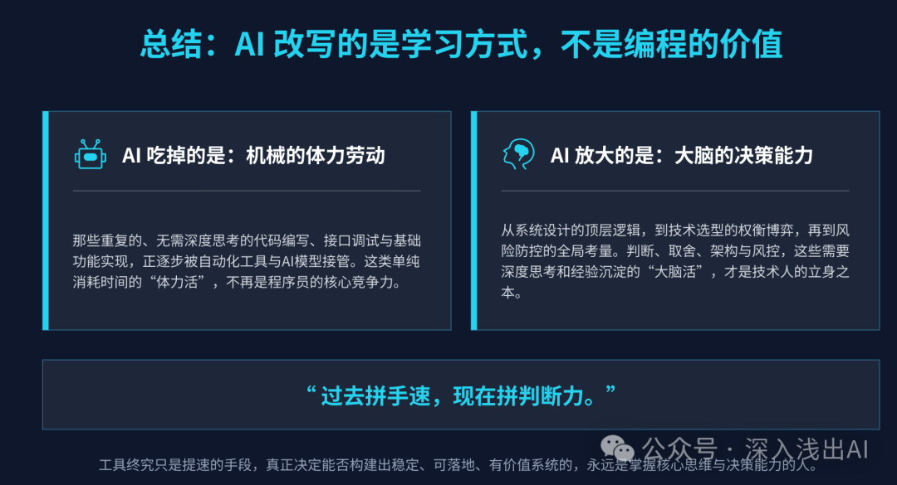
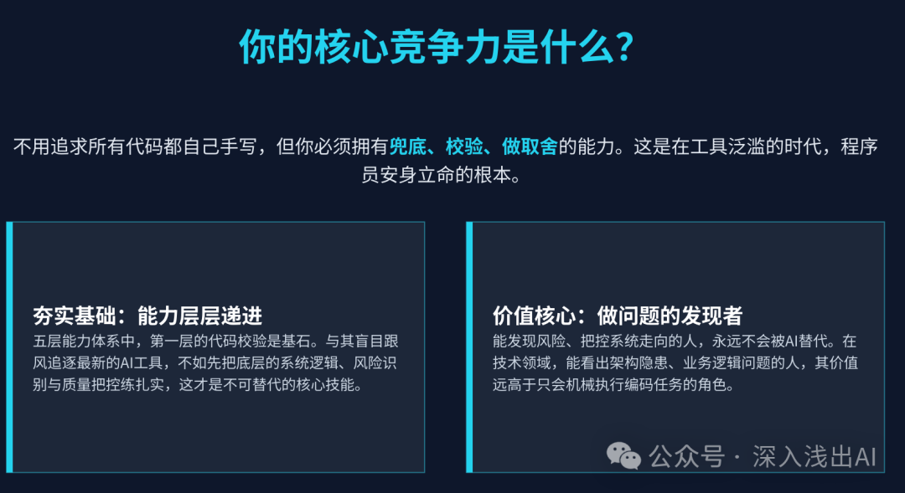

上一篇文章里，让那位产品经理十分焦虑的问题我给了产品经理的解决方案——[代码都已经让 AI 写了，为什么有些人却更慌了？](https://mp.weixin.qq.com/s?__biz=MzYzNzQ0NDM3OQ==&mid=2247484667&idx=1&sn=674c29e10758d9f95bc44fd1a47a1714&scene=21#wechat_redirect)。

说实话，这不只是 PM 的困境。

我身边非常多的程序员也卡在同一个位置：AI 写得飞快，代码跑得起来，但一旦要交付一个能上线、能迭代、能扛住真实用户的系统，就开始慌了。

那问题到底卡在哪？我琢磨了很久，这篇文章，我来说说**解决程序员十分焦虑的方案**。

前阵子我看到一组数据，看完心里咯噔一下。**Sonar** 2026 年的开发者调查：42% 的代码已经是 AI 辅助生成的，96% 的开发者不完全信任 AI 的输出，但只有 48% 的人每次都认真 review AI 的代码。一半的代码是 AI 写的，一半没人认真审——中间这个 gap，业界给它起了个名字叫**验证债**。

还有个更狠的数字。**Veracode** 2025 年的安全报告：45% 的 AI 生成代码引入了安全漏洞。几乎一半。

**Anthropic** 自己做过一个 52 人的随机对照实验：用 AI 辅助的那组，代码理解测试得分比没用 AI 的对照组低了 17%。注意，不是代码写得差，是**理解得差**。Google 的 Addy Osmani 给这种现象造了一个词——**Comprehension Debt**（理解债）：AI 帮你写代码的速度，和你真正理解这些代码的速度，正在快速拉开差距。

看完这些数据，我心里憋了一句话——大多数人缺的根本不是"怎么让 AI 写更多代码"，缺的是**一套跟 AI 协作的工程判断体系**。传统那套"先学语法、再学框架、最后做项目"的路子，在人机协同的时代已经有点过时了。死记语法、手写全套代码、堆砌框架知识点——耗时久、性价比低，而且完全适配不了现在的研发节奏。

我结合自己这一年多落地 AI 项目的经验，把编程学习重新拆成了五层能力。这五层不是并列的技能清单，是**递进的——上一层没过关，下一层就是空中楼阁**。

我先把五层能力摊开，跟传统学法摆在一起看：

| 能力层级 | 传统学法的重点 | AI 时代真正要练的 | 不过关的后果 |
| --- | --- | --- | --- |
| 显性错误验收 | 看控制台报错 | 一眼扫出 AI 代码里的坑 | 功能跑通了就点通过，上线后炸 |
| 需求结构化还原 | 照着 PRD 写代码 | 把模糊描述翻译成 AI 能懂的规格 | AI 给的跟你想的完全俩东西 |
| 技术方案取舍 | 背技术栈全家桶 | 按项目体量做减法 | 小项目堆重架构，维护成本爆炸 |
| 工程规范与架构 | 记代码规范文档 | 把控表结构、接口契约、异常链路 | 一个人写得爽，团队接手直接骂娘 |
| 生产化交付 | 学运维部署 | 搭建权限、加密、监控、容灾体系 | Demo 跑得飞起，上线第一天就出事 |

光看表可能有点抽象。我拿一个自己带过的真实案例来讲——**一个内部运营后台从需求到上线的完整过程**。这条链路走完，每一层卡在哪，一目了然。

---

## 案例背景

先把场景交代清楚，后面每一层都会回到这个案例上：

- **场景角色**：一名 2 年经验的前端，日常用 Cursor 写业务，后端只懂皮毛。被安排独立负责一个内部运营后台。
- **核心目标**：搭建一个供运营团队使用的活动配置后台，支持创建活动、设置奖品池、查看发放数据、导出报表。日均使用人数不到 10 人。
- **输入**：运营负责人给了一句口头需求——"搞个后台能配活动、看数据就行，不用太复杂"。
- **处理流程**：从需求理解 → AI 生成代码 → 技术方案判断 → 规范约束 → 上线交付，全程人机协同。
- **输出与校验**：后台上线后，运营实际使用 2 周，统计 Bug 数量、需求返工次数、线上故障次数。

这个例子很常见，就是个普普通通的内部后台，大家在实习生或者刚工作那会应该都做过。

---

## 第一层：你能看出 AI 的代码哪里不对劲吗？

回到上面的案例。这位前端让 AI 生成了后台第一版代码，页面打开了、按钮能点、数据能显示，他看着觉得差不多了，就准备提交。

我让他做了三件事：

1. 打开浏览器控制台，看有没有红色报错。
2. 把每个按钮在三种状态下各点一遍——正常、loading（加载中）、报错。
3. 把窗口拖窄，看表格和表单在窄屏下长什么样。

结果——控制台 4 条警告，删除按钮在 loading 状态下能重复点击（连发 3 个请求），表格在 1366 分辨率下直接溢出。

AI 写出来的代码，**功能能跑和工程能用之间有一大段灰色地带**。接口异常处理没写、边界状态没覆盖、兼容性问题一坨——这些问题在 Demo 演示时完全看不出来，但一旦交到真实用户手里，分分钟暴露。

安全公司 **Ox Security** 给 AI 代码起了个名字叫 **"Army of Juniors"**——实习生大军。你想想，AI 写出来的代码就像招了一千个实习生，每个人都能写、功能都能跑，但没有一个能对架构负责。功能正确性极高，工程判断力基本为零。最可怕的是 **Silent Behavioral Drift**——沉默的行为偏移。AI 改完代码，测试跑通了、diff 看起来干净，但在某个你没测到的路径上行为已经变了，你根本发现不了。

怎么练？大多数人的习惯是——改完代码，跑一遍正常流程，页面打开、按钮能点，就默认没问题了，该提测提测，该上线上线。但 AI 写的代码，正常流程往往看不出问题。真正会炸的地方在边界：接口挂了怎么兜底、并发冲突怎么处理、异常数据进来页面会不会白屏。这些 AI 不会主动帮你覆盖。

所以这层练的就一条：**把测试的注意力从 happy path 移到异常路径上。** 每次 AI 产出代码后，先别测正常流程，先想 3 个"万一"——万一接口超时了？万一数据是空的？万一用户手快连点两下？把这些测完，再去看正常流程。

---

## 第二层：你能把模糊的需求翻译成 AI 听得懂的规格吗？

第一层过了之后，案例里的前端遇到了第二个问题：AI 给的页面跟运营想要的不一样。

运营说"活动列表要清晰"，AI 给了一行三列的卡片布局。运营说"配奖品要方便"，AI 给了一个长长的全部展开的表单。

**问题从来不在 AI 身上。AI 不知道什么叫"清晰"，什么叫"方便"。** 你喂它模糊的词，它就给你糊弄的活。

我让他换了一种方式。别跟 AI 说"要清晰"，而是说：

- 活动列表：每行一条活动，显示活动名称、起止时间、状态标签、操作按钮。支持按状态筛选，支持按创建时间倒排。为空时显示"暂无活动，点击创建"的引导占位。
- 奖品配置：分两步——第一步选奖品类型（实物 / 虚拟 / 优惠券），第二步根据类型展开不同的表单字段。已配置的奖品以卡片形式预览，支持拖拽排序。

同一套 AI 工具，同一个人，只是把需求描述方式从"形容词"换成了"结构化规格"，代码质量直接上了一个台阶。

翻来覆去就是一件事：把"好看""好用""流畅"这种主观表述，拆成**页面结构、组件状态（正常/为空/加载/报错/无权限）、交互流程、数据边界**。你试试看，需求写成这样再丢给 AI，出来的东西能跟之前差出一个量级。

---

## 第三层：你能判断 AI 给的技术方案是不是在坑你吗？

这一层是分水岭。**上面两层掌握了，你还是个"AI 操作员"；过了这一层，你才算开始掌控 AI。**

案例里这位前端让 AI 搭后台的技术栈，AI 给出的方案是：**React + TypeScript + Node.js + PostgreSQL + Redis + Docker + K8s**。

看起来很专业对吧？每一项单看都没毛病。

但这个后台日均 10 个人用、数据量不超过几万条、没有高并发场景、没有弹性扩缩容需求。搞 Redis 缓存干什么？上 K8s 图个啥？一个单体 Node 应用 + SQLite 或者直接用轻量 ORM 就能搞定的事，硬生生堆成了微服务架构的架势。

这种坑我踩了不止一次。AI 特别喜欢堆技术名词——训练数据里全是各家大厂的博客和技术方案，它不知道你的项目只有 3 个人维护，不知道你的服务器就一台 2C4G。

佛罗里达国际大学的一项研究里专门记录了这种现象——他们管它叫 **Translation Tax**（翻译税）：senior 开发者用 AI 反而变慢，因为要花大量时间纠正 AI 的天真建议。经验越丰富，被 AI 浪费的时间越多。什么意思呢？你用 AI 省了写代码的时间，但全赔在纠正它的过度设计上了。

怎么过这关？我给自己定了三句灵魂拷问，每次 AI 推方案之前先来一遍：

- 这个技术选型，到底是业务真的需要，还是 AI 的"肌肉记忆"？
- 加这个中间件，解决的到底是真实问题还是想象中的问题？
- 三个月后，团队还能不能轻松维护这套东西？

**做减法的能力，比做加法的能力值钱一百倍。**

---

## 第四层：你写的代码，别人能接手吗？

案例里的后台第一版上线后，问题又来了——运营提了一个新需求，前端自己改了两天改不动，找同事帮忙。同事拉代码一看，直接懵了：

- 数据库字段命名——有的用驼峰、有的用下划线、有的中文拼音缩写
- 接口返回格式——成功时统一用 `{data, msg}`，报错时直接抛 `500` 堆栈
- 日志——没有。出了事只能靠猜

**一个人用 AI 写代码，爽是真的爽。但代码不是写给你一个人看的。** 多人协作场景下，杂乱无章的技术债比纯手写时代积累得更快——因为 AI 写得快，你的不规范代码产生的速度也快。

这一层不用你深钻代码细节，但**架构层面的几条硬规矩**必须死守：

1. **数据表设计**：关联关系想清楚再建表，字段命名统一，加好索引。
2. **接口契约**：成功和失败的返回格式先定好，别每个接口各搞一套。
3. **异常处理**：别让 AI 给你 `try-catch` 完就 `console.log` 一下完事。
4. **日志**：关键操作节点要有日志，不然线上出问题你连线索都没有。

我的经验是，这些规矩定好之后，AI 产出的代码能少 60% 以上的规范化问题。

---

## 第五层：你的系统能扛住真实世界吗？

这是最后一层，也是 Demo 跟商业产品之间真正的鸿沟。

案例里的后台平稳跑了两个月，然后出事了——运营误删了一个活动，没有软删除，数据直接没了。没有人操作日志，不知道是谁删的、什么时候删的、删了什么。备份？没做。

这事跟 AI 没关系。AI 的目标是"把功能做出来"，它不会主动考虑：权限分级（谁可以删？）、操作留痕（谁删了什么？）、数据恢复（删错了怎么办？）。**这些东西，是人脑子里必须有，然后明确写进需求里让 AI 去执行的。**

我把这一层的 checklist 列出来，每一条都是用血泪教训换的：

- 权限管控：谁能看、谁能改、谁能删——先画清楚，再写代码
- 数据安全：敏感字段加密存储、软删除、定期备份
- 操作审计：关键操作日志——谁、什么时间、做了什么、变更前后数据
- 异常告警：接口挂了、数据异常了，能不能第一时间知道
- 灰度与回滚：新版本上线，出问题了能不能快速退回去

**这一层 AI 帮不了你，它甚至不会提醒你去做。** 这些能力只能靠工程经验积累，所以它们才是你作为技术从业者真正的护城河。

---

我把"只会用 AI 写代码的人"和"具备五层能力的人"放在同一个需求面前，差距是这样的：

| 维度 | 只会用 AI 的人 | 具备五层能力的人 |
| --- | --- | --- |
| 拿到需求 | 直接把模糊需求丢给 AI | 先把需求拆成结构化规格，再让 AI 执行 |
| 代码产出后 | 跑通正常流程就过了 | 先测异常路径、边界状态，再回头看正常流程 |
| AI 推荐方案 | 全盘接受，觉得"它比我懂" | 按项目体量和团队能力做减法 |
| 代码规范 | 散乱的，想到哪写到哪 | 表结构、接口契约、日志规范先定后写 |
| 上线前 | 功能没问题就上线 | 权限、审计、备份、告警逐项确认 |
| 出问题后 | 找不到原因，猜 | 看日志定位，有回滚方案兜底 |

---

## 前面提到的那些"债"和"税"，这里统一归纳

这篇文章前前后后提到了好几个业界造出来的词——**理解债、验证债、翻译税、实习生大军、沉默的行为偏移**。每个词都不是随便造的，背后有研究、有数据。归纳一起看，比散在各段里更有感觉：

| 概念 | 来源 | 是啥意思 |
| --- | --- | --- |
| **理解债**（Comprehension Debt） | Google / Anthropic | AI 写代码的速度，和你理解这些代码的速度，正在拉开差距。你以为自己在掌控，实际上代码库里已经堆满了你不认识的逻辑。 |
| **验证债**（Verification Debt） | Sonar / Veracode | 一半代码是 AI 写的，一半没人认真审。45% 的 AI 代码有安全漏洞，但只有 48% 的人每次都 review。 |
| **翻译税**（Translation Tax） | 佛罗里达国际大学 | senior 用 AI 反而变慢——省下的编码时间，全赔在纠正 AI 的过度设计和天真建议上了。 |
| **实习生大军**（Army of Juniors） | Ox Security | AI 像一千个实习生：功能正确性极高，工程判断力基本为零。没有一个人能对架构负责。 |
| **沉默的行为偏移**（Silent Behavioral Drift） | CodeGeeks Solutions | 最危险的 bug——测试全过、diff 干净、功能正常，但在某个你没测到的路径上行为已经悄悄变了。 |

这五个概念，其实指向的是同一件事：**AI 的产出速度，远远跑在了人的理解和验证能力前面。** 模型越强，这个差距越大。

反过来想，这五个概念也正好对应了五层能力。实习生大军+沉默的行为偏移，第一层接不住就挂了。理解债，对应的是第二层和第四层——需求说不清楚、代码写不规范，理解的债就越滚越多。翻译税，第三层卡的就是这个。验证债，第五层——上线前不确认权限、审计、备份，验证的坑全留到线上。**五层能力不是锦上添花，是这些"债"逼出来的刚需。**

---

## 说到最后

我写这篇文章，想说的其实就一句话：**AI 改写的是学习方式，不是编程的价值。** 它吃掉的是机械编码的体力活，放大的恰恰是判断、取舍、架构、风控这类"大脑的活"。

过去拼手速，现在拼判断力。

现在很多人疯狂折腾各类 AI 编码工具、插件，却忽略最核心的工程判断力。工具只是提速手段，真正决定你能不能做出稳定可落地系统的，永远是人。

不用追求所有代码都自己手写，但你必须拥有兜底、校验、做取舍的能力。五层能力层层递进，先把第一层代码校验练扎实，远比跟风玩新工具重要。能发现风险、把控系统的人，永远不会被 AI 替代。**能看出问题的人，永远比只会写代码的人值钱！**

---

**看完文章，你觉得你在哪一层呢？欢迎评论区回复任何观点。**
