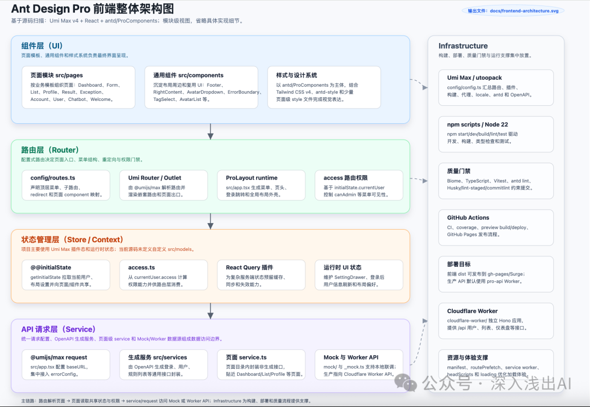
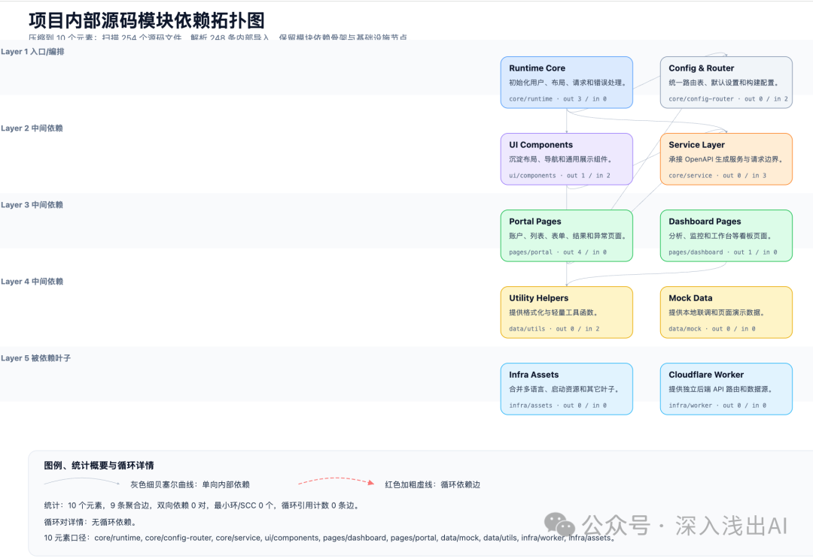
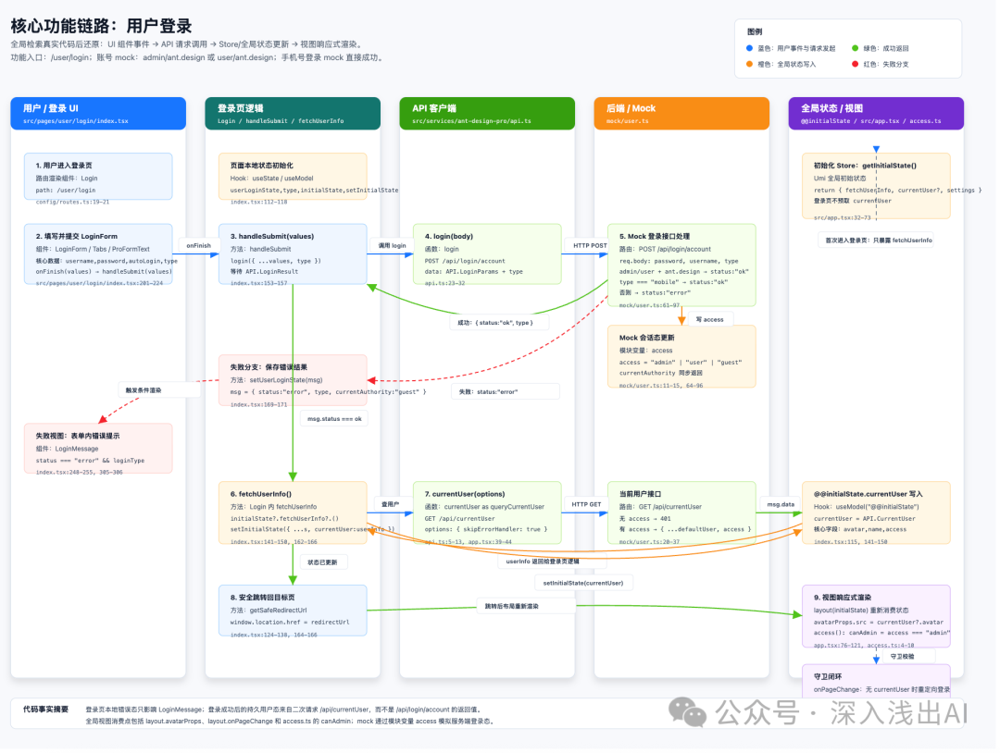
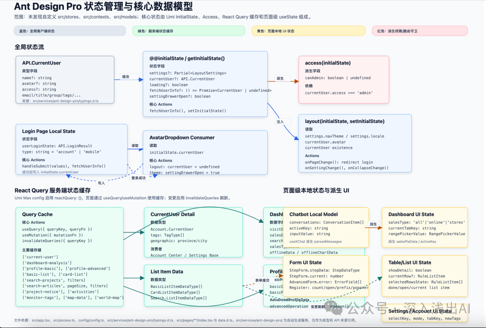
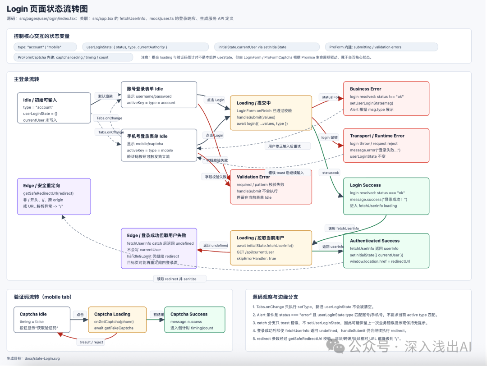
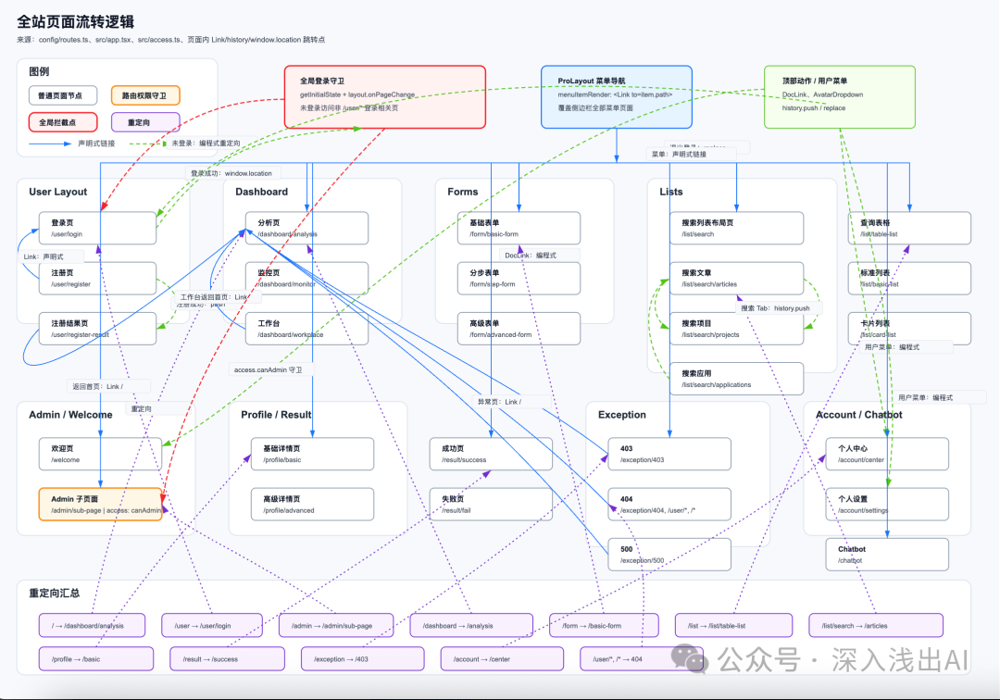
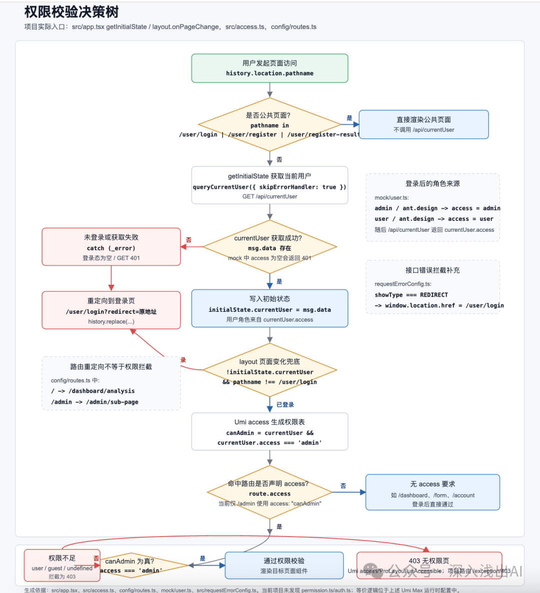
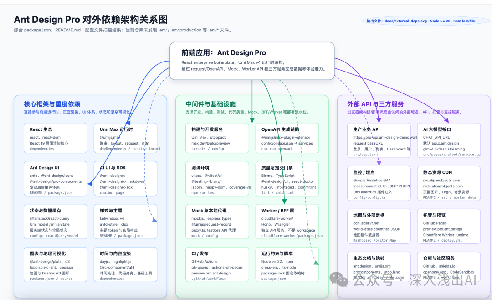
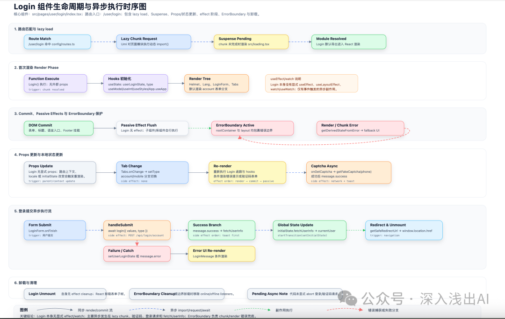

# 9 张 AI 生成的图，吃透任何一个前端项目

不管是刚入职接手一个新项目，还是被丢了一个祖传代码仓库，我们都会面临同一件事——代码几万行，文档要么没有、要么过时，你得靠自己把它摸清楚。

怎么上手？

我见过两种典型的翻车姿势。一种是让 AI 一把梭——把代码丢进去让它总结，AI 给出一段漂亮的概括，看起来头头是道，但你没验证过，心里完全没底。第二种更隐蔽，自己闷头通读代码，从入口文件开始一行一行啃，读到第三天还没出 components 目录，越读越迷失在细节里。

这两种的本质问题是一样的：**在没建立全局骨架之前，就钻进了细节。** 要么让 AI 替你钻，要么自己钻。

我的做法是反过来——**先建骨架，再填血肉。** 让 AI 帮你画图，你对着图去验、去问、去补。图不对，你马上就知道哪里不对；图对了，整个项目就有了坐标。后面再钻细节，每一步都知道自己在哪。

光说不练假把式。下面我拿 ant-design-pro 的源码实打实跑一遍——这是一个完整的后台管理系统，有路由、有权限、有状态管理、有 API 层，该有的全有。你把它 clone 下来跟着我一起操作。

先把项目拉到本地：

```
git clone https://github.com/ant-design/ant-design-pro.git
cd ant-design-pro
```

生图工具我用的是 **Codex**，Claude Code 也行，看你自己习惯。后面的图全部用 Codex 跑出来的，效果你自己看。

---

## 第一张：前端架构图

第一件事，搞清楚这个项目长什么样。别急着看细节，先把骨架搭出来。

```
分析项目源码，帮我绘制一张该前端项目的整体架构图。

## 分层规范
- 按照【组件层（UI）】、【路由层（Router）】、【状态管理层（Store/Context）】、【API 请求层（Service）】进行分层
- 展现粒度：模块级即可，不要展开具体实现细节，每个模块需标注名称和一句话核心职责
- 基础设施：构建工具、部署方案、CI/CD 等放到一个单独的方框（Infrastructure）里，别展开细节

## 输出
- 保存为 ./docs/frontend-architecture.svg
```

ant-design-pro 跑出来的效果是这样的——四层分层清晰，路由、状态管理、API 层各居其位：

这张图画完，一眼就能看出来项目整体的架构，是一张全景图。

我踩过一个坑：AI 喜欢把 Infrastructure 方框画得跟核心分层一样大，喧宾夺主。画出来不对，直接说"把 Infrastructure 缩小放角落"，一句话的事。

---

## 第二张：模块依赖图

架构图看完"长什么样"，这张图看"内部谁依赖谁"。整套提示词里最值钱的一张。

```
分析项目内部源码模块的引用关系，生成模块依赖拓扑图。

## 分析规则
- 扫描所有源文件中的内部导入语句（基于 tsconfig paths 别名）
- 下钻到子模块粒度（取别名后两级路径），合并无出度的叶子节点
- 节点数控制在 10~20，每个节点标注模块名 + 一句话职责
- 构建邻接表，DFS 检测双向边和最小环，标注循环引用计数
- 循环依赖用红色加粗虚线高亮，底部附上统计概要和循环对详情

## 输出
- ./docs/module-deps.svg
```

ant-design-pro 各模块之间的依赖关系，跑完这张图全部显形：



循环依赖藏在哪、哪个模块是所有人的"地基"、动一个模块会牵连多少东西——全在这张图里。业界有个很传神的词叫 **Blast Radius**（爆炸半径），被依赖最多的那两三个模块就是高危地基，被依赖最少的叶子节点是最安全的切入点。

举个例子——如果画出来发现 `src/utils` 竟然反向依赖了 `src/pages/Login`，这就是典型的"下水道倒灌"。utils 应该是最底层、最干净的模块，结果反过来依赖了一个业务页面。这种依赖一看就是历史遗留的野指针，重构的时候千万别先动它，先理清楚为什么会有这条路，再封堵。

---

## 第三张：交互时序图

骨架清楚了，下一个问题：业务怎么跑的？挑一个最重要的功能，从入口追到出口。ant-design-pro 里我选了**用户登录**——没什么比登录更能串起一个系统的骨架了，表单、校验、API、状态管理、路由跳转，一条链路全摸到。

```
针对项目中的核心功能【功能名，例如：用户登录/大文件上传】，通过全局检索真实代码，还原其完整的执行链路。

## 链路覆盖
- 从用户触发操作开始，完整追踪：UI 组件事件 → API 请求调用 → Store/全局状态更新 → 视图响应式渲染

## 标注规范
- 清晰标注每一步涉及的组件名称、方法名/Hook 名、以及传递的核心数据

## 输出
- 保存为 ./docs/sequence-【功能名】.svg
```



我特意对比过一次——同样的 prompt，加和不加"全局检索真实代码"跑出来的时序图完全是两个东西。不加的时候 AI 凭空脑补了一条链路，连不存在的 API 都画得有模有样，乍一看还真像那么回事。加上之后，每一步都能跟源码对上。

---

## 第四张：数据模型图

ant-design-pro 用 Umi 的 model 插件做状态管理，每个页面有自己的 model，全局还有个 `userModel` 管登录态。这个架构你要是不画图纯翻代码，光搞清楚 `userModel` 跟各个页面 model 之间的数据怎么传，就够你喝一壶的。画完这张图，十分钟的事。

```
深度解析项目中状态管理或上下文定义文件（如 src/stores 或 src/contexts），分析并梳理核心数据模型。

## 图表内容
- 绘制数据模型关系图，清晰标注每个 Model/Store 的状态字段、核心 Actions 及其数据类型

## 关系映射
- 用线条标出各 Model/Store 之间的引用、组合或派生依赖关系

## 输出
- 保存为 ./docs/data-model.svg
```



顺便提一句——TypeScript 项目把 `types/` 或 `interfaces/` 目录下的核心类型文件也丢给 AI。类型定义本身就是一张数据地图，AI 读完类型再画数据模型图，准确率高一大截。

---

## 第五张：状态机图

状态机图我挑了**登录表单**来跑。为什么选它？十几个项目下来我发现登录页是状态 bug 的重灾区——验证码倒计时、密码错误提示、token 过期跳转、网络断了重试，状态一多就容易漏。这张图把所有流转路径拍平了，哪个状态缺了、哪个分支漏了，一眼扫过去全是红的。

```
深度解析组件【组件名/页面名】的源码，提取其中控制核心交互的所有状态变量。

## 覆盖流转
- 完整绘制状态流转图，必须覆盖 idle、loading、success、error 等核心状态及边缘异常分支

## 触发条件
- 在每一次状态转换的连线上，明确标注触发该流转的动作或事件名称

## 输出
- 保存为 ./docs/state-【组件名】.svg
```



---

## 第六张：页面路由流转图

ant-design-pro 的路由配置在 `config/routes.ts` 里，几十个页面节点加上嵌套路由、权限守卫，一张图全部理清。

```
分析路由配置文件（如 router/index.ts 或类似路由表定义），梳理全站的页面流转逻辑。

## 节点与连线
- 每个路由页面作为一个节点，箭头指向代表跳转方向，连线上需注明跳转方式（声明式链接、编程式导航或重定向）

## 守卫标注
- 对挂载了路由守卫（BeforeEach / Guards）的路由节点或全局拦截点，使用不同颜色进行高亮区分

## 输出
- 保存为 ./docs/route-flow.svg
```



这张图还有个隐藏用途——新人入职第一天，丢给他这张图比丢给他代码强。我试过，看十分钟图对新人的帮助比翻一小时代码大。

---

## 第七张：权限路由守卫图

ant-design-pro 的权限体系在 `src/access.ts` 和路由守卫里，登录态判断、角色权限、页面级和按钮级控制——全是真实业务里最恶心的排查点。

```
分析项目中与权限校验相关的核心代码（如 permission.ts、auth.ts 以及路由拦截器）。

## 流程节点
- 从用户发起页面访问开始，完整画出决策树：登录状态检查 → 角色判断 → 具体权限校验 → 最终通过或拦截

## 分支去向
- 判断节点需写明校验逻辑，拦截分支需清晰标明重定向去向（如跳往 /login 或 /403）

## 输出
- 保存为 ./docs/auth-guard.svg
```



---

## 第八张：外部依赖图

这张图我每年做大版本升级之前必翻出来看一遍——哪些依赖是地基、哪些是依赖的依赖，一看就知道升级顺序怎么排。

```
综合分析 package.json、.env 配置文件（如 .env.production）和 README.md，帮我梳理该前端项目的所有对外依赖。

## 分类归纳
将所有对外依赖严格划分为以下三类：
- 核心框架与重度依赖（如 React/Vue 生态、UI 组件库、全局/局部状态管理、图像处理库等）
- 中间件与基础设施（如打包工具 Vite/Webpack、单元测试框架 Vitest、Node/BFF 层、Docker 配置等）
- 外部 API 与三方服务（如大模型 API、客服系统、监控/埋点服务等）

## 视觉呈现
- 绘制成一张架构关系图，每一类依赖使用不同的颜色进行高亮区分

## 输出
- 保存为 ./docs/external-deps.svg
```



---

## 第九张：组件生命周期图

ant-design-pro 里挑一个你最常改的页面，让 AI 画它的完整生命周期——从挂载到卸载，副作用什么时候跑、数据什么时候加载、Props 更新触发了什么。

```
针对项目中的核心组件【组件名】，绘制其从挂载到卸载的完整生命周期及异步执行时序图。

## 关键节点
- 必须包含 Props 更新、useEffect/watch 执行顺序、Suspense 挂起状态、ErrorBoundary 错误捕获以及组件 lazy load 异步加载的时机

## 执行流
- 清晰标出各个阶段的触发条件，以及副作用（Side Effects）的执行先后顺序

## 输出
- 保存为 ./docs/lifecycle-【组件名】.svg
```



说真的，这张图大部分时候用不上。但我有一次排查一个"页面切走后还在发请求"的 bug，翻了半个小时没找到根，后来让 AI 画了这张生命周期图，十分钟定位到是 useEffect 的清理函数里漏了一个 unsubscribe。

---

## 九张图收个拢

| 图名 | 核心作用 | 在 ant-design-pro 上跑出了什么 |
| --- | --- | --- |
| 前端架构图 | 一眼看清四层骨架有没有畸形 | 配置 → 页面 → 数据模型 → 服务，分层干净 |
| 模块依赖图 | 揪出循环依赖，看谁是谁的地基 | page/model/service 之间的依赖网 |
| 交互时序图 | 追一条链路从触发到渲染的全过程 | 登录链路完整追踪，每一步的调用方和被调方 |
| 数据模型图 | 搞清楚数据在哪、谁在用、怎么传 | userModel 和各页面 model 的引用关系网 |
| 状态机图 | 把所有状态流转拍平，找遗漏分支 | 登录表单 6 个状态节点、9 条转换边 |
| 路由流转图 | 页面跳转地图，守卫挂在哪个节点 | 几十个路由节点 + 嵌套守卫的拓扑 |
| 权限守卫图 | 决策树，谁在哪个节点被拦 | access.ts 三态判断 + 路由级权限分支 |
| 外部依赖图 | 版本升级前必看，分清命门和装饰 | React + Umi + antd 核心铁三角 + 外挂 |
| 生命周期图 | 查异步 bug 的时候当速查手册 | 核心页面从 mount 到 unmount 的完整时序 |

---

## 画完存到 docs/，这才刚开始

九张图画完了，但光存进 docs/ 只是第一步。我现在的习惯是——在项目根目录建一个 `CLAUDE.md` 或 `.cursor/rules`，把九张图的路径和一段项目概要写进去。AI 启动时自动加载，后面的代码建议和问题分析都会基于你沉淀的这些理解来做判断。下次对话它不会再问"这个项目是干嘛的"，地图已经印在它脑子里了。

## 附录：国产模型生图皮肤

Codex 和 Claude Code 生图效果比较稳，但如果你用的是国产模型，默认画出来的图经常文字溢出、卡片重叠、排版一团糟。这个时候需要额外挂一段视觉规范，告诉 AI 怎么控制卡片尺寸、防止文字溢出。

把下面这段提示词跟在任何一张图的 prompt 后面就行：

```
# 架构图通用皮肤规范

## 画布与字体
- 画布背景统一用 #F8FAFC，禁止纯白或纯灰
- 全局文字用深蓝黑 #0F172A，模块标题 11-12px 加粗，职责描述 9px 常规
- 描述文字必须用带色相的低饱和深色，禁止直接用纯灰

## 卡片宽度自适应
- 禁止所有卡片使用固定宽度。根据卡片内最长一行文本动态计算宽度
- 文本像素估算：英文/符号 × 5.5px，中文/中文标点 × 11px
- 最终卡片宽度 = 文本像素值 + 40px（含左右 padding）
- 卡片水平排列间距固定 14px

## 卡片高度由行数撑高
- 描述文字禁止单行不换行，必须根据卡片可用宽度自动折行
- 总行数 = Math.ceil(文本总像素 / 可用宽度)
- 卡片高度 = 32px（标题区）+ 总行数 × 13px（每行字高+行距）
- 多行文字用 SVG foreignObject 标签包裹 HTML div，高度按上述公式动态计算

## 视觉细节
- 外层大容器圆角 8px，内部小卡片圆角 6px
- 大容器左侧带一条 56px 宽的实色侧边栏，文字白色加粗居中
```

---

## 最后说几句

**别指望 AI 一笔画对。** 它可能漏掉关键的异步链路、把依赖方向画反、把废弃模块当核心。AI 只读代码，读不到代码之外的事——历史包袱、隐性约束、老王脑子里的特殊对接逻辑，这些它一概不知道。

架构决策、业务判断、风险评估——这些事别甩给 AI，它扛不住。但翻代码、理关系、画图——这些体力活，AI 比你快得多。分工清楚，别搞反了。

图不是画完就完了。存进 docs/ 才算完。不过提醒一句——项目越大，节点越多，AI 第一次画出来的图大概率挤成一团或者漏东西。别指望一把过，让 AI 调。跟它说"这个区域太挤了，拆开""漏了 xxx 模块，补上""这个箭头方向反了"。迭代三五轮很正常，我跑 ant-design-pro 也调了好几次才拿到能看的版本。

你脑子里的理解三个月后剩不了一半，但文档里的图永远在那。下一个接手的人打开看到这九张图，比你口述三小时管用。

---

**别光看我跑。拿你公司现在手上的项目试一遍，9 个提示词挨个丢进去，评论区欢迎留言。**
