# 深度体验 AgentMemory：给企业 AI Coding 装上共享工程记忆层

> ⚠️ 本文的 AgentMemory 非腾讯开源的 TencentDB Agent Memory 项目，而是另一个独立开源项目（23k+ stars）。

尽管当前主流 Coding Agent 的上下文与记忆能力越来越完善，但在实际使用中还会遇到这样的挑战：多个 Agent 独立工作，大量事实与决策停留在会话记录里，导致跨 Session / Agent / 团队的经验教训很难持续复用。

更有像笔者这样的重度 AI "患者"，常在多个 Coding 工具间切换，一些重复性任务也经常会掉进同一个"坑"里。放大到团队场景，类似问题会更加明显。这就是开源项目 **AgentMemory**（23k+ stars）试图解决的问题：**给 AI Coding 加一层共享、持久、易使用的记忆服务。**

本文拆解这款为 AI Coding 设计的 Memory 项目：

- 为什么 AI Coding 还需要一套独立的记忆？
- AgentMemory 拆解：如何把任务痕迹变成工程记忆？
- 从 Hook 到 MCP：跑通 AgentMemory 的记忆闭环
- 结束语：AgentMemory 的工程化价值


---

## 01 / 为什么 AI Coding 还需要一套独立的记忆？

相信很多团队在 AI Coding 时遇到的最大挑战之一，是"上下文不够"。在大型代码仓库上做 AI Coding，模型需要足够的上下文：业务背景、代码结构、接口约束、开发规范等，都会直接影响代码质量。

但问题在于，扩大上下文本身也并不是万能解法。一方面，上下文窗口再大，也不代表模型一定能抓住真正相关的信息，关键信息可能会被淹没。另一方面，也是最重要的问题：很多 AI Coding 过程中有价值的信息，并不都适合完整的塞进上下文。

考虑这样一个场景：
> **Agent A**：优化系统的登录模块，并自动引入了一个加密库，但你在测试后发现它会影响兼容性，因此要求放弃了该方案。
> 一段时间后...
> **Agent B**：遇到相同的优化任务，又引入了相同的加密库，相同的"坑"又掉一次......

这里的问题是，后续的 Agent 无法知道：这个库之前试过，有兼容性问题。很显然，这类信息并不适合塞进完整的上下文。它更像是一条阶段性的经验教训。

| 场景 | 上下文的短板 | 需要的记忆能力 |
| --- | --- | --- |
| 跨会话开发 | 新会话不知道上次改到哪 | 记录会话痕迹、执行摘要等 |
| 决策复用 | 聊天记录不方便检索 | 临时决策也需要结构化沉淀 |
| 多 Agent 分工 | 设计、开发、审核互不相通 | 一套可以共享的记忆服务 |
| 安全与合规 | Agent 做了什么难以追踪 | 可以事后查看、回放、审计 |

企业 AI Coding 不仅需要让 Agent 多记一点，还需要它像一名靠谱的同事一样：能够自动记录工作痕迹，沉淀工作过程中的关键经验，并在下一次相关任务中被检索和复用。这就是 AgentMemory 体现的价值。

### Skill 能不能替代 AgentMemory？

提到经验的复用，很多人会想起 Skill。但 Skill 更像是一套事前固化的工作流程和知识包。它和 Memory 之间是互补关系，一个更偏前置规则，一个则是后置沉淀。

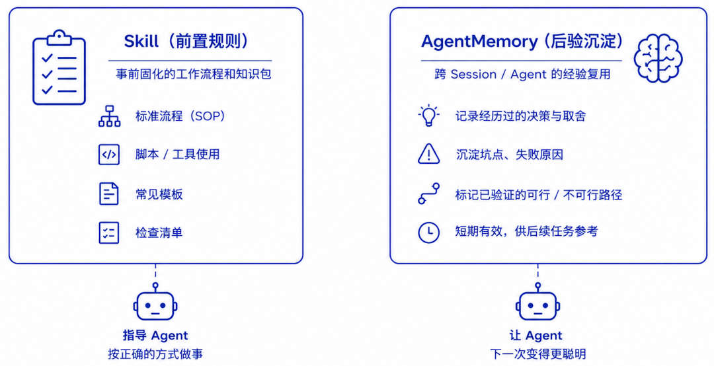

**三者各司其职：** 上下文知识库（前置知识）、Skills（前置流程）、AgentMemory（后置沉淀）可以完美搭配。

---

## 02 / AgentMemory 拆解：如何把任务痕迹变成工程记忆

AgentMemory 核心定位是**面向 Agent 的持久化记忆层**。简单来说：它把 Claude Code、Cursor、自研 Agent 等工具在会话过程中产生的经验，通过一个后端服务沉淀下来，再借助检索能力带入下一次相关任务。

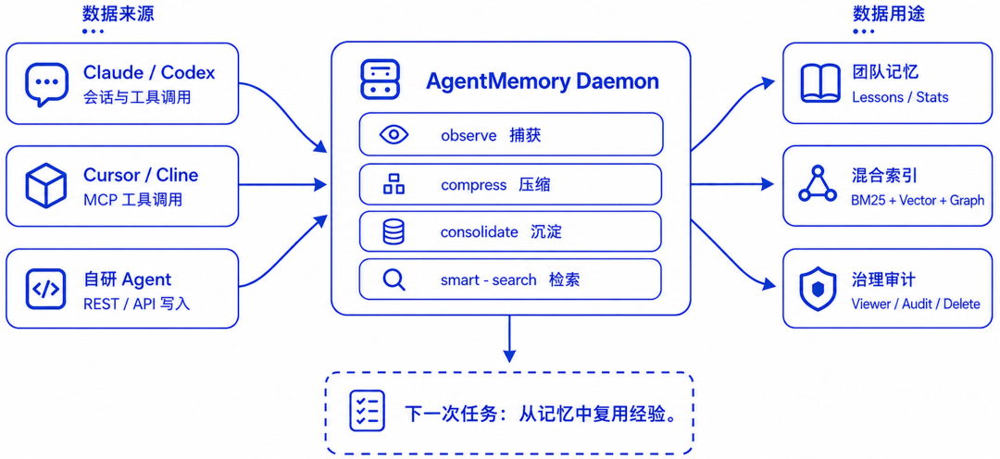

### 核心概念

| 概念 | 说明 | 举例 |
| --- | --- | --- |
| **Session** | 记忆的源头，一次相对完整的编码会话 | 排查某 API 调用失败，从分析到修复 |
| **Observation** | 通过 Hooks 实时捕获的会话痕迹 | Agent 读取了 API 代码、运行测试、得到失败日志 |
| **Memory** | 长期存在的事实或判断（偏好/模式/架构/Bug/流程） | "某个 API 的配置来自 `.env` 和 `config.yaml`" |
| **Lesson** | 经验教训，强调"下次该怎么做" | "排查组件异常时应同时检查代码、配置和运行时" |
| **Graph** | 基于 Observation 抽取的知识图谱 | 把 `API.ts`、`config.yaml`、timeout、修复决策等关联起来 |

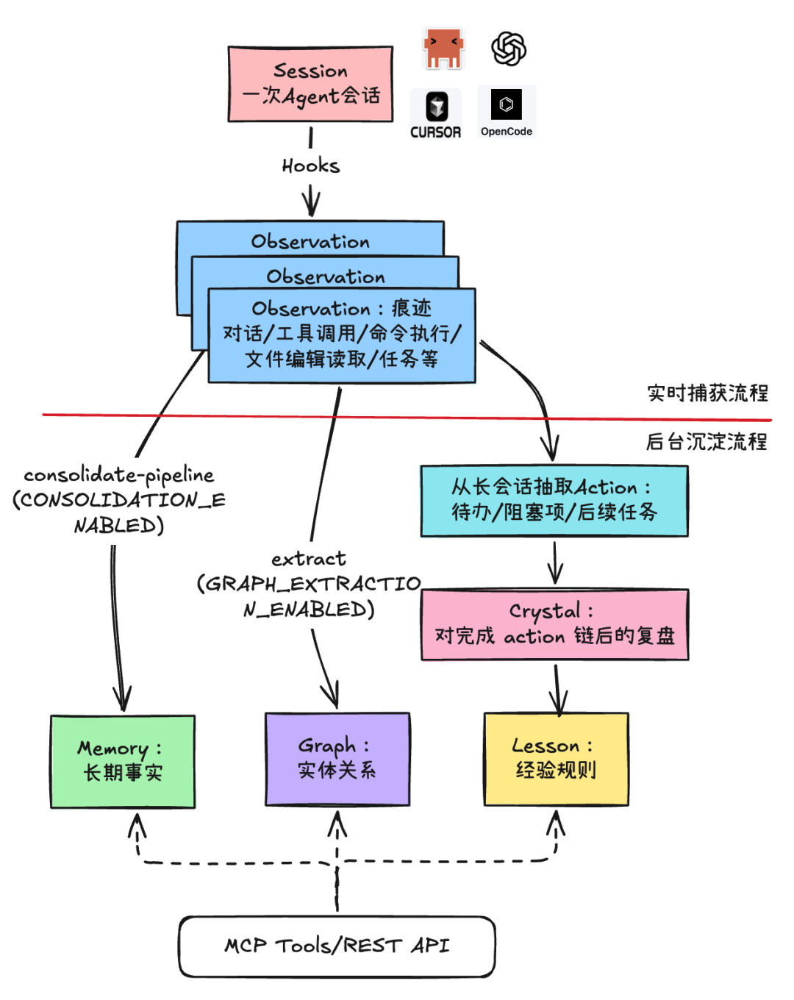

### 关键流程

**Observation 捕获：** 通过 Hooks 实时捕获 Agent 工作过程中的关键事件（会话开始、工具调用、会话结束等不同阶段的 Hook）。Hook 捕获到的事件被送入 `mem::observe`，经过校验、脱敏、去重、压缩等步骤，形成压缩的 Observation。

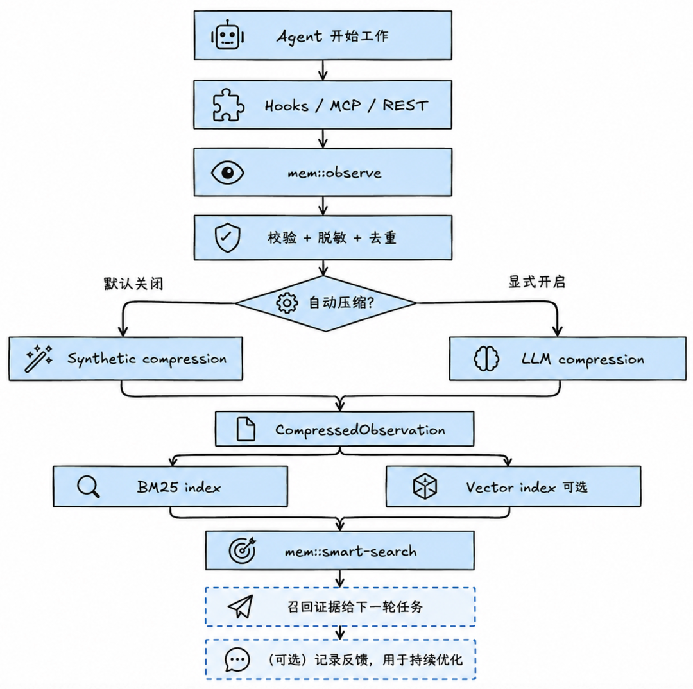
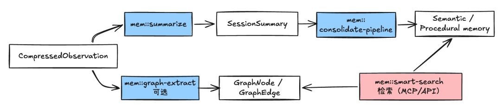

**Memory 沉淀：** 后台主要借助 LLM 从已形成的 Observations 中判断哪些内容值得进一步沉淀为长期 Memory。Memory 会被细分为多种类型（偏好、Bug、架构决策等）。

### MCP + REST API

AgentMemory 的大部分能力通过 MCP Tools 与 REST API 对外提供，可以方便地集成到 Claude Code、Cursor、自研 Agent 中。

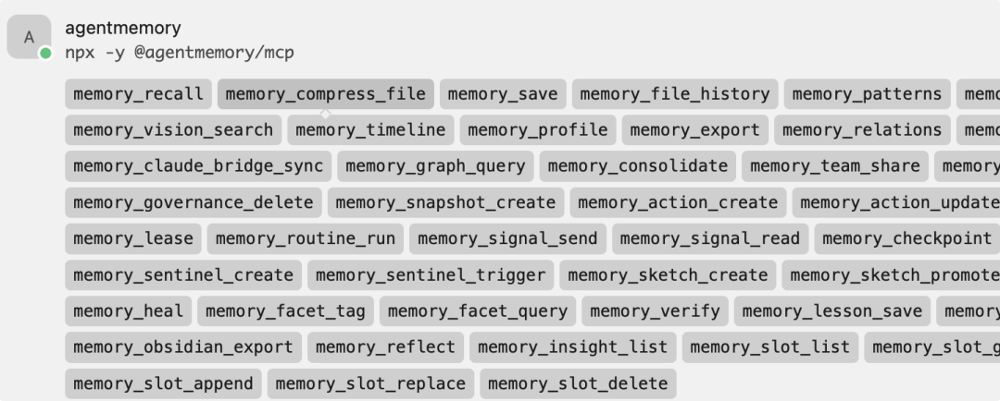

---

## 03 / 从 Hook 到 MCP：跑通 AgentMemory 的记忆闭环

### 安装、配置与启动

```bash
# 快速启动
npx -y @agentmemory/agentmemory@latest

# 推荐：长期使用用 npm 安装
npm install -g @agentmemory/agentmemory
```

安装后配置 `~/.agentmemory/.env`：

```env
MINIMAX_API_KEY=
MINIMAX_MODEL=
EMBEDDING_PROVIDER=local
AGENTMEMORY_AUTO_COMPRESS=true
GRAPH_EXTRACTION_ENABLED=true
CONSOLIDATION_ENABLED=true
TOKEN_BUDGET=2000
AGENTMEMORY_SECRET={自行设置}
```

注意：AgentMemory 不强制配置 LLM 和 embedding，但不配置会退化为本地压缩算法 + 仅 BM25 关键词检索，无法实现 LLM 压缩与混合检索。

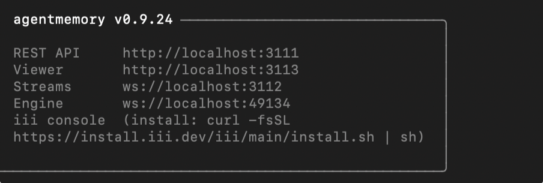

### 配置 Agent Hooks（以 Claude Code 为例）

```bash
agentmemory connect claude-code --with-hooks
```

这会自动在 `~/.claude/settings.json` 中写入 Hooks 配置：

```json
"env": {
    "AGENTMEMORY_URL": "http://localhost:3111",
    "AGENTMEMORY_SECRET": "my-team-secret-2024"
},
"hooks": {
    "SessionStart": [
      {
        "hooks": [
          {
            "type": "command",
            "command": "node \"/path/to/plugin/scripts/session-start.mjs\""
          }
        ]
      }
    ]
}
```

### 在 Claude Code 中启动会话

设置 Hook 后，Claude Code 会话中的行为轨迹会被自动捕获、压缩与保存成 Observations。

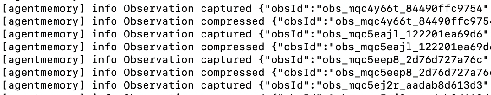
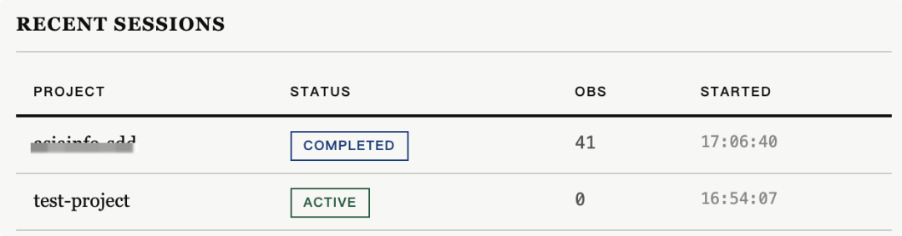
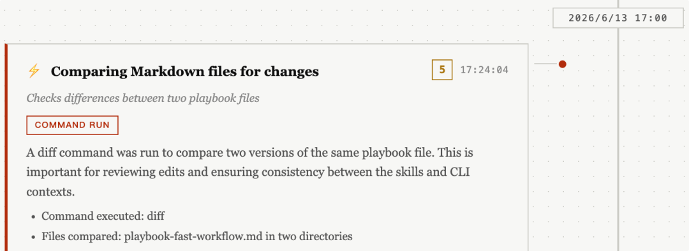

完成代码审查任务后，会话结束后会自动触发 Consolidation，抽取出可能的 Memory——比如从对话中发现了你的偏好：

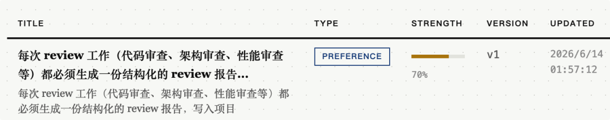

### 配置 MCP 客户端（以 Cursor 为例）

```json
"agentmemory": {
      "command": "npx",
      "args": ["-y", "@agentmemory/mcp"],
      "env": {
        "AGENTMEMORY_URL": "http://localhost:3111",
        "AGENTMEMORY_SECRET": "my-team-secret-2024"
      }
}
```

### 记住一条决策

在 Cursor 中与 Agent 对话，让它记住一条决策（实际应用中通常是自动的，这里为了演示显式调用）：

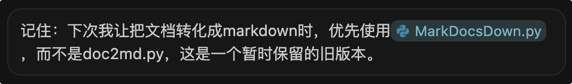

Agent 会调用 `remember` 工具，把决策存成一条 Memory：


### 记录一条现象（Bug 类型）

模拟在实际任务中记录观察到的现象和测试结果，这里的 Memory 类型是"bug"：

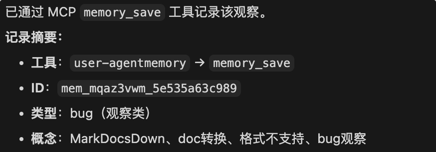

### 测试记忆召回

换一个新的 Coding Agent（配置好 MCP）来召回记忆：

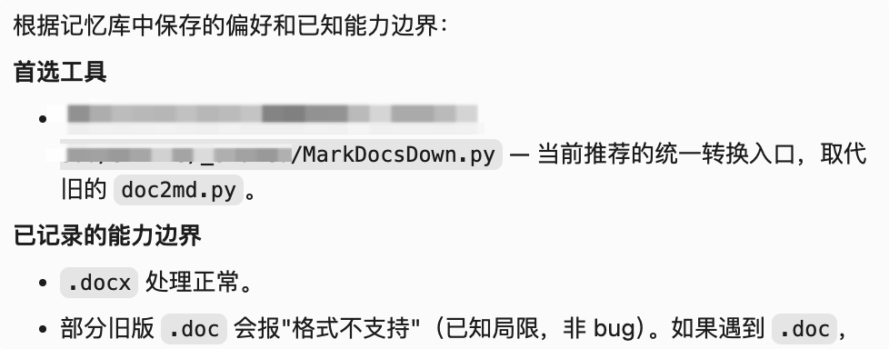

Agent 会调用 `memory-*smart-*search` 工具，召回关联的记忆——从而能够复用你、甚至团队成员的决策与工具经验。

### 使用 REST API

如果你构建自己的独立 Agent（如基于 LangChain、Google ADK），可借助 REST API 访问 AgentMemory：

```javascript
const base = process.env.AGENTMEMORY_URL || "http://127.0.0.1:3111";
const secret = process.env.AGENTMEMORY_SECRET || "";

async function post(path, body) {
  const res = await fetch(`${base}${path}`, {
    method: "POST",
    headers: {
      "Content-Type": "application/json",
      ...(secret ? { Authorization: `Bearer ${secret}` } : {})
    },
    body: JSON.stringify(body)
  });
  if (!res.ok) throw new Error(`${path} ${res.status}: ${await res.text()}`);
  return res.json();
}

const project = "pay-service";
await post("/agentmemory/remember", {
  project,
  type: "lesson",
  content: "支付回调必须按 provider + event_id 做幂等唯一键；订单状态只允许 pending -> paid，重复 paid 事件应返回 200 但不再次扣款。",
  tags: ["payment", "idempotency", "callback"]
});
```

---

## 04 / 结束语：AgentMemory 的工程化价值

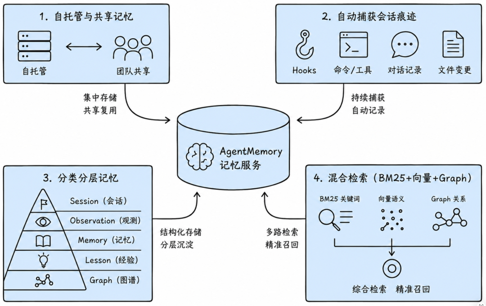

AgentMemory 未必能让 Coding Agent 立刻变得更聪明，但它可以降低 Agent 忘记已有决策、重复排查老问题、忽略历史测试结论的概率，从而提高任务处理的连续性和正确性，降低不必要的推理、返工与 Token 消耗。

如果说 Coding Agent 内置的 Memory 更像个人笔记本，那么 AgentMemory 更像**一块可共享的工程白板**：它可以跨会话、跨工具、跨团队记录关键经验，并具备更好的可观察性和扩展空间。

在这个意义上，它值得正在推进 AI Coding 工程化的团队试一试。

---

> **核心记忆模型：** Session（源头）→ Observation（痕迹）→ Memory / Lesson / Graph（沉淀）  
> **接入方式：** Hooks（自动捕获）+ MCP Tools + REST API  
> **适用工具：** Claude Code、Cursor、自研 Agent 等  
> **项目地址：** GitHub 23k+ stars
