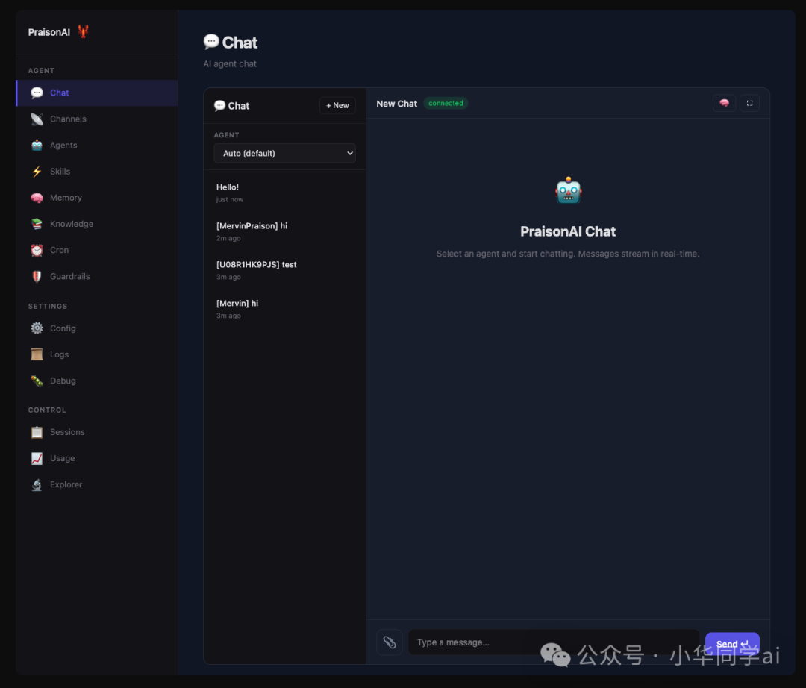
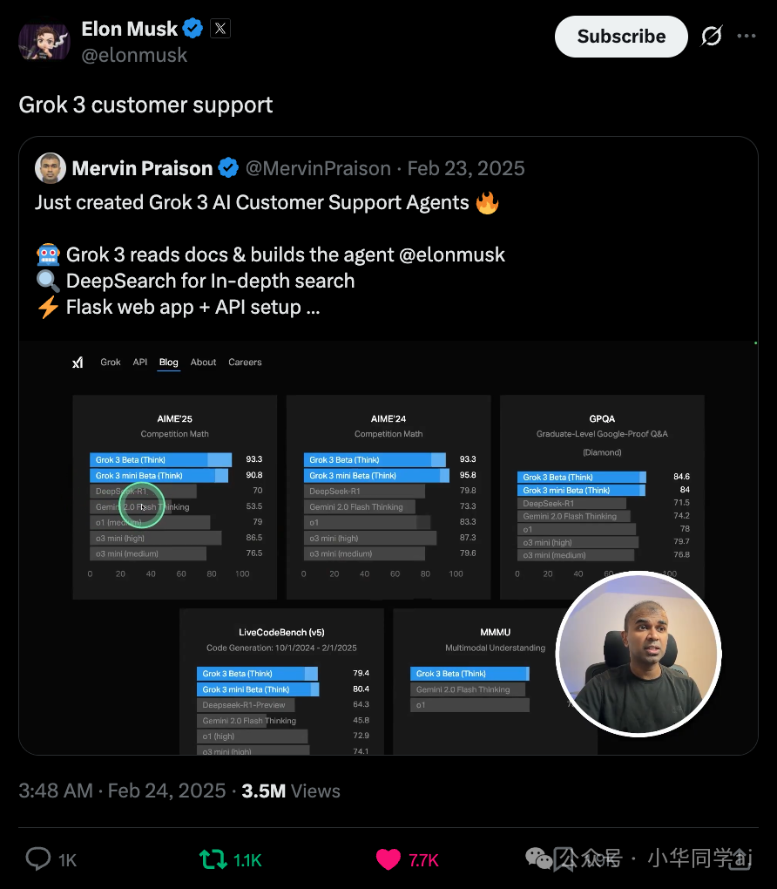
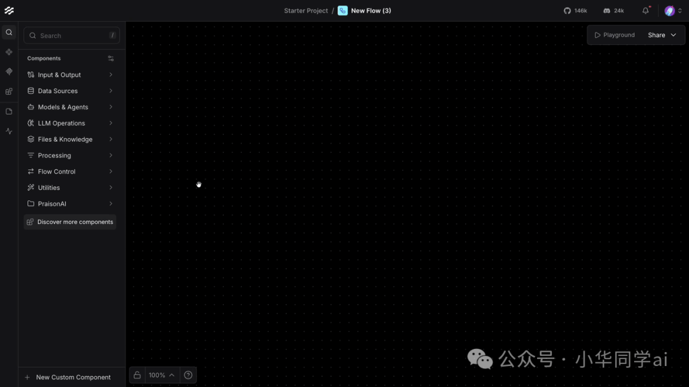
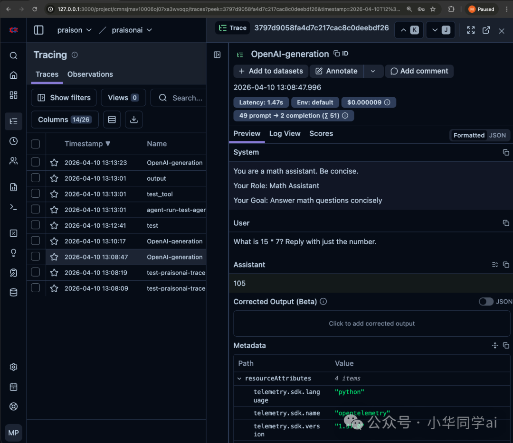

# PraisonAI 开源项目，让你快速拥有一支 AI 程序员军团，5 行代码部署你的 AI Agent 团队

> 你是否想过，像管理一支真实团队一样管理 AI？让一个 Agent 负责研究、一个负责写作、一个负责审核，它们自主协作、互相交接，而你只需要一句话下达任务？今天介绍的 PraisonAI，正是为此而生。


**PraisonAI 是一个开源的低代码多智能体框架，主打「用极少代码组建 AI 劳动力」。**

它的核心理念是：**雇佣一支 24/7 的 AI 团队**。你不需要为 Agent 写大量样板代码，也无需手动编排复杂的消息传递——从单个 Agent 到整个 Agent 组织，只需 **5 行代码**即可部署。

更关键的是，它支持 **100+ 大模型**（从 OpenAI 到 Ollama 本地模型全兼容）、**100+ 内置工具**，以及 MCP 协议、深度研究、自反思、可视化工作流等一整套能力。

项目采用 **MIT 开源协议**，完全免费。



---

## 为什么值得关注？

### 1. 连 Elon Musk 都提到过它

Elon Musk 曾在 X 上引用 PraisonAI 来演示 AI Agent 的能力，侧面说明了这个项目在海外开发者社区的火热程度。



### 2. 性能炸裂：Agent 实例化仅需 3.77 微秒

在 AI Agent 框架中，启动延迟是个容易被忽视的问题。当你需要同时运行数十个 Agent 时，毫秒级的差异会被放大。据官方 Benchmark 测试，PraisonAI 的 Agent 平均实例化时间仅 **3.77 微秒**——这个数字意味着你几乎可以瞬时创建上千个 Agent。

### 3. 生态完整得让人省心

这可能是当前工具链最完整的开源多 Agent 框架之一。从 SDK、CLI 到可视化 Dashboard，从 Python 到 JavaScript，从本地部署到云端，它全都有。

---

## 多 Agent 协作机制：它是怎么做到的？

在展开具体特性之前，有必要先理解 PraisonAI 的协作架构。它并不是简单地让多个 Agent 轮流说话，而是内置了一套完整的编排机制：

**分层管理模型**：PraisonAI 支持两种协作模式。`Agents` 模式下，多个 Agent 通过内置的对话传递协议（Handoffs）进行点对点交接，每个 Agent 可以将当前任务连同上下文一并转交给下一个 Agent。`AgentTeam` 模式则引入了一个「Manager Agent」，由它根据各 Agent 的角色定义和任务依赖，自动拆解、分配和调度工作任务——你只需要定义角色和任务，编排逻辑由框架完成。

**工具即插即用**：Agent 通过 MCP 协议（支持 stdio、HTTP、WebSocket、SSE 四种连接方式）接入外部工具，从数据库查询到网页搜索无缝打通。Agent 在执行任务时自行判断何时调用哪个工具，框架负责将工具的执行结果重新注入对话上下文。

**记忆与状态的持久化**：PraisonAI 内置了零依赖的本地记忆系统，也支持 PostgreSQL 等 20+ 数据库。这意味着 Agent 可以记住之前的对话，跨会话保持状态，甚至生成长期的知识图谱。

简单来说：**你定义 Agent 的角色和目标，框架负责调度、通信和状态管理。** 这也是为什么 5 行代码能做的事，在传统方案里需要几百行样板代码。

---

## 核心特性拆解：它到底能做哪些事

### 1. 多 Agent 自主协作

这是 PraisonAI 的看家本领。你可以用 **Python 代码**定义多个 Agent，每个 Agent 有自己的角色、目标和指令：

```python
from praisonaiagents import Agent, Agents

research_agent = Agent(
    instructions="You are a senior researcher. Find and analyze the latest AI trends."
)

writer_agent = Agent(
    instructions="You are a content writer. Write an engaging blog post based on the research."
)

agents = Agents(agents=[research_agent, writer_agent])
agents.start("Write a blog post about 2025 AI trends")
```

也可以直接用 **YAML 配置实现零代码协作**：

```yaml
framework: praisonai
topic: "Write a blog post about AI"

agents:
  researcher:
    role: Research Analyst
    goal: Research AI trends and gather information
    instructions: "Find accurate information about AI trends"

  writer:
    role: Content Writer
    goal: Write engaging blog posts
    instructions: "Write clear, engaging content based on research"
```

运行：`praisonai agents.yaml`

更高级的用法是 **AgentTeam + Task 模式**，支持分层管理器和复杂任务编排：

```python
from praisonaiagents import Agent, Task, AgentTeam

researcher = Agent(
    name="Researcher",
    role="Senior Research Analyst",
    goal="Uncover cutting-edge developments in AI",
    backstory="You are an expert at a technology research group",
    llm="gpt-4o"
)

writer = Agent(
    name="Writer",
    role="Tech Content Strategist",
    goal="Craft compelling content on tech advancements",
    backstory="You are a content strategist",
    llm="gpt-4o"
)

task1 = Task(
    name="research_task",
    description="Analyze 2024's AI advancements",
    expected_output="A detailed report",
    agent=researcher
)

task2 = Task(
    name="writing_task",
    description="Create a blog post about AI advancements",
    expected_output="A blog post",
    agent=writer
)

team = AgentTeam(
    agents=[researcher, writer],
    tasks=[task1, task2],
    process="hierarchical",
    manager_llm="gpt-4o"
)
result = team.start()
```

### 2. MCP 协议全支持

MCP（Model Context Protocol）是当前最热门的 Agent 工具协议。PraisonAI 对它的支持几乎是「全家桶」级别——stdio、HTTP、WebSocket、SSE 四种协议全部支持：

```python
from praisonaiagents import Agent, MCP

# 方式一：stdio 本地 MCP 服务器
agent = Agent(
    instructions="You have memory capabilities",
    tools=MCP("npx @modelcontextprotocol/server-memory")
)

# 方式二：Streamable HTTP 远程服务器
agent = Agent(
    instructions="You can access remote tools",
    tools=MCP("https://api.example.com/mcp")
)

# 方式三：WebSocket 实时双向通信
agent = Agent(
    instructions="Real-time agent with bidirectional tools",
    tools=MCP("wss://api.example.com/mcp", auth_token="your-token")
)

# 方式四：带环境变量的 MCP 服务（如 Brave Search）
agent = Agent(
    instructions="You can search the web",
    tools=MCP(
        command="npx",
        args=["-y", "@modelcontextprotocol/server-brave-search"],
        env={"BRAVE_API_KEY": "your-key"}
    )
)
```

### 3. 可视化工作流构建

PraisonAI 提供了基于 Langflow 的拖拽式可视化构建器：

```bash
pip install "praisonai[flow]"
praisonai flow
```

浏览器打开 `http://localhost:7861`，就可以像搭积木一样把 Agent 串联起来。



### 4. Claw Dashboard：一站式管理面板

```bash
pip install "praisonai[claw]"
praisonai claw
```

打开 `http://localhost:8082`，你会看到一个包含 **13 个内置页面**的完整管理后台——Chat、Agents、Memory、Knowledge、Channels、Guardrails、Cron 调度等一应俱全。更重要的是，它支持连接到 **Telegram、Slack、Discord、WhatsApp**，让你的 Agent 直接在这些即时通讯工具中对客服务。


### 5. 自定义工具 + 安全提醒

你可以轻松定义自己的工具函数：

```python
from praisonaiagents import Agent, tool

@tool
def search(query: str) -> str:
    """Search the web for information."""
    return f"Results for: {query}"

@tool
def calculate(expression: str) -> float:
    """Safely evaluate a numeric arithmetic expression."""
    import ast, operator
    allowed_ops = {
        ast.Add: operator.add, ast.Sub: operator.sub,
        ast.Mult: operator.mul, ast.Div: operator.truediv,
        ast.Pow: operator.pow
    }
    # 安全解析，避免 eval()
    tree = ast.parse(expression, mode='eval')
    # ... 实现安全的表达式计算

agent = Agent(
    instructions="You are a helpful assistant",
    tools=[search, calculate]
)
agent.start("Search for AI news and calculate 15*4")
```

> ⚠️ **安全提醒**：定义工具函数时，**永远不要直接使用 `eval()`、`exec()` 或 `os.system()` 处理 LLM 生成的内容或用户输入。** 上面的 `calculate` 示例使用了 `ast` 安全解析，是你应该遵循的最佳实践。

### 6. Guardrails 安全护栏

PraisonAI 内置了输入/输出安全校验机制，可以过滤恶意提示词、审查输出内容，确保 Agent 的行为在可预期范围内。这在企业级部署中非常重要。

---

## 快速上手：3 分钟跑起来

### 安装

```bash
# 一键安装（推荐）
curl -fsSL https://praison.ai/install.sh | bash

# 或者 pip 安装核心 SDK
pip install praisonaiagents
```

### 你的第一个 Agent

```python
from praisonaiagents import Agent

agent = Agent(
    instructions="You are a helpful AI assistant that speaks Chinese"
)
agent.start("用中文介绍一下人工智能的未来趋势")
```

就这么简单。5 行代码，一个具备完整能力的 AI Agent 就跑起来了。

> 💡 **第一次跑通的感受**：我启动了两个 Agent——Researcher 负责搜索资料、Writer 负责写文章。看着终端里 Researcher 逐条返回搜索结果，然后 Writer 自动接过去开始生成大纲——两个 Agent 像真实同事一样"交接任务"——那一刻我才真正理解什么叫多 Agent 协作。不是"一个 AI 做所有事"，而是"多个 AI 各司其职"。

如果你想进阶，可以这样启用记忆、数据库持久化和会话管理：

```python
from praisonaiagents import Agent, db

agent = Agent(
    name="MyAssistant",
    instructions="You are a knowledgeable assistant",
    memory=True,                          # 启用记忆
    db=db(database_url="postgresql://localhost/mydb"),  # 持久化
    session_id="my-session"               # 会话管理
)
agent.chat("Hello! Remember my name is Xiao Wang.")
```

PraisonAI 支持 **PostgreSQL、MySQL、SQLite、MongoDB、Redis** 等 20+ 数据库，同时内置了 **无需任何外部依赖的本地文件记忆系统**，开箱即用。

### 使用本地模型（Ollama）

```bash
ollama serve
export OPENAI_API_KEY=ollama
export OPENAI_BASE_URL=http://localhost:11434/v1
python your_agent.py
```

---

## 生态全景：不止是 Agent 框架

PraisonAI 提供了一套完整的、递进式的产品栈：

| 组件 | 安装 | 用途 |
| --- | --- | --- |
| **Core SDK** | `pip install praisonaiagents` | 纯 Python 核心库，所有能力的基础 |
| **CLI 工具** | `pip install praisonai` | 终端命令行，YAML 驱动，零代码运行 |
| **Claw Dashboard** | `pip install "praisonai[claw]"` | 管理面板，连接 IM 渠道 |
| **Flow Builder** | `pip install "praisonai[flow]"` | 拖拽式可视化工作流设计 |
| **UI Chat** | `pip install "praisonai[ui]"` | 轻量聊天界面 |
| **JS/TS SDK** | `npm install praisonai` | Node.js 生态支持 |

### 精选高级特性

- **Deep Research** — Agent 自动将复杂问题拆解为多步研究任务，逐层深入检索，最终汇总为结构化报告
- **Self Reflection** — Agent 在生成输出后自动进行自我审查，评估准确性和完整性，发现问题后自动修正
- **Planning Mode** — 任务执行前，Agent 先自主制定执行计划（Planning → Execution → Reasoning）
- **Agent Handoffs** — Agent 之间无缝交接任务和上下文
- **Context Compaction** — 自动压缩对话上下文，确保长对话永不触及 Token 上限
- **OpenTelemetry + Langfuse** — 全链路追踪与可观测性

### 大模型生态：100+ 模型全覆盖

| 类别 | 提供商 |
| --- | --- |
| 云端 | OpenAI, Anthropic Claude, Google Gemini, Azure OpenAI, AWS Bedrock, Groq, xAI Grok, Mistral, DeepSeek, Perplexity, Cerebras, Moonshot 等 |
| 本地 | Ollama, HuggingFace, vLLM |
| 代理 | OpenRouter, Together AI, Fireworks, Replicate |

### 可观测性

PraisonAI 集成了 OpenTelemetry 和 Langfuse，让你可以清晰地看到每个 Agent 的执行链路：



---

## 真实使用场景

| 场景 | 实际能做什么 |
| --- | --- |
| 🔍 **研究与分析** | 从多个数据源自动采集信息，多 Agent 协同深度研究，生成洞察报告 |
| 💻 **代码生成** | 理解代码库需求，自动编写、调试和重构代码 |
| ✍️ **内容创作** | 组建「研究+写作+审核」Agent 团队，批量生产博客、文档、营销文案 |
| 📊 **数据管道** | 从 API、数据库、网页自动抽取和转换数据，AI 辅助分析 |
| 🤖 **客户支持** | 连接 Telegram/Discord/Slack/WhatsApp，7×24 智能客服 |
| ⚙️ **工作流自动化** | 多步骤业务流程自动执行，含交接、验证、自我修正 |

### 场景案例：智能客服

假设你运营一个 SaaS 产品的开发者社区，用户每天在 Discord 上提大量技术问题。用 PraisonAI 可以这样搭建智能客服：

1. 部署 Claw Dashboard，连接 Discord 频道
2. 配置一个 `Support Agent`，角色为"资深技术支持工程师"，接入产品文档 RAG 知识库
3. 当用户在 Discord 提问时，Agent 自动从知识库检索相关文档片段，结合上下文生成准确回复
4. 如果问题超出 Agent 能力范围（`Guardrails` 检测到低置信度），自动 `Handoff` 给人工客服，并附带对话摘要
5. 通过 `Self Reflection` 机制，Agent 会在回复前自查答案准确性，减少误导

全程不需要写一行新代码，只需 YAML 配置 + Dashboard 操作。这就是 PraisonAI 的「从零到生产」路径。

### 场景案例：自动化代码审查

1. 通过 MCP 连接 GitHub API，监听仓库的新 PR
2. 配置一个 `Code Review Agent`，指令为"审查代码的潜在 Bug、安全漏洞和代码规范问题"
3. 当一个新 PR 提交时，Agent 自动拉取 diff，逐文件分析，生成审查意见
4. 对于能自动修复的问题（如格式规范），Agent 直接通过 Git 提交修正
5. 复杂问题则在 PR 下以评论形式输出，标记严重等级

配合 `Shadow Git Checkpoints` 特性，修复出错时还能自动回滚。

---

## 总结

PraisonAI 给我印象最深的地方是它的「完备性」：

1. **上手极低** — 5 行代码运行第一个 Agent，YAML 配置实现零代码协作
2. **天花板极高** — 25 项高级特性覆盖了从开发到生产的所有需求
3. **生态极全** — SDK / CLI / Dashboard / Flow Builder / JS SDK 五合一
4. **兼容极广** — 100+ 模型、MCP 全协议、20+ 数据库、多 IM 渠道
5. **完全开源** — MIT 协议，没有商业套路

**安装只需一行：**

```bash
curl -fsSL https://praison.ai/install.sh | bash
```

## 项目地址

<https://github.com/MervinPraison/PraisonAI>
