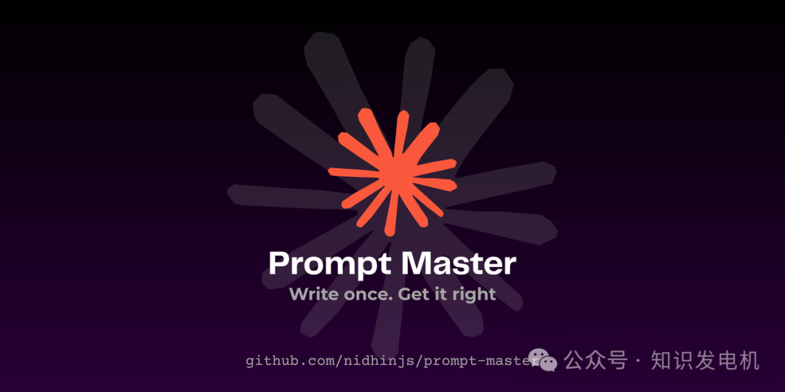

# 写提示词比写代码还累？装上这款插件，彻底终结"AI听不懂人话"！

**每天用AI写代码、生成图片、做自动化，很多人第一步就卡在"怎么写提示"上。** 输入一句模糊描述，模型吐出半对半错的东西，然后你开始第二轮、第三轮追问。几轮下来，token花了不少，时间也浪费了。

**Prompt Master 这个 Claude 技能直接把"写提示"这件事外包给 AI 自己**，它能针对不同工具生成负载最重的精准提示，一次就尽量到位。

我自己用AI工具时，经常遇到"写提示比写代码还费劲"的情况。尤其是切换 Midjourney、Claude Code、Cursor 这些不同场景，脑子里那套经验很难复用。看到这个 GitHub 项目后，我试了试，发现它确实把重复劳动砍掉了一大块。不是又一个"提示词大全"工具，而是真正跑一套结构化流程的技能。



**Prompt Master 让普通用户也能用上专家级的提示工程，而不用自己记住一堆框架和最佳实践。** 它在 Claude 里自然调用，针对目标工具自动适配，输出一个干净、可直接复制的提示块，还附带一行策略说明。理论上，这能把多次迭代的成本压到最低。

---

## 它到底解决了什么痛点

用AI最常见的浪费，就是"模糊输入→错误输出→反复修正"。一个简单任务可能要4次交互，乘以一天几十次，API费用和等待时间很快就累积起来。

Prompt Master 的核心洞察是：**最好的提示不是最长的，而是每个词都"承重"的。** 它不盲目加长度，而是做减法，剥离多余部分，同时保留必要结构。

对普通读者来说，这就像外卖App自动帮你把地址和备注翻译成骑手能精确执行的指令，而不是你自己试错描述"大概在那个路口附近"。你只需要说"我要一份什么什么"，系统就帮你把细节补齐到不会出错的程度。

对同行来讲，这意味着提示工程从"艺术"向"可重复流程"迈了一步。它内置了检测目标工具、提取9个意图维度（任务、输入、输出、约束、上下文等）、最多问3个澄清问题、路由到合适框架、做 token 效率审计等步骤。整个过程用户几乎无感，最后拿到的是经过精炼的输出。

我之前自己写提示时，常犯的错误是把所有框架混在一起用，结果模型反而不知道重点在哪里。用了类似工具后才意识到，**针对性路由比通用长提示更有效。** 当然，这不是万能的——如果你的初始意图本身很模糊，它还是会问问题，但次数严格控制，不会无限追问。

---

## 实际怎么用，以及背后的机制

在 Claude 里调用非常自然。你可以说"帮我写一个 Cursor 重构认证模块的提示"，或者"把这个坏提示优化给 GPT-4o"，它就会接手。也可以显式用 `/prompt-master` 开头。支持的工具很多，从 Claude、ChatGPT、Gemini，到 Midjourney、Stable Diffusion、Claude Code、Cursor、各种自动化工具，都有一套预置 profile。没见过的工具，它还会用"通用指纹"通过4个问题适配。

**普通读者入口：** 想象你让AI画一张夜雨中的武士图，直接说"大致一个 samurai 在雨里"大概率出来乱七八糟。Prompt Master 会输出带参数、负提示、风格锚点的精确版本，一次生成就接近预期。

**为什么重要：** 不同AI的"语言习惯"差别很大。Midjourney 喜欢逗号分隔描述符加参数，Claude Code 需要明确的停止条件和文件范围，o1/o3系列则要避免多余的思维链。手动适配这些规则很累，Prompt Master 把这个适配自动化了，减少了试错轮次，也就省了钱和时间。

**技术细节层面：** 它跑一个固定管道：先侦测目标工具，提取意图维度，必要时问少量问题，然后路由到12种模板之一（比如 RTF、CO-STAR、RISEN 等），只用安全的技巧，最后做 token 审计。输出时附带目标、token量级和策略说明，帮助你理解为什么这样写。举个例子，用户说要做类似 Notion 的仪表盘落地页，它会把审美描述翻译成精确的 hex 颜色、间距、动画触发细节，确保模型不会猜错。

---

## 操作案例：从零开始用起来

安装推荐用 Claude.ai 浏览器版：下载仓库 ZIP，进 Claude 侧边栏 Customize → Skills → 上传 Skill。或者 clone 到 Claude Code 的 skills 目录（不推荐新手）。

```bash
# 示例：克隆方式（高级用户）
mkdir -p ~/.claude/skills
git clone https://github.com/nidhinjs/prompt-master.git ~/.claude/skills/prompt-master
```

上传后，直接对话调用：

1. 说"Write me a prompt for Midjourney 画夜雨武士"，它会生成带 `--ar`、`--v`、负提示的版本。
2. 或者"帮我优化这个 Claude Code 提示：做一个 TODO app"，它会问必要细节，然后输出结构化的、带 Done When 条件的完整提示。

跑完你会看到一个可复制的提示块，后面跟一行策略注解，比如"每个模糊审美都转成精确像素规格，避免模型猜测"。容易出错的地方是初始描述太模糊——这时它最多问3个问题，别一次性丢太多需求。

⚠️ **注意：** 免费版 Claude 有上下文限制，复杂任务可能需要分步。

---

## 不是银弹，但值得一试

Prompt Master 把提示写作从个人经验变成了结构化能力，特别适合频繁切换工具的开发者或重度 AI 用户。它不会彻底消灭迭代，但能把大部分浪费砍掉。理论上，长期下来省下的 token 和时间是可观的。

我原来觉得提示工程主要靠个人积累，现在看，借助这类技能，普通人也能快速达到较高水准——当然，前提是你愿意把意图表达清楚。实际效果还是要自己上手测测，不同人用出来的差距可能会挺大。
