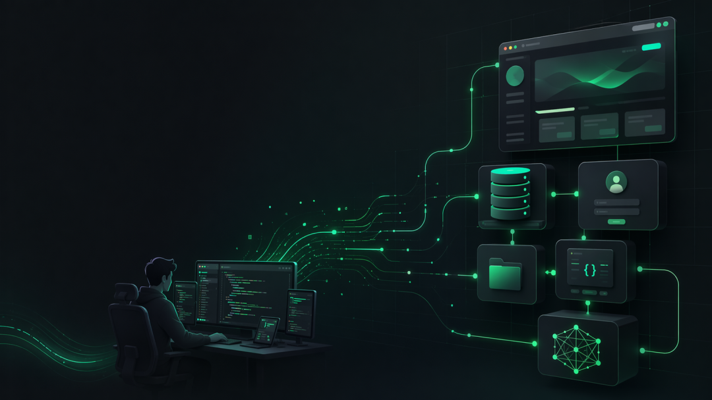
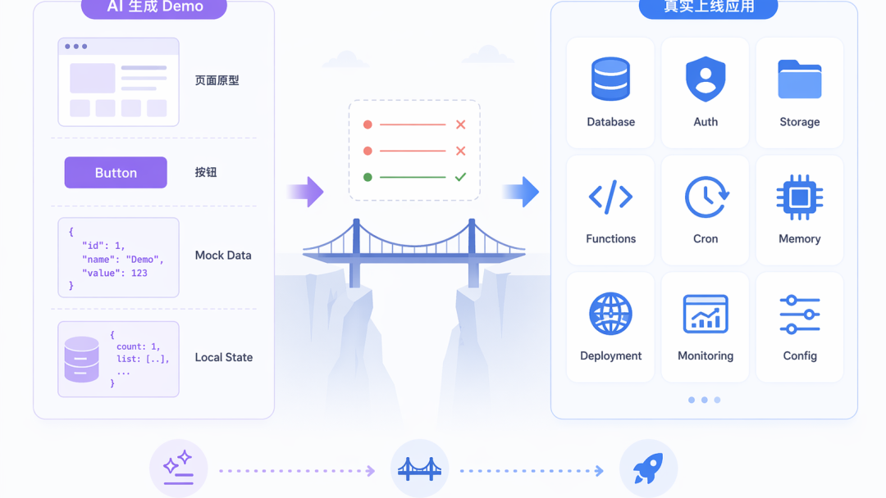
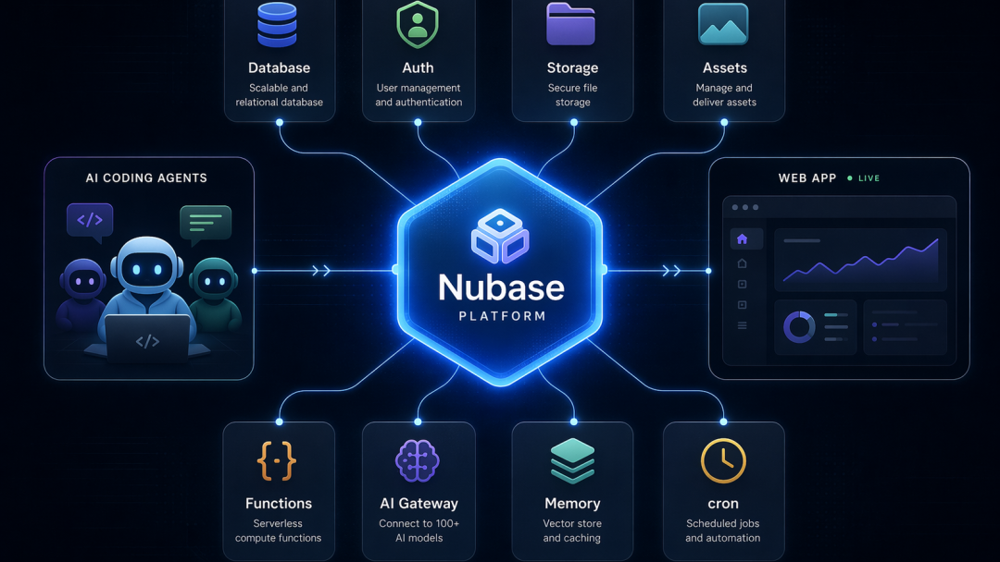
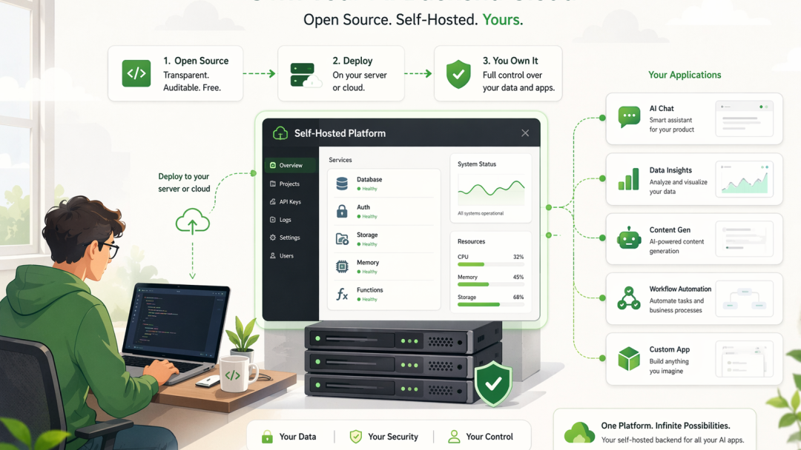

# 我们开源了 Nubase：让 AI 写出来的应用，可以真正上线

官網地址：<https://nubase.ai>
开源地址：<https://github.com/OtterMind/Nubase>

Nubase 是一个开源免费、AI 原生后端服务，将核心能力融入到一个 Skill + MCP 服务里，让 Codex / Claude Code / Qoder / Trace 这类 Agent 能直接创建数据库、部署函数、发布前端。

AI Coding 的发展实在太快了。它不仅可以帮我们写页面、写接口、改 Bug，甚至从一句话生成一个完整项目。但我们发现一个严重的问题：

AI 生成代码很快，但对于非技术同学生成的应用还是停在 Demo 或需要技术同学帮忙发布上线。

一个 Demo 可以没有用户系统，可以没有权限，可以没有后台，可以不考虑数据隔离，可以临时把数据存在浏览器里。

但一个真实应用不行，真实应用需要数据库、登录、权限、文件存储、后端逻辑、定时任务、部署地址、AI 调用、长期记忆，还需要一个人能进去检查和修复系统的控制台。这些东西，才是 AI Coding 从"能写代码"走向"能交付应用"的最后一公里。

探索 AI Coding 的初期，我们与 Lovable、Base44 等优秀产品一样，推出了聚焦 Web Coding 的 0 代码应用生成 ZOER.AI。但行业的进化速度超乎想象：当 Claude Code 和 Codex 将代码生成能力推向极致时，Web 侧的单点生成优势正在被迅速抹平。真正的挑战已经转移：

**再强大的 AI 逻辑，也无法脱离数据库、服务端和 CDN 独立存在。**

打通从'一行代码'到'一键上线'的云端全链路，解决传统基础设施的对接痛点，才是让应用真正跑起来的关键。

所以我做了 **Nubase**。一个免费、开源、可自托管的 AI 原生后端和部署平台。它的目标很简单：

**让 AI 写出来的应用，可以真的上线。**



---

## AI Coding 不缺代码，缺的是配套发布上线的基础设施

现在用 Claude Code、Codex、Cursor 这类工具写应用，体验已经是对话式开发，嗅觉敏感的开发可能已经很久没手工 Coding 了，你可以说：

- 帮我做一个客户管理系统。
- 帮我做一个知识库问答应用。
- 帮我做一个带登录和支付的工具站。
- 帮我做一个内部运营后台。

AI 很快就能生成页面、组件、接口、数据结构。

但真正麻烦的地方通常从这里开始：

- 数据库建在哪里？
- 用户登录怎么做？
- 权限怎么控制？
- 文件上传到哪里？
- 前端部署到哪里？
- 后端函数怎么发布？
- 定时任务怎么跑？
- AI 应用里的用户偏好、长期记忆、历史上下文怎么保存？

如果每次都重新拼一套，AI 写代码节省下来的时间，很快又会被基础设施吃掉。

这也是我做 Nubase 的起点。我不想再让 AI 只生成"看起来能跑"的玩具项目。我希望它生成的东西，有一个真实的后端可以接住。

---

## Nubase 是什么？

一句话介绍：**Nubase 是一个给 AI Coding 和 AI Agent 使用的开源后端与部署层。**

它不是只给人点按钮用的后台，也不是单纯的数据库服务。它同时给两类使用者提供能力：

**人** — 可以在 Studio 里创建项目、看数据、查用户、管理存储、检查 Memory。

**AI Agent** — 可以通过 MCP 工具直接操作 Nubase：建表、执行 SQL、部署函数、发布前端、创建定时任务、写入长期记忆。

也就是说，Nubase 想成为 AI Coding 的"真实后端目标"。当 Agent 写完一个应用，它不只是把代码放在本地文件夹里，而是可以继续往下走：

- 创建数据库表
- 配置 Auth 和权限
- 部署后端函数
- 上传前端静态资源
- 创建定时任务
- 调用 AI Gateway
- 把关键决策写入 Memory

最后得到一个可以访问的应用地址。这条链路，我称它为：**generate → live**，从生成，到上线。



---

## 它包含哪些能力？

Nubase 目前把 8 个模块放在一个可自托管平台里：

**Database** — 每个项目一个独立 PostgreSQL 数据库，提供类似 Supabase / PostgREST 的 REST API，并支持 RLS 权限控制。

**Auth** — 提供 Supabase 风格的注册、登录、JWT、刷新 Token、OAuth 等认证能力。

**Storage** — 兼容 S3 / R2 / MinIO，用来存文件、图片、附件和用户上传内容。

**Assets** — 用来发布 AI 生成的前端页面。Agent 可以把 HTML、CSS、JS 上传上去，直接获得公开访问地址。

**Functions** — 用来部署后端逻辑，比如 Webhook、API、业务计算、AI 调用封装等。

**AI Gateway** — 统一管理 OpenAI、Anthropic 或兼容模型的调用，并记录项目级使用情况。

**Memory** — 这是 Nubase 特别重视的一块。AI 应用不应该每次都从零开始，它需要长期记住用户偏好、事实、实体和上下文。

**cron** — 用来跑定时任务，比如每天同步数据、定时生成报告、周期性调用函数。

这些模块单独看并不陌生。真正重要的是：它们被放在了同一个平台里，并且被设计成 AI Agent 可以直接操作。



---

## 怎么安装和使用？

在 Codex 或 Claude Code 连接到一个 Nubase 实例，最简单的方式是一条命令：

```bash
npx -y nubase_cli@latest install-skills
```

这个命令会做三件事：
1. 给 Claude Code 和 Codex 安装 Nubase skills
2. 写入 MCP server 配置
3. 打开浏览器，让你登录 Studio、选择项目并授权

授权完成后，Agent 就可以通过 Nubase 的 MCP 工具操作项目。比如你可以直接对 Codex 或 Claude Code 说：

> 使用 Nubase 创建一个 todos 表，配置 RLS，部署一个统计未完成任务数量的函数，再发布一个前端页面到 Assets。

Agent 接下来不只是写代码。它可以真正去创建表、部署函数、上传前端静态文件、创建定时任务，并把关键上下文写进 Memory。

如果你想在自己的机器或服务器上跑一个 Nubase，也可以用 Docker 自托管：

```bash
docker run -d --name nubase \
  -p 3000:3000 -p 9999:9999 -p 5432:5432 \
  -v nubase_data:/data \
  <your-namespace>/nubase:latest
```

启动后：
- Studio 地址：http://localhost:3000
- API 地址：http://localhost:9999

你可以在 Studio 里创建账号、创建项目，然后点击 Provision 初始化项目数据库。

如果你已经有自己的部署地址，也可以在安装 skills 时指定：

```bash
npx -y nubase_cli@latest install-skills \
  --studio-url https://studio.example.com \
  --nubase-url https://api.example.com
```

更完整的文档可以看：
- 官网：https://nubase.ai
- GitHub：https://github.com/OtterMind/Nubase
- npm 包：https://www.npmjs.com/package/nubase_cli



---

## 为什么不是直接用 Supabase？

Supabase 是一个非常优秀的产品，我自己也很喜欢。

Nubase 不是为了"复制一个 Supabase"，我们在面向用户侧的 API 兼容了 Supabase，但是我们全部重写了后端服务。我做 Nubase 的原因，是 AI Coding 带来了几个新的需求：

**第一**，AI 应用需要 Memory 成为基础设施，而不是每个项目自己临时拼一个 vector table。

**第二**，AI Agent 需要一个可以通过工具调用的后端目标。它不只是调用 API，而是要能理解项目、创建表、部署函数、发布前端、记录决策。

**第三**，自托管场景下，我希望一个平台可以管理多个项目，并且每个项目有独立数据库边界。

所以 Nubase 更准确的定位是：**一个 Supabase 风格、但面向 AI Coding 和自托管多项目场景重新设计的后端平台。**


---

## 免费和开源

Nubase 免费和开源。

原因很简单：我认为 AI Coding 接下来会改变很多开发流程，但基础设施不应该只掌握在少数平台手里。

每个开发者、独立开发者、小团队、内部平台、技术爱好者，都应该能拥有自己的 AI 应用后端。

你可以把 Nubase 跑在自己的机器上或者自己的云环境里。也可以研究它的实现，改它的功能，接自己的模型、存储、数据库和部署环境。

对 Nubase 来说，我们希望更多的人使用，推动 AI Coding 的发展。

---

## Nubase：从想法到真实产品上线

AI Coding 最明显的价值是省时间。但我觉得更重要的价值，是降低从想法到真实产品的心理门槛。以前你想到一个应用，可能会先想：

- 要不要建后端？
- 要不要接登录？
- 要不要弄文件存储？
- 要不要部署？
- 要不要搞权限？
- 要不要写后台？

这些事情还没开始，很多想法就已经 Game over 了。

而我们希望 Nubase 带来的体验是：**你可以直接让 AI 开始做。**

后端、部署、Memory、定时任务，都有 AI 来完成。但它会把复杂的数据存储、部署、CDN 都收在一个平台里，让人和 Agent 都能处理。

这才是我认为 AI Coding 真正应该走向的方向，不是只生成更多代码。而是更快交付真实应用。

---

## 最后

如果你也不想让 AI 生成的项目只停在 Demo，欢迎关注这个项目。

- **官网：** <https://nubase.ai>
- **开源地址：** <https://github.com/OtterMind/Nubase>
- **npm 包：** <https://www.npmjs.com/package/nubase_cli>

欢迎加入交流群随时交流。
