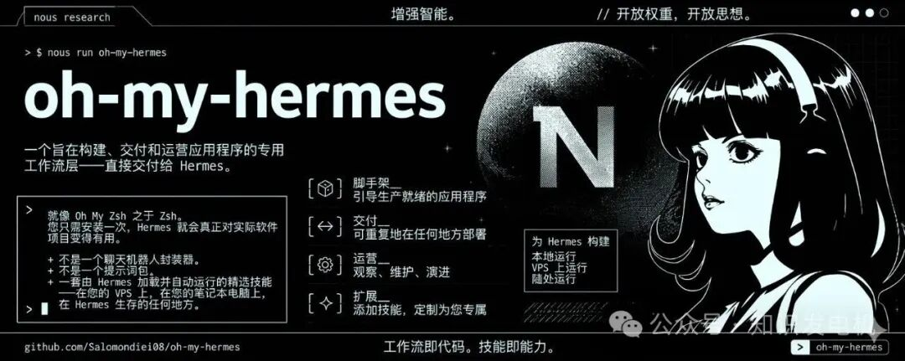

# 1次安装，5大Agent入驻！这个神器让AI化身全栈开发团队

**Hermes光聊天不够？装上Oh My Hermes它直接从嘴炮变开发运维全链路搭档**

很多人打开Hermes聊天界面，输入一堆需求，AI甩回代码片段或建议，接下来你还是得自己搭环境、跑部署、盯日志。项目进度卡在琐碎环节，时间一点点流失。**Oh My Hermes一次性给Hermes装上结构化的workflow layer**，让它从单纯对话工具变成能从需求澄清到生产部署、日常运维全流程推进的真实伙伴。



我以前也这样干过。用AI写完功能模块，后面连数据库、部署Vercel这些活儿全靠手动，效率只提升了一半，半途还容易因为上下文切换出错。现在看这个工具，它把AI agent最难的落地执行链补上了。当然，实际跑起来效果取决于项目复杂度，但核心变化很实在：AI不再只是建议者，而是能自主流转任务的团队成员。

这套东西不是随便堆prompt，而是针对Hermes Agent设计的opinionated workflow。普通用户可能觉得聊天有趣就够，但写过项目的都知道，聊天只是起点，后面的持续执行才决定项目死活。安装一次后，Hermes就能在VPS、本地笔记本或者它运行的任何地方，加载技能自主处理从0到上线的环节。

**为什么一次安装就能让Hermes真正参与生产闭环？**

想想点外卖的场景，骑手只在群里报位置肯定不行，得把餐送到家、确认细节、处理特殊要求。Oh My Hermes把Hermes从“报信的”升级成全程执行者。理论上，它大幅减少了你在终端、GitHub、部署平台间来回切换的摩擦，尤其对solo开发者或小团队友好。

技术细节上，它提供23个左右的精选skills，加上5-6个agent角色和几个workflows。Hermes加载后就能scaffold应用、ship到生产、operate监控、extend功能，一条龙走完。不是泛泛的agent框架，而是具体技能打包：从clarify requirements到auto deploy、security scan、monitoring setup全覆盖。

之前总觉得AI agent只要模型够强就能落地，后来发现不对。单纯智能没有结构化分工，长链路任务很容易幻觉或卡住。**这算我一次认知修正**：以前重点看模型能力，现在明白好的workflow layer和明确分工才是让agent从玩具变工具的关键，尤其在多天周期的项目里。

这里顺手提一句，无关主线但挺有意思：它支持“wherever Hermes lives”的灵活部署，不管Hermes跑在云端还是本地，技能都能用得上。

**五个Agent在看板上各司其职，协同不再是空谈**

普通读者可能把AI想成一个全能机器人，但真实软件开发里，分工明确才推得动。Oh My Hermes内置CTO、PM、Dev、Security、QA、Ops这些角色，每个守住一块，在内置Kanban上看板流转任务。

CTO负责整体orchestration和日报，PM处理issue triage和backlog优先级，Dev实现功能并建PR，Security在PR阶段扫描secrets和漏洞，QA做review和健康检查，Ops管部署监控通知。这不是演戏，而是真实的任务状态流转：Backlog → In Progress → Review → Done。Hermes是主力引擎，Claude Code或Codex只是可选加速器，用不用由你决定。

为什么重要？单个模型管全流程容易在上下文里迷失或重复劳动。分工后边界清晰，每个agent专注领域，减少错误，流程更稳。举个例子，Dev完成代码后，Security自动接手扫描，QA review通过再到Ops部署，整个链条连贯不掉链子。

细节展开看，skills包括onboarding、structured requirements gathering（问固定7个问题存记忆）、product brief、design handoff、choose engine、implement、deploy-to-vercel、connect-supabase、setup-monitoring、auto-issue-triage等。**这些技能安装后Hermes就能直接调用执行**，不是停留在生成文字阶段。

当然，不是所有项目都完美适配。简单CRUD应用跑起来提升明显，大型遗留系统可能还需要你额外注入上下文或自定义skill。我之前试类似工具时，常在agent分工模糊的地方踩坑，这里明确角色后推进感强多了。

**安装上手实际操作，哪些边界条件容易卡住**

要激活这些能力，一次安装基本搞定。项目README和INSTALL\_FOR\_AGENTS.md提供了清晰步骤，适合搭配Claude、Cursor等工具，也支持纯Hermes终端。

先克隆或直接用curl安装：

```
# 目的：把Oh My Hermes skills和agents安装到Hermes环境
curl -fsSL https://raw.githubusercontent.com/salomondiei08/oh-my-hermes/main/install.sh | bash
```

```
# 项目目录下bootstrap，创建AGENTS.md等必要文件
cd <YOUR_PROJECT_DIR>
bash /tmp/oh-my-hermes/scripts/bootstrap.sh
```

```
# 设置CTO loop，让它开始监控kanban和发日报
# 需要准备GitHub fine-grained token（scope包含Contents, Issues, PRs等）
bash /tmp/oh-my-hermes/scripts/setup-cto.sh
```

跑完这些，Hermes聊天里就能触发skills。**这步容易出错的地方**主要是token权限不足或环境变量没配好，导致GitHub操作失败。

⚠️ 注意：第一次强烈建议在新测试项目上跑，避免直接生产环境。技能能操作仓库、部署，权限控制必须谨慎。另一个实用细节是支持Docker方式部署，适合想24/7运行的VPS场景。项目还带verify脚本和uninstall，试错成本低。

我自己以前配置agent环境时，经常因为权限或路径问题重装好几次。这里提供的脚本把这些坑填了不少。

**落地后Hermes角色变了，但人还是最终把关**

以前很多人，包括我，把AI当一次性聪明聊天工具，用完就切回手动模式。现在Oh My Hermes打开了一条路，让它持续参与开发运维闭环。明确分工的agents加上一堆实用skills，把从idea到上线的门槛拉低了，尤其适合个人开发者快速迭代。

不过边界很清楚：AI擅长结构化、可重复的任务，复杂业务决策、最终架构把关和特殊异常处理还是得人来。**我之前觉得AI agent离真实生产还有距离，接触Oh My Hermes后发现，结构化workflow能把可用性提升一大截**，但大型项目里监控自定义和长期维护还是需要持续投入。

整体看，用它的人可能还在早期，但方向清晰：AI从辅助变成能扛活的搭档。想上手直接去GitHub Salomondiei08/oh-my-hermes仓库，按文档走一遍安装，体验完整流程。

你当前项目里，最希望AI帮你彻底扛下来的环节，是需求到代码的实现链，还是部署监控的运维闭环呢？💬