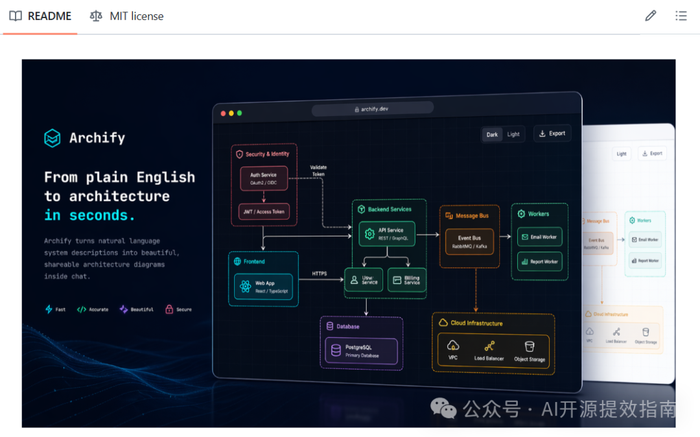
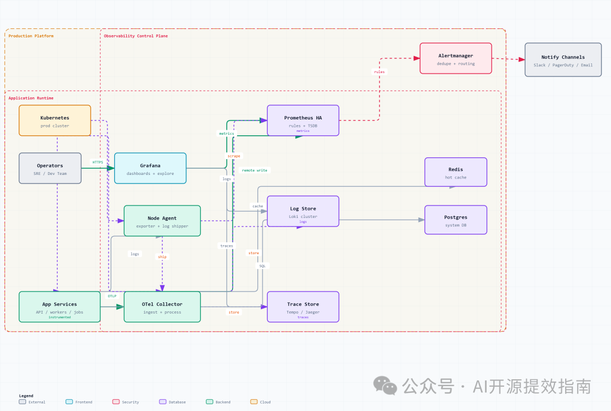
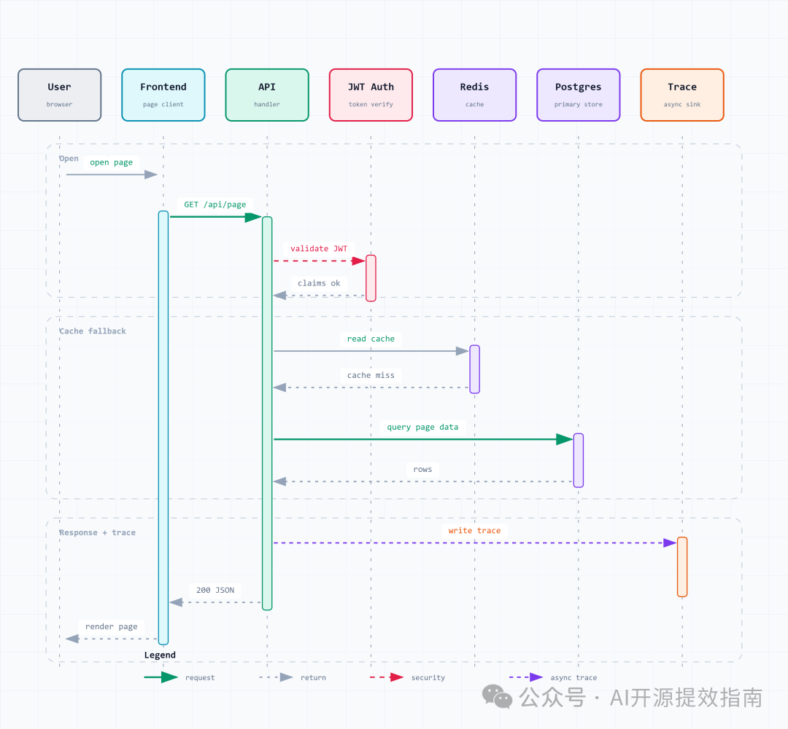

# Archify：开源架构图神器，聊两句就出图，深色浅色一键切！

大家好，这里是`AI开源提效指南`！

今天要介绍的项目叫 **Archify**，它是一个专为 AI Agent 打造的**架构图生成技能**——你只需用大白话描述系统，Archify 就能自动生成一张带深色/浅色主题切换、支持一键导出 PNG/JPEG/WebP/SVG 的专业技术图。

最惊艳的是：生成的 HTML 文件**零运行时依赖**，发给谁都能在浏览器里直接打开，按T切主题、按E导出图片，体验丝滑到不像一个「AI 生成的图」。



**推荐关注这个项目的 3 个理由**：

1. 🎨 **五种图类型**：架构图、流程图、时序图、数据流图、状态机图，覆盖技术沟通全场景
2. 🔄 **4× 原生光栅化**：导出图片不是位图放大，而是浏览器原生渲染，清晰到可以上印刷机
3. 🤖 **Agent 原生支持**：Claude、Codex CLI、opencode 都能装，装完聊两句就出图

先看下我测试的效果！

图1



图2



## ✨ 核心功能

### 功能 1：五种图表类型，覆盖所有技术沟通场景

Archify 不只是画架构图，它支持五种专业图表类型：

| 类型 | 适用场景 | 示例 Prompt |
| --- | --- | --- |
| **Architecture** | 系统组件、云资源、服务边界、安全组 | "React 前端 + Node.js API + PostgreSQL + Redis" |
| **Workflow** | 审批流程、CI/CD、Runbook、事故响应 | "用户提交 -> Agent 规划 -> 审批 -> 执行 -> 返回" |
| **Sequence** | API 调用链、缓存回源、鉴权流程 | "用户打开页面，前端调 API，API 校验 JWT，查 Redis" |
| **Data Flow** | 数据管线、ETL/ELT、PII 隔离、数据血缘 | "Web 上报埋点 -> Edge API -> Kafka -> Warehouse" |
| **Lifecycle** | 状态机、任务生命周期、重试/超时/终态 | "任务从 Queued -> Planning -> Executing -> Completed" |

**关键优势**：

- ✅ 每种类型都有独立的 JSON Schema 校验，确保生成的 JSON 结构正确
- ✅ 类型化渲染器自动处理布局，包括节点碰撞检测、标签溢出检查、跨泳道重叠检测
- ✅ 支持 Mermaid 代码作为输入，Claude 读懂后重新布局，而不是机械渲染

### 功能 2：深色/浅色主题一键切换

这是 Archify 最亮眼的功能之一。每张生成的图都自带一个主题切换按钮：

- 按T一键切换深色/浅色
- 偏好保存在 `localStorage`，下次打开自动恢复
- 首次访问自动跟随系统 `prefers-color-scheme`
- 通过 URL 参数 `?theme=light` 可强制指定初始主题

**关键优势**：

- ✅ 所有颜色通过 CSS 变量定义，切换主题时整张图（包括渐变、网格、箭头、遮罩）同步变化
- ✅ 导出的 SVG 内嵌双主题变量 + `@media (prefers-color-scheme)`，贴到 GitHub README 里自动跟随读者偏好
- ✅ 打印时强制使用浅色主题，避免深色背景浪费墨水

### 功能 3：4× 原生光栅化导出

Archify 的导出流水线是它的技术亮点：

- 导出 PNG/JPEG/WebP 时，将 SVG 的 `width`/`height` 设为 `4 × viewBox`
- 浏览器**原生光栅化**矢量图到目标分辨率（不是位图放大）
- Canvas 按自然大小绘制，**没有升采样模糊**
- 超大图自动降级到 3× 或 2×，确保不超浏览器 Canvas 上限

**关键优势**：

- ✅ 文字边缘、箭头头部、描边细节在 4× 下真正清晰
- ✅ 视网膜屏、演示幻灯、印刷输出都可用
- ✅ 导出 SVG 是双主题自持矢量格式，可在 Figma/Illustrator 中继续编辑

### 功能 4：语义配色系统

Archify 有一套精心设计的语义配色方案：

| 组件类型 | 颜色 | 用途 |
| --- | --- | --- |
| Frontend | 青色 | 客户端、UI、终端设备 |
| Backend | 翠绿 | 服务、API、后台进程 |
| Database | 紫色 | 数据库、存储、AI/ML |
| Cloud / AWS | 琥珀 | 托管云服务、基础设施 |
| Security | 玫红 | 鉴权、安全组、加密 |
| Message Bus | 橙色 | Kafka、RabbitMQ、事件总线 |
| External | 灰色 | 第三方、通用外部系统 |

每种颜色在深色/浅色主题下都有配套取值，切换主题时同步变化。

## 💡 实用场景

### 场景 1：技术博客配图

**需求**：写一篇微服务架构的技术文章，需要一张架构图展示各个服务之间的关系

```
1. 在 Claude 中安装 Archify skill
2. 输入：「画一张微服务架构图：React Web + 移动端，Kong API Gateway，用户服务(Go)、订单服务(Java)、商品服务(Python)，PostgreSQL、MongoDB、Elasticsearch，Kafka 做事件流，K8s 做编排」
3. 生成 HTML 文件，按 <kbd>T</kbd> 选浅色主题
4. 按 <kbd>E</kbd> → 导出 PNG 或 SVG
```

### 场景 2：系统设计评审

**需求**：团队做系统设计评审，需要一张清晰的架构图展示组件交互

```
1. 让 Claude 分析代码仓库，自动提取架构描述
2. 生成架构图后通过聊天迭代：「加个 Redis 缓存」「把鉴权路径高亮」「把 Postgres 换成 MySQL」
3. 导出 PNG 直接粘贴到飞书/钉钉文档
```

### 场景 3：API 调用链文档

**需求**：记录一个请求的完整生命周期，包括缓存回源和鉴权流程

```
1. 输入：「用 archify 画一个 sequence diagram：用户打开页面，前端请求 API，API 校验 JWT，读取 Redis，缓存未命中则查 Postgres，返回结果并写入 trace」
2. 自动生成时序图，参与者、消息、激活条都自动排列
3. 导出 SVG 嵌入到 API 文档中
```

## 📦 安装步骤

### 环境要求

- Node.js >= 18（类型化渲染器需要）
- 操作系统：Linux / macOS / Windows

### 安装命令

Archify 打包成标准 agent skill 目录，同一个 `archify.zip` 可安装到多个平台：

**Claude Code CLI：**

```
# 全局安装（所有项目可用）
unzip archify.zip -d ~/.claude/skills/
# 项目级安装
unzip archify.zip -d ./.claude/skills/
```

**Codex CLI：**

```
unzip archify.zip -d ~/.agents/skills/
```

**opencode：**

```
unzip archify.zip -d ~/.config/opencode/skills/
```

**Claude.ai（网页版）：**

1. 下载 `archify.zip`
2. 进入 **Settings → Capabilities → Skills**
3. 点击 **+ Add**，上传 zip 文件
4. 打开开关

### 安装依赖（可选但推荐）

类型化渲染器依赖 ajv 做 schema 校验：

```
cd ~/.agents/skills/archify && npm install
```

不装也能用——渲染器会跳过 schema 校验，但布局检查仍然运行。

## 🔧 工作原理

### 整体架构

```
用户输入（自然语言 / Mermaid 代码）
        ↓
    Claude LLM（理解意图，选择图表类型）
        ↓
    JSON IR（中间表示，结构化的图表数据）
        ↓
    类型化渲染器（Node.js 脚本，校验 + 布局 + 渲染）
        ↓
    单文件 HTML（内联 SVG + CSS + JS，零依赖）
        ↓
    浏览器打开（主题切换 + 导出菜单）
```

### 核心模块：渲染器体系

Archify 最核心的设计是**类型化渲染器 + JSON IR** 架构。每个图表类型都有独立的渲染器：

**文件路径**：`archify/renderers/`

```
renderers/
├── architecture/render-architecture.mjs   # 架构图渲染器
├── workflow/render-workflow.mjs           # 流程图渲染器
├── sequence/render-sequence.mjs           # 时序图渲染器
├── dataflow/render-dataflow.mjs           # 数据流图渲染器
├── lifecycle/render-lifecycle.mjs         # 生命周期图渲染器
└── shared/
    ├── geometry.mjs    # 几何计算（锚点、路径、碰撞检测）
    ├── utils.mjs       # 工具函数（模板替换、CJK 文字宽度）
    ├── validator.mjs   # JSON Schema 校验
    └── cli.mjs         # CLI 入口/出口公共逻辑
```

### 关键算法：4× 原生光栅化导出

```
1. 序列化 SVG（克隆 DOM 中的 SVG 元素）
   ↓
2. 内联 CSS 样式（提取 SVG 相关规则，注入到克隆中）
   ↓
3. 解析当前主题的 CSS 变量值（通过离屏 probe 元素）
   ↓
4. 将克隆 SVG 的 width/height 设为 viewBox × 4
   ↓
5. 浏览器原生光栅化矢量到目标分辨率
   ↓
6. Canvas 按自然大小绘制（无升采样）
   ↓
7. toBlob(mime) 生成文件
```

### 验证体系

Archify 有完善的测试体系：

- **Golden 测试**：渲染器输出必须字节级匹配已检入的示例 HTML
- **布局规则测试**：每个高价值布局规则都有最小违规测试用例
- **降级模式测试**：类型错误但 JSON 合法的输入必须友好报错
- **几何单元测试**：直接测试 `rectsOverlap`、`anchor`、`roundedPath` 等纯函数

---

## 🏗️ 技术架构

### 数据流图

```
用户自然语言描述
       ↓
Claude LLM 理解意图
       ↓
选择图表类型 + 生成 JSON IR
       ↓
JSON Schema 校验（ajv）
       ↓
类型化渲染器执行
  ├─ 布局计算（坐标、锚点、路径）
  ├─ 碰撞检测（节点、标签、边界）
  └─ SVG 生成（语义 CSS 类）
       ↓
模板填充（template.html）
       ↓
单文件 HTML（零依赖）
       ↓
浏览器打开 → 主题切换 / 导出
```

### 技术栈选型

| 层级 | 技术 | 选型理由 |
| --- | --- | --- |
| 渲染引擎 | Node.js 18+ | 跨平台、ESM 模块、文件系统访问 |
| Schema 校验 | ajv (Draft 2020-12) | 最流行的 JSON Schema 校验器，严格模式 |
| 输出格式 | 单文件 HTML | 零运行时依赖，发文件即可分享 |
| 主题系统 | CSS 变量 + data-theme | 无需 JS 框架，切换零开销 |
| 导出流水线 | Canvas + SVG + Blob | 浏览器原生 API，无需第三方库 |
| 字体 | JetBrains Mono + CJK 回退 | 等宽字体适合技术图，CJK 支持中文 |

---

## 🆚 知名项目对比

| 特性 | Archify | Mermaid | Draw.io | Excalidraw | diagrams.net |
| --- | --- | --- | --- | --- | --- |
| AI 驱动生成 | ✅ 自然语言描述 | ⚠️ 代码驱动 | ❌ 手动拖拽 | ❌ 手动拖拽 | ❌ 手动拖拽 |
| 深色/浅色主题 | ✅ 一键切换 + 导出 | ⚠️ 有限支持 | ✅ 支持 | ✅ 支持 | ⚠️ 有限 |
| 导出清晰度 | ✅ 4× 原生光栅化 | ⚠️ 截图级别 | ✅ 矢量 | ✅ 矢量 | ✅ 矢量 |
| SVG 双主题 | ✅ 单文件自适应 | ❌ 需手动处理 | ❌ 单主题 | ❌ 单主题 | ❌ 单主题 |
| 图表类型 | 5 种专业类型 | 10+ 种 | 全品类 | 通用手绘 | 全品类 |
| 学习成本 | ⭐⭐⭐⭐⭐ 极低 | ⭐⭐ 中 | ⭐⭐⭐ 中 | ⭐⭐⭐⭐ 低 | ⭐⭐⭐ 中 |
| 安装方式 | Agent Skill 一键装 | npm 安装 | 在线/桌面 | 在线 | 在线/桌面 |
| 迭代方式 | 聊天迭代 | 改代码重渲染 | 手动拖拽 | 手动拖拽 | 手动拖拽 |

**选择建议**：

- 需要 **AI 自动生成** + **快速迭代**：选 Archify（唯一支持自然语言驱动）
- 需要 **最丰富的图表类型**：选 Mermaid（10+ 种图表类型）
- 需要 **精细手动控制**：选 Draw.io 或 Excalidraw
- 需要 **手绘风格**：选 Excalidraw（独特的手绘质感）

## 🔗 参考资源

```
项目仓库：https://github.com/tt-a1i/archify
官方文档：https://tt-a1i.github.io/archify/
```

## 💬 总结

**Archify** 是一款 AI Agent 原生架构图生成技能，核心优势在于「自然语言出图 + 深色/浅色主题 + 4× 原生光栅化导出」。它不是又一个画图工具，而是让 AI 替你完成从理解系统到生成专业图表的全流程。

---
