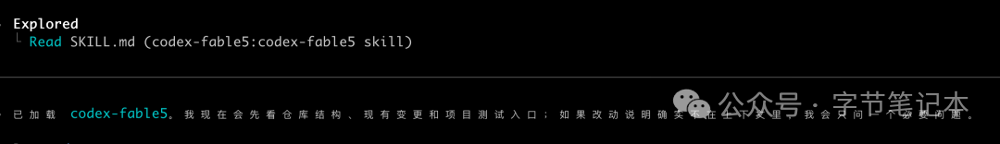

# Fable 5 下架，但它的工作流被 Codex 继承下来了！

Fable 5 活了四天。

6月9日上线，6月12日因美国出口管制问题被 Anthropic 强制下架。

[Fable 5被美政府紧急叫停！禁止非美公民使用](https://mp.weixin.qq.com/s?__biz=MzIzMzQyMzUzNw==&mid=2247518026&idx=1&sn=9fe1875b8b2c50711aa64ff6dee30d93&scene=21#wechat_redirect)

但在它消失之前，有人把它的系统提示词提取出来发到了 GitHub。

120,040 个字符，将近 2.7 万 token。

研究了一遍之后，也不是什么神秘能力，就是一套对 AI 编码代理的行为约束：

> 先检查，再行动，记录证据，在说完成之前真的去验证。

这套工作流和模型权重没有关系，很值得学习

目前有一个开源项目 FableCodex 就是把这套工作方式重新打包，装进 Codex里。

---

## 解决了什么问题？

Codex 很强，但是也时不时的会出现一些幻觉。

做过复杂任务的人都遇到模型一本正经地告诉你任务完成，但测试没跑，相关文件没改，只是把局部的代码写完了，就说完成了。

出现这种的原因就是**没有形成工作流上的拦截机制**。

其实传统代码工程早就有对应的解法，比如 TTD、code review checklist、pre-merge validation。

FableCodex 就是把它们加回来，用 Codex 的 Skill 系统实现。

调用方式很直接：

```
  @codex-fable5 使用这个 skill 实现这个改动。
如果工作包含多个步骤，请创建 goal ledger。
在说完成之前，请运行项目测试。
```

Codex 读到这个 skill 之后，会切换成更严格的执行模式：

> 先分类任务，检查 workspace，用真实工具验证，而不是靠记忆推断。

安装一行命令：

```
  codex plugin marketplace add baskduf/FableCodex --ref v0.4.1
codex plugin add codex-fable5@fablecodex
```

重启 Codex 后生效。

第二步，在提示词里调用：

```
  @codex-fable5 使用这个 skill 实现这个改动。
如果工作包含多个步骤，请创建 goal ledger。
在说完成之前，请运行项目测试。
```



Codex 就会按 Fable 风格的流程来执行，而不是默认模式。

具体 Codex 会发生什么变化呢？

调用 @codex-fable5 后，Codex 会读取这个 skill，并采用更严格的流程：

1.先分类任务，再开始行动。
2.检查 workspace、文件、工具或被引用的来源。
3.使用 Codex-native 的真实工具，不只依赖记忆。
4.对较长任务，用带 evidence checkpoint 的 goal 跟踪进度。
5.对 review 敏感的任务，记录 finding，并要求最终 findings gate。
6.使用测试、lint、typecheck、截图、命令输出、源码检查或 connector readback 做验证。
7.报告改了什么、验证了什么、还剩什么风险。

所以这个 skill 改进的是执行的流程纪律，模型能力还是原有的。

Fable 5 下架了，但它的这套工作流值得我们学习，不只是 Codex，在其他的 AI 编辑工具Claude Code，我们也可以将它进行移植和加以复用。

---

项目地址：baskduf/FableCodex