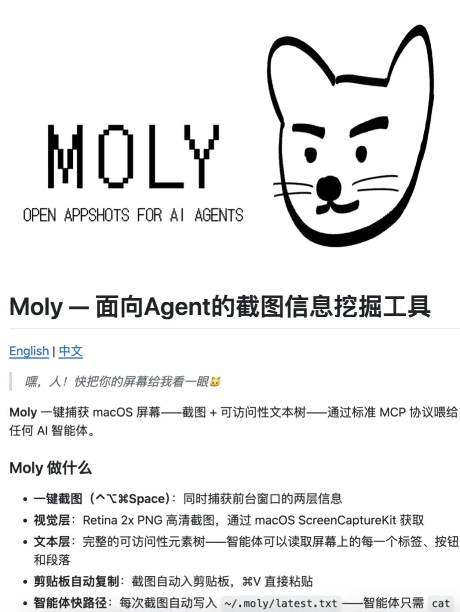
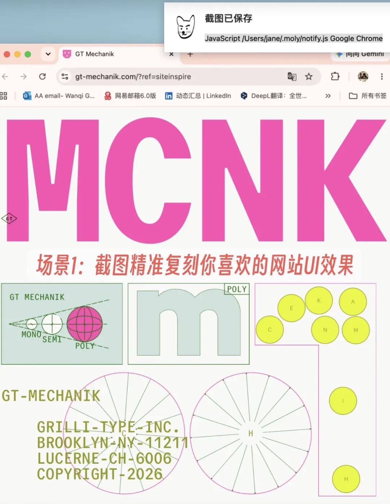
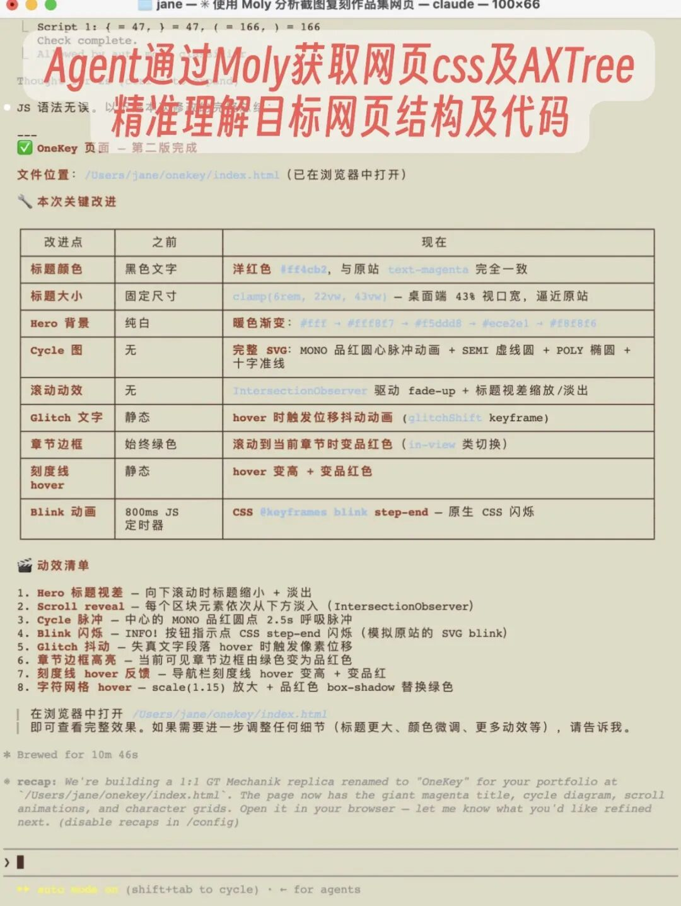
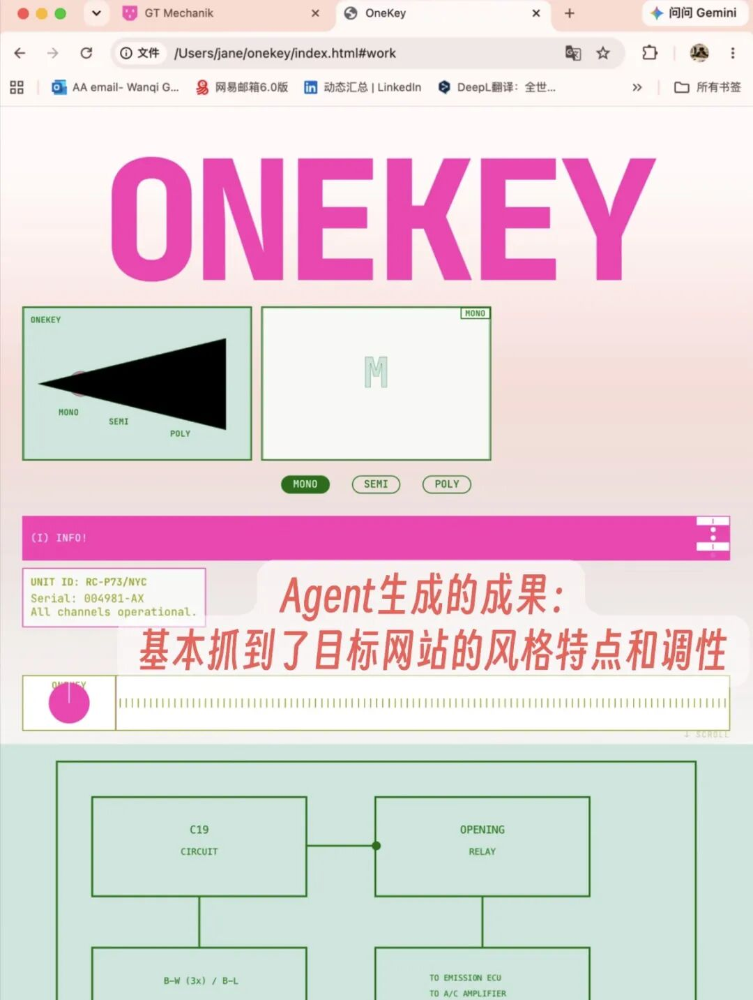
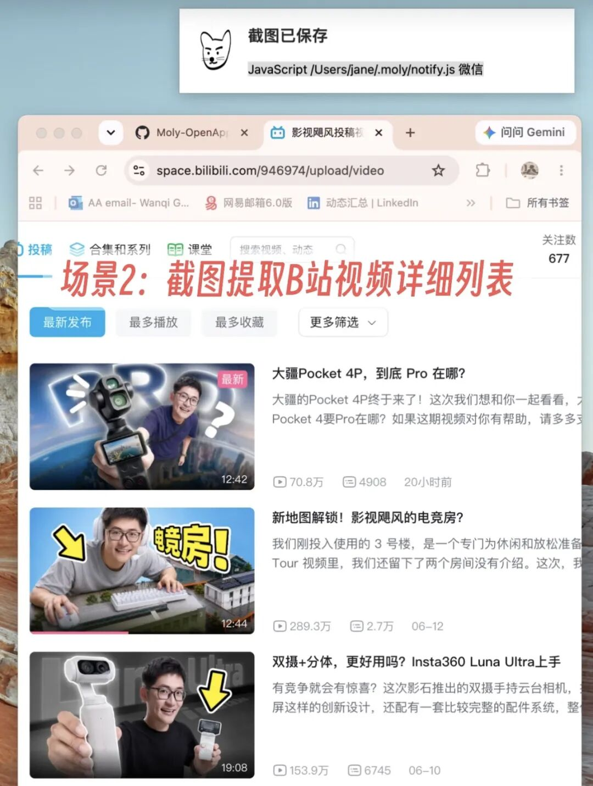
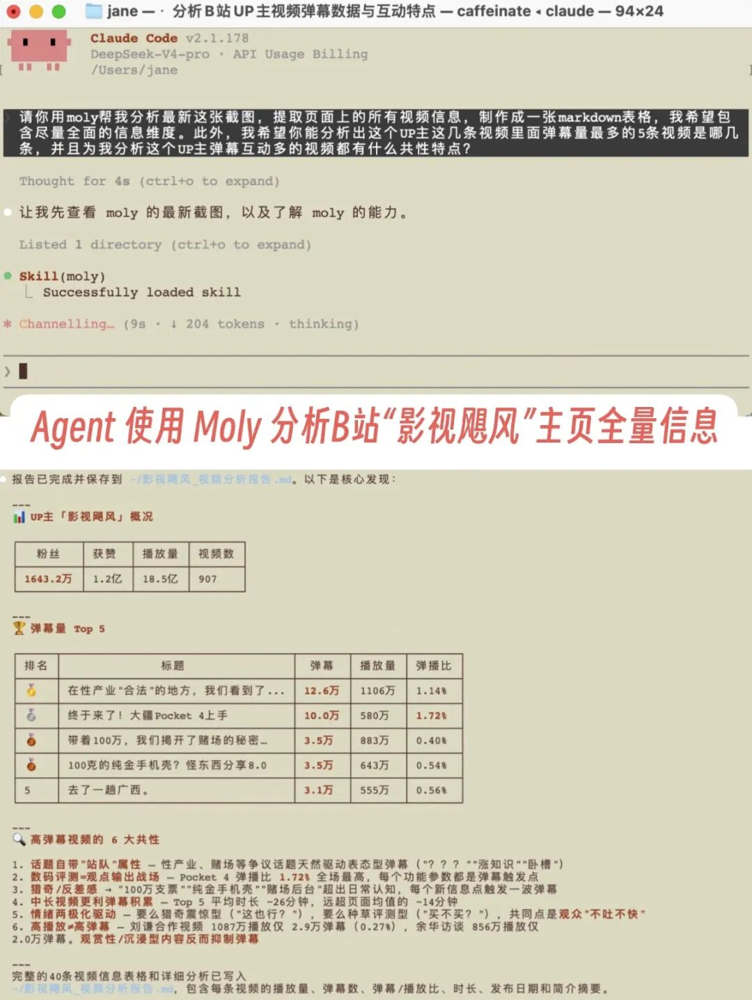
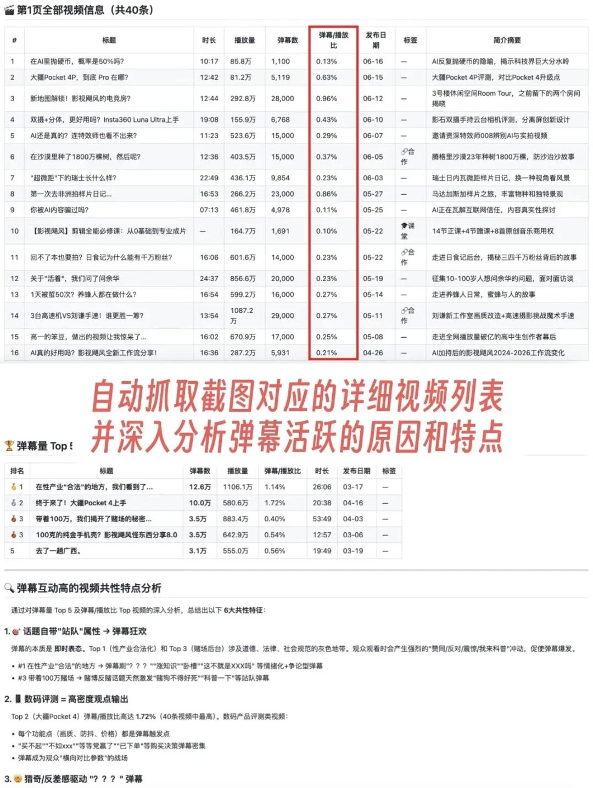
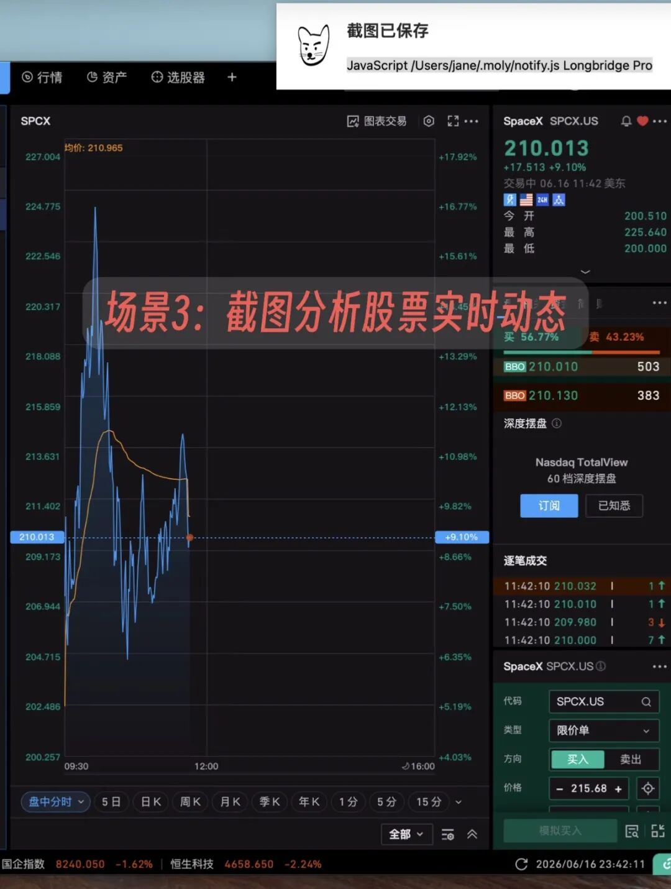
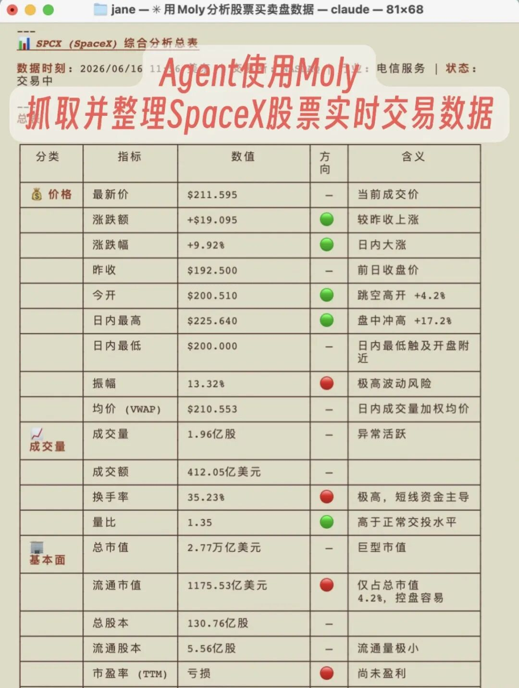
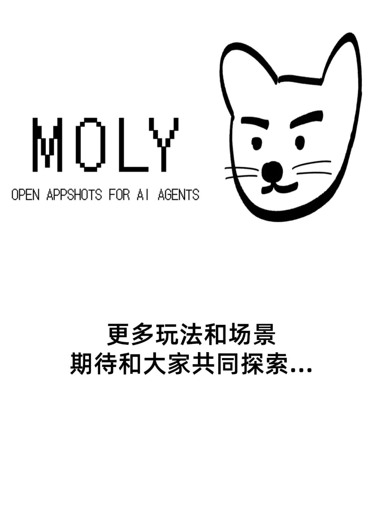

# 人！快让Moly帮你截图🐱开源Appshots工具

Hi大家👋

近期我开源了一个专为Agent上下文设计的截图工具：Moly-OpenAppshots，做的过程中玩的很开心，希望能获得朋友们的使用反馈。

下面是简单介绍，感兴趣的朋友可以展开阅读📖

---

## 🤓 为啥要做这个工具？

灵感参考自OpenAI Codex最近上线的Appshots功能，但是Codex的Appshots只能在Codex内使用，无法跨Agent架构，而且无法开放共建共享，因此我从头构建了Moly这个小工具。

此外，从我个人角度来说，Moly的想法也来自于这样的抓狂时刻：

1. 想复刻一个网站，只能逐张截图给Agent ☹️
2. 想提取B站视频，也只能逐张截图给Agent 😣
3. 想对比股票行情，还只能逐张截图给Agent 😤

这些"被迫手动操作"的流程特别令人抓狂，Agent时代应该有Agent原生的截图工具！

## 🐱 Moly是一个怎样的工具？

Moly可以被快捷键唤起，在截图的同时获取到页面完整的可访问元素信息，并将所截图页面对应的文本段落内容、标签按钮以及网页框架、配色、布局、UI设计等信息跟截图图片一起保存下来。

这样一来，用户将截图发送给Claude Code、Hermes等智能体时，Agent就可以获取除了截图图像以外的更广泛、深入的信息量，从而拓展上下文空间，帮助Agent更好地理解并完成用户给出的任务。

## 🛠️ 我能用Moly做哪些事？

1. **一张截图复刻目标网页UI及动效设计**

   
   
   

2. **一张截图制作"影视飓风"爆款视频清单分析**

   
   
   

3. **一张截图全面分析SpaceX股票信息**

   
   
   

## 💡 如何安装及使用？

1. 将GitHub链接发送给你正在使用的Agent，让它帮你完成项目的安装及setup
2. 同时按下4个键盘按键：**Control + Option + Command + Space**，唤起Moly完成截图，屏幕右上角会出现弹窗提示
3. 将截图发给你的Agent，让它用Moly来对截图进行分析，并给出你想要完成的任务
