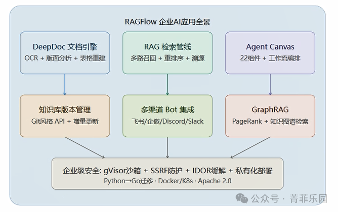
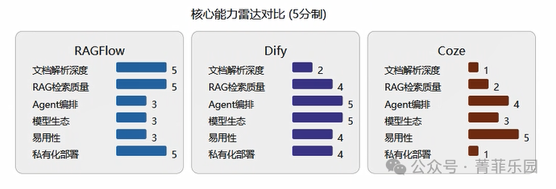
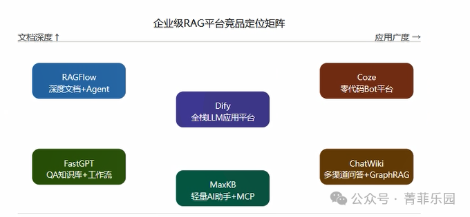
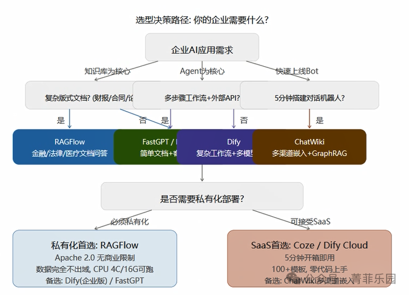

# RAGFlow 深度解析：企业知识库与 Agent 搭建的最强开源方案

企业落地 AI，最难的不是选模型——GPT-4、Claude、DeepSeek 随时能用。

最难的是**把自家那堆乱七八糟的文档，变成 AI 真正能理解的知识**。

财报 PDF 里嵌着横向跨页表格，合同扫描件字迹模糊，医疗指南里的公式和图表交织……你扔给大模型，它要么读不懂，要么读完了一本正经地胡编。

2024 年以来，一个叫 **RAGFlow** 的开源项目异军突起，GitHub 星标冲到 **48k+**，成为企业级 RAG 领域增长最快的项目。它的核心能力只有一个——**把最复杂的文档变成可溯源的知识库，再基于这些知识搭建智能 Agent**。

今天把 RAGFlow 从里到外拆一遍。

---

## 一、RAGFlow 是什么？三句话讲清楚

RAGFlow 是 InfiniFlow 团队开发的开源 RAG 引擎，Apache 2.0 协议，商业使用零限制。

它解决的核心问题就一个：**企业文档太复杂，通用 RAG 方案处理不了。**

和市面上"什么都想做"的 LLM 平台不同，RAGFlow 的基因是**深度文档理解**——先把文件吃透，再在上面做检索和 Agent。整个产品的架构可以用一张图概括：



*图1：RAGFlow 企业AI应用全景——三层能力（DeepDoc文档引擎 + RAG检索管线 + Agent Canvas）+ 底层安全与部署*

从上往下看：

- • **第一层 DeepDoc**：OCR、版面分析、表格重建，负责把"看不懂"的复杂文件变成结构化知识
- • **第二层 RAG 检索管线**：多路召回、重排序、溯源，负责让 AI 找到最准确的答案
- • **第三层 Agent Canvas**：22 个组件的工作流编排，负责让 AI 像员工一样执行多步任务
- • **底层基础设施**：gVisor 沙箱安全执行、SSRF 防护、IDOR 缓解、Docker/K8s 部署

三层环环相扣，构成了 RAGFlow 的完整能力栈。

---

## 二、DeepDoc：RAGFlow 的真正护城河

这是 RAGFlow 跟所有竞品拉开差距的地方，值得单独展开说。

### 普通平台怎么处理文档？

基本就是一条流水线：提取文字 → 按固定长度切开 → 存进向量库 → 用户提问时检索返回。

这套流程对付纯文本没问题，但遇到真实企业的文档就崩了：

| 场景 | 普通平台的结局 |
| --- | --- |
| 财报里的跨页表格 | 表格被切成两半，数字对不上 |
| 合同扫描件 | OCR 识别率低，关键条款丢失 |
| 论文中的数学公式 | 公式直接被丢弃或变成乱码 |
| 带页眉页脚的报告 | 页眉页脚混入正文，干扰检索 |
| 多栏排版的期刊 | 左右栏文字混在一起 |

### DeepDoc 怎么做的？

RAGFlow 的 DeepDoc 引擎是一套完整的文档深度理解系统，不是简单的 OCR 工具：

**OCR 双引擎**：PaddleOCR 负责常规文本识别，MinerU（北大团队出品）负责学术文献和复杂版式。双引擎互补，实测中文文档识别准确率比单 Tesseract 高 30% 以上。

**版面分析模型**：用深度学习模型识别文档中的每一个区域——标题、正文、图表、表格、页眉、页脚、脚注、参考文献……每个区域独立处理，不会互相污染。这跟人阅读文档的方式是一样的：先看整体结构，再读具体内容。

**表格重建引擎**：Camelot 库提取表格后转成 Markdown 结构，跨页表格能自动拼接。财报分析场景下，这是刚需中的刚需。

**公式识别**：LaTeX-OCR 把图片里的数学公式转成 LaTeX 代码。医疗指南、物理教材、学术论文里的公式不再是黑盒。

某制药企业拿真实的药品注册文档做了对比测试：DeepDoc 的文档解析成功率达到 **98.7%**，而同类开源方案只有 85% 左右。处理 10MB 以上的大文件时，内存消耗比 Dify 低 **40%**。

---

## 三、不只是文档解析：RAGFlow 三大独门绝技

DeepDoc 是入口，但 RAGFlow 能在企业场景站稳脚跟，还靠三个差异化能力：

### 1. 可视化切片：告别盲切

大部分 RAG 平台的文本分块是"黑箱"——你丢进去一篇文档，它按固定长度（512 token / 1024 token）自动切开，切得怎么样你完全不知道。

RAGFlow 不一样。它把切片过程**完全可视化展示在界面上**：


• 每个分块的边界清晰可见
• 切得不对的地方可以手动拖动调整
• 支持多种分粒度策略：按段落、按章节、按语义、自定义规则

为什么这很重要？金融合规场景里，一个条款被错误地切成两半，AI 回答就可能张冠李戴——前半句属于 A 条款，后半句被归到了 B 条款。这种错误在传统方案中极难排查，但在 RAGFlow 的可视化界面上一眼就能看到。

### 2. 引用溯源：每个答案都有出处

RAGFlow 的回答不是凭空生成的——每个答案都标注了**原文出处**，精确到：


• 来自哪个文档
• 第几页
• 第几段
• 具体哪句话

这在合规场景里不是加分项，是**刚需**。金融机构做监管问答、医疗机构做诊疗指南查询、律所做法条检索，都要求"回答必须有据可查"。RAGFlow 的溯源能力让 AI 回答可以被人工审核和信任。

### 3. Git 风格版本管理

知识库的每一次变更都可以 **commit、diff、回滚**：

• 上传了新版本的文档？commit 一下


• 想知道上次修改影响了哪些回答？diff 一下
• 新上传的文档导致回答质量下降？回滚到上一个版本

这对企业运维来说太重要了。知识库不是静态的——法规更新了、产品手册改版了、内部流程调整了，知识库需要持续维护。没有版本管理，改出问题都不知道怎么恢复。

---

## 四、RAG 检索管线：不止是向量搜索

有了好的文档解析，下一步是**让 AI 在海量知识中精准找到答案**。

RAGFlow 的检索管线做了几件事来提升召回质量：

**混合检索**：向量检索 + 关键词检索 + 重排序，三管齐下。纯向量检索容易漏掉精确匹配的关键词，纯关键词检索又抓不住语义相似的内容，混合之后效果显著提升。

**多路召回**：同一个问题可以同时走多条检索路径，结果去重合并后再排序。相当于多个搜索引擎同时帮你找答案，取最优解。

**查询改写**：用户的问题往往不明确，RAGFlow 会自动把模糊问题改写成更适合检索的形式。"我们公司的报销政策是什么"可能被扩展为"差旅费报销标准 + 报销流程 + 审批权限 + 发票要求"等多维度查询。

**GraphRAG 知识图谱**：除了传统的向量检索，RAGFlow 还支持基于知识图谱的关系推理。通过 PageRank 算法做全局重要性排序，能发现跨文档的隐含关联。比如"某药物的不良反应"可能分散在三篇不同的研究论文中，向量检索很难同时命中，但知识图谱可以把它们关联起来。

---

## 五、Agent Canvas：让 AI 执行复杂任务

文档问答只是第一步。企业真正需要的是**AI 能像员工一样执行多步任务**——先查知识库找到相关信息，再调用外部 API 获取实时数据，然后综合生成报告。

这就是 RAGFlow 的 **Agent Canvas** 要解决的问题。



*图2：RAGFlow vs Dify vs Coze 核心能力雷达对比（5分制）——RAGFlow 在文档解析深度和私有化部署上领先，Dify 在 Agent 编排和模型生态上占优，Coze 则胜在易用性*

Agent Canvas 已完成从 Python 到 Go 的迁移，性能大幅提升。目前提供 **22 个组件**，分为四层：

| 层级 | 组件示例 | 用途 |
| --- | --- | --- |
| 核心组件 | 大模型调用、知识库检索、条件判断 | 基本的对话和问答能力 |
| 变量组件 | 变量赋值、数据转换、迭代循环 | 处理和传递中间数据 |
| 循环控制 | 迭代、并行执行 | 批量处理和并发任务 |
| 交互+高级 | HTTP 请求、代码执行、邮件发送、消息通知 | 对接外部系统和工具 |

其中**代码执行沙箱**值得一提：RAGFlow 使用 Google 的 gVisor 技术隔离执行环境，Agent 运行的 Python/JavaScript 代码在沙箱内运行，不会影响宿主机安全。这对企业部署来说至关重要——你不会想让自己的知识库里跑着不受控的代码。

---

## 六、企业级安全与部署

RAGFlow 在安全上下了真功夫，不是事后补丁，而是从架构层面考虑：


• **gVisor 沙箱**：Agent 代码执行隔离
• **SSRF 防护**：防止服务器端请求伪造攻击
• **IDOR 缓解**：防止越权访问他人资源
• **API 认证鉴权**：完整的权限管理体系

部署方式灵活：

| 方式 | 适用场景 | 要求 |
| --- | --- | --- |
| Docker Compose | 快速体验 / 小团队 | CPU ≥ 4C / 内存 ≥ 16G |
| Kubernetes | 生产环境 / 大规模 | K8s 集群 |
| Apache 2.0 私有化 | 数据敏感行业 | 可闭源二次开发 |

CPU 4核16G 就能跑通，硬件门槛在同类产品中算低的。而且 Apache 2.0 协议意味着你可以自由商用、修改、甚至闭源分发——这对企业 IT 采购来说是非常友好的条款。

---

## 七、竞品一览：各有所长

说了这么多 RAGFlow，那其他几个主流平台呢？简单对比一下：



*图3：六大企业级 RAG 平台竞品定位矩阵——纵轴代表文档理解深度，横轴代表应用广度。RAGFlow 位于左上角（深文档 + Agent），Dify 居中（全栈），Coze 位于右上角（广应用 + 零代码）*

| 平台 | 一句话定位 | 最强项 | 适合谁 |
| --- | --- | --- | --- |
| **RAGFlow** | 深度文档理解 + Agent | DeepDoc 文档解析、引用溯源 | 金融/法律/医疗等容错率低的场景 |
| **Dify** | 全栈 LLM 应用平台 | 200+ 模型、Workflow 编排丰富 | 需要搭各种 LLM 应用的团队 |
| **FastGPT** | QA 知识库 + 工作流 | QA 配对结构、调试工具好 | 客服 FAQ 场景 |
| **MaxKB** | 轻量 AI 助手 | 零编码嵌入已有系统 | 给 SaaS 产品快速加 AI |
| **ChatWiki** | 多渠道问答 + GraphRAG | 渠道覆盖最广 | 微信/抖音/快手多平台分发 |
| **Coze** | 零代码 Bot 平台 | 5 分钟上线、100+ 模板 | 快速验证创意 / 个人开发者 |

**关键差异**：如果你的核心诉求是"把复杂文档答准"，RAGFlow 没有对手。如果核心诉求是"快速搭各种 AI 应用"，Dify 更合适。如果只想 5 分钟搞个聊天机器人，Coze 最快。



*图4：选型决策树——根据你的核心需求（知识库 / Agent / 快速上线）和部署约束（私有化 vs SaaS），找到最适合的平台*

---

## 八、高级玩法：组合方案

如果你既想要 RAGFlow 的文档深度，又想要 Dify 的工作流灵活性，可以这么搭：

```
用户问题 → Dify（意图识别 & 交互）
         → RAGFlow API（精准段落检索）
         → Dify（LLM 组织回复）
```

Dify 负责前端交互和复杂的 Workflow 编排，RAGFlow 负责后端的文档理解和精准检索。两者各司其职，1+1 > 2。

已有医疗知识库案例跑通了这个方案——Dify 的 Workflow 接收患者咨询 → 识别意图 → 调 RAGFlow API 获取诊疗指南原文 → 组织自然语言回复并标注出处。整套链路延迟控制在 2 秒以内。

---

## 九、RAGFlow 的不足

客观说，RAGFlow 也有短板：

**Agent 生态不如 Dify。** 工具数量、社区插件、模型切换的流畅度都有差距。如果核心需求是复杂多步 Agent 工作流而非文档问答，Dify 目前更成熟。

**学习曲线不低。** DeepDoc 参数配置、Canvas 编排都需要一定专业背景，不像 Coze 那样拖拽几下就能用。

**技术栈迁移中。** Python → Go 的迁移还在进行，部分边缘功能可能存在不稳定。

**多模态缺失。** 目前以文本文档为主，语音和视频的处理能力还没有。

但这些问题不影响它在"文档深度理解"这个垂直领域的统治地位。对于金融、法律、医疗这些"答错一个字都不行"的场景，RAGFlow 仍然是当前最优解。

---

## 写在最后

2026 年的企业 AI 落地，已经过了"有个 ChatBot 就行"的阶段。

真正的竞争力在于：你的 AI 能不能读懂那些最复杂的业务文档，能不能给出可追溯的准确答案，能不能安全可靠地融入现有工作流。

RAGFlow 在这个方向上走得比谁都远。

48k+ GitHub stars 不是刷出来的——是企业用户用一个个真实场景投票出来的。

#RAGFlow #RAG #企业知识库 #DeepDoc #Agent #开源

---
