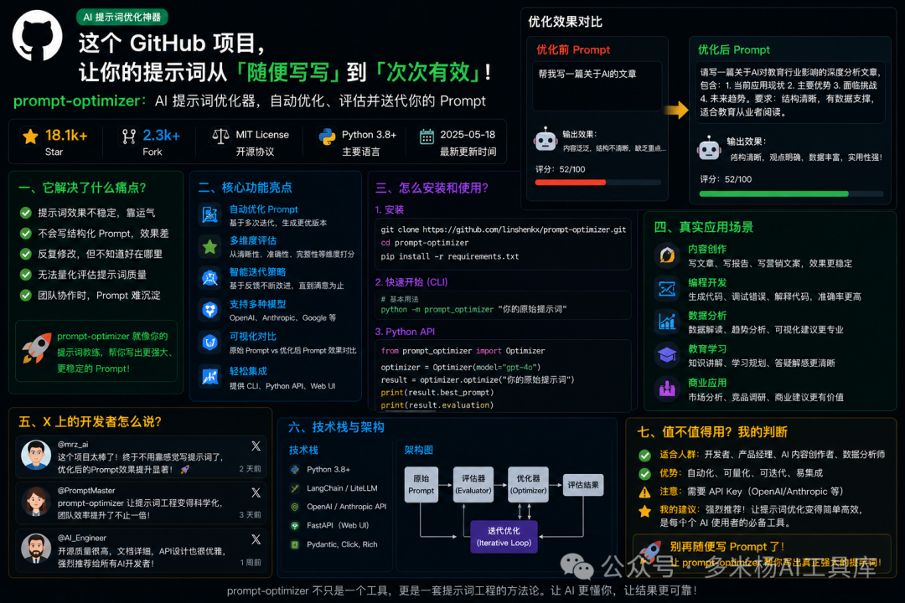

# 这个 GitHub 项目火了：30.9k Star，把你的提示词从"随便写写"变成"可测试、可复用、可迭代"

## 一、🔥 从一个真实抱怨说起

很多人用 AI，最大的误区是什么？

不是不会提问。

而是以为提示词写完就结束了。

你打开 ChatGPT、Claude、Gemini，随手输入一句：

"帮我写一篇公众号文章。"

AI 很快给你一篇。

看起来也完整。

但你仔细一读，就会发现熟悉的味道。

开头很虚。

结构很散。

观点很平。

句子很像模板。

最后还会来一句"总之，在这个快速发展的时代"。

你不满意。

于是继续改。

"更口语化一点。"

"更像爆款一点。"

"少一点 AI 味。"

"再有深度一点。"

一轮一轮折腾下来，时间没少花，结果也不一定稳定。

这就是提示词最大的问题：

**大多数 Prompt 不是被设计出来的，而是被试出来的。**

试出来没问题。

但如果不能保存、测试、评估、复用，它就只是一次性的运气。

今天这个 GitHub 项目，解决的就是这个痛点。

它叫：**prompt-optimizer**。

一句话说：

**它不是提示词合集，而是一套提示词优化、测试、评估和资产管理工具。**

你可以把它理解成：

给 AI 使用者准备的"提示词实验室"。

---

## 二、📦 这个项目是什么

**prompt-optimizer 是一个 AI 提示词优化工具。**

它可以帮你把普通提示词，优化成更清晰、更结构化、更可复用的提示词。

项目 README 里对它的定位很直接：

它可以帮助用户写出更好的 AI prompts，并提升 AI 输出质量。

截至我查看时，GitHub 页面显示：

`linshenkx/prompt-optimizer` 当前约 **30.9k Star / 3.6k Fork**。



这个数据已经不是小工具级别。

它说明一件事：

Prompt 这件事，正在从"玄学手艺"变成"工程流程"。

作者是 **linshenkx / 且炼时光**。

GitHub 个人主页介绍里写着：

"韶华未褪，且炼时光。"

他的热门仓库第一位就是 prompt-optimizer。

从仓库结构看，这个项目也不是简单网页。

它包含 Web、Desktop、Chrome Extension、Docker、MCP、文档站、测试和发布流水线。

它更像一个完整产品。

和普通 Prompt 工具相比，它的区别很明显。

| 对比项 | 普通 Prompt 合集 | 普通 AI 对话 | prompt-optimizer |
| --- | --- | --- | --- |
| 核心定位 | 收集提示词 | 临时问答 | 优化、测试、评估、沉淀提示词 |
| 使用方式 | 复制粘贴 | 即问即答 | 输入原始 Prompt，迭代优化并对比效果 |
| 是否可评估 | 基本没有 | 靠感觉 | 支持分析、单结果评估、多结果对比 |
| 是否可复用 | 靠收藏夹 | 容易丢 | 支持收藏、版本历史、Prompt Garden |
| 适合人群 | 初学者 | 所有人 | AI 重度用户、内容创作者、开发者、团队 |

它最强的地方，

不是给你 1000 条现成提示词。

而是让你手里的提示词，逐渐变成稳定资产。

这点非常关键。

因为真正长期用 AI 的人，最后拼的不是谁会背 Prompt。

而是谁能建立自己的提示词资产库。

---

## 三、⚙️ 核心功能，一个个说清楚

### 1. 一键优化 Prompt：把模糊需求变成结构化指令

这是它最基础，也是最高频的功能。

你输入一段很普通的提示词。

比如：

```
帮我写一篇关于 AI 的文章。
```

优化后，可能会变成：

```
请写一篇面向普通职场人的 AI 趋势分析文章。

要求：
1. 先用一个真实工作场景开头；
2. 解释 AI 对效率、岗位和个人能力的影响；
3. 每个部分给出具体例子；
4. 语言口语化，但保持专业；
5. 结尾给出 3 条可执行建议。
```

这不是简单扩写。

而是把原来模糊的意图，拆成角色、对象、结构、风格、约束和输出目标。

AI 输出变好，很多时候不是模型突然变聪明了。

而是任务终于被说清楚了。

---

### 2. 双模式优化：系统提示词和用户提示词分开处理

prompt-optimizer 支持两种优化模式：

**System Prompt 优化。**

**User Prompt 优化。**

这点很实用。

很多人分不清这两者。

系统提示词更像"长期角色设定"。

比如：

你是一个严格的代码审查员。

你是一个公众号爆文编辑。

你是一个客服质检专家。

用户提示词更像"本次任务说明"。

比如：

帮我审这段代码。

帮我改写这篇文章。

帮我分析这份用户反馈。

把这两类提示词分开优化，价值很大。

因为长期角色要稳定。

单次任务要具体。

很多 AI 工作流不稳定，就是这两层混在一起。

---

### 3. 分析与对比评估：别再凭感觉判断 Prompt 好坏

很多人优化提示词，全靠感觉。

AI 回答看起来顺眼，就觉得好了。

但真正的问题是：

它有没有更准确？

有没有更完整？

有没有更符合任务？

有没有减少歧义？

有没有提升可复用性？

prompt-optimizer 支持分析、单结果评估、多结果对比评估。

这就很像给 Prompt 做 A/B Test。

你可以把原始提示词和优化后的提示词分别跑一遍。

再看哪个输出更好。

这一步非常重要。

因为提示词优化不是玄学。

它应该能被测试。

能被对比。

能被复盘。

---

### 4. 多模型集成：同一条 Prompt，可以跨模型测试

项目 README 显示，它支持很多主流模型。

包括 OpenAI、Gemini、DeepSeek、Grok、智谱 AI、硅基流动、MiniMax 等。

它还支持自定义 OpenAI 兼容接口。

这对国内用户非常实用。

因为我们实际使用 AI 时，往往不是只用一个模型。

写作可能用 Claude。

代码可能用 GPT。

中文任务可能用 DeepSeek。

图片提示词可能用 Gemini 或 Seedream。

同一条 Prompt，在不同模型上的表现并不一样。

prompt-optimizer 的价值就是：

帮你把 Prompt 从"某个模型上的偶然好用"，变成"跨模型可调整的工作资产"。

---

### 5. 图像提示词优化：不是只服务文字模型

这个项目现在不只优化文字提示词。

它也支持图像生成模式。

包括：

Text-to-Image。

Image-to-Image。

Multi-Image generation。

还能支持参考图、风格迁移、多图约束、模型参数配置和结果预览下载。

这对做公众号封面、小红书图、产品海报、AI 绘图的人很有价值。

因为图像提示词最大的问题，往往不是"不够长"。

而是缺少主体、构图、空间关系、材质、光线、风格和情绪锚点。

比如原始提示词：

```
一个夜空中的漂浮图书馆。
```

优化方向可能会变成：

```
一座漂浮在深蓝夜空中的奇幻图书馆，巨大的书架悬浮在云层之间，暖黄色灯光从窗户透出，远处有星河和月光，画面具有电影感，主体居中，空间层次清晰，细节丰富，适合作为幻想主题关键视觉。
```

这不是废话变多。

这是让图像模型知道应该往哪里发力。

---

### 6. Prompt Garden 和收藏夹：把好提示词变成资产

很多人写过好 Prompt。

但过几天就找不到了。

要么散落在聊天记录里。

要么藏在 Notion 里。

要么存在微信文件传输助手里。

最后又重新写一遍。

prompt-optimizer 支持 Prompt Garden、收藏夹、版本历史、资源绑定、导入导出。

这意味着你可以把优化后的提示词保存下来。

下次直接调用。

还能记录来源、示例和历史版本。

这就不只是"提示词优化器"。

它开始变成一个提示词资产管理系统。

---

### 7. MCP 支持：把优化能力接进 Claude Desktop

项目支持 Model Context Protocol，也就是 MCP。

Docker 部署后，MCP Server 可以通过 `/mcp` 路径访问。

README 里还列出了几个工具：

`optimize-user-prompt`

`optimize-system-prompt`

`iterate-prompt`

这意味着你可以把 prompt-optimizer 接到 Claude Desktop 这类 MCP 客户端里。

然后让 AI 自己调用它来优化提示词。

这件事很关键。

过去是人打开工具优化 Prompt。

未来可能是 Agent 自己发现提示词不够好，然后调用工具迭代。

这就从"人用工具"，变成了"Agent 自我改进工作流"。

---

## 四、🚀 怎么装、怎么用

### Step 1：直接用在线版

最快方式是访问在线版：

```
https://prompt.always200.com
```

README 里说明，这是纯前端项目。

数据存储在本地浏览器，不会上传到服务器。

✅ 关键点：

适合第一次体验。

不用安装，不用部署。

---

### Step 2：下载桌面版

如果你经常用，推荐桌面版。

项目在 GitHub Releases 提供 Windows、macOS、Linux 版本。

桌面版有几个优势：

不受浏览器 CORS 限制。

可以直接连接本地 Ollama。

可以连接商业 API。

响应更稳定。

支持自动更新。

✅ 关键点：

如果你要接本地模型，桌面版比网页更稳。

macOS 如果提示"已损坏"或"无法验证开发者"，README 给了处理命令：

```
xattr -rd com.apple.quarantine /Applications/PromptOptimizer.app
```

---

### Step 3：Chrome 插件方式

如果你习惯浏览器工作流，可以安装 Chrome Extension。

安装后点击图标即可打开 Prompt Optimizer。

✅ 关键点：

适合经常在浏览器里用 ChatGPT、Claude、Gemini 的人。

---

### Step 4：Docker 一键部署

如果你想自己部署，可以用 Docker。

默认运行：

```
docker run -d -p 8081:80 \
  --restart unless-stopped \
  --name prompt-optimizer \
  linshen/prompt-optimizer
```

带 API Key 和访问密码：

```
docker run -d -p 8081:80 \
  -e VITE_OPENAI_API_KEY=your_key \
  -e ACCESS_USERNAME=admin \
  -e ACCESS_PASSWORD=your_password \
  --restart unless-stopped \
  --name prompt-optimizer \
  linshen/prompt-optimizer
```

然后访问：

```
http://localhost:8081
```

✅ 关键点：

公开部署时，不要随便把 API Key 暴露到前端环境。

README 也提醒，`VITE_*` 变量会进入浏览器资产。

---

### Step 5：Docker Compose 部署

也可以克隆项目后用 compose：

```
git clone https://github.com/linshenkx/prompt-optimizer.git
cd prompt-optimizer
```

创建 `.env`：

```
VITE_OPENAI_API_KEY=your_openai_api_key
VITE_GEMINI_API_KEY=your_gemini_api_key
VITE_DEEPSEEK_API_KEY=your_deepseek_api_key
ACCESS_USERNAME=admin
ACCESS_PASSWORD=your_password
```

启动：

```
docker compose --env-file .env -f docker/docker-compose.yml up -d
```

✅ 关键点：

这种方式适合团队内网部署。

---

### Step 6：接入 Claude Desktop MCP

Docker 部署后，MCP 服务地址通常是：

```
http://localhost:8081/mcp
```

在 Claude Desktop 的服务配置里添加：

```
{
  "services": [
    {
      "name": "Prompt Optimizer",
      "url": "http://localhost:8081/mcp"
    }
  ]
}
```

✅ 关键点：

接入 MCP 后，它就不只是网页工具，而是 Agent 的提示词优化能力。

---

## 五、💡 三个真实场景，看它怎么用

### 场景一：公众号作者优化爆文提示词

背景：

你每天写公众号。

但每次让 AI 写稿，结果都不稳定。

有时像营销号。

有时像报告。

有时像机器翻译。

你真正需要的不是一篇稿子。

而是一条稳定的公众号写作 Prompt。

操作：

把你原来的提示词丢进去：

```
帮我写一篇关于 AI 工具的公众号文章，口语化一点，标题吸引人。
```

让 prompt-optimizer 优化成结构化版本。

再用测试模式对比原 Prompt 和优化 Prompt 的输出。

最后把表现更稳定的版本收藏起来。

效果：

你以后不再每次从零调教 AI。

而是直接调用一条成熟的写作 Prompt。

这对日更作者非常重要。

---

### 场景二：企业团队沉淀客服和销售话术

背景：

一个企业客服团队想用 AI 帮忙回复用户问题。

但如果 Prompt 写得太粗，AI 很容易乱说。

客服场景最怕两件事：

回答不一致。

承诺过度。

操作：

先写系统提示词：

```
你是品牌客服，请礼貌回复用户问题。
```

再用 System Prompt 优化模式，把它变成更完整的客服角色规范。

比如包含：

品牌语气。

禁止承诺。

退款边界。

升级人工客服条件。

常见问题处理流程。

最后用多轮对话测试各种用户问题。

效果：

客服 AI 不再只会"亲亲您好"。

而是能在规则边界内稳定回复。

这比临时写提示词靠谱得多。

---

### 场景三：AI 绘图和公众号封面提示词优化

背景：

你做公众号封面图。

每次提示词都写得很随意。

比如：

```
做一张 AI 工具的封面图，科技感。
```

结果生成出来，不是字乱，就是风格跑偏。

操作：

用图像提示词优化模式。

补充画面主体、构图、色彩、风格、用途和限制。

比如：

16:9。

公众号头图。

中文大标题少于 12 个字。

深色科技背景。

中心元素是 AI Agent 工作台。

不要大段小字。

效果：

图片提示词从一句模糊需求，变成可执行视觉指令。

生成质量会明显稳定。

尤其适合公众号封面、小红书首图、产品海报。

---

## 六、🐦 X 上的人怎么说

我查了一圈公开讨论。

这个项目在 X、GitHub Topics、开源社区和技术博客里都有传播。

### 1. Rohan Paul：它能帮助改进 Prompt，提升 LLM 输出

X 上有开发者分享过这个项目，核心评价是：

它可以帮助你 refine AI prompts，从而获得更好的 LLM 输出。

我的点评：

这个说法很准确。

prompt-optimizer 的价值不是给你一个神奇 Prompt。

而是让"改 Prompt"这件事变得更可操作。

### 2. GitHub Topics：它已经是 prompt-optimization 话题下的头部项目

GitHub Topics 页面显示，`linshenkx/prompt-optimizer` 是 prompt-optimization 相关主题下非常靠前的项目。

项目描述也很直接：

An AI prompt optimizer for writing better prompts and getting better AI results。

我的点评：

这说明它不只是中文圈工具。

在整个 prompt optimization 方向里，它已经有明显存在感。

### 3. Trendshift：项目热度持续增长

Trendshift 页面显示，这个项目 Star 已经超过 30k，Fork 超过 3k，并且近期仍有提交。

我的点评：

这种项目最怕昙花一现。

但 prompt-optimizer 的提交、Release、文档、桌面端、扩展端都在持续更新。

它更像长期产品，而不是一次性 Demo。

### 4. 技术博客：它覆盖 Prompt 全生命周期

有技术博客把它总结为：

一个覆盖 Prompt 全生命周期的成熟工具。

包括优化、测试、评估、收藏、MCP 支持和纯客户端架构。

我的点评：

"全生命周期"这个词很关键。

因为真正的 Prompt 工程，不是写一句话。

而是从设计、测试、迭代、评估到沉淀的完整链路。

### 5. 我的判断

X 上和社区里对它的讨论，本质上都指向同一个趋势：

Prompt 不再只是个人技巧。

Prompt 正在变成团队资产。

工具化、评估化、版本化、MCP 化，都是这个趋势的表现。

---

## 七、🎯 值不值得用？我的判断

说句实话，

这个项目非常值得用。

尤其适合四类人。

第一类，

AI 自媒体和公众号作者。

你可以用它优化写作 Prompt、标题 Prompt、选题 Prompt、改写 Prompt、封面图 Prompt。

把每次调教 AI 的经验保存下来。

第二类，

产品经理和运营人员。

你可以用它沉淀需求分析、竞品分析、用户访谈总结、数据复盘的 Prompt。

让团队输出更稳定。

第三类，

开发者和 AI Agent 用户。

你可以优化系统提示词，设计更稳定的代码审查、文档生成、测试分析、Bug 排查角色。

还能通过 MCP 接入 Claude Desktop。

第四类，

企业内部 AI 推广负责人。

如果公司里很多人都在用 AI，但输出质量参差不齐，prompt-optimizer 很适合做提示词标准化工具。

让好 Prompt 被保存、测试、复用。

当然，它也有局限。

第一，

它不能替你判断业务。

Prompt 再好，也需要你知道自己要什么。

第二，

优化结果仍然要测试。

不是变长就更好。

不是结构多就更好。

最终要看输出是否真的变稳定。

第三，

公开部署时要注意 API Key 安全。

尤其是前端环境变量，不要误以为完全私密。

我的最终判断是：

**prompt-optimizer 真正厉害的地方，不是帮你写 Prompt，而是帮你把 Prompt 从"临时灵感"变成"可复用资产"。**

这就是 AI 使用者进阶的关键。

新手靠感觉写 Prompt。

高手会测试 Prompt。

团队会管理 Prompt。

未来每个会用 AI 的人，可能都需要自己的 Prompt 资产库。

最后一句话：

**别再把提示词当咒语了，它应该像产品一样，被设计、测试、迭代和沉淀。**
