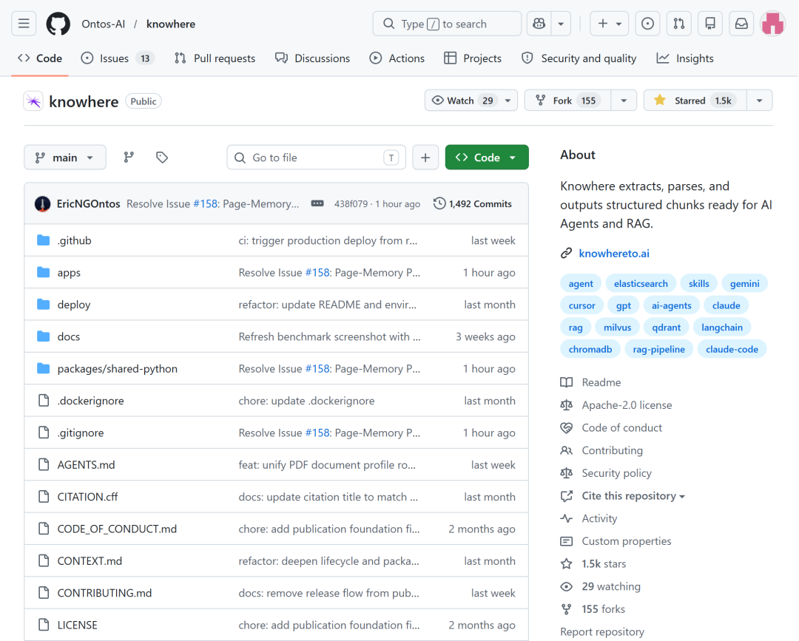
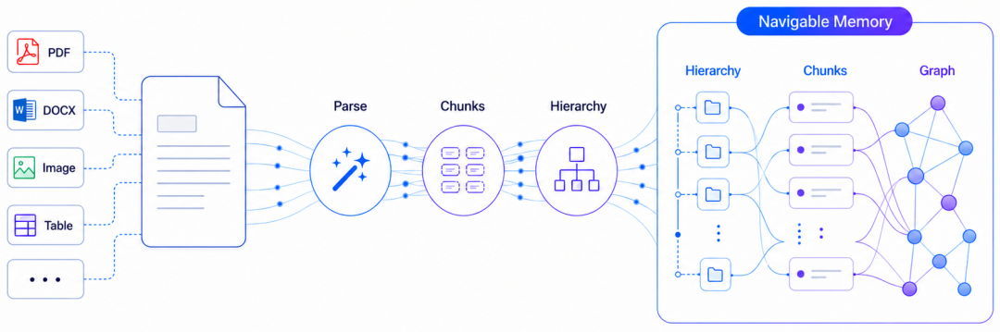
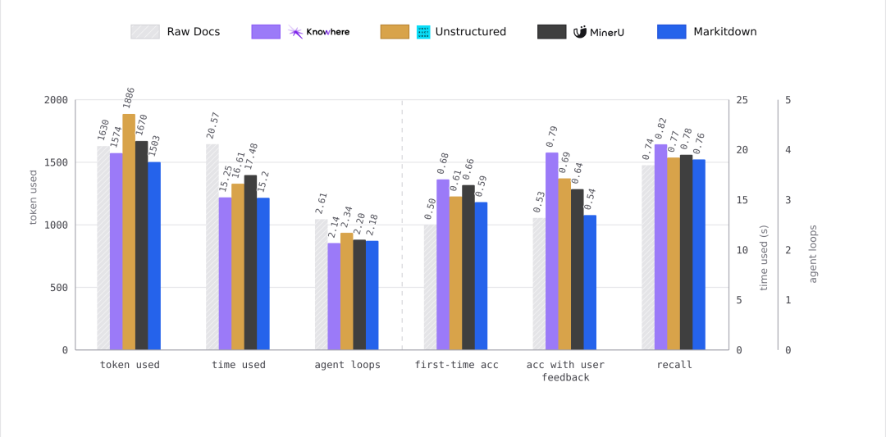

# 一个月拿下1500star，只因我们比MinerU多做了这件事

2026 年 5 月 7 日，我们把 Knowhere 的完整技术栈开源了。

一个月左右，GitHub Star 突破 1500。对一个偏基础设施、偏工程落地的项目来说，这个速度让我们挺意外，也挺兴奋。



但更有意思的是，Knowhere 做的不是一个看起来特别“炫”的东西。它没有更新大模型，也没有做一个新的龙虾助手，它盯住的是 RAG 和 AI Agent 落地里最脏、最累、也最容易被低估的一环：

文档怎么变成 Agent 真正能用的知识。

很多人第一次看 Knowhere，会问同一个问题：

“这不就是文档解析吗？和 MinerU 有什么区别？”

这个问题问得非常好。因为 Knowhere 和 MinerU 的关系，正好解释了我们为什么要做这个项目。

MinerU 做解析Knowhere 还做解析之后的事

MinerU 是一个很优秀的文档解析工具。它能把 PDF 里的文字、标题、表格、图片等内容提取出来，并转换成 Markdown。

但问题在于：解析成 Markdown，并不等于文档已经能被 Agent 理解。

你拿到一份 Markdown 后，通常还要做这些事：

把它切成 Chunk，扔进向量库，然后让 Agent 或 RAG 系统去检索。

听起来很顺，但真正做过的人都知道，坑就在这里。

一份复杂 PDF 原本有章节、有层级、有表格、有图片、有跨页引用。解析成 Markdown 之后，这些结构信息会变弱；再经过切片，每个 Chunk 更像是被切下来的孤立文本片段。

它可能不知道自己属于哪一章，前后文是什么，旁边那张表格在说明什么，相关图片和正文是什么关系。

于是 Agent 检索时，拿到的只是几个“看起来相似”的片段。它不知道"第3章第2节有一张对比表格，刚才检索到的那段文字其实是对这张表格的说明"。它只能把几个相似度最高的碎片拼在一起，交给 LLM 凑答案。

这就是为什么很多团队用 MinerU 搭 RAG 之后，效果并不是很满意。不是 MinerU 的问题，是文档被打平之后丢失的结构信息，没人帮它找回来。

而 Knowhere ，就是想要解决这个问题。

它不是要做“下一个 MinerU”，它想做的是补上 MinerU 没做到的那一步：

把解析出来的文本，继续变成 Agent 可以导航、可以引用、可以推理的长期记忆。

Knowhere 是怎么做的？

Knowhere 的定位是：

复杂、脏乱文档和 AI Agent 之间的 Memory Layer。

它不是简单地把文档解析成文本，而是把文档处理成一套可持续使用的结构化记忆。

在解析和向量化之间，Knowhere 插入了一个结构重建的流水线：

第一，重建文档层级。

Knowhere 会用树形结构算法恢复文档里的章节关系。每个 Chunk 不再只是一个孤立文本块，而是知道自己在哪个标题下、处于哪一层级、上下文路径是什么。

第二，处理多模态内容。

图片、表格不再只是“附件”或者“丢失的信息”。Knowhere 会对图片做 OCR 和描述，对表格做摘要和结构化处理，并把它们和来源 Chunk 关联起来。这样 Agent 检索时，不只是检索文字，也能拿到相关图表证据。

第三，构建轻量记忆图谱。

当文档被拆成 Chunk 后，Knowhere 会保存导航树、摘要、图谱链接等信息，让文档不再是平铺文本，而是一张可以被 Agent 走动和追踪的知识结构。当你上传多份文档，Knowhere 会在文档之间建立关联，形成一张可导航的跨文档知识图谱。

第四，提供 Agentic Retrieval。

传统 RAG 更多是向量相似度检索，拿几个片段就交给 LLM。Knowhere 的检索会融合关键词、路径、内容和语义信号，让 Agent 先发现相关区域，再沿着章节树和图谱链接继续深入，最后返回可溯源的结果。

这就是那件“比 MinerU 多做的事”。

MinerU 只把 PDF 变成 Markdown。

Knowhere 则会把 Markdown 进一步变成 Agent 能用的记忆。

Knowhere 比 MinerU 多做的不是一个小功能，而是把“解析后的文档如何进入 RAG/Agent 系统”这整条链路补齐了。



效果怎么样？

我们做过内部评测：在相同的 Agentic RAG 任务里，让 Agent 分别基于原始文档、普通 parser 输出，以及 Knowhere 处理后的结构化记忆来完成搜索、修改、问答等任务。

结果很直接：

- 首次准确率提升 36%

- 召回率提升 11%

- 反馈时准确率达到 79%，而直接使用原始文档大约会卡在 53% 左右

- Agent 循环次数更少，Token 消耗更低，完成任务更快



原因也不复杂。

如果 Agent 面对的是一整坨文本，那它只能盲找。

但如果 Agent 面对的是一棵树、一张图、一组带来源路径的 Chunk，它就可以像人读文档一样：先看目录，再定位章节，再进入细节。

这就是结构带来的差异。

Knowhere 能用来做什么？

如果你的 AI 应用需要从文档里拿信息，Knowhere 就有用。

比如企业内部知识库——

产品手册、操作规程、FAQ、培训资料，很多都不是简单文本，而是 PDF、Word、PPT、Excel 混在一起。Knowhere 可以把这些文档处理成 Agent 可检索的结构化记忆。

比如技术文档助手——

设备说明书、API 文档、工程图纸、维护手册，经常又长又复杂。Knowhere 已经支持超长 PDF 和 atlas-style documents，几百页的技术手册、图纸集合也能走专门的布局感知 parser。

比如合同和报告分析——

法律文件、财报、招投标文件、研究报告都非常依赖上下文，如果只靠平铺切片，很多引用关系和章节逻辑会丢。Knowhere 的章节路径和证据引用能让结果更稳。

比如 Agentic RAG ——

很多团队现在不是只做“问答”，而是希望 Agent 能基于文档完成多步任务，那就更需要文档本身是可导航的，而不是一堆碎片。

和 MinerU 相比，Knowhere 的优势在哪里？

准确说，Knowhere 不是 MinerU 的替代品，而是 MinerU 的更进一步。

MinerU 擅长文档解析，它把 PDF 里的文字、标题、表格、图片等内容提取出来，生成 Markdown 或结构化结果。对很多开发者来说，这一步已经非常有价值。

但如果你的目标是搭 RAG 或 Agent 知识库，解析只是第一步。后面还要做 Chunk 组织、Embedding、索引入库、检索逻辑、证据引用、文档更新等一整套工作。

Knowhere 的价值就在这里：它不只给你一份解析结果，而是把文档继续处理成可以直接被 Agent 检索和使用的记忆。你不需要再自己额外拼 chunking、embedding、向量库、检索 API 这些链路，Knowhere 已经把它们放进同一套流程里。

如果说 MinerU 帮你把文档“读出来”，Knowhere 则进一步帮你把文档“接进 AI 应用”。

Knowhere 的优势主要在这些地方：

- 它会重建文档层级，不只是输出平铺文本。

- 它会生成结构化 Chunk，并保留 Chunk 的语义上下文。

- 它会处理图片和表格，并把多模态内容关联回原文。

- 它会完成索引与检索发布，让文档进入可查询的命名空间。

- 它提供 Agentic Retrieval，而不只是把文本交给你自行接向量库。

- 它支持文档生命周期管理，可以更新、查询、归档文档。

- 它不挑模型，默认可用 DeepSeek 和 Qwen-VL，也可以通过环境变量切换 OpenAI、DashScope、智谱、火山等模型提供商。

- 它完整开源，支持自托管，适合数据不能出内网的团队。

一句话总结就是：

MinerU 解决“读出来”，Knowhere 解决“接入 RAG 和 Agent 后真正用起来”。

怎么开始使用 Knowhere？

三条路径，任君挑选：

路径一：云端 API——最快上手

打开knowhereto.ai注册，新用户有 $5 免费额度，不需要自己搭任何服务。

安装 Python SDK：

```bash
pip install knowhere-python-sdk
```

解析一份在线 PDF：

```python
import knowhere
client = knowhere.Knowhere(api_key="sk_your_key")
result = client.parse(url="https://example.com/report.pdf")
print(result.statistics.total_chunks)
print(result.full_markdown[:500])
```

解析本地文件：

```python
from pathlib import Path
result = client.parse(file=Path("report.pdf"),
    parsing_params={"model":"advanced","ocr_enabled":True})
print(result.manifest.source_file_name)
print(len(result.chunks))
print(result.document_id)  # 保存这个 ID
```

按类型访问不同 Chunk：

```python
# 文本 Chunk，带关键词和摘要
for chunk in result.text_chunks:
    print(chunk.keywords)
    print(chunk.summary)

# 表格 Chunk，保留 HTML 结构
for chunk in result.table_chunks:
    print(chunk.html[:100])

# 图片 Chunk，可保存到本地
for chunk in result.image_chunks:
    chunk.save("./output/")
```

一键保存所有结果：

```python
result.save("./output/report/")
```

路径二：接入 RAG 检索

解析之后，如果想让 Agent 检索文档，把文档发布到命名空间，再用检索 API 查询：

```python
# 第一步：发布文档到命名空间
job = client.jobs.create(
    source_type="url",
    source_url="https://example.com/manual.pdf",
    namespace="support-center",
)
job_result = client.jobs.wait(job.job_id)
document_id = job_result.document_id
if document_id is None:
    raise RuntimeError("Expected document_id")

# 第二步：检索
response = client.retrieval.query(
    namespace="support-center",
    query="How do I reset Bluetooth pairing?",
    top_k=5,
    channels=["path", "term"],
    filter_mode="keep",
    signal_paths=["Bluetooth", "Pairing"],
)
for item in response.results:
    print(item.content, item.score)
    print(item.source.source_file_name, item.source.section_path)
```

文档有新版本时，用同一个document_id更新：

```python
update_job = client.jobs.create(
    source_type="url",
    source_url="https://example.com/manual-v2.pdf",
    document_id=document_id,
)
```

不再需要时归档：

```python
client.documents.archive(document_id)
```

路径三：私有化部署——数据不出内网

使用knowhere-self-hosted，需要提前准备：

- Docker 和 Docker Compose

- MinerUAPI Key：用于 PDF 解析

- 大模型 API Key：DeepSeek或阿里云百炼 DashScope二选一

在项目根目录创建.env文件：

使用 DeepSeek：

```
MINERU_API_KEYS=your-mineru-api-key
DS_KEY=your-deepseek-api-key
```

使用阿里云百炼：

```
MINERU_API_KEYS=your-mineru-api-key
ALI_API_KEYS=your-dashscope-api-key
NORMOL_MODEL=qwen-plus
HIERARCHY_LLM_MODEL=qwen-plus
IMAGE_MODEL=qwen3.6-flash
IMAGE_MODEL_MAX=qwen3.6-flash
```

多个 Key 用逗号分隔，Knowhere 会自动轮换，缓解单 Key 限速问题：

```
MINERU_API_KEYS=mineru-key-1,mineru-key-2
```

国内拉取镜像慢，加这一行走阿里云镜像：

```
KNOWHERE_IMAGE=knowhere-registry.cn-shenzhen.cr.aliyuncs.com/knowhere/knowhere:latest
```

启动：

dockercompose up -d

启动后：

- **Dashboard**：http://localhost:3000/login

- **API 健康检查**：http://localhost:5005/health

- **API 文档（Swagger）**：http://localhost:5005/docs

常用命令：

```bash
docker compose ps          # 查看服务状态
docker compose logs -f app # 实时日志
docker compose pull && docker compose up -d  # 更新
docker compose down        # 停止
```

自托管版本默认会发送匿名产品遥测，不包含文档内容、文件名、用户身份等任何敏感信息。如需关闭：

```
TELEMETRY_ENABLED=false
```

最后

Knowhere 一个月拿下 1500 Star，不是因为我们比谁更会讲故事，而是因为很多团队真的卡在同一个地方：

文档已经解析了，但 Agent 还是用不好。

Knowhere 则把解析工作往后走了一步：把 Markdown、图片、表格、章节层级和跨文档关系，组织成 Agent 能导航、能引用、能检索的记忆。

这一步听起来不性感，但很关键。

因为 AI 应用真正落地时，模型能力只是开始。

让模型拿到正确、完整、可追溯的知识，才是决定体验的地方。

如果你正在做 RAG、企业知识库、文档问答、Agent 工具链，欢迎来试试 Knowhere。

GitHub：https://github.com/Ontos-AI/knowhere

主页：https://knowhereto.ai

关于我们

Meta Structure 团队是专注知识治理和 AI 智能体赛道的创新者，依托自身长期积累的技术实力，致力于打造真正可落地的企业及个人 AI 解决方案，帮助各类组织及个人实现知识智能化管理与高效决策支持。核心研发团队由人工智能、自然语言处理、语义挖掘等领域资深专家组成，成员主要来自中国科学院、清华大学、北京大学等顶尖科研机构与海内外重点高校，同时汇聚了出身于腾讯、华为等一线科技公司的算法专家与工程师实践者。我们的核心能力是深度融合自研 RAG 技术与大模型推理能力，实现多模态数据治理、自动化建库、知识结构化解析关联、专业个性化多模态内容检索生成等功能，算法效率行业领先。我们相信，大模型的未来，不只是“通用智能”，而是真正懂你知识、守你数据、助你解决问题的私有智能体。无论是企业应用，还是个人助手，这都是我们正在全力奔赴的方向。Ontos AI
